# Architecture interne des systèmes d'exploitation 操作系统内部体系结构

## Introduction 引言

Système d'exploitation
操作系统

Ligne de commande
命令行

Processus et fils d'exécution
进程与线程

Entrées et sorties
输入与输出

## Supports 支撑材料

Transparents du cours Travaux pratiques
课程幻灯片与实践练习

https://felsoci.sk/aise/lecture.pdf  
https://felsoci.sk/aise/practice.html

## Evaluation 评估方式

QCMs (un par journée de cours, 10%)  
每日一次的选择题测验，占10%
projet avec soutenance (40%)  
含答辩的项目，占40%
contrôle écrit (50%)
笔试，占50%

Qu'est-ce qu'un système d'exploitation?
什么是操作系统？

## Origines 起源

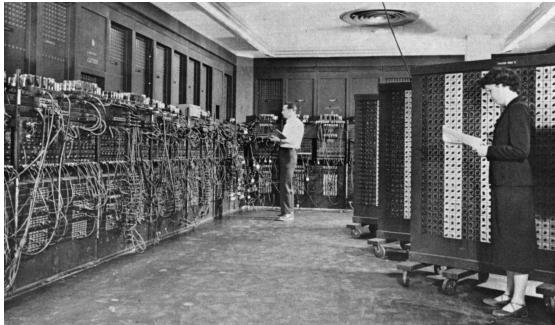

Ordinateur ENIAC à Aberdeen Proving Ground, Maryland, É.-U. A. Glen Beck et Betty Snyder programmert l'ordinateur dans le bâtiment 328 du laboratoire de recherche balistique (U.S. Army, Domaine public, par Wikimedia Commons).
位于美国马里兰州阿伯丁试验场的 ENIAC 计算机，Glen Beck 与 Betty Snyder 在弹道研究实验室328号楼内为其编程（美国陆军，公共领域，Wikimedia Commons）。

  
Ordinateur ENIAC à Aberdeen Proving Ground, Maryland, É.-U. A. Glen Beck et Betty Snyder programmert l'ordinateur dans le bâtiment 328 du laboratoire de recherche balistique (U.S. Army, Domaine public, par Wikimedia Commons).
位于美国马里兰州阿伯丁试验场的 ENIAC 计算机，Glen Beck 与 Betty Snyder 在弹道研究实验室328号楼内为其编程（美国陆军，公共领域，Wikimedia Commons）。

programmation par câblage manuel des unités  
通过手工布线控制各功能单元实现编程
lecture des résultats sur des indicateurs lumineux  
借助指示灯读取计算结果
exécution d'un seul programme à la fois  
同一时间只能运行一个程序
aucun système d'exploitation
没有操作系统

  
Machine IBM 704 à Hampton, Virginie, E.-U. A. Un homme et une femme travaillant au centre de recherche Langley avec cette machine utilisée en recherche aeronautique (National Advisory Committee for Aeronautics, domaine public, par Wikimedia Commons).
美国弗吉尼亚州汉普顿的IBM 704 计算机，兰利研究中心的一男一女科研人员利用其开展航空研究（美国国家航空咨询委员会，公共领域，Wikimedia Commons）。

  
Ensemble de cartes perforées représentant un programme écrit en langage PL/1 pour IBM 360 (Arnold Reinhold, Creative Commons BY-SA 3.0, par Wikimedia Commons).
一组为 IBM 360 编写的 PL/1 程序所使用的穿孔卡片（Arnold Reinhold，CC BY-SA 3.0，Wikimedia Commons）。

automatisation du passage des programmes  
程序切换过程实现自动化

- traitement parlots par un programme moniteur resident en mémoire  
- 由驻留内存的监控程序处理批处理作业
- exécution d'un seul programme à la fois  
- 一次仍只能执行一个程序
- premiers embryos des systèmes d'exploitation
- 操作系统的最初雏形出现

## Multi-programmation 多道程序

- séparation de la mémoire en partitions contenant des programmes différents
- 将内存划分成多个分区以容纳不同程序

introduction d'une unité de gestion de la mémoire
引入内存管理单元

- rentabilisation du temps mort lie aux entrées et aux sorties d'un programme
- 利用程序 I/O 空闲时间提升吞吐

introduction d'un mecanisme d'interruptions
引入中断机制

## Spooling 假脱机技术

- pré-chargement de programmes depuis les cartes perforées vers le disque  
- 先把穿孔卡上的程序预加载到磁盘
démarrage du programme suivantès la fin d'execution du programme précédented  
前一程序结束后立即启动下一程序
problèmes de partage des ressources
随之带来资源共享难题

## Temps partagé 分时系统

accueil simultanné de plusieurs utilisateurs  
可同时服务多名用户

- allouer le processeur pour une petite quantité de temps à tour de rôles
- 以轮转方式为每位用户划分短时间片

quantum, par exemple 20 ms
典型时间片示例：20 毫秒

## Télétype 电传打字终端

- saisie de commandes sur le clavier  
- 通过键盘输入命令
impression directe du résultat  
直接在纸带上打印结果
introduction d'un langage de commandes
引入命令语言

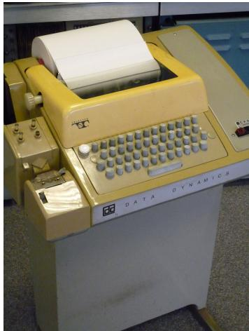  
Téletype ASR33 (AliaonW, Creative Commons BY-SA 3.0, par Wikipedia Commons).
Teletype ASR33 终端（AlisonW，CC BY-SA 3.0，Wikipedia Commons）。

## Mise en place du temps partagé 分时系统的实施

1 reprise du contrôle à la fin de quantum
1 在时间片结束时收回控制权

horloge avec interruption
配备可触发中断的时钟

2 gestion des utilisateurs
2 用户管理

- attribution d'identité
- 分配用户身份

- validation et autorisations
- 认证与授权

3 garanties sur la sécurité
3 安全保障

modes d'exécution privégie et non-privilégé
区分特权模式与非特权模式

## Appels système 系统调用

- basculement en mode privilégie  
- 切换至特权模式
- verification des paramètres et des droits utilisateurs  
- 校验参数与用户权限
- accès au disque pour dire un fichier, ...
- 执行受控的磁盘读写等操作

## Rôle 角色定位

1 rentabiliser l'usage de l'ordinateur  
1 最大化计算机使用效率
2 partager équitablement les ressources matérielles  
2 公平分配硬件资源
3 offrir une interface avec le matériel  
3 提供统一的硬件接口
4 permettre à des utilisateurs d'editor, développer, lancier des programmes  
4 允许用户编辑、开发并运行程序
5 offrir les garanties de sécurité nécessaires
5 提供必要的安全保障


# Objectifs 总体目标

1 partager équitablement les ressources
1 公平共享资源

mémoire vivie  
内存
temps processeur  
处理器时间
carte réseau  
网络适配器
espace disque  
磁盘空间
1

2 garantir la sécurité des données
2 确保数据安全

protégé les données des processus  
保护各进程数据
faire respecter les droits d'accès aux fichiers  
强制执行文件访问权限
1

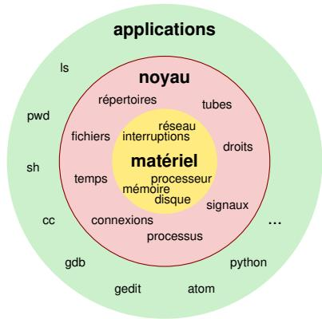

# Principes fondamentaux 基本原则

installé en mémoire dés le démarrage de l'ordinateur  
自启动阶段即驻留在内存
exécution en mode privilégie
运行于特权模式

accès à toutes les ressources matérielles
可访问所有硬件资源

mise à disposition des abstractions
向上层提供抽象接口

$\blacksquare$  contrôle d'accès aux ressources matérielles
$\blacksquare$  控制对硬件资源的访问

exécution des applications en mode non-privilégé
应用在非特权模式下执行

contexte de processus  
维护进程上下文
applés au noyau via les primitives système
通过系统原语调用内核

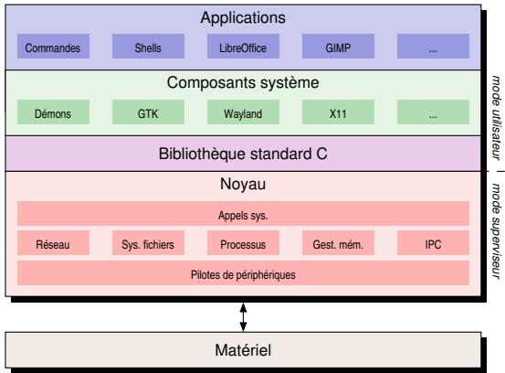  
Vue schématique du noyau Unix/Linux.
Unix/Linux 内核的示意图。

# Principales abstractions 主要抽象

processus - co-existence de plusieurs applications en mémoire et partage du temps processeur  
进程：在内存中并行驻留多个应用并共享 CPU 时间
- fichier et pérophérique - éviter des accès directs au matériel  
- 文件与设备：避免对硬件的直接访问
- utilisateur - accueil de plusieurs utilisateurs sur un même ordinateur  
- 用户：在同一台机器上支持多用户会话
tube - communication entre processus sur le même système  
管道：在同一系统的进程间通信
- socket - communication entre processus sur des machines distinctes  
- 套接字：跨主机进程间通信
- signal - gestion d'événements asynchrones
- 信号：处理异步事件

# Familles 系统家族

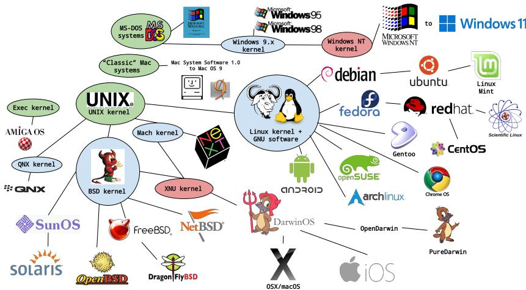  
Scheme par Ethan Gates (Creative Commons BY-SA 3.0).
Ethan Gates 绘制的架构示意图（CC BY-SA 3.0）。

# UNIX®
UNIX®（Unix 家族）

# An Open Group Standard
开放组织标准

- basé sur la philosophie kiss « keep it simple, stupid »  
- 遵循 KISS（保持简单）理念
- écrit en langage C et en assembleur  
- 主要以 C 语言和汇编实现
séparation nette entre le noyau et les applications  
内核与应用之间界限清晰
tout est fichier  
万物皆文件
pas de structure interne des fichiers  
不对文件强加内部结构
interface utilisateur simple  
提供简洁的用户接口
portable  
具备良好的可移植性
omnipresent dans le domaine du calcul haute-performance à travers GNU/Linux
在高性能计算领域通过 GNU/Linux 广泛部署

- appels au noyau depuis les applications  
- 应用通过系统调用与内核交互
- accesses à travers une interface de programmation en langage C
- 通过 C 语言 API 访问系统服务

# Examples 示例

```c
// ouverture d'un fichier 
int open(const char \* path, int flag, mode_t mode);   
// recupération de l'identifiant d'un utiliser 
uid_t getuid(void);
```

# Portable Operating System Interface 可移植操作系统接口（POSIX）

# Norme de programmation système 系统级编程规范

primitives système et fonctions de bibliothèque  
涵盖系统原语与库函数

- commands (sh, ls, tr, ...)  
- 命令（sh、ls、tr 等）
 extensions (temps réel, fils d'exécution, séraphores, échange de messages...)
扩展能力（实时、线程、信号量、消息传递等）

# Norme IEEE Std 1003.1
IEEE Std 1003.1 标准

version actuelle date de 2024  
当前版本日期为 2024 年
https://pubs.opengroup.org/onlinepubs/9799919799/

Introduction
引言

Système d'exploitation
操作系统

Ligne de commande
命令行

Processus et fils d'exécution
进程与执行线程

Entrées et sorties
输入与输出

# Mode d'interaction 交互模式

Téléotype (TTY) - 电传打字机

mode d'interaction avec l'ordinateur privilégé depuis les années 1970 même après l'arrivée des écrans graphiques multi-fenêtres  
自上世纪70年代即成为主流特权交互方式，即便图形多窗口系统出现后仍被沿用

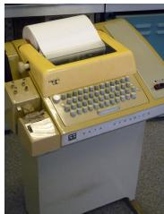  
Téléotype ASR33 (AlisonW, Creative Commons BY-SA 3.0, par Wikimedia Commons).
Teletype ASR33 电传打字终端（AlisonW，CC BY-SA 3.0，Wikimedia Commons）。

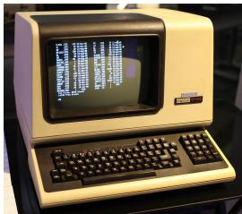  
Terminal DEC-VT100 (Jason Scott, Creative Commons BY 2.0, par Wikipedia Commons).
DEC VT100 终端（Jason Scott，CC BY 2.0，Wikipedia Commons）。

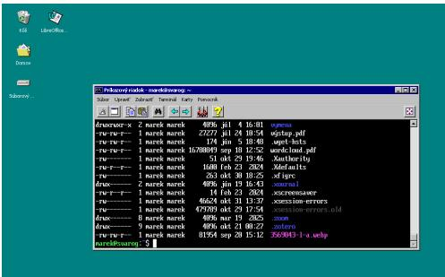  
Emulateur de terminal Xfce.
Xfce 终端仿真器。

préciision et contrôle sur les opérations  
提供高精度、可控的操作体验
automatisation de tâches
便于任务自动化

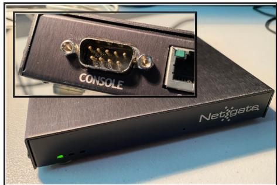  
Pare-feu Netgate disponible d'un port série (Alan Formy-Duval, Creative Commons BY-SA 4.0).
可通过串口访问的 Netgate 防火墙（Alan Formy-Duval，CC BY-SA 4.0）。

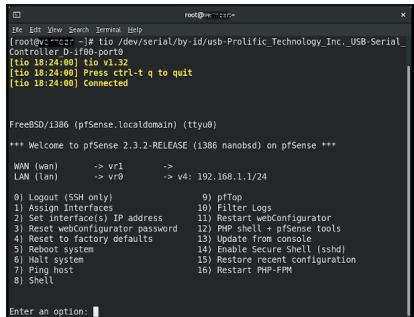  
Fenetre d'un terminal Linux connecté au pare-feu via son port série (Alan Formy-Duval, Creative Commons BY-SA 4.0).
通过串口连接防火墙的 Linux 终端窗口（Alan Formy-Duval，CC BY-SA 4.0）。

- interaction avec des machines sans écran  
- 可操作无显示输出的设备
- pilotage à distance
- 支持远程控制

## Terminal moderne 现代终端

🔹 TTY（本地虚拟终端）

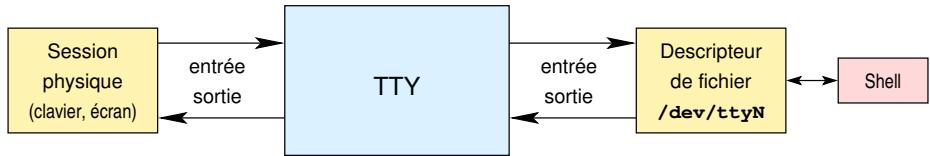

interface appelée TTY-teletype terminal  
称为 TTY（电传打字）终端的接口
- assure une abstraction stable du flux d'entrée/sortie entre le noyau et les applications  
  在内核与应用之间提供稳定的输入输出抽象层
- canaux de communication bidirectionnels  
- 双向通信通道

🔹 TTYs（控制台与串口）

- Console système (Console Terminal) — `/dev/console`, `/dev/tty0`  
  系统控制台终端，用于聚合/承载当前控制台
- Console virtuelle (Virtual Console) — `/dev/tty1`～`/dev/tty6`  
  虚拟控制台，可本地切换多个登录会话
- Terminal série (Serial TTY) — `/dev/ttyS0`, `/dev/ttyUSB0`  
  串口终端，常用于本地或嵌入式调试

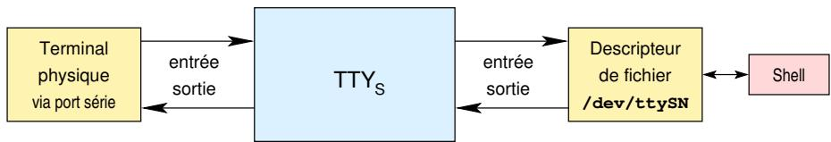

- plusieurs TTY accès avec Ctrl+Alt+F1, Ctrl+Alt+F2, ...  
- 通过 Ctrl+Alt+F1、Ctrl+Alt+F2 等组合键访问多个 TTY
- Ctrl+Alt+F1 jusqu'à Ctrl+Alt+F6 - terminaux virtuels de 1 à 6
- Ctrl+Alt+F1 至 Ctrl+Alt+F6：虚拟终端 1 至 6
- 每个终端独立运行一个 shell，因此多个用户可以同时在同一台机器上以不同身份登录和操作（尤其在服务器或多账户系统上）。
- canaux TTYs dédiés à la communication à travers les ports série  
- 串口通信专用的 TTY 通道

🔹 PTY（伪终端）

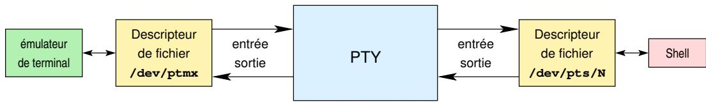

- possibilité pour les applications de créer des PTY (pseudo-teletype)  
  应用可以创建 PTY（伪终端）
- maître `/dev/ptmx` et esclave `/dev/pts/N` — paire PTY exposée为设备文件  
  主端 `/dev/ptmx` 与从端 `/dev/pts/N` 组成一对设备文件
- l'émulateur de terminal连接 master，Shell 连接 slave，应用看到的行为与真实 TTY 一致  
  终端仿真器连接主端，Shell 连接从端，应用层体验等同真实 TTY（回显/规范模式/信号）

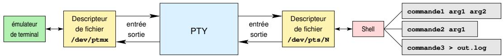

possibilité de régler le débit, les dimensions, ...
可调节传输速率、窗口尺寸等参数
- exploitation indispensable pour les outils d'administration sans interface graphique  
  在无图形管理工具的环境下尤其关键
- chaque terminal virtuel dispose d'une pile de paramètres indépendante (echo, canonical mode, etc.)  
  每个虚拟终端都维护独立的参数栈（回显、规范模式等）
- la gestion du débit permet d'adapter les interactions aux liaisons série lentes ou bruitées  
  速率管理可让系统适配低速或噪声较大的串行链路

lecture de commandes et de leurs arguments  
 读取命令及其参数
- exécution de commandes  
- 执行命令

possibilité de chaîner des commandes à travers des tubes  
可通过管道将命令串联
- gestion des entrées et des sorties, redirections  
- 支持输入输出及重定向管理
nombreuses implémentations (bash, zsh, ...)
实现众多（bash、zsh 等）
- fournissent aussi des API de scripting puissantes pour l'automatisation DevOps  
  同时为 DevOps 自动化提供强大的脚本化 API

<table><tr><td>Commande<br/>命令</td><td>Description<br/>描述</td></tr>
<tr><td>alias</td><td>définition de raccourcis de commande<br/>定义命令快捷方式</td></tr>
<tr><td>cd</td><td>changement de répertoire courant<br/>切换当前目录</td></tr>
<tr><td>echo</td><td>affichage sur la sortie standard<br/>向标准输出打印</td></tr>
<tr><td>test</td><td>comparaisons de valeurs et tests logiques<br/>执行数值与逻辑测试</td></tr>
<tr><td>unset</td><td>suppression d&#x27;une variable d&#x27;environnement<br/>删除环境变量</td></tr>
<tr><td>wait</td><td>attente des commandes lancées en tâches de fond<br/>等待后台任务结束</td></tr></table>

- commandes implémentées dans le shell lui-même  
- 由 shell 内置实现的命令
exécution plus rapide  
执行更快
- modification de l'implémentation → modification du shell  
- 实现变更即意味着修改 shell
- fonctionnalités triviales ou ne pouvant pas être effectuées par des outils externes
- 适合实现简单或无法由外部工具完成的功能

toutes les autres commandes installées sur le système
系统上安装的其他所有命令

implicitement avec le système  
随系统默认安装
explicitement par l'utilisateur
由用户手动安装

exécutables présents à plusieurs endroits différents
可执行文件分布在多个路径

$ echo $PATH

/usr/local/sbin:/usr/local/bin:/usr/sbin:/sbin:/bin:/home/marek/bin/cadnaizer

localisation avec la commande which
使用 which 命令定位可执行文件

$ which ls

/usr/bin/ls

$ which which

/usr/bin/which

# Commande 命令

# Description 描述

<table>
  <tr><td>Commande<br/>命令</td><td>Description<br/>描述</td></tr>
  <tr><td>ls</td><td>liste des fichiers<br/>列出文件</td></tr>
  <tr><td>tree</td><td>affichage de l'arborescence<br/>显示目录树结构</td></tr>
  <tr><td>ln</td><td>création de liens<br/>创建链接</td></tr>
  <tr><td>export</td><td>définition d'une variable d'environnement globale<br/>设置全局环境变量</td></tr>
  <tr><td>grep</td><td>recherche textuelle<br/>执行文本搜索</td></tr>
  <tr><td>cat</td><td>affichage/écriture de fichiers<br/>显示或写入文件</td></tr>
  <tr><td>pwd</td><td>affichage du répertoire courant<br/>显示当前目录</td></tr>
  <tr><td>tar</td><td>archivage et compression<br/>归档与压缩</td></tr>
  <tr><td>kill</td><td>envoi de signaux aux processus<br/>向进程发送信号</td></tr>
  <tr><td>ssh</td><td>connexion sécurisée à distance<br/>建立安全的远程连接</td></tr>
  <tr><td>rm</td><td>suppression de fichiers<br/>删除文件</td></tr>
  <tr><td>mkdir</td><td>création de dossier<br/>创建目录</td></tr>
  <tr><td>cp</td><td>copie de fichiers<br/>复制文件</td></tr>
</table>

<table>
  <tr><td>Commande<br/>命令</td><td>Description<br/>描述</td></tr>
  <tr><td>mv</td><td>déplacement ou renommage de fichiers<br/>移动或重命名文件</td></tr>
  <tr><td>scp</td><td>copie de fichiers à distance<br/>远程复制文件</td></tr>
  <tr><td>chmod</td><td>modification des droits d'accès<br/>修改访问权限</td></tr>
  <tr><td>chown</td><td>changement de propriétaire<br/>变更文件所有者</td></tr>
  <tr><td>printf</td><td>affichage formaté de texte<br/>按格式输出文本</td></tr>
  <tr><td>sed</td><td>édition de texte en flux<br/>流式编辑文本</td></tr>
  <tr><td>git</td><td>gestion de versions<br/>进行版本控制</td></tr>
  <tr><td>make</td><td>automatisation de la compilation<br/>自动化编译流程</td></tr>
  <tr><td>sudo</td><td>exécution avec des droits de superutilisateur<br/>以超级用户权限执行</td></tr>
  <tr><td>ps</td><td>affichage des processus en cours<br/>显示正在运行的进程</td></tr>
  <tr><td>top, htop</td><td>surveillance des processus<br/>监控进程状态</td></tr>
  <tr><td>less</td><td>pagination de fichiers<br/>分页查看文件</td></tr>
  <tr><td>wc</td><td>comptage des lignes, mots et caractères<br/>统计行数、词数与字符数</td></tr>
  <tr><td>tee</td><td>duplication de l'entrée vers un fichier<br/>将输入同时写入文件</td></tr>
  <tr><td>tmux</td><td>multiplexage de terminal<br/>终端复用</td></tr>
</table>

# D'autres commandes utiles
其他常用命令

df, du, clear, touch, date, bc, su, whoami, id, groups, last, who, sort, time
df、du、clear、touch、date、bc、su、whoami、id、groups、last、who、sort、time 等

# Avant d'aller poser la question à votre IA préférende
在去问你偏爱的 AI 之前先查阅

man

# Sections
手册章节

1 programmes executables ou commandes shell  
1 可执行程序或 shell 命令
2 appels système  
2 系统调用
3 fonctions de bibliothèque  
3 库函数
4 fichiers spéciaux (généralement situés dans /dev)  
4 特殊文件（通常位于 /dev）
5 formats de fichiers et conventions (/etc/passwd, ...)  
5 文件格式与约定（如 /etc/passwd）
6 jeux  
6 游戏
7 divers (man, ...)  
7 杂项（man 等）
8 commandes de gestion du système
8 系统管理命令

# Exemples d'utilisation
使用示例

man 1 printf ou man printf - manuel de la commande printf du shell  
`man 1 printf` 或 `man printf`：查看 shell 中 printf 命令的手册
man 3 printf - manuel de la fonction printf de la bibliothèque C
`man 3 printf`：查看 C 库函数 printf 的手册

Introduction
引言

Système d'exploitation
操作系统

Ligne de commande
命令行

Processus et fils d'exécution
进程与执行线程

Entrées et sorties
输入与输出

instance d'un programme à l'instant  $t$  
在时刻 $t$ 运行的程序实例
- identifié par un numéro unique
- 拥有唯一编号

Process IDentifier (PID)
进程标识符（PID）

composé d'un ou plusieurs fils d'exécution  
由一个或多个执行线程组成
connait plusieurs états d'existence  
在生命周期中经历多个状态
- peut avoir un parent  
- 可能有父进程
- peut engendrer des processus fils  
- 可以派生子进程
- dispose d'un tas et d'une pile à travers d'une vision unique de la mémoire du système (mémoire virtuelle)  
- 通过统一的虚拟内存视图拥有自己的堆和栈
- dispose d'un espace mémoire et des ressources système qui lui sont propres
- 拥有独立的内存空间与系统资源

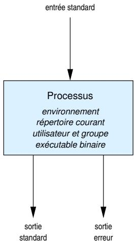

instance d'un programme à l'instant  $t$  
在时刻 $t$ 运行的程序实例
- identifié par un numéro unique
- 由唯一编号标识

Process Identifier (PID)
进程标识符（PID）

composé d'un ou plusieurs fils d'exécution  
包含一个或多个执行线程
connait plusieurs états d'existence  
运行期间会经历多个状态
- peut avoir un parent  
- 能拥有父进程
- peut engendrer des processus fils  
- 能创建子进程
dispose d'un tas et d'une pile à travers d'une vision unique de la mémoire du système (mémoire virtuelle)  
借助统一的虚拟内存视图拥有堆与栈
- dispose d'un espace mémoire et des ressources système qui lui sont propres
- 占有自身的内存与系统资源

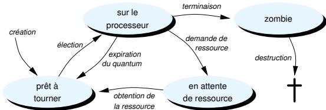

# Processus
# 进程

# Définition
# 定义

instance d'un programme à l'instant  $t$  
在时刻 $t$ 运行的程序实例
- identifié par un numéro unique
- 具有唯一编号

Process IDentifier (PID)
进程标识符（PID）

composé d'un ou plusieurs fils d'exécution  
由一个或多个执行线程组成
connait plusieurs états d'existence  
存在期间会经历多个状态
peut avoir un parent  
可能有父进程
- peut engender des processus fils  
- 可以派生子进程
dispose d'un tas et d'une pile à travers d'une vision unique de la mémoire du système (mémoire virtuelle)  
借助统一的虚拟内存视图拥有堆和栈
- dispose d'un espace mémoire et des ressources système qui lui sont propres
- 拥有独立的内存空间及系统资源

```bash
$ pstree
systemd--ModemManager
|--NetworkManager
|--accounts-daemon
|--agetty
|--apache2
|--atril
|--avahi-daemon
|--blueman-tray
|--bluetoothd
|--boltd
|--colord
|--containerd
|--crashhandler
|--cron
|--cups-browsed
|--cupsd
|--dbus-daemon
|--dockerd
|--emacs
```
```c
#include <unistd.h>
#include <stdio.h>
#include <sys/wait.h>

int main(int argc, char **argv) {
    pid_t child = fork();
    if (child == 0) {
        printf("CHILD\n");
        fflush(stdout);
        sleep(3);
        printf("CHILD: done waiting\n");
        fflush(stdout);
    } else {
        printf("PARENT\n");
        fflush(stdout);
        wait(NULL);
        printf("PARENT: child done\n");
        fflush(stdout);
    }
    return 0;
}
```

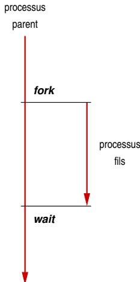

```c
#include <unistd.h>
#include <stdio.h>
#include <sys/wait.h>

int main(int argc, char **argv) {
    pid_t child = fork();
    if (child == 0) {
        printf("CHILD\n");
        fflush(stdout);
        sleep(3);
        printf("CHILD: done waiting\n");
        fflush(stdout);
    } else {
        printf("PARENT\n");
        fflush(stdout);
        wait(NULL);
        printf("PARENT: child done\n");
        fflush(stdout);
    }
    return 0;
}
```

PARENT
父进程输出

CHILD
子进程输出

CHILD: done waiting
子进程：等待完成

PARENT: child done
父进程：子进程结束

fait partie d'un processus  
属于某个进程的一部分
- identifié par un numéro unique - Thread Identifier (TID)  
- 以唯一编号标识，即线程标识符（TID）
- dispose de sa propre pile, mais partage la vision de la mémoire du processus parent  
- 拥有自己的栈，但与父进程共享相同的内存视图
- peut s'exéçuter de façon concurrente avec les autres fils d'exécution du processus parent sur une architecture multi-coeur  
- 在多核架构上可与父进程的其他线程并发执行
hérite des fichiers ouverts de son parent
继承父进程已打开的文件

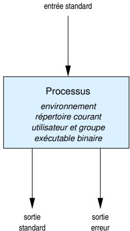

fait partie d'un processus  
属于某个进程的一部分
- identifié par un numéro unique - Thread Identifier (TID)  
- 以唯一编号标识，即线程标识符（TID）
dispose de sa propre pile, mais partage la vision de la mémoire du processus parent  
拥有自己的栈，但共享父进程内存视图
- peut s'exéçuter de façon concurrente avec les autres fils d'exécution du processus parent sur une architecture multi-coeur  
- 在多核架构上可与父进程的其他线程并发执行
hérite des fichiers ouverts de son parent
继承父进程打开的文件

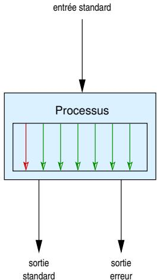

```c
#include <unistd.h>    // sleep 等 POSIX 函数
#include <stdio.h>     // printf / fflush
#include <pthread.h>   // pthread_t / pthread_create / pthread_join

// 线程工作函数：打印自身编号，等待 3 秒，然后返回
void *work(void *tid) {
    int me = *(int *)tid;               // 将通用指针参数还原为 int，得到线程编号
    printf("Thread%d starts\n", me);   // 打印线程开始信息
    sleep(3);                            // 模拟工作：休眠 3 秒
    fflush(stdout);                      // 立刻冲刷标准输出，避免缓冲带来的延迟
    return NULL;                         // 线程函数必须返回（或 pthread_exit）
}

int main(int argc, char **argv) {
    pthread_t tid;       // 用于保存新线程的句柄
    int child = 1;       // 传递给工作线程的编号参数

    // 创建线程：默认属性，入口函数为 work，参数传 &child
    // 若返回值非 0，表示创建失败，可在实际程序里进行错误处理
    pthread_create(&tid, NULL, work, (void *)&child);

    printf("Thread0 starts\n"); // 主线程（可视为线程 0）开始
    fflush(stdout);              // 冲刷标准输出，确保立即可见

    // 等待子线程结束，回收其资源
    pthread_join(tid, NULL);

    printf("Thread0 finishes\n"); // 主线程收尾
    return 0;                       // 正常结束进程
}
```

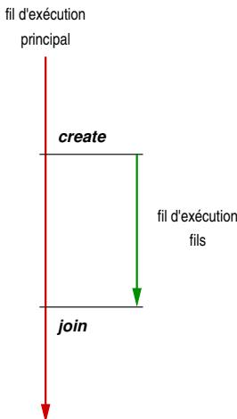

```c
#include <unistd.h>
#include <stdio.h>
#include <pthread.h>

void *work(void *tid) {
    int me = *(int *)tid;
    printf("Thread%d starts\n", me);
    sleep(3);
    fflush(stdout);
    return NULL;
}

int main(int argc, char **argv) {
    pthread_t tid;
    int child = 1;
    pthread_create(&tid, NULL, work, (void *)&child);
    printf("Thread0 starts\n");
    fflush(stdout);
    pthread_join(tid, NULL);
    printf("Thread0 finishes\n");
    return 0;
}
```

Thread 0 starts
线程 0 开始

Thread 1 starts
线程 1 开始

Thread 1 finishes
线程 1 结束

Thread 0 finishes
线程 0 结束

```c
#include <unistd.h>
#include <stdio.h>
#include <sys/wait.h>

int main(int argc, char **argv) {
    int val = 2;
    pid_t child = fork();
    if (child == 0) {
        val += 1;
    } else {
        val += 2;
        wait(NULL);
    }
    printf("PID %d PPID %d VAL is %d\n", getpid(), getppid(), val);
    return 0;
}
```

```c
#include <unistd.h>
#include <stdio.h>
#include <sys/wait.h>

int main(int argc, char **argv) {
    int val = 2;
    pid_t child = fork();
    if (child == 0) {
        val += 1;
    } else {
        val += 2;
        wait(NULL);
    }
    printf("PID %d PPID %d VAL is %d\n", getpid(), getppid(), val);
    return 0;
}
```

```txt
PID 139544 PPID 139538 VAL is 3  
PID 139538 PPID 138810 VAL is 4
```

```c
#include <unistd.h>
#include <stdio.h>
#include <sys/wait.h>

int main(int argc, char **argv) {
    int val = 2;
    pid_t child = fork();
    if (child == 0) {
        val += 1;
    } else {
        val += 2;
        wait(NULL);
    }
    printf("PID %d PPID %d VAL is %d\n", getpid(), getppid(), val);
    return 0;
}
```

```txt
PID 139544 PPID 139538 VAL is 3  
PID 139538 PPID 138810 VAL is 4
```

```c
#include <unistd.h>
#include <stdio.h>
#include <pthread.h>

void *work(void *arg) {
    int *val = (int *)arg;
    (*val) += 1;
    return NULL;
}

int main(int argc, char **argv) {
    int val = 2;
    pthread_t tid;
    pthread_create(&tid, NULL, work, (void *)&val);
    val += 2;
    pthread_join(tid, NULL);
    printf("PID %d PPID %d VAL is %d\n", getpid(), getppid(), val);
    return 0;
}
```

```c
#include <unistd.h>
#include <stdio.h>
#include <sys/wait.h>

int main(int argc, char **argv) {
    int val = 2;
    pid_t child = fork();
    if (child == 0) {
        val += 1;
    } else {
        val += 2;
        wait(NULL);
    }
    printf("PID %d PPID %d VAL is %d\n", getpid(), getppid(), val);
    return 0;
}
```

```txt
PID 139544 PPID 139538 VAL is 3  
PID 139538 PPID 138810 VAL is 4
```

```c
#include <unistd.h>
#include <stdio.h>
#include <pthread.h>

void *work(void *arg) {
    int *val = (int *)arg;
    (*val) += 1;
    return NULL;
}

int main(int argc, char **argv) {
    int val = 2;
    pthread_t tid;
    pthread_create(&tid, NULL, work, (void *)&val);
    val += 2;
    pthread_join(tid, NULL);
    printf("PID %d PPID %d VAL is %d\n", getpid(), getppid(), val);
    return 0;
}
```

```txt
PID 139662 PPID 138810 VAL is 5
```

- lancement d'un programme en ligne de commande mkdir -p /tmp/dir  
- 通过命令行运行 `mkdir -p /tmp/dir`
fonction principale main du programme lancé
所启动程序的 main 函数

```c
int main(int argc, char ** argv) {
    ...
    return 0;
}
```

<table><tr><td>Variable<br/>变量</td><td>Contenu<br/>内容</td></tr><tr><td>argc</td><td>3</td></tr><tr><td>argv[0]</td><td>« mkdir »</td></tr><tr><td>argv[1]</td><td>« -p »</td></tr><tr><td>argv[2]</td><td>« /tmp/dir »</td></tr><tr><td>argv[argc]</td><td>NULL</td></tr></table>

- lancement d'un programme en ligne de commande
- 通过命令行启动程序

mkdir -p /tmp/dir

fonction principale main du programme lancé
所启动程序的 main 函数

```c
int main(int argc, char **argv, char **envp) {
    /* ... */
    return 0;
}
```

<table><tr><td>Variable<br/>变量</td><td>Contenu<br/>内容</td></tr><tr><td>argc</td><td>3</td></tr><tr><td>argv[0]</td><td>« mkdir »</td></tr><tr><td>argv[1]</td><td>« -p »</td></tr><tr><td>argv[2]</td><td>« /tmp/dir »</td></tr><tr><td>argv[argc]</td><td>NULL</td></tr><tr><td>envp[0]</td><td>« PATH=/usr/bin:···»</td></tr><tr><td>envp[1]</td><td>« PWD=/home/··· »</td></tr><tr><td>···</td><td>···</td></tr><tr><td>envp[taille]</td><td>NULL</td></tr></table>

exécution d'un programme depuis un autre programme
从另一个程序中执行新程序

int execvp(const char * file, char * const argv[]);

file - chemin de l'exécutable à lancer  
file：待启动可执行文件的路径
Argv - liste des arguments à passer à l'executable
argv：传递给可执行文件的参数列表

# Variantes
# 变体

```c
int execl(const char *pathname, const char *arg, ... /*, NULL */);  
int execlp(const char *file, const char *arg, ... /*, NULL */);  
int execle(const char *pathname, const char *arg, ... /*, NULL, char *const envp[]*/);  
int execv(const char *pathname, char *const argv[]);  
int execvp(const char *file, char *const argv[]);  
int execvp(const char *file, char *const argv[], char *const envp[]);
```

```c
#include <unistd.h>
#include <stdio.h>
#include <sys/wait.h>

int main(void) {
    pid_t child = fork();
    if (child == 0) {
        char *const prog[] = {"ls", ".", NULL};
        if (execvp(prog[0], prog) != 0) {
            perror("execvp ls");
        }
        _exit(1);
    } else if (child > 0) {
        wait(NULL);
    } else {
        perror("fork");
        return 1;
    }
    return 0;
}
```

```txt
beamerthemeuvsq  
figures  
lecture.bbl  
lecture.org  
lecture.org~  
lecture.pdf  
lecture.tex  
_minted-lecture  
pictures  
public  
publish.el  
publish.el~
```

# Signaux
# 信号

- interruptions logicielles asynchrones envoyées à un programme  
- 发送给程序的异步软件中断
déclanchent l'interruption du programme ou un traitement spécifique  
会打断程序或触发特定处理
possibilité de bloquer les signaux ou de retarder leur effet
可以阻塞信号或延迟其生效

<table>
  <tr>
    <td>Numéro<br/>编号</td>
    <td>Nom du signal<br/>信号名称</td>
    <td>Signification<br/>含义</td>
  </tr>
  <tr><td>1</td><td>SIGHUP</td><td>arrêt (fermeture du terminal)<br/>终端关闭时终止</td></tr>
  <tr><td>2, 20</td><td>SIGINT, SIGTSTP</td><td>interruption (Ctrl+C resp. Ctrl+Z)<br/>中断（对应 Ctrl+C、Ctrl+Z）</td></tr>
  <tr><td>8</td><td>SIGFPE</td><td>erreur arithmétique (div. par zéro, etc.)<br/>算术错误（如除零）</td></tr>
  <tr><td>9</td><td>SIGKILL</td><td>terminaison forcée<br/>强制终止</td></tr>
  <tr><td>10, 12</td><td>SIGUSR1, SIGUSR2</td><td>signaux utilisateurs<br/>用户自定义信号</td></tr>
  <tr><td>11</td><td>SIGSEGV</td><td>erreur de segmentation<br/>段错误</td></tr>
  <tr><td>13</td><td>SIGPIPE</td><td>écriture sur un tube sans lecteur<br/>向无读者管道写入</td></tr>
  <tr><td>14</td><td>SIGALRM</td><td>minuterie expirée<br/>定时器到期</td></tr>
  <tr><td>15</td><td>SIGTERM</td><td>demande de terminaison<br/>请求终止</td></tr>
  <tr><td>19</td><td>SIGSTOP</td><td>arrêt forcé<br/>强制暂停</td></tr>
  <tr><td>28</td><td>SIGWINCH</td><td>redimensionnement de la fenêtre du terminal<br/>终端窗口尺寸变化</td></tr>
</table>

- manipulation à travers des ensembles de signaux
- 可通过信号集合进行管理

# signal.h
signal.h 头文件

vider un ensemble de signaux
清空信号集合

int sigemptyset(sigset_t * set);

- remplir un ensemble de signaux
 - 填充信号集合

int sigfillset(sigset_t * set);

ajouter un signal dans un ensemble de signaux
向集合中加入一个信号

int sigaddset(sigset_t * set, int signum);

retirer un signal d'un ensemble de signaux
从集合中移除一个信号

int sigdelset(sigset_t * set, int signum);

vérifier l'appartenance d'un signal à un ensemble de signaux
检查某信号是否属于集合

int sigismember(const sigset_t *set, int signum);

# Blocage
阻塞

int sigprocmask(int how, const sigset_t * set, sigset_t * oldset);

possibilité de bloquer temporairement des signaux (sauf SIGKILL)  
可临时阻塞信号（SIGKILL 例外）
par exemple, avant d'entrer dans une section critique
例如进入临界区前

```c
sigset_t blk;  
sigset_t sigsv;  
sigemptyset(&blk);  
sigaddset(&blk, SIGINT);  
sigaddset(&blk, SIGPIPE);  
sigprocmask(SIG_BLOCK, &blk, &sigsv);  
/* section critique */  
sigprocmask(SIG_SETMASK, &sigsv, NULL);
```

# Récupération
恢复

int sigpending(const sigset_t * set);  
possibilité de récupérer l'ensemble des signaux précédemment bloqués
用于获取先前被阻塞的全部信号

```txt
sigset_t pending;  
sigpending(&pending);  
if(sigismember(&pending, SIGINT)) { puts("SIGINT is pending"); }
```

# Déclenchement 触发

possibilité de déclencher les signaux précédemment bloqués après leur récupération  
恢复后可以触发之前阻塞的信号
rétablissement du blocage à la fin du traitement
处理结束后恢复阻塞配置

```txt
sigset_t pending;  
sigset_t notpipe;  
sigfillset(&notpipe);  
sigdelset(&notpipe, SIGPIPE);  
sigpending(&pending);  
if(sigismember(&pending, SIGPIPE)) {  
    sigsuspend(&notpipe);  
}  
// rétablissement du masque des signaux
```

# Action spécifique 特定处理

```c
int sigaction(int signum, const struct sigaction * action, struct sigaction * oldaction);   
struct sigaction { void (* sa_handler) (int signal); void (* sa_sigaction) (int signal, siginfo_t *, void *); sigset_t sa_mask; int sa_flags; };
```

```txt
redéfinir l'action associée à un signal (sauf pour SIGKILL et SIGSTOP)
重新定义信号的处理逻辑（SIGKILL 与 SIGSTOP 除外）
```

# Membre 字段

```txt
sa_handler  
sa_sigaction  
sa_mask  
sa_flags
```

# Description 说明

```txt
pointeur vers la fonction à appeler à la réception du signal  
alternative à sa_handler (si sa_flags contient SA_SIGINFO)  
signaux à bloquer lors du traitement du signal  
drapeaux permettant de modifier le comportement du signal (voir man signal-safety)
指向处理函数；若 sa_flags 含 SA_SIGINFO 则使用 sa_sigaction；指定处理期间需要阻塞的信号；通过标志修改行为（详见 man signal-safety）
```

Exemple: redéfinir l'action du signal SIGINT  
示例：重新定义 SIGINT 的处理逻辑
```c
#include <stdio.h>
#include <stdlib.h>
#include <unistd.h>
#include <signal.h>
#include <string.h>

void handler(int sig) {
    printf("SIGINT intercepted, interrupting execution\n");
    exit(EXIT_SUCCESS);
}

int main(int argc, char **argv) {
    struct sigaction act = { .sa_handler = &handler, .sa_flags = 0 };
    sigemptyset(&act.sa_mask);
    if (sigaction(SIGINT, &act, NULL) < 0) {
        perror("sigaction");
        return 1;
    }
    while (1) sleep(10);
    return 0;
}
```

# Lever un signal
发送信号

int kill(pid_t pid, int sig);

possibilité d'envoyer un signal à n'importe quel processus
可以向任意进程发送信号

# Minuterie
定时器

unsigned int alarm(unsigned int seconds);

lever le signal SIGALRM au bout d'un certain nombre de secondes  
在若干秒后触发 SIGALRM
annulation d'une precedente minuterie avec alarm(0)
调用 alarm(0) 以取消之前的闹钟

Exemple : afficher l'heure actuelle toutes les secondes  
示例：每秒输出当前时间
```c
#include <stdio.h>
#include <signal.h>
#include <time.h>
#include <unistd.h>
#include <stdlib.h>
#include <string.h>

void report_time(int signal) {
    time_t curtime;
    time(&curtime);
    printf("current time is %s", ctime(&curtime));
    alarm(1); // réenclencher la minuterie
}

int main(void) {
    struct sigaction act = { .sa_handler = &report_time, .sa_flags = 0 };
    sigemptyset(&act.sa_mask);
    if (sigaction(SIGALRM, &act, NULL) < 0) {
        perror("sigaction");
        return 1;
    }
    alarm(1);
    while (1) sleep(10);
    return 0;
}
```

# Gestion en ligne de commande
命令行管理

- liste des processus de l'utilisateur courant dans la session courante ps
- 使用 `ps` 查看当前会话中属于当前用户的进程列表

<table><tr><td>PID</td><td>TTY</td><td>TIME</td><td>CMD</td></tr><tr><td>97442</td><td>pts/0</td><td>00 :00 :00</td><td>bash</td></tr><tr><td>102542</td><td>pts/0</td><td>00 :00 :00</td><td>ps</td></tr></table>

- liste des processus de tous les utilisateurs dans la session courante ps -u
- 使用 `ps -u` 查看当前会话中所有用户的进程

<table><tr><td>USER</td><td>PID</td><td>%CPU</td><td>%MEM</td><td>VSZ</td><td>RSS</td><td>TTY</td><td>STAT</td><td>START</td><td>TIME</td><td>COMMAND</td></tr><tr><td>marek</td><td>97442</td><td>0.0</td><td>0.0</td><td>9008</td><td>5376</td><td>pts/0</td><td>Ss+</td><td>15 :24</td><td>0 :00</td><td>bash</td></tr></table>

- liste des processus de tous les utilisateurs dans toutes les sessions ps -au  
- 使用 `ps -au` 查看所有会话的全部用户进程
- liste de tous les processus, y compris ceux qui ne sont pas attachés à un terminal ps -aux
- 使用 `ps -aux` 查看包括无终端附着的全部进程

- liste des signaux et de leurs codes
- 列出信号及其编号
- kill -1  
- `kill -1`（向 PID 发送 SIGHUP）
envoi d'un signal à un processus kill <PID> # SIGINT, par défaut kill -s <signal> <PID> pkill <nom> pkill -s <signal> <nom>  
`kill <PID>` 默认发送 SIGINT；可用 `kill -s <signal> <PID>` 或 `pkill <name>`、`pkill -s <signal> <name>`
- lancement d'un processus en arrêté plan <exécutable> &  
- 以 `&` 启动后台进程
attente des processus en arrêté plan wait  
使用 `wait` 等待后台进程
- liste des processus en arrête plan jobs
- `jobs` 查看后台任务
