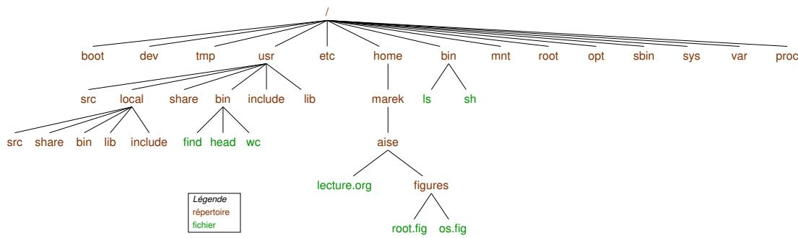
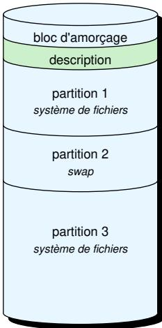

# lecture de AISE partie2

## Table des matières *目录*

- [Introduction](##Introduction)
  （简介）
- [Système d'exploitation](#système-dexploitation)
  （操作系统）
- [Ligne de commande](#ligne-de-commande)
  （命令行）
- [Processus et fils d'exécution](#processus-et-fils-dexécution)
  （进程与线程）
- [Utilisateurs et groupes](#utilisateurs-et-groupes)
  （用户与组）
- [Fichiers](#fichiers)
  （文件）
- [Conclusion](#conclusion)
  （结语）

## Introduction *简介*

Ce document rassemble des rappels pratiques sur Unix/Linux : structure du système, gestion des utilisateurs, manipulation des fichiers et commandes essentielles.
本文档整理了 Unix/Linux 的实用要点：系统结构、用户管理、文件操作以及常用命令。

## Système d'exploitation *操作系统*

### Arborescence Unix *Unix 目录树*

Tout commence à la racine `/`.
所有内容都以根目录 `/` 为起点。



### Répertoires principaux 主要目录

| Répertoire<br>目录 | Description<br>说明 |
| --- | --- |
| `/bin` | Binaires de base (`ls`, `cp`, `mv`, ...).<br>基础二进制命令（`ls`、`cp`、`mv` 等）。 |
| `/boot` | Fichiers de démarrage (noyau, chargeurs).<br>启动文件（内核与引导程序）。 |
| `/dev` | Fichiers représentant les périphériques.<br>代表设备的特殊文件。 |
| `/etc` | Fichiers de configuration (`passwd`, `fstab`, ...).<br>配置文件目录（如 `passwd`、`fstab` 等）。 |
| `/home` | Répertoires personnels.<br>用户家目录。 |
| `/lib` | Bibliothèques partagées essentielles (`libc`).<br>基础共享库（如 `libc`）。 |
| `/media` | Points de montage pour médias amovibles.<br>可移动介质的挂载点。 |
| `/mnt` | Points de montage temporaires.<br>临时挂载点。 |
| `/opt` | Logiciels additionnels optionnels.<br>可选附加软件目录。 |
| `/proc` | Système de fichiers virtuel décrivant les processus et l'état de la machine.<br>包含进程与系统状态的虚拟文件系统。 |
| `/root` | Répertoire personnel du superutilisateur.<br>超级用户的家目录。 |
| `/sbin` | Binaires destinés au superutilisateur.<br>面向超级用户的二进制工具。 |
| `/sys` | Système de fichiers virtuel décrivant noyau et matériel.<br>描述内核与硬件的虚拟文件系统。 |
| `/tmp` | Fichiers temporaires.<br>临时文件目录。 |
| `/usr` | Applications et bibliothèques utilisateur.<br>用户级应用与库。 |
| `/var` | Logs (`/var/log`) et données variables (serveurs web, ...).<br>日志（如 `/var/log`）及可变数据（如 Web 服务数据）。 |

| Répertoire<br>子目录 | Description<br>说明 | Provenance<br>来源 |
| --- | --- | --- |
| `/usr/bin` | Binaires des programmes installés<br>已安装程序的二进制 | Paquets<br>软件包 |
| `/usr/include` | En-têtes installés<br>已安装的头文件 | Paquets<br>软件包 |
| `/usr/lib` | Bibliothèques installées<br>已安装的库 | Paquets<br>软件包 |
| `/usr/share` | Ressources diverses (images, scripts)<br>通用资源（图片、脚本） | Paquets<br>软件包 |
| `/usr/src` | Sources installées<br>已安装的源代码 | Paquets<br>软件包 |
| `/usr/local/bin` | Binaires installés manuellement<br>手动安装的二进制 | Sources<br>源码安装 |
| `/usr/local/include` | En-têtes installés manuellement<br>手动安装的头文件 | Sources<br>源码安装 |
| `/usr/local/lib` | Bibliothèques installées manuellement<br>手动安装的库 | Sources<br>源码安装 |
| `/usr/local/share` | Ressources installées manuellement<br>手动安装的共享资源 | Sources<br>源码安装 |
| `/usr/local/src` | Sources installées manuellement<br>手动安装的源代码 | Sources<br>源码安装 |

### Préfixes et variables d'environnement
*前缀与环境变量*

- `PATH` répertorie les préfixes où chercher les binaires.
  `PATH` 变量列出搜索可执行文件的目录前缀。
- `LD_LIBRARY_PATH`, `LIBRARY_PATH`, ... indiquent où chercher les bibliothèques.
  `LD_LIBRARY_PATH`、`LIBRARY_PATH` 等变量指明动态/静态库的查找路径。
- `C_INCLUDE_PATH`, `CPLUS_INCLUDE_PATH`, ... indiquent où chercher les en-têtes.
  `C_INCLUDE_PATH`、`CPLUS_INCLUDE_PATH` 等变量指定头文件的查找前缀。

### Utilitaires associés
*相关工具*

- `env` : affiche toutes les variables de l'environnement courant.
  `env`：显示当前环境中的全部变量。
- `which <programme>` : indique le chemin complet du binaire résolu dans l'environnement courant (ex. `which ls` → `/bin/ls`).
  `which <programme>`：给出在当前环境解析到的可执行文件完整路径（例如 `which ls` → `/bin/ls`）。
- `ldd <binaire>` : liste les bibliothèques chargées par un programme.
  `ldd <binaire>`：列出程序运行所需的共享库。

```bash
$ ldd /bin/ls
linux-vdso.so.1 (0x00007ffead7fc000)
libselinux.so.1 => /lib/x86_64-linux-gnu/libselinux.so.1 (0x00007aca45455000)
libc.so.6 => /lib/x86_64-linux-gnu/libc.so.6 (0x00007aca45200000)
libpcre2-8.so.0 => /lib/x86_64-linux-gnu/libpcre2-8.so.0 (0x00007aca45166000)
/lib64/ld-linux-x86-64.so.2 (0x00007aca454cd000)
```

### Stockage et montage *存储与挂载*

- Les partitions sont représentées via des points de montage.
  分区通过挂载点映射到文件系统命名空间。
  区属于对物理磁盘的逻辑（或虚拟）划分，而不是把整体“内存”重新切割。磁盘本身是一块连续的物理存储介质，我们用分区表记录“起止位置”和元数据，让操作系统把同一块物理磁盘映射成多个独立的逻辑卷/文件系统。
- `lsblk` affiche la topologie des disques.
  `lsblk` 用于展示块设备的拓扑结构。

```bash
$ lsblk
NAME        MAJ:MIN RM   SIZE RO TYPE MOUNTPOINTS
nvme0n1     259:0    0 953.9G  0 disk
├─nvme0n1p1 259:1    0     1G  0 part /boot/efi
├─nvme0n1p2 259:2    0     2G  0 part /boot
└─nvme0n1p3 259:3    0 950.8G  0 part
  └─dm_crypt-0
      └─ubuntu--vg... 252:1 0 950.8G 0 lvm  /gnu/store /
```

树状图展示了磁盘及其分区的层级关系：

- nvme0n1：整块 NVMe 固态硬盘（953.9 GB），是最顶层的物理磁盘
- nvme0n1p1、nvme0n1p2、nvme0n1p3：该硬盘上的三个分区，分别挂载在 `/boot/efi`、`/boot` 和 LVM 物理卷上
  - nvme0n1p1：EFI 系统分区，大小 1 GB，EFI 启动分区
  - nvme0n1p2：引导分区，大小 2 GB，存放内核与 initramfs
  - nvme0n1p3：LVM 物理卷，大小 950.8 GB，包含加密卷
- dm_crypt-0：LVM 物理卷上的加密卷
- ubuntu--vg...：加密卷内的 LVM 逻辑卷，挂载在根目录 `/` 上

rapple : 内核（kernel）是操作系统的核心模块，直接掌控 CPU、内存、I/O 设备等硬件资源，并为上层提供进程调度、内存管理、设备驱动、系统调用等基本服务。应用程序无法直接操作硬件，必须通过内核暴露的接口（系统调用、驱动等）来间接访问，因此内核起到了用户空间与硬件之间的桥梁作用。



- bloc d'amorçage (boot bloc) 启动块用于存放引导程序，机器启动时先读取这部分的指令，初始化硬件、加载并跳转到更完整的引导装载程序或直接加载内核。
- description 某个分区或卷的文字说明，比如这块空间里放的是什么用途（/boot、/home，或者“volume chiffré”等）。在图表里就是帮助读者了解该区域角色的备注列。
- système de fichiers 安装在该分区/卷里的文件系统类型（ext4、xfs、btrfs、vfat 等）。只有格式化成文件系统以后，操作系统才能在这块空间上管理文件和目录。
- swap 交换空间，用作虚拟内存扩展，把暂时不用的内存页写到磁盘，避免物理 RAM 不足时直接 OOM；也可用于休眠/恢复。可以是专门的分区或文件。

- Montage à la volée : `sudo mount -t <type> <partition> <point-de-montage>`.
  动态挂载：`sudo mount -t <type> <partition> <point-de-montage>`。
- Démontage : `sudo umount <point-de-montage>`.
  卸载：`sudo umount <point-de-montage>`。

### `/etc/fstab` *`/etc/fstab` 配置*

Définit les points de montage persistants. Exemple :
用于定义持久挂载点。示例：

```fstab
# <file system>              <mount point>  <type>  <options>        <dump> <pass>
/dev/disk/by-id/dm...        /               ext4    defaults             0      1
/dev/disk/by-UUID/89f...     /boot           ext4    defaults             0      1
/dev/disk/by-UUID/FC85...    /boot/efi       vfat    defaults             0      1
swap.img                     none            swap    sw                   0      0
/dev/sr0                     /media/cdrom0   udf,iso9660 user,noauto       0      0
hpc-machine.fr:/home/...     /media/hpc      nfs     rw,async,vers=4       0      0
```

Dans cet exemple, la première colonne indique l’origine du système de fichiers (bloc, UUID, fichier swap ou export NFS), la deuxième le point de montage, la troisième le type, la quatrième les options, et `dump`/`pass` contrôlent respectivement la sauvegarde et l’ordre de vérification `fsck`.
在此示例中，第一列给出文件系统来源（块设备、UUID、swap 文件或 NFS 导出），第二列是挂载点，第三列是文件系统类型，第四列为挂载选项，`dump` 与 `pass` 则分别决定备份策略和 `fsck` 检查顺序。

## Ligne de commande *命令行*

- `cat` / `tac` : lire/écrire ou concaténer des fichiers.
  `cat` / `tac`：读取、写入或串联文件内容。
- `touch <fichier>` : créer un fichier ou mettre à jour ses horodatages.
  `touch <fichier>`：创建文件或刷新时间戳。
- `rm <fichier>` et `rmdir <répertoire>` : supprimer des fichiers/répertoires.
  `rm <fichier>` 与 `rmdir <répertoire>`：删除文件或目录。
- `stat <chemin>` : afficher les métadonnées d'un fichier.
  `stat <chemin>`：查看文件元数据。

## Processus et fils d'exécution
*进程与线程*

Cette section est à compléter lors d'un prochain cours (gestion des PID, `ps`, `top`, etc.).
本节将在后续课程中补充（如 PID 管理、`ps`、`top` 等内容）。

## Utilisateurs et groupes
*用户与用户组*

### Utilisateurs
*用户*

- Abstraction permettant à un ou plusieurs utilisateurs d'accéder à une machine.
  用户概念使单个或多个实体能够访问同一台机器。
- Gestion des droits d'accès aux données et aux ressources (système + matériel).
  负责数据与资源（系统及硬件）的访问控制。
- Identifiés par un UID (User Identifier).
  通过 UID（User Identifier）唯一标识。

### Superutilisateur
*超级用户*

Utilisateur disposant de tous les droits. Un grand pouvoir implique de grandes responsabilités.
拥有全部权限的用户；能力越大责任越大。

### Groupes
*用户组*

- Partagent des politiques d'accès.
  用于共享一致的访问策略。
- Permettent la hiérarchisation des droits.
  支持按层级管理权限。
- Un utilisateur appartient forcément à au moins un groupe ; on peut créer des groupes vides.
  每个用户至少隶属于一个组，也可以创建空组。
- Identifiés par un GID (Group Identifier).
  通过 GID（Group Identifier）唯一标识。

### Commandes courantes
*常用命令*

Créer un utilisateur :
创建用户：

```bash
sudo useradd <pseudo>
sudo adduser <pseudo>
```

Supprimer un utilisateur :
删除用户：

```bash
sudo userdel <pseudo>
sudo deluser <pseudo>
```

Créer un groupe :
创建用户组：

```bash
sudo groupadd <groupe>
sudo addgroup <groupe>
```

Supprimer un groupe :
删除用户组：

```bash
sudo groupdel <groupe>
sudo delgroup <groupe>
```

Ajouter ou retirer un utilisateur d'un groupe :
将用户加入或移出用户组：

```bash
sudo adduser <pseudo> <groupe>
sudo deluser <pseudo> <groupe>
```

## Fichiers
*文件体系*

### Indicateurs et types
*文件类型标识*

- `-` : fichier régulier.
  `-`：普通文件。
- `d` : répertoire.
  `d`：目录。
- `c` : périphérique caractère.
  `c`：字符设备。
- `b` : périphérique bloc.
  `b`：块设备。
- `s` : socket local.
  `s`：本地套接字。
- `p` : tube nommé.
  `p`：命名管道。
- `l` : lien symbolique.
  `l`：符号链接。

Exemple :
示例：

```bash
$ ls -l
total 12360
drwxrwxr-x 3 marek marek     4096 Oct 17 13:51 beamerthemeuvsq
drwxrwxr-x 3 marek marek     4096 Nov  1 23:12 figures
-rw-rw-r-- 1 marek marek    36851 Nov  1 23:46 lecture.org
-rw-rw-r-- 1 marek marek 12456204 Nov  1 23:43 lecture.pdf
-rw-rw-r-- 1 marek marek    45007 Nov  1 23:43 lecture.tex
drwxrwxr-x 2 marek marek     4096 Nov  1 15:23 pictures
-rw-rw-r-- 1 marek marek    19411 Nov  1 17:05 publish.el
```

Un fichier n'est qu'une suite d'octets : il ne possède pas de structure interne imposée par le système.
文件本质上只是字节序列，系统不会强加内部结构。

### Fichier texte
*文本文件*

Texte lisible :
可读文本：

> Lorem ipsum dolor sit amet, consectetur adipiscing elit, sed do eiusmod tempor incididunt ut labore et dolore magna aliqua.
> Lorem ipsum dolor sit amet, consectetur adipiscing elit, sed do eiusmod tempor incididunt ut labore et dolore magna aliqua.（示例拉丁文假文）。

Hexadécimal (96 premiers octets) :
十六进制表示（前 96 个字节）：

```
00000000  4c 6f 72 65 6d 20 69 70 73 75 6d 20 64 6f 6c 6f  |Lorem ipsum dolo|
00000010  72 20 73 69 74 20 61 6d 65 74 2c 20 63 6f 6e 73  |r sit amet, cons|
00000020  65 63 74 65 74 75 72 20 61 64 69 70 69 73 63 69  |ectetur adipisci|
00000030  6e 67 20 65 6c 69 74 2c 20 73 65 64 20 64 6f 20  |ng elit, sed do |
00000040  65 69 75 73 6d 6f 64 20 74 65 6d 70 6f 72 20 69  |eiusmod tempor i|
00000050  6e 63 69 64 69 64 75 6e 74 20 75 74 20 6c 61 62  |ncididunt ut lab|
00000060  6f 72 65 20 65 74 20 64 6f 6c 6f 72 65 20 6d 61  |ore et dolore ma|
00000070  67 6e 61 20 61 6c 69 71 75 61 2e 0a              |gna aliqua..|
```

### Fichier image
*图像文件*

Visuel :
可视化示例：


Hexadécimal (96 octets) :
十六进制表示（96 字节）：

```
00000000  89 50 4e 47 0d 0a 1a 0a 00 00 00 0d 49 48 44 52  |.PNG......IHDR|
00000010  00 00 00 80 00 00 00 80 08 06 00 00 00 c3 3e 61  |..............>a|
00000020  cb 00 00 00 04 67 41 4d 41 00 00 d9 04 dc b2 da  |.....gAM.A.....|
00000030  02 00 00 00 06 62 4b 47 44 00 00 00 00 00 00 f9  |.....bKGD......|
00000040  43 bb 7f 00 00 00 09 70 48 59 73 00 00 00 48 00  |C......pHYs...H.|
00000050  00 00 48 00 46 c9 6b 3e 00 00 00 09 76 70 41 67  |..H.F.k>....vpAg|
```

### Fichier binaire
*二进制文件*

Programme `/bin/ls` :
示例程序 `/bin/ls`：

```
00000000  7f 45 4c 46 02 01 01 00 00 00 00 00 00 00 00 00  |.ELF............|
00000010  03 00 3e 00 01 00 00 00 30 6d 00 00 00 00 00 00  |..>.....0m......|
00000020  40 00 00 00 00 00 00 00 28 24 02 00 00 00 00 00  |@.......($......|
00000030  00 00 00 00 40 00 38 00 0d 00 40 00 1f 00 1e 00  |....@.8...@.....|
00000040  06 00 00 00 04 00 00 00 40 00 00 00 00 00 00 00  |........@.......|
00000050  40 00 00 00 00 00 00 00 40 00 00 00 00 00 00 00  |@.......@.......|
```

### Propriété et permissions
*所有权与权限*

Liste des propriétaires :
查看所有者：

```bash
$ ls -l ./lecture.pdf
-rw-rw-r-- 1 marek marek 12457268 Nov  1 23:54 ./lecture.pdf

$ ls -ln ./lecture.pdf
-rw-rw-r-- 1 1000 1000 12457268 Nov  1 23:54 ./lecture.pdf
```

Changer propriétaire/groupe :
修改所有者/用户组：

```bash
chown <utilisateur> <fichier>
chgrp <groupe> <fichier>
chown <utilisateur>:<groupe> <fichier>
```

Exemple:

```bash
chown marek:marek ./lecture.pdf
chown marek ./lecture.pdf
chown :marek ./lecture.pdf
chgrp marek ./lecture.pdf
```

Table de correspondance :
权限对照表：

| Droits<br>权限 | Valeur alpha<br>字母表示 | Valeur octale<br>八进制值 |
| --- | --- | --- |
| Aucun | `---` | `0` |
| Exécution seulement | `--x` | `1` |
| Écriture seulement | `-w-` | `2` |
| Écriture + exécution | `-wx` | `3` |
| Lecture seulement | `r--` | `4` |
| Lecture + exécution | `r-x` | `5` |
| Lecture + écriture | `rw-` | `6` |
| Tous les droits | `rwx` | `7` |

`chmod` modifie les droits : `chmod a+x <fichier>`, `chmod go+x <fichier>` , `chmod 400 <fichier>`
`chmod` 命令用于修改权限，如 `chmod a+x <fichier>`、`chmod 400 <fichier>`

- `a` all → appliquer l’action à tous les acteurs (propriétaire, groupe, autres)；`a` 表示所有主体（用户、组、其他）。
- `g` group → ne viser que le groupe；`g` 表示仅针对所属用户组。
- `u` user → ne viser que le propriétaire；`u` 表示文件所有者本人。
- `o` others → ne viser que les autres utilisateurs；`o` 表示除所有者和组成员之外的其他用户。

### Descripteurs de fichiers *文件描述符*

- Représentent les fichiers/flux via des numéros.
  通过整数编号来表示文件或流。
- Couplés à des droits (lecture/écriture) et à une position courante.
  绑定访问权限（读/写）和当前偏移。
- Descripteurs spéciaux : `0` (`STDIN_FILENO`), `1` (`STDOUT_FILENO`), `2` (`STDERR_FILENO`).
  特殊编号：`0`（标准输入）、`1`（标准输出）、`2`（标准错误）。
- 准确地说，操作系统将标准输入和标准输出视为文件。所以，如果你想在标准输出上写点什么，实际上就是在写入描述符为 1 的文件。
- Pour écrire sur la sortie standard, utilisez le « fd ».
要写入标准输出，请使用「fd」。

Création : `open` (header `fcntl.h`).
使用 `open`（`fcntl.h`）创建：

```c
int open(const char *path, int oflag);
int open(const char *path, int oflag, mode_t mode);
```

- `path` : chemin absolu ou relatif.
  `path`：绝对或相对路径。
- `oflag` : `O_EXEC`, `O_RDONLY`, `O_RDWR`, `O_WRONLY`, combinables avec `O_CREAT`, `O_EXCL`, ...
  `oflag`：访问模式（如 `O_EXEC`、`O_RDONLY`、`O_RDWR`、`O_WRONLY`），可与 `O_CREAT`、`O_EXCL` 等按位组合。
- `mode` : droits appliqués si `O_CREAT` est présent.
  `mode`：仅在使用 `O_CREAT` 时指定新文件权限。
- Retourne un descripteur ou `-1` en cas d'erreur.
  成功返回描述符，失败返回 `-1`。

Lecture/écriture bas niveau (`unistd.h`) :
低层读写接口（`unistd.h`）：

```c
ssize_t read(int fd, void *buf, size_t nbyte);
ssize_t write(int fd, const void *buf, size_t nbyte);
```

- `read` renvoie le nombre d'octets lus (0 → fin de fichier).
  `read` 返回读取的字节数（0 表示到达文件末尾）。
- `write` renvoie le nombre d'octets écrits (≤ `nbyte`).
  `write` 返回成功写入的字节数（≤ `nbyte`）。
- En cas d'erreur : `-1`, avec `errno` positionné (`perror` pour afficher le message). Ne pas oublier de stopper la lecture en fin de fichier !
  出错时返回 `-1` 并设置 `errno`（通过 `perror` 输出信息）；到达 EOF 时务必停止读取。

Déplacement : `lseek`.
文件指针移动：`lseek`。

```c
off_t lseek(int fd, off_t offset, int whence);
```

- `whence` : `SEEK_SET`, `SEEK_CUR`, `SEEK_END`.
  `whence`：`SEEK_SET`、`SEEK_CUR`、`SEEK_END`。
- Retourne la nouvelle position ou `-1`.
  返回新的偏移，失败则为 `-1`。

Fermeture : `close` (`unistd.h`).
关闭描述符：`close`（`unistd.h`）。

```c
int close(int fd);
```

Erreurs fréquentes : `EINTR` (interruption par signal).
常见错误：`EINTR`（被信号中断）。

### Flux (stdio)
*标准 I/O 流*

- Sur-couche plus haut niveau reposant sur les descripteurs.
  基于文件描述符的更高层封装。
- Flux spéciaux : `stdin`, `stdout`, `stderr` (dans `stdio.h`).
  特殊流：`stdin`、`stdout`、`stderr`（在 `stdio.h` 中定义）。
- `FILE *fopen(const char *pathname, const char *mode);` ouvre un fichier et retourne un flux (`NULL` en cas d'erreur). Les fichiers sont créés en `0666` avant umask.
  `FILE *fopen(const char *pathname, const char *mode);` 打开文件返回 `FILE*`（出错返回 `NULL`）；新建文件默认权限为 `0666`（再受 umask 影响）。

Lecture/écriture buffered :
缓冲读写：

```c
size_t fread(void *ptr, size_t size, size_t nmemb, FILE *stream);
size_t fwrite(const void *ptr, size_t size, size_t nmemb, FILE *stream);
```

- Retourne le nombre d'éléments traités.
  返回成功处理的元素个数。
- `0` indique une fin de fichier ou une erreur (`feof` / `ferror`).
  返回 `0` 表示 EOF 或错误（可用 `feof` / `ferror` 区分）。

Déplacement et fermeture :
定位与关闭：

```c
int fseek(FILE *stream, long offset, int whence);
int fclose(FILE *stream);
```

`fseek` retourne `0` en cas de succès, `-1` sinon. `fclose` retourne `0` ou `EOF`.
`fseek` 成功返回 `0`，失败返回 `-1`；`fclose` 成功返回 `0`，失败返回 `EOF`。

### Opérations système usuelles *常用系统调用*

```c
int chmod(const char *path, mode_t mode);          // <sys/stat.h>
int remove(const char *pathname);                  // <stdio.h>
int mkdir(const char *path, mode_t mode);          // <sys/stat.h>
int chdir(const char *path);                       // <unistd.h>
int stat(const char *path, struct stat *statbuf);  // <sys/stat.h>
```

Ces appels permettent respectivement de changer les droits, supprimer des fichiers/répertoires, créer un répertoire, changer de répertoire courant et récupérer des métadonnées (`man 2 stat`, `man 3 stat`).
这些调用分别用于修改权限、删除文件/目录、创建目录、切换当前目录以及获取文件元数据（参阅 `man 2 stat`、`man 3 stat`）。
