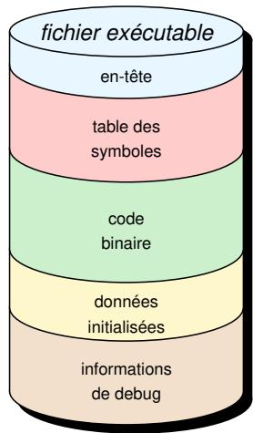
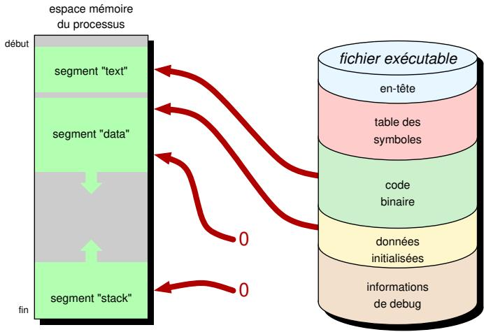
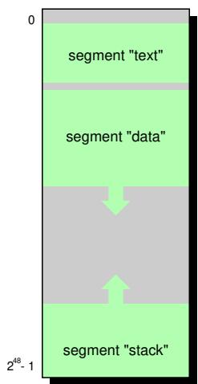
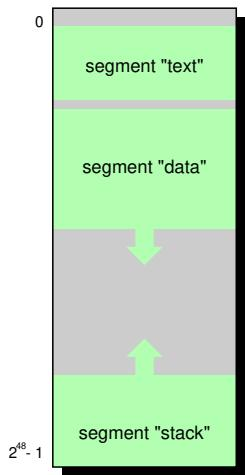
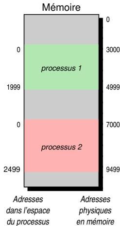
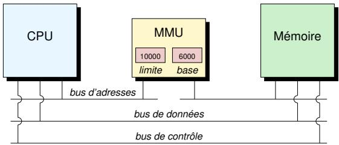
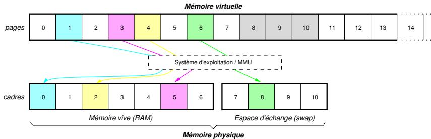
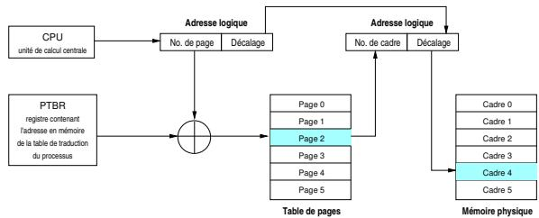
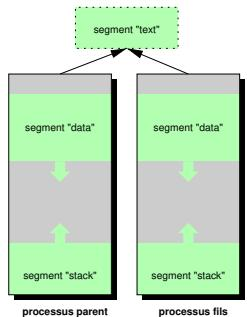

# lecture de AISE partie3

## Table des matières *目录*

- [Objectifs fondamentaux du noyau](#objectifs-fondamentaux-du-noyau)（基本内核目标）
- [Processus](#processus)（进程）
- [Fichier executable](#fichier-executable)（可执行文件）
- [Espace mémoire d'un processus](#espace-mémoire-dun-processus)（进程内存空间）
- [Traduction d'adresses](#traduction-dadresses)（地址转换）
- [Évincement de la mémoire](#évincement-de-la-mémoire)（内存置换）
- [Mémoire virtuelle](#mémoire-virtuelle)（虚拟内存）
- [Allocation](#allocation)（分配）
- [Partage de la mémoire](#partage-de-la-mémoire)（内存共享）

# Objectifs fondamentaux du noyau *基本内核目标*

1. répartir équitablement les ressources（公平分配资源）
2. garantir la sécurité des données（保证数据安全）

# Processus *进程*

- instance d'un programme à l'instant $t$（t时刻程序的实例）

- dispose d'un espace mémoire et des ressources système qui lui sont propres（拥有自己的内存空间和系统资源）

Comment faire cohabiter plusieurs processus en mémoire tout en garantissant la sécurité des données?（如何在保证数据安全的同时让多个进程共存于内存中？）

Comment attribuer de la mémoire à tous les processus?（如何为所有进程分配内存？）

Comment executer des processus plus grands que la mémoire?（如何执行比内存更大的进程？）

- format spécifique lisible par le lanceur de processus（进程启动器可读的特定格式）

- Executable and Linkable Format (ELF)（可执行与可链接格式 (ELF)）

- découpage en sections（分节）

- en-tête avec toutes les informations nécessaires à l'architecture（包含架构所需所有信息的头部）

■ description dans le manuel avec man elf（手册页 man elf 中的描述）



# Fichier executable *可执行文件*

## Example *示例*

`/bin/ls`: en-tête de l'exécutable (tronquée)（`/bin/ls`：可执行文件头（截断））

`readelf -h /bin/ls | head -n 10`

### ELF Header:

Magic: 7f 45 4c 46 02 01 01 00 00 00 00 00 00 00 00 00
Class: ELF64
Data: 2's complement, little endian
Version: 1 (current)
OS / ABI: UNIX - System V
ABI version: 0
Type: DYN (Position-Independent Executable file)
Machine: Advanced Micro Devices X86-64
Version: 0x1

`/bin/ls`: contenu de l'exécutable (32 premiers octets)（`/bin/ls`：可执行文件内容（前 32 字节））

`hexyl --border ascii --color never --length 32 /bin/ls`

```
|00000000| 7f 45 4c 46 02 01 01 00 | 00 00 00 00 00 00 00 00 | .ELF ....|
|00000010| 03 00 3e 00 01 00 00 00 | 30 6d 00 00 00 00 00 00 | ..>..... |
```

1. invocation de execv*()（调用 execv*()）
2. détection du type de l'exécutable（检测可执行文件类型）
3. projection de l'exécutable en mémoire（将可执行文件映射到内存）
4. préparation de l'interpréteur (si nécessaire)（准备解释器（如果需要））
5. passage du contrôle au programme（将控制权移交给程序）
6. chargement des bibliothèques en mémoire（加载库到内存）
7. invocation de _start()（调用 _start()）
8. invocation de __libc_start_main() (_init & _fini)（调用 __libc_start_main() (_init & _fini)）
9. invocation de main()（调用 main()）

# Espace mémoire d'un processus *进程内存空间*

## Projection en mémoire *内存映射*



## Sur une architecture à 64 bits *64 位架构*

- vision unique de la mémoire par chaque processus（每个进程对内存的唯一视图）
- 64 bits théoriques, seulement 48 bits sont cablés（理论 64 位，实际只有 48 位连接）
- $2^{48}$，c'est-à-dire 256 Tio adressables（$2^{48}$，即 256 TiB 可寻址空间）


## Pile *栈 (Stack)*

- partie de la mémoire du processus dans le segment stack（进程内存中位于 stack 段的部分）
- taille fixée au démarrage du programme par le système d'exploitation（由操作系统在程序启动时固定大小）
- par défaut, 8 Mio sur Linux (voir la commande `ulimit`)（Linux 默认为 8 MiB，参阅 `ulimit` 命令）

- superposition de couches（层叠结构）
- créées à chaque appel à fonction（每次函数调用时创建）
- détruites à chaque retour de fonction（每次函数返回时销毁）

### Composition d'une couche *栈帧组成*

- arguments de la fonction appelée（被调用函数的参数）
- variables locales（局部变量）
- adresse de return dans la fonction appelante（调用函数中的返回地址）
- pointeur de pile de la couche précédente（上一层的栈指针）



## Tas *堆 (Heap)*

- partie de la mémoire du processus dans le segment data（进程内存中位于 data 段的部分）
- extensible en cours d'exécution du programme（程序运行时可扩展）
- mémoire dynamique et persistante（动态且持久的内存）
- gérée par le programme lui-même（由程序自行管理）
- `malloc`, `calloc`, `realloc`
- `free`



- chaque processus dispose de son propre espace d'adressage（每个进程拥有自己的地址空间）
- les programmes utilisent des adresses logiques relatives à l'espace d'adressage du processus（程序使用相对于进程地址空间的逻辑地址）



# Traduction d'adresses *地址转换*

Unité de gestion de la mémoire :
（内存管理单元：）



## Memory Management Unit (MMU) *内存管理单元*

- composant matériel（硬件组件）
- traduction d'adresses logiques en adresses physiques（将逻辑地址转换为物理地址）
- vue linéaire et continue de la mémoire pour tous les programmes（为所有程序提供线性且连续的内存视图）
- espaces d'adressage individuels et isolés pour chaque processus（为每个进程提供独立且隔离的地址空间）

# Évincement de la mémoire *内存置换*

Que se passe-t-il lorsque la capacité de la mémoire physique ne suffit plus?
（当物理内存容量不足时会发生什么？）

- évicement des données d'un ou plusieurs processus de la mémoire vive vers le disque（将一个或多个进程的数据从内存移至磁盘）
- choix basé sur le temps de résidence en mémoire vive et l'état du processus（基于内存驻留时间和进程状态进行选择）

## Espace d'échange *交换空间 (Swap)*

- espace ou fichier réservé sur le disque, également appelé swap（磁盘上预留的空间或文件，也称为 swap）

```bash
$ cat /etc/fstab
# <file system> <mount point>   <type>  <options>       <dump>  <pass>
/dev/disk/by-id/dm... /         ext4    defaults        0       1
...
swap.img        none            swap    sw              0       0
```

Que se passe-t-il si l'ensemble de l'espace d'adressage d'un processus ne rentre pas dans la mémoire physique?
（如果一个进程的整个地址空间无法装入物理内存，会发生什么？）

Peut-on éviter le gaspillage de la mémoire physique si un processus n'utilise pas l'ensemble de son espace d'adressage à tout moment de sa durée de vie?
（如果一个进程在其生命周期内并未时刻使用其全部地址空间，能否避免物理内存的浪费？）

- exposer au processus un espace mémoire virtuel considéré infini（向进程展示一个被视为无限的虚拟内存空间）
- laisser le processus demander autant d'espace mémoire qu'il désire（允许进程按需申请任意大小的内存空间）
- ne projeter une zone de la mémoire virtuelle en mémoire physique qu'à la première utilisation de celle-ci（仅在首次使用时将虚拟内存区域映射到物理内存）

# Mémoire virtuelle *虚拟内存*

## Pagination *分页*

- découpage de l'espace mémoire en portions de taille $2^{n}$ (4 Kio le plus souvent)（将内存空间划分为大小为 $2^{n}$ 的块（通常为 4 KiB））
- mémoire physique découpée en cadres（物理内存划分为页帧 (frames)）
- mémoire virtuelle du processus découpée en pages（进程虚拟内存划分为页 (pages)）
- 1 cadre de la mémoire physique peut recevoir 1 page de la mémoire virtuelle（物理内存的一个页帧可以容纳虚拟内存的一页）
- projection de chaque page utilisée vers un cadre valide en mémoire physique implique l'unité de gestion de la mémoire (MMU) et le noyau du système d'exploitation（将每个使用的页映射到物理内存中的有效页帧，涉及内存管理单元 (MMU) 和操作系统内核）



## Tables de traduction *页表*

- répertoires des correspondances page-cadre spécifiques à chaque processus（每个进程特定的页-帧映射目录）
- conservées en mémoire physique（保存在物理内存中）
- beaucoup de processus et de pages $\rightarrow$ consommation importante de la mémoire（进程和页面数量众多 $\rightarrow$ 内存消耗巨大）



## Tables de traduction à niveaux multiples *多级页表*

- évincer des pages inutilisées sur le disque pour réduire la consommation de la mémoire（将未使用的页面置换到磁盘以减少内存消耗）
- référence vers une page qui ne se trouve pas en mémoire (premier accès à une page nouvellement allouée, ...)（引用不在内存中的页面（首次访问新分配的页面等））
- interruption du noyau（内核中断）
  1. charger la page manquante en mémoire（将缺失的页面加载到内存）
  2. refaire l'instruction concernée（重试相关指令）
- coût important pour le noyau du système d'exploitation et l'unité de gestion de la mémoire（对操作系统内核和内存管理单元来说开销很大）

## Translation Lookaside Buffer (TLB) *转换后备缓冲区*

- cache des correspondances page-cadre pour réduire le coût de la traduction des accès（页-帧映射的缓存，用于降低地址转换的开销）

# Allocation *分配*

## Types *类型*

- statique（静态）
- automatique (variables locales des fonctions)（自动（函数的局部变量））
- dynamique（动态）

## Allocation dynamique *动态分配*

### 1. Bas niveau *低级*

- allocation de pages（页面分配）
- projections entre la mémoire virtuelle et la mémoire physique（虚拟内存与物理内存之间的映射）
- appels système très coûteux $\rightarrow$ à minimiser（系统调用非常昂贵 $\rightarrow$ 应尽量减少）

### 2. Haut niveau *高级*

- Répartir les allocations sur les pages déjà allouées（在已分配的页面上分配内存）
- différentes politiques d'allocation (first fit, next fit, best fit, ...)（不同的分配策略（首次适应、下次适应、最佳适应等））

# Partage de la mémoire *内存共享*

- possibilité de partager certaines portions de la mémoire entre processus（可以在进程间共享部分内存）

1. partage du segment text en lecture seule (code du programme)（只读 text 段（程序代码）的共享）
   - lors d'un fork（在 fork 时）

2. partage des données en lecture-écriture entre processus ou fils d'exécution（进程或线程间读写数据的共享）

## Copy-On-Write (COW) *写时复制*

- pas de duplication immédiate suite à un fork（fork 后不立即复制）
- duplication à l'occasion de la première écriture (par le processus parent ou un des processus fils)（在首次写入时（由父进程或子进程）进行复制）

```c
#include <unistd.h>
#include <stdio.h>
#include <sys/wait.h>

int main(void) {
    int val = 2;
    pid_t child = fork();
    // pas de duplication a cet instant (此时不复制)
    
    if (child == 0) {
        int local = 1;
        val += local; 
        // duplication (premiere ecriture) (复制（首次写入）)
    } else {
        wait(NULL);
        printf("PID %d PPID %d VAL is %d\n", getpid(), getppid(), val);
    }
    return 0;
}
```

```text
PID 11351 PPID 11345 VAL is 3  
PID 11345 PPID 4190 VAL is 2
```

1. **segment text**
   - code du programme（程序代码）
   - en lecture seule（只读）
   - lors d'un fork, ...（在 fork 时...）



2. **données entre processus ou fils d'exécution (lecture-écriture)**（进程或线程间的数据（读写））

```c
#define _GNU_SOURCE
#include <unistd.h>
#include <stdio.h>
#include <pthread.h>

void *work(void *arg) {
    int *val = (int *) arg;
    printf("TID %d VAL is %d (addr. %p)\n", gettid(), *val, val);
    return NULL;
}

int main(int argc, char **argv) {
    int val = 2;
    pthread_t tid;
    pthread_create(&tid, NULL, work, (void *)&val);
    
    printf("TID %d VAL is %d (addr. %p)\n", gettid(), val, &val);
    
    pthread_join(tid, NULL);
    return 0;
}
```

```text
TID 18429 VAL is 2 (addr. 0x7ffe4e0bc8cc)
TID 18435 VAL is 2 (addr. 0x7ffe4e0bc8cc)
```
