# Lecture 4: Concurrence et Parallélisme *并发与并行*

## Table des matières *目录*

- [Lecture 4: Concurrence et Parallélisme *并发与并行*](#lecture-4-concurrence-et-parallélisme-并发与并行)
  - [Table des matières *目录*](#table-des-matières-目录)
  - [Système concurrent *并发系统*](#système-concurrent-并发系统)
  - [Examples *应用示例*](#examples-应用示例)
  - [Mise en œuvre *实现*](#mise-en-œuvre-实现)
  - [Exemple d'application *应用示例*](#exemple-dapplication-应用示例)
  - [Etude du phénomène aéroacoustique](#etude-du-phénomène-aéroacoustique)
    - [Motivation *动机*](#motivation-动机)
    - [Méthode *方法*](#méthode-方法)
    - [Modèle aéroacoustique *气动声学模型*](#modèle-aéroacoustique-气动声学模型)
    - [Exemple d'application *应用示例*](#exemple-dapplication-应用示例-1)
      - [Modèle continu（连续模型）](#modèle-continu连续模型)
      - [Modèle discret（离散模型）](#modèle-discret离散模型)
      - [Simulation numérique（数值模拟）](#simulation-numérique数值模拟)
  - [Implémentation séquentielle *串行实现*](#implémentation-séquentielle-串行实现)
  - [Implémentation parallèle *并行实现*](#implémentation-parallèle-并行实现)
    - [Exemple de Simulation numérique *数值模拟示例*](#exemple-de-simulation-numérique-数值模拟示例)
  - [Calcul haute-performance *高性能计算*](#calcul-haute-performance-高性能计算)
  - [Problématiques majeures *主要问题*](#problématiques-majeures-主要问题)
  - [Défis *挑战*](#défis-挑战)
  - [Situation actuelle](#situation-actuelle)
    - [Cet ordinateur : (这台计算机：)](#cet-ordinateur--这台计算机)
  - [Architecture en mémoire partagée *共享内存架构*](#architecture-en-mémoire-partagée-共享内存架构)
  - [Architecture en mémoire distribuée *分布式内存架构*](#architecture-en-mémoire-distribuée-分布式内存架构)
  - [Types de parallélisme *并行类型*](#types-de-parallélisme-并行类型)
    - [Parallélisme de données *数据并行*](#parallélisme-de-données-数据并行)
    - [Chaîne de traitement *处理链 (Pipelining)*](#chaîne-de-traitement-处理链-pipelining)
    - [Parallélisme de tâches *任务并行*](#parallélisme-de-tâches-任务并行)
  - [Modèles d'exécution](#modèles-dexécution)
    - [Charge de travail répartie entre plusieurs processus ou fils d'exécution (分布在多个进程或线程之间的工作负载)](#charge-de-travail-répartie-entre-plusieurs-processus-ou-fils-dexécution-分布在多个进程或线程之间的工作负载)
  - [Communication et Mémoire](#communication-et-mémoire)
    - [Mémoire partagée *共享内存*](#mémoire-partagée-共享内存)
    - [Mémoire distribuée *分布式内存*](#mémoire-distribuée-分布式内存)
    - [Processus vs Fil d'exécution : Partage de variables](#processus-vs-fil-dexécution--partage-de-variables)
  - [Communication en mémoire partagée *共享内存通信*](#communication-en-mémoire-partagée-共享内存通信)
    - [Échange de messages vs Mémoire partagée](#échange-de-messages-vs-mémoire-partagée)
  - [Problème de concurrence *并发问题*](#problème-de-concurrence-并发问题)
    - [Exclusion mutuelle *互斥*](#exclusion-mutuelle-互斥)
    - [Autres primitives de synchronisation](#autres-primitives-de-synchronisation)
  - [Paradigmes et Interfaces](#paradigmes-et-interfaces)
    - [Paradigmes de programmation *编程范式*](#paradigmes-de-programmation-编程范式)
    - [Interfaces de programmation *编程接口*](#interfaces-de-programmation-编程接口)
    - [Moteurs d'exécution *执行引擎*](#moteurs-dexécution-执行引擎)

## Système concurrent *并发系统*

Un système dans lequel plusieurs activités s'exécutent simultanément tout en ayant des interactions entre elles. (一个多个活动同时执行并相互交互的系统。)

## Examples *应用示例*

- serveur Web répondant aux requêtes de plusieurs clients au même temps (Web 服务器同时响应多个客户端的请求)
- système de contrôle d'un vehicule effectuant des actions en fonction des informations provenant des capteurs (车辆控制系统根据传感器信息执行动作)
- noyau de systeme d'exploitation gerant plusieurs fils d'execution accedant aux mêmes ressources (操作系统内核管理访问相同资源的多个执行线程)
- une application de calcul scientifique travaillant sur differentes parties d'un même probleme (科学计算应用程序处理同一问题的不同部分)

## Mise en œuvre *实现*

parallelisme matieriel (proceseurs multi-coeur, ...) et logiciel (système d'exploitation) (硬件并行（多核处理器等）和软件并行（操作系统）)

## Exemple d'application *应用示例*

Situation réelle（实际情况）

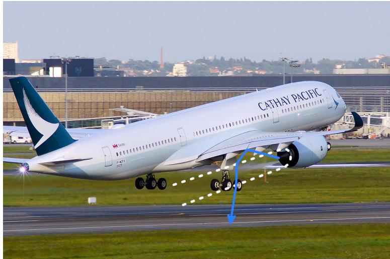

## Etude du phénomène aéroacoustique

### Motivation *动机*

santé, environnement, respect des régulations (健康、环境、合规)

### Méthode *方法*

- experiences (实验)
- simulation numérique (数值模拟)

### Modèle aéroacoustique *气动声学模型*

- modèle continu (sur papier) (连续模型（纸面）)
- modèle discret (sur ordinateur) (离散模型（计算机）)

### Exemple d'application *应用示例*

#### Modèle continu（连续模型）

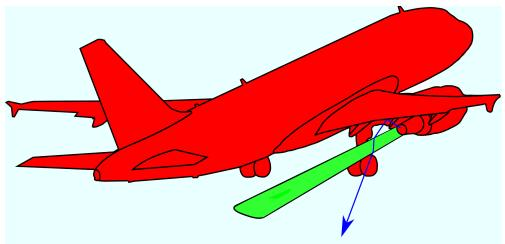
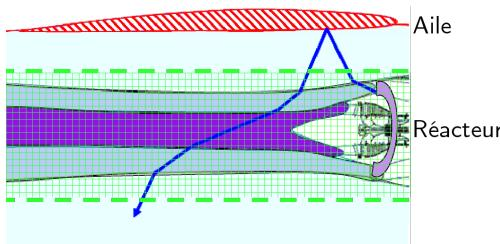

#### Modèle discret（离散模型）

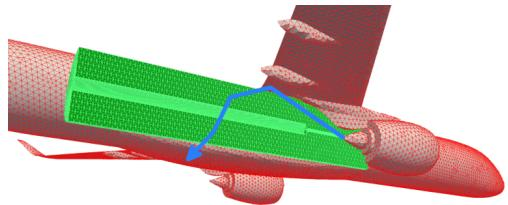
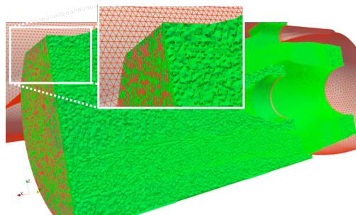

$$
\left[ \begin{array}{c c c c c c} A _ {V V _ {1 1}} & \dots & A _ {V V _ {1 n}} & A _ {s v _ {1 1}} ^ {T} & \dots & A _ {s v _ {1 k}} ^ {T} \\ \vdots & \ddots & \vdots & \vdots & \ddots & \vdots \\ A _ {V V _ {n 1}} & \dots & A _ {V V _ {n n}} & A _ {s v _ {m 1}} ^ {T} & \dots & A _ {s v _ {m k}} ^ {T} \\ A _ {s v _ {1 1}} & \dots & A _ {s v _ {1 n}} & A _ {s s _ {1 1}} & \dots & A _ {s s _ {1 k}} \\ \vdots & \ddots & \vdots & \vdots & \ddots & \vdots \\ A _ {s v _ {k 1}} & \dots & A _ {s v _ {k n}} & A _ {s s _ {k 1}} & \dots & A _ {s s _ {k k}} \end{array} \right] \times \left[ \begin{array}{c} x _ {v _ {1}} \\ \vdots \\ x _ {v _ {n}} \\ x _ {s _ {1}} \\ \vdots \\ x _ {s _ {k}} \end{array} \right] = \left[ \begin{array}{c} b _ {v _ {1}} \\ \vdots \\ b _ {v _ {n}} \\ b _ {s _ {1}} \\ \vdots \\ b _ {s _ {k}} \end{array} \right]
$$

#### Simulation numérique（数值模拟）

Problème à résoudre : (待解决的问题：)

$$
\left[ \begin{array}{l l} A _ {v v} & A _ {s v} ^ {T} \\ A _ {s v} & A _ {s s} \end{array} \right] \times \left[ \begin{array}{l} x _ {v} \\ x _ {s} \end{array} \right] = \left[ \begin{array}{l} b _ {v} \\ b _ {s} \end{array} \right]
$$

## Implémentation séquentielle *串行实现*

- calculs réalisés un par un qu'ils soient indépendants ou non (计算逐个执行，无论它们是否独立)
- utilisation d'une seule ressource de calcul (使用单一计算资源)

Plus le modèle est précis, plus le système est grand (jusqu'à quelques dizaines de millions d'inconnues) ! (模型越精确，系统就越大（高达数千万个未知数）！)

## Implémentation parallèle *并行实现*

- décomposer le problème en plusieurs problèmes plus petits à résoudre en parallèle (将问题分解为多个较小的问题并行解决)
- utilisation simultanée de multiples ressources de calcul (同时使用多种计算资源)

1. repenser l'algorithme et l'implémentation (重新思考算法和实现)
2. savoir tirer l'avantage d'une architecture parallèle (懂得利用并行架构的优势)

### Exemple de Simulation numérique *数值模拟示例*

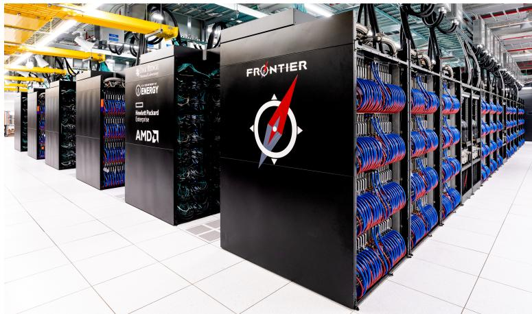
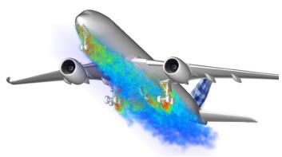

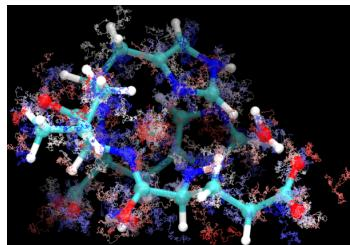

simulations numériques (数值模拟)
développement de l'intelligence artificielle (人工智能发展)

## Calcul haute-performance *高性能计算*

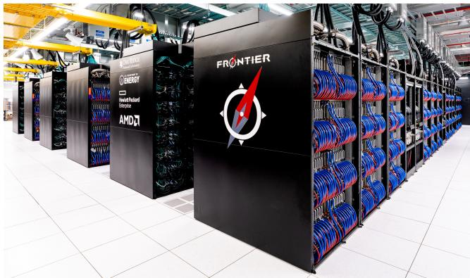

Exascale (Frontier à Oak Ridge, États-Unis) et au-delà : $10^{18}$ flops (contre $10^{11}$ à $10^{13}$ flops pour un ordinateur de bureau) (Exascale（美国橡树岭的 Frontier）及更高：$10^{18}$ flops（台式机为 $10^{11}$ 至 $10^{13}$ flops）)

## Problématiques majeures *主要问题*

- Passage à l'échelle（可扩展性 (Scalability)）
- Hétérogénéité (异构性)
- Précision numérique (数值精度)
- Diversité logicielle et algorithmique (软件和算法的多样性)
- Coût du transfert des données (数据传输成本)
- Consommation énergétique (能源消耗)

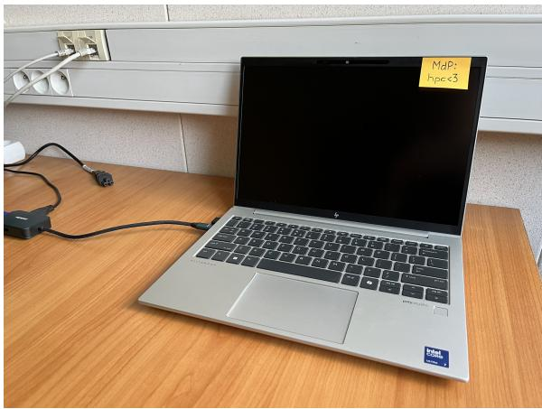
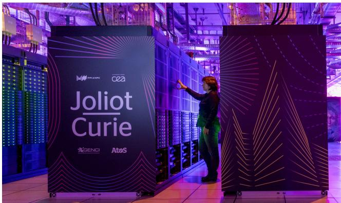


## Défis *挑战*

- décomposer le problème et identifier les portions du calcul parallélisables (分解问题并识别可并行计算的部分)
- repenser l'algorithme et l'implémentation $\rightarrow$ mettre en avant le parallélisme (重新思考算法和实现 $\rightarrow$ 突出并行性)

1. connaitre les architectures parallèles (了解并行架构)
2. adopter les modèles de programmation parallèle (采用并行编程模型)
3. savoir utiliser les interfaces de programmation dédiées (懂得使用专用的编程接口)

## Situation actuelle

### Cet ordinateur : (这台计算机：)


- \>4 types de parallélisme (>4 种并行类型)
- \>7 types de mémoire (>7 种内存类型)
- multitude de modèles et interfaces de programmation parallèle (多种并行编程模型和接口)

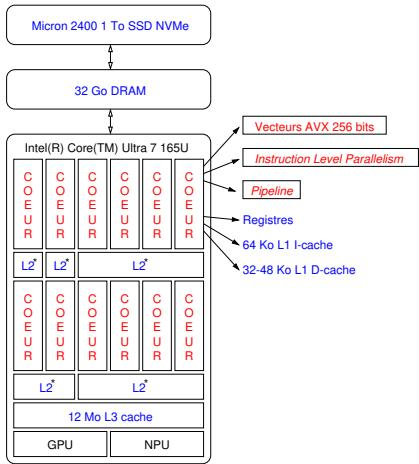
*2 Mo L2 cache* (2 MB 二级缓存)

## Architecture en mémoire partagée *共享内存架构*

**Situation actuelle :** Un nœud bora de la plateforme PlaFRIM. (现状：PlaFRIM 平台的一个 bora 节点。)

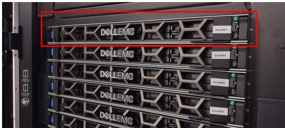

Configurations typiques : (典型配置：)

- 2 × octadeca-coeur Intel(R) Xeon(TM) Gold 6240 @ 2,6 GHz
- 192 Go de mémoire vive
- 1 To d'espace disque

**Principes :** (原理：)

- Partage de la mémoire par tous les processeurs (所有处理器共享内存)
- Communication à travers la mémoire (通过内存通信)
- Très faible latence (极低延迟)
- Réseau d'interconnexion peut être le bus (互连网络可以是总线)
- Extensibilité moindre (可扩展性较差)

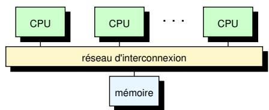

## Architecture en mémoire distribuée *分布式内存架构*

**Situation actuelle :** (现状：)

L'ensemble de la plateforme PlaFRIM (45 nœuds bora interconnectés via un réseau à 100 Gbit/s, plus de 130 nœuds au total) : (整个 PlaFRIM 平台（45 个 bora 节点通过 100 Gbit/s 网络互连，总共超过 130 个节点）：)


El Capitan (Lawrence Livermore National Lab, USA) - 1.7 Exaflops : (El Capitan（美国劳伦斯利弗莫尔国家实验室）- 1.7 Exaflops：)


BullSequana XH3000 (CEA, France) - 0.06 Exaflops : (BullSequana XH3000（法国原子能委员会）- 0.06 Exaflops：)


**Principes :** (原理：)

- Tous les processeurs disposent de leur propre mémoire (所有处理器都有自己的内存)
- Communication par échange de messages (通过消息传递进行通信)
- Grande latence (高延迟)
- Réseau d'interconnexion peut être de type Ethernet (互连网络可以是以太网类型)
- Grande extensibilité (Modèle mis en place dans les centres de calculs) (高可扩展性（计算中心采用的模型）)

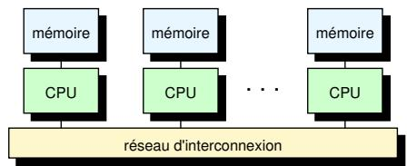

## Types de parallélisme *并行类型*

### Parallélisme de données *数据并行*

Application d'une même opération sur un large ensemble de données (adapté aux vecteurs). (对大量数据应用相同的操作（适用于向量）。)

**Exemple 1 : Tri de mots** (示例 1：单词排序)
Répartir les mots dans des catégories en fonction de leur première lettre et compter le nombre de mots par catégorie. (根据单词的首字母将单词分类，并计算每个类别的单词数量。)

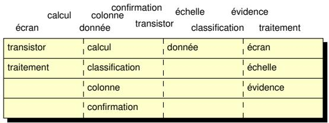


**Exemple 2 : Comptage** (示例 2：计数)

*Séquentiel :* (串行：)
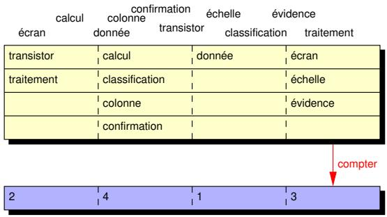

*Parallèle :* (并行：)
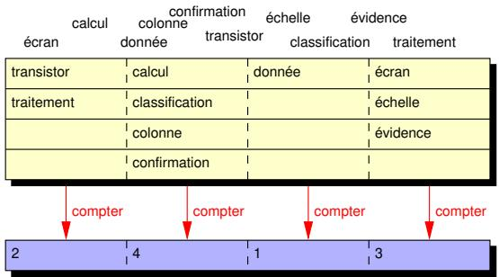

**Exemple 3 : Somme d'un champ de valeurs** (示例 3：求值域之和)

*Séquentiel :* (串行：)


*Parallèle (Sommes locales) :* (并行（局部求和）：)
Décomposer le problème en plusieurs problèmes plus petits à résoudre en parallèle. (将问题分解为多个较小的问题并行解决。)


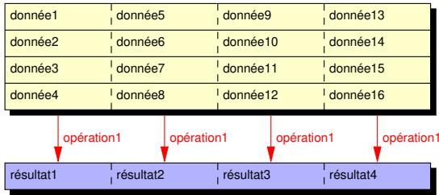

### Chaîne de traitement *处理链 (Pipelining)*

Charge de travail séparée en plusieurs étapes séquentielles, chaque étape exécutée en parallèle sur des données différentes. (工作负载分为多个顺序步骤，每个步骤在不同的数据上并行执行。)

**Exemple : Tube Unix** (示例：Unix 管道)
Utiliser des tubes pour extraire des informations sur un processus. (使用管道提取有关进程的信息。)
Command: `grep -E "^Name|^State|^VmRSS" /proc/<pid>/status | tr -d '\t' | tr -s ' ' | sed 's:/[ ]*/,/g'`

1. GREP - extraction du nom, de l'état et de la consommation mémoire. (GREP - 提取名称、状态和内存消耗。)
2. TR1 - suppression des tabulations (`tr -d`). (TR1 - 删除制表符 (`tr -d`)。)
3. TR2 - suppression d'espaces multiples (`tr -s`). (TR2 - 删除多余空格 (`tr -s`)。)
4. SED - séparation des valeurs avec les virgules. (SED - 用逗号分隔值。)

*Exécution séquentielle (20 unités de temps) :* (串行执行（20 个时间单位）：)
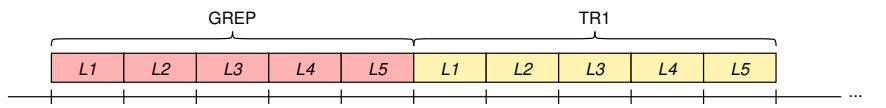
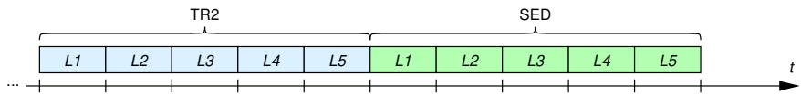

*Exécution parallèle (8 unités de temps) :* (并行执行（8 个时间单位）：)
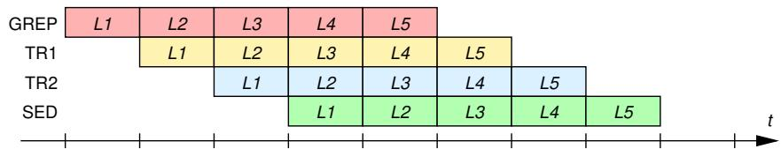
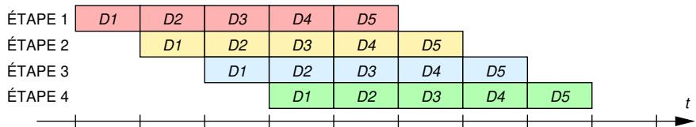

### Parallélisme de tâches *任务并行*

Application d'opérations diverses sur un même ensemble de données, ou d'opérations diverses sur divers ensembles de données. (对同一数据集应用不同的操作，或对不同的数据集应用不同的操作。)

**Exemple : Calcul d'itinéraires** (示例：路线计算)

*Séquentiel :* (串行：)
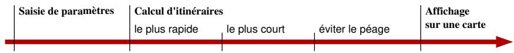

*Parallèle :* (并行：)
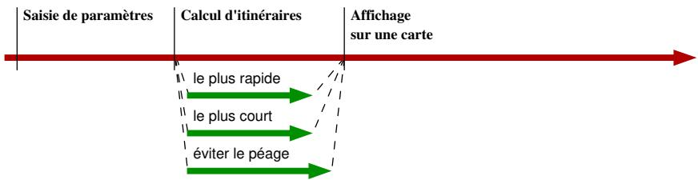

## Modèles d'exécution

- **Processus** : Co-existence de plusieurs applications en mémoire et partage du temps processeur. (进程：内存中多个应用程序共存并共享处理器时间。)
- **Fil d'exécution (Thread)** : Co-existence de plusieurs unités d'exécution dans une même application. (线程：同一应用程序中多个执行单元共存。)
- **Tube** : Communication entre processus sur le même système. (管道：同一系统上的进程间通信。)
- **Socket** : Communication entre processus sur des machines distinctes. (套接字：不同机器上的进程间通信。)

### Charge de travail répartie entre plusieurs processus ou fils d'exécution (分布在多个进程或线程之间的工作负载)

**Exemple avec `fork()` (Processus) :** (使用 `fork()` 的示例（进程）：)

```c
#include <unistd.h>
#include <stdio.h>
#include <sys/wait.h>

int main(int argc, char **argv) {
    pid_t child = fork();
    if (child == 0) {
        // Calcul 2 (Enfant) (计算 2（子进程）)
    } else {
        // Calcul 1 (Parent) (计算 1（父进程）)
        wait(NULL); // Attente de la fin de l'enfant (等待子进程结束)
        // Résultat final (最终结果)
    }
    return 0;
}
```

**Exemple avec `pthread` (Fils d'exécution) :** (使用 `pthread` 的示例（线程）：)

```c
#include <unistd.h>
#include <stdio.h>
#include <pthread.h>

void *work(void *tid) {
    // Calcul 2 (计算 2)
    return NULL;
}

int main(int argc, char **argv) {
    pthread_t tid;
    int child = 1;
    pthread_create(&tid, NULL, work, (void *)&child);
    // Calcul 1 (计算 1)
    pthread_join(tid, NULL);
    // Résultat final (最终结果)
    return 0;
}
```

Pour travailler sur un même problème, les processus et les fils d'exécution ont besoin de communiquer. (为了解决同一个问题，进程和线程需要进行通信。)

## Communication et Mémoire

### Mémoire partagée *共享内存*

- **Processus** : Explicite (mise en place d'un segment de mémoire partagée). (进程：显式（建立共享内存段）。)
- **Fils d'exécution** : Implicite (accès à l'espace mémoire commun du processus parent). (线程：隐式（访问父进程的公共内存空间）。)

### Mémoire distribuée *分布式内存*

- **Explicite** : Échange de messages entre processus. (显式：进程间消息传递。)

### Processus vs Fil d'exécution : Partage de variables

**Processus (fork) :** Les variables sont copiées (COW), pas partagées par défaut. (进程 (fork)：变量被复制 (COW)，默认不共享。)

```c
#include <unistd.h>
#include <stdio.h>
#include <sys/wait.h>

int main(int argc, char **argv) {
    int val = 2;
    pid_t child = fork();
    if (child == 0) {
        val += 1; // Modifie la copie locale (修改本地副本)
    } else {
        val += 2;
        wait(NULL);
    }
    printf("PID %d PPID %d VAL is %d\n", getpid(), getppid(), val);
    return 0;
}
```

*Résultat :* Le parent affiche 4, l'enfant affiche 3 (modification locale). (结果：父进程显示 4，子进程显示 3（本地修改）。)

**Fils d'exécution (thread) :** Les variables pointées sont partagées. (线程 (thread)：指向的变量是共享的。)

```c
#include <unistd.h>
#include <stdio.h>
#include <pthread.h>

void *work(void *arg) {
    int *val = (int *)arg;
    (*val) += 1; // Modifie la variable partagée (修改共享变量)
    return NULL;
}

int main(int argc, char **argv) {
    int val = 2;
    pthread_t tid;
    pthread_create(&tid, NULL, work, (void *)&val);
    val += 2;
    pthread_join(tid, NULL);
    printf("PID %d PPID %d VAL is %d\n", getpid(), getppid(), val);
    return 0;
}
```

*Résultat :* Affiche 5 (2 + 2 + 1). (结果：显示 5 (2 + 2 + 1)。)

## Communication en mémoire partagée *共享内存通信*

### Échange de messages vs Mémoire partagée

**Échange de messages (IPC System V, POSIX) :** (消息传递 (IPC System V, POSIX)：)

- Communication entre deux ou plusieurs processus. (两个或多个进程之间的通信。)
- Les données sont recopiées dans un tampon. (数据被复制到缓冲区。)
- Passe par le noyau. (通过内核。)
- **Avantage** : Échange entre espaces d'adressage distincts. (优点：在不同的地址空间之间交换。)
- **Inconvénient** : Latence. (缺点：延迟。)

**Mise en commun de mémoire (Shared Memory) :** (共享内存 (Shared Memory)：)

- Accès direct aux mêmes données. (直接访问相同的数据。)
- **Avantages** : Facile, global, faible latence. (优点：简单、全局、低延迟。)
- **Inconvénient** : Nécessite des synchronisations explicites. (缺点：需要显式同步。)

## Problème de concurrence *并发问题*

**Définition :** Utilisation d'une ressource partagée par plusieurs entités d'exécution (processus, fils d'exécution, noyau...). (定义：多个执行实体（进程、线程、内核...）使用共享资源。)

**Problème fondamental :** Accès à une variable critique (variable partagée dont les accès ne sont pas atomiques). (根本问题：访问临界变量（访问非原子的共享变量）。)
**Opération atomique :** Une opération (instruction, fonction...) qui apparaît comme indivisible. (原子操作：看起来不可分割的操作（指令、函数...）。)

**Exemple : Incrémenter une variable N fois** (示例：将变量递增 N 次)

*Implémentation séquentielle :* (串行实现：)

```c
#include <stdio.h>
#define N 10000

int main() {
    int val = 0;
    for (int i = 0; i < N; i++)
        val += 1;
    printf("val = %d\n", val);
    return 0;
}
```

*Résultat :* `val = 10000` (结果：`val = 10000`)

*Implémentation parallèle incorrecte :* (错误的并行实现：)

```c
#include <stdio.h>
#include <pthread.h>
#define N 10000
#define THREADS 4

void *work(void *arg) {
    int *val = (int *)arg;
    for (int i = 0; i < (N / THREADS); i++) {
        (*val) += 1; // Accès concurrent non protégé ! (未受保护的并发访问！)
    }
    return NULL;
}

int main() {
    int val = 0;
    pthread_t tid[THREADS];
    for (int i = 0; i < THREADS; i++)
        pthread_create(&tid[i], NULL, work, (void *)&val);
    for (int i = 0; i < THREADS; i++)
        pthread_join(tid[i], NULL);
    printf("val = %d\n", val);
    return 0;
}
```

*Résultat :* `val = 9991` (Non-déterministe, Condition de concurrence / Race Condition). (结果：`val = 9991`（不确定性，竞争条件 / Race Condition）。)

**À retenir :** (记住：)

1. Un programme non-déterministe n'est pas forcément faux. (不确定的程序不一定是错误的。)
2. Un bogue dû à une condition de concurrence n'est pas déterministe. (由竞争条件引起的错误是不确定的。)
3. Il faut identifier les conditions de concurrence et rendre atomiques les accès. (必须识别竞争条件并使访问原子化。)

### Exclusion mutuelle *互斥*

Garantie qu'une suite d'instructions (Section critique) ne puisse être exécutée que par une seule entité d'exécution à la fois. (保证一系列指令（临界区）一次只能由一个执行实体执行。)

**Section critique *临界区* :** Partie du programme qui accède à la ressource partagée. (临界区：访问共享资源的程序部分。)

| Contexte | Forme |
| :--- | :--- |
| Fils d'exécution (线程) | Verrous (Mutex) (锁) |
| Processus (mém. partagée) (进程（共享内存）) | Sémaphores (信号量) |
| Processus (sans mém. partagée) (进程（无共享内存）) | Verrouillage de fichiers (文件锁定) |
| Signaux (信号) | Masquage (屏蔽) |

*Implémentation parallèle correcte (avec Mutex) :* (正确的并行实现（使用互斥锁）：)

```c
#include <stdio.h>
#include <pthread.h>
#define N 10000
#define THREADS 4

pthread_mutex_t lock = PTHREAD_MUTEX_INITIALIZER;

void *work(void *arg) {
    int *val = (int *)arg;
    for (int i = 0; i < (N / THREADS); i++) {
        pthread_mutex_lock(&lock);
        (*val) += 1;
        pthread_mutex_unlock(&lock);
    }
    return NULL;
}
```

*Note : Aucun parallélisme réel ici, une seule addition à la fois.* (注意：这里没有真正的并行性，一次只能进行一次加法。)

*Implémentation parallèle optimisée (Sommes locales) :* (优化的并行实现（局部求和）：)

```c
void *work(void *arg) {
    int *val = (int *)arg;
    int local = 0;
    for (int i = 0; i < (N / THREADS); i++) {
        local += 1;
    }
    pthread_mutex_lock(&lock);
    (*val) += local;
    pthread_mutex_unlock(&lock);
    return NULL;
}
```

### Autres primitives de synchronisation

**Barrière *屏障* :** Attente que toutes les entités atteignent un point spécifique. (等待所有实体到达特定点。)

```c
#include <stdio.h>
#include <pthread.h>
// Psuedo-code example
pthread_barrier_t barrier;

void *work(void *arg) {
    // ... étape 1 ...
    pthread_barrier_wait(&barrier);
    // ... étape 2 (commence seulement quand tous ont fini 1) ... (步骤 2（仅当所有人都完成 1 时才开始）)
}
```

**Condition *条件变量* :** Attente d'un événement spécifique (Producteur-Consommateur). (等待特定事件（生产者-消费者）。)

```c
pthread_cond_t condition;
pthread_mutex_t lock;

void *consumer(void *arg) {
    pthread_mutex_lock(&lock);
    while (empty)
        pthread_cond_wait(&condition, &lock);
    // Consommation
    pthread_mutex_unlock(&lock);
}

void *producer(void *arg) {
    pthread_mutex_lock(&lock);
    // Production
    empty = 0;
    pthread_cond_signal(&condition);
    pthread_mutex_unlock(&lock);
}
```

## Paradigmes et Interfaces

### Paradigmes de programmation *编程范式*

1. **Fork-join** :
    - 1 fil maître, création de travailleurs, attente de la fin. (1 个主线程，创建工作线程，等待结束。)
    - Synchronisations explicites. (显式同步。)
    - 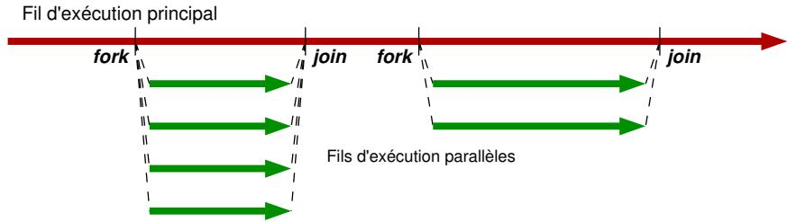

2. **Graphe de tâches** :
    - Instructions réparties en tâches avec dépendances. (指令分为具有依赖关系的任务。)
    - Exécution confiée à un moteur dédié (simplification). (执行委托给专用引擎（简化）。)
    - Synchronisations implicites. (隐式同步。)
    - 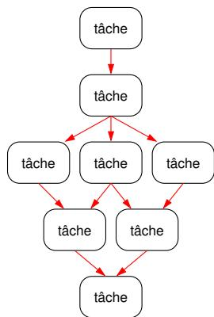

3. **Échange de messages** :
    - Plusieurs copies communiquant par messages (MPI). (多个副本通过消息（MPI）进行通信。)
    - 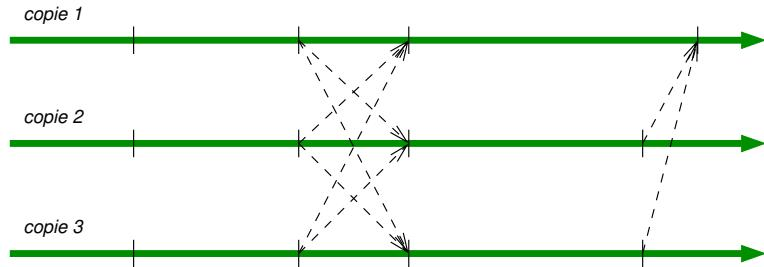

### Interfaces de programmation *编程接口*

**Mémoire partagée *共享内存* :**

- *Bas niveau* : Instructions vectorielles (AVX), Pthreads, CUDA. (底层：向量指令 (AVX)、Pthread、CUDA。)
- *Haut niveau* : OpenMP, StarPU. (高层：OpenMP、StarPU。)

**Mémoire distribuée *分布式内存* :**

- MPI (Message Passing Interface).

### Moteurs d'exécution *执行引擎*

- Gestion des unités d'exécution.
- Ordonnancement.
- Gestion de la mémoire et accès aux données.
