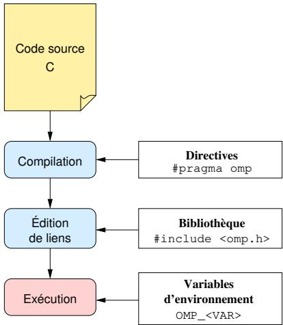
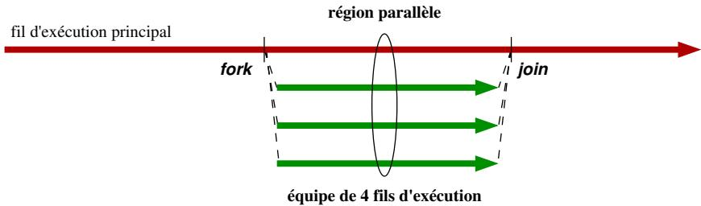
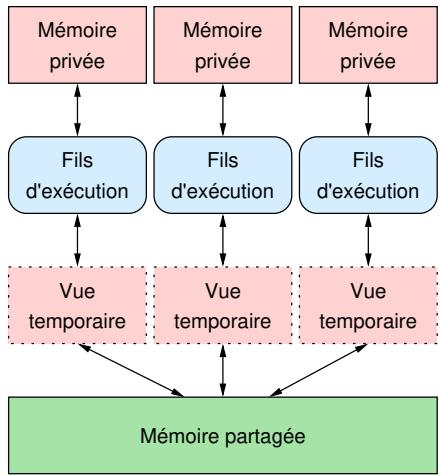
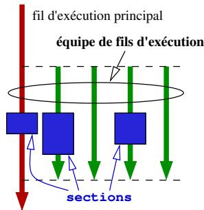
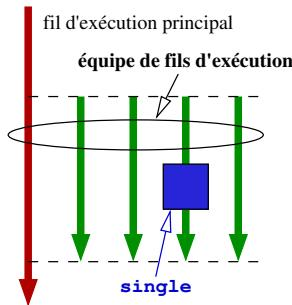
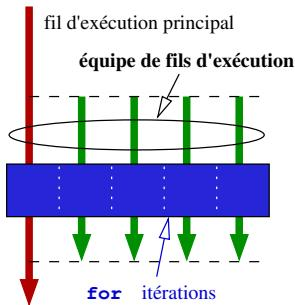
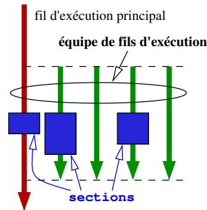
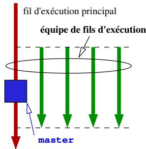

# OpenMP

## Table des matières *目录*

- [OpenMP](#openmp)
  - [Table des matières *目录*](#table-des-matières-目录)
  - [Motivation *动机*](#motivation-动机)
  - [Remarques *备注*](#remarques-备注)
  - [1 directives *指令*](#1-directives-指令)
  - [2 bibliothèque *库*](#2-bibliothèque-库)
  - [3 variables d'environnement *环境变量*](#3-variables-denvironnement-环境变量)
  - [Modèle d'exécution *执行模型*](#modèle-dexécution-执行模型)
  - [Modèle de mémoire *内存模型*](#modèle-de-mémoire-内存模型)
  - [Répartition de la charge de travail *工作负载分配*](#répartition-de-la-charge-de-travail-工作负载分配)
  - [Synchronisation *同步*](#synchronisation-同步)
  - [Graphe de tâches *任务图*](#graphe-de-tâches-任务图)
  - [Instructions et registres vectoriels *指令和向量寄存器*](#instructions-et-registres-vectoriels-指令和向量寄存器)
  - [Syntaxe en langage C *C 语言语法*](#syntaxe-en-langage-c-c-语言语法)
  - [Régles de base *基本规则*](#régles-de-base-基本规则)
  - [Syntaxe de la directive parallel en C *C 语言中 parallel 指令的语法*](#syntaxe-de-la-directive-parallel-en-c-c-语言中-parallel-指令的语法)
  - [Syntaxe de la directive parallel en C *C 语言中 parallel 指令的语法*](#syntaxe-de-la-directive-parallel-en-c-c-语言中-parallel-指令的语法-1)
  - [Syntaxe des directives imbriquées *嵌套指令的语法*](#syntaxe-des-directives-imbriquées-嵌套指令的语法)
  - [Répartition de la charge de travail *工作负载分配*](#répartition-de-la-charge-de-travail-工作负载分配-1)
  - [Syntaxe de la directive for en C *C 语言中 for 指令的语法*](#syntaxe-de-la-directive-for-en-c-c-语言中-for-指令的语法)
  - [Syntaxe de la directive sections en C *C 语言中 sections 指令的语法*](#syntaxe-de-la-directive-sections-en-c-c-语言中-sections-指令的语法)
  - [Syntaxe de la directive single en C *C 语言中 single 指令的语法*](#syntaxe-de-la-directive-single-en-c-c-语言中-single-指令的语法)
  - [Syntaxe de la directive master en C *C 语言中 master 指令的语法*](#syntaxe-de-la-directive-master-en-c-c-语言中-master-指令的语法)
  - [Syntaxe raccourcie *简写语法*](#syntaxe-raccourcie-简写语法)
    - [Répartition de la charge de travail *工作负载分配*](#répartition-de-la-charge-de-travail-工作负载分配-2)
  - [Statut des variables *变量状态*](#statut-des-variables-变量状态)
  - [Clauses principales *主要子句*](#clauses-principales-主要子句)
  - [Syntaxe de la clause private en C *C 语言中 private 子句的语法*](#syntaxe-de-la-clause-private-en-c-c-语言中-private-子句的语法)
  - [Syntaxe de la clause firstprivate en C *C 语言中 firstprivate 子句的语法*](#syntaxe-de-la-clause-firstprivate-en-c-c-语言中-firstprivate-子句的语法)
  - [Syntaxe de la clause lastprivate en C *C 语言中 lastprivate 子句的语法*](#syntaxe-de-la-clause-lastprivate-en-c-c-语言中-lastprivate-子句的语法)
  - [Syntaxe de la clause shared en C *C 语言中 shared 子句的语法*](#syntaxe-de-la-clause-shared-en-c-c-语言中-shared-子句的语法)
  - [Syntaxe de la clause default en C *C 语言中 default 子句的语法*](#syntaxe-de-la-clause-default-en-c-c-语言中-default-子句的语法)
  - [Exemple d'utilisation (使用示例)](#exemple-dutilisation-使用示例)
  - [Syntaxe de la clause reduction en C *C 语言中 reduction 子句的语法*](#syntaxe-de-la-clause-reduction-en-c-c-语言中-reduction-子句的语法)
  - [Condition de concurrence et synchronisation *竞争条件与同步*](#condition-de-concurrence-et-synchronisation-竞争条件与同步)
  - [Exclusion mutuelle *互斥*](#exclusion-mutuelle-互斥)
  - [Barrières *屏障*](#barrières-屏障)
  - [Syntaxe de la directive critical en C *C 语言中 critical 指令的语法*](#syntaxe-de-la-directive-critical-en-c-c-语言中-critical-指令的语法)
  - [Syntaxe de la directive atomic en C *C 语言中 atomic 指令的语法*](#syntaxe-de-la-directive-atomic-en-c-c-语言中-atomic-指令的语法)
  - [Syntaxe de la directive barrier en C *C 语言中 barrier 指令的语法*](#syntaxe-de-la-directive-barrier-en-c-c-语言中-barrier-指令的语法)
  - [Quelques fonctions de bibliothèque *一些库函数*](#quelques-fonctions-de-bibliothèque-一些库函数)

Open Multi-Processing – interface de programmation standard pour la conception d'applications paralleles sur architectures à mémoire partagée (Open Multi-Processing – 用于共享内存架构上并行应用程序设计的标准编程接口)

■ basée sur le concept des fils d'exécution parallelées (基于并行线程的概念)

étendue aux opérations vectorielles et aux accelérateurs matériels (扩展到向量操作和硬件加速器)

## Motivation *动机*

■ standard mature, bien supporté par les compilingurs modernes et largement repandu en calcul haute-performance (成熟的标准，被现代编译器良好支持，并广泛应用于高性能计算)

possibilité d'obtenir de bonnes performances avec un effort de programmation moindre (能够以较少的编程工作量获得良好的性能)

1 interface focalisée sur la parallélisation de nids de boucles (1 专注于循环嵌套并行的接口)

1997, 1998 (1.0): premières spécifications pour Fortran, puis pour C/C++ (1997, 1998 (1.0): Fortran 的首个规范，随后是 C/C++)

2005 (2.5): specifications combinées pour les trois langages (2005 (2.5): 三种语言的合并规范)

2 diversification de l'interface (2 接口的多样化)

2008 (3.0): support pour le parallélisme à base de tâches (2008 (3.0): 支持基于任务的并行性)

2013 - 2018 (4.0 - 5.0): support pour les accélérateurs matériels et les opérations vectorielles, évolution du support pour le parallélisme à base de tâches, meilleure interoperabilité avec d'autres modèles de programmation (échange de messages) (2013 - 2018 (4.0 - 5.0): 支持硬件加速器和向量操作，基于任务的并行性支持的演进，与其他编程模型（消息传递）更好的互操作性)

2024 (6.0): avances dans la programmation d'architectures paralleles hétérogenes (2024 (6.0): 异构并行架构编程的进展)

1 annoter le code source avec des directives #pragma omp ... (1 使用 #pragma omp ... 指令注释源代码)

indiquer les instructions à exécuter en parallè (指示要并行执行的指令)

specifier la répartition des données et des instructions entre les fils d'exécution (指定线程之间的数据和指令分配)

2 laisser le compilateur produit le programme parallele (2 让编译器生成并行程序)

Principe général *基本原理*

1 annoter le code source avec des directives #pragma omp ... (1 使用 #pragma omp ... 指令注释源代码)

indiquer les instructions à exécuter en parallèle (指示要并行执行的指令)

specifier la répartition des données et des instructions entre les fils d'exécution (指定线程之间的数据和指令分配)

2 laisser le compilateur produit le programme parallele (2 让编译器生成并行程序)

## Remarques *备注*

code source généralement semantiquement équivalent avec ou sans les directives (带有或不带有指令的源代码在语义上通常是等效的)

impact souvenir moindre sur le code source séquentiel original (对原始顺序源代码的影响最小)

■ aspects cruciaux de la parallélisation restent à la charge du programmeur (并行的关键方面仍由程序员负责)

repérez ou mettre en avant le parallélisme (识别或突出并行性)

trouver une strategie de parallélisation efficace (找到有效的并行化策略)

Parallelisation de  $\mathbf{a} \cdot \mathbf{b} = \sum_{i=1}^{n} a_i b_i$  avec OpenMP: (即 $\mathbf{a} \cdot \mathbf{b} = \sum_{i=1}^{n} a_i b_i$ 的 OpenMP 并行化：)

```c
#include <stdio.h>
#define N 256

int main() {
    double somme = 0;
    double a[N], b[N];

    // Initialisation des tableaux 'a' et 'b'
    for (size_t i = 0; i < N; i++) {
        a[i] = i * 0.5;
        b[i] = i * 2.0;
    }

    // Calcul du produit scalaire
    #pragma omp parallel for reduction(+:somme)
    for (size_t i = 0; i < N; i++) {
        somme = somme + a[i] * b[i];
    }

    // Affichage du résultat
    printf("somme = %g\n", somme);
    return 0;
}
```

## 1 directives *指令*

indiquer les instructions à parallésiser (指示要并行的指令)

indiquer les points de synchronisation (指示同步点)

Répartir la charge de travail et les données (分配工作负载和数据)

## 2 bibliothèque *库*

■ modification du comportement à l'exécution (■ 修改执行行为)

surveillance de l'environnement d'exécution (监控执行环境)

## 3 variables d'environnement *环境变量*

paramétrer une évolution (配置执行)




## Modèle d'exécution *执行模型*




1 principal et 3 travaillleurs (1 个主线程和 3 个工作线程)


introduction de régions parallètes à l'aide de directives (使用指令引入并行区域)

■ exécution selon le modele fork-join (■ 根据 fork-join 模型执行)

1 entrée dans une région parallele (1 进入并行区域)

■ création de fils d'exécution travaillleurs (■ 创建工作线程)

2 exécution d'une région parallele (2 执行并行区域)

le fils d'exécution principal et les fils travaillleurs forment une équipe (主线程和工作线程组成一个团队)

3 sortie d'une région parallele (3 退出并行区域)

■ destruction des fils d'exécution travaillleurs (■ 销毁工作线程)


## Modèle de mémoire *内存模型*

mémoire partagée accessible par tous les fils d'exécution (所有线程均可访问的共享内存)

un espace mémoire privé pour chaque fils d'exécution (每个线程的私有内存空间)

transferts de données réalisés de façon transparente pour le programmeur (对程序员透明的数据传输)




construction de régions paralleles (构建并行区域)

#pragma omp parallel : création d'une région parallele selon le modele fork-join (#pragma omp parallel : 根据 fork-join 模型创建并行区域)

## Répartition de la charge de travail *工作负载分配*

#pragma omp for : parallélisation d'un nid de boucles for (#pragma omp for : for 循环嵌套的并行化)

#pragma omp sections : parallélisation de blocs d'instructions arbitraires (#pragma omp sections : 任意指令块的并行化)

- #pragma omp master et #pragma omp single : exécution d'un bloc d'instructions par un seul fil d'exécution (- #pragma omp master 和 #pragma omp single : 由单个线程执行指令块)

## Synchronisation *同步*

- #pragma omp barrier : point de synchronisation global (- #pragma omp barrier : 全局同步点)

#pragma omp critical : section critique, exécution par un seul fil d'exécution à la fois (#pragma omp critical : 临界区，一次仅由一个线程执行)

#pragma omp atomic: écriture en mémoire atomique (#pragma omp atomic: 原子内存写入)

## Graphe de tâches *任务图*

#pragma omp task : déclaration d'une tâche (#pragma omp task : 声明任务)

#pragma omp taskgroup : déclaration d'un groupe de tâches (#pragma omp taskgroup : 声明任务组)

#pragma omp taskwait: barrière de synchronisation de tâches (#pragma omp taskwait: 任务同步屏障)

## Instructions et registres vectoriels *指令和向量寄存器*

#pragma omp simd: parallélisation à l'aide d'instructions vectorielles (#pragma omp simd: 使用向量指令进行并行化)

■utilisation d'accelerateurs matériels (■ 使用硬件加速器)

#pragma omp target : délegation du calcul à un accéléateur matériel (#pragma omp target : 将计算委托给硬件加速器)


## Syntaxe en langage C *C 语言语法*

pragma omp directive [clause [clause] ...]

1 la sentinelle #pragma omp (1 哨兵 #pragma omp)

2 une directive valide (2 有效指令)

3 une ou plusieurs clauses (3 一个或多个子句)

4 un return à la ligne (4 换行符)

## Régles de base *基本规则*

une directive s'applique sur l'instruction ou le bloc d'instructions  $\{\dots \}$  qui suit (指令应用于随后的指令或指令块 $\{\dots \}$)

une directive peut etre séparée en plusieurs lignes avec « \» (指令可以用“\”分成多行)

## Syntaxe de la directive parallel en C *C 语言中 parallel 指令的语法*

```c
#pragma omp parallel [clause [clause] ...]
{
    // Région parallèle
}
```

- création d'une equipe de fils d'exécution (- 创建线程团队)

■ fils d'exécution principal et des fils d'exécution travaillleurs (■ 主线程和工作线程)

définition du nombre de fils d'exécution par ordre de priorité (按优先级定义线程数)

1 clause if (1 clause if)

2 clause num_threads (2 clause num_threads)

3 fonction de bibliothèque omp_set_num_threads() (3 库函数 omp_set_num_threads())

4 variable d'environnement OMP_NUM_THREADS (4 环境变量 OMP_NUM_THREADS)

5 valeur par défaut (nombres de cœurs de processeur disponibles) (5 默认值（可用处理器核心数）)

■ barrière implicite avant la destruction des fils d'exécution travaillleurs (■ 销毁工作线程前的隐式屏障)

## Syntaxe de la directive parallel en C *C 语言中 parallel 指令的语法*

```c
#pragma omp parallel [clause [clause] ...]
{
    // Région parallèle
}
```

variables dans la portée de la région parallèle sont partagées par défaut (并行区域范围内的变量默认是共享的)

■ branchements interdits depuis ou vers une région parallele (■ 禁止从并行区域跳转出或跳转入)

clauses possibles: if, num_threads, private, shared, default, firstprivate, reduction, ... (可能的子句：if, num_threads, private, shared, default, firstprivate, reduction, ...)


Exemple: « Bonjour » multiple (示例：多个“Bonjour”)

```c
#include <stdio.h>

int main() {
    #pragma omp parallel
    printf("Bonjour\n");
    return 0;
}
```

Exécution sur une machine à 4 coeurs logiques : (在 4 个逻辑核心的机器上执行：)

```txt
Bonjour Bonjour Bonjour Bonjour
```

```c
#include <stdio.h>

int main() {
    #pragma omp parallel num_threads(2)
    printf("Bonjour\n");
    return 0;
}
```

Exécution sur une machine à 4 coeurs logiques : (在 4 个逻辑核心的机器上执行：)

```txt
Bonjour Bonjour
```

## Syntaxe des directives imbriquées *嵌套指令的语法*

```c
#include <stdio.h>
#include <omp.h>

int main() {
    omp_set_nested(1);
    #pragma omp parallel num_threads(2)
    {
        #pragma omp parallel num_threads(2)
        printf("Hello,world\n");
    }
    return 0;
}
```
## Répartition de la charge de travail *工作负载分配*

directives à utiliser au sein d'une région parallele (在并行区域内使用的指令)

Répartition de la charge de travail entre les fils d'exécution (在线程之间分配工作负载)

barrière de synchronisation implicite à la sortie (退出时的隐式同步屏障)











## Syntaxe de la directive for en C *C 语言中 for 指令的语法*

pragma omp for [clause [clause] ...] // boucle `for' (// for 循环)

Répartition des iterations de la boucle qui suit entre les fils d'exécution d'une région parallele (在并行区域的线程之间分配后续循环的迭代)

itérateur en mémoire privée (私有内存中的迭代器)

■ restrictions sur la forme de la boucle (■ 对循环形式的限制)

clauses possibles : collapse, firstprivate, lastprivate, nowait, ordered, private, reduction, schedule, ... (可能的子句：collapse, firstprivate, lastprivate, nowait, ordered, private, reduction, schedule, ...)


Exemple : Ajouter val à tous les éléments de tab (示例：将 val 加到 tab 的所有元素中)

```c
#include <stdio.h>
#define N 12

int main(void) {
    double val = 0.5;
    double tab[N];
    for (int i = 0; i < N; i++) tab[i] = 0.5 * i;

    #pragma omp parallel for
    for (int i = 0; i < N; i++) {
        tab[i] = tab[i] + val;
    }

    for (int i = 0; i < N; i++) printf("tab[%d] = %.2lf\n", i, tab[i]);
    return 0;
}
```

Exécution sur une machine à 4 cœurs logiques : (在 4 个逻辑核心的机器上执行：)

```toml
tab[0] = 0.50  
tab[1] = 1.00  
tab[2] = 1.50  
tab[3] = 2.00  
tab[4] = 2.50  
tab[5] = 3.00  
tab[6] = 3.50  
tab[7] = 4.00  
tab[8] = 4.50  
tab[9] = 5.00  
tab[10] = 5.50  
tab[11] = 6.00
```

## Syntaxe de la directive sections en C *C 语言中 sections 指令的语法*

```lisp
#pragma omp sections [clause [clause] ...]  
{  
    #pragma omp section  
    // bloc d'instructions (// 指令块)
    #pragma omp section  
    // bloc d'instructions (// 指令块)
    ...  
}
```

Répartition de blocs d'instructions dans des sections à exécuter en parallèle (将指令块分配到并行执行的 section 中)

une seule exécution par section (每个 section 仅执行一次)

clauses possibles : firstprivate, lastprivate, nowait, private, reduction, … (可能的子句：firstprivate, lastprivate, nowait, private, reduction, …)


Exemple : Ajouter val à tous les éléments de tab (示例：将 val 加到 tab 的所有元素中)

```c
#include <stdio.h>
#define N 12

int main(void) {
    double val = 0.5;
    double tab[N];
    for (int i = 0; i < N; i++) tab[i] = 0.5 * i;

    #pragma omp parallel sections
    {
        #pragma omp section
        for (int i = 0; i < N / 2; i++) tab[i] = tab[i] + val;
        
        #pragma omp section
        for (int i = N / 2; i < N; i++) tab[i] = tab[i] + val;
    }

    for (int i = 0; i < N; i++) printf("tab[%d] = %.2lf\n", i, tab[i]);
    return 0;
}
```

Exécution sur une machine à 2 coeurs logiques : (在 2 个逻辑核心的机器上执行：)

```toml
tab[0] = 0.50  
tab[1] = 1.00  
tab[2] = 1.50  
tab[3] = 2.00  
tab[4] = 2.50  
tab[5] = 3.00  
tab[6] = 3.50  
tab[7] = 4.00  
tab[8] = 4.50  
tab[9] = 5.00  
tab[10] = 5.50  
tab[11] = 6.00
```

## Syntaxe de la directive single en C *C 语言中 single 指令的语法*

pragma omp single [clause [clause] ...]

// bloc d'instructions (// 指令块)

exécution du bloc d'instructions qui suit par un seul et n'importe quel fil d'exécution de l'équipe associée à une construction parallele (由与并行结构关联的团队中的任意一个且仅一个线程执行随后的指令块)

clauses possibles : firstprivate, nowait, private, … (可能的子句：firstprivate, nowait, private, …)


Exemple: « Bonjour » multiple, « tout le monde » unique (示例：多个“Bonjour”，唯一的“tout le monde”)

```c
#include <stdio.h>

int main() {
    #pragma omp parallel
    {
        printf("Bonjour\n");
        #pragma omp single
        printf("tout le monde\n");
    }
    return 0;
}
```

Exécution sur une machine à 4 cœurs logiques : (在 4 个逻辑核心的机器上执行：)

```txt
Bonjour Bonjour tout le monde Bonjour Bonjour
```

## Syntaxe de la directive master en C *C 语言中 master 指令的语法*

pragma omp master

// bloc d'instructions (// 指令块)

■ analogue à single, mais c'est le fil d'exécution principal qui exécute le bloc d'instructions qui suit la directive (■ 类似于 single，但由主线程执行指令之后的指令块)

- pas de barrière de synchronisation implicite à la sortie de la construction contrairement à la directive single (与 single 指令不同，结构退出时没有隐式同步屏障)

■utilisation de moins de cycles du processeur par rapport à single (■ 与 single 相比，使用的处理器周期更少)


Exemple: « Bonjour » multiple, « tout le monde » unique (示例：多个“Bonjour”，唯一的“tout le monde”)

```c
#include <stdio.h>

int main() {
    #pragma omp parallel
    {
        printf("Bonjour\n");
        #pragma omp master
        printf("tout le monde\n");
    }
    return 0;
}
```

Exécution sur une machine à 4 coeurs logiques : (在 4 个逻辑核心的机器上执行：)

```txt
Bonjour Bonjour tout le monde Bonjour Bonjour
```

## Syntaxe raccourcie *简写语法*

```lisp
#pragma omp parallel for [clause [clause] ...]  
// boucle `for' (// for 循环)
#pragma omp parallel sections [clause [clause] ...]  
{  
    #pragma omp section  
    // bloc d'instructions  
    #pragma omp section  
    // bloc d'instructions  
}
```

■ création de régions parallètes contenant une seule construction parallèle (■ 创建仅包含一个并行结构的并行区域)

déconseillée pour les programmes bénéficiant de plusieurs constructions parallètes (不建议用于受益于多个并行结构的程序)

clauses possibles : celles de la directive associée (excepté nowait) (可能的子句：相关指令的子句（不包括 nowait）)


### Répartition de la charge de travail *工作负载分配*

```txt
#pragma omp parallel
{
    #pragma omp for
        // boucle `for`
    #pragma omp single
        // instruction à executer en séquentiel
    #pragma omp for
        // boucle `for'
}
```

une seule création et destruction de région parallele (并行区域仅创建和销毁一次)

réutilisation d'une equipe de fils d'exécution pour exécuter plusieurs constructions parallètes (重用线程团队以执行多个并行结构)

```go
pragma omp parallel for //boucle `for' //instruction a executer en sequentiel #pragma omp parallel for //boucle `for'
```

■ plusieurs créations et destructions de régions parallètes (■ 并行区域的多次创建和销毁)

réutilisation d'une seule equipe de fils d'execution dépend de l'implémentation OpenMP (重用单个线程团队取决于 OpenMP 实现)

```c
#include <stdio.h>
#define SIZE 1024

void init(int *vec) {
    size_t i;
    #pragma omp for
    for (i = 0; i < SIZE; i++)
        vec[i] = 0;
}

int main() {
    int vec[SIZE];
    #pragma omp parallel
    {
        init(vec);
    }
    return 0;
}
```

étendues d'application d'une région parallele (并行区域的适用范围)

statique : bloc d'instructions qui suit directement la directive (静态：指令后直接跟随的指令块)

■ dynamique : corps des fonctions appelées depuis la région (■ 动态：从该区域调用的函数体)

- directives dans le corps d'une telle fonction sont ignorées si la fonction n'est pas appelée depuis une région parallele (- 如果该函数未从并行区域调用，则忽略该函数体内的指令)


## Statut des variables *变量状态*

clauses dédiées pour contrôle le partage des variables (用于控制变量共享的专用子句)

## Clauses principales *主要子句*

- private : définition d'une liste de variables privées (- private : 定义私有变量列表)

firstprivate : private avec initialisation automatique (firstprivate : 带有自动初始化的 private)

statut par défaut de l'itérateur d'une boucle for parallésée avec #pragma omp for

- lastprivate: private avec mise à jour automatique

shared : définition d'une liste de variables partagées

statut par défaut des variables à l'exception des

itérateurs des boucles for parallésées avec #pragma omp for

variables des tâches parallélisées avec la directive #pragma omp task

default: changement de statut par défaut

■ reduction : définition d'une liste de variables à réduire

## Syntaxe de la clause private en C *C 语言中 private 子句的语法*

private(/* liste de variables */)

définition d'une liste de variables à placer en mémoire privée des fils d'exécution (定义要放入线程私有内存的变量列表)

copie des variables specifiées (指定变量的副本)

—aucun lien avec les variables d'origine (—与原始变量无关联)

références à l'intérieur de la région parallele vers les copies en mémoire privée (并行区域内部对私有内存中副本的引用)

une copie privée par fil d'exécution (每个线程一个私有副本)

■ valeurs de début et de fin indéfinies (■ 开始和结束值未定义)

## Syntaxe de la clause firstprivate en C *C 语言中 firstprivate 子句的语法*

```c
firstprivate(/* liste de variables */)
```

- private avec une initialisation automatique (- private，带有自动初始化)

■ initialisation des variables de la liste avec leur valeur au moment de l'entrée dans la région parallele (■ 使用进入并行区域时的值初始化列表中的变量)

## Syntaxe de la clause lastprivate en C *C 语言中 lastprivate 子句的语法*

lastprivate(/* liste de variables */)

- private avec une mise à jour automatique à la sortie d'une région parallele (- private，带有并行区域退出时的自动更新)

■ mise à jour des variables de la liste avec la valeur de leur copie privée du fil d'exécution qui effectue : (■ 使用执行以下操作的线程的私有副本的值更新列表中的变量：)

soit la derniere iteration d'une boucle parallele (或者是并行循环的最后一次迭代)

soit la derniere section parallele selon l'ordre d'execution sequentiel (或者是按顺序执行顺序的最后一个并行 section)

## Syntaxe de la clause shared en C *C 语言中 shared 子句的语法*

shared(/* liste de variables */)

définition d'une liste de variables avec accès en mémoire partagée (定义具有共享内存访问权限的变量列表)

références depuis la région parallele vers les emplacements mémoire d'origine (从并行区域引用原始内存位置)

■ lisibles et modifiables par tous les fils d'exécution, sauf si une directive de synchronisation spécifique un autre comportement (■ 所有线程均可读写，除非同步指令指定了其他行为)

Attention aux accès concurrents! (注意并发访问！)

## Syntaxe de la clause default en C *C 语言中 default 子句的语法*

default(shared | none)

■ changement de statut par défaut des variables d'une région parallele (■ 更改并行区域变量的默认状态)

none impose d'explicitier le statut de chaque variable (none 强制显式说明每个变量的状态)

## Exemple d'utilisation (使用示例)

pragma omp parallel for default(shared)

## Syntaxe de la clause reduction en C *C 语言中 reduction 子句的语法*

reduction(opérateur: /* liste de variables partagées */)

■ réduction sur les variables de la liste (■ 对列表中的变量进行归约)

une copie privée de chaque variable dans la liste par fil d'exécution (每个线程对列表中每个变量有一个私有副本)

opérateur de réduction  $(+, -, *, \&, |, \hat{\cdot}, \&\&, ||)$  appliqué aux copies privées à la fin de la construction parallèle (归约运算符 $(+, -, *, \&, |, \hat{\cdot}, \&\&, ||)$ 在并行结构结束时应用于私有副本)

■ placement du résultat dans la variable partagée correspondante (■ 将结果放入相应的共享变量)


Exemple : Variable partagée versus variable privée (示例：共享变量与私有变量)

```c
include<stdio.h>   
#include <unistd.h>   
#include<stdlib.h>   
int main(void){ int val; #pragma omp parallel { val  $=$  rand(  $\%$  10sleep(1); printf("val:%d\n",val); } return 0;
```

Exécution sur une machine à 4 cœurs logiques :

```yaml
val : 5  
val : 5  
val : 5  
val : 5
```

```c
include<stdio.h>   
#include<unistd.h>   
#include<stdlib.h>   
int main(void){ int val; #pragma omp parallel private(val) { val  $=$  rand(  $\%$  10sleep(1); printf("val:%d\n",val); } return 0;
```

Exécution sur une machine à 4 cœurs logiques :

```yaml
val : 6  
val : 3  
val : 7  
val : 5
```

include<stdio.h>

define N 10000

int main() {

int val;

#pragma omp parallel for reduction(+:val)

for(int i = 0; i < N; i++)

val  $+= 1$

printf("val = %d\n", val);

return 0;

}

Exécution sur une machine à 4 coeurs logiques : (在 4 个逻辑核心的机器上执行：)

val $= 10000$


## Condition de concurrence et synchronisation *竞争条件与同步*

## Exclusion mutuelle *互斥*

Assurer qu'un seul fil d'exécution à la fois exécute une portion du programme donnée. (确保一次只有一个线程执行给定的程序部分。)

directives critical et atomic (critical 和 atomic 指令)

## Barrières *屏障*

Attendre que tous les fils d'execution aient atteint un point donné de l'execution avant de continuer. (在继续之前，等待所有线程到达执行的给定点。)

implicites à la fin des constructions parallètes OpenMP (OpenMP 并行结构结束时的隐式屏障)

■ explicites avec la directive/barrier (■ 使用 barrier 指令的显式屏障)


## Syntaxe de la directive critical en C *C 语言中 critical 指令的语法*

pragma omp critical [nom]

// bloc d'instructions (// 指令块)

■ mise en place d'une section critique (■ 设置临界区)

instructions du bloc exécutées par un seul fil d'exécution à la fois (块中的指令一次仅由一个线程执行)

ordre de passage arbitraire des fils d'exécution dans la section critique (线程进入临界区的顺序是任意的)

exécution en exclusion mutuelle des sections critiques avec le même nom (同名临界区的互斥执行)

## Syntaxe de la directive atomic en C *C 语言中 atomic 指令的语法*

pragma omp atomic // instruction d'affection (// 赋值指令)

■ affectation qui suit (évaluation et écriture dans la variable) effectué de façon atomique (■ 随后的赋值（评估和写入变量）以原子方式执行)

plus efficace que la directive critical mais aussi plus spécifique (比 critical 指令更高效，但也更具体)


## Syntaxe de la directive barrier en C *C 语言中 barrier 指令的语法*

pragma omp barrier

point de synchronisation entre tous les fils d'exécution d'une équipe (团队中所有线程之间的同步点)

■ doit être rencontres par tous les fils d'exécution ou aucun (■ 必须被所有线程遇到，或者都不遇到)

Attention à l'interblocage! (注意死锁！)


Exemple : Incrémentation d'une variable N fois sans reduction (示例：将变量递增 N 次而不使用归约)

```c
#include <stdio.h>
#define N 10000

int main() {
    int val = 0;
    #pragma omp parallel for
    for (int i = 0; i < N; i++) {
        #pragma omp atomic
        val += 1;
    }
    printf("val = %d\n", val);
    return 0;
}
```

Exécution sur une machine à 4 coeurs logiques : (在 4 个逻辑核心的机器上执行：)

```txt
val $= 10000$
```

```c
#include <stdio.h>
#define N 10000

int main() {
    int val = 0;
    #pragma omp parallel for
    for (int i = 0; i < N; i++) {
        #pragma omp critical
        val += 1;
    }
    printf("val = %d\n", val);
    return 0;
}
```

Exécution sur une machine à 4 coeurs logiques : (在 4 个逻辑核心的机器上执行：)

```txt
val $= 10000$
```


Exemple: Calcul en deux étapes (示例：两步计算)

```c
#include <stdio.h>
#include <omp.h>

int a, b, total = 0;

int main() {
    #pragma omp parallel num_threads(2)
    {
        int tid = omp_get_thread_num();
        if (tid == 0) a = 12;
        if (tid == 1) b = 30;
        
        #pragma omp barrier
        
        if (tid == 0) {
            total = a + b;
            printf("total = %d\n", total);
        }
    }
    return 0;
}
```

Exécution sur une machine à 4 coûrs logiques : (在 4 个逻辑核心的机器上执行：)

total = 42


## Quelques fonctions de bibliothèque *一些库函数*

void omp_set_num_threads(int n);

Limiter le nombre de fil d'exécution pour la prochaine région parallele à n. (将下一个并行区域的线程数限制为 n。)

int omp_get_num_threads();

Retourne le nombre de fil d'exécution pour la prochaine région parallele. (返回下一个并行区域的线程数。)

void omp_set_nested(int b);

Active (si b non nul) ou désactive (si b nul) l'imbrication de régions paralleles. (激活（如果 b 非零）或停用（如果 b 为零）并行区域的嵌套。)

int omp_get_thread_num();

Retourne l'identifiant du fil d'exécution courant. (返回当前线程的标识符。)

double omp_get_wtime();

Retourne le temps écoulé en secondes depuis un temps de référence. (返回自参考时间以来经过的秒数。)


Exemple: Mesure du temps d'exécution d'un calcul (示例：测量计算的执行时间)

```c
#include <stdio.h>
#include <omp.h>
#define N 100000

int main(void) {
    double sum = 0, tab[N];
    for (int i = 0; i < N; i++) tab[i] = 0.5 * i;
    
    double time = omp_get_wtime();
    
    #pragma omp parallel for reduction(+:sum)
    for (int i = 0; i < N; i++) {
        sum += tab[i];
    }
    
    time = omp_get_wtime() - time;
    printf("Result: %g\n", sum);
    printf("Computation time: %g s\n", time);
    return 0;
}
```

Exécution sur une machine à 4 coeurs logiques : (在 4 个逻辑核心的机器上执行：)

Result: 2.49998e+09

Computation time: 0.000141609 s

```txt
OMP_NUM_THREADS=N
```

Limiter le nombre de fils d'exécution pour la prochaine région parallele à N. (将下一个并行区域的线程数限制为 N。)

```txt
OMP_NESTED=B
```

Active (si B non nul) ou déactive (si B nul) l'imbrication de régions paralleles. (激活（如果 B 非零）或停用（如果 B 为零）并行区域的嵌套。)


Exemple: « Bonjour » multiple (示例：多个“Bonjour”)

```c
#include <stdio.h>

int main() {
    #pragma omp parallel
    printf("Bonjour\n");
    return 0;
}
```

Compilé sous le nom de bonjour et executé sur une machine à 4 cœurs logiques avec la commande ./bonjour, le programme ci-dessus affiche : (编译为 bonjour 并在 4 个逻辑核心的机器上使用命令 ./bonjour 执行，上述程序显示：)

Bonjour

Bonjour

Bonjour

Bonjour

```c
#include <stdio.h>

int main() {
    #pragma omp parallel
    printf("Bonjour\n");
    return 0;
}
```

Compé sous le nom de bonjour et exécutésur une machine à 4 coeurs logiques avec lacommande OMP_NUM_THREAD  $= 3$  ./bonjour,le programme ci-dessus affiche: (编译为 bonjour 并在 4 个逻辑核心的机器上使用命令 OMP_NUM_THREADS = 3 ./bonjour 执行，上述程序显示：)

Bonjour

Bonjour

Bonjour
