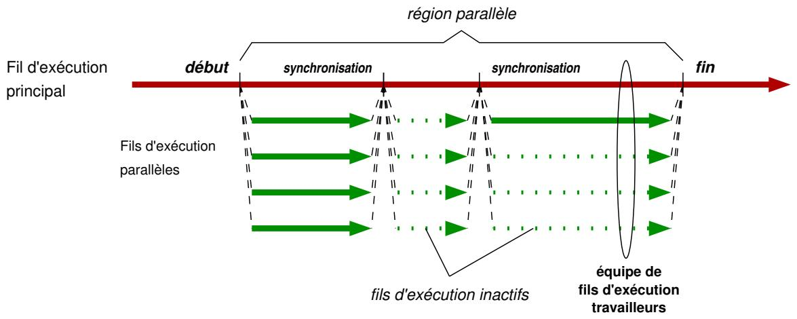

# Projet « EXPRESSO » 项目「EXPRESSO」

Architecture interne des systèmes d'exploitation
操作系统内部架构

## 1 Présentation 介绍

Les fils d'exécution sont une des abstractions du système d'exploitation.
线程是操作系统的一种抽象。

Ils permettent à une application de tirer l'avantage du parallélisme d'une architecture en mémoire partagée en répartissant la charge de travail aux différents cœurs du processeur.
通过把工作负载分配到不同处理器核心，线程让应用利用共享内存体系结构的并行性。

Les systèmes d'exploitation fournissent des interfaces de programmation de bas niveau pour créer et manipuler des fils d'exécution telles que les POSIX threads, ou pthreads.
操作系统提供了创建和操作线程的底层编程接口，如 POSIX threads（pthreads）。

Malheureusement, le développement d'une application à base de pthreads, aussi simple soit-elle, requiert un effort de programmation important.
然而，即使是简单的基于 pthreads 的应用开发也需要较大的编程工作量。

Des interfaces de haut niveau, telles qu'OpenMP [1], ont été développées dans le but de faciliter la conception d'applications parallèles en simplifiant certains aspects techniques liés à la parallélisation.
为简化并行应用的设计、降低并行化相关技术细节的负担，开发了 OpenMP [1] 等高层接口。

Dans le cas d'OpenMP, un ensemble de directives de compilation permettent au programmeur d'exprimer différents types de parallélisme (parallélisme de données, parallélisme de tâches, ...) à travers des paradigmes de programmation tels que le fork-join ou le graphe de tâches sans manipulation directe de fils d'exécution.
以 OpenMP 为例，编译指令集让程序员通过 fork-join 或任务图等编程范式表达不同类型的并行（数据并行、任务并行等），而无需直接操作线程。

Pour vous permettre de mesurer la complexité de la conception d'une interface de programmation telle qu'OpenMP ainsi que pour bien comprendre les mécanismes sous-jacents, le but de ce projet est de développer une interface de programmation parallèle de haut niveau baptisée « EXPRESSO ».
为了让你衡量设计类似 OpenMP 的编程接口的复杂度，并更好理解其底层机制，本项目目标是开发一套名为「EXPRESSO」的高层并行编程接口。

## 2 EXPRESSO 简介

EXPRESSO (= Experimental parallel resource scheduler and organizer) est une interface de programmation parallèle de haut niveau en mémoire partagée basée sur le paradigme de programmation fork-join.
EXPRESSO（= Experimental parallel resource scheduler and organizer）是基于 fork-join 编程范式的共享内存高层并行编程接口。

Dans un programme, elle permet de mettre en place une région parallèle contenant des tâches parallélisables et un ou plusieurs points de synchronisation.
在程序中，它允许定义一个包含可并行任务以及一个或多个同步点的并行区域。

Une tâche parallélisable est définie par une suite d'instructions qui peuvent être exécutées en parallèle à une autre suite d'instructions du programme.
可并行任务由一组可与程序中其他指令并行执行的指令序列定义。

Puis, à chaque tâche parallélisable, il est possible d'associer un ensemble de données nécessaires pour son exécution, c'est-à-dire les données d'entrée et de sortie de la tâche.
此外，每个可并行任务都可以关联其执行所需的数据集合，即任务的输入与输出数据。

Dans ce but, EXPRESSO implémente un moteur d'exécution constitué d'un ordonnanceur et d'une équipe de fils d'exécution travailleurs qui inclut le fil d'exécution principal du programme et un certain nombre de fils d'exécution parallèles.
为此，EXPRESSO 实现了一个执行引擎，由调度器和一组工作线程组成，其中包括程序主线程及若干并行线程。

La taille de cette équipe est fixée en début de la région parallèle et reste inchangée jusqu'à la fin de celle-ci.
该线程团队的规模在并行区域开始时确定，并在结束前保持不变。

Par conséquent, lorsqu'à un moment donné il n'y a pas suffisamment de tâches parallélisables pour occuper tous les fils d'exécution travailleurs, certains restent inactifs.
因此，当某一时刻可并行任务不足以占满所有工作线程时，部分线程会处于空闲状态。

Le schéma ci-dessous illustre l'exécution d'un programme parallèle à base d'EXPRESSO.
下图展示了基于 EXPRESSO 的并行程序执行过程。


Les tâches parallélisables sont définies et envoyées au moteur d'exécution pour être exécutées de façon asynchrone.
可并行任务被定义并发送给执行引擎，以异步方式执行。

Autrement dit, l'exécution effective des tâches ne commence qu'au premier point de synchronisation rencontré.
换言之，任务的实际执行要到遇到第一个同步点才开始。

Elle se termine avec le dernier fil d'exécution travailleur qui franchit le point de synchronisation.
当最后一个工作线程越过同步点时执行结束。

Dès lors, le moteur d'exécution redevient prêt à recevoir de nouvelles tâches ou à sortir de la région parallèle.
此时，执行引擎再次准备好接收新任务或退出并行区域。

À la différence d'OpenMP, EXPRESSO ne définit pas de directives de compilation, mais repose exclusivement sur des appels à fonctions.
不同于 OpenMP，EXPRESSO 不提供编译指令，而完全依赖函数调用。
C'est une bibliothèque écrite en langage C.
它是一个用 C 语言编写的库。

### 2.1 Version de base 基础版本

Dans sa version de base, la bibliothèque EXPRESSO expose l'interface de programmation (API) suivante :
在基础版本中，EXPRESSO 提供如下编程接口（API）：

- `int expresso_initialize();` - lecture de paramètres, allocations de structures de données internes, création et lancement de fils d'exécution parallèles, ... / 读取参数、分配内部数据结构、创建并启动并行线程等。

- `size_t expresso_worker_count();` - récupération du nombre de fils d'exécution travailleurs de l'équipe (y compris le fil d'exécution principal), / 获取线程团队中的工作线程数量（包括主线程）。

- `int expresso_task(void (*)(void*), void *);` - envoi d'une tâche parallélisable au moteur d'exécution (un pointeur vers une fonction qui contient les instructions à effectuer et un pointeur vers une variable ou une structure passée en argument de cette fonction qui représente les données d'entrée et de sortie de la tâche) / 向执行引擎提交一个可并行任务（函数指针表示任务指令，指向变量或结构体的指针表示任务的输入/输出数据）。

- `int expresso_wait();` - lancement de l'exécution des tâches parallélisables précédemment envoyées au moteur d'exécution avec la fonction expresso_task / 启动执行先前通过 expresso_task 提交的可并行任务。

- `void expresso_stats();` - affichage des statistiques sur le nombre de tâches exécutées par chaque fil d'exécution travailleur, le nombre total de tâches exécutées par tous les fils d'exécution travailleurs et la moyenne du nombre de tâches exécutées par chaque fil d'exécution travailleur / 输出统计信息：每个工作线程执行的任务数量、所有工作线程执行任务的总数以及平均值。

- `double expresso_wall_time();` - récupération d'un repère temporel (nombre de secondes écoulées depuis un temps de référence), /获取时间参考点（自参考时刻起经过的秒数）。

- `int expresso_finalize();` - terminaison des fils d'exécution parallèles, libération de la mémoire allouée pour les structures de données internes, nettoyage, ...  / 终止并行线程，释放内部数据结构所分配的内存并进行清理等。

Par défaut, la fonction expresso_initialize crée une équipe avec autant de fils d'exécution travailleurs qu'il y a de cœurs logiques sur la machine qui fait tourner le programme parallèle.
默认情况下，expresso_initialize 会创建与运行并行程序的机器逻辑核心数相同数量的工作线程。

Il est possible de contrôler le nombre de fils d'exécution travailleurs à l'aide de la variable d'environnement EXPRESSO_WORKER_COUNT.
可以通过环境变量 EXPRESSO_WORKER_COUNT 控制工作线程数量。

Par exemple, pour exécuter un programme nommé exemple avec deux fils d'exécution travailleurs, nous pouvons utiliser la commande suivante.
例如，若要用两个工作线程执行名为 exemple 的程序，可以使用如下命令。

```sh
EXPRESSO_WORKER_COUNT=2 ./exemple
```

Il est tout à fait possible de positionner EXPRESSO_WORKER_COUNT à 1 pour n'utiliser qu'un seul fil d'exécution travailleur, c'est-à-dire le fil d'exécution principal.
完全可以将 EXPRESSO_WORKER_COUNT 设为 1，仅使用一个工作线程，即主线程。

À l'exception du fil d'exécution principal, les autres fils d'exécution de l'équipe restent inactifs jusqu'au premier appel à expresso_wait qui déclenche l'exécution des tâches envoyées au moteur d'exécution à l'aide de la fonction expresso_task.
除主线程外，团队中的其他线程会保持空闲，直到第一次调用 expresso_wait，触发通过 expresso_task 发送到执行引擎的任务执行。

L'ordonnancement des tâches parallélisables se fait suivant une politique d'ordonnancement dynamique.
可并行任务的调度采用动态调度策略。

Lorsqu'une tâche est envoyée au moteur d'exécution avec expresso_task, elle est placée dans une file d'attente.
当通过 expresso_task 将任务发送到执行引擎时，任务被放入队列。

Une fois l'exécution déclenchée avec expresso_wait, les fils d'exécution travailleurs viennent chercher une tâche à exécuter dans la file d'attente dès qu'ils sont prêts.
当通过 expresso_wait 触发执行后，工作线程在就绪时会从队列中取出任务执行。

Ce processus se répète jusqu'à ce qu'il n'y ait plus de tâches dans la file d'attente.
该过程重复直到队列中不再有任务。

À ce moment-là, les fils d'exécution travailleurs, sauf le fil d'exécution principal, redeviennent inactifs jusqu'à un nouvel appel à expresso_wait ou expresso_finalize.
此时，除主线程外的工作线程会再次空闲，直到下一次调用 expresso_wait 或 expresso_finalize。

L'exemple suivant illustre l'utilisation de cette API en pratique.
下面的示例展示了该 API 的实际使用方式。

#### 2.1.1 Exemple d'utilisation / 使用示例

Ci-dessous à gauche se trouve l'implémentation séquentielle d'un programme qui calcule la somme sum de quatre entiers a, b, c et d'avant d'afficher le résultat sur sa sortie standard.
下方左侧是程序的顺序实现，该程序计算四个整数 a、b、c、d 的和 sum，并在标准输出中显示结果。

Les sommes intermédiaires a + b et c + d peuvent être effectuées en parallèle et représentent donc deux tâches parallélisables.
中间的 a + b 与 c + d 可以并行计算，因此对应两个可并行任务。

Ci-dessous au milieu se trouve le même programme parallélisé avec EXPRESSO.
下方中间是使用 EXPRESSO 并行化后的同一程序。

La fonction basic_sum_task définit les instructions à effectuer par une tâche, c'est-à-dire une somme.
函数 basic_sum_task 定义了任务执行的指令，即一次求和。

La structure de données s_data représente le moyen de transmettre les données de calcul nécessaires à chaque tâche, c'est-à-dire les opérandes de la somme, ainsi que de récupérer le résultat dans une des opérandes.
数据结构 s_data 用于传递每个任务所需的计算数据（求和的操作数），并将结果回写到其中一个操作数。

Notez que le choix de la structure de données est arbitraire et ne dépend que de l'utilisateur de la bibliothèque EXPRESSO.
请注意，数据结构的选择是任意的，仅取决于 EXPRESSO 库的使用者。

Enfin, ci-dessous à droite se trouve une autre implémentation parallèle du même programme à base d'EXPRESSO qui montre l'utilisation de plus d'un point de synchronisation.
最后，下方右侧展示了同一程序的另一种 EXPRESSO 并行实现，体现了多个同步点的使用。

Dans cette version, la somme finale est calculée dans le cadre d'une troisième tâche qui s'exécute en séquentiel une fois que les deux premières tâches ont terminé leur exécution.
在该版本中，最终求和作为第三个任务顺序执行，并在前两个任务完成后开始。

Séquentiel : 顺序版：

```c
#include <stdio.h>

int main(int argc, char **argv) {
    int a = 10, b = 11, c = 7, d = 14;
    int sum = a + b + c + d;

    printf("%d\n", sum);
    return 0;
}
```

Parallèle avec un point de synchronisation : 单同步点并行版：

```c
#include <stdio.h>
#include <stdlib.h>
#include "expresso.h"

struct s_data {
    int a;
    int b;
};

void basic_sum_task(void *data) {
    struct s_data *this = (struct s_data *)data;
    this->a += this->b;
}

int main(int argc, char **argv) {
    int a = 10, b = 11, c = 7, d = 14;
    int sum;
    struct s_data *data = malloc(2 * sizeof(struct s_data));

    expresso_initialize();

    data[0].a = a;
    data[0].b = b;
    expresso_task(&basic_sum_task, (void *)&data[0]);

    data[1].a = c;
    data[1].b = d;
    expresso_task(&basic_sum_task, (void *)&data[1]);

    expresso_wait();
    sum = data[0].a + data[1].a;

    expresso_stats();
    expresso_finalize();
    printf("%d\n", sum);
    free(data);
    return 0;
}
```

Parallèle avec deux points de synchronisation : 双同步点并行版：

```c
#include <stdio.h>
#include <stdlib.h>
#include "expresso.h"

struct s_data {
    int a;
    int b;
};

void basic_sum_task(void *data) {
    struct s_data *this = (struct s_data *)data;
    this->a += this->b;
}

int main(int argc, char **argv) {
    int a = 10, b = 11, c = 7, d = 14;
    int sum;
    struct s_data *data = malloc(2 * sizeof(struct s_data));

    expresso_initialize();

    data[0].a = a;
    data[0].b = b;
    expresso_task(&basic_sum_task, (void *)&data[0]);

    data[1].a = c;
    data[1].b = d;
    expresso_task(&basic_sum_task, (void *)&data[1]);

    expresso_wait();
    data[0].b = data[1].a;
    expresso_task(&basic_sum_task, (void *)&data[0]);

    expresso_wait();
    sum = data[0].a;

    expresso_stats();
    expresso_finalize();
    printf("%d\n", sum);
    free(data);
    return 0;
}
```

### 2.2 Version avancée 高级版本

Dans la version avancée, l'API de la bibliothèque EXPRESSO est enrichie des éléments suivants :
在高级版本中，EXPRESSO 的 API 增加了以下内容：

- un type schedule_t et des fonctions permettant de choisir une politique d'ordonnancement ou de récupérer la politique d'ordonnancement actuellement en vigueur,  
  一个 schedule_t 类型以及用于选择或获取当前调度策略的函数。

```c
typedef enum {
    SCHEDULE_DYNAMIC,
    SCHEDULE_STATIC,
    SCHEDULE_BALANCED
} schedule_t;

schedule_t expresso_schedule_get();
void expresso_schedule_set(schedule_t);
```

- une fonction de définition et d'envoi de tâches permettant d'associer un poids (un entier non-signé strictement positif) à chaque tâche.  
  一个任务定义与提交函数，用于为每个任务关联权重（严格正的无符号整数）。

```c
int expresso_weighted_task(void (*)(void *), void *, unsigned int);
```

L'objectif est de donner au programmeur le moyen de contrôler la façon dont les tâches parallélisables sont ordonnancées.
其目标是让程序员能够控制可并行任务的调度方式。

La politique d'ordonnancement dynamique (SCHEDULE_DYNAMIC dans schedule_t) est la politique utilisée par la version de base de la bibliothèque (voir la section 2.1).
动态调度策略（schedule_t 中的 SCHEDULE_DYNAMIC）是基础版本使用的策略（见 2.1 节）。

Les politiques d'ordonnancement statique (SCHEDULE_STATIC dans schedule_t) et équilibrée (SCHEDULE_BALANCED dans schedule_t) répartissent les tâches aux fils d'exécution travailleurs avant le début de l'exécution des tâches.
静态调度（SCHEDULE_STATIC）与均衡调度（SCHEDULE_BALANCED）会在任务执行开始前，将任务分配给各个工作线程。

La politique statique vise à répartir les tâches aux fils d'exécution travailleurs dans l'ordre : la première tâche envoyée sera attribuée au fil d'exécution numéro 0, la deuxième tâche au fil d'exécution numéro 1 et ainsi de suite.
静态策略按顺序分配任务：第一项任务分配给线程 0，第二项任务分配给线程 1，以此类推。

S'il y a plus de tâches que de fils d'exécution, l'attribution reprend à partir du fil d'exécution numéro 0.
若任务数量多于线程数量，则从线程 0 重新开始分配。

La politique équilibrée vise à prendre en compte une potentielle différence de la charge de travail entre les tâches.
均衡策略旨在考虑任务之间可能存在的工作量差异。

La fonction expresso_weighted_task permet d'associer un poids à chaque tâche envoyée au moteur d'exécution.
expresso_weighted_task 允许为提交到执行引擎的每个任务关联权重。

En se basant sur le poids des tâches, la politique équilibrée tente d'attribuer les tâches aux fils d'exécution travailleurs de façon à ce que la charge de travail soit équitablement répartie.
基于任务权重，均衡策略尽量将任务分配给工作线程，以使工作负载更均匀。

Par défaut, la version avancée utilise la politique d'ordonnancement dynamique.
高级版本默认使用动态调度策略。

Il est possible de changer de politique d'ordonnancement grâce à la variable d'environnement EXPRESSO_SCHEDULE qui accepte les valeurs dynamic, static ou balanced.
可以通过环境变量 EXPRESSO_SCHEDULE 切换调度策略，取值为 dynamic、static 或 balanced。

Puis, la fonction expresso_schedule_set permet de changer de politique d'ordonnancement depuis la région parallèle avant un appel à expresso_wait.
此外，在并行区域内、调用 expresso_wait 之前，可以通过 expresso_schedule_set 修改调度策略。

## 3 Réalisation 实现与完成

Ce projet a deux objectifs :
本项目有两个目标：

1. implémenter la bibliothèque EXPRESSO,  
   实现 EXPRESSO 库。
2. utiliser EXPRESSO pour paralléliser une collection d'applications séquentielles.  
   使用 EXPRESSO 对一组顺序应用进行并行化。

Le point de départ pour la réalisation de ce projet est constitué des dépôts git suivants :
本项目的起点由以下 git 仓库构成：

- expresso à l'adresse [https://gitlab.com/expresso-student/expresso]  
  expresso 仓库地址：[https://gitlab.com/expresso-student/expresso]
- squelette d'implémentation de la bibliothèque EXPRESSO à compléter  
  需要补全的 EXPRESSO 库实现骨架。
- expresso-benchmarks à l'adresse [https://gitlab.com/expresso-student/expresso-benchmarks]  
  expresso-benchmarks 仓库地址：[https://gitlab.com/expresso-student/expresso-benchmarks]
- applications à paralléliser à l'aide de la bibliothèque EXPRESSO  
  需要用 EXPRESSO 并行化的应用。

### 3.1 Dépôt expresso expresso 仓库

Voici la structure de fichiers du dépôt.
以下是该仓库的文件结构。

expresso

```txt
|-- tests
|    |-- .gitignore
|    |-- Makefile
|    |-- add-to-all.c
|    |-- add-to-all-twice.c
|    |-- basic-sum.c
|    |-- no-tasks.c
|-- .gitignore
|-- Makefile
|-- expresso.h
```

Le fichier en-tête expresso.h définit l'API d'EXPRESSO telle qu'elle est décrite dans les sections 2.1 et 2.2.
文件头 expresso.h 定义了 2.1 与 2.2 节中描述的 EXPRESSO API。
Le fichier source correspondant, c'est-à-dire expresso.c, contient les coquilles vides des définitions des fonctions déclarées dans expresso.h.
对应源文件 expresso.c 包含 expresso.h 中声明函数的空壳实现。

Dans le dossier tests, vous trouvez un ensemble de programmes composés d'une implémentation séquentielle de référence et d'une implémentation parallèle utilisant la bibliothèque EXPRESSO.
在 tests 目录中，你会找到一组程序，它们包含顺序参考实现与使用 EXPRESSO 的并行实现。

Ces programmes, qui vous sont fournis clés en main, vous permettront de tester votre implémentation tout au long du cycle de développement.
这些现成的程序可帮助你在整个开发过程中测试实现。

Puis, il y a deux recettes de construction Makefile.
此外，还有两个 Makefile 构建规则。

Le Makefile à la racine du dépôt permet de :
仓库根目录的 Makefile 可用于：

- compiler le fichier source expresso.c en un fichier binaire expresso.o,  
  将 expresso.c 编译为 expresso.o。
- construire EXPRESSO en tant que bibliothèque statique libexpresso.a, mais aussi en tant que bibliothèque dynamique libexpresso.so (cible par défaut all),  
  构建静态库 libexpresso.a 及动态库 libexpresso.so（默认目标 all）。
- installer/désinstaller EXPRESSO (cibles install et uninstall) à l'emplacement indiqué par la variable PREFIX (voir Makefile),  
  在 PREFIX 变量指定的位置安装/卸载 EXPRESSO（install/uninstall 目标）。
- compiler et exécuter l'ensemble des tests dans le dossier tests (cible test),  
  编译并运行 tests 目录中的所有测试（test 目标）。
- nettoyer les fichiers produits lors de la compilation (cible clean).  
  清理编译产生的文件（clean 目标）。
Le Makefile dans le dossier tests sert à :
tests 目录中的 Makefile 用于：
- construire tous les programmes de test (cible par défaut all) et les lier à la version statique de la bibliothèque libexpresso.a,  
  构建所有测试程序（默认目标 all），并链接静态库 libexpresso.a。
- exécuter tous les programmes de test pour différentes configurations (nombre de fils d'exécution travailleurs, politique d'ordonnancement) de la bibliothèque EXPRESSO (cible run),  
  在不同配置下运行测试程序（工作线程数、调度策略等）（run 目标）。
- nettoyer les fichiers produits lors de la compilation des programmes de test (cible clean).  
  清理测试程序编译生成的文件（clean 目标）。
Enfin, à l'aide des commandes suivantes, vous pouvez obtenir une copie locale du dépôt expresso, construire la bibliothèque EXPRESSO, puis compiler et exécuter les programmes de test.
最后，使用以下命令可获取 expresso 本地副本、构建 EXPRESSO 库并编译运行测试程序。

```shell
git clone https://gitlab.com/expresso-student/expresso.git  
cd expresso  
make  
make test
```

La commande ci-dessous (exécutée depuis la racine du dépôt expresso) permet d'installer EXPRESSO dans un répertoire spécifique à l'emplacement désigné par la variable PREFIX.
以下命令（在 expresso 仓库根目录执行）可将 EXPRESSO 安装到 PREFIX 变量指定的位置。

```shell
PREFIX=$HOME/bin/expresso make install
```

### 3.2 Dépôt expresso-benchmarks expresso-benchmarks 仓库

Voici la structure de fichiers du dépôt.
以下是该仓库的文件结构。

```shell
expresso-benchmarks -- .gitignore -- Makefile -- dot.c -- list.c -- matmul.c -- vecmul.c
```

Chaque fichier source .c contient les implémentations séquentielles de quatre applications.
每个 .c 源文件包含四个应用的顺序实现。

Les commentaires dans les fichiers sources vous aideront à comprendre le fonctionnement de celles-ci.
源文件中的注释将帮助你理解它们的工作方式。

La recette Makefile sert à compiler les applications (cible par défaut all) en les liant à la version partagée de la bibliothèque EXPRESSO préalablement installée à l'emplacement indiqué par la variable PREFIX (voir Makefile).
Makefile 用于编译应用（默认目标 all），并链接已安装在 PREFIX 变量指定位置的 EXPRESSO 共享库（见 Makefile）。

La commande make test permet d'exécuter l'ensemble des applications pour différentes configurations (nombre de fils d'exécution travailleurs, politique d'ordonnancement) d'EXPRESSO.
make test 可在不同配置下运行所有应用（工作线程数、调度策略等）。

À l'aide des commandes suivantes, vous pouvez obtenir une copie locale du dépôt expresso-benchmarks, compiler et exécuter les quatre applications.
使用以下命令可获取 expresso-benchmarks 本地副本、编译并运行四个应用。

En positionnant la variable PREFIX, nous indiquons au compilateur où trouver une installation d'EXPRESSO.
通过设置 PREFIX 变量，我们告诉编译器 EXPRESSO 安装的位置。

```shell
git clone https://gitlab.com/expresso-student/expresso-benchmarks.git  
cd expresso-benchmarks  
PREFIX=$HOME/bin/expresso make  
PREFIX=$HOME/bin/expresso make test
```

### 3.3 Objectif 1: Implémentation de la bibliothèque EXPRESSO 目标 1：实现 EXPRESSO 库

Vous réaliserez l'objet 1 à partir du squelette de l'implémentation dans le dépôt expresso.
你将基于 expresso 仓库中的实现骨架完成目标 1。

Votre travail sera d'implémenter les fonctions de l'API de la bibliothèque EXPRESSO déclarées dans expresso.h et définies dans expresso.c.
你的工作是实现 expresso.h 中声明、在 expresso.c 中定义的 EXPRESSO 库 API 函数。

#### 3.3.1 Conseils et contraintes d'implémentation 实现建议与约束

Procédez par étapes.
请按步骤进行。

Dans un premier temps, implémenter seulement les fonctionnalités de la version de base d'EXPRESSO (voir la section 2.1).
首先只实现 EXPRESSO 的基础版本功能（见 2.1 节）。

Mettez continuellement votre implémentation à l'épreuve grâce aux programmes de test fournis.
持续使用提供的测试程序检验你的实现。

N'hésitez pas à en implémenter d'autres.
也可以自行实现更多测试。

Le fichier Makefile dans le dossier tests contient des commentaires expliquant comment inclure de nouveaux programmes test à la recette de construction.
tests 目录中的 Makefile 含有注释，说明如何将新测试程序加入构建规则。

Si (et seulement si) votre implémentation de la version de base fonctionne correctement, passez à l'implémentation de la version avancée (voir la section 2.2).
只有在基础版本实现正确后，才进入高级版本实现（见 2.2 节）。

Pour plus de clarté et de maintenabilité, vous pouvez structurer votre implémentation en plusieurs fichiers sources au-delà du seul fichier expresso.c.
为了更清晰、易维护，你可以将实现拆分为多个源文件，而不局限于 expresso.c。

Vous pourrez alors facilement les inclure à la recette de construction Makefile à la racine du dépôt, en modifier uniquement la ligne 9 selon les instructions dans ce fichier.
这样你只需按该文件说明修改根目录 Makefile 的第 9 行即可将新文件加入构建。

Ne modifiez ni le fichier expresso.h ni les programmes de test fournis.
不要修改 expresso.h 或提供的测试程序。

### 3.4 Objectif 2: Parallélisation à l'aide de la bibliothèque EXPRESSO 目标 2：使用 EXPRESSO 进行并行化

Étudiez les implémentations séquentielles des applications dans le dépôt expresso-benchmarks et parallélisez-les en faisant appel aux fonctions de l'API de la bibliothèque EXPRESSO.
请研究 expresso-benchmarks 仓库中的顺序实现，并使用 EXPRESSO 的 API 对其进行并行化。

Pour compiler les applications et vérifier leur bon fonctionnement, vous vous appuyerez sur votre implémentation d'EXPRESSO.
编译与验证应用时，请基于你自己的 EXPRESSO 实现。

Vous pourrez commencer vos tests dès que vous aurez terminé l'implémentation de la version de base de la bibliothèque.
完成基础版本实现后即可开始测试。

Réalisez les implémentations parallèles directement dans les fichiers source existants à côté des implémentations séquentielles.
请在现有源文件中、顺序实现旁直接完成并行实现。

Comme l'illustre l'exemple ci-dessous (adapté de l'exemple dans la section 2.1), pour chaque application, le but est de pouvoir :
如下例所示（改编自 2.1 节示例），每个应用的目标是能够：

- comparer le résultat calculé en séquentiel et le résultat calculé en parallèle afin de vérifier si l'implémentation parallèle est correcte,  
  比较顺序与并行计算结果，以验证并行实现的正确性。
- mesurer et afficher les temps d'exécution des deux implémentations.  
  测量并显示两种实现的运行时间。

```c
#include <stdio.h>
#include <stdlib.h>
#include "expresso.h"

struct s_data { int a, b; };

void basic_sum_task(void * data) {
    struct s_data * this = (struct s_data *) data;
    this->a += this->b;
}

int main(int argc, char ** argv) {
    int a = 10, b = 11, c = 7, d = 14;
    int sum_reference, sum_expresso;
    double time_reference = 0.0, time_expresso = 0.0;

    // Implémentation séquentielle.
    time_reference = expresso_wall_time();
    sum_reference = a + b + c + d;
    time_reference = expresso_wall_time() - time_reference;

    // Implémentation parallèle.
    struct s_data * data = malloc(2 * sizeof(struct s_data));
    expresso_initialize();

    time_expresso = expresso_wall_time();
    data[0].a = a;
    data[0].b = b;
    expresso_task(&basic_sum_task, (void *) &data[0]);

    data[1].a = c;
    data[1].b = d;
    expresso_task(&basic_sum_task, (void *) &data[1]);

    expresso_wait();
    data[0].b = data[1].a;
    expresso_task(&basic_sum_task, (void *) &data[0]);

    expresso_wait();
    sum_expresso = data[0].a;
    time_expresso = expresso_wall_time() - time_expresso;

    expresso_stats();
    expresso_finalize();

    // Affichage des résultats.
    printf("Reference result: %d\n", sum_reference);
    printf("EXPRESSO result: %d\n", sum_expresso);

    // Vérification des résultats.
    if(sum_reference != sum_expresso) {
        fprintf(stderr, "Bad results :-(\n");
        free(data);
        return 1;
    }

    // Affichage des temps d'exécution.
    printf("Reference computation time: %g s\n", time_reference);
    printf("EXPRESSO computation time: %g s\n", time_expresso);

    printf("Good results :-)\n");
    free(data);
    return 0;
}
```

Les applications dot et list affichent toujours le résultat des calculs.
dot 和 list 应用始终会输出计算结果。

Les applications vecmul et matmul ne le font que pour de petites tailles de problèmes pour ne pas saturer la sortie standard.
vecmul 与 matmul 仅在问题规模较小时输出结果，以避免标准输出被刷屏。

#### 3.4.1 Conseils et contraintes d'implémentation 实现建议与约束

Dans un premier temps, étudiez bien le code source des applications et familiarisez-vous avec leur fonctionnement.
首先，仔细研究应用的源代码并熟悉其工作方式。
Utilisez le Makefile présent dans le dépôt pour les compiler telles quelles, exécutez-les, testez différents paramètres de calcul.
使用仓库中的 Makefile 按原样编译它们，运行并测试不同的计算参数。

Ensuite, procédez par étape.
接着，请按步骤进行。
Tentez d'abord de paralléliser l'application qui vous semble la plus facile à paralléliser.
先尝试并行化你认为最容易并行化的应用。

Il est préférable de bien paralléliser une application que de mal paralléliser toutes les applications.
宁可把一个应用并行化得很好，也不要把所有应用都做得很差。

Ne modifiez ni le Makefile fourni, ni les implémentations séquentielles ni les fonctions d'initialisation, d'affichage, de vérification de résultats ou de nettoyage.
不要修改提供的 Makefile、顺序实现以及初始化/显示/结果校验/清理函数。

En mesurant le temps d'exécution des implémentations parallèles, ne prenez pas en compte l'initialisation, le paramétrage ou la terminaison d'EXPRESSO, c'est-à-dire les appels à expresso_initialize, expresso_worker_count, expresso_stats, expresso_schedule_get, expresso_schedule_set ou expresso_finalize.

测量并行实现的运行时间时，不要计入 EXPRESSO 的初始化、参数设置或结束过程，即对 expresso_initialize、expresso_worker_count、expresso_stats、expresso_schedule_get、expresso_schedule_set 或 expresso_finalize 的调用。

Ces étapes ne font pas partie du calcul.
这些步骤不属于计算本身。

### 3.5 Rapport 报告

Vous rédigerez un rapport (entre 2 et 4 pages) dans lequel :
你需要撰写一份 2 至 4 页的报告，内容包括：

- vous décrirez et justifierez vos besoins d'implémentation de la bibliothèque EXPRESSO,  
  描述并论证你对 EXPRESSO 库实现的需求。
- vous décrirez et justifierez vos choix algorithmiques en matière de parallélisation des applications du dépôt expresso-benchmarks,  
  描述并论证你在并行化 expresso-benchmarks 应用时的算法选择。
- vous discuterez des performances de votre implémentation d'EXPRESSO en vous basant sur les temps d'exécution des applications parallélisées.  
  基于并行化应用的运行时间讨论 EXPRESSO 实现的性能。
- vous discuterez de la différence entre les politiques d'ordonnancement que vous aurez implémentées dans EXPRESSO et de leur impact sur la performance des applications parallélisées.  
  讨论你在 EXPRESSO 中实现的不同调度策略及其对并行化应用性能的影响。

## 4 Modalités de rendu 提交方式

Votre implémentation est à réaliser à la fois dans votre copie du dépôt expresso et dans votre copie du dépôt expresso-benchmarks.
你的实现需要同时在 expresso 与 expresso-benchmarks 仓库的本地副本中完成。

Vous veillerez à la préservation des arborescences dans ces répertoires lors de la réalisation de votre projet.
完成项目时请保持这些目录的原有结构。

L'évaluateur devra pouvoir compiler la bibliothèque, les programmes de test et les applications du dépôt expresso-benchmarks, avec les fichiers Makefile d'origine prévus à cet effet.
评阅者必须能够使用原始 Makefile 编译该库、测试程序以及 expresso-benchmarks 应用。

Le projet est à rendre par courriel à l'adresse [marek.felsoci@uvsq.fr].
项目需通过邮件提交至 [marek.felsoci@uvsq.fr]。

Le rendu se résume à une seule archive au format .tar.gz ou .zip nommée NOM.Prenom.tar.gz ou NOM.Prenom.zip.

提交内容为一个 .tar.gz 或 .zip 压缩包，命名为 NOM.Prenom.tar.gz 或 NOM.Prenom.zip。

À l'extraction, cette archive devra produire :
解压后，该压缩包应包含：

- un répertoire expresso (contenant votre implémentation de la bibliothèque EXPRESSO et respectant l'arborescence d'origine),  
  expresso 目录（包含你的 EXPRESSO 库实现，并保持原有结构）。
- un répertoire expresso-benchmarks (contenant les applications parallélisées avec EXPRESSO et respectant l'arborescence d'origine),  
  expresso-benchmarks 目录（包含并行化后的应用，并保持原有结构）。
- votre rapport au format .pdf.  
  你的 PDF 报告。
Enfin, l'objet du courriel devra avoir la forme « [PROJET-AISE-2025] NOM Prénom ».
邮件主题必须为「[PROJET-AISE-2025] NOM Prénom」。
La date limite de rendu est le 7 janvier 2026, minuit (heure de Paris).
截止日期为 2026 年 1 月 7 日午夜（巴黎时间）。
Les rendus envoyés après cette date ne seront pas évalués!
逾期提交将不予评审。

## 5 Soutenance 答辩

Vous serez amenés à soutenir votre projet au cours d'une séance de questions d'une durée de 10 minutes le 9 janvier 2026.
你将于 2026 年 1 月 9 日进行 10 分钟的问答式项目答辩。

Les soutenances se déroulent entre 9h30 et 17h00 dans la salle Cartables numériques 1 du bâtiment Rabelais.
答辩时间为 9:30 至 17:00，地点为 Rabelais 楼 Cartables numériques 1 教室。

Les heures de passage individuelles vous seront communiquées par courriel.
个人答辩时间将通过邮件通知。

## 6 Modalités d'évaluation 评分方式

Le projet sera évalué sur la base de deux notes sur 20 points, une pour le rendu et une pour la soutenance.
项目将基于两项 20 分的评分：提交与答辩。
Le rendu sera évalué selon le barème approximatif suivant.
提交部分将按以下大致比例评分。

1. implémentation de la bibliothèque EXPRESSO (13 points)  
   EXPRESSO 库实现（13 分）

    - version de base : 9 points  
      基础版本：9 分
    - version avancée : 4 points  
      高级版本：4 分

2. parallélisation d'applications à l'aide de EXPRESSO (5 points)  
   使用 EXPRESSO 并行化应用（5 分）

    - parallélisation de l'application dot : 1 point  
      并行化应用 dot：1 分
    - parallélisation de l'application list : 1 point  
      并行化应用 list：1 分
    - parallélisation de l'application matmul : 2 points  
      并行化应用 matmul：2 分
    - parallélisation de l'application vecmul : 1 point  
      并行化应用 vecmul：1 分

3. rapport (2 points)  
   报告（2 分）

## References 参考文献

[1] OpenMP Architecture Review Board. OpenMP Application Programming Interface Version 6.0. Nov. 2024. URL: [https://www.openmp.org/wp-content/uploads/OpenMP-API-Specification-6-0.pdf].
[1] OpenMP 架构评审委员会：《OpenMP 应用程序接口》6.0 版，2024 年 11 月。链接：[https://www.openmp.org/wp-content/uploads/OpenMP-API-Specification-6-0.pdf]。
