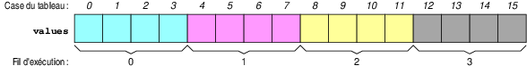

# 练习 2 (Exercice 2)

## 题目描述

> Reprenez le programme de l'exercice précédent et ajoutez-y un tableau d'entiers values alloué dynamiquement...
> 基于上一个练习的程序，添加一个动态分配的整数数组 values...
>
> Une fois le tableau initialisé, le programme affichera son contenu sur sa sortie standard.
> 数组初始化后，程序将在标准输出上显示其内容。
>
> Ensuite, il multipliera chaque élément de values par 2 et enfin, il affichera le contenu du tableau modifié.
> 然后，它将 values 的每个元素乘以 2，最后显示修改后的数组内容。
>
> Cependant, le but ultime de cet exercice est de les paralléliser ces calculs en les répartissant équitablement entre les n fils d'exécution implémentés précédemment. Par exemple, pour n égal à 4 et size égal à 16 (cases de values numérotés de 0 à 15), chaque fil d'exécution effectuera 4 multiplications selon le schéma de répartition suivant.
> 然而，此操作的最终目标是通过将计算任务公平地分配给先前实现的 n 个执行线程来实现并行化。例如，当 n 等于 4 且 size 等于 16 时（values 的单元格编号为 0 至 15），每个执行线程将根据以下分配方案执行 4 次乘法运算。
>
> 
>
> Enfin, nous supposerons que size est divisible par n.
> 最后，我们将假设 size 可被 n 整除。
>
> Pour effectuer sa portion de calcul, chaque fil d'exécution a besoin de savoir : 1. où dans le tableau values il commence à travailler, 2. combien de cases il doit traiter.
> 为了执行其计算部分，每个执行线程都需要知道：1. 它在 values 数组中的哪里开始工作，2. 它必须处理多少个单元格。

来源: [felsoci.sk/aise/practice.html](https://felsoci.sk/aise/practice.html#pthreads-2)

## 解析与纠正 (Éléments de correction)

为了执行其计算部分，每个执行线程需要知道：

1. 它在 `values` 数组中的哪里开始工作，
2. 它必须处理多少个单元格。

在下面的实现中，`work` 函数将由每个执行线程执行，并执行部分乘法运算。但是，它只接受一个参数。因此，我们通过具有两个元素的 `struct s_arg` 结构向执行线程传递必要的信息：

1. `begin`，指向执行线程开始工作的 `values` 单元格的指针；
2. `n`，执行线程必须从 `begin` 开始处理的单元格数量。

在检查传递给程序的参数的存在和格式（即要创建的执行线程数 `n` 和可选的 `values` 数组大小 `size`）之后，主函数 `main` 分配两个 `n` 个元素的数组：

- 数组 `tid`，它将保留操作系统在调用 `pthread_create` 时分配给每个执行线程的标识符；
- 数组 `values`，
- 数组 `args`，它将保留每个执行线程执行其部分计算所需的必要信息。

Ensuite, des boucles for nous permettent de :
然后， for 循环使我们能够：

- initialiser values avec des valeur aléatoires entre 0 et 10,
  初始化 values 为 0 到 10 之间的随机值，
- afficher les éléments de values,
  显示 values 中的元素，
- remplir args et lancer les fils d'exécution,
  填充 args 并启动执行线程，
- attendre la terminaison des fils d'exécution,
  等待线程终止，
- afficher les éléments modifiés de values.
  显示 values 中已修改的元素。

(完整代码将在下一节提供)

## 代码详解

本练习展示了如何将数据并行化（Data Parallelism）。

1. **数据划分**:
    主线程根据线程数 `n` 和数组大小 `size` 计算每个线程需要处理的块大小 `batch = size / n`。
    (假设 `size` 能被 `n` 整除)。

2. **参数传递 (`struct s_arg`)**:
    为了向线程函数传递多个参数（起始地址 `begin` 和数量 `n`），定义了结构体 `struct s_arg`。
    主线程为每个线程填充此结构体：

    ```c
    args[i].begin = &values[i * batch];
    args[i].n = batch;
    ```

3. **并行执行**:
    每个线程只负责对自己分到的 `batch` 个元素进行 `* 2` 操作。
    所有线程并行运行，从而加速整个数组的处理。

> 当前目录下的 `main.c` 代码可能包含了练习 3 的部分逻辑（求和），这是在练习 2 基础上的扩展。

Compilé sous le nom pthreads-compute et lancé avec ./pthreads-compute 4 16, notre programme produit la sortie suivante.
在 pthreads-compute 下编译并用 ./pthreads-compute 4 16 启动后，我们的程序产生以下输出。

```txt
Initialisation : [ 6 10 6 2 1 4 0 6 3 1 8 7 5 3 7 4 ]
Résultat       : [ 12 20 12 4 2 8 0 12 6 2 16 14 10 6 14 8 ]
```

## À noter 请注意

Une implémentation séquentielle du calcul consisterait à remplacer les boucles for responsables du lancement et de l'attente des fils d'exécution par une seule boucle for effectuant le calcul comme suit.
计算的顺序实现方式是将负责启动和等待执行线程的循环 for 替换为单个循环 for ，该循环按以下方式执行计算：

```c
for(int i = 0; i < size; i++) {
  values[i] *= 2;
}
```
