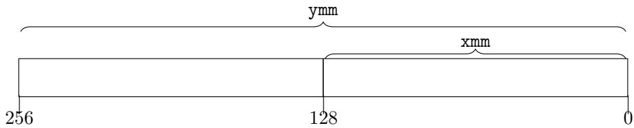

# Architectures Parallèles 并行体系结构

## TP4: x86_64 assembly - SIMD with SSE and AVX (part 2) TP4：x86_64 汇编——使用 SSE 和 AVX 的 SIMD（第 2 部分）

## UVSQ - M1 CHPS 凡尔赛-圣康坦大学（UVSQ）- M1 CHPS

**Date:** Friday 21 November 2025  
**日期：** 2025 年 11 月 21 日（星期五）

**Contact:** Aurélien Delval <aurelien.delval@uvsq.fr>
**联系方式：** Aurélien Delval <aurelien.delval@uvsq.fr>

## 0 Cheatsheet 速查表

### 0.1 Registers 寄存器

SSE introduced the 128-bit wide XMM registers for SIMD on x86.
SSE 在 x86 上引入了 128 位宽的 XMM 寄存器以支持 SIMD。

AVX extended them to 256-bit YMM registers:
AVX 将其扩展到 256 位宽的 YMM 寄存器：



### 0.2 Instructions 指令

Common AVX SIMD instructions:
常见的 AVX SIMD 指令如下：

| Instruction | Description | C equivalent |
| --- | --- | --- |
| `lea r, m` | Compute address of memory operand `m` and copy it to `r` | `r = m;` |
| `vaddpd x1, x2, x3` | Double-precision packed FP add (AVX, 128 bits) | `x1[1]=x2[1]+x3[1]; x1[2]=x2[2]+x3[2];` |
| `vaddpd y1, y2, y3` | Double-precision packed FP add (AVX, 256 bits) | `y1[1]=y2[1]+y3[1]; ...; y1[4]=y2[4]+y3[4];` |
| `vaddps x1, x2, x3` | Single-precision packed FP add (AVX, 128 bits) | `x1[1]=x2[1]+x3[1]; ...; x1[4]=x2[4]+x3[4];` |
| `vaddps y1, y2, y3` | Single-precision packed FP add (AVX, 256 bits) | `y1[1]=y2[1]+y3[1]; ...; y1[8]=y2[8]+y3[8];` |
| `movdqu x1, m` | Load packed integers into an XMM register | `x1[1]=m; ...;` |
| `movdqu y1, m` | Load packed integers into a YMM register | `y1[1]=m; ...;` |
| `vpbroadcastq y, m` | Broadcast 64-bit integer stored at `m` into `y` | `y[1]=m; ...;` |
| `vgatherdpd y1, m, x2` | Conditionally gather FP64 elements from address `m` into `y1` using mask `x2` and doubleword indices | See below |
| `vgatherqpd y1, m, y2` | Conditionally gather FP64 elements from address `m` into `y1` using mask `y2` and quadword indices | See below |
| `vgatherqpd x1, m, x2` | Conditionally gather FP64 elements from address `m` into `x1` using mask `x2` and quadword indices | See below |
| `vgatherqps x1, m, x2` | Conditionally gather FP32 elements from address `m` into `x1` using mask `x2` and quadword indices | See below |

| 指令 | 描述 | C 等价写法 |
| --- | --- | --- |
| `lea r, m` | 计算内存操作数 `m` 的地址并复制到 `r` | `r = m;` |
| `vaddpd x1, x2, x3` | 双精度打包浮点加法（AVX，128 位） | `x1[1]=x2[1]+x3[1]; x1[2]=x2[2]+x3[2];` |
| `vaddpd y1, y2, y3` | 双精度打包浮点加法（AVX，256 位） | `y1[1]=y2[1]+y3[1]; ...; y1[4]=y2[4]+y3[4];` |
| `vaddps x1, x2, x3` | 单精度打包浮点加法（AVX，128 位） | `x1[1]=x2[1]+x3[1]; ...; x1[4]=x2[4]+x3[4];` |
| `vaddps y1, y2, y3` | 单精度打包浮点加法（AVX，256 位） | `y1[1]=y2[1]+y3[1]; ...; y1[8]=y2[8]+y3[8];` |
| `movdqu x1, m` | 将一组整数装入 XMM 寄存器 | `x1[1]=m; ...;` |
| `movdqu y1, m` | 将一组整数装入 YMM 寄存器 | `y1[1]=m; ...;` |
| `vpbroadcastq y, m` | 将存放在 `m` 的 64 位整数广播到 `y` | `y[1]=m; ...;` |
| `vgatherdpd y1, m, x2` | 使用掩码 `x2` 和双字索引，从地址 `m` 有条件地收集 FP64 元素到 `y1` | 见下文 |
| `vgatherqpd y1, m, y2` | 使用掩码 `y2` 和四字索引，从地址 `m` 有条件地收集 FP64 元素到 `y1` | 见下文 |
| `vgatherqpd x1, m, x2` | 使用掩码 `x2` 和四字索引，从地址 `m` 有条件地收集 FP64 元素到 `x1` | 见下文 |
| `vgatherqps x1, m, x2` | 使用掩码 `x2` 和四字索引，从地址 `m` 有条件地收集 FP32 元素到 `x1` | 见下文 |

Gather loads read elements of a vector register from a base address plus offset indices.
Gather 加载会根据基地址加偏移索引从内存读取元素到向量寄存器中。

The memory operand has the form `[a + (x/y)*k]`, loading elements at addresses computed from each entry in the `x` or `y` index register into the destination register.
内存操作数形式为 `[a + (x/y)*k]`，根据 `x` 或 `y` 索引寄存器中的每个元素计算地址并加载到目标寄存器。

The mask operand (last register) controls whether each element is loaded.
掩码操作数（最后一个寄存器）控制每个元素是否被加载。

Enable a lane by setting its most significant bit to 1.
将某个通道的最高有效位设为 1 即可启用该元素。

In this lab, all mask elements are enabled: in C, `~(maskelem & 0)` yields all 1s, which can then be broadcast to every element of the mask vector using `vpbroadcastq`.
在本实验中，所有掩码元素都启用：在 C 中，`~(maskelem & 0)` 得到全 1，然后用 `vpbroadcastq` 广播到掩码向量的每个元素。

Example: `vgatherqpd ymm0, [m + ymm1*8], ymm2` with all mask bits set.
示例：掩码全为 1 时执行 `vgatherqpd ymm0, [m + ymm1*8], ymm2`。

- Base array `m` (64-bit elements): `m0 m1 m2 m3 m4 m5 m6 m7 m8 m9`
- 基数组 `m`（64 位元素）：`m0 m1 m2 m3 m4 m5 m6 m7 m8 m9`
- Indices in `ymm1`: `4 7 3 1`
- `ymm1` 中的索引：`4 7 3 1`
- Result in `ymm0`: `m4 m7 m3 m1`
- `ymm0` 的结果：`m4 m7 m3 m1`

Note: Scatter stores are the opposite of gather loads, but they were only added with AVX-512 and are not widely available.
注意：散射存储与 gather 加载相反，但仅在 AVX-512 中引入，尚未普及。

Check AVX support with:
使用下方命令检查 AVX 支持：

```bash
lscpu | grep --color avx
```

### 0.3 2D array storage 二维数组存储

Consider the matrix
考虑矩阵

$$
A = \left( \begin{array}{c c c c}
a_{11} & a_{12} & a_{13} & a_{14} \\
a_{21} & a_{22} & a_{23} & a_{24} \\
a_{31} & a_{32} & a_{33} & a_{34}
\end{array} \right)
$$

It can be stored as a two-dimensional array $A[m][n]$ ($m = 4$, $n = 3$) with two conventions:
它可以按两种约定存储为二维数组 $A[m][n]$（$m = 4$，$n = 3$）：

- **Row major** (C/C++): store elements of each row contiguously. Flattened layout: `a11 a12 a13 a14 a21 a22 a23 a24 a31 a32 a33 a34`. Element address: $A + i*n + j$ for $A[i][j]$.
- **行优先**（C/C++）：按行连续存储。铺平后的布局：`a11 a12 a13 a14 a21 a22 a23 a24 a31 a32 a33 a34`。元素 $A[i][j]$ 的地址为 $A + i*n + j$。

- **Column major** (Fortran): store elements of each column contiguously. Flattened layout: `a11 a21 a31 a12 a22 a32 a13 a23 a33 a14 a24 a34`. Element address: $A + j*m + i$ for $A[i][j]$.
- **列优先**（Fortran）：按列连续存储。铺平后的布局：`a11 a21 a31 a12 a22 a32 a13 a23 a33 a14 a24 a34`。元素 $A[i][j]$ 的地址为 $A + j*m + i$。

Both layouts generalize to $n$-dimensional arrays.
这两种布局都可以推广到 $n$ 维数组。

## 1 Simple gather loads 简单的 gather 加载

Consider the C loop:
考虑下面的 C 循环：

```c
void gather_fixedsize(double a[4], size_t id[4], double b[4]) {
    for (size_t i = 0; i < 4; ++i) {
        a[i] = b[id[i]];
    }
}
```

### 1.1 Fixed size 固定大小

Using a single `vgatherqpd` instruction, write an equivalent implementation in ASM or inline ASM.
使用一条 `vgatherqpd` 指令，在 ASM 或内联 ASM 中编写等价实现。

For a generic size:
对一般大小的数组：

```c
void gather(size_t n, double a[n], size_t id[n], double b[n]) {
    for (size_t i = 0; i < n; ++i) {
        a[i] = b[id[i]];
    }
}
```

### 1.2 Size `n`, scalar 大小为 `n`，标量版

Write a scalar version of this loop in ASM or inline ASM.
在 ASM 或内联 ASM 中编写该循环的标量版本。

### 1.3 Size `n`, vectorized 大小为 `n`，向量化版

Write a vectorized version using gather loads.
使用 gather 加载编写向量化版本。

## 2 Matrix transpose 矩阵转置

Consider the C loop computing a matrix transpose:
考虑以下执行矩阵转置的 C 循环：

```c
void transpose(uint64_t m, uint64_t n, double a[m][n], double b[n][m]) {
    for (size_t i = 0; i < m; ++i) {
        for (size_t j = 1; j < n; ++j) {
            b[i][j] = a[j][i];
        }
    }
}
```

### 2.1 Scalar 标量实现

Write a scalar version of this loop nest in ASM or inline ASM.
在 ASM 或内联 ASM 中编写该循环嵌套的标量版本。

### 2.2 Vectorized 向量化实现

Using gather loads, write a vectorized version of this loop.
使用 gather 加载编写该循环的向量化版本。

Scatter stores could also be used, but AVX-512 support is not widespread, so we rely on gather loads.
也可以使用散射存储，但 AVX-512 支持尚不普及，因此依赖 gather 加载。

Because the gather indices stay the same across iterations, you may compute them outside your ASM code and load them at the beginning.
由于 gather 的索引在每次迭代中相同，可以在 ASM 代码外预先计算并在开始时加载它们。
