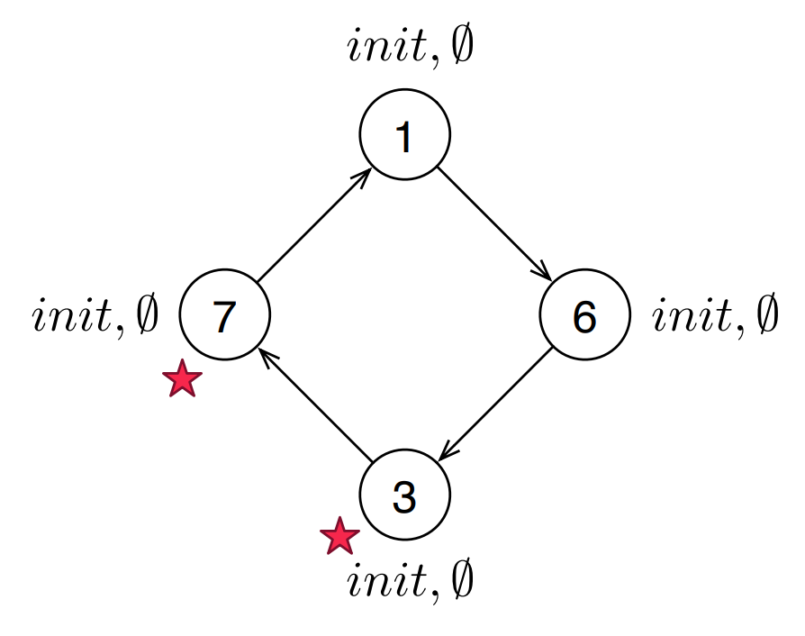
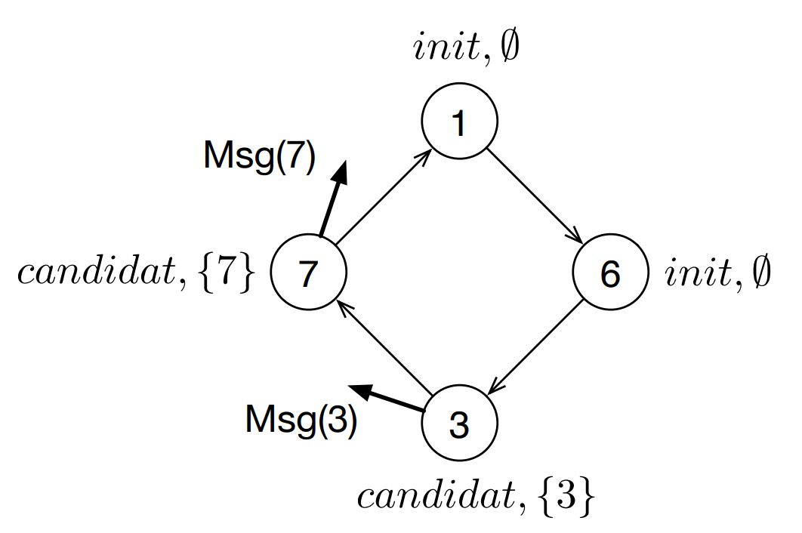
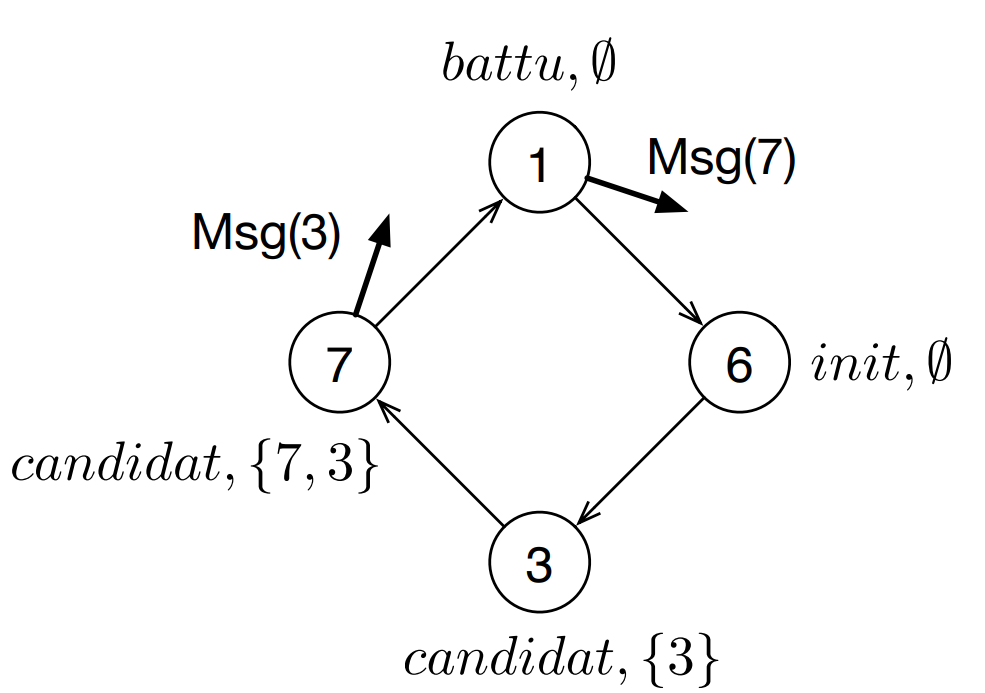
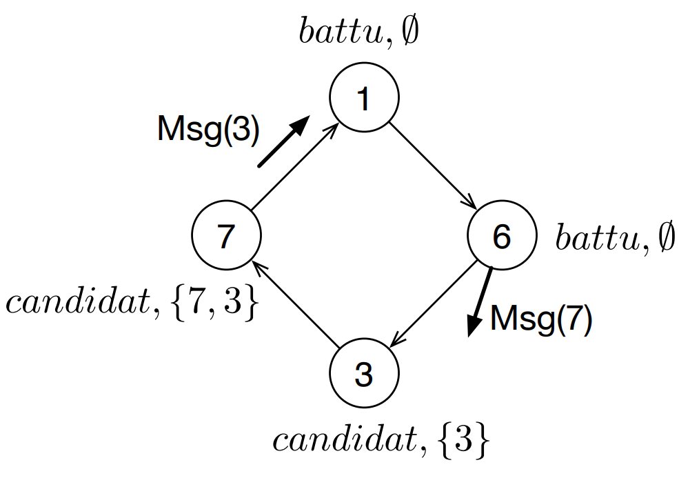
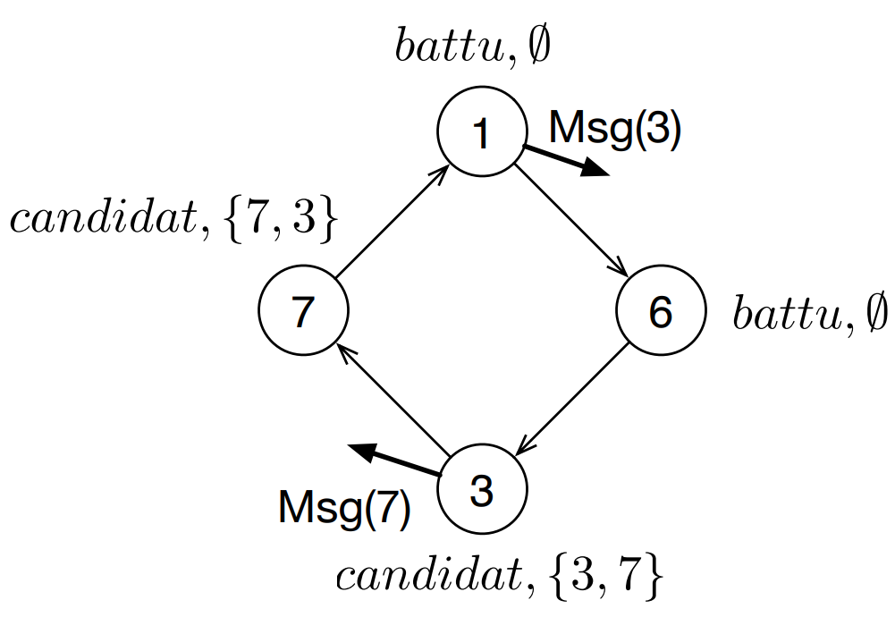
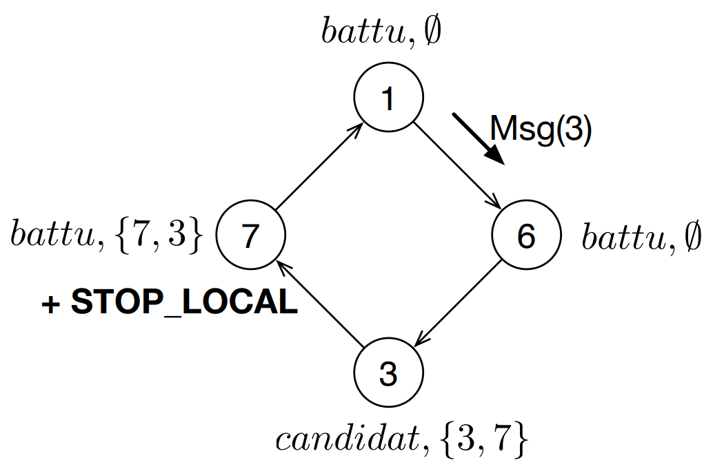
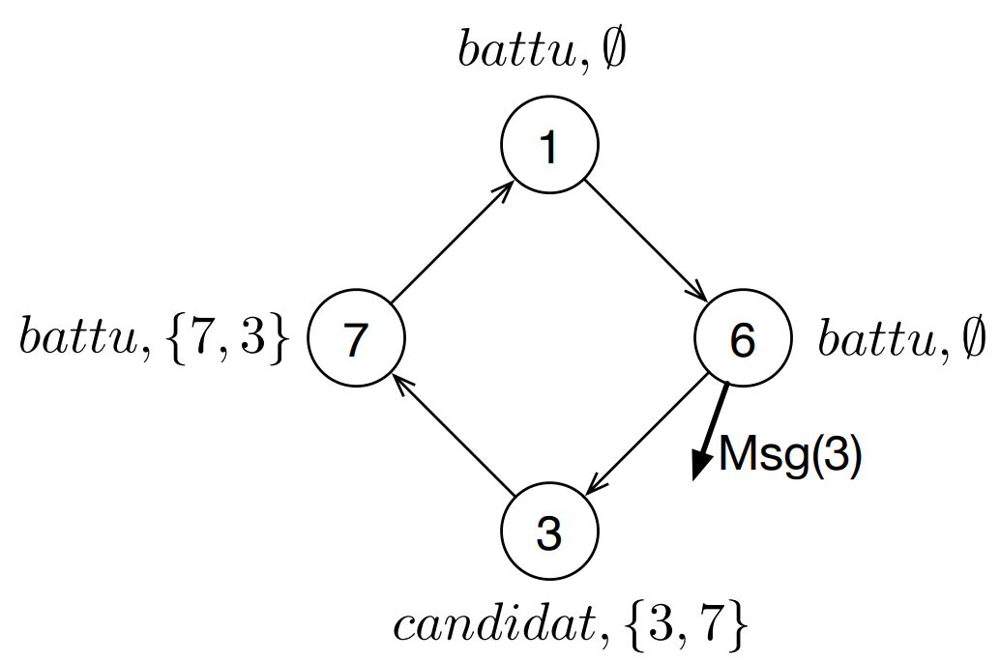
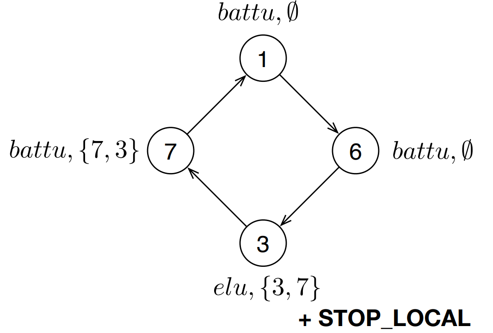
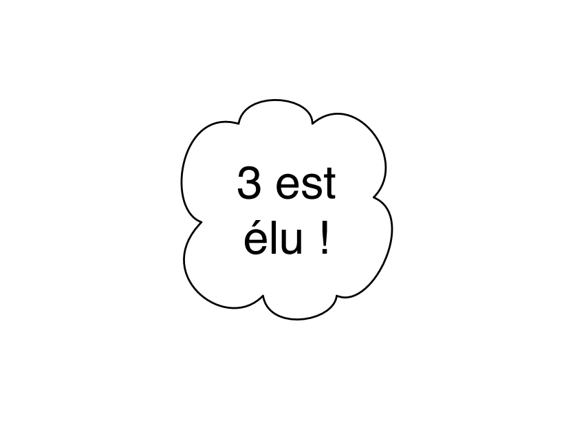

# Chapitre 2 : Élection de leader  第2章：领导者选举

Dans un réseau distribué, on cherche à distinguer **un seul nœud** parmi tous les nœuds. On l'appelle le **leader**.  在一个分布式网络中，我们要从所有节点中区分出**唯一一个节点**。这个节点称为**leader（领导者）**。

## Problème d'élection  选举问题

Un algorithme d'élection doit :

- désigner exactement un nœud comme leader.  必须且只能指定一个节点作为领导者。
- garantir l'unicité de ce leader.  必须保证 leader 的唯一性。

### Définition formelle  形式化定义

Chaque processus $p_i$ possède une variable locale d'état $etat_i \in \{elu, battu, init, candidat\}$, initialisée à `init`.  **每个进程 $p_i$ 都有一个局部状态变量 $etat_i \in \{elu, battu, init, candidat\}$，初始值为 `init`。**

Les propriétés attendues sont :

- **Sûreté** : l'état d'un processus ne change plus une fois qu'il est `elu` ou `battu`, et au plus un seul processus devient `elu`.  **安全性：** 一个进程一旦变成 `elu` 或 `battu`，其状态就不再改变，而且最多只能有一个进程变成 `elu`。
- **Terminaison** : un leader finit par être élu, et tous les autres processus finissent par l'apprendre.  **终止性：** 最终会选出一个 leader，并且所有其他进程最终都会知道这件事。

## Théorème d'impossibilité  不可能性定理

> Dans toute topologie distribuée anonyme, il n'existe pas d'algorithme déterministe d'élection de leader.  在任何匿名的分布式拓扑中，都不存在确定性的领导者选举算法。

La preuve se fait sur un anneau anonyme.  证明在匿名环上进行。

### Systèmes anonymes  匿名系统

Cette section suppose que les processus n'ont pas d'identité. On ne peut donc pas distinguer un processus $p_i$ d'un autre processus $p_j$.  **这一节假设进程没有身份标识，因此无法区分进程 $p_i$ 和另一个进程 $p_j$。**

Il en résulte que tous les processus ont le même code, le même état initial et la même connaissance locale. Dans un tel contexte anonyme, l'élection déterministe d'un leader est impossible sur un anneau.  **因此，所有进程都具有相同的代码、相同的初始状态和相同的局部知识。在这种匿名背景下，环上的确定性 leader 选举是不可能的。**

---

## Algorithmes d'élection sur anneau identifié  识别环上的选举算法

**topologie :** anneau orienté identifié.  **拓扑：** 有向、带标识的环。

**Algo 1 :** certains sites se déclarent candidats. ils envoient leur id dans l'anneau.  **算法1：** 某些站点自行声明为候选者，并把自己的 id 发送到环中。
Tous les messages font le tour de l'anneau.  所有消息都会绕环一圈。

Un site candidat conserve tous les id. Lorsque un candidat reçoit son propre id, il se déclare leader s'il a le plus petit id parmis tous les candidats.  一个候选站点保存收到的所有 id。当某个候选者收到自己的 id 时，如果它在所有候选者中 id 最小，就声明自己为领导者。

### 1 Algorithme de Lelann, 1977  1. Lelann 算法，1977

**Hypothèses :** Anneau orienté (unidirectional) et identifié. Canaux de communication asynchrones, fiables et fifo.  **假设：** 有向（单向）且带标识的环。通信信道是异步、可靠且 FIFO 的。

**Principe :** Au départ, tous les sites sont dans l'état *init*. Puis, certains d'entre eux se réveillent spontanément (grâce à l'évènement *Initialement*) et deviennent *candidats* pour devenir leader. Chaque site candidat envoie son identifiant à son successeur dans l'anneau. Tous les messages font le tour de l'anneau. Un site candidat conserve tous les identifiants reçus. Puis, lorsqu'il reçoit son propre identifiant, le site se déclare leader ssi il a l'identifiant minimum parmi tous les identifiants mémorisés. Quand l'algorithme termine, exactement un site est dans l'état *élu* (c'est celui d'identifiant minimum parmi tous les initiateurs) et tous les autres sont *battus*.  **原理：** 起初，所有站点都处于 *init* 状态。然后，其中一些站点会因事件 *Initialement* 自发唤醒，成为用于竞选领导者的 *候选者*。每个候选站点把自己的标识符发给环中的后继者。所有消息都会绕环一圈。候选站点保存收到的所有标识符。当它收到自己的标识符时，若它在所有已记住的标识符中最小，就声明自己为领导者。算法结束时，恰好一个站点处于 *élu* 状态（它是所有发起者中 id 最小的那个），其余站点都处于 *battu* 状态。

```pseudo
**Algorithm 8** Algorithme de Lelann, local au site $i$

**Connaissance**
$pred_i$ et $succ_i$ : les deux voisins de $i$.

**Variables**
$list_i$ : ensemble des identifiants reçus jusque là, initialisé à $\emptyset$.
$etat_i \in \{elu, battu, init, candidat\}$. Initialisé à $init$.

**Algorithme**
**Initialement** ->  /* Au moins sur un site */
  $etat_i$ <- *candidat*
  $list_i$ <- $list_i \cup \{i\}$
  Envoyer $Msg(i)$ à $succ_i$

**Sur réception de** $Msg(ident)$ **de** $pred_i$ ->
  **if** $etat_i \in \{init, battu\}$ **then**
    $etat_i$ <- *battu*
    Envoyer $Msg(ident)$ à $succ_i$
  **else if** $i \neq ident$ **then**
    $list_i$ <- $list_i \cup \{ident\}$
    Envoyer $Msg(ident)$ à $succ_i$
  **else**
    **if** $i = \min(list_i)$ **then**
      $etat_i$ <- *elu*
    **else**
      $etat_i$ <- *battu*
    **STOP_LOCAL**
```

**Pourquoi asynchrone et FIFO ? 为什么这里要求异步和 FIFO？**  
Cet algorithme peut fonctionner en **asynchrone** car il n'a pas besoin d'horloge globale ni de phases synchronisées : chaque site réagit uniquement à la réception des messages. 该算法可以在**异步**环境中运行，因为它不需要全局时钟，也不需要所有站点按同步轮次推进；每个站点只需在收到消息时按本地规则处理即可。  

En revanche, la propriété **FIFO** est importante pour la correction : lorsqu'un site reçoit à nouveau son propre identifiant, il doit être sûr que les identifiants plus petits qui le précèdent logiquement sur l'anneau ont déjà pu être pris en compte dans $list_i$. Sans FIFO, un message pourrait en dépasser un autre sur une arête, et un site pourrait recevoir trop tôt son propre identifiant puis se déclarer élu à tort. 相反，**FIFO** 性质对正确性是重要的：当一个站点再次收到自己的标识符时，它必须能够确信，那些在逻辑上应当先于它到达的、更小的标识符已经被计入 $list_i$。如果没有 FIFO，同一条边上的消息可能发生“超车”，从而导致某个站点过早收到自己的标识符，并错误地宣布自己当选。

**Exemple d'exécution :**

**LEGENDE :** $\star$ Evènement *Initialement* en attente de traitement | $(i)$ : $etat_i, list_i$

<table>
  <tr>
    <td align="center"></td> <td align="center"></td> <td align="center"></td>
  </tr>
  <tr>
    <td align="center">Configuration Initiale</td> <td align="center">Les 2 initiateurs envoient leurs identifiants dans l'anneau</td> <td align="center">Les 2 messages sont reçus</td>
  </tr>
  <tr>
    <td align="center"></td> <td align="center"></td> <td align="center"></td>
  </tr>
  <tr>
    <td align="center">Msg(3) en transit et Msg(7) est reçu</td> <td align="center">Les 2 messages sont reçus</td> <td align="center">Msg(3) en transit et Msg(7) est reçu</td>
  </tr>
  <tr>
    <td align="center"></td> <td align="center"></td> <td align="center"></td>
  </tr>
  <tr>
    <td align="center">Msg(3) est reçu</td> <td align="center">Msg(3) est reçu</td> <td align="center">3 est élu !</td>
  </tr>
</table>

### 2 Algorithme de Chang et Roberts, 1979

**Hypothèses :** Anneau identifié. Canaux de communication asynchrones et fiables.  **假设：** 识别环。通信信道是异步且可靠的。

**Principe :** Cet algorithme est une amélioration du précédent. Ici, tous les messages ne font pas le tour de l'anneau. En effet, quand un site reçoit un message, il ne le transmet que si l'identifiant du message est plus petit que l'identifiant minimum calculé jusqu'à maintenant. Parmi tous les identifiants reçus, un site ne conserve donc que le minimum.  **原理：** 这个算法是前一个算法的改进版。这里并不是所有消息都会绕环一圈。实际上，当站点收到一个消息时，只有当该消息的标识符比当前计算出的最小标识符更小时，它才会继续转发。于是，在所有收到的标识符中，站点只保留最小值。

```pseudo
**Algorithm 9** Algorithme de Chang et Roberts, local au site $i$

**Connaissance**
$vois_i$ : les deux voisins de $i$.

**Variables**
$etat_i \in \{elu, battu, init, candidat\}$. Initialisé à $init$.
$min_i$ : identifiant minimum reçu jusqu'alors. Initialisé à $ndef$ (i.e., non défini).

**Algorithme**
**Initialement** ->  /* Au moins sur un site */
  $etat_i$ <- *candidat*
  $min_i$ <- $i$
  Envoyer $Msg(i)$ à $j \in vois_i$  /* $j$ est un voisin choisi de manière arbitraire */

**Sur réception de** $Msg(ident)$ **de** $j$ ->
  **if** $etat_i \in \{init, battu\}$ **then**
    $etat_i$ <- *battu*
    Envoyer $Msg(ident)$ à $vois_i \setminus \{j\}$
  **else**
    **if** $ident < min_i$ **then**
      $etat_i$ <- *battu*
      $min_i$ <- $ident$
      Envoyer $Msg(ident)$ à $vois_i \setminus \{j\}$
    **else if** $ident = i$ **then**  /* Ici, on a forcément : $i = min_i$ */
      $etat_i$ <- *elu*
      **STOP_GLOBAL**
```

**Exercice 1. - Algorithme de Lelann et son amélioration par Chang et Roberts -**  **练习 1 - Lelann 算法及其由 Chang 和 Roberts 提出的改进 -**

1. Calculer la complexité en messages de l'algorithme de Lelann.  计算 Lelann 算法的消息复杂度。
  **Corr**: Si tous les sites sont initiateurs, alors chacun envoie initialement un message portant son identifiant. Dans l'algorithme de Lelann, ces messages font tous un tour complet de l'anneau avant que leurs émetteurs puissent conclure. Il y a donc $n$ messages, chacun parcourant $n$ arêtes, d'où une complexité en messages de $\Theta(n^2)$, donc $O(n^2)$.  若所有站点都是发起者，则每个站点一开始都会发送一个携带自己标识符的消息。在 Lelann 算法中，这些消息都会绕环一整圈，发起者随后才能作出判断。因此共有 $n$ 条消息，且每条消息都经过 $n$ 条边，所以消息复杂度为 $\Theta(n^2)$，也即 $O(n^2)$。
2. Écrire l'algorithme de Chang et Roberts. Cet algorithme est une amélioration de l'algorithme de Lelann. Ici, tous les messages ne font pas le tour de l'anneau. En effet, quand un site reçoit un message, il ne le transmet que si l'identifiant du message est plus petit que l'identifiant du leader calculé jusqu'à maintenant. Parmi tous les messages reçus, un site ne conserve donc que l'identifiant minimum.  写出 Chang 和 Roberts 算法。该算法是 Lelann 的改进版。在这里，并不是所有消息都会绕环一圈。实际上，当站点收到一个消息时，只有当该消息的标识符比当前算出的 leader 标识符更小时才转发。因此在收到所有消息中，站点只保留最小标识符。
  **Corr**: Voir l'algorithme de Chang et Roberts donné ci-dessus : chaque initiateur envoie son identifiant, chaque site ne conserve que le minimum reçu jusqu'alors, et un message n'est relayé que s'il améliore ce minimum ; lorsqu'un site reçoit à nouveau son propre identifiant, il se déclare élu.  见上文给出的 Chang 和 Roberts 算法：每个发起者发送自己的标识符；每个站点只保留到目前为止收到的最小标识符；只有当收到的消息能改进这个最小值时才继续转发；当某个站点再次收到自己的标识符时，它宣布自己当选。
3. En supposant que tous les sites sont initiateurs, quelle est la complexité en messages de l'algorithme de Chang et Roberts dans le meilleur et dans le pire cas ? Vous donnerez la position relative des identifiants qui permet d'obtenir la complexité au mieux et celle au pire (vous pouvez supposer que les identifiants des $n$ sites sont $1, 2, \dots, n$), puis vous calculerez cette complexité.  假设所有站点都是发起者，Chang 和 Roberts 算法在最好和最坏情况下的消息复杂度是多少？请给出使得复杂性达到最好和最坏时，各标识符的相对排列位置（可以假设 $n$ 个站点的标识符为 $1, 2, \dots, n$），然后计算该复杂度。
  **Corr**: En supposant que les messages se propagent tous dans le même sens autour de l'anneau et que le leader est le site d'identifiant minimal, le **meilleur cas** est obtenu lorsque les identifiants sont dans l'ordre décroissant le long du sens de propagation : chaque message, sauf celui du minimum, est alors éliminé très rapidement, et le nombre total de messages est $\Theta(n)$, donc $O(n)$. Le **pire cas** est obtenu lorsque les identifiants sont dans l'ordre croissant dans le sens de propagation : beaucoup de messages survivent longtemps avant d'être éliminés, et la somme des distances parcourues donne une complexité totale de $\Theta(n^2)$, donc $O(n^2)$.  假设所有消息都沿环的同一方向传播，并且 leader 是最小标识符对应的站点，则**最好情况**出现在标识符沿传播方向按递减顺序排列时：除了最小标识符对应的消息之外，其余消息都会很快被淘汰，因此总消息数为 $\Theta(n)$，也即 $O(n)$。**最坏情况**出现在标识符沿传播方向按递增顺序排列时：很多消息会在被淘汰前传播很长距离，所有传播距离加总后得到总消息复杂度为 $\Theta(n^2)$，也即 $O(n^2)$。
4. Quelle est la complexité en temps de cet algorithme (en synchrone) ?  在同步（synchrone）环境下，该算法的时间复杂度是多少？
  **Corr**: En environnement synchrone, un message ne peut avancer que d'un saut par round. Pour qu'un site puisse se déclarer élu, il faut que l'identifiant gagnant fasse un tour complet de l'anneau et revienne à son origine. Cela nécessite donc $n$ sauts, soit $\Theta(n)$ rounds. La complexité en temps est donc $O(n)$.  在同步环境中，一条消息每一轮最多只前进一跳。为了让某个站点宣布自己当选，获胜的标识符必须绕环一整圈并回到出发点。因此这需要 $n$ 次跳转，也就是 $\Theta(n)$ 轮，所以时间复杂度为 $O(n)$。
  
---

### 3 Algorithme de Peterson, Dolev-Klawe-Rodeh  3. Peterson, Dolev-Klawe-Rodeh 算法

**Hypothèses :** Anneau orienté, identifié, unidirectionnel. Canaux asynchrones, fiables et FIFO. Tous les sites sont initiateurs.  **假设：** 有向、带标识、单向环。通信信道是异步、可靠且 FIFO 的。所有站点都是发起者。

**Principe :** Au début, tous les sites sont candidats et actifs. L'algorithme se déroule en plusieurs phases. Comme l'anneau est unidirectionnel, un site actif ne reçoit pas directement un identifiant venant de chaque côté ; il obtient, par des messages circulant dans l'unique sens de l'anneau et relayés par les sites passifs, les informations nécessaires pour comparer son candidat courant avec ceux des candidats actifs voisins. Il décide alors s'il reste actif ou non. Intuitivement, seuls certains candidats survivent d'une phase à la suivante, ce qui réduit progressivement l'ensemble des sites actifs jusqu'à n'en laisser qu'un seul, qui devient leader.  **原理：** 开始时，所有站点都是候选者并且处于活跃状态。算法按多个阶段（phases）执行。由于这里是单向环，一个活跃站点并不是直接从左右两个方向各收到一个标识符；相反，它是通过沿环唯一方向传播、并由被动站点转发的消息，逐步获得与相邻活跃候选者比较所需的信息，然后决定自己是否继续保持活跃。直观上说，每一阶段只有部分候选者能够存活到下一阶段，因此活跃站点的集合会逐步缩小，最终只剩下一个站点成为 leader。

```pseudo
*Algorithm 10.1** Algorithme de Peterson

**Connaissance**
$succ_i$ : successeur du site $i$ dans l'anneau.

**Variables**
$state_i \in \{active, passif, elu\}$. Initialisé à $active$.
$ci_i$ : identifiant du candidat courant porté par $i$. Initialisé à $i$.
$acn_i$ : identifiant du prochain candidat actif observé pendant le tour. Initialisé à $ndef$.
$q_i$ : dernier message reçu pendant le tour courant. Initialisé à $ndef$.

**Algorithme**
**Initialement** ->
  Envoyer $Msg(ci_i)$ à $succ_i$

**Sur réception de** $Msg(id)$ **de** $pred_i$ ->
  $q_i$ <- $id$
  **if** $state_i = passif$ **then**
    Envoyer $Msg(id)$ à $succ_i$
  **else**
    **if** $id < ci_i$ **then**
      $state_i$ <- *passif*
      $acn_i$ <- $id$
      Envoyer $Msg(id)$ à $succ_i$
    **else if** $id = ci_i$ **then**
      $state_i$ <- *elu*
      **STOP_GLOBAL**
    **else**
      $acn_i$ <- $ci_i$
      Envoyer $Msg(ci_i)$ à $succ_i$
```

### 4 Algorithme DoubleToken / Hirschberg-Sinclair  4. DoubleToken / Hirschberg-Sinclair 算法

**Hypothèses :** Le système est asynchrone. Chaque site est identifié avec un identifiant unique et chaque site est initiateur. La topologie est un anneau bidirectionnel non orienté. Il n'y a pas de fautes.  **假设：** 系统是异步的。每个站点都有唯一的标识符，且每个站点都是发起者（initiateur）。拓扑结构是无向双向环。没有故障。

**Principe :** L'algorithme fonctionne par phase. À la phase $\ell$, un nœud reste candidat si tous les nœuds à distance inférieure ou égale à $2^\ell$ de lui portent un identifiant plus petit que le sien. Chaque phase envoie donc deux tokens, un dans chaque sens, et chacun d'eux explore une distance $2^\ell$ avant de revenir. Si les deux tokens reviennent, le nœud passe à la phase suivante ; sinon il devient passif. L'algorithme élit finalement le nœud d'identifiant maximum dans l'anneau.  **原理：** 算法按阶段（phase）运行。在阶段 $\ell$ 中，如果一个节点距离小于等于 $2^\ell$ 的所有节点都比它的标识符更小，那么该节点保持为候选者。每一阶段都会发送两个 Token，一个向左、一个向右，它们先探索距离 $2^\ell$，然后返回原点。如果两个 Token 都回来，节点就进入下一阶段；否则它变为被动状态。算法最终会选出环中标识符最大的节点。

**Idée de l'exécution :** Pour un token portant l'identifiant $i$, chaque site rencontré compare son propre identifiant à $i$. Si son identifiant est plus grand, il détruit le token ; sinon il le relaie. Un token rentrant est toujours relayé jusqu'à son origine.  **执行要点：** 对于携带标识符 $i$ 的 Token，沿途每个站点都会把自己的标识符和 $i$ 比较。如果自己的标识符更大，就销毁这个 Token；否则继续转发。回程的 Token 会一直被转发直到回到起点。

```pseudo
**Algorithm 10.2** Algorithme DoubleToken / HS, local au site $i$

**Connaissance**
$gauche_i$ et $droite_i$ : les deux voisins du site $i$.
$vois_i = \{gauche_i, droite_i\}$.
$voisin_i(gauche) = gauche_i$, $voisin_i(droite) = droite_i$.
$oppose(gauche) = droite$, $oppose(droite) = gauche$.

**Variables**
$etat_i \in \{candidat, passif, elu\}$. Initialisé à $candidat$.
$phase_i$ : numéro de phase courant. Initialisé à $0$.
$retourG_i$, $retourD_i$ : indicateurs de retour des deux tokens de la phase courante.
Initialisés à $Faux$.
$leader_i$ : booléen indiquant si $i$ est élu. Initialisé à $Faux$.

**Messages**
$Token(ident, ph, sens, mode, nbSautRestant)$, avec :
- $ident$ : identifiant du candidat transporté par le token ;
- $ph$ : phase à laquelle le token a été émis ;
- $sens \in \{gauche, droite\}$ : sens initial d'exploration ;
- $mode \in \{sortant, retour\}$ : token en phase d'éloignement ou de retour ;
- $nbSautRestant$ : nombre de sauts restants quand $mode = sortant$.

**Algorithme**
**Initialement** ->
  Envoyer $Token(id_i, phase_i, gauche, sortant, 2^{phase_i})$ à $gauche_i$  /* exploration gauche */
  Envoyer $Token(id_i, phase_i, droite, sortant, 2^{phase_i})$ à $droite_i$  /* exploration droite */

**Sur réception de** $Token(id, ph, sens, mode, reste)$ **de** $k$ ->
  **if** $id = id_i$ **then**
    **if** $mode = sortant$ **then**
      $etat_i$ <- *elu*  /* mon token a fait tout le tour */
      $leader_i$ <- $Vrai$
      **STOP_GLOBAL**
    **else if** $etat_i = candidat$ **and** $ph = phase_i$ **then**
      **if** $sens = gauche$ **then**
        $retourG_i$ <- $Vrai$  /* retour gauche reçu */
      **else**
        $retourD_i$ <- $Vrai$  /* retour droite reçu */
      **if** $retourG_i = Vrai$ **and** $retourD_i = Vrai$ **then**
        $phase_i$ <- $phase_i + 1$  /* les deux retours sont arrivés */
        $retourG_i$ <- $Faux$
        $retourD_i$ <- $Faux$
        Envoyer $Token(id_i, phase_i, gauche, sortant, 2^{phase_i})$ à $gauche_i$
        Envoyer $Token(id_i, phase_i, droite, sortant, 2^{phase_i})$ à $droite_i$
  **else if** $mode = retour$ **then**
    Envoyer $Token(id, ph, sens, retour, 0)$ à $voisin_i(oppose(sens))$  /* retour vers le créateur */
  **else if** $id < id_i$ **then**
    Détruire le token  /* candidat plus petit éliminé */
  **else**
    **if** $etat_i = candidat$ **then**
      $etat_i$ <- *passif*  /* un plus grand identifiant existe */
      $retourG_i$ <- $Faux$
      $retourD_i$ <- $Faux$
    **if** $reste > 1$ **then**
      $reste$ <- $reste - 1$
      Envoyer $Token(id, ph, sens, sortant, reste)$ à $voisin_i(sens)$  /* exploration continue */
    **else**
      Envoyer $Token(id, ph, sens, retour, 0)$ à $voisin_i(oppose(sens))$  /* demi-tour */
```

---

**Exercice 3. - Algorithme DoubleToken -**  **练习 3 - DoubleToken 算法 -**（Hirschberg-Sinclair）

**Hypothèses :** Le système est asynchrone. Chaque site est identifié avec un identifiant unique et chaque site est initiateur. La topologie est un anneau bidirectionnel non orienté. Il n'y a pas de fautes.
**假设：** 系统是异步的。每个站点都有唯一的标识符，且每个站点都是发起者（initiateur）。拓扑结构是无向双向环。没有故障。

**Principe :** L'algorithme fonctionne par phase. A la phase $\ell$, un noeud reste candidat (c'est-à-dire qu'il continuera à envoyer des messages avec son identifiant à la phase suivante) si tous ses voisins de droite à distance inférieure ou égale à $2^\ell$ et tous ses voisins de gauche à distance inférieure ou égale à $2^\ell$ portent un identifiant plus petit que le sien. En répétant les phases, l'algorithme élit ainsi le noeud d'identifiant maximum dans l'anneau.
**原理：** 算法按阶段（phase）运行。在阶段 $\ell$ 中，如果一个节点距离小于等于 $2^\ell$ 的所有右侧邻居，以及距离小于等于 $2^\ell$ 的所有左侧邻居，它们的标识符都**小于它自己**的标识符，那么该节点保持为候选者（即会在下阶段继续发送带自己标识符的消息）。重复上述阶段，算法最终能在环中选出标识符最大的节点。（注：Hirschberg-Sinclair 传统习惯选最大值，与选最小值完全等价）。

Plus précisément, chaque site opère en phase 0, 1, 2, ... Lors de chaque phase $\ell$, le site $i$ envoie deux tokens contenant son identifiant dans deux directions. Ils sont supposés voyager à distance $2^\ell$, puis retourner à leur origine $i$. Si les deux tokens lui reviennent, le site $i$ reste candidat à l'élection et passe donc à la phase suivante. Cependant, il se peut que les tokens ne reviennent pas. Si c'est le cas, le site devient passif et ne crée alors plus aucun message portant son identifiant. Tant qu'un token est dans sa phase d'éloignement, chaque site $j$ sur son chemin compare à $i$ son identifiant. Si $i < j$, le site $j$ élimine simplement le token et si $i > j$, il le relaie. Si $i = j$, le site se déclare leader. Tous les sites relaient un token rentrant.
**详细机制：** 每个站点按阶段 0, 1, 2, ... 进行操作。在每个阶段 $\ell$ 中，站点 $i$ 向两个方向发送两个携带自己标识符的 Token。它们会被假设为传播距离 $2^\ell$ 后返回原点 $i$。如果两个 Token 都返回了，站点 $i$ 就保持为候选者，并进入下一阶段。然而，也可能出现 Token 没有返回的情况。如果发生这种情况，站点就变为被动状态，不再创建任何携带自己标识符的消息。当一个 Token 在传播过程中时，路径上的每个站点 $j$ 都会把自己的标识符和 $i$ 的标识符进行比较。如果 $i < j$，站点 $j$ 就简单地销毁这个 Token；如果 $i > j$，站点 $j$ 就继续转发这个 Token；如果 $i = j$，站点就宣布自己当选。所有站点都会转发回程的 Token。

1. On considère l'anneau de la figure de droite.  考虑右图中的环 *(10 节点： 1-9-5-8-2-4-6-7-10-3)*。
   (a) Qui survit à la phase 0 ? à la phase 1 ? à la phase 2 ?  在阶段 0 谁存活？阶段 1 呢？阶段 2 呢？
    **Corr** : Dans l'anneau $1-9-5-8-2-4-6-7-10-3$, un site survit à la phase $\ell$ s'il possède l'identifiant maximum dans son voisinage de rayon $2^\ell$.  
    **更正**：在环 $1-9-5-8-2-4-6-7-10-3$ 中，一个站点在阶段 $\ell$ 存活，当且仅当它在半径 $2^\ell$ 的邻域内具有最大标识符。

    - **Phase 0** : on compare chaque site à ses deux voisins immédiats. Les survivants sont $9$, $8$ et $10$.  
      **阶段 0**：每个站点只和左右距离 1 的邻居比较。存活者为 $9$、$8$ 和 $10$。
    - **Phase 1** : on compare chaque site aux nœuds à distance au plus $2$. Les survivants sont $9$ et $10$.  
      **阶段 1**：每个站点和距离不超过 $2$ 的节点比较。存活者为 $9$ 和 $10$。
    - **Phase 2** : on compare chaque site aux nœuds à distance au plus $4$. Le seul survivant est $10$.  
      **阶段 2**：每个站点和距离不超过 $4$ 的节点比较。唯一存活者是 $10$。

   (b) Quel site est finalement élu ? A quelle phase le leader sait-il qu'il est leader ?  最终哪个站点当选？领导者在哪个阶段知道自己是领导者？
    **Corr** : Le site finalement élu est celui d'identifiant maximum, donc $10$. Toutefois, survivre à la phase 2 ne signifie pas encore savoir que l'on est leader : le site $10$ ne peut conclure qu'au moment où l'un de ses tokens fait un tour complet de l'anneau et revient à son origine. Il faut donc une phase $\ell$ telle que $2^\ell \ge n$. Ici $n=10$, donc la plus petite telle phase est $\ell=4$. Le leader sait donc qu'il est élu à la **phase 4**.  
    **更正**：最终当选的是最大标识符对应的站点，也就是 $10$。但是，在阶段 2 成为唯一幸存者，并不意味着它已经“知道”自己当选；只有当它自己的某个 token 绕环一整圈并返回原点时，它才能确认自己是 leader。因此必须等到某个阶段 $\ell$ 满足 $2^\ell \ge n$。这里 $n=10$，最小满足条件的是 $\ell=4$。所以 leader 在 **阶段 4** 知道自己当选。
2. Écrire la version formelle de cet algorithme.  写出该算法的形式化（伪代码）版本。
   **Corr** : Une version formelle correcte est donnée dans l'algorithme DoubleToken / Hirschberg-Sinclair ci-dessus. Elle repose sur des phases successives, deux tokens émis par candidat et par phase, une comparaison locale des identifiants, puis un passage en mode retour lorsque la distance $2^\ell$ a été atteinte.  
   **更正**：一个正确的形式化版本就是上面给出的 DoubleToken / Hirschberg-Sinclair 伪代码。它基于连续的阶段执行：每个候选者在每个阶段发送两个 token，沿途比较标识符，并在达到距离 $2^\ell$ 后转入回程模式。
3. Quelle est la complexité en messages de cet algorithme dans le meilleur et dans le pire cas ? Dans le cas au mieux, vous donnerez la position relative des identifiants qui permet d'obtenir cette complexité (vous pouvez supposer que les identifiants des $n$ sites sont $1, 2, \dots, n$).  该算法在最好和最坏情况下的消息复杂度各是多少？在最好情况下，请给出使得获得该复杂度时标识符的相对排列位置。
   **Corr** : À la phase $\ell$, un candidat survivant envoie deux tokens qui explorent chacun une distance $2^\ell$ avant de revenir. Le coût d'un candidat survivant à la phase $\ell$ est donc $\Theta(2^\ell)$ messages.  
   **更正**：在阶段 $\ell$，每个幸存候选者都会发送两个 token，它们分别探索距离 $2^\ell$ 后再返回。因此，一个在阶段 $\ell$ 存活的候选者会产生 $\Theta(2^\ell)$ 条消息。

   - **Meilleur cas** : les identifiants sont disposés dans l'ordre croissant autour de l'anneau, par exemple $1,2,\dots,n$. Alors, dès la phase 0, seul le site $n$ survit et tous les autres candidats sont éliminés très vite. Ensuite, seul le leader potentiel continue les phases suivantes. La somme totale des messages est alors $\Theta(n)$, donc $O(n)$.  
     **最好情况**：标识符沿环按递增顺序排列，例如 $1,2,\dots,n$。这样从阶段 0 开始，只有站点 $n$ 能存活，其余候选者都会很快被淘汰。之后只有这个潜在 leader 继续后续阶段，因此总消息数为 $\Theta(n)$，也即 $O(n)$。
   - **Pire cas** : à chaque phase, il peut rester encore environ la moitié des candidats. À la phase $\ell$, il y a alors environ $n/2^\ell$ survivants, chacun coûtant $\Theta(2^\ell)$ messages. Le coût total d'une phase est donc $\Theta(n)$. Comme il y a $\Theta(\log n)$ phases, la complexité totale est $\Theta(n\log n)$, donc $O(n\log n)$.  
     **最坏情况**：在每个阶段之后，仍可能大约保留一半候选者。于是阶段 $\ell$ 大约还有 $n/2^\ell$ 个幸存者，而每个幸存者的代价是 $\Theta(2^\ell)$ 条消息，所以单个阶段总共是 $\Theta(n)$ 条消息。由于总共有 $\Theta(\log n)$ 个阶段，因此总消息复杂度为 $\Theta(n\log n)$，也即 $O(n\log n)$。
4. Cet algorithme est-il correct si seul un sous ensemble des sites est initiateur ? Si oui, qui est élu à la fin, sinon pourquoi l'algorithme n'est pas correct ?  如果只有一个子集的站点是发起者，该算法还正确吗？如果正确，最后谁会当选？如果不正确，为什么？
   **Corr** : Non, l'algorithme n'est plus correct si seul un sous-ensemble des sites est initiateur. En effet, un site non initiateur peut avoir un identifiant plus grand qu'un initiateur et détruire son token lorsqu'il le rencontre, sans jamais lancer lui-même de token. Dans ce cas, un candidat initiateur peut être éliminé par un site qui ne participe pas à l'élection, ce qui peut empêcher toute élection.  
   **更正**：不正确。如果只有部分站点是发起者，那么某个非发起者站点可能具有更大的标识符，并在遇到发起者的 token 时将其销毁；但它自己又不会发送 token。这样一来，一个真正参与竞选的候选者可能会被一个“不参选”的大标识符节点淘汰，从而导致算法最终无法选出 leader。

   Par exemple, si un seul site d'identifiant $5$ est initiateur et qu'il existe un site non initiateur d'identifiant $10$, alors le site $10$ détruira le token de $5$, mais n'émettra jamais de token à son tour. Aucun site ne pourra alors être élu.  
   例如，若唯一的发起者标识符为 $5$，而环上存在一个非发起者、标识符为 $10$ 的站点，那么 $10$ 会销毁 $5$ 的 token，但自己又不会发出 token。这样最终就不会有任何站点当选。

---

**Exercice 4. - Algorithme Vitesse -**  **练习 4 - 速度算法 -**

On suppose un graphe de communication en anneau. Chaque site $i$ initialise un token qui parcourt l'anneau en transportant l'identifiant de l'initiateur. Différents tokens voyagent à des vitesses différentes. En particulier, un token transportant l'identifiant $v$ voyage au rythme d'une émission tous les $2^v$ rounds, c'est à dire qu'un site recevant ce token attend $2^v$ rounds avant de le retransmettre. Chaque site garde la valeur du plus petit identifiant qu'il a vu et ne transmet pas les tokens qui transportent un identifiant plus grand. Si un token revient à son initiateur, celui-ci se note leader. On suppose ici que tous les sites sont activés initialement.  （假设通信图是一个环。每个站点 $i$ 初始都会发出了一个 Token，携带着发起者的标识符遍历环。不同的 Token 以不同的速度传播。具体来说，携带标识符 $v$ 的 Token 的发送节奏是每 $2^v$ 轮（rounds）一次，也就是说，接收到该 Token 的站点会等待 $2^v$ 轮后再转发它。每个站点只保留它见过的**最小**标识符的值，并且不会转发携带更大标识符的 Token。如果一个 Token 返回到了它的发起者那里，发起者就标记自己为 leader。假设最初所有站点都是活跃的。）

1. Qui est élu ?  谁当选？
   **Corr** : Le site élu est celui d'identifiant minimum. En effet, chaque site ne relaie que les tokens portant un identifiant plus petit que tous ceux qu'il a déjà vus ; ainsi, seul le token du plus petit identifiant peut faire un tour complet de l'anneau et revenir à son initiateur.  
   **更正**：当选的是标识符最小的站点。因为每个站点只会继续转发那些比自己目前见过的所有标识符都更小的 token，所以最终只有最小标识符对应的 token 能够绕环一整圈并回到它的发起者。
2. Quelles sont les hypothèses faites sur le système distribué dans cet algorithme ?  该算法对分布式系统做了什么假设？
   **Corr** : Cet algorithme suppose un anneau orienté et identifié, où tous les sites sont initiateurs. Il suppose aussi un système **synchrone**, car la notion de vitesse « un envoi tous les $2^v$ rounds » n'a de sens que si le temps est découpé en rounds globaux. Enfin, les canaux sont supposés fiables et l'on suppose qu'un site peut mémoriser le plus petit identifiant déjà rencontré.  
   **更正**：该算法假设通信拓扑是一个有向、带标识的环，并且所有站点都是发起者。它还假设系统是**同步的**，因为“每 $2^v$ 轮发送一次”只有在存在全局轮次（round）时才有意义。此外，通信信道应当是可靠的，并且每个站点能够记住自己目前见过的最小标识符。
3. Écrire la version formelle de cet algorithme.  写出该算法的形式化版本。
   **Corr** : Une version formelle possible est la suivante.  
   **更正**：一种可接受的形式化版本如下。

```pseudo
**Connaissance**
$succ_i$ : successeur du site $i$ dans l'anneau.

**Variables**
$min_i$ : plus petit identifiant vu jusqu'à présent. Initialisé à $i$.
$leader_i \in \{Vrai, Faux\}$. Initialisé à $Faux$.

**Messages**
$Token(id)$

**Algorithme**
**Initialement** ->
  Envoyer $Token(i)$ à $succ_i$

**Sur réception de** $Token(id)$ ->
  Attendre $2^{id}$ rounds  /* vitesse du token */
  **if** $id < min_i$ **then**
    $min_i$ <- $id$
    Envoyer $Token(id)$ à $succ_i$
  **else if** $id = i$ **then**
    $leader_i$ <- $Vrai$
    **STOP_GLOBAL**
  **else**
    Détruire le token  /* un plus petit identifiant a déjà été vu */
```
4. En considérant que les identifiants sont dans l'ensemble $\{1, \dots, n\}$, quelle est la complexité en messages et en temps (synchrone) de cet algorithme dans le pire cas ?  （考虑到标识符位于集合 $\{1, \dots, n\}$ 中，在最坏情况下，它的消息复杂度与时间复杂度（同步环境下）各是多少？）
   **Corr** : Dans le pire cas, la complexité en messages est $\Theta(n^2)$. En effet, comme dans Chang et Roberts, beaucoup de tokens peuvent survivre longtemps avant d'être éliminés ; la somme des distances parcourues par tous les tokens est alors quadratique.  
   **更正**：最坏情况下，消息复杂度是 $\Theta(n^2)$。原因与 Chang et Roberts 类似：很多 token 会在被淘汰之前传播很长距离，因此所有 token 的传播距离总和是二次量级。

   Pour le temps synchrone, le cas dominant est celui du token gagnant, c'est-à-dire celui du plus petit identifiant, ici $1$. Ce token doit faire un tour complet de l'anneau et avance d'un saut tous les $2^1 = 2$ rounds. Il lui faut donc $\Theta(n)$ sauts, chacun coûtant $2$ rounds, d'où un temps total en $\Theta(n)$. Ainsi, la complexité en temps synchrone dans le pire cas est $\Theta(n)$.  
   **对于同步时间复杂度**，主导项来自最终获胜的 token，也就是最小标识符对应的 token，这里是 $1$。这个 token 必须绕环一整圈，而它每经过一跳需要等待 $2^1=2$ 轮，因此总共需要 $\Theta(n)$ 次跳转，每次代价是常数轮数，所以总时间是 $\Theta(n)$。因此最坏情况下的同步时间复杂度也是 $\Theta(n)$。
