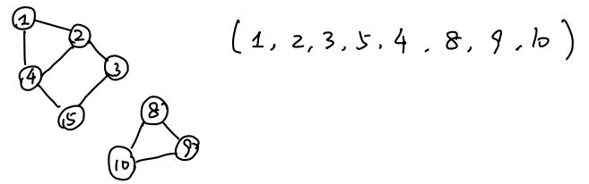
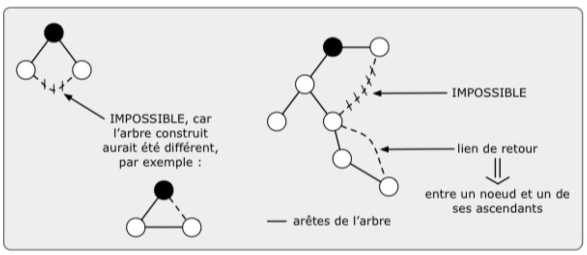

# APD Cour 5 / TD 6-7 - Algorithme de Parcours et d'Exploration 图遍历与探索算法

## 1. Introduction au Parcours de Graphe 图的遍历算法介绍

**Entrée :** un graphe quelconque. (输入：任意图。)

En système distribué, l'exploration du graphe est fondamentale. Les deux approches classiques sont :  
在分布式系统中，图的探索是一个基础问题。两种最经典的方法是：

- **DFS** : Parcours en profondeur (深度优先搜索)
- **BFS** : Parcours en largeur (广度优先搜索)

### Rappel du DFS en "Centralisé" 集中式环境下的 DFS 回顾

**Structure de données :** Une matrice d'adjacence $G$. (使用邻接矩阵 $G$)

- $G[x][y] = 0$ : non adjacent (顶点x和顶点y不相邻)
- $G[x][y] = 1$ : adjacent (顶点x和顶点y相邻)
- Applicable sur un graphe quelconque, simple, sans boucles, potentiellement non connexe 适用于任意简单、无自环、可能不连通的图.

**Algorithme : 算法：**
On maintient un tableau booléen `marque[]` (initialisé à `faux`), qui indique les sommets déjà explorés. 我们维护一个布尔数组 `marque[]`（初始值为 `faux`），用于标记已经被探索过的顶点。

```pseudo
**Connaissance**
$G$ : matrice d'adjacence du graphe.

**Variables**
$marque$ : tableau de booléens, initialisé à $Faux$.

**Algorithme**
**while** il existe un sommet $s$ tel que $marque[s] = Faux$ **do**
  DFS$(s, G, marque)$

**Fonction** DFS$(s, G, marque)$
  $marque[s]$ <- $Vrai$
  afficher$(s)$
  **while** il existe un voisin $x$ de $s$ tel que $marque[x] == Faux$ **do**
    DFS$(x, G, marque)$
```



**Arbre couvrant (生成树) :**

- Les arêtes qui correspondent aux **appels récursifs** forment un arbre couvrant du graphe (ou une forêt, si le graphe est non connexe). 那些对应于递归调用的边构成了图的生成树（如果图不连通，则是生成森林）。
- **Définition d'un arbre couvrant :** C'est un sous-graphe de $G$ qui est un arbre (connexe et sans cycle) et qui contient **tous les sommets**. 生成树：$G$ 的一个子图，本身是一棵树并且包含所有顶点。

---

## 2. Propagation d'Information avec Retour : Algorithme PIF 信息传播与回传算法

**PIF** ("Propagation d'Information avec Feedback / Retour") est le premier algorithme distribué fondamental de parcours. (PIF 算法，即带有反馈的信息传播，是第一个基础的分布式遍历算法。)

**Entrée :** Un graphe quelconque. (输入：任意图)

### Principe Général (基本原理)

- Le réseau possède **1 initiateur** qui commence l'exploration en envoyant des jetons (tokens) à tous ses voisins. 网络中有一个发起者，它通过向所有邻居发送令牌来开始探索。
- Lorsqu'un nœud **non-initiateur** reçoit un jeton pour la _première fois_, il définit l'expéditeur de ce jeton comme son **père** dans l'arbre couvrant en construction. 当一个非发起者节点第一次收到令牌时，它将该令牌的发送者定义为它在正在构建的生成树中的父节点。
- Ensuite, ce nœud renvoie des jetons à tous ses autres voisins. 接着，该节点向它的其他邻居发送令牌。
- Un nœud compte le nombre de jetons reçus (qui correspondent aux autres arêtes adjacentes explorées par les voisins). 一个节点计算收到的令牌数量（对应于邻居探索的其他相邻边）。
- **Condition de retour :** Lorsqu'il a reçu exactement 1 jeton de **tous** ses voisins, il sait que sa propre exploration locale est terminée et il **transmet le jeton à son père**. 当它从所有邻居处分别收到过 1 个 Token 时，它就将 Token 传回给它的父节点，表示自己的分支已探索完毕。

---

```pseudo
**Algorithm 11** Algorithme de PIF, local au site $i$

**Connaissance**
$vois_i$ : ensemble des voisins du site $i$.

**Variables**
$nbRecu_i$ : nombre de messages $Jeton()$ reçus, initialisé à $0$.
$pere_i$ : identifiant du site père, initialisé à $ndef$.
$init_i \in \{Vrai, Faux\}$ : booléen indiquant si $i$ est l'initiateur principal, initialisé à $Faux$.

**Algorithme**
**Initialement** ->  /* Sur exactement un site initiateur */
  $init_i$ <- $Vrai$
  **for all** $j \in vois_i$ **do**
    Envoyer $Jeton()$ à $j$

**Sur réception de** $Jeton()$ **de** $k$ ->
  $nbRecu_i$ ++
  **if** $init_i$ **then**
    **if** $nbRecu_i = |vois_i|$ **then**
      **STOP_GLOBAL**
  **else**
    **if** $pere_i = ndef$ **then**
      $pere_i$ <- $k$
      **for all** $j \in vois_i \setminus \{k\}$ **do**
        Envoyer $Jeton()$ à $j$
    **if** $nbRecu_i = |vois_i|$ **then**
      Envoyer $Jeton()$ à $pere_i$
```

---

### Complexité du PIF (算法复杂性分析)

- **Complexité en messages (消息复杂度) :** **$2m = O(m)$**
  - Où $m$ est le nombre total d'arêtes du graphe (边的总数).
  - *Pourquoi ?* Chaque arête du graphe est traversée exactement deux fois par un `Jeton()` (une fois dans chaque direction). 每条边被 `Jeton()` 穿过两次（每个方向一次），所以消息总数是 $2m$。
  - Au cours de l'algorithme, on dénombre **3 types de messages** qui transitent sur les arêtes (在执行过程中，Token 可以分为 3 种语义) :
    1. **Messages de diffusion (广播消息)** : Premier jeton qui atteint un nœud et lui fait découvrir son père. (构建生成树的消息).
    2. **Messages d'exploration (探索/拦截消息)** : Jeton qui parcourt une arête vers un nœud *déjà visité*. Ce jeton se contente de s'ajouter au compteur `nbRecu` pour signaler que l'arête a été sondée dans ce sens. (到达已访问过的节点的消息，被算作一次探索).
    3. **Messages de retour vers le père (返回给父亲的消息)** : Le jeton de confirmation final lorsqu'un sous-arbre a terminé son exploration, signalant au père que cette branche est clôturée. (当一条分支探索完毕后最后退回给父节点的消息).

---

### Exercice 3. - Election de leader dans un graphe identifié de topologie quelconque 练习 3 - 在任意拓扑结构的标识图中进行领导者选举

On souhaite écrire un algorithme distribué d'élection de leader dans un système distribué identifié, de sorte que le leader soit le site d'identifiant maximal. On suppose qu'il existe un unique initiateur dans le réseau (non nécessairement le site d'identifiant maximal).
我们希望在一个标识化的分布式系统中编写一个分布式领导者选举算法，使得领导者是拥有最大标识符的站点。假设网络中存在唯一的一个发起者（该发起者不一定是拥有最大标识符的站点）。

1. En se basant sur l'algorithme du PIF ci-dessus, écrire un algorithme qui effectue cette élection et tel que, à la fin de l'exécution, l'initiateur du PIF connaisse l'identifiant du leader.
   基于上述的 PIF 算法，编写一个执行该选举的算法，并使得在执行结束时，该 PIF 的发起者能够知道领导者的标识符。

   **Corr** : Il suffit d'enrichir l'algorithme de PIF en faisant remonter, dans les messages de retour, le maximum des identifiants vus dans chaque sous-arbre. Chaque site $i$ maintient donc une variable $max_i$, initialisée à $id_i$. Lorsqu'il reçoit des retours de ses fils, il met à jour $max_i$ avec le maximum entre sa propre valeur et celles reçues. Quand tous les retours attendus ont été reçus, il renvoie à son père la valeur $max_i$. À la fin, l'initiateur reçoit le maximum global, qui est l'identifiant du leader.  
   **更正**：只需要在 PIF 算法上做一个扩展：让每个返回消息都携带对应子树中见到的最大标识符。于是每个站点 $i$ 维护一个变量 $max_i$，初始为 $id_i$。当它收到子节点的返回消息时，就用收到的值更新 $max_i$。当它收齐了所有应收到的返回后，就把 $max_i$ 发给自己的父节点。最终，发起者收到的最大值就是整个图中的最大标识符，也就是 leader 的标识符。

```pseudo
**Connaissance**
$vois_i$ : ensemble des voisins du site $i$.
$id_i$ : identifiant du site $i$.
$initi_i \in \{Vrai, Faux\}$ : indique si $i$ est l'initiateur.

**Variables**
$pere_i$ : identifiant du père, initialisé à $ndef$.
$nbRecu_i$ : nombre de messages reçus pour cette vague, initialisé à $0$.
$max_i$ : plus grand identifiant vu dans le sous-arbre de $i$, initialisé à $id_i$.
$leader_i$ : identifiant du leader, initialisé à $ndef$.

**Messages**
$Jeton()$
$Retour(v)$  /* v = maximum du sous-arbre */

**Algorithme**
**Initialement** ->
  **if** $initi_i = Vrai$ **then**
    **for all** $j \in vois_i$ **do**
      Envoyer $Jeton()$ à $j$

**Sur réception de** $Jeton()$ **de** $k$ ->
  $nbRecu_i$ ++
  **if** $pere_i = ndef$ **and** $initi_i = Faux$ **then**
    $pere_i$ <- $k$
    **if** $vois_i \setminus \{pere_i\} = \emptyset$ **then**
      Envoyer $Retour(max_i)$ à $pere_i$  /* feuille */
    **else**
      **for all** $j \in vois_i \setminus \{pere_i\}$ **do**
        Envoyer $Jeton()$ à $j$

**Sur réception de** $Retour(v)$ **de** $k$ ->
  $nbRecu_i$ ++
  $max_i$ <- max($max_i, v$)
  **if** $initi_i = Vrai$ **then**
    **if** $nbRecu_i = |vois_i|$ **then**
      $leader_i$ <- $max_i$
  **else**
    **if** $nbRecu_i = |vois_i|$ **then**
      Envoyer $Retour(max_i)$ à $pere_i$
```

2. Ajouter le nécessaire à votre algorithme afin qu'à la fin de l'exécution, tous les sites connaissent l'identifiant du leader.
   对你的算法进行必要的补充，使得在执行结束时，所有的站点都能知道领导者的标识符。

   **Corr** : Une fois que l'initiateur connaît la valeur du leader, il suffit d'ajouter une phase descendante sur l'arbre construit pendant le PIF. L'initiateur envoie l'identifiant du leader à tous ses fils, puis chaque site qui reçoit cette information la mémorise et la retransmet à ses propres fils. Ainsi, l'information se diffuse à tout le graphe en suivant l'arbre de diffusion déjà construit.  
   **更正**：当发起者已经知道 leader 的标识符后，只需要再增加一个沿着 PIF 生成树向下传播的阶段即可。发起者把 leader 的 id 发给自己的所有子节点；每个节点收到后先保存，再继续发给自己的所有子节点。这样信息就会沿着已经构造好的生成树传播到所有站点。

```pseudo
**Variables**
$leader_i$ : identifiant du leader, initialisé à $ndef$.

**Messages**
$Leader(id)$

**Algorithme**

**Sur réception de** $Retour(v)$ **de** $k$ ->
  $nbRecu_i$ ++
  $max_i$ <- max($max_i, v$)
  **if** $initi_i = Vrai$ **then**
    **if** $nbRecu_i = |vois_i|$ **then**
      $leader_i$ <- $max_i$
      **for all** $j \in vois_i$ **do**
        Envoyer $Leader(leader_i)$ à $j$
  **else**
    **if** $nbRecu_i = |vois_i|$ **then**
      Envoyer $Retour(max_i)$ à $pere_i$

**Sur réception de** $Leader(id)$ **de** $k$ ->
  $leader_i$ <- $id$
  **for all** $j \in vois_i \setminus \{k\}$ **do**
    Envoyer $Leader(leader_i)$ à $j$
```

   À la fin de cette seconde phase, tous les sites connaissent l'identifiant du leader.  
   在这个第二阶段结束后，所有站点都知道 leader 的标识符。

---

## 3. Parcours par circulation de jeton (基于令牌环流的遍历)

**Hypothèses :** Graphe quelconque avec un seul initiateur. Canaux de communication asynchrones et fiables. 任意图，单发起者，异步可靠信道。

**Principe :** Un initiateur crée un jeton qui circule dans le graphe. 一个发起者创建一个令牌在图中流动。

- Lorsque $i$ reçoit le jeton pour la première fois, il désigne l'émetteur du jeton comme son **père**. 当 $i$ 第一次收到令牌时，它将令牌的发送者指定为它的父节点。
- Lorsque $i$ reçoit le jeton (pour la 1ère fois ou non), il l'envoie à un de ses **voisins (privé de son père) et à qui il n'a pas déjà envoyé le jeton**. 当 $i$ 收到令牌（无论是第一次还是之后的收到），它将令牌发送给它的一个邻居（不包括它的父节点）且之前没有发送过令牌的邻居。
- Si $i$ a déjà envoyé le jeton à **tous** ses voisins (sauf son père), il le renvoie alors à son père. 如果 $i$ 已经向它的所有邻居（除了父节点）发送过令牌了，那么它就将令牌发送回它的父节点。
- **Résultat :** Au final, on obtient un arbre enraciné en l'initiateur (cet arbre n'a aucune propriété particulière, c'est juste un arbre couvrant quelconque de l'algorithme). 最终，我们得到一棵以发起者为根的树（这棵树没有任何特殊属性，只是算法构建的一个生成树）。

---

```pseudo
**Algorithm 12** Algorithme de parcours par circulation de jeton, local au site $i$

**Connaissance**
$vois_i$ : ensemble des voisins du site $i$.

**Variables**
$pere_i$ : identifiant de site, initialisé à $ndef$.
$utilise_i$ : tableau de booléens, indicé par l'identifiant des voisins, initialisé à $Faux$.

**Algorithme**
**Initialement** ->  /* Sur exactement un site initiateur */
  $pere_i$ <- $i$
  Choisir $j_0 \in vois_i$
  $utilise_i[j_0]$ <- $Vrai$
  Envoyer $Jeton()$ à $j_0$

**Sur réception de** $Jeton()$ **de** $j_0$ ->
  **if** $pere_i = ndef$ **then**
    $pere_i$ <- $j_0$

  **if** $\forall j \in vois_i, utilise_i[j] = Vrai$ **then**
    **STOP_GLOBAL**
  **else**
    **if** $\exists j \in vois_i, j \neq pere_i \land \neg utilise_i[j]$ **then**
      Choisir $j \in vois_i \setminus \{pere_i\}$ tel que $\neg utilise_i[j]$
      $utilise_i[j]$ <- $Vrai$
      Envoyer $Jeton()$ à $j$
    **else**
      $utilise_i[pere_i]$ <- $Vrai$
      Envoyer $Jeton()$ à $pere_i$
```

**Complexité. 复杂度。**  
**Complexité en messages :** $2m = O(m)$. Chaque arête est parcourue au plus deux fois par le jeton, une fois dans chaque sens.  
**消息复杂度：** $2m = O(m)$。每条边至多被令牌经过两次，分别对应两个方向。  

**Complexité en temps (synchrone) :** $2m = O(m)$ rounds. En effet, il n'y a qu'un seul jeton en circulation, donc à chaque round il ne peut avancer que d'une arête, et le nombre total de traversées est majoré par $2m$.  
**时间复杂度（同步环境）：** $2m = O(m)$ 轮。因为系统中始终只有一个令牌在流动，所以每一轮它最多只前进一条边，而总的边遍历次数最多为 $2m$。  

**En asynchrone :** l'algorithme termine toujours, mais le temps réel dépend des délais de transmission et ne s'exprime donc pas uniquement en fonction de $n$ et $m$.  
**在异步环境下：** 算法仍然一定终止，但真实运行时间取决于消息传输延迟，因此不能只用 $n$ 和 $m$ 来刻画。

<br>

---

### Exercice 1. - Calcul de la taille dans un graphe identifié de topologie quelconque 练习 1 - 在任意拓扑结构的标识图中计算系统大小

Donner un algorithme distribué utilisant un parcours et qui permet à un initiateur de déterminer la taille d'un système distribué. La taille d'un système distribué est définie comme le nombre de sites appartenant à ce système. Initialement, un site ne connaît que ses voisins immédiats. 给出一个使用遍历的分布式算法，使得发起者能够确定分布式系统的大小。系统的大小定义为属于该系统的站点数量。初始时，一个站点只认识它的直接邻居。

**Corr** : On reprend l'algorithme de PIF et l'on remplace la remontée d'un maximum par la remontée d'un **compteur**. Chaque site $i$ initialise une variable $taille_i$ à $1$ pour se compter lui-même. Lorsqu'il reçoit les valeurs renvoyées par ses fils, il les additionne à sa propre valeur. Quand tous les retours sont arrivés, il transmet la somme à son père. L'initiateur reçoit alors la taille totale du système.  
**更正**：直接复用 PIF 算法，只不过把“返回最大值”改成“返回计数”。每个站点 $i$ 维护变量 $taille_i$，初始为 $1$，表示先把自己算进去。收到子节点的返回值后，把这些值累加到自己的 $taille_i$ 上；当所有返回都收齐后，把总和发送给父节点。最终发起者收到的和就是整个系统的大小。

```pseudo
**Idée**
Remplacer $max_i$ par $taille_i$.

**Initialisation**
$taille_i$ <- $1$

**Sur réception de** $Retour(v)$ **de** $k$ ->
  $taille_i$ <- $taille_i + v$
  **quand** tous les retours attendus sont reçus ->
    **if** $i$ est initiateur **then**
      Décider que la taille du système vaut $taille_i$
    **else**
      Envoyer $Retour(taille_i)$ à $pere_i$
```

<br>

---

### Exercice 2. - Parcours avec plusieurs initiateurs 练习 2 - 多个发起者的图遍历

On suppose ici que le système distribué est muni de plusieurs initiateurs. Donner un algorithme distribué basé sur le parcours qui permet de construire un arbre couvrant du réseau enraciné en l'un des initiateurs. L'idée est que chaque initiateur lance un parcours, en créant un jeton qu'il étiquette de son identifiant. Il y a donc plusieurs jetons qui vont parcourir le graphe et lorsque "deux parcours se rencontrent", c'est celui qui a le plus grand identifiant qui "gagne". 假设此处的分布式系统有多个发起者。给出一个基于遍历的分布式算法，用于构建一棵以其中某个发起者为根的生成树。核心思想是：每个发起者都启动一次遍历，创建一个带有自己标识符的 Token。因此会有多个 Token 在图中传播，当“两个遍历相遇”时，标识符较大的那个“获胜”。

**Corr** : Chaque initiateur $r$ lance un jeton $Jeton(r)$ portant son identifiant. Chaque site mémorise l'identifiant $racine_i$ du plus grand initiateur vu jusqu'à présent, ainsi qu'un père associé $pere_i$. Lorsqu'un site reçoit un jeton portant un identifiant plus grand que $racine_i$, il abandonne son ancienne affiliation, met $racine_i$ à cette nouvelle valeur, choisit l'émetteur comme père, puis relaie ce jeton à ses autres voisins. En revanche, si le jeton reçu porte un identifiant plus petit que $racine_i$, il est détruit. Ainsi, à la fin, seul le parcours issu de l'initiateur de plus grand identifiant subsiste, et l'arbre construit est enraciné en lui.  
**更正**：每个发起者 $r$ 都发出一个携带自己标识符的 token，记作 $Jeton(r)$。每个站点维护自己当前归属的根标识符 $racine_i$，以及对应的父节点 $pere_i$。如果某个站点收到一个标识符比当前 $racine_i$ 更大的 token，那么它就放弃之前的归属，把新的根改成这个更大的标识符、把发送者设为父节点，并继续向其它邻居转发这个 token。若收到的 token 标识符更小，则直接销毁。这样最终只有最大标识符 initiateur 发出的遍历会保留下来，生成树也就以它为根。

```pseudo
**Variables**
$racine_i$ : plus grand identifiant d'initiateur vu jusqu'à présent, initialisé à $id_i$ si $i$ est initiateur, sinon à $ndef$.
$pere_i$ : père courant, initialisé à $ndef$.

**Messages**
$Jeton(r)$  /* r = identifiant de l'initiateur */

**Règle de réception**
**Sur réception de** $Jeton(r)$ **de** $k$ ->
  **if** $racine_i = ndef$ **or** $r > racine_i$ **then**
    $racine_i$ <- $r$
    $pere_i$ <- $k$
    Relayer $Jeton(r)$ à tous les voisins sauf $k$
  **else**
    Détruire le jeton
```

À la fin, la racine élue est l'initiateur d'identifiant maximal.  
最终胜出的根是标识符最大的发起者。

<br>

---

### Exercice 4. - Hauteur de l'arbre couvrant  练习 4 - 计算生成树的高度

S'il y a un parcours de Jeton, calculer la hauteur de l'arbre couvrant construit lors du parcours. 计算在令牌遍历过程中所构建生成树的高度。

**Corr** : Pendant le parcours, chaque site peut calculer sa profondeur dans l'arbre couvrant : l'initiateur a la profondeur $0$, et tout autre site adopte la profondeur de son père plus $1$ lorsqu'il est découvert. Ensuite, lors de la phase de retour, chaque site renvoie à son père la hauteur maximale observée dans son sous-arbre. Plus précisément, une feuille renvoie sa propre profondeur, et un nœud interne renvoie le maximum entre les valeurs reçues de ses fils. L'initiateur obtient ainsi la hauteur de l'arbre couvrant.  
**更正**：在遍历过程中，每个站点都可以计算自己在生成树中的深度：发起者深度为 $0$，其他站点第一次被发现时，把自己的深度设为父节点深度加 $1$。然后在回传阶段，每个站点把自己子树中的最大深度返回给父节点。更具体地说，叶子返回自己的深度，内部节点返回自己所有子节点返回值中的最大值。最终发起者得到的就是整棵生成树的高度。

```pseudo
**Variables supplémentaires**
$prof_i$ : profondeur de $i$ dans l'arbre, initialisée à $0$ pour l'initiateur.
$haut_i$ : hauteur maximale observée dans le sous-arbre de $i$, initialisée à $prof_i$.

**À la découverte de** $i$ **par son père** $pere_i$ ->
  $prof_i$ <- $prof_{pere_i} + 1$
  $haut_i$ <- $prof_i$

**Sur réception de** $Retour(h)$ **de** $k$ ->
  $haut_i$ <- max($haut_i, h$)
  **quand** tous les retours sont arrivés ->
    **if** $i$ est initiateur **then**
      Décider que la hauteur de l'arbre vaut $haut_i$
    **else**
      Envoyer $Retour(haut_i)$ à $pere_i$
```

<br>

---

## 4. DFS vs BFS et Simulation du DFS en Distribué

Au cours de l'exploration, l'arbre couvrant peut prendre différentes formes selon la stratégie :  
在探索过程中，生成树的形状会随着所采用的策略不同而不同：

- **DFS (Parcours en profondeur / 深度优先搜索) :** Les arcs correspondant aux appels récursifs du DFS forment un arbre couvrant profond. L'exploration s'enfonce le plus loin possible avant de rebrousser chemin.  
  DFS（深度优先搜索）中，与递归调用对应的边会形成一棵较“深”的生成树；探索会尽可能往深处走，直到不能继续时才回退。
- **BFS (Parcours en largeur / 广度优先搜索) :** L'exploration se fait par ondes de **distance croissante** au sommet d'origine. Les nœuds sont découverts couche par couche (distance 1, distance 2, etc.) en respectant un ordre FIFO.  
  BFS（广度优先搜索）中，探索按与起点距离递增的波次进行；节点按层被发现（距离 1、距离 2 等），并遵循 FIFO 顺序。

### Simulation du DFS en Distribué (在分布式系统中模拟 DFS)

Le DFS distribué est directement **basé sur l'algorithme de parcours par circulation de Jeton** (Algorithm 12 avec le tableau `utilise_i`). Autrement dit, on repart de l'algorithme de parcours usuel, mais pour simuler fidèlement un véritable DFS, il faut préciser plus finement à quel voisin envoyer le jeton et, en particulier, ce qui se passe **lorsqu'un nœud reçoit le jeton alors qu'il a déjà été visité**.  
分布式 DFS 是直接建立在令牌环流遍历算法（Algorithm 12，使用 `utilise_i` 数组）之上的。换句话说，我们以前面的普通遍历算法为基础，但为了真正模拟深度优先搜索，还必须更精确地规定令牌该发送给哪个邻居，尤其要说明**当一个节点再次收到它之前已经访问过的令牌时**应当如何处理。

Lorsqu'un nœud $i$ reçoit le jeton du voisin $j_0$ (et que $i$ n'est pas "neuf"), il y a **deux cas de figure (Deux cas)** :  
当一个节点 $i$ 从邻居 $j_0$ 收到令牌时（并且 $i$ 已经不是“第一次访问”的新节点），会出现**两种情况**：

1. **Cas 1 : $i$ n'avait PAS envoyé le jeton à $j_0$ (节点 $i$ 之前没有向 $j_0$ 发送过 Token)**
   - *Explication :* On est en train d'explorer du côté de $j_0$. Mais comme $i$ avait déjà été exploré (reçu le jeton par un autre chemin), la visite de $j_0$ est un cul-de-sac temporel (une boucle spatiale). $i$ a fini son exploration de ce côté.  
     解释：当前正在探索 $j_0$ 这一侧；但由于 $i$ 早就已经通过另一条路径被访问过，所以从 $j_0$ 走到 $i$ 这里只是遇到了一个“死胡同”或者空间回路，说明这一侧已经不能再继续深入。
   - *Action / Conséquence :* $i$ doit **immédiatement renvoyer le jeton à $j_0$**. $j_0$ recevant ce retour direct comprendra que $i$ est une impasse et continuera son exploration ailleurs. *(Dans le code, cela correspond à l'ajout classique d'un `if` pour intercepter ce rebond avant d'exécuter la suite).*  
     动作 / 结果：$i$ 必须**立刻把令牌退回给 $j_0$**。当 $j_0$ 收到这个直接返回的令牌时，就知道 $i$ 这边是一条死路，于是转而去探索别的分支。（在代码里，这对应于在继续执行主逻辑之前，先加一个 `if` 来拦截这种“反弹”情况。）

2. **Cas 2 : $i$ AVAIT DÉJÀ envoyé le jeton à $j_0$ (节点 $i$ 之前向 $j_0$ 发送过 Token)**
   - *Explication :* Cela signifie que l'exploration est finie du côté de $j_0$. La branche entière sous $j_0$ a terminé son DFS et ramène le jeton à $i$ en *backtracking*.  
     解释：这说明 $j_0$ 这一侧的探索已经结束了。也就是说，以 $j_0$ 为入口的整条分支都已经完成了 DFS，现在令牌通过回溯的方式回到 $i$。
   - *Action / Conséquence :* $i$ doit reprendre la main et **envoyer le jeton à 1 autre voisin non exploré** (ou s'il n'y en a plus, faire remonter le jeton à son propre père).  
     动作 / 结果：此时 $i$ 要重新接管探索，并**把令牌发给另一个尚未探索的邻居**；如果已经没有这样的邻居了，就把令牌继续回传给自己的父节点。

```pseudo
**Algorithm 13** Parcours DFS, algorithme local au site $i$

**Connaissance**
$vois_i$ : ensemble des voisins du site $i$.

**Variables**
$pere_i$ : identifiant de site, initialisé à $ndef$.
$utilise_i$ : tableau de booléens indicé par l'identifiant des voisins, initialisé à $Faux$.

**Algorithme**
**Initialement** ->  /* Sur un seul site */
  $pere_i$ <- $i$
  Choisir $j_0 \in vois_i$
  $utilise_i[j_0]$ <- $Vrai$
  Envoyer $Jeton()$ à $j_0$

**Sur réception de** $Jeton()$ **de** $j_0$ ->
  **if** $pere_i = ndef$ **then**
    $pere_i$ <- $j_0$

  **if** $\forall j \in vois_i, utilise_i[j] = Vrai$ **then**
    **STOP_GLOBAL**
  **else**
    **if** $\exists j \in vois_i,\ j \neq pere_i \land \neg utilise_i[j]$ **then**
      **if** $j_0 \neq pere_i \land \neg utilise_i[j_0]$ **then**
        $j$ <- $j_0$
      **else**
        Choisir $j \in vois_i \setminus \{pere_i\}$ tel que $\neg utilise_i[j]$
      $utilise_i[j]$ <- $Vrai$
      Envoyer $Jeton()$ à $j$
    **else**
      $utilise_i[pere_i]$ <- $Vrai$
      Envoyer $Jeton()$ à $pere_i$
```

**Idée clé. 核心思想。**  
Le test $j_0 \neq pere_i \land \neg utilise_i[j_0]$ correspond exactement au premier des deux cas décrits ci-dessus : le jeton revient d'un voisin auquel $i$ ne l'avait jamais envoyé, donc $i$ doit immédiatement le lui renvoyer pour respecter le comportement d'un vrai DFS.  条件 $j_0 \neq pere_i \land \neg utilise_i[j_0]$ 正好对应上面分析的第一种情况：令牌是从一个节点此前没有主动发送过令牌的邻居返回的，因此为了保持真正 DFS 的行为，节点 $i$ 必须立刻把令牌回送给该邻居。


<br>

---

## 5. Diffusion et Tolérance aux Pannes (广播与容错)

### Exercice 1. - Diffusion asynchrone en cas de panne sur les nœuds 练习 1 - 节点故障情况下的异步广播

La diffusion est l'opération qui consiste pour un site donné à envoyer un même message $m$ à tous les autres sites d'un système. Nous considérons ici un système constitué de $n$ sites $P_0, P_1, \dots, P_{n-1}$ tous interconnectés *(graphe connexe / complet)*.  
（广播是指一个给定站点向系统中所有其他站点发送相同消息 $m$ 的操作。我们这里考虑一个由 $n$ 个站点 $P_0, P_1, \dots, P_{n-1}$ 组成的系统，它们彼此互连 / 连通。）

1. Décrire un algorithme de diffusion à partir de $P_0$ vers les autres sites (en supposant aucune panne). Calculer le nombre de messages nécessaires pour réaliser cette diffusion.
   （描述一个从 $P_0$ 向其他站点广播的算法（假设没有故障）。计算实现该广播所需的消息数量。）

   **Corr** : Sans panne, dans un réseau complet, $P_0$ peut simplement envoyer directement le message $m$ à chacun des $n-1$ autres sites. Tous les sites reçoivent alors l'information en une seule étape logique. Le nombre total de messages est donc exactement $n-1$.  
   **更正**：在没有故障的情况下，由于网络是完全图，$P_0$ 只需把消息 $m$ 直接发送给其余的 $n-1$ 个站点即可。所有站点在一次逻辑扩散中都能收到消息，因此总消息数恰好是 $n-1$。

2. Nous voulons maintenant construire un algorithme de diffusion qui fonctionne même en cas de pannes de certains sites. Nous appelons panne d'un site l'arrêt soudain d'un site. On suppose qu'une fois en panne, un site reste en panne et ne fait plus rien.
Proposer un algorithme de diffusion à partir de $P_0$ vers les autres sites, qui tolère une panne d'un des sites (on suppose que si $P_0$ est le site en panne, il a au moins le temps d'envoyer un message). Calculer le nombre de messages nécessaires pour réaliser cette diffusion.
   （现在我们想要构建一个即使有些站点发生故障也能运作的广播算法。站点的故障指的是突然崩溃停止。假设一旦发生故障，站点将保持故障状态且不再执行任何操作。
   提出一个从 $P_0$ 向其他站点广播的算法，该算法能容忍 **1个站点** 发生故障（假设如果 $P_0$ 是故障站点，它至少有时间发出1条消息）。计算实现该广播所需的消息数量。）

   **Corr** : Pour tolérer une panne, il faut prévoir une redondance de diffusion. Dans un réseau complet, une solution simple consiste à demander à chaque site qui reçoit $m$ pour la première fois de le retransmettre à tous les sites qui ne l'ont pas encore diffusé. Une stratégie plus simple à décrire est la suivante : $P_0$ envoie $m$ à tous les autres sites, puis chaque site $P_i$ qui reçoit $m$ le relaie à tous les sites d'identifiant strictement supérieur au sien. Ainsi, même si un site tombe en panne après avoir reçu le message, il existe encore d'autres chemins de diffusion. Cette stratégie tolère une panne. Le nombre total de messages est alors de l'ordre de toutes les arêtes orientées utiles, soit $\Theta(n^2)$. Plus précisément, on obtient $\frac{n(n-1)}{2}$ messages si chaque site relaie seulement vers les sites d'identifiant supérieur.  
   **更正**：为了容忍一个故障，广播必须带有冗余。在完全图中，一种简单方法是：每个站点第一次收到消息 $m$ 后，再把它转发给一批尚未由它“负责之后传播”的站点。一个常见且容易分析的方案是：$P_0$ 把 $m$ 发给所有其他站点，然后每个站点 $P_i$ 第一次收到 $m$ 后，把它转发给所有编号严格大于自己的站点。这样，即使某个站点收到消息后立刻崩溃，后续仍然有其它路径能把消息送达所有正确站点。该方案能够容忍一个站点故障。总消息数是二次量级，具体为 $\frac{n(n-1)}{2}$，因此复杂度是 $\Theta(n^2)$。

1. Généraliser cet algorithme pour qu'il tolère jusqu'à $t$ sites en panne. Attention, on continue de supposer que si $P_0$ tombe en panne, il a le temps d'envoyer au moins 1 message.
   （泛化该算法，使其能容忍最多 $t$ 个站点发生故障。注意，继续假设如果 $P_0$ 发生故障，它有时间发送至少1条消息。）

   **Corr** : Pour tolérer jusqu'à $t$ pannes, il faut que chaque site correct puisse recevoir le message par au moins $t+1$ chemins ou, de manière équivalente ici, qu'il y ait encore au moins une copie du message disponible même après $t$ défaillances. Dans un réseau complet, une solution naturelle consiste à demander à chaque site qui reçoit le message de le retransmettre à tous les sites qui ne l'ont pas encore reçu. Cette diffusion avec redondance totale tolère jusqu'à $t$ pannes tant que $t < n-1$, car la disparition de $t$ sites ne suffit pas à faire disparaître toutes les copies en circulation avant que les autres aient été touchés. Le coût reste quadratique, donc $\Theta(n^2)$ messages.  
   **更正**：若要容忍最多 $t$ 个故障，就必须保证每个正确站点在最坏情况下仍有足够的冗余路径或冗余消息副本。对于完全图，一个自然做法是：每个站点第一次收到消息后，把该消息继续转发给所有它尚未确认已覆盖的站点。由于整个网络高度冗余，只要 $t < n-1$，即使有多达 $t$ 个站点崩溃，也仍然存在其它节点继续扩散消息。这个方法的消息复杂度仍然是二次量级，即 $\Theta(n^2)$。

<br>

---

### Exercice 2. - Diffusion ne respectant pas l'ordre FIFO des messages 练习 2 - 不遵守 FIFO 顺序的消息广播

On considère un réseau complet. On suppose que les sites sont tous fiables, mais que le réseau de communications peut ne pas respecter l'ordre FIFO. On suppose également qu'il existe un initiateur qui souhaite diffuser plusieurs messages vers les autres sites. Proposer une méthode pour garantir que ces sites traitent les messages en respectant l'ordre d'envoi par l'initiateur.  
（考虑一个完全连通网络。假设所有站点都可靠，但通信网络可能不遵守 FIFO 先进先出顺序。同时假设存在一个发起者，他希望向其他站点广播多条消息。提出一种方法以确保这些站点能按照发起者发送的顺序来处理这些消息。）

**Corr** : Il suffit d'étiqueter chaque message diffusé par l'initiateur avec un numéro de séquence croissant : $1,2,3,\dots$ Chaque site maintient ensuite le prochain numéro attendu, noté par exemple $attendu_i$, initialisé à $1$. Lorsqu'un site reçoit un message de numéro $k$ :
- s'il a $k = attendu_i$, il le livre immédiatement à l'application, puis incrémente $attendu_i$ ;
- s'il a $k > attendu_i$, il le stocke dans un tampon en attendant les messages manquants ;
- s'il a $k < attendu_i$, il l'ignore car il s'agit d'un doublon ou d'un message déjà traité.  
Ainsi, même si le réseau ne respecte pas FIFO, chaque site traite les messages dans l'ordre d'envoi de l'initiateur.  
**更正**：只需要让发起者给每条广播消息附加一个严格递增的序号：$1,2,3,\dots$。然后每个站点维护自己“下一条期待接收的序号”，记为 $attendu_i$，初始为 $1$。当站点收到编号为 $k$ 的消息时：
- 如果 $k = attendu_i$，就立刻把该消息交付给上层应用，然后令 $attendu_i \leftarrow attendu_i + 1$；
- 如果 $k > attendu_i$，就先把消息放入缓冲区，等待前面缺失的消息到达；
- 如果 $k < attendu_i$，就忽略它，因为这说明它是重复消息或者已经处理过的旧消息。  
这样，即使网络本身不满足 FIFO，所有站点仍然会按照发起者原本的发送顺序来处理消息。

```pseudo
**Connaissance**
L'initiateur diffuse des messages numérotés $1,2,3,\dots$

**Variables**
$attendu_i$ : prochain numéro attendu, initialisé à $1$.
$tampon_i$ : ensemble des messages reçus en avance, initialisé à $\emptyset$.

**Sur réception de** $Msg(num, contenu)$ ->
  **if** $num = attendu_i$ **then**
    Livrer $contenu$
    $attendu_i$ <- $attendu_i + 1$
    **while** $\exists Msg(attendu_i, c) \in tampon_i$ **do**
      Retirer $Msg(attendu_i, c)$ de $tampon_i$
      Livrer $c$
      $attendu_i$ <- $attendu_i + 1$
  **else if** $num > attendu_i$ **then**
    Stocker $Msg(num, contenu)$ dans $tampon_i$
  **else**
    Ignorer le message
```

**📝 Notes manuscrites / 随堂笔记提示 :**

- L'initiateur envoie plusieurs messages à diffuser vers les autres sites. 发起者发送多条消息广播给其他站点
- $\rightarrow$ Il a un compteur `cpt <- 0`. (发起者维护一个计数器)
- $\rightarrow$ Chaque message incrémente le compteur `cpt++`. (每发送一条消息，计数器递增)
- $\rightarrow$ Chaque nœud contrôle que l'init... (每个节点检查收到的消息序号，以确保按顺序处理)
