# Programmation parallele et distribuee / 并行与分布式编程

## Cours 1 : Architectures paralleles et introduction a la programmation parallele / 课程 1：并行体系结构与并行编程导论

### Auteurs / 作者

- Patrick Carribault
- David Dureau
- Marc Perache [marc.perache@cea.fr]

作者：Patrick Carribault、David Dureau、Marc Perache[marc.perache@cea.fr]。

### Supports / 讲义资源

- [https://gitlab.com/perache_cours/app/public](https://gitlab.com/perache_cours/app/public)

## Contexte / 背景

### Evolution des architectures de processeurs / 处理器架构如何演进？

- Augmentation de la frequence. 早期主要依靠提高时钟频率。
  - Exemple : `1 GHz = 10^9` cycles par seconde. 例如 `1 GHz` 表示每秒约 10 亿次时钟变化。
- Mais cette approche rencontre des limites physiques. 但这种路线很快受到物理极限约束。
  - Consommation electrique. 功耗上升。
  - Dissipation thermique. 散热压力增大。
  - Taille de gravure qui se rapproche d'echelles physiques difficiles. 制程继续缩小时会逼近更难处理的物理尺度。

### Solution / 解决思路

Le parallelisme est devenu la voie principale pour continuer a augmenter la puissance de calcul. 为了继续提升算力，主流方案转向并行。

### Parallelisme / 并行性

- Le parallelisme existe deja a l'interieur d'un processeur : pipeline, traitement simultane de plusieurs instructions, execution out-of-order, etc. 并行性其实早已存在于处理器内部，例如流水线、多指令并发处理和乱序执行。
- Une autre direction consiste a multiplier les unites de traitement. 另一条路线是增加处理单元数量。
  - Augmentation du nombre de cœurs. 提高核心数量。
  - Duplication des unites vectorielles. 复制向量计算单元。

### Domaines d'application / 应用领域

De nombreux domaines utilisent des ordinateurs massivement paralleles. 许多领域都依赖大规模并行计算机。

- Simulation numerique : aeronautique, automobile, nucleaire, meteorologie, etc. 数值模拟，例如航空、汽车、核工业和气象。
- Infographie. 图形与动画制作。
- Traitement d'image. 图像处理。

## But de ce cours / 本课程目标

- Comprendre le parallelisme. 理解并行性的基本概念。
  - Description d'une architecture de processeur ou de nœud de calcul. 认识处理器和计算节点的体系结构。
  - Decouverte des principaux types de parallelisme. 了解主要并行类型。
- Apprendre a exploiter le parallelisme dans un code. 学习如何在程序中利用并行。
  - Trouver le parallelisme exploitable. 识别可以并行化的部分。
  - Connaitre les modeles de programmation. 了解常见并行编程模型。
- Idee directrice : comprendre le parallelisme et savoir programmer des applications paralleles est un atout majeur. 核心结论是：理解并行并能编写并行程序，是非常重要的能力。

## Deroulement du module / 模块安排

- Prerequis. 先修要求。
  - Systeme d'exploitation : Linux. 操作系统以 Linux 为主。
  - Langage : C. 编程语言以 C 为主。
  - Maitrise de l'arithmetique des pointeurs. 需要掌握指针与相关基础。
- Travail en salle machine. 课程包含机房实践。
  - Programmation parallele. 重点是并行编程实操。
- Evaluation. 成绩评估。
  - Partiels et TPs. 包括考试与实验。

## Plan du module / 模块总览

- Introduction. 导论。
  - Architectures et programmation. 体系结构与编程模型概览。
- Programmation a memoire distribuee. 分布式内存编程。
  - Modele MPI (Message-Passing Interface). MPI 消息传递模型。
- Programmation a memoire partagee. 共享内存编程。
  - Modele thread. 线程模型。
  - Modele OpenMP. OpenMP 模型。
- Vers des modeles hybrides et heterogenes. 进一步走向混合与异构模型。

## Plan du cours 1 / 课程 1 提纲

- Architecture des machines paralleles 并行机器架构
- Systeme a memoire partagee 共享内存系统
- Systeme a memoire distribuee 分布式内存系统
- Supercalculateurs 超级计算机
- Introduction a la programmation parallele 并行编程导论
- Notions et declarations 概念与定义
- Types de parallelisme 并行类型
- Modeles de programmation 编程模型

## Architecture des machines paralleles / 并行机器架构

### Systeme a memoire partagee / 共享内存系统

Un systeme a memoire partagee met en jeu plusieurs ressources de calcul qui accedent a une memoire commune, soit physiquement, soit au moins de maniere logique. 共享内存系统由多个计算资源构成，这些资源能访问同一份内存，物理上或逻辑上表现为共享。

Un nœud est le plus grand ensemble de processeurs partageant materiellement de la memoire. On parle souvent de nœud SMP ou de nœud NUMA. 节点通常指硬件层面共享内存的最大处理器集合，常见类型是 SMP 节点或 NUMA 节点。

<table>
  <tr>
    <td width="50%">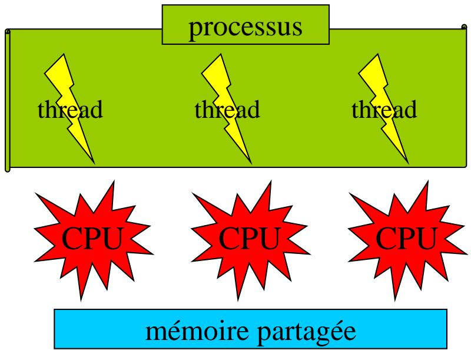</td>
    <td width="50%">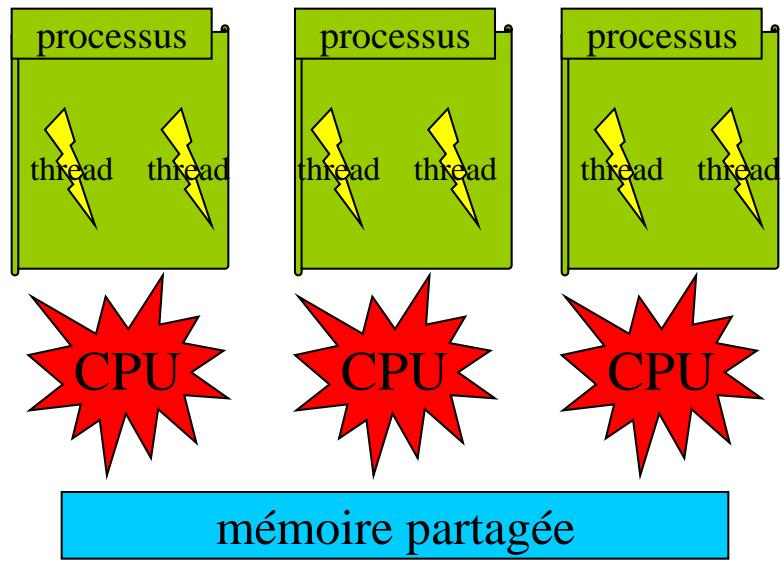</td>
  </tr>
</table>

### Systeme a memoire partagee (types) / 共享内存系统的类型

- SMP (Symmetric Multi-Processing). SMP（对称多处理）通常指多个相同处理器连接到同一物理内存的机器，规模一般较小。
- NUMA (Non-Uniform Memory Access). NUMA（非一致内存访问）则由多个处理器和多个内存银行组成，处理器可访问所有内存，但访问代价不一致。
- D'un point de vue systeme, l'OS presente souvent une memoire unique, dont la capacite apparente est la somme des memoires physiques. 从操作系统视角看，它们经常表现为一个统一地址空间。
- En pratique HPC moderne, les nœuds de calcul sont majoritairement NUMA ; le SMP strict sert surtout de modele simple pour l'introduction. 在现代 HPC 中，计算节点大多是 NUMA；“严格 SMP”更多是教学上更容易理解的参考模型。

### Hierarchie memoire / 内存层次

La grande difference entre SMP et NUMA est la hierarchie memoire. SMP 与 NUMA 的关键区别在于内存层次结构。

- SMP : tous les processeurs accedent a n'importe quelle case memoire avec un cout sensiblement uniforme. 在 SMP 中，所有处理器访问任意内存位置的时间大致一致。
- NUMA : le temps d'acces depend de l'emplacement des donnees. 在 NUMA 中，访问代价取决于数据放在哪里。
  - Acces rapide si les donnees resident dans le banc memoire local. 数据在本地内存银行时访问更快。
  - Acces plus lent si elles se trouvent dans un banc memoire distant. 数据在远端内存银行时访问更慢。
  - Certaines machines offrent meme plusieurs niveaux de localite. 某些机器还可能有多级局部性。

La politique d'allocation et l'affinite memoire influencent donc directement la latence et la bande passante observees. 因而，数据放置策略和内存亲和性会直接影响实际性能。

L'objectif general est de rapprocher les donnees des cœurs qui les utilisent et de limiter les acces memoire distants. 一般目标是让数据尽量靠近真正使用它的核心，减少远端访问。

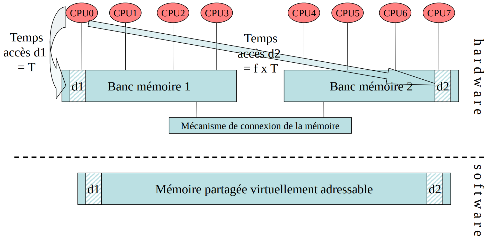

这张图强调了虚拟上共享、物理上分层的内存视图。

### Systeme a memoire distribuee / 分布式内存系统

Dans un systeme a memoire distribuee, les ressources de calcul ne partagent pas de memoire, ni physiquement ni logiquement. 分布式内存系统中，各个计算资源之间没有共享内存。

Sur les clusters HPC, les echanges passent par des reseaux rapides dedies, avec des latences de l'ordre de la microseconde et des debits pouvant atteindre des centaines de Gb/s selon les generations. 在 HPC 集群中，通信一般通过专用高速网络完成，延迟常在微秒量级，带宽则随代际可达数百 Gb/s。

Un nœud peut posseder plusieurs interfaces reseau ; le chemin emprunte influence alors la latence et le debit effectivement observes. 一个节点也可能配备多块网卡，具体走哪条路径会影响通信效果。

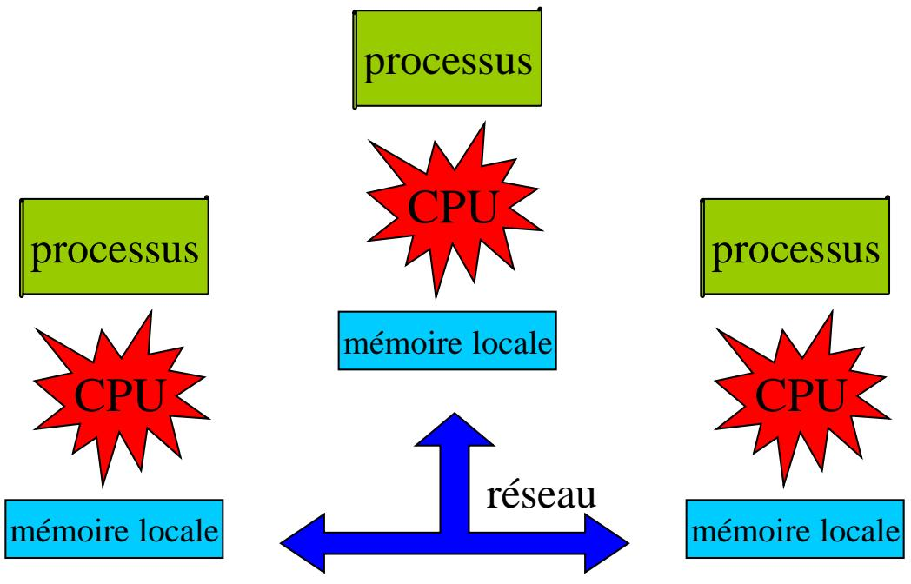

### Systemes hybrides / 混合系统

De nombreux systemes sont aujourd'hui hybrides : a l'interieur d'un nœud, on a de la memoire partagee ; entre nœuds, on retrouve un fonctionnement a memoire distribuee. 许多现代系统同时具备这两种特征：节点内共享内存，节点间分布式内存。

Une grappe, ou cluster, est ainsi un ensemble de nœuds interconnectes par un reseau. 集群就是多个节点通过网络互连形成的系统。

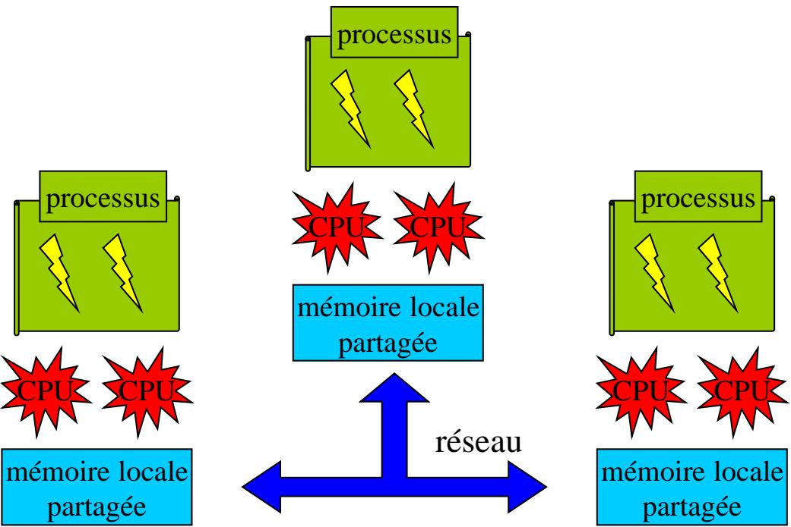

## Processus / 进程

Memoire 内存

Structures 结构

Un processus s'execute dans un espace d'adressage virtuel, qui contient typiquement le code, les donnees globales, le tas et la pile. 进程运行在自己的虚拟地址空间中，里面通常包含代码段、全局数据、堆和栈。

Cette representation est utile pour raisonner sur la localisation des donnees et sur le cout des acces memoire. 这种视图有助于分析数据位置和内存访问开销。

## Processus multithread / 多线程进程

<table>
  <tr>
    <td width="45%" valign="top">
      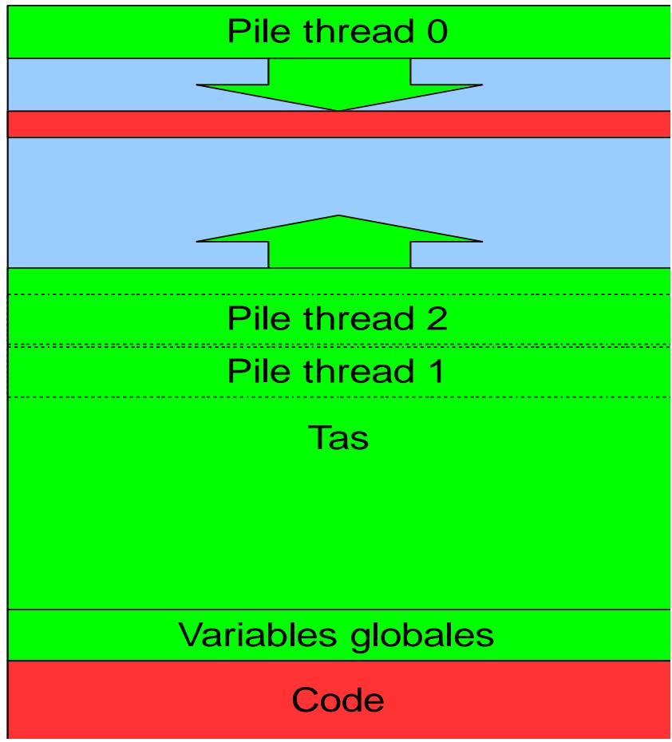
      Memoire 内存
    </td>
    <td width="55%" valign="top">
      <table>
        <tr>
          <td>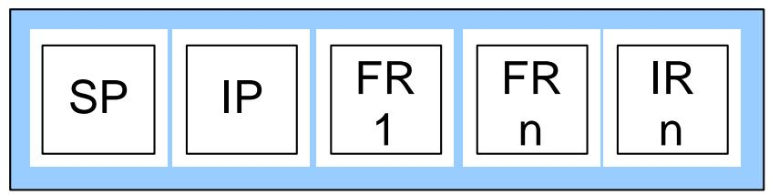 2 </td>
        </tr>
        <tr>
          <td>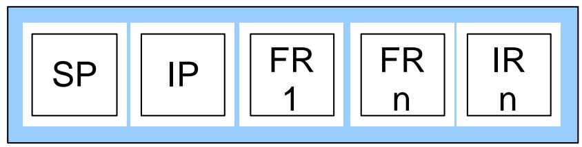 1 </td>
        </tr>
        <tr>
          <td>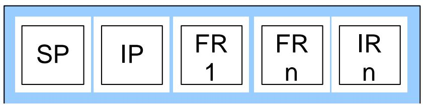 0 </td>
        </tr>
      </table>
      Structures 结构
    </td>
  </tr>
</table>

Dans un processus multithread, chaque thread possede sa propre pile, tandis que le tas et les donnees globales restent partages. 在多线程进程中，每个线程有自己的栈，而堆与全局数据区是共享的。

Cela signifie qu'une erreur memoire ou un acces concurrent non protege peut corrompre l'etat des autres threads et compliquer fortement le debogage. 这也意味着，内存越界或未保护的并发访问可能破坏其他线程状态，使调试更加困难。

En pratique, les traces de debug devraient au minimum contenir un identifiant de processus et un identifiant de thread. 在实践中，调试输出至少应包含进程标识和线程标识。

## Evolution des supercalculateurs / 超级计算机演进

La premiere grande revolution a ete celle des machines vectorielles. 第一场重大变革来自向量机。

- `1965 - ILLIAC IV` : projet marquant mais echec commercial. `1965 - ILLIAC IV` 是一个标志性项目，但商业上并不成功。
- `1976 - Cray 1` : succes commercial. `1976 - Cray 1` 则取得了商业成功。

Un calculateur vectoriel dispose d'unites fonctionnelles segmentees capables d'executer efficacement des operations complexes sur des vecteurs. 向量机依靠分段功能单元，对向量上的复杂运算进行高效处理。

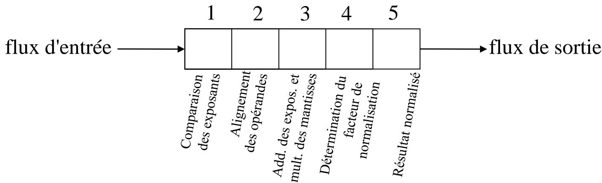

La deuxieme revolution correspond a l'apparition du parallelisme massif. 第二场变革是大规模并行的出现。

- Fin des annees 1980 et debut des annees 1990 : recul du vectoriel et apparition des microprocesseurs. 20 世纪 80 年代末到 90 年代初，向量机式微，微处理器崛起。
- Apparition d'experiences de parallelisme massif comme `Connection Machine` avec `65 536` processeurs. 出现了像 `Connection Machine` 这种拥有 `65 536` 处理器的大规模并行尝试。
- Developpement de systemes partages avec un nombre raisonnable de processeurs. 同时也出现了规模适中的共享内存系统。
- Developpement de systemes distribues avec de nombreux processeurs, mais sans memoire partagee. 以及大量无共享内存的分布式系统。
- Debut des annees 2000 : essor des architectures hybrides partagee/distribuee, d'abord autour de clusters SMP, puis de clusters NUMA. 到 21 世纪初，共享/分布式混合系统逐步成为主流。

## Evolution des supercalculateurs : tendance actuelle / 超级计算机的当前趋势

- Apparition des processeurs multicoeurs. 多核处理器成为主流。
- Les CPU generalistes embarquent de plus en plus de cœurs. 通用 CPU 集成的核心数量不断增多。
- La taille des nœuds NUMA augmente. NUMA 节点规模不断扩大。
  - Exemple CEA/DAM : `16` cœurs sur un nœud standard Tera10, puis `32/128` cœurs sur un nœud Tera100. 以 CEA/DAM 为例，Tera10 标准节点为 16 核，Tera100 节点则达到 32 或 128 核。
  - La memoire par cœur diminue souvent plus vite que le nombre de cœurs n'augmente. 每核内存常常没有跟着核心数同比增长。
  - Exemple : `3 Go/cœur` pour Tera10 contre `2 Go/cœur` pour Tera100. 例如 Tera10 约为每核 3GB，而 Tera100 下降到每核 2GB。

- Ordres de grandeur actuels : des grappes de plusieurs milliers de nœuds et des nœuds de plus de `100` cœurs. 当前数量级上，集群往往有数千节点，而单节点也可能超过 100 核。
- Contraintes d'ingenierie majeures : alimentation electrique, refroidissement souvent liquide, densite et masse des racks. 同时还要面对供电、冷却和机架密度等工程约束。
- Ces contraintes physiques guident autant les choix d'architecture que la recherche de performance brute. 因此体系结构设计不仅看算力，还受物理约束深刻影响。

## Pourquoi les processeurs multicores sont-ils apparus ? / 多核处理器为何出现？

- L'augmentation de la frequence des processeurs classiques a atteint des limites. 单纯提升频率的路线已经遇到瓶颈。
  - Le temps d'interconnexion entre transistors ne diminue plus assez avec la finesse de gravure. 晶体管互连延迟不再随着制程缩小而同步改善。
  - La consommation electrique et la dissipation thermique explosent. 功耗和散热问题迅速恶化。
  - La frequence memoire n'augmente pas au meme rythme que celle du processeur. 内存频率增长追不上处理器频率，内存墙问题加重。
  - Les caches aident, mais ne suffisent pas. 更大的缓存有帮助，但不足以解决根本问题。
- Les limites de l'ILP (Instruction Level Parallelism) apparaissent aussi. 指令级并行本身也存在极限。
  - Extraire toujours plus de parallelisme et reordonner davantage d'instructions devient rapidement trop complexe. 继续挖掘更多 ILP 需要付出极高的硬件复杂度。
- Il faut donc un saut technologique. 因而需要新的增长路径。
- A ne pas confondre avec l'hyper-threading, qui ameliore surtout l'utilisation des unites d'execution mais ne remplace pas la parallelisation explicite d'une application. 还要注意区分多核与超线程：后者主要提升执行单元利用率，不能替代真正的程序并行化。

## Processeurs multicores / 多核处理器

Un processeur multicore concentre plusieurs cœurs sur une meme puce, avec des mecanismes materiels pour gerer les caches et les acces memoire concurrents. 多核处理器会在同一芯片上集成多个核心，并通过硬件机制协调缓存和并发内存访问。

On peut y voir une sorte de nœud SMP miniaturise a l'echelle du processeur. 可以把它看作“缩到单芯片里的 SMP 节点”。

En theorie, un processeur `n`-cœurs serait `n` fois plus rapide qu'un monocœur a la meme frequence ; en pratique, les performances dependent de l'organisation des caches, des acces memoire et des communications entre cœurs. 理论上，`n` 核处理器应带来 `n` 倍加速；但实际性能很大程度取决于缓存结构、内存访问以及核心间通信。

## Intel / Intel

### New Mesh Interconnect Architecture / 新型网格互连架构

<table>
  <tr>
    <td width="45%" valign="top">
      Broadwell EX 24-core die
      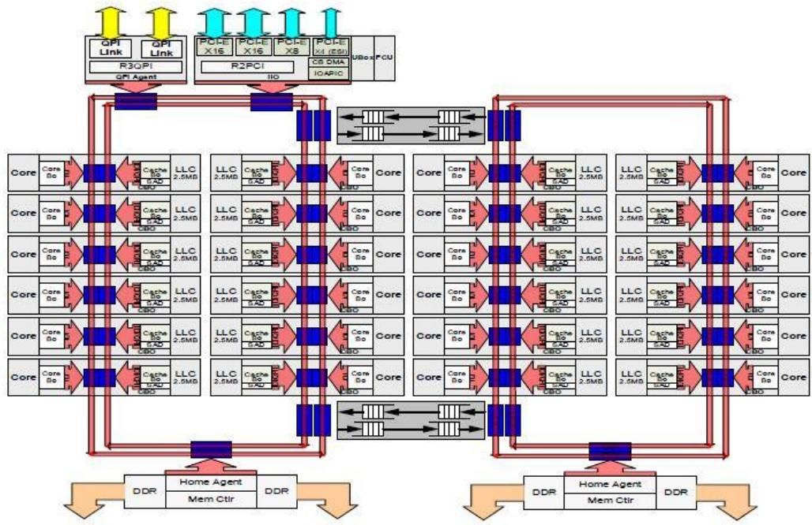
    </td>
    <td width="55%" valign="top">
      Skylake-SP 28-core die
      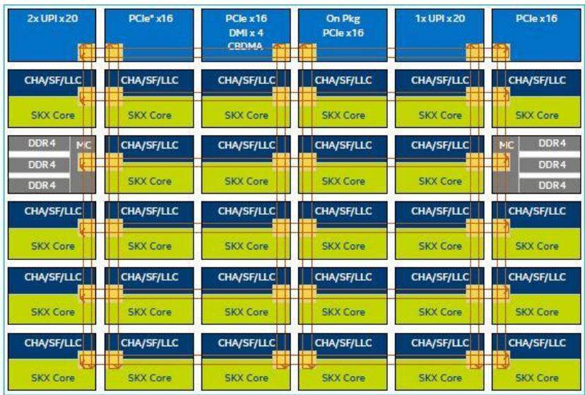
    </td>
  </tr>
</table>

`CHA` signifie `Caching and Home Agent`, `SF` signifie `Snoop Filter`, `LLC` designe le `Last Level Cache`, `SKX Core` le cœur serveur Skylake et `UPI` l'interconnexion `Intel UltraPath`. 图中的 `CHA`、`SF`、`LLC`、`SKX Core` 与 `UPI` 分别表示缓存与归属代理、嗅探过滤器、末级缓存、Skylake 服务器核心和 Intel UltraPath 互连。

## Intel KNL / Intel KNL

### Knights Landing Overview / Knights Landing 概览

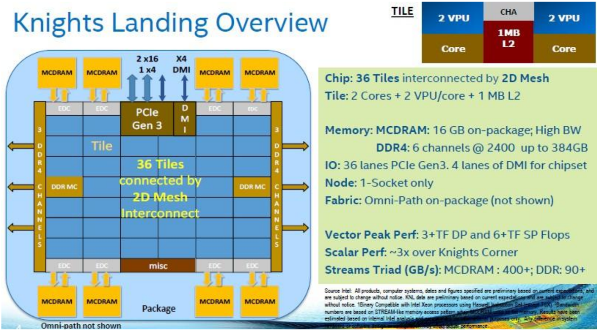

- Chip : `36` tiles interconnected by a 2D mesh. 整个芯片由 `36` 个 tile 通过二维网格互连。
- Tile : `2` cores, `2` VPU par cœur, `1 MB` de L2. 每个 tile 包含 `2` 个核心、每核 `2` 个 VPU 和 `1 MB` 二级缓存。
- Memory : `16 GB` de `MCDRAM` sur le package, a tres haute bande passante. 封装内集成 `16 GB` MCDRAM，高带宽。
- DDR4 : `6` canaux jusqu'a `384 GB`. 同时还有 `6` 通道 DDR4，最高约 `384 GB`。
- IO : `36` lignes PCIe Gen3 et `4` lignes DMI pour le chipset. I/O 侧提供 `36` 条 PCIe Gen3 和 `4` 条 DMI。
- Node : configuration mono-socket uniquement. 节点通常为单路。
- Fabric : Omni-Path sur le package. 互连方面可集成 Omni-Path。
- Vector peak : plus de `3 TFLOP/s` en double precision et plus de `6 TFLOP/s` en simple precision. 双精度峰值超过 `3 TFLOP/s`，单精度超过 `6 TFLOP/s`。
- Scalar performance : environ `3x` celle de Knights Corner. 标量性能约为 Knights Corner 的 `3` 倍。
- STREAM Triad : `400+ GB/s` pour la MCDRAM et `90+ GB/s` pour la DDR. 在 STREAM Triad 中，MCDRAM 可达 `400+ GB/s`，DDR 可达 `90+ GB/s`。

## ARM / ARM

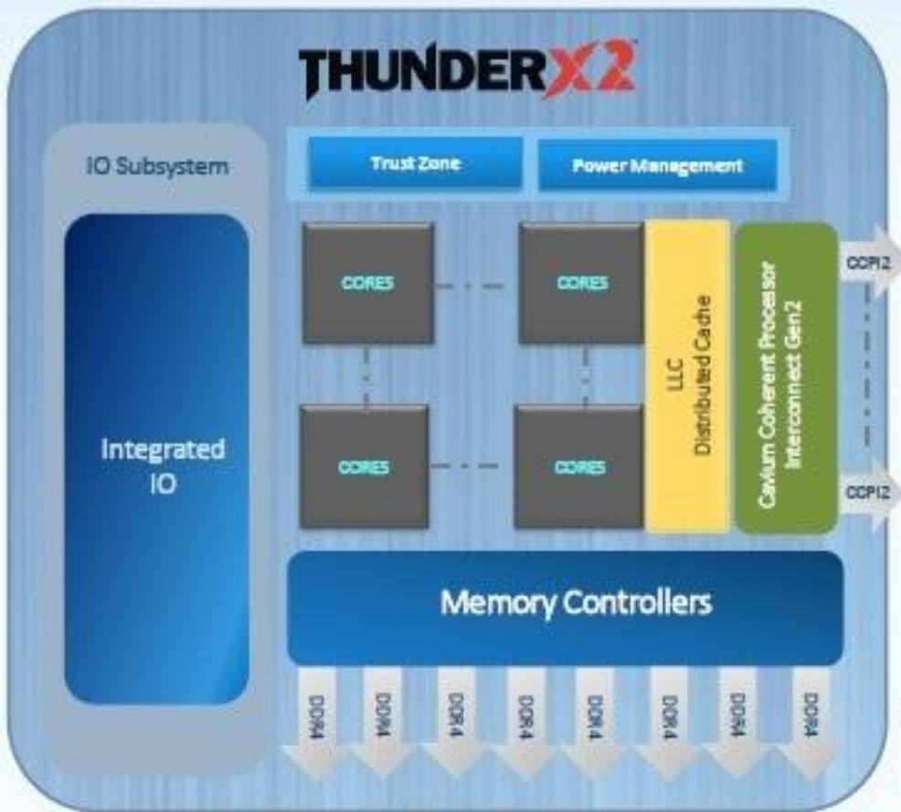

- `24/28/32` cœurs ARMv8 personnalises. 提供 `24/28/32` 个定制 ARMv8 核心。
- Execution completement out-of-order. 支持完全乱序执行。
- Configurations mono-socket et bi-socket. 支持单路和双路配置。
- Jusqu'a `8` controleurs memoire DDR4. 最多 `8` 个 DDR4 内存控制器。
- Jusqu'a `16` DIMM par socket. 每路最多 `16` 条 DIMM。
- Fonctionnalites serveur de type `RAS`. 提供服务器级 RAS 能力。
- Virtualisation de classe serveur. 具备服务器级虚拟化。
- IO integres et gestion energetique poussee. IO 集成度高，电源管理更完善。
- Les deuxiemes generations de SoC serveur ARM annoncent des gains de l'ordre de `2x` a `3x`. 第二代 ARM 服务器 SoC 常宣称约 `2` 到 `3` 倍的性能提升。

## Comment exploiter les processeurs multicores ? / 如何利用多核处理器？

Une application sequentielle n'exploite pas spontanement toute la puissance d'un processeur multicore, car elle ne s'execute effectivement que sur un seul cœur. 顺序程序不会自动吃满多核处理器的能力，因为它本质上仍然只在一个核心上推进。

Il faut donc porter les applications vers des versions paralleles. 所以，应用必须被改写或重构为并行版本。

- Les architectures processeur evoluent vers davantage de parallelisme. 处理器架构本身正变得越来越并行。
- Le gain de performance n'est plus gratuit. 性能提升不再是“白送的”。
- Il faut penser l'application des le depart en termes de parallelisme. 需要从设计阶段就用并行思维来看待程序。
- L'algorithme parallele qui passe bien a l'echelle peut etre different du meilleur algorithme sequentiel local. 能很好扩展的并行算法，往往与局部最优的顺序算法不同。
- Les couts de communication et de synchronisation doivent etre integres tres tot dans la conception. 通信与同步成本也应尽早纳入设计。

## Evolution des supercalculateurs : tendance actuelle (GPGPU) / GPGPU 趋势

- Apparition d'accelerateurs GPGPU (General Purpose computing on Graphics Processing Units). 通用 GPU 计算加速器开始进入 HPC 主流。
  - Leur rapport performance/consommation est souvent meilleur. 它们通常有更好的能效比。
  - Exemples : Tesla, Fermi chez Nvidia, ATI Stream chez AMD-ATI. 典型例子包括 Nvidia 的 Tesla、Fermi 以及 AMD-ATI 的 ATI Stream。
- L'architecture est fortement hierarchisee. GPU 架构的内存层次非常明显。
  - On y trouve de nombreux cœurs de type SIMD. 常见设计是大量 SIMD 风格核心。
- La programmation n'est pas triviale. 但这类设备并不容易编程。
  - On cherche souvent a exploiter une programmation tres vectorielle. 往往需要显式面向向量化和数据并行。
  - Chaque constructeur a longtemps pousse son propre langage : `CUDA` chez Nvidia, `CAL/IL` chez AMD-ATI. 厂商也曾长期推动各自私有语言，例如 Nvidia 的 `CUDA`、AMD-ATI 的 `CAL/IL`。
  - OpenCL 1.0 apparait comme tentative de langage unifie. 后来 `OpenCL 1.0` 试图成为统一方案。
- La carte est pilotee depuis une machine hote. GPU 一般由主机 CPU 驱动。
  - Les transferts de donnees entre memoire hote et memoire GPGPU restent couteux. 主机与 GPU 间的数据传输仍然代价明显。
  - Les kernels de calcul sont lances sur la carte acceleratrice. 计算内核则在加速卡上执行。

## Architecture NVidia / NVIDIA 架构

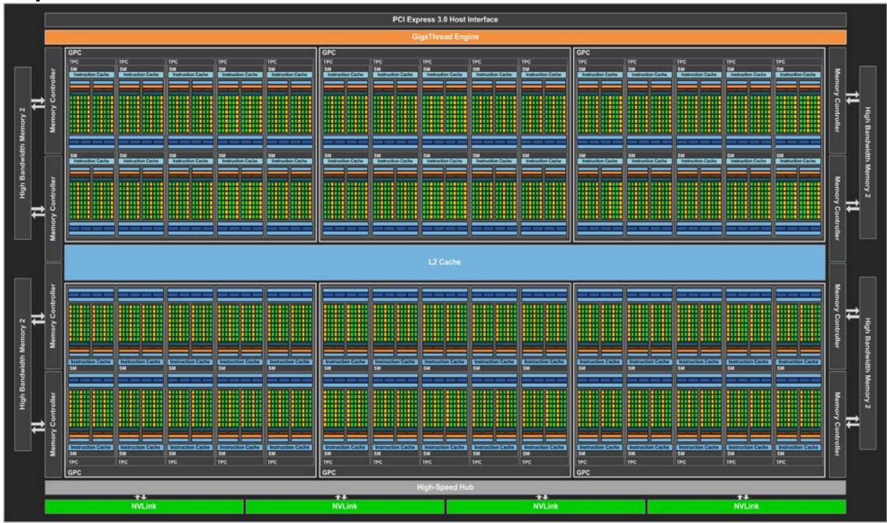
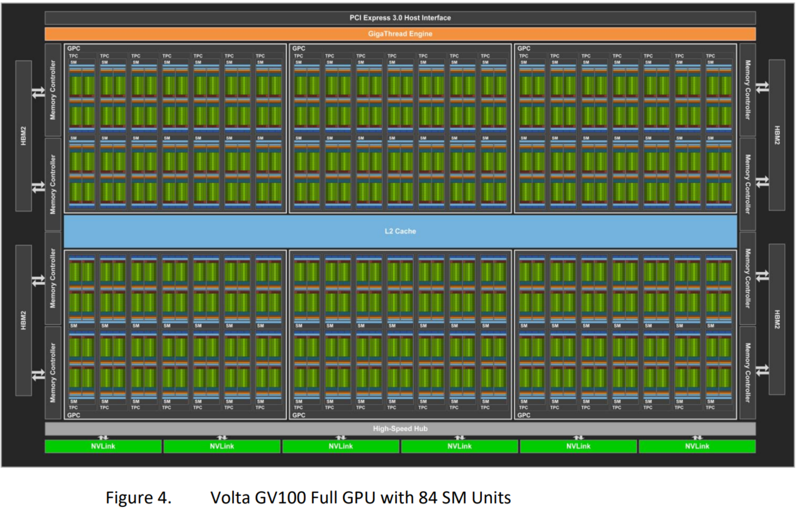

## Evolution des supercalculateurs : tendance actuelle (suite) / 当前趋势（续）

- Les supercalculateurs deviennent hybrides et heterogenes. 超级计算机正在走向混合化与异构化。
  - Certains nœuds embarquent uniquement des CPU multicoeurs generalistes. 有些节点只有多核 CPU。
  - D'autres combinent CPU et cartes acceleratrices GPGPU. 有些节点则组合 CPU 与 GPU 加速卡。
- Faire travailler efficacement CPU et GPGPU dans une meme application reste un vrai defi. 让同一个应用高效地同时利用 CPU 和 GPU，依然是开放挑战。
- On peut ainsi parler d'une troisieme revolution : multicœurs et hybridation. 因而可以把“多核化与混合化”视为第三次重要演进。

## Sierra / Sierra 系统架构概览

The Sierra system that will replace Sequoia features a GPU-accelerated architecture. 取代 Sequoia 的 Sierra 系统采用了 GPU 加速架构。

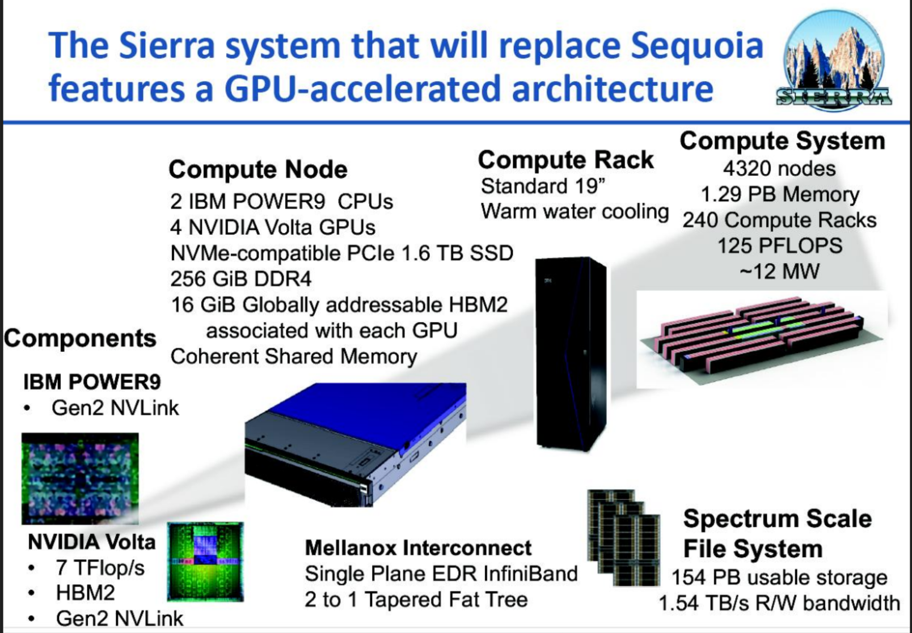

### Sierra system architecture details / Sierra 系统架构细节

| | Sierra | uSierra | rzSierra |
| --- | --- | --- | --- |
| Nodes | 4,320 | 684 | 54 |
| POWER9 processors per node | 2 | 2 | 2 |
| GV100 (Volta) GPUs per node | 4 | 4 | 4 |
| Node Peak (TFLOP/s) | 29.1 | 29.1 | 29.1 |
| System Peak (PFLOP/s) | 125 | 19.9 | 1.57 |
| Node Memory (GiB) | 320 (256+64) | 320 (256+64) | 320 (256+64) |
| System Memory (PiB) | 1.29 | 0.209 | 0.017 |
| Interconnect | 2x IB EDR | 2x IB EDR | 2x IB EDR |
| Off-Node Aggregate b/w (GB/s) | 45.5 | 45.5 | 45.5 |
| Compute racks | 240 | 38 | 3 |
| Network and Infrastructure racks | 13 | 4 | 0.5 |
| Storage Racks | 24 | 4 | 0.5 |
| Total racks | 277 | 46 | 4 |
| Peak Power (MW) | ~12 | ~1.8 | ~0.14 |

## Resume de la premiere partie / 第一部分小结

- Les architectures paralleles se distinguent d'abord par leur topologie memoire : partagee, distribuee ou hybride. 并行体系结构首先可以按内存拓扑划分为共享、分布式和混合。
- Le parallelisme est aujourd'hui present jusque dans le processeur lui-meme. 并行性已经深入到处理器内部。
- Les supercalculateurs actuels combinent multicœurs, accelerateurs et fortes contraintes d'energie et de refroidissement. 当代超级计算机往往同时面对多核、加速器以及能耗和冷却约束。
- Ecrire une application performante impose donc de penser parallelisme tres tot. 这意味着写程序时必须尽早考虑并行。

## Introduction a la programmation parallele / 并行编程导论

### Definitions / 定义

- Tache : travail a faire. 任务是需要完成的一项工作。
- Thread (ou flot d'execution) : implementation d'une tache, c'est-a-dire une suite logique sequentielle d'actions resultant de l'execution d'un programme. 线程（执行流）是任务的实现形式，本质上是一串按逻辑顺序推进的动作。
- Processus : instance d'un programme ; un processus peut contenir un ou plusieurs threads partageant un meme espace d'adressage. 进程是程序的一个运行实例，其中可以包含一个或多个共享地址空间的线程。
- Calcul parallele : decoupage d'un programme en plusieurs taches executees en meme temps pour reduire le temps global d'execution. 并行计算就是把程序切成多个可同时执行的任务，以缩短总执行时间。

### Qu'est-ce que le parallelisme ? / 什么是并行？

Le parallelisme est une idee ancienne pour resoudre plus vite un probleme long et couteux en temps de calcul. 并行的根本动机，是更快地解决那些本来耗时很长的问题。

Une solution naturelle consiste a utiliser plusieurs unites de traitement. 最直接的办法，是动用多个处理单元同时工作。

La difficulte n'est toutefois pas seulement materielle ; elle est aussi algorithmique. 但难点不仅在硬件，更在算法组织。

- Il faut respecter correctement les dependances entre taches. 必须正确处理任务之间的依赖。
- Il faut aussi que les unites de calcul aient du travail de maniere continue. 还要让各个处理单元尽量持续有活可做。
- Cela conduit aux problemes de distribution et d'equilibrage de charge. 这就引出了任务划分与负载均衡问题。

Dans beaucoup de simulations scientifiques, le parallelisme provient surtout d'un decoupage spatial des donnees ; le decoupage temporel est souvent plus limite a cause des dependances. 在很多科学计算里，并行性主要来自空间划分，而时间方向上的切分常因依赖关系受到限制。

### Programmation sequentielle et parallele / 顺序编程与并行编程

Programmation sequentielle : 顺序编程的特点是：

- Une suite ordonnee d'instructions executees pour resoudre le probleme. 为解决问题而按顺序执行一串指令。
- Une semantique sequentielle stricte : une instruction ne commence qu'une fois la precedente terminee. 语义上要求前一条结束后下一条才能开始。
- Un ordre total d'execution. 因而执行顺序是完全确定的。

Programmation parallele : 并行编程则意味着：

- Plusieurs flots d'execution. 同时存在多个执行流。
- Plusieurs instructions ou taches peuvent s'executer en meme temps. 多条指令或多个任务可以同时推进。
- L'existence de plusieurs processeurs ou cœurs. 通常依赖多个处理器或核心。
- La mise en evidence des dependances reelles entre instructions ou entre taches. 重点要识别真正存在的依赖关系。

On dira que `T2` depend de `T1` si `T2` a besoin du resultat produit par `T1`. 若 `T2` 需要 `T1` 的结果，那么就说 `T2` 依赖 `T1`。

Si deux taches ne dependent pas l'une de l'autre, elles peuvent etre executees dans n'importe quel ordre, voire simultanement. 若两项任务互不依赖，它们就可以任意调度，甚至并行执行。

### Graphe de dependance / 依赖图

Le graphe de dependance met en evidence les relations de dependance entre taches. 依赖图用于显式表示任务之间的依赖关系。

- `T1 -> T2` signifie que `T2` depend de `T1`. `T1 -> T2` 表示 `T2` 依赖 `T1`。
- La profondeur du graphe represente le degre de dependance. 图的深度体现依赖长度。
- Sa largeur represente au contraire l'independance exploitable, donc le parallelisme potentiel. 图的宽度则反映可利用的并行度。
- Dans un programme strictement sequentiel, la dependance est maximale et le parallelisme vaut `1`. 在纯顺序程序中，依赖最长，而并行度只有 `1`。

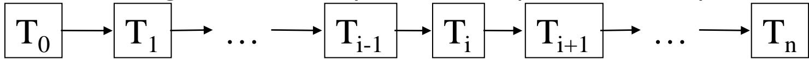

Exemple : avec `10` taches, on peut obtenir une dependance de `6` et un parallelisme de `2`. 例如对 `10` 个任务，图中示例对应的依赖深度约为 `6`，可见并行度约为 `2`。

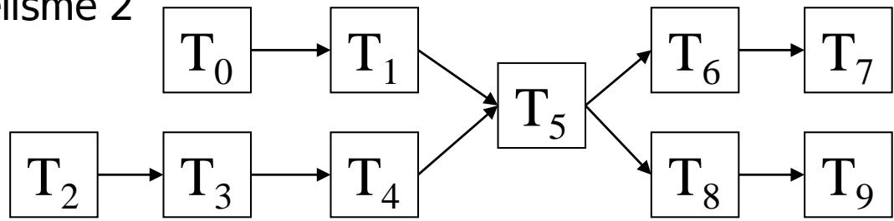

### Concurrence / 并发

L'execution des taches paralleles peut etre simultanee, alternee, ou melanger les deux comportements. 并行任务的执行既可能是真正同时运行，也可能是交替推进，或者两者混合。

- Simultanees. 同时执行。
- Alternees : une tache est interrompue puis reprise plus tard. 交替执行，即一项任务被打断后稍后继续。
- Combinaison des deux. 也可能两种情况同时存在。

Le probleme majeur est que plusieurs taches peuvent acceder aux memes donnees et les modifier. 最大问题在于多个任务可能同时访问并修改同一份数据。

On introduit alors des mecanismes de coherence, comme les verrous ou les exclusions mutuelles, pour proteger les sections critiques. 因此必须引入锁、互斥等机制来保护临界区。

### Communication / 通信

Pour conserver la coherence d'un calcul, les taches paralleles doivent souvent communiquer ou se synchroniser avant de poursuivre. 为了保证计算正确，任务之间往往需要通信或同步。

Ces rendez-vous sont appeles points de synchronisation. 这类“会合点”通常称为同步点。

- Synchronisation globale (collective). 全局同步，涉及所有任务。
- Synchronisation entre deux taches : communication point a point. 两任务之间的同步通常表现为点对点通信。
- En memoire distribuee, la communication est indispensable puisque les taches manipulent des espaces memoire distincts. 在分布式内存中，由于各任务拥有不同内存空间，通信是不可缺少的。

Le cout d'une synchronisation globale croit rapidement avec le nombre de taches ; il faut donc limiter les barrieres collectives au strict necessaire. 全局同步的代价会随着任务数快速上升，因此集合屏障应尽量少用。

Un bon equilibrage de charge reduit aussi les temps d'attente aux points de synchronisation. 良好的负载均衡还能减少任务在同步点上的空等。

En pratique, MPI est l'interface de reference pour exploiter efficacement les reseaux rapides en memoire distribuee. 在分布式内存实践中，MPI 是利用高速网络的参考接口。

### Types de parallelisme / 并行类型

On distingue classiquement trois grandes sources de parallelisme dans une application. 课程里通常把并行性来源概括为三大类。

- Parallelisme de controle (taches). 控制并行，也叫任务并行。
- Parallelisme de flux (pipeline). 流水并行。
- Parallelisme de donnees. 数据并行。

### Parallelisme de controle / 控制并行

L'idee generale est de faire plusieurs choses en meme temps. 核心思想是“同时做几件不同的事”。

Une application se compose souvent d'actions distinctes qu'on peut realiser en parallele, a condition de bien gerer leurs dependances. 只要依赖关系处理得当，应用中的许多动作都可以并行执行。

Le graphe de dependance permet justement d'extraire ce parallelisme en s'interessant a la largeur du graphe. 这类并行通常可以通过依赖图的“宽度”来分析。

En pratique, ce degre de parallelisme est souvent relativement faible et difficile a exploiter finement ; l'ILP des processeurs en est un bon exemple. 但这种并行度在现实中通常不算太高，挖掘起来也比较复杂；处理器中的 ILP 就是代表。

Ce type de parallelisme correspond bien a des modeles comme `MIMD` ou `MPMD`. 它常对应 `MIMD` 或 `MPMD` 这类模型。

### Parallelisme de flux / 流水并行

L'idee est de travailler a la chaine. 这里的思想更像“装配流水线”。

- Un flux de donnees similaire traverse une suite d'operations en cascade. 相似数据流依次经过多个串联阶段。
- Chaque ressource de calcul prend en charge une etape particuliere. 每个计算资源负责其中一个阶段。
- Le resultat produit a l'instant `T` par un etage est passe a l'etage suivant a `T+1`. 某一级在时刻 `T` 产生的结果，会在 `T+1` 交给下一级。
- La machine vectorielle est un exemple classique. 经典例子就是向量机。

Le degre de parallelisme depend ici de la profondeur du pipeline. 这种并行的上限取决于流水线深度。

Pour etre efficace, il faut souvent un flux de donnees suffisamment long et continu, de maniere a amortir les phases de chargement et d'eviter de vider puis recharger le pipeline. 为了高效，往往还要求数据流足够长、足够连续，从而摊销流水线装填成本。

### Parallelisme de donnees / 数据并行

Ici, l'idee est de repeter la meme action sur des donnees similaires. 数据并行的核心是“对很多相似数据重复同一类操作”。

- On partage d'abord les donnees plutot que les taches. 首先划分的是数据，而不是操作步骤。
- Le degre de parallelisme peut etre tres eleve, car il depend de la taille du jeu de donnees. 因为直接与数据规模相关，所以潜在并行度通常最高。
- Ce parallelisme correspond naturellement au modele `SPMD` (Single Program Multiple Data). 它与 `SPMD`（单程序多数据）模型天然契合。
- Tous les processeurs executent le meme programme, mais sur leurs propres donnees. 所有处理器运行同一程序，只是各自处理不同数据。

Ce modele est particulierement efficace pour les applications de calcul scientifique et, plus largement, pour les algorithmes intensifs. 这也是科学计算中最常见、最有效的一类并行。

### Paradigmes de la programmation parallele / 并行编程范式

Independamment du materiel, on distingue surtout deux grands modeles de programmation. 不管底层硬件如何，实践中主要有两种并行编程模型。

- Modele de programmation a memoire distribuee. 分布式内存编程模型。
- Modele de programmation a memoire partagee. 共享内存编程模型。

En theorie, chacun peut etre implemente sur des architectures diverses ; en pratique, les performances peuvent varier fortement selon l'adaptation entre modele et machine. 理论上，这两种模型都能在多种架构上实现；但模型和硬件是否匹配，会强烈影响性能。

## Modele de programmation a memoire distribuee / 分布式内存编程模型

Dans ce modele, les taches paralleles travaillent sur des memoires distinctes, invisibles les unes des autres. 在这种模型中，各个并行任务操作彼此不可见的独立内存。

- Les donnees sont reparties entre les taches. 数据分散在各个任务之间。
- Les communications inter-taches deviennent indispensables pour assurer la justesse du calcul. 因而任务之间必须通信，程序才可能正确。
- On parle de programmation par passage de messages. 这类编程通常就是消息传递。
- Ce modele est tres bien adapte au `SPMD`. 它尤其适合 `SPMD`。

### Implementation sur architecture a memoire distribuee / 在分布式内存机器上的实现

L'implementation y est naturelle : plusieurs processus possedent des espaces d'adressage separes et echangent via le reseau. 这类机器上最自然的实现就是多个进程各管各的内存，再通过网络交换消息。

### Implementation sur architecture a memoire partagee / 在共享内存机器上的实现

Le modele reste possible sur une machine partagee. 即便在共享内存机器上，也可以采用这种模型。

- Soit via plusieurs processus relies par des segments de memoire partagee. 一种做法是多个进程配合共享内存段。
- Soit via un processus multithread qui utilise sa memoire comme support d'echange. 也可以由一个多线程进程在共享内存里模拟消息交换。

### Bibliotheques / 相关库

- `PVM (Parallel Virtual Machine)` : une des premieres bibliotheques portables de message passing. `PVM` 是较早期的可移植消息传递库。
- `MPI (Message Passing Interface)` : le standard actuel, tres largement repandu. `MPI` 则是今天最主流的标准。

MPI fournit l'environnement d'execution, les communications point-a-point et collectives, ainsi que des mecanismes de groupes et de topologies. MPI 提供运行环境、点对点通信、集合通信以及进程组和拓扑机制。

Sur les reseaux rapides, les implementations MPI exploitent des chemins de communication optimises, comme l'OS bypass ou le RDMA selon le materiel, pour reduire la latence. 在高速网络上，MPI 实现会利用更优化的通信路径，例如 OS bypass 或按硬件支持的 RDMA，以尽量压低延迟。

Les aspects pratiques de l'initialisation, des envois/receptions et des modes de communication sont detailles dans le cours 2. 更具体的 MPI 实操细节，会在课程 2 中展开。

## Modele de programmation a memoire partagee / 共享内存编程模型

Dans ce modele, les taches paralleles voient une memoire commune. 共享内存模型里，各任务对同一份内存有共同视图。

- Avantage : les donnees sont accessibles directement sans message explicite. 优点是访问共享数据不需要显式消息传递。
- Difficultes : il faut gerer les acces concurrents aux memes ressources. 但难点也很明显，即必须处理并发访问。
- Les sections critiques reduisent vite le parallelisme utile. 临界区会迅速削弱有效并行度。
- La localite memoire et la hierarchie NUMA peuvent devenir moins visibles pour le programmeur. 与此同时，NUMA 局部性和内存层次常常更容易被忽略。

### Implementation sur architecture a memoire distribuee (suite) / 在分布式内存机器上的实现

L'implementation est plus difficile, car il faut donner l'illusion d'une memoire unique. 在分布式内存机器上实现共享内存语义更难，因为必须人为制造“统一内存”的错觉。

- `DSM (Distributed Shared Memory)` est une approche logicielle pour simuler cette memoire partagee. `DSM`（分布式共享内存）就是一种软件模拟方案。
- Mais son cout peut etre eleve et les acces distants deviennent peu visibles, donc plus delicats a maitriser. 代价往往较高，而且远端访问被抽象掉后，性能问题反而更难察觉。

### Implementation sur architecture a memoire partagee (suite) / 在共享内存机器上的实现

Ici, l'implementation est naturelle : dans un processus multithread, tous les threads accedent a la memoire du processus. 在真正的共享内存机器上，这种模型是最自然的，因为多线程本来就共享同一进程的内存。

### API et outils / API 与工具

- `POSIX PThread` : API standardisee pour manipuler explicitement les threads. `POSIX PThread` 是标准化的线程编程接口。
- `OpenMP` : directives de compilation pour exprimer le parallelisme plus declarativement. `OpenMP` 则通过编译指令更声明式地表达并行。
- On peut aussi rencontrer d'autres outils comme `TBB`, `Cilk++` ou `ABB`. 其他常见工具还包括 `TBB`、`Cilk++` 和 `ABB` 等。

## Resume / 总结

- Les machines paralleles se distinguent principalement par leur organisation memoire : partagee, distribuee ou hybride. 并行机器首先可以按内存组织分为共享、分布式和混合。
- Le parallelisme n'est pas seulement une propriete des supercalculateurs ; il est present jusque dans les processeurs modernes. 并行性不只存在于超级计算机，也深植于现代处理器内部。
- La programmation parallele repose sur l'analyse des dependances, de la concurrence, de la communication et de la synchronisation. 并行编程的核心，在于处理依赖、并发、通信与同步。
- On distingue classiquement trois sources de parallelisme : controle, flux et donnees. 常见并行来源有控制并行、流水并行和数据并行。
- Deux grands modeles dominent la pratique : memoire distribuee et memoire partagee. 实践中最重要的两类编程模型，是分布式内存和共享内存。
- Le modele `SPMD`, fonde sur le parallelisme de donnees, est particulierement central en HPC. 其中基于数据并行的 `SPMD` 模型，在 HPC 中尤其关键。
