# Programmation parallele et distribuee / 并行与分布式编程

## Cours 2 : Introduction a MPI et communications point-a-point / 课程 2：MPI 简介与点对点通信

### Auteurs / 作者

- Patrick Carribault
- David Dureau
- Marc Perange

作者：Patrick Carribault、David Dureau、Marc Perange（邮箱同上）。

## Plan du cours 2 / 课程 2 提纲

- Introduction a MPI MPI简介
- Premier exemple 首个示例
- Compilation et execution 编译与运行
- Fonctionnalites basiques 基础功能
- Communications point-a-point 点对点通信
- Principe de l'echange de messages 消息交换原理
- Fonctionnalites MPI MPI功能
- Notion de communication bloquante 阻塞通信概念

## Introduction a MPI / MPI简介

### Definitions / 定义

MPI : Message-Passing Interface. MPI：消息传递接口。

MPI est une API de haut niveau pour la programmation parallele, basee sur le paradigme d'echange de messages et implementee dans une bibliotheque. MPI是用于并行编程的高级API，基于消息交换范式并通过库实现。

Le terme "haut niveau" est relatif : compare a la programmation native des cartes reseau, MPI fournit une abstraction plus portable et plus productive. "高级"是相对概念：相较于网卡原生编程，MPI提供了更可移植、生产率更高的抽象层。

Utilisation par appels de fonctions et interfaces disponibles en C, C++ et Fortran. 通过函数调用使用，提供C、C++与Fortran接口。

### Processus / 进程

<table>
<tr>
<td>
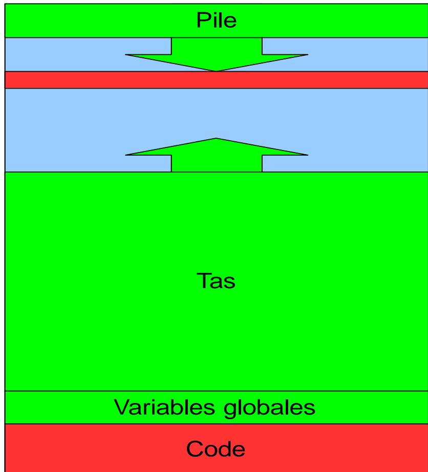 Mémoire
</td>
<td>
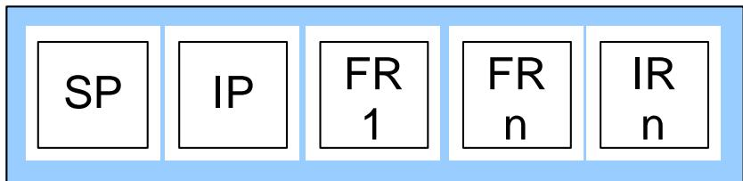 Structures
</td>
</tr>
</table>

Memoire et structures sont separees par processus. 每个进程的内存与数据结构相互独立。

Un processus MPI est un participant logique identifie par un rang ; selon l'implementation, il peut etre porte par un processus OS ou par des threads. MPI进程是由rank标识的逻辑执行参与者；按实现不同，它可以映射到OS进程，也可以映射到线程。

### Contexte / 背景

- MPI est adapte a la programmation parallele distribuee. MPI适合分布式并行编程。
- MPI est ne d'une collaboration entre universitaires et entreprises. MPI源于高校与企业的合作。
  - On etudiera ici MPI 1.3, mais la norme a continue d'evoluer (MPI 2, MPI 3, MPI 4 et revisions mineures). 本课程以MPI 1.3为主，但标准持续演进（MPI 2、MPI 3、MPI 4及其小版本更新）。
- MPI est tres repandu dans le calcul intensif et permet d'executer des taches paralleles sur des centaines voire milliers de processeurs. MPI在高性能计算中非常普遍，可在数百乃至上千处理器上执行并行任务。
  - Chaque constructeur implemente MPI de facon optimisee sur ses machines. 各硬件厂商会针对其平台优化MPI实现。

### Fonctionnalites MPI / MPI功能

MPI fournit l'environnement d'execution, les communications point-a-point, les communications collectives, les groupes de processus et topologies de processus. MPI提供运行环境、点对点通信、集合通信、进程组与进程拓扑。

MPI 2.0 ajoute les communications unidirectionnelles, la creation dynamique de processus, le multithreading et les E/S paralleles (MPI/IO). MPI 2.0增加单向通信、动态进程创建、多线程与并行I/O（MPI/IO）。

En pratique, certaines fonctionnalites avancees (notamment RMA et processus dynamiques) existent dans la norme mais leur usage performant depend fortement des implementations et des plateformes. 在实践中，部分高级能力（尤其RMA与动态进程）虽已标准化，但要高效使用仍强依赖具体实现与平台。

MPI comporte environ 120 fonctions en MPI 1 et plus de 200 en MPI 2. MPI 1约120个函数，MPI 2超过200个函数。

La maitrise des `communications point-a-point et collectives` suffit pour parallelliser efficacement la plupart des applications. 掌握点对点与集合通信即可高效并行化大多数应用。

### Pourquoi utiliser MPI ? / 为什么使用 MPI？

`Définitions MPI` : `MPI est une norme de passage de messages, implémentée par des bibliothèques (OpenMPI, MPICH), permettant la communication entre processus (ranks) en parallèle.` Exemple : MPI_Send/MPI_Recv entre deux processus.

`MPI定义`：`MPI是消息传递的规范，通过库（OpenMPI、MPICH）实现，允许进程间（ranks）并行通信。` 示例：MPI_Send/MPI_Recv用于两个进程间通信。

MPI est avant tout une interface presente sur tout type d'architecture parallele et supporte les parallelismes moderes a massifs. MPI首先是一种接口，几乎适用于所有并行架构，可支持中等到大规模并行。

Les constructeurs de machines et de reseaux rapides fournissent des bibliotheques MPI optimisees pour leurs plateformes. 硬件和高速网络厂商会提供针对平台优化的MPI库。

MPI est aussi disponible en open source sur la plupart des machines (MPICH2, OpenMPI). MPI也以开源形式提供，常见实现包括MPICH2和OpenMPI。

Sur les interconnexions rapides, les implementations MPI exploitent des chemins de communication optimises (par exemple OS bypass/RDMA selon le materiel) pour reduire la latence. 在高速互连上，MPI实现会利用优化通信路径（例如按硬件支持的OS bypass/RDMA）来降低延迟。

## Premier programme MPI / 第一个 MPI 程序

### Exemple minimal / 最小示例

```c
#include <stdio.h>
#include <mpi.h> // signatures des fonctions MPI

int main(int argc, char **argv) {
    MPI_Init(&argc, &argv); // initialisation de bibliothèque MPI
    printf("Hello!\n");
    MPI_Finalize(); // aucune fonction MPI après cet appel
    return 0;
}
```

Inclusion d'un fichier d'en-tete et notion de bibliotheque : toutes les fonctions MPI commencent par le prefixe MPI_. 引入头文件与库概念：所有MPI函数都以MPI_为前缀。

Aucun appel MPI avant MPI_Init et apres MPI_Finalize. 在MPI_Init之前和MPI_Finalize之后不能调用MPI函数。

### Compilation / 编译

Le processus de compilation est similaire a celui d'une bibliotheque classique, mais la commande depend de l'implementation. 编译流程与普通库类似，但具体命令依赖MPI实现。

Cas simple : utilisation d'un script comme mpicc. 简单情况：使用mpicc等脚本。

```bash
mpicc -o hello hello.c
```

Les options sont passees au compilateur par defaut et peuvent etre adaptees. 脚本会传递默认编译器选项，也可根据需要调整。

Ces wrappers encapsulent souvent une chaine de dependances importante (include, edition de liens, bibliotheques reseau/systeme), ce qui evite des erreurs de configuration manuelle. 这些wrapper（编译器包装器 / 启动器包装器）通常封装了一整条依赖链（头文件、链接参数、网络/系统库），可减少手工配置错误。

Cas complexe : ajout manuel des options (chemins d'en-tetes, bibliotheques, noms a l'edition de liens). 复杂情况：手动添加选项（头文件路径、库路径、链接库名）。

Attention : MPI standardise surtout l'API, pas une ABI commune entre implementations ; en pratique, changer d'implementation implique souvent une recompilation. 注意：MPI主要标准化的是API，而非跨实现通用ABI；实践中更换实现通常需要重新编译。

Exemple : utilisation d'une bibliotheque externe. 示例：使用外部库。

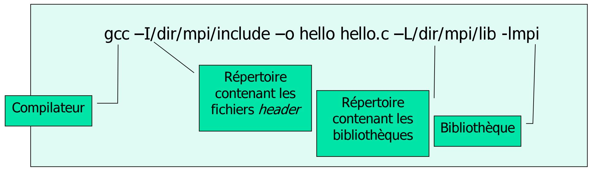

### Execution / 执行

La commande mpirun (ou mpiexec selon l'implementation) lance les processus. 使用mpirun（或mpiexec）启动多个进程。

```bash
mpirun -np 4 ./hello
```

```txt
Hello!
Hello!
Hello!
Hello!
```

Chaque processus s'execute independamment et l'ordre d'affichage n'est pas garanti. 每个进程独立运行，输出顺序不保证。

Selon les plateformes, la procedure de lancement peut varier (mpirun/mpiexec, gestionnaire de ressources, options d'environnement), d'ou l'importance de suivre les consignes locales. 不同平台的启动流程可能不同（mpirun/mpiexec、资源管理器、环境选项），因此应遵循本地环境规范。

### Communicateurs / 通信子

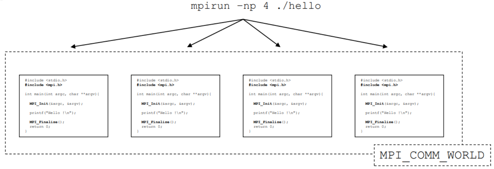

`mpirun -np 4 ./hello` -> 4 processus MPI (rangs 0..3) regroupes dans `MPI_COMM_WORLD`. `mpirun -np 4 ./hello` -> 启动4个MPI进程（rank 0..3），统一归入 `MPI_COMM_WORLD`。

- Regroupement par defaut : les processus crees appartiennent au communicateur predefini `MPI_COMM_WORLD`. 默认分组：创建的进程默认属于预定义通信子 `MPI_COMM_WORLD`。
- Definition : un communicateur = ensemble de processus + contexte de communication. 定义：通信子 = 进程集合 + 通信上下文。
- Type MPI : un communicateur est de type `MPI_Comm`. MPI类型：通信子的数据类型是 `MPI_Comm`。
- Remarque du cours : ici, nous n'utiliserons que `MPI_COMM_WORLD`. 课程说明：本课程只使用 `MPI_COMM_WORLD`。

### Nombre total de processus / 进程总数

```c
#include <stdio.h>
#include <mpi.h>

int main(int argc, char **argv) {
    int nproc;
    MPI_Init(&argc, &argv);
    MPI_Comm_size(MPI_COMM_WORLD, &nproc);
    printf("Nombre de processus = %d\n", nproc);
    MPI_Finalize();
    return 0;
}
```

```bash
mpirun –np 4 a.out
```

```txt
Nombre de processus = 4
Nombre de processus = 4
Nombre de processus = 4
Nombre de processus = 4
```

MPI_Comm_size renvoie dans `*size` la taille du communicateur `comm`. MPI_Comm_size将通信子大小写入*size。

Si comm == MPI_COMM_WORLD, cette taille est le nombre total de processus pouvant communiquer. 当comm为MPI_COMM_WORLD时，该大小就是可通信的总进程数。

Les fonctions MPI retournent un code d'etat (MPI_SUCCESS en cas de succes) ; verifier ces retours facilite le debogage. MPI函数都会返回状态码（成功时为MPI_SUCCESS）；检查返回值有助于调试。

### Rang d'un processus / 进程编号


Pour un communicateur donne, MPI associe a chaque processus un rang compris entre 0 et N-1. 在一个通信子中，每个进程会被赋予0到N-1之间的唯一编号。

Le numéro unique associé au processus s'appelle le rang du processus ; il est relatif au communicateur considéré. 进程的唯一编号称为进程号（rank），相对于特定通信子而言。

La fonction `MPI_Comm_rank` retourne le rang du processus `*rank` dans le
communicateur `comm` :

```c
int MPI_Comm_rank(MPI_Comm comm, int *rank);
```

```c
#include <stdio.h>
#include <mpi.h>

int main(int argc, char **argv) {
    int N, rang;
    MPI_Init(&argc, &argv);
    MPI_Comm_size(MPI_COMM_WORLD, &N);
    MPI_Comm_rank(MPI_COMM_WORLD, &rang);
    printf("Mon rang est %d sur %d\n", rang, N);
    MPI_Finalize();
    return 0;
}
```

```bash
mpirun -np 4 a.out
```

```txt
Mon rang est 1 sur 4
Mon rang est 0 sur 4
Mon rang est 3 sur 4
Mon rang est 2 sur 4
```

Le nombre de processus n'est pas forcement egal au nombre de processeurs disponibles. 进程数不一定等于可用处理器数量。

L'ordre d'execution n'est pas determine par les rangs : l'execution est parallele et simultanee. 执行顺序不由进程号决定，因为执行是并行且同时进行的。

La notion de rang est fondamentale pour le modele SPMD : chaque processus s'appuie sur son rang pour choisir les donnees a traiter. 进程号是SPMD模型的关键，每个进程根据自身编号确定处理的数据。

### Resume des communications / 通信小结

- MPI_Init et MPI_Finalize doivent etre respectivement la premiere et la derniere fonction MPI.
- MPI_COMM_WORLD designe l'ensemble des processus pouvant communiquer.
- La taille d'un communicateur est retournee par MPI_Comm_size.
- Le rang d'un processus est retourne par MPI_Comm_rank.

总结：MPI_Init/MPI_Finalize必须分别为第一和最后一个MPI调用；MPI_COMM_WORLD表示可通信的全部进程；MPI_Comm_size返回通信子大小；MPI_Comm_rank返回进程编号。

## Communications point-a-point / 点对点通信

### Echange de messages / 消息交换

Un message est caracterise par une tache expeditrice, une tache destinataire, des donnees a echanger et un protocole. 消息由发送任务、接收任务、待交换数据和通信协议构成。

L'expediteur envoie (send) et le destinataire recoit (recv). 发送方执行send，接收方执行recv。

Dans les contextes HPC a faible latence, le cout de communication depend fortement du chemin logiciel et materiel emprunte ; les bibliotheques MPI sont optimisees pour reduire ce cout. 在低延迟HPC场景中，通信开销高度依赖软硬件路径；MPI库会针对该开销进行优化。

### Principe general / 基本原理

Soient deux taches paralleles T0 et T1, chacune avec son propre espace d'adressage. 设有并行任务T0与T1，每个任务拥有独立地址空间。Chacune execute des instructions independantes de l'autre. 它们各自独立执行指令。

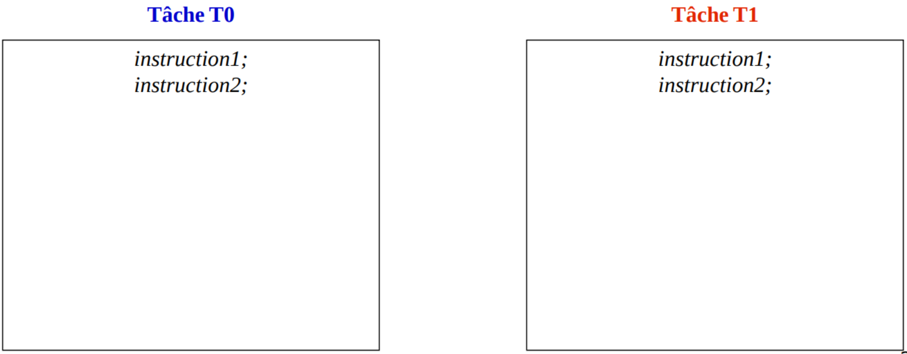

#### Etape 1 : T1 a besoin d'informations de T0 / 步骤 1：T1 需要 T0 的信息

T0 envoie des donnees (adr_send, nb_elt) a T1. T0向T1发送数据（adr_send, nb_elt）。

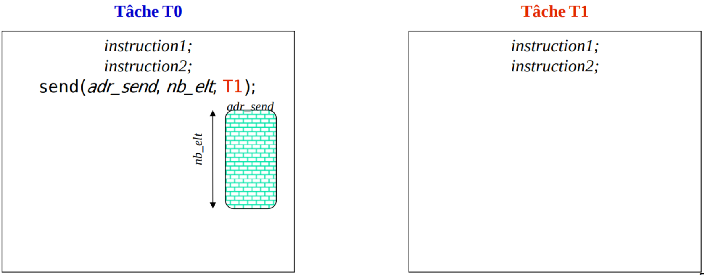

#### Etape 2 : T1 prepare la reception / 步骤 2：T1 准备接收

T1 doit connaitre la taille du message et preallouer une zone memoire (adr_recv). T1必须事先知道消息大小并预分配接收缓冲区（adr_recv）。

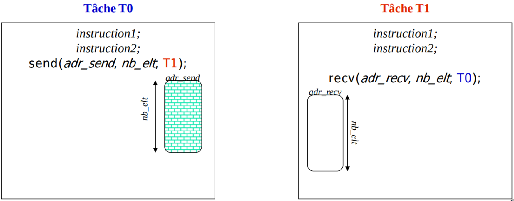

#### Etape 3 : Communication bloquante / 步骤 3：阻塞通信

Send bloque T0 tant que les donnees ne sont pas envoyees, et recv bloque T1 tant que toutes les donnees ne sont pas recues. send会阻塞T0直到数据发送完成，recv会阻塞T1直到所有数据接收完毕。

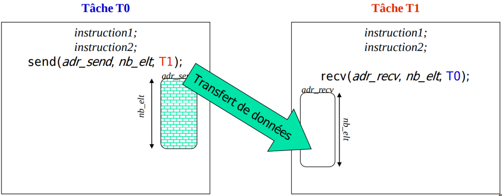

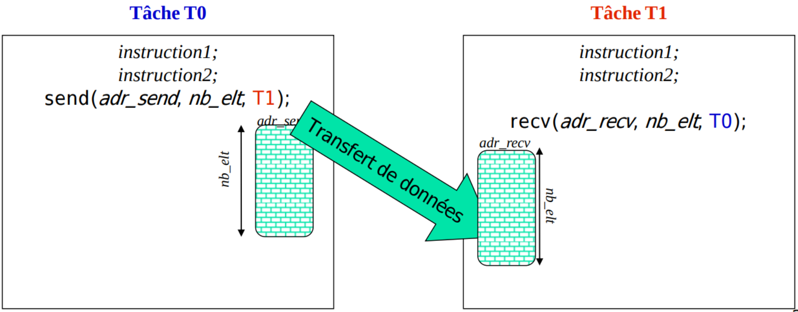

#### Etape 4 : Donnees recues / 步骤 4：数据已接收

T1 obtient une copie complete des donnees envoyees par T0. T1获得T0发送数据的完整副本。

Le transfert est par copie : T0 conserve ses propres donnees locales. 通信语义是“复制”：T0本地数据仍然保留，不会因发送而丢失。

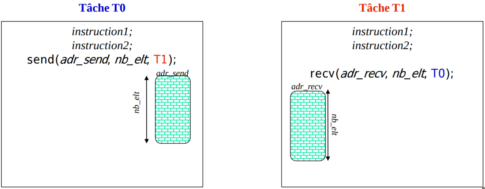

#### Etape 5 : Reprise de l'execution parallele / 步骤 5：恢复并行执行

Les deux taches reprennent leur execution parallele, et T1 peut utiliser adr_recv. 两任务继续并行执行，T1可使用adr_recv中的数据。

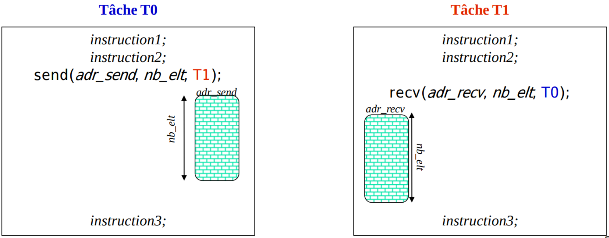

### Exemple : somme d'un tableau distribue (2 taches) / 示例：分布式数组求和（2 个任务）

Hypothese : tableau tab de N reels (N pair) distribue entre T0 et T1. T1 doit afficher la somme totale. 假设：长度为N（N为偶数）的实数数组tab分配给T0和T1，T1需要输出总和。

要计算的数据同时存在T0和T1的本地内存中，且两者各自独立。每个任务先计算自己部分的和，然后通过通信将结果合并。

But : T1 doit afficher la somme des N elements du tableau tab. T1需要输出数组N个元素的总和。

Code ? indice : calculer sa somme partielle, puis communiquer avec son voisin. 计算各自部分和，然后与邻居通信。

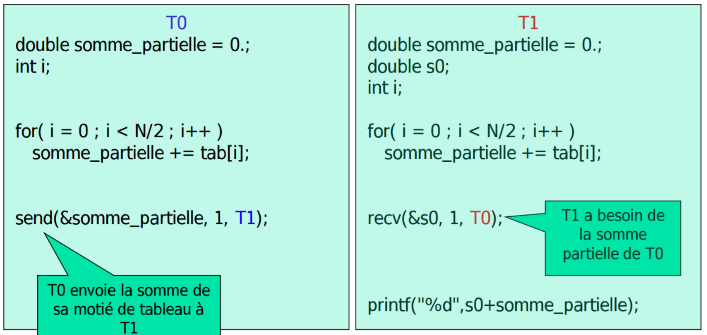

### Dualite envoi/reception / 发送与接收的对偶性

A chaque send correspond un recv (et reciproquement). On peut modeliser les communications par un graphe oriente. 每个send必须对应一个recv（反之亦然），可用有向图建模通信关系。

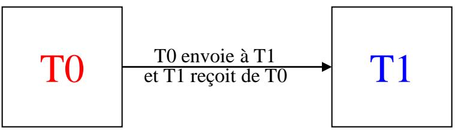

L'absence d'un envoi ou d'une reception bloque l'ensemble des taches paralleles. 缺失发送或接收会导致通信中相关节点的所有并行任务阻塞。

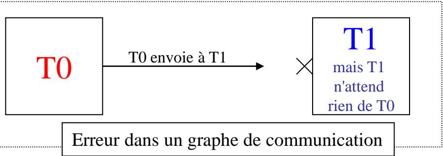

## Communication MPI / MPI 通信

### Fonction MPI_Send / MPI_Send 函数

Signature :

```c
int MPI_Send(
    void *buf,              // 待发送内存区域的起始地址
    int count,              // 一共发送多少个元素，不是多少字节
    MPI_Datatype datatype,  // 每个元素是什么类型，如 int / double
    int dest,               // 发给哪个进程（目标 rank）
    int tag,                // 这条消息的编号/标记，用来和接收端匹配
    MPI_Comm comm           // 在哪个通信子里发送，通常是 MPI_COMM_WORLD
);
```

Les 3 premiers arguments caractérisent le contenu du message à envoyer : `buf` indique l'adresse de début de la zone mémoire à envoyer, `count` indique combien d'éléments envoyer (pas en octets), et `datatype` indique le type de chaque élément (par exemple `int` ou `double`). 前3个参数描述了要发送消息的内容：`buf` 给出待发送内存区域的起始地址，若发送数组，通常就是首元素地址；`count` 表示发送多少个元素（不是字节数），`datatype` 表示每个元素的类型（例如 `int` 或 `double`）。

MPI_Send envoie un message du processus courant vers dest dans le communicateur comm. MPI_Send将当前进程的消息发送给comm中的dest。

`buf`: `buf` pointe vers une zone mémoire contenant `count` éléments de type `datatype` ; dans le cas d'un tableau C, on passe en pratique le plus souvent le tableau (qui décroit en pointeur) ou `&tab[0]`. `buf` 指向一段包含 `count` 个 `datatype` 元素的连续内存；在 C 的数组场景里，实际上传入的通常是数组名（退化为首元素指针）或 `&tab[0]`。

`datatype`: `datatype` est un type de données MPI prédéfini correspondant aux types C. MPI预定义了与C类型对应的基础类型。

| MPI_Datatype | Type C correspondant |
| --- | --- |
| MPI_CHAR | signed char |
| MPI_SHORT | signed short int |
| MPI_INT | signed int |
| MPI_LONG | signed long int |
| MPI_UNSIGNED_CHAR | unsigned char |
| MPI_UNSIGNED_SHORT | unsigned short int |
| MPI_UNSIGNED | unsigned int |
| MPI_UNSIGNED_LONG | unsigned long int |
| MPI_FLOAT | float |
| MPI_DOUBLE | double |
| MPI_LONG_DOUBLE | long double |
| MPI_BYTE | un octet |
| MPI_PACKED | paquet de donnees non contigues |

`comm`: Communicateur dans lequel a lieu l'echange de messages. Un communicateur definit a la fois un ensemble de processus autorises a communiquer entre eux et un contexte de communication. `MPI_COMM_WORLD` designe l'ensemble de tous les processus lances dans l'execution MPI ; dans la suite du cours, et dans la plupart des cas simples, on utilisera `MPI_COMM_WORLD`. `comm`：消息交换所在的通信子。通信子同时定义“哪些进程彼此可以通信”以及“这次通信属于哪个通信上下文”。`MPI_COMM_WORLD` 表示当前 MPI 程序启动的全部进程；在本课程后续和大多数基础示例中，通常使用 `MPI_COMM_WORLD`。

`dest`: Le rang `dest` est valide dans comm (0 <= dest < taille de comm pour MPI_COMM_WORLD). dest在comm内有效（对MPI_COMM_WORLD而言，0 <= dest < 进程总数）。

`tag`: Le tag participe a l'identification du message cote reception (avec source et communicateur) et sert a separer des flux logiques. tag在接收端与source和communicateur一起参与匹配，也可用于区分不同逻辑消息流。

Exemple de convention : si l'on veut encoder la paire `(src, dest)` dans un entier, on peut utiliser `tag = src * N + dest`, avec `src` = rang emetteur et `N` = nombre total de processus ; le produit par `N` evite les collisions entre couples differents. Cette convention ne distingue toutefois pas plusieurs types de messages entre le meme `src` et le meme `dest` : en pratique, on reserve souvent `tag` a la nature du message (par exemple `TAG_DATA`, `TAG_CTRL`), ou bien on encode aussi un type dans le tag.

标签约定示例：如果想把`(src, dest)`这对进程编号编码成一个整数，可以写成`tag = src * N + dest`，其中`src`是发送方rank，`N`是进程总数；乘以`N`是为了避免不同`(src, dest)`组合映射到同一个tag。但这种写法不能区分同一`src`到同一`dest`之间的多种消息；实践中更常把`tag`用于表示消息类型（例如`TAG_DATA`、`TAG_CTRL`），或者把消息类型也一起编码进tag。

Le tag est borne par l'implementation : en pratique, il faut respecter 0 <= tag <= MPI_TAG_UB ; un tag hors bornes peut provoquer une erreur et l'envoi n'est alors pas effectif. tag受实现上限约束：实践中需满足0 <= tag <= MPI_TAG_UB；越界时可能报错且消息不会真正发送。

Le parametre count est de type int dans MPI_Send ; pour des volumes tres grands, les versions recentes de MPI proposent des variantes a grand compteur. MPI_Send中的count类型是int；超大消息场景通常需要依赖较新标准中的大计数变体。

#### Remarques sur MPI_Send / 关于 MPI_Send 的几点说明

`MPI_Send` est bloquant du point de vue de l'emetteur : il bloque le processus appelant jusqu'a ce que la zone memoire `buf` puisse etre reutilisee en toute securite. `MPI_Send` 从发送方视角看是阻塞调用：调用它的进程会停在这行，直到 `buf` 这块内存可以被安全重用。

Deux cas classiques : 常见地可以分两种情况理解：

1. Petit message, ou bien tampon interne MPI disponible : les donnees peuvent d'abord etre copiees dans un tampon interne de MPI ; `MPI_Send` peut alors retourner meme si le recepteur n'a pas encore execute `MPI_Recv`. 小消息，或 MPI 有可用内部缓冲：数据可以先被复制到 MPI 的内部缓冲区里；这时 `MPI_Send` 即使在接收方还没有执行 `MPI_Recv` 时也可能返回。
2. Message volumineux, ou bien absence de tampon disponible : `MPI_Send` peut attendre qu'un `MPI_Recv` correspondant soit poste par le recepteur, voire qu'une phase de synchronisation ait lieu, avant de retourner. 大消息，或没有可用内部缓冲：`MPI_Send` 可能要等接收方发出匹配的 `MPI_Recv`，甚至先完成一轮同步后，才会返回。

Donc, un message envoye ne signifie pas necessairement qu'il a deja ete recu par l'application destinataire. 因此，“消息已发送”并不一定意味着“目标进程的应用代码已经接收到了这条消息”。

Si un meme emetteur envoie deux messages consecutifs vers un meme recepteur (meme communicateur), l'ordre de reception est preserve. 若同一发送者在同一通信子里连续向同一接收者发送两条消息，其接收顺序保持一致。

Entre emetteurs differents, l'ordre relatif d'arrivee ne doit pas etre suppose. 来自不同发送者的消息之间，相对到达顺序不可假设。

### Fonction MPI_Recv / MPI_Recv 函数

Signature :

```c
int MPI_Recv(
    void *buf,
    int count,
    MPI_Datatype datatype,
    int source,
    int tag,
    MPI_Comm comm,
    MPI_Status *status
);
```

buf est la zone memoire qui recevra le message, et doit etre allouee avant l'appel. buf是接收缓冲区，必须在调用前分配。

count est la taille maximale attendue (nombre d'elements), et la taille effective recue est <= count. count是期望的最大元素数，实际接收元素数不超过count。

source indique le rang de l'expediteur, ou MPI_ANY_SOURCE pour accepter n'importe quel emetteur. source表示发送者编号，也可用MPI_ANY_SOURCE接收任意发送者。

tag doit correspondre a celui du message envoye (ou MPI_ANY_TAG pour accepter n'importe quel tag). tag需与发送方一致（或MPI_ANY_TAG接收任意标签）。

Le datatype cote reception ne sert pas a identifier le message dans la file MPI ; il sert a interpreter/copier les donnees recues. 接收侧datatype不参与消息匹配定位；它用于解释并拷贝接收到的数据。

La coherence source/tag/comm entre envoi et reception est de la responsabilite de l'application. 发送与接收在source/tag/comm上的一致性由应用自己保证。

MPI copie les donnees sans verifier la semantique metier des types choisis de part et d'autre. MPI只负责拷贝，不会检查两端datatype在业务语义上是否一致。

status contient des informations sur le message recu. status返回消息的相关信息。

```c
struct MPI_Status {
    int MPI_SOURCE; // 接收到的消息来自哪个发送方；配合 MPI_ANY_SOURCE 时尤其有用
    int MPI_TAG;    // 接收到的消息使用的标签；配合 MPI_ANY_TAG 时尤其有用
    int MPI_ERROR;  // 错误码；通信出错时可用于报告错误状态
};
```

`source`和`tag`是接收条件，`status.MPI_SOURCE`和`status.MPI_TAG`是接收结果。

Si la taille du message n'est pas connue, on peut utiliser MPI_Get_count. 若未知消息大小，可使用MPI_Get_count获取。

```c
int MPI_Get_count(
    MPI_Status *status,    // MPI_Recv 返回的状态信息
    MPI_Datatype datatype, // 按什么元素类型来解释并统计消息长度
    int *count             // 输出参数：消息里一共有多少个 datatype 类型的元素
);
```

Si la taille effectivement envoyee depasse count, MPI signale une erreur de troncature et ne depasse pas la taille du buffer de reception. 若实际发送元素数大于count，MPI会报告截断错误，并且不会写出接收缓冲区上限。

Si la taille envoyee est inferieure a count, la reception reussit et la taille effective se lit via status/MPI_Get_count. 若实际发送元素数小于count，接收可成功完成，实际元素数可通过status/MPI_Get_count读取。

### Exemple MPI (2 taches) / MPI 示例（2 个任务）

```c
int main(int argc, char **argv) {
    double somme_partielle = 0.0, s0; /* 每个进程的部分和，以及从其他进程接收的部分和 */
    int i, rang; /* 循环变量与进程序号 */
    MPI_Status status; /* 用于接收操作的状态信息 */

    MPI_Init(&argc, &argv); /* 初始化 MPI 环境 */
    MPI_Comm_rank(MPI_COMM_WORLD, &rang); /* 获取当前进程序号 */

   for (i = rang * (N / 2); i < (rang + 1) * (N / 2); i++) { /* 每个进程计算一半数据的部分和（示例假设两进程） */
        somme_partielle += tab[i];
    }

    int tag = 1000; /* 消息标签，用于匹配发送与接收 */
    if (rang == 0) { /* 0 号进程发送自己的部分和 */
        MPI_Send(&somme_partielle, 1, MPI_DOUBLE, 1, tag, MPI_COMM_WORLD);
    } else { /* 1 号进程接收并合并后输出总和 */
        MPI_Recv(&s0, 1, MPI_DOUBLE, 0, tag, MPI_COMM_WORLD, &status);
        printf("Somme totale = %f\n", s0 + somme_partielle);
    }

    MPI_Finalize(); /* 结束 MPI 环境 */
    return 0;
}
```

Cet exemple suppose exactement 2 taches ; lance avec 3 taches ou plus sans adaptation, au moins un processus peut rester bloque indefiniment. 该示例默认恰好2个任务；若直接以3个及以上任务运行且不改代码，至少一个进程可能无限阻塞。

### Exemple MPI (p taches) / MPI 示例（p 个任务）

Chaque processus calcule une somme partielle sur N/P elements. 每个进程对N/P个元素求部分和。

```c
double som = 0.0; /* 当前进程的部分和 */
for (i = rang * (N / 2); i < (rang + 1) * (N / 2); i++){ /* 每个进程处理 N/P 个元素 */
    som += tab[i];
}

if (rang == 0) { /* 0 号进程负责汇总所有部分和 */
    for (t = 1; t < P; t++) { /* 接收其余进程的结果 */
        MPI_Recv(&s, 1, MPI_DOUBLE, MPI_ANY_SOURCE, MPI_ANY_TAG, MPI_COMM_WORLD, &sta);
        printf("Message recu de %d\n", sta.MPI_SOURCE);
        som += s; /* 累加到总和 */
    }
} else { /* 其余进程把自己的部分和发送给 0 号进程 */
    MPI_Send(&som, 1, MPI_DOUBLE, 0, rang, MPI_COMM_WORLD);
}
```

### Communications bloquantes / 阻塞通信

MPI_Send et MPI_Recv sont bloquants : attention aux blocages potentiels (deadlocks). MPI_Send与MPI_Recv为阻塞调用，需注意潜在死锁。

Sans message correspondant, une reception bloquante peut attendre indefiniment (pas de timeout automatique par defaut). 如果没有匹配消息，阻塞接收可能无限等待（默认没有自动超时保护）。

### Communication en anneau / 环形通信

Exemple d'anneau : chaque processus recoit de son voisin gauche puis envoie a son voisin droit. 环形通信示例：每个进程先从左邻居接收，再向右邻居发送。

```c
int gauche = (rang + P - 1) % P;
int droite = (rang + 1) % P;
int m = 0;

MPI_Recv(&m, 1, MPI_INT, gauche, tag1, MPI_COMM_WORLD, &sta);
MPI_Send(&m, 1, MPI_INT, droite, tag2, MPI_COMM_WORLD);
```

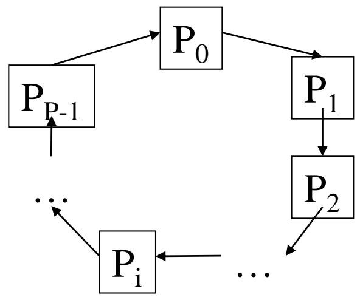

Dans cette organisation, chaque processus attend son voisin, ce qui peut mener a un deadlock. 这种组织中每个进程都在等待邻居，可能导致死锁。

Correction classique : introduire une dissymetrie (par exemple, rang 0 envoie d'abord, les autres recoivent d'abord puis envoient). 经典修正方式是打破对称（例如0号进程先发送，其他进程先接收再发送）。

Pour des echanges de voisinage en 2D/3D, un ordonnancement par coloriage (type damier) est souvent utilise pour eviter les interblocages. 在2D/3D邻域交换中，常用“棋盘式着色”调度发送/接收，以避免互锁。

### Resume / 总结

- Un message est caracterise par les rangs des taches expeditrice et destinataire, les donnees a echanger et un tag.
- Les envois et receptions doivent etre explicites, et chaque envoi doit correspondre a une reception.
- MPI_Send et MPI_Recv sont bloquants : attention aux deadlocks.
- Pour valider les cas limites de decomposition, tester avec 2, 3, 5 et 7 processus est une bonne base pratique.

总结：消息由发送/接收任务编号、数据与标签组成；发送与接收必须显式配对；MPI_Send/MPI_Recv是阻塞调用，需防止死锁；切分边界可优先用2、3、5、7进程做覆盖测试。
