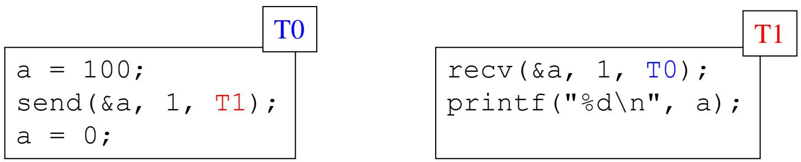
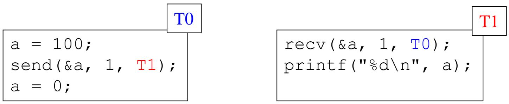
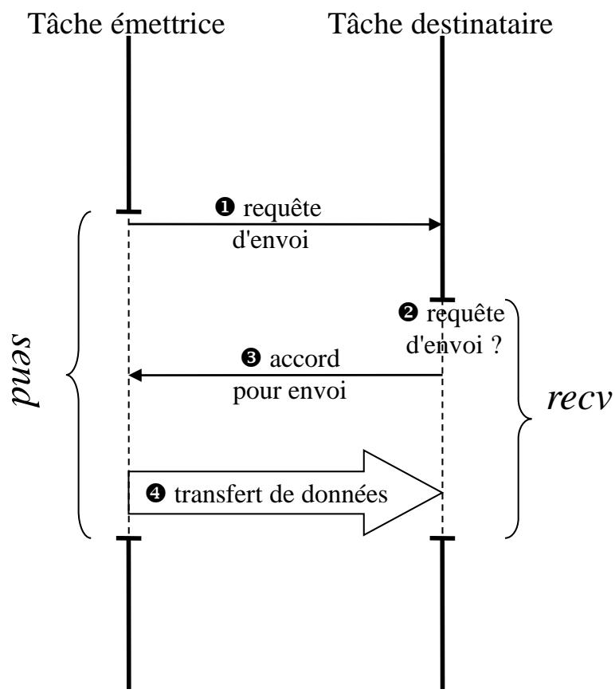
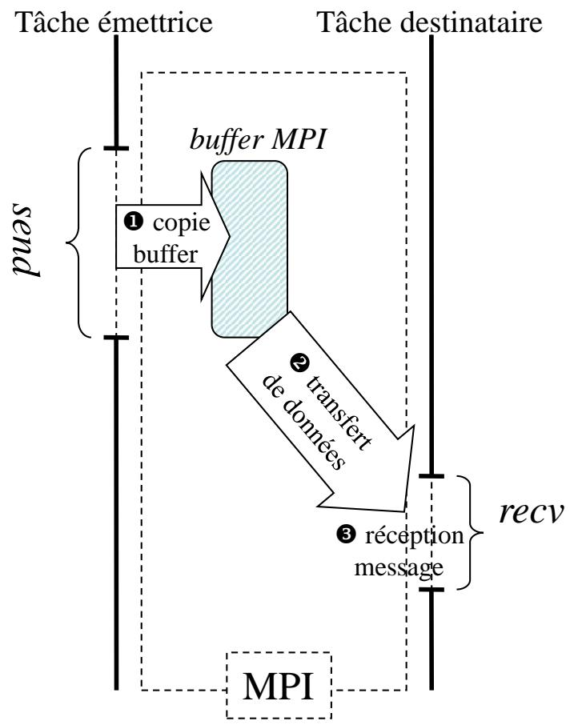
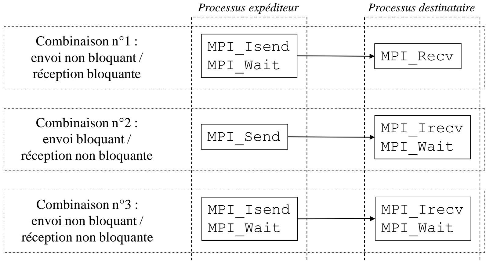

# Programmation parallele et distribuee / 并行与分布式编程

## Cours 3 : Communications point-a-point avancees / 课程 3：高级点对点通信

### Auteurs / 作者

- Patrick Carribault
- David Dureau
- Marc Perange

作者：Patrick Carribault、David Dureau、Marc Perange。

## Introduction / 简介

MPI offre des mecanismes de communications point-a-point bien plus performants que les "classiques" `MPI_Send` et `MPI_Recv`. MPI 提供的点对点通信机制比经典的 `MPI_Send` 和 `MPI_Recv` 更高效。

MPI permet a l'utilisateur de choisir : MPI允许用户选择：

- Parmi plusieurs protocoles de communications. 可在多种通信协议中选择。
- Les types d'appels d'envoi et de reception (bloquants ou non). 也可选择发送/接收调用类型（阻塞或非阻塞）。

MPI permet egalement de recevoir des messages sans que le destinataire connaisse a l'avance la taille du message. MPI 还能在接收方事先不知道消息大小的情况下完成接收。

## Plan du cours 3 / 课程 3 提纲

- Communications bloquantes 阻塞通信
- Mode synchrone 同步模式
- Mode bufferise 缓冲模式
- Mode standard 标准模式
- Communications non bloquantes 非阻塞通信
- Envoi/reception 发送与接收
- Couplage bloquant/non bloquant 阻塞与非阻塞的配合
- Recevoir un message de taille quelconque 接收任意大小消息

## Communications bloquantes / 阻塞通信

### Definition (envoi bloquant) / 定义（阻塞发送）

- Un envoi `send` est dit bloquant ssi, au retour du `send`, il est possible d'ecrire dans le buffer d'envoi sans alterer le contenu du message. 若一次 `send` 返回后即可安全改写发送缓冲区而不影响消息内容，则称其为阻塞发送。
- Un `send` bloquant ne rendra pas la main tant que la bibliotheque de communication n'aura pas gere le message et garanti la viabilite de son contenu. 阻塞发送会一直等待，直到通信库接管消息并保证其内容有效。

### Illustration de l'envoi bloquant / 阻塞发送示意



- Apres le `send`, T0 peut modifier le contenu de `a`. `send` 返回后，T0 可以修改 `a` 的内容。
- T1 recevra bien la valeur 100 (valeur de `a` lors de l'appel de T0 a `send`). T1 仍然会收到 100，也就是 T0 调用 `send` 时 `a` 的值。

Remarque : dire qu'un envoi est bloquant ne revient pas a dire que le message a ete recu par le destinataire. 注意：阻塞发送并不等于消息已经被接收方真正收到。

### Definition (reception bloquante) / 定义（阻塞接收）

- Une reception `recv` est bloquante ssi, au retour du `recv`, le buffer de reception contient bien le contenu du message. 若一次 `recv` 返回时接收缓冲区已经包含完整消息内容，则称其为阻塞接收。

La fonction `recv` bloquera tant qu'elle n'aura pas recu et affecte le contenu du message. `recv` 会一直阻塞，直到消息被接收并写入缓冲区。

### Illustration de la reception bloquante / 阻塞接收示意



- Apres le `send`, T0 peut modifier le contenu de `a`. `send` 返回后，T0 可以修改 `a`。
- Apres le `recv`, le contenu du message peut etre manipule (lecture, ecriture, affichage, ...). `recv` 返回后，消息内容就可以立即进行读取、写入、显示等操作。

## Modes de communications / 通信模式

### Modes de communications bloquantes / 阻塞通信模式

- Mode synchrone 同步模式
- Mode bufferise 缓冲模式
- Mode standard 标准模式

## Communication synchrone / 同步通信

### Definition du mode synchrone / 同步模式定义

- Un envoi synchrone bloquant rendra la main quand le message aura ete recu par le destinataire. 同步阻塞发送只有在接收方已经收到消息后才返回。

### Implementation du mode synchrone / 同步模式实现思路

Besoin de synchroniser l'emetteur et le recepteur. 需要让发送方与接收方先完成同步。

- Mise en place d'un protocole pour le transfert des donnees. 需要借助一套协议来组织数据传输。

### Protocole de communication synchrone / 同步通信协议

<table>
  <tr>
    <td width="42%" valign="top">
      
    </td>
    <td width="58%" valign="top">
      <ol>
        <li>L'expediteur envoie une requete d'envoi et attend une reponse. 发送方先发出发送请求并等待回应。</li>
        <li>Le destinataire attend la requete d'envoi de l'expediteur. 接收方等待来自发送方的发送请求。</li>
        <li>Le destinataire repond en accordant l'envoi. 接收方回复确认，允许发送继续。</li>
        <li>L'expediteur et le destinataire sont synchronises, puis les donnees sont transferees. 双方完成同步后，再开始真正的数据传输。</li>
      </ol>
    </td>
  </tr>
</table>

### Avantages du mode synchrone / 同步模式优点

- Pas de copie dans un buffer interne. 不需要先复制到内部缓冲区。
- Echange de message par mecanismes directs d'acces distants a la memoire d'autres processus (DMA ou RDMA). 可借助 DMA 或 RDMA 等机制直接访问远程内存完成传输。

### Inconvenients du mode synchrone / 同步模式缺点

- Impose un rendez-vous entre l'emetteur et le recepteur. 要求发送方和接收方会合。
- Attente potentiellement inutile. 因而可能引入不必要的等待。

### Cas optimal du mode synchrone / 同步模式适用场景

- Utilisation dans le cas ou l'envoi et la reception sont appelees en meme temps. 适用于发送与接收几乎同时发生的情况。

- Exemple : exploitation d'un parallelisme de donnees avec charge equilibree entre les taches. 例如在负载均衡的数据并行程序中就很常见。

### MPI / MPI 接口

```c
int MPI_Ssend(
    void *buf,
    int count,
    MPI_Datatype datatype,
    int dest,
    int tag,
    MPI_Comm comm
);
```

- La signature est la meme que `MPI_Send`. 它的函数签名与 `MPI_Send` 相同。
- On force l'utilisation du mode synchrone d'echange de message. 该调用强制使用同步消息传输模式。
- Reception avec la fonction `MPI_Recv`. 接收端仍然使用 `MPI_Recv`。

## Communication bufferisee / 缓冲通信

### Definition du mode bufferise / 缓冲模式定义

- Un envoi bufferise bloquant rendra la main quand le message aura ete copie dans un buffer gere par la bibliotheque de communication. 缓冲阻塞发送会在消息被复制到通信库管理的缓冲区之后返回。

### Protocole de communication bufferisee / 缓冲通信协议

<table>
  <tr>
    <td width="42%" valign="top">
      
    </td>
    <td width="58%" valign="top">
      <ol>
        <li>L'expediteur copie le message dans un buffer gere par la bibliotheque de communication. 发送方先把消息复制到通信库管理的缓冲区中。</li>
        <li>La bibliotheque s'approprie le message et peut l'envoyer au destinataire. 随后由通信库接管该消息，并在合适时机发送给接收方。</li>
        <li>Le destinataire recoit le message des que possible. 接收方则会在条件允许时尽快收到消息。</li>
      </ol>
    </td>
  </tr>
</table>

### Avantages du mode bufferise / 缓冲模式优点

- Decouplage entre le `send` et le `recv` : le `send` peut retourner avant que le `recv` ait ete poste. `send` 与 `recv` 被解耦，`send` 可以在接收端尚未发出 `recv` 时就先返回。

### Inconvenients du mode bufferise / 缓冲模式缺点

- Copie dans un buffer (surcout CPU + surcout memoire et bande passante). 需要额外拷贝，因此会增加 CPU、内存和带宽开销。
- Taille limitee. 缓冲区容量也是有限的。

### Cas optimal du mode bufferise / 缓冲模式适用场景

- Les envois et les receptions ne sont pas bien synchronises (desequilibrage de charge). 适合发送与接收不同步、存在负载不均衡的情况。

## Allocation du buffer / 缓冲区分配

L'utilisateur peut remplacer le buffer MPI par son propre buffer alloue dans son espace d'adressage. 用户可以使用自己在进程地址空间中分配的缓冲区来替代 MPI 默认使用的缓冲区。

- Attachment d'un buffer `buf` (alloue par l'utilisateur) de taille `sz` octets. 可以附加一个由用户分配、大小为 `sz` 字节的缓冲区 `buf`。
- Detachement d'un buffer : retourne l'adresse du buffer ainsi que sa taille. 也可以分离缓冲区，并取回它的地址和大小。

```c
int MPI_Buffer_attach(void *buf, int sz);
int MPI_Buffer_detach(void **buf_adr, int *sz);
```

以上是附加与分离缓冲区的函数原型。

```c
#define BUFFSIZE 100000
int sz;
char *buf;
MPI_Buffer_attach(malloc(BUFFSIZE), BUFFSIZE);
MPI_Bsend(msg1, ...);
MPI_Bsend(msg2, ...);
MPI_Buffer_detach(&buf, &sz);
free(buf);
```

- Le buffer utilise n'est utilise que pour `MPI_Bsend`. 这个附加的缓冲区只会被 `MPI_Bsend` 使用。
- Ne pas confondre buffer MPI et buffer d'envoi. 不要把 MPI 缓冲区和应用自己的发送缓冲区混为一谈。
- Un seul buffer ne peut etre attache a la fois. 同一时刻只能附加一个缓冲区。
- Il est inutile que le destinataire attache un buffer. 接收方通常不需要附加缓冲区。
- Le detachement/liberation d'un buffer attache doit etre fait uniquement quand aucun message `MPI_Bsend` ne peut encore etre en vol. 只有在确认不存在仍在传输中的 `MPI_Bsend` 消息时，才能安全分离或释放该缓冲区。

## Communication standard / 标准通信

### Fonction pour une communication standard / 标准通信函数

`MPI_Send`. 标准通信最常用的函数就是 `MPI_Send`。

### Protocole pour un envoi standard / 标准发送协议

MPI utilise souvent un seuil interne de taille, note ici `T` a titre explicatif (on peut le voir comme une frontiere entre petit message et grand message). MPI 通常内部会使用一个消息大小阈值，这里记作 `T`，仅用于说明（可理解为“小消息/大消息”的分界线）。

Si le message a envoyer est de taille inferieure a `T`, l'envoi est alors bufferise. 如果消息小于 `T`，则通常采用缓冲模式。

Si le message a envoyer est de taille superieure a `T`, l'envoi est alors synchronise. 如果消息大于 `T`，则通常采用同步模式。

En pratique, le seuil `T` depend de l'implementation MPI, du transport sous-jacent, du reseau/interconnexion, du fait que la communication soit intra-nœud ou inter-nœud, et parfois de parametres d'environnement ou de reglages runtime ; il est donc generalement choisi ou ajuste automatiquement par l'implementation (ordre de grandeur souvent observe : quelques dizaines de Ko, par exemple ~32-64 Ko). 实际上阈值 `T` 会受到 MPI 实现、底层传输、网络互连、是否同节点通信以及某些环境变量或运行时配置的影响，因此通常由实现自动选择或调整（常见数量级往往是几十 KB，例如约 32-64 KB）。

Un meme code peut donc sembler correct pour de petites tailles puis bloquer pour de plus grandes tailles a cause d'un changement de protocole. 因此同一段代码可能在小消息下运行正常，而在大消息下因协议切换而发生阻塞。

Les tags doivent rester dans l'intervalle autorise `[0, MPI_TAG_UB]` ; hors bornes, l'appel peut echouer et le message ne pas etre emis. `tag` 必须落在允许区间 `[0, MPI_TAG_UB]` 内；若越界，调用可能失败，消息也不会真正发出。

### Exemple de communication standard / 标准通信示例

Situation consideree : on lance deux processus qui veulent s'echanger mutuellement un message. Chacun commence par appeler `MPI_Send` vers son voisin, puis n'executera `MPI_Recv` qu'apres le retour de cet envoi. 设想这样一个场景：启动两个进程，它们想互相交换一条消息。双方都先对邻居执行 `MPI_Send`，只有在发送调用返回之后才会继续执行 `MPI_Recv`。

Le point delicat est que ce schema peut sembler fonctionner avec de petits messages, puis se bloquer avec des messages plus gros si le protocole interne change. 这里的关键在于：同一段代码在小消息时可能看起来“没问题”，但在大消息下如果内部协议切换，就可能出现阻塞甚至死锁。

```c
if (rang == 0)
    voisin = 1;
else if (rang == 1)
    voisin = 0;
MPI_Send(&msg1, N, MPI_BYTE, voisin, tag1, comm);
MPI_Recv(&msg2, N, MPI_BYTE, voisin, tag2, comm);
```

Ce code est-il sur ? 这段代码安全吗？

- NON : si la taille du message `N` est petite, le programme se deroulera sans probleme. 不一定安全：如果消息大小 `N` 很小，程序可能看起来运行正常。
- Sinon le programme bloquera (`deadlock`) car l'envoi sera synchronise. 但当 `N` 较大时，发送可能转为同步模式，从而导致死锁。

### Detection des problemes / 问题检测

- Remplacer tous les appels a `MPI_Send` par `MPI_Ssend`. 可把所有 `MPI_Send` 临时替换成 `MPI_Ssend` 来暴露问题。
- Peu importe la taille du message, le programme ne doit pas bloquer. 无论消息大小如何，正确程序都不应因此阻塞。
- Si le programme bloque, il y a un bug. 如果程序因此卡住，就说明通信逻辑里存在 bug。

## Communications non bloquantes / 非阻塞通信

### Definition des communications non bloquantes / 非阻塞通信定义

- Une communication est dite non bloquante ssi, au retour de la fonction, la bibliotheque de communication ne garantit pas que l'echange de message ait eu lieu. 若函数返回时通信库还不保证消息交换已经完成，则该通信称为非阻塞通信。

L'acces sur aux donnees n'est donc pas garanti apres une communication non bloquante. 因此在非阻塞调用返回后，相关数据还不能被认为是安全可访问的。

Pour pouvoir reutiliser les donnees du message, il faudra appeler une fonction supplementaire qui complettera le message. 若想重新使用消息数据，还需要再调用一个“完成”函数来确认通信结束。

Tant que la requete n'est pas terminee, il faut considerer le buffer associe comme non reutilisable (pas d'ecriture cote envoi, pas de lecture valide cote reception). 只要请求尚未完成，就必须把对应缓冲区视为不可复用：发送侧不能改写，接收侧也不能把数据当作已经准备好来读取。

### Envoi non bloquant : MPI_Isend / 非阻塞发送：MPI_Isend

```c
int MPI_Isend(
    void *buf,
    int count,
    MPI_Datatype datatype,
    int dest,
    int tag,
    MPI_Comm comm,
    MPI_Request *req
);
```

La signature de `MPI_Isend` est presque la meme que celle de `MPI_Send`, avec un parametre supplementaire : `MPI_Request *req`. `MPI_Isend` 的参数和 `MPI_Send` 基本相同，只多了一个参数 `MPI_Request *req`。

Ce parametre `req` sert a representer la requete associee a cette communication non bloquante. 这个 `req` 用来表示这一次非阻塞通信对应的请求对象。

Quand on appelle `MPI_Isend`, la communication est seulement demarree, mais elle n'est pas forcement terminee au moment ou la fonction retourne. MPI enregistre donc cette operation dans `*req`, afin qu'on puisse la retrouver plus tard et verifier son etat. 调用 `MPI_Isend` 时，通信只是被启动了，但在函数返回时它不一定已经完成。因此 MPI 会把这次操作记录到 `*req` 中，方便之后继续跟踪它的状态。

Autrement dit, `req` est un identifiant local de la communication en cours. On l'utilise ensuite avec des fonctions comme `MPI_Wait` ou `MPI_Test` pour savoir si l'envoi est termine. 换句话说，`req` 就是这次正在进行的通信在本地进程中的标识/句柄；之后通常要配合 `MPI_Wait` 或 `MPI_Test` 来判断发送是否完成。

Par exemple : 例如：

```c
MPI_Request req;
MPI_Isend(buf, count, datatype, dest, tag, comm, &req);

/* autres calculs possibles ici */

MPI_Wait(&req, MPI_STATUS_IGNORE);
```

Ici, `MPI_Isend` lance l'envoi puis rend la main immediatement, sans attendre la fin effective de la communication. 这里 `MPI_Isend` 会启动发送，然后立刻返回，而不会等待通信真正结束。

Point important : un retour de `MPI_Isend` ne garantit pas que la bibliotheque MPI a deja copie ou pris en charge le contenu de `buf`. Tant que l'operation n'est pas terminee (par exemple avant le retour de `MPI_Wait`), il ne faut donc pas modifier ou reutiliser ce tampon. 重要的是：`MPI_Isend` 返回时，并不保证 MPI 库已经复制或接管了 `buf` 中的数据。因此，在这次操作真正完成之前（例如在 `MPI_Wait` 返回之前），不能随意修改或复用这个缓冲区。

`MPI_Request` est un type opaque : on peut stocker cette valeur et la transmettre aux fonctions MPI, mais on ne manipule pas directement son contenu interne. `MPI_Request` 是一个不透明类型：我们可以保存它、把它传给 MPI 的其他函数，但不能直接操作它内部的内容。

### Terminaison : MPI_Wait / 完成：MPI_Wait

```c
int MPI_Wait(
    MPI_Request *req,
    MPI_Status *sta
);
```

`MPI_Wait` bloquera jusqu'a ce que la requete de communication identifiee par `*req` soit terminee. `MPI_Wait` 会一直阻塞，直到 `*req` 对应的通信真正完成。

Des informations relatives a la communication sont retournees dans `*sta`. 通信相关的状态信息会写入 `*sta`。

Au retour de `MPI_Wait` : `MPI_Wait` 返回后：

- `*req` est affectee a `MPI_REQUEST_NULL` (invalide la requete). `*req` 会被置为 `MPI_REQUEST_NULL`，表示该请求已经失效。
- Il est possible d'ecrire dans le buffer d'envoi utilise par `MPI_Isend`. 此时就可以安全地重新写入 `MPI_Isend` 使用的发送缓冲区。

Remarque : `MPI_Send <=> MPI_Isend + MPI_Wait`. 可把 `MPI_Send` 理解为 `MPI_Isend` 加上一个立即执行的 `MPI_Wait`。

### Exemple d'envoi non bloquant / 非阻塞发送示例

```c
MPI_Request req;
MPI_Status sta;

MPI_Isend(buf, N, MPI_BYTE, dest, tag1, comm, &req);

/* Les instructions placees ici ne doivent pas ecrire dans buf. */
instruction1;
instruction2;
...
instructionN;

MPI_Wait(&req, &sta); // Pendant ce temps, le message est envoye.
```

Entre `MPI_Isend` et `MPI_Wait`, on peut executer d'autres instructions utiles, mais pas modifier `buf`. Pendant ce temps, le message peut progresser en arriere-plan. 在 `MPI_Isend` 与 `MPI_Wait` 之间，可以执行其他有用计算，但不能改写 `buf`；与此同时，消息可能在后台持续推进发送。

### Avantage des communications non bloquantes / 非阻塞通信优点

- Couvrir les communications par du calcul (la communication peut s'operer pendant l'execution des instructions de calcul). 可以用计算来掩盖通信开销，也就是让通信在执行计算指令的同时进行。

Le recouvrement visible n'est toutefois pas garanti : il depend du moteur de progression MPI, du reseau et du materiel. 但这种“计算与通信重叠”的效果并不总能明显出现，它依赖于 MPI 的进展机制、网络以及硬件条件。

### Reception non bloquante : MPI_Irecv / 非阻塞接收：MPI_Irecv

```c
int MPI_Irecv(
    void *buf,
    int count,
    MPI_Datatype datatype,
    int source,
    int tag,
    MPI_Comm comm,
    MPI_Request *req
);
```

La signature est la meme que `MPI_Recv` hormis le dernier argument `MPI_Request *req`. `MPI_Irecv` 与 `MPI_Recv` 的参数相同，只是最后多了一个请求句柄参数。

`MPI_Irecv` demande une requete de reception. `MPI_Irecv` 会创建一个接收请求。

L'identifiant de la requete est retourne dans `*req`. 该请求的句柄会写入 `*req`。

Un appel a `MPI_Irecv` ne garantit pas la reception du message. `MPI_Irecv` 返回时并不保证消息已经到达。

Pour terminer la reception, un appel a `MPI_Wait` est necessaire. 要真正完成接收，还需要调用 `MPI_Wait`。

### Couplage bloquant/non bloquant / 阻塞与非阻塞的搭配

- Un envoi non bloquant peut etre receptionne par une reception bloquante et vice versa. 非阻塞发送可以配合阻塞接收使用，反过来也成立。

Le point cle est que "bloquant" ou "non bloquant" decrit le comportement local de chaque appel, et non une propriete imposee au couple emetteur/recepteur. 关键点在于：“阻塞/非阻塞”描述的是每个调用在本地进程上的行为，而不是要求发送端和接收端必须使用同一种模式。

Autrement dit, pour qu'une communication corresponde, il faut surtout que la source, le tag, le communicateur et les donnees attendues soient coherents ; le fait que l'un des deux appels soit bloquant et l'autre non ne pose pas de probleme en soi. 也就是说，一次通信能否正确匹配，主要取决于 `source`、`tag`、`communicateur` 以及收发数据是否一致；一端阻塞、另一端非阻塞本身并不会破坏匹配。



La figure illustre trois cas classiques : 图中展示了三种常见搭配：

- `MPI_Isend` + `MPI_Recv` : l'emetteur demarre l'envoi puis peut faire autre chose avant d'attendre eventuellement sa fin, tandis que le recepteur reste bloque jusqu'a l'arrivee des donnees. `MPI_Isend` + `MPI_Recv`：发送方先发起发送，随后可以先做别的事；接收方则会一直阻塞到数据到达。
- `MPI_Send` + `MPI_Irecv` : le recepteur poste sa reception a l'avance puis peut continuer a calculer avant de faire `MPI_Wait`, alors que l'emetteur utilise un envoi bloquant classique. `MPI_Send` + `MPI_Irecv`：接收方先把接收“挂上去”，然后可以继续计算，稍后再 `MPI_Wait`；发送方则使用普通阻塞发送。
- `MPI_Isend` + `MPI_Irecv` : les deux cotes sont non bloquants, ce qui donne le plus de souplesse pour recouvrir communication et calcul, mais impose aussi de terminer explicitement les deux requetes. `MPI_Isend` + `MPI_Irecv`：收发两边都采用非阻塞形式，灵活性最高，也最利于通信与计算重叠，但双方都必须显式完成各自的请求。

### Communication non bloquante : MPI_Test / 非阻塞通信：MPI_Test

```c
int MPI_Test(MPI_Request *req, int *flag, MPI_Status *sta);
```

Retourne vrai (valeur non nulle) dans `*flag` si et seulement si la requete `*req` est terminee. 当且仅当请求 `*req` 已经完成时，`*flag` 才会被置为真（非零）。

Si `*flag` est vrai, alors `*req` est affectee a `MPI_REQUEST_NULL` et `*sta` est rempli. 若 `*flag` 为真，则 `*req` 会被设为 `MPI_REQUEST_NULL`，同时 `*sta` 会被填充。

Si `*flag` est faux, les contenus de `*req` et `*sta` ne sont pas garantis. 若 `*flag` 为假，则 `*req` 与 `*sta` 的内容都不应被依赖。

### Exemple (MPI_Test) / 示例（MPI_Test）

```c
MPI_Irecv(msg, N, MPI_BYTE, dest, tag, comm, &req);
do {
    instruction1;
    ...
    instructionN;
    MPI_Test(&req, &flag, &sta);
} while (!flag);
```

轮询(polling)模式：在循环中不断执行计算指令，并在每次循环末尾调用 `MPI_Test` 来检查请求是否完成。

### MPI_Waitall

```c
int MPI_Waitall(
    int nb_req,
    MPI_Request *tab_req,
    MPI_Status *tab_sta
);
```

Retourne quand les `nb_req` requetes contenues dans le tableau `tab_req` sont terminees. `MPI_Waitall` 会一直等待，直到数组 `tab_req` 中的 `nb_req` 个请求全部完成。

Les statuts sont retournes dans le tableau `tab_sta`. 各请求的状态结果会写入数组 `tab_sta`。

Remarque : l'ordre dans lequel les requetes se terminent n'a pas d'importance. 注意：请求实际完成的先后顺序并不重要。

Quand plusieurs requetes sont en jeu, `MPI_Waitall` evite de creer des dependances artificielles qu'un enchainement manuel de `MPI_Wait` peut introduire. 当存在多个请求时，`MPI_Waitall` 能避免手工串行写多个 `MPI_Wait` 所引入的人为依赖关系。

### Exemple : envoi/reception avec gauche/droite / 示例：左右邻居收发

```c
MPI_Request req[4];
MPI_Status sta[4];
gauche = (rang + P - 1) % P;
droite = (rang + 1) % P;
MPI_Isend(&x[1], 1, MPI_DOUBLE, gauche, tag, comm, req);
MPI_Isend(&x[N], 1, MPI_DOUBLE, droite, tag, comm, req + 1);
MPI_Irecv(&x[0], 1, MPI_DOUBLE, gauche, tag, comm, req + 2);
MPI_Irecv(&x[N + 1], 1, MPI_DOUBLE, droite, tag, comm, req + 3);
MPI_Waitall(4, req, sta);
```

这里对左右邻居同时发起非阻塞发送和接收，最后统一调用 `MPI_Waitall` 等待全部完成。

## Autres fonctions / 其他函数

MPI propose un large choix de fonctions pour completer les communications non bloquantes : MPI 还提供了许多函数来补充非阻塞通信：

- `MPI_Testall` : teste si toutes les requetes d'un ensemble sont terminees. `MPI_Testall` 用于测试一组请求是否全部完成。
- `MPI_Waitany` / `MPI_Testany` : attend/teste jusqu'a ce qu'une requete soit terminee et retourne son indice. `MPI_Waitany` / `MPI_Testany` 会等待或测试直到某一个请求完成，并返回其下标。
- `MPI_Waitsome` / `MPI_Testsome` : attend/teste jusqu'a ce qu'une ou plusieurs requetes soient terminees et retourne les indices. `MPI_Waitsome` / `MPI_Testsome` 会等待或测试直到一个或多个请求完成，并返回对应下标。

## Communications et modes / 通信与模式

Ne pas confondre communications non bloquantes et communications asynchrones. 不要把非阻塞通信和异步通信混为一谈。

Il faut en fait distinguer deux dimensions differentes : 实际上这里要区分两个不同维度：

- Type d'appel : bloquant ou non bloquant. 调用类型：阻塞或非阻塞。
- Mode d'envoi : standard, bufferise ou synchrone. 发送模式：标准、缓冲或同步。

Definition du type d'appel : 调用类型的定义是：

- `Bloquant` : la fonction ne retourne qu'une fois la completion locale atteinte. Pour un envoi, cela signifie typiquement que le buffer d'envoi peut etre reutilise en securite ; pour une reception, que les donnees sont effectivement disponibles dans le buffer de reception. `阻塞`：函数只有在达到“本地完成”条件后才返回。对发送来说，这通常意味着发送缓冲区已经可以安全重用；对接收来说，则意味着数据已经真正写入接收缓冲区。
- `Non bloquant` : la fonction peut retourner avant que cette completion locale soit atteinte ; il faut alors utiliser `MPI_Wait` ou `MPI_Test` pour savoir quand l'operation est vraiment terminee. `非阻塞`：函数可以在本地完成之前先返回；之后必须通过 `MPI_Wait` 或 `MPI_Test` 来判断这次通信何时真正结束。

Definition du mode d'envoi : 发送模式的定义是：

- `Standard` : l'implementation MPI choisit elle-meme le protocole (par exemple plutot bufferise pour petit message, plutot synchrone pour grand message). `标准模式`：由 MPI 实现自己决定采用哪种底层协议（例如小消息更像缓冲，大消息更像同步）。
- `Bufferise` : l'envoi est considere comme localement termine des que les donnees ont ete copiees dans un buffer MPI approprie. `缓冲模式`：只要数据已经复制进某个 MPI 缓冲区，就可以认为发送在本地已完成。
- `Synchrone` : l'envoi n'est considere comme localement termine qu'apres participation du recepteur a la synchronisation correspondante. `同步模式`：只有当接收端已经参与到对应同步中时，发送才算在本地完成。

Le mot `asynchrone`, lui, est souvent employe au sens informel de "progression en arriere-plan", mais un appel non bloquant n'implique pas automatiquement qu'il y aura un recouvrement visible entre calcul et communication. `异步`这个词通常更偏向“后台推进”的直观含义，但一次非阻塞调用并不自动保证你一定能看到明显的通信/计算重叠。

On peut donc combiner les deux dimensions. Par exemple, `MPI_Issend` est non bloquant du point de vue de l'appel, mais synchrone du point de vue de la semantique d'envoi. 因此这两个维度是可以组合的。例如 `MPI_Issend` 在调用层面是非阻塞的，但在发送语义层面仍然是同步的。

Autrement dit, on peut avoir des communications non bloquantes tout en choisissant un mode standard, bufferise ou synchrone. 换句话说，非阻塞通信同样可以分别采用标准、缓冲或同步发送模式。

| Type/Mode | Standard | Bufferise | Synchrone |
| --- | --- | --- | --- |
| Bloquant | `MPI_Send` | `MPI_Bsend` | `MPI_Ssend` |
| Non bloquant | `MPI_Isend` | `MPI_Ibsend` | `MPI_Issend` |

该表总结了不同模式下常见的阻塞与非阻塞发送函数。

## Recevoir un message de taille quelconque / 接收任意大小的消息

### Probleme / 问题

Comment faire pour recevoir un message de taille quelconque (par exemple, un message auto-decrit) ? 如何接收任意大小的消息，例如自描述消息？

`MPI_Recv` oblige a connaitre une borne maximale de la taille du message, donc n'est pas approprie. `MPI_Recv` 要求事先知道消息大小的上界，因此并不适合这种场景。

MPI definit des fonctions qui permettent de recuperer des informations sur un message avant de le receptionner : `MPI_Iprobe` et `MPI_Probe`. MPI 提供了 `MPI_Iprobe` 与 `MPI_Probe`，可以在真正接收前先获取消息信息。

### Verifier l'arrivee d'un message : MPI_Iprobe / 检查消息是否到达：MPI_Iprobe

```c
int MPI_Iprobe(
    int source,
    int tag,
    MPI_Comm comm,
    int *flag,
    MPI_Status *sta
);
```

Verifie si un message provenant de `source` avec l'etiquette `tag` est arrive (`MPI_ANY_SOURCE` et `MPI_ANY_TAG` autorises). 它用于检查来自 `source`、标签为 `tag` 的消息是否已经到达，也允许使用 `MPI_ANY_SOURCE` 与 `MPI_ANY_TAG`。

Retourne vrai dans `*flag` si un message est arrive, faux sinon. 如果有消息到达，`*flag` 为真；否则为假。

Dans le cas ou un message est arrive, le statut `*sta` est rempli. 一旦检测到消息到达，`*sta` 也会被填充。

### Attendre l'arrivee d'un message : MPI_Probe / 等待消息到达：MPI_Probe

```c
int MPI_Probe(
    int source,
    int tag,
    MPI_Comm comm,
    MPI_Status *sta
);
```

Attend jusqu'a ce qu'un message provenant de `source` avec l'etiquette `tag` soit arrive (`MPI_ANY_SOURCE` et `MPI_ANY_TAG` autorises). `MPI_Probe` 会阻塞等待，直到来自 `source`、标签为 `tag` 的消息到达；同样允许使用 `MPI_ANY_SOURCE` 与 `MPI_ANY_TAG`。

Au retour de `MPI_Probe`, le statut `*sta` est rempli. `MPI_Probe` 返回时，`*sta` 中已经包含该消息的状态信息。

### Recevoir un message apres MPI_Iprobe/MPI_Probe / 在 MPI_Iprobe 或 MPI_Probe 之后接收消息

Les appels a `MPI_Iprobe` et `MPI_Probe` verifient ou attendent l'arrivee d'un message, mais n'effectuent pas la reception proprement dite. `MPI_Iprobe` 和 `MPI_Probe` 只是检查或等待消息是否到达，并不会真正把消息取走。

Un message `probe` reste dans le moteur MPI tant qu'il n'est pas consomme par un `MPI_Recv` : on peut le `probe` plusieurs fois. 被探测到的消息在被 `MPI_Recv` 消费之前，会一直保留在 MPI 内部，因此理论上可以被多次 `probe`。

En contexte multithread, pour reserver explicitement un message a un thread, on privilegie `MPI_Mprobe`/`MPI_Improbe` puis `MPI_Mrecv`. 在多线程场景下，如果要显式把某条消息“保留”给某个线程，更适合使用 `MPI_Mprobe` / `MPI_Improbe` 再配合 `MPI_Mrecv`。

Pour recevoir le message : 接收流程通常如下：

1. Appel a `MPI_Get_count` pour retrouver la taille du message. 先调用 `MPI_Get_count` 得到消息实际大小。
2. Allocation d'un buffer a la taille retournee. 再按该大小分配接收缓冲区。
3. Appel a `MPI_Recv` pour receptionner le message lui-meme. 最后调用 `MPI_Recv` 把消息真正接收出来。

### Exemple de reception d'un message de taille quelconque / 接收任意大小消息示例

```c
MPI_Status sta;
int taille, arrive;
do {
    instruction1;
    ...
    instructionN;
    MPI_Iprobe(MPI_ANY_SOURCE, MPI_ANY_TAG, MPI_COMM_WORLD, &arrive, &sta);
} while (!arrive);
MPI_Get_count(&sta, MPI_BYTE, &taille);
char *buf = malloc(taille);
MPI_Recv(buf, taille, MPI_BYTE, sta.MPI_SOURCE, sta.MPI_TAG, MPI_COMM_WORLD, &sta);
```

这个例子通过 `MPI_Iprobe` 轮询消息，得到大小后再分配缓冲区，并最终完成接收。

## Resume / 总结

MPI permet de choisir plusieurs modes d'envoi : MPI 允许在多种发送模式之间进行选择：

- Synchrone (peut permettre une copie memoire-a-memoire). 同步模式，可能支持更直接的内存到内存传输。
- Bufferise (permet de decoupler envoi/reception). 缓冲模式，可在一定程度上解耦发送与接收。
- Standard (le plus portable). 标准模式，通常也是最通用、最可移植的默认选择。

Les appels non bloquants permettent : 非阻塞调用的主要好处包括：

- De couvrir les communications par du travail utile. 可以用有用的计算来掩盖通信开销。
- D'eviter des deadlocks. 也有助于避免某些死锁。

Toute communication non bloquante doit etre terminee a l'aide d'une fonction du type `MPI_Wait*` / `MPI_Test*`. 所有非阻塞通信最终都必须通过 `MPI_Wait*` 或 `MPI_Test*` 这一类函数来完成。

Grace a `MPI_Iprobe` et `MPI_Probe`, on peut recevoir avec MPI des messages auto-decrits ou de taille variable. 借助 `MPI_Iprobe` 与 `MPI_Probe`，MPI 可以接收自描述消息或任意大小的变长消息。
