# Programmation parallele et distribuee / 并行与分布式编程

## Cours 4 : Communications collectives / 课程 4：集合通信

### Auteurs / 作者

- Patrick Carribault
- David Dureau
- Marc Perange ([marc.perache@cea.fr])

作者：Patrick Carribault、David Dureau、Marc Perange（[marc.perache@cea.fr]）。

## Introduction / 简介

Les communications collectives mettent en jeu tous les processus d'un communicateur. 集合通信会让同一个通信子中的全部进程一起参与。

Elles sont en general plus couteuses que quelques echanges point-a-point isoles, mais elles correspondent a des motifs de communication tres frequents et les implementations MPI les optimisent fortement. 与少量点对点通信相比，集合通信通常更昂贵，但它们对应的是极其常见的通信模式，因此 MPI 实现通常会专门优化。

On pourrait les reconstituer avec des `MPI_Send` et `MPI_Recv`, mais il est fortement conseille d'utiliser les primitives collectives prevues par MPI. 理论上可以用 `MPI_Send` / `MPI_Recv` 手工拼出来，但实践中更推荐直接使用 MPI 已提供的集合通信函数。

Tous les processus concernes doivent appeler la meme operation collective, dans un ordre compatible au niveau algorithmique. 所有参与进程都必须以相容的算法顺序调用对应的集合操作。

Notation utile : les operations de la forme `MPI_All*` n'ont pas de racine explicite ; tous les rangs participent et tous recoivent le resultat. 一个实用记法是：凡是 `MPI_All*` 这类函数，一般都没有显式 `root`，因为每个 rank 都会得到结果。

Chaque appel collectif s'aligne sur le processus le plus lent ; meme un desequilibre de charge modeste peut donc se traduire par un cout visible. 每次集合通信都会被最慢的那个进程“拖住”，因此即便较小的负载不平衡，也可能带来明显开销。

Regle pratique : il faut eviter de placer une collective dans une branche conditionnelle dont la condition pourrait diverger entre processus. 实践上应避免把集合通信放在不同进程可能走出不同路径的条件分支里。

## Plan du cours 4 / 课程 4 提纲

- Synchronisation 同步
  - Barrière 屏障
- Echange de donnees 数据交换
  - Diffusion (broadcast) 广播
  - Distribution (scatter) 分发
  - Rassemblement (gather) 汇集
  - Reduction (reduce) 归约
- Gestion de donnees de taille differente 不同大小数据的处理

## Synchronisation / 同步

### Barriere / 屏障

La barriere synchronise tous les processus d'un communicateur. `MPI_Barrier` 会同步一个通信子中的所有进程。

```c
int MPI_Barrier(MPI_Comm comm);
```

```c
MPI_Init(&argc, &argv);
/* travail phase 1 */
MPI_Barrier(MPI_COMM_WORLD);
/* travail phase 2 */
MPI_Finalize();
```

Exemple : tous les processus terminent la phase 1 avant que l'application n'entre collectivement dans la phase 2. 在这个例子里，所有进程都要先完成阶段 1，才能继续进入阶段 2。

Quand un processus sort de `MPI_Barrier`, il sait que tous les processus sont entres dans la barriere ; cela ne signifie pas que tous en sont deja sortis. 当某个进程从 `MPI_Barrier` 返回时，它只能确定所有进程都已经进入了屏障，但不能保证其他进程已经离开该屏障。

`MPI_Barrier` ne transporte aucune donnee : c'est un outil de synchronisation pure, a utiliser avec parcimonie. `MPI_Barrier` 不传输数据，它只是纯同步原语，因此应谨慎使用。

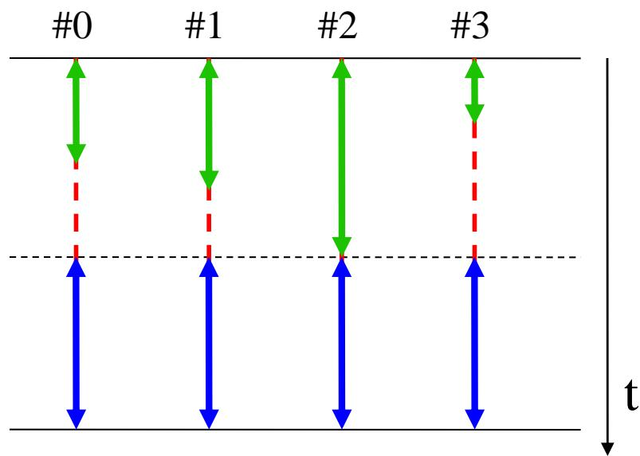

## Echange de donnees / 数据交换

### Diffusion (broadcast) / 广播

La diffusion consiste a émettre une information initialement détenue par un seul processus vers tous les processus du communicateur. 广播的含义是：由一个进程把自己持有的数据发送给通信子中的所有进程。

Le processus qui possede initialement la donnee est appele la racine (`root`). 最初拥有该数据的进程称为根进程（`root`）。

On parle d'une emission un-vers-tous (`one-to-all`). 这是一种典型的“一对多”通信模式。

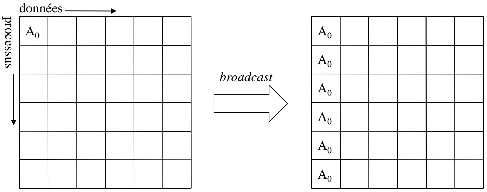

```c
int MPI_Bcast(
    void *buf,
    int count,
    MPI_Datatype datatype,
    int root,
    MPI_Comm comm
);
```

- Si le rang courant est `root`, `buf` designe la zone memoire a diffuser. 若当前进程就是 `root`，则 `buf` 指向待广播的数据。
- Sinon, `buf` designe la zone memoire de reception. 对其他进程来说，`buf` 是接收缓冲区。
- Cette zone memoire doit etre allouee avant l'appel. 调用前，接收缓冲区必须已经分配好。

- `count` est le nombre d'elements de type `datatype`. `count` 表示元素个数，而不是字节数。
- `root` est le rang de la racine, Ce rang est valide dans le communicateur `comm`. Tous les processus du communicateur doivent utiliser la même racine. `root`是根进程的 rank，这个 rank 是在通信子 comm 内定义的；同一个通信子中的所有进程必须使用相同的 `root`。

```c
int moi, root;
float pi;
root = 0; /* le processus 0 est la racine */

MPI_Comm_rank(MPI_COMM_WORLD, &moi);
if (moi == root) {
    pi = 3.14f; /* seule la racine detient l'information */
}

/* tous les processus doivent faire appel a MPI_Bcast */
MPI_Bcast(&pi, 1, MPI_FLOAT, root, MPI_COMM_WORLD);
printf("P%d: pi = %f\n", moi, pi);
```

```txt
$ mpirun -np 4 a.out
P0: pi = 3.14
P1: pi = 3.14
P2: pi = 3.14
P3: pi = 3.14
```

Ici, la racine initialise `pi`, puis la diffusion fait en sorte que tous les processus obtiennent la meme valeur. 这里由根进程初始化 `pi`，广播完成后所有进程都持有相同的值。

Cas d'usage classique : un seul processus lit un petit fichier de configuration, puis diffuse les parametres avec `MPI_Bcast` afin d'eviter une tempete d'acces au systeme de fichiers. 一个很常见的用法是：由单个进程读取配置文件，然后用 `MPI_Bcast` 分发配置，避免所有进程同时访问文件系统。

### Distribution (scatter) / 分发

Le `scatter` consiste a faire envoyer par la racine un bloc different a chaque processus, avec un meme type et une meme taille par destinataire. `scatter` 表示由根进程向每个进程发送不同的数据块，但每个块的类型和大小一致。

Il s'agit encore d'une communication un-vers-tous. 它仍然是一种“一对多”通信。

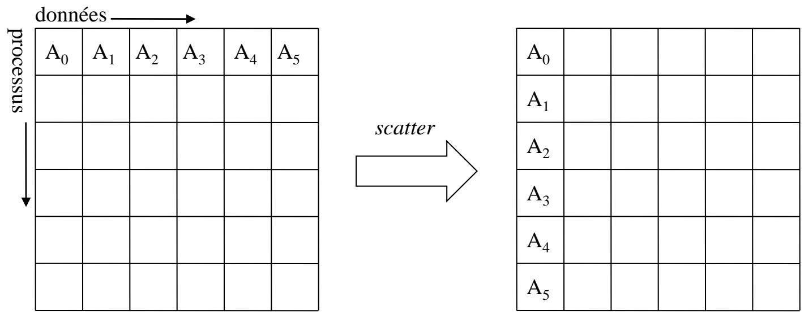

```c
int MPI_Scatter(
    void *sendbuf,
    int sendcount,
    MPI_Datatype sendtype,
    void *recvbuf,
    int recvcount,
    MPI_Datatype recvtype,
    int root,
    MPI_Comm comm
);
```

- `sendbuf` est l'adresse des donnees a distribuer ; il n'est significatif que chez la racine. `sendbuf` 是根进程持有的待分发数组，对非根进程通常无意义。
- `sendcount` est la taille envoyee a chaque processus. `sendcount` 是发给每个进程的元素数。
- Si le communicateur contient `P` processus, `sendbuf` doit contenir `sendcount * P` elements. 若通信子大小为 `P`，则根进程的发送数组通常需要容纳 `sendcount * P` 个元素。
- Les elements destines au processus `p` commencent a l'adresse `sendbuf + p * sendcount`. 发给进程 `p` 的那一段数据起始于 `sendbuf + p * sendcount`。
- `recvbuf` est la zone memoire locale de reception. `recvbuf` 是每个进程的本地接收缓冲区。
- `recvcount` doit etre egal a `sendcount` dans la forme simple de `MPI_Scatter`. 在这个基础版本中，`recvcount` 与 `sendcount` 应一致。
- `root` doit etre le meme pour tous les processus. 所有进程看到的 `root` 必须一致。

```c
int moi, val_recue, root, P, p;
int *sbuf;
FILE *fd;

root = 0;
MPI_Comm_rank(MPI_COMM_WORLD, &moi);
MPI_Comm_size(MPI_COMM_WORLD, &P);

if (moi == root) {
    sbuf = (int *)malloc(P * sizeof(int));
    fd = fopen("donnees", "r");
    for (p = 0; p < P; p++) {
        sbuf[p] = lire_val_fichier(fd, p);
    }
    fclose(fd);
} else {
    sbuf = NULL;
}

MPI_Scatter(sbuf, 1, MPI_INT, &val_recue, 1, MPI_INT, root, MPI_COMM_WORLD);
printf("P%d: val recue = %d\n", moi, val_recue);
```

```txt
$ cat donnees
18
25
6
3
$ mpirun -np 4 a.out
P0: val recue = 18
P1: val recue = 25
P2: val recue = 6
P3: val recue = 3
```

Dans cet exemple, la racine lit `P` entiers dans un fichier puis en distribue exactement un a chaque processus. 在这个例子中，根进程从文件里读入 `P` 个整数，然后给每个进程分发其中一个。

### Rassemblement (gather) / 汇集

Le `gather` est l'operation inverse du `scatter` : tous les processus envoient un bloc a la racine, qui les rassemble dans un tableau. `gather` 可以看成 `scatter` 的逆过程：所有进程把自己的局部数据发送给根进程，再由根进程按顺序收集起来。

Il s'agit d'une communication tous-vers-un (`all-to-one`). 这是一种典型的“多对一”通信。

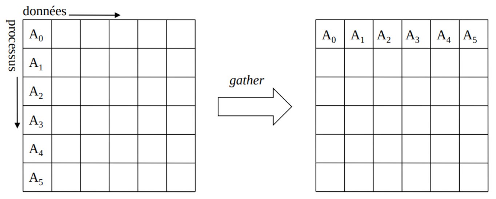

```c
int MPI_Gather(
    void *sendbuf,
    int sendcount,
    MPI_Datatype sendtype,
    void *recvbuf,
    int recvcount,
    MPI_Datatype recvtype,
    int root,
    MPI_Comm comm
);
```

- `sendbuf` contient les donnees locales a envoyer a la racine. `sendbuf` 是每个进程本地要发送的数据。
- `recvbuf` n'est significatif que pour la racine. `recvbuf` 只对根进程有意义。
- Dans la forme simple, `recvcount` doit etre egal a `sendcount`. 基础形式下，`recvcount` 应等于 `sendcount`。
- Le tableau `recvbuf` de la racine doit pouvoir contenir `recvcount * P` elements. 根进程上的 `recvbuf` 要能容纳 `recvcount * P` 个元素。
- Les donnees provenant du processus `p` seront placees a partir de `recvbuf + p * recvcount`. 来自进程 `p` 的数据会被放到 `recvbuf + p * recvcount` 开始的位置。

```c
int moi, val_calcul, root, P, p;
int *rcvbuf;
FILE *fd;

root = 0;
MPI_Comm_rank(MPI_COMM_WORLD, &moi);
MPI_Comm_size(MPI_COMM_WORLD, &P);

if (moi == root) {
    rcvbuf = (int *)malloc(P * sizeof(int));
} else {
    rcvbuf = NULL;
}

val_calcul = ...; /* chaque processus effectue un calcul */
MPI_Gather(&val_calcul, 1, MPI_INT, rcvbuf, 1, MPI_INT, root, MPI_COMM_WORLD);

if (moi == root) {
    fd = fopen("resultats", "w");
    for (p = 0; p < P; p++) {
        ecrire_val_fichier(fd, p, rcvbuf[p]);
    }
    fclose(fd);
}
```

```txt
$ mpirun -np 4 a.out
$ cat resultats
30
-100
23
19
```

Ici, chaque processus produit une valeur locale, puis la racine les collecte avant de les ecrire dans un fichier. 这里各个进程先算出自己的局部结果，然后由根进程汇总并写回文件。

### Gather-to-all (allgather) / 全汇集

`MPI_Allgather` est l'equivalent de `MPI_Gather`, sauf que le resultat final est distribue a tous les processus. `MPI_Allgather` 与 `MPI_Gather` 类似，但汇总结果不会只留在根进程，而是会分发给所有进程。

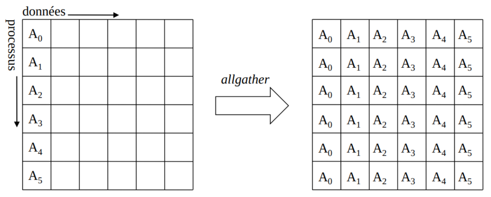

```c
int MPI_Allgather(
    void *sendbuf,
    int sendcount,
    MPI_Datatype sendtype,
    void *recvbuf,
    int recvcount,
    MPI_Datatype recvtype,
    MPI_Comm comm
);
```

Chaque processus fournit donc un bloc local via `sendbuf`, et tous reconstruisent l'ensemble global dans `recvbuf`. 因此每个进程都会提供本地一块数据，并在自己的 `recvbuf` 中拿到完整汇总结果。

Il faut toutefois rester attentif au cout memoire : chaque processus doit stocker la totalite du resultat. 不过要注意内存代价，因为每个进程都要保存完整结果。

## Reduction / 归约

### Reduction (reduce) / 归约到根

La reduction rassemble des donnees locales fournies par tous les processus, puis applique une operation comme une somme, un produit, un max ou un min. `reduce` 的目标是收集所有进程的局部值，并对它们执行某种归约操作，例如求和、求积、求最大或最小。

Le resultat final est place dans le `recvbuf` de la racine. 最终结果只会写入根进程的 `recvbuf`。

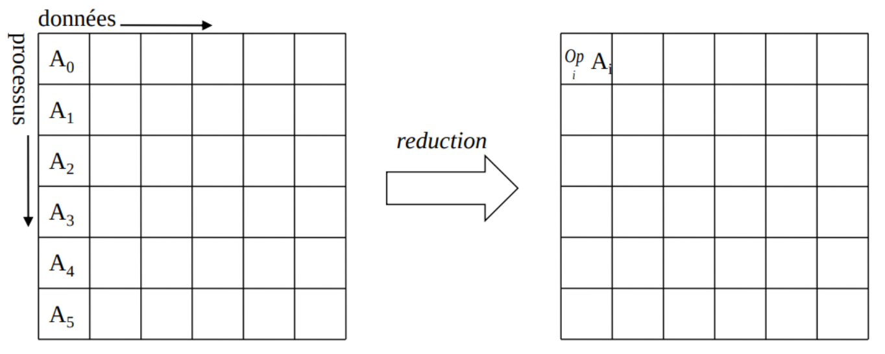

```c
int MPI_Reduce(
    void *sendbuf,
    void *recvbuf,
    int count,
    MPI_Datatype datatype,
    MPI_Op op,
    int root,
    MPI_Comm comm
);
```

- `sendbuf` contient `count` elements de type `datatype` fournis localement par chaque processus. `sendbuf` 是每个进程本地提供的 `count` 个 `datatype` 元素。
- `recvbuf` ne sert qu'a la racine. `recvbuf` 只有根进程真正会使用。
- `op` designe l'operation de reduction, par exemple `MPI_SUM`. `op` 指定归约操作，例如 `MPI_SUM`。

La forme mathematique est la suivante : 数学上可以写成：

$$
recvbuf[i] = op_{0 \le p < P} sendbuf_p[i],\quad 0 \le i < count
$$

Autrement dit, pour chaque position `i`, MPI combine la contribution de tous les processus avec l'operateur `op`. 也就是说，对每个下标 `i`，MPI 都会把所有进程的对应元素按 `op` 合并。

Pour les reductions en virgule flottante, l'ordre effectif des additions peut varier selon l'arbre de reduction retenu, ce qui peut produire de tres legeres differences numeriques d'une execution a l'autre. 对浮点归约来说，实际加法顺序可能会随着归约树或运行条件而变化，因此不同执行之间出现微小数值差异是正常的。

En phase de debug, on peut parfois chercher un mode plus deterministe ; en production, on privilegie en general la performance. 调试时有时会追求更强的确定性；而在生产环境里通常优先考虑性能。

### Operateurs predefinis / 预定义归约算子

Les operateurs de reduction sont de type `MPI_Op`. Plusieurs operateurs usuels sont deja fournis par MPI, et il est aussi possible d'en definir avec `MPI_Op_create()`. 归约算子的类型是 `MPI_Op`。MPI 已经提供了很多常见算子，同时也允许用户用 `MPI_Op_create()` 定义自定义算子。

| MPI_Op | Signification | Types |
| --- | --- | --- |
| `MPI_MAX` | Maximum | entiers et reels |
| `MPI_MIN` | Minimum | entiers et reels |
| `MPI_SUM` | Somme | entiers et reels |
| `MPI_PROD` | Produit | entiers et reels |
| `MPI_LAND` | Et logique | entiers |
| `MPI_BAND` | Et bit a bit | entiers et `MPI_BYTE` |
| `MPI_LOR` | Ou logique | entiers |
| `MPI_BOR` | Ou bit a bit | entiers et `MPI_BYTE` |
| `MPI_LXOR` | Ou exclusif logique | entiers |
| `MPI_BXOR` | Ou exclusif bit a bit | entiers et `MPI_BYTE` |
| `MPI_MAXLOC` | Maximum et position associee | structures a deux composantes |
| `MPI_MINLOC` | Minimum et position associee | structures a deux composantes |

### Reduce-to-all (allreduce) / 全归约

`MPI_Allreduce` effectue la meme reduction que `MPI_Reduce`, mais le resultat est rendu a tous les processus. `MPI_Allreduce` 的归约语义与 `MPI_Reduce` 一样，只是最终结果会写到所有进程的 `recvbuf` 中。

Il n'y a donc pas de racine explicite. 因而它没有显式 `root` 参数。

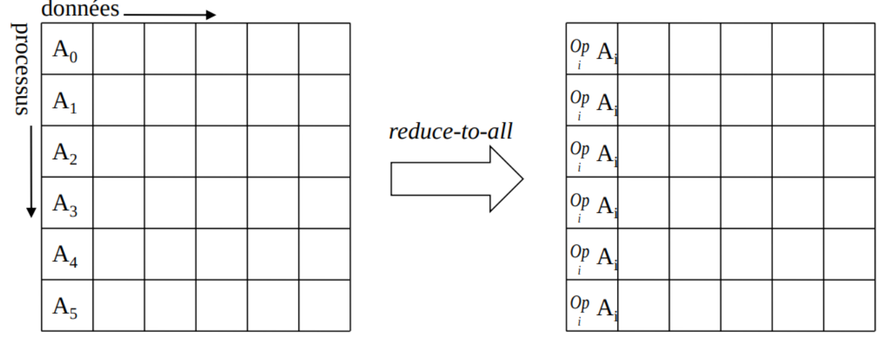

```c
int MPI_Allreduce(
    void *sendbuf,
    void *recvbuf,
    int count,
    MPI_Datatype datatype,
    MPI_Op op,
    MPI_Comm comm
);
```

Chaque processus fournit ses donnees locales dans `sendbuf`, puis recupere dans `recvbuf` la valeur reduite globale. 每个进程都在 `sendbuf` 中提供本地输入，并在 `recvbuf` 中得到同一个全局归约结果。

#### Exemple : somme des entiers de 1 a N / 示例：求 `1` 到 `N` 的和

```c
int P, N = 100;
int moi, i, som_glob, som_local = 0;

MPI_Comm_rank(MPI_COMM_WORLD, &moi);
MPI_Comm_size(MPI_COMM_WORLD, &P);

/* hypothese : N est divisible par P */
for (i = 1 + moi * N / P; i <= (moi + 1) * N / P; i++) {
    som_local += i;
}

MPI_Allreduce(&som_local, &som_glob, 1, MPI_INT, MPI_SUM, MPI_COMM_WORLD);
printf("1+...+%d = %d\n", N, som_glob);
```

```txt
$ mpirun -np 4 a.out
1+...+100 = 5050
1+...+100 = 5050
1+...+100 = 5050
1+...+100 = 5050
```

Chaque processus calcule d'abord une somme partielle, puis `MPI_Allreduce` produit la somme globale et la recopie partout. 在这个例子里，每个进程先算局部和，然后由 `MPI_Allreduce` 求出全局总和并返回给所有进程。

## All-to-All / 全互换

Dans une operation `all-to-all`, chaque processus envoie un bloc potentiellement different a tous les autres et recoit en retour un bloc potentiellement different de chacun d'eux. 在 `all-to-all` 中，每个进程会向所有其他进程发送一块（可不同）数据，并从每个其他进程接收一块（可不同）数据。

C'est une collective souvent couteuse : le volume global d'echange croît en `P^2` quand `P` (taille du communicateur) augmente. 这是代价较高的集合通信之一：当通信子大小 `P` 增大时，总交换规模按 `P^2` 增长。

On peut l'interpreter comme la transposition d'une matrice `processus x donnees`. 它常被理解为“进程 x 数据”矩阵的转置。

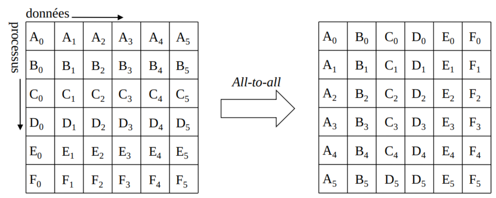

```c
int MPI_Alltoall(
    void *sendbuf,
    int sendcount,
    MPI_Datatype sendtype,
    void *recvbuf,
    int recvcount,
    MPI_Datatype recvtype,
    MPI_Comm comm
);
```

### Signification des parametres / 参数含义

- `sendbuf` : adresse de la zone memoire des donnees a envoyer a chaque processus de `comm`. `sendbuf`：发送缓冲区起始地址，包含要发给 `comm` 中各进程的数据。
- `sendcount` : nombre d'elements envoyes a **chaque** processus. `sendcount`：发给**每个**目标进程的元素个数。
- `sendtype` : type MPI des elements envoyes. `sendtype`：发送元素的 MPI 类型。
- `recvbuf` : adresse de la zone memoire qui recevra les donnees de tous les processus. `recvbuf`：接收缓冲区起始地址，用于接收来自所有进程的数据。
- `recvcount` : nombre d'elements recus de **chaque** processus. `recvcount`：从**每个**源进程接收的元素个数。
- `recvtype` : type MPI des elements recus. `recvtype`：接收元素的 MPI 类型。
- `comm` : communicateur concerne par l'operation. `comm`：参与该操作的通信子。

### Organisation memoire / 内存布局

Si `P` est le nombre de processus du communicateur : 若 `P` 是通信子进程数：

- `sendbuf` doit contenir au moins `sendcount * P` elements de type `sendtype`. `sendbuf` 至少应包含 `sendcount * P` 个 `sendtype` 元素。
- Le bloc destine au processus `p` commence a `sendbuf + p * sendcount`. 发给进程 `p` 的块从 `sendbuf + p * sendcount` 开始。
- `recvbuf` doit contenir au moins `recvcount * P` elements de type `recvtype`. `recvbuf` 至少应包含 `recvcount * P` 个 `recvtype` 元素。
- Le bloc recu du processus `p` est place a `recvbuf + p * recvcount`. 来自进程 `p` 的块放在 `recvbuf + p * recvcount`。

### Formulation matricielle / 矩阵化表述

- Soit `P` le nombre de processus. 设 `P` 为进程数。
- Soit `A` une matrice carree `P x P`, dont les elements sont des couples d'entiers. 令 `A` 为 `P x P` 的方阵，元素为整数二元组。
- Chaque processus `p` possede la ligne `A(p, *)`. 每个进程 `p` 持有矩阵第 `p` 行 `A(p, *)`。
- On veut construire la transposee `tA`, definie par `tA(i, j) = A(j, i)`. 目标是构造转置矩阵 `tA`，满足 `tA(i, j) = A(j, i)`。
- Cas de test classique : `A(i, j) = (i, j)`. 常用测试情形：`A(i, j) = (i, j)`。

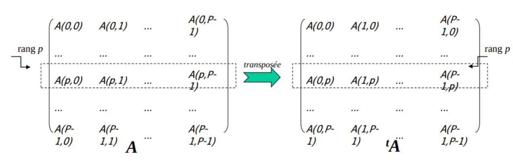

Pour un rang `p`, l'effet attendu est donc : pour tout `j`, l'element local passe de `A(p, j)` a `tA(p, j) = A(j, p)`.  
对 rank `p` 而言，预期效果是：对任意 `j`，本地元素从 `A(p, j)` 变为 `tA(p, j) = A(j, p)`。

```c
int moi, P, p;
MPI_Comm_size(MPI_COMM_WORLD, &P);
MPI_Comm_rank(MPI_COMM_WORLD, &moi);

int *ligne = (int *)malloc(2 * P * sizeof(int));
int *li_tr = (int *)malloc(2 * P * sizeof(int));

/* chaque processus construit sa ligne locale de A */
printf("A[%d] = [", moi);
for (p = 0; p < P; p++) {
    int *elt = ligne + 2 * p;
    elt[0] = moi;
    elt[1] = p;
    printf("(%d,%d)", elt[0], elt[1]);
}
printf("]\n");

MPI_Alltoall(ligne, 2, MPI_INT, li_tr, 2, MPI_INT, MPI_COMM_WORLD);

/* chaque processus obtient sa ligne locale de tA */
printf("t(A)[%d] = [", moi);
for (p = 0; p < P; p++) {
    int *elt = li_tr + 2 * p;
    printf("(%d,%d)", elt[0], elt[1]);
}
printf("]\n");
```

Exemple de sortie possible avec `mpirun -np 4` :  
`mpirun -np 4` 时可能出现如下输出：

```txt
A[3] = [ (3,0) (3,1) (3,2) (3,3) ]
A[2] = [ (2,0) (2,1) (2,2) (2,3) ]
A[1] = [ (1,0) (1,1) (1,2) (1,3) ]
A[0] = [ (0,0) (0,1) (0,2) (0,3) ]
t(A)[0] = [ (0,0) (1,0) (2,0) (3,0) ]
t(A)[1] = [ (0,1) (1,1) (2,1) (3,1) ]
t(A)[2] = [ (0,2) (1,2) (2,2) (3,2) ]
t(A)[3] = [ (0,3) (1,3) (2,3) (3,3) ]
```

Remarque : l'ordre d'affichage n'est pas controle entre processus.  
说明：多进程 `printf` 的打印先后通常不受控制。

Les variantes `MPI_Alltoallv` et `MPI_Alltoallw` etendent ce schema : tailles variables (`v`), puis tailles + types variables (`w`) selon le partenaire. `MPI_Alltoallv` 与 `MPI_Alltoallw` 是扩展版本：前者支持按目标变化的数据长度，后者还支持按目标变化的数据类型。

## Gestion de donnees de taille differente / 处理不同大小的数据

Certaines collectives comme `scatter`, `gather` ou `alltoall` existent en version etendue pour les cas ou la taille des blocs depend du rang. 一些集合通信，例如 `scatter`、`gather` 和 `alltoall`，都提供了扩展版本，用于不同进程块大小不一致的情况。

En general, ces variantes se reconnaissent au suffixe `v`. 这类变长版本通常通过后缀 `v` 来标识。

- `MPI_Gather` -> `MPI_Gatherv`
- `MPI_Allgather` -> `MPI_Allgatherv`
- `MPI_Scatter` -> `MPI_Scatterv`
- `MPI_Alltoall` -> `MPI_Alltoallv`

Certaines implementations fournissent aussi `MPI_Alltoallw` pour traiter non seulement des tailles variables, mais aussi des types differents selon le partenaire. 有些实现还提供 `MPI_Alltoallw`，进一步支持“按目标不同而改变大小和类型”的场景。

### Exemple : MPI_Scatterv / 示例：MPI_Scatterv

Dans `MPI_Scatterv`, les blocs `A0`, `A1`, etc. restent du meme type, mais leur taille n'a plus besoin d'etre identique. 在 `MPI_Scatterv` 中，`A0`、`A1` 等块的数据类型保持一致，但每一块的长度可以不同。

En outre, les blocs n'ont pas besoin d'etre contigus en memoire ; on a donc besoin d'un tableau de deplacements. 同时，这些块也不要求在内存中严格等长连续，因此需要额外提供位移数组。

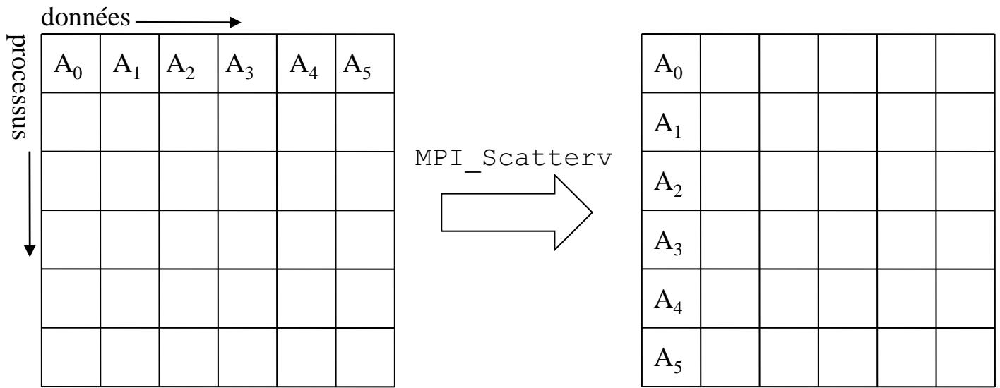

```c
int MPI_Scatterv(
    void *sendbuf,
    int *sendcounts,
    int *displs,
    MPI_Datatype sendtype,
    void *recvbuf,
    int recvcount,
    MPI_Datatype recvtype,
    int root,
    MPI_Comm comm
);
```

- `sendbuf` est le tableau global de donnees a distribuer ; il n'est valide que pour la racine. `sendbuf` 是根进程持有的全局数据数组。
- `sendcounts[p]` donne le nombre d'elements a envoyer au processus `p`. `sendcounts[p]` 表示应发给进程 `p` 的元素个数。
- `displs[p]` indique le deplacement de debut de ce bloc dans `sendbuf`. `displs[p]` 则给出这个块在 `sendbuf` 中的起始位移。
- Tous les elements sont du type `sendtype`. 所有发送元素都按 `sendtype` 解释。
- `recvbuf` est le buffer local de reception, dimensionne pour `recvcount` elements de type `recvtype`. `recvbuf` 是本地接收缓冲区，需要能装下 `recvcount` 个 `recvtype` 元素。

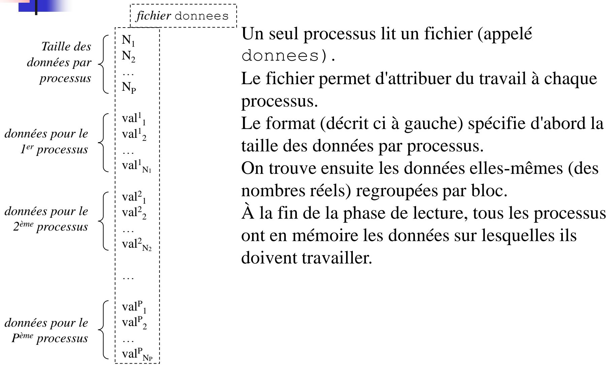

```c
int sz;
int *szbuf, *displs;
double *sbuf, *rcvbuf;

if (moi == root) {
    szbuf = (int *)malloc(P * sizeof(int));
    displs = (int *)malloc((P + 1) * sizeof(int));
    fd = fopen("donnees", "r");
    displs[0] = 0;
    for (p = 0; p < P; p++) {
        szbuf[p] = lire_val_fichier(fd, p);
        displs[p + 1] = displs[p] + szbuf[p];
    }
    sbuf = (double *)malloc(displs[P] * sizeof(double));
    for (p = 0; p < P; p++) {
        for (i = 0; i < szbuf[p]; i++) {
            sbuf[displs[p] + i] = lire_val_reel_fichier(fd, p);
        }
    }
    fclose(fd);
} else {
    szbuf = NULL;
    displs = NULL;
    sbuf = NULL;
}

/* chaque processus recoit la taille de son bloc */
MPI_Scatter(szbuf, 1, MPI_INT, &sz, 1, MPI_INT, root, MPI_COMM_WORLD);
rcvbuf = (double *)malloc(sz * sizeof(double));

/* chaque processus recoit ses donnees */
MPI_Scatterv(sbuf, szbuf, displs, MPI_DOUBLE, rcvbuf, sz, MPI_DOUBLE, root, MPI_COMM_WORLD);
```

Le schema classique consiste a diffuser d'abord les tailles locales avec un `MPI_Scatter`, puis a distribuer les donnees elles-memes avec `MPI_Scatterv`. 一个很常见的写法是：先用 `MPI_Scatter` 把每个进程需要接收的块大小发出去，再用 `MPI_Scatterv` 发送真正的数据。

## Resume / 总结

- Les operations collectives MPI correspondent a des motifs de communication classiques et sont generalement mieux optimisees qu'une reimplementation manuelle en `send/recv`. MPI 集合通信覆盖了最常见的通信模式，通常也比手工用 `send/recv` 重写更高效。
- Elles restent couteuses et doivent etre placees seulement quand elles sont vraiment necessaires. 但它们依旧昂贵，因此应只在确有必要时使用。
- Les operations de la forme `MPI_All*` rendent leur resultat a tous les processus. `MPI_All*` 这类操作会把结果返回给所有进程。
- Les variantes en `MPI_*v` permettent de gerer des tailles de blocs variables selon le rang. `MPI_*v` 这类扩展版本可处理按进程变化的块大小。
- Les reductions flottantes peuvent etre legerement non deterministes d'une execution a l'autre ; c'est normal et il faut l'anticiper au debug. 浮点归约在不同执行之间可能出现轻微非确定性，这属于正常现象，调试时需要提前预期。
- Il faut eviter les collectives dans des branches conditionnelles divergentes. 应避免把集合通信放到可能在不同进程上走出不同路径的条件分支中。
