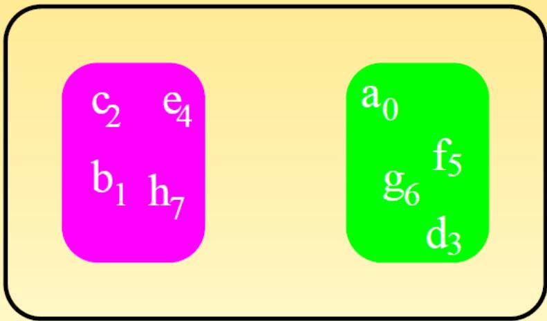
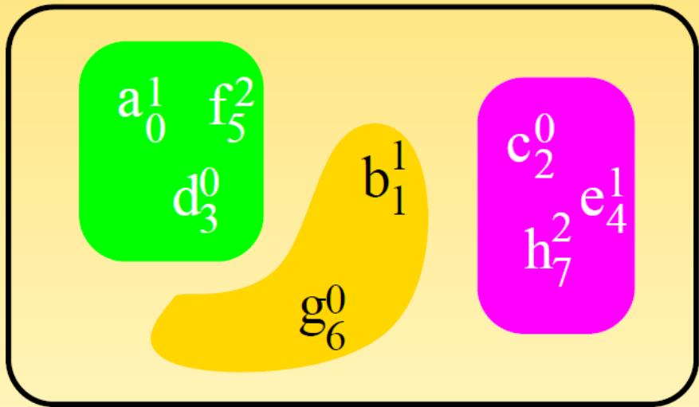

# Programmation parallele et distribuee / 并行与分布式编程

## Cours 5 : MPI avance / 课程5：高级MPI

### Auteurs

## Plan du cours 5

- Les communicateurs
- Communications collectives avec fonctions utilisateur
- Introduction aux types dérivés
- Slides issus du cours IDRIS sur MPI

课程大纲：通信器、用户自定义集合通信、派生类型介绍、内容来源于IDRIS的MPI课程。

## Les communicateurs

Il s'agit de partitionner un ensemble de processus afin de creer des sous-ensembles sur lesquels on puisse effectuer des operations (point-a-point, collectives, etc.). 通信器用于把进程集合划分为子集，以便在子集内进行点对点或集合通信。

Chaque sous-ensemble cree aura son propre espace de communication. 每个子集拥有独立的通信空间。

`MPI_COMM_WORLD` est le communicateur global par defaut. MPI_COMM_WORLD是默认的全体进程通信器。



### MPI_COMM_WORLD et creation

- On ne peut creer un communicateur qu'a partir d'un autre communicateur.
- MPI_COMM_WORLD est fourni par defaut et existe pendant toute l'execution du programme.
- Il est cree apres MPI_Init() et detruit apres MPI_Finalize().
- Par defaut, il couvre toutes les communications de l'application. 通信器只能由已有通信器创建；MPI_COMM_WORLD是默认通信器，贯穿程序执行；MPI_Init后创建，MPI_Finalize后销毁；默认覆盖全体进程通信。

### Exemple pair/impair (idee)

On regroupe les processus de rang pair et impair, puis on diffuse un message a chaque groupe. 将偶数rank与奇数rank分别分组，在各组内做广播。

### Pourquoi creer un communicateur

Si le processus 2 doit diffuser un message uniquement aux pairs, boucler sur des send/recv serait penaliserant et impose des tests conditionnels. 若进程2只向偶数rank广播，使用send/recv循环会很慢且要做大量判断。

La solution est de creer un communicateur qui regroupe ces processus, puis d'y faire la diffusion. 解决方案是为偶数组建通信器并在其中广播。

### Groupes et communicateurs

Un communicateur est constitue :

- d'un groupe (ensemble ordonne de processus)
- d'un contexte de communication gere par MPI 通信器由进程组和通信上下文组成。

Pour construire un communicateur, deux approches :

- passer par un groupe de processus
- partir directement d'un autre communicateur 可以通过进程组创建，或直接从另一个通信器创建。

### Constructeurs

MPI fournit plusieurs sous-programmes :

- MPI_Cart_create()
- MPI_Cart_sub()
- MPI_Comm_create()
- MPI_Comm_dup()
- MPI_Comm_split() MPI提供多种构造通信器的函数。

Ces constructeurs sont collectifs. Les communicateurs crees peuvent etre detruits via MPI_Comm_free(). 构造函数是集合操作，创建的通信器可用MPI_Comm_free释放。

### Communicateurs issus d'un autre

L'utilisation directe des groupes impose souvent :

- de nommer differemment les communicateurs
- de passer par les groupes pour les creer
- de laisser MPI reordonner les rangs
- d'utiliser des tests conditionnels dans MPI_Bcast 直接用组会带来命名、构造和条件判断等复杂度。

`MPI_Comm_dup` est souvent utilise dans les bibliotheques pour creer un espace de communication isole, et eviter des interferences avec d'autres composants MPI de l'application. `MPI_Comm_dup` 常用于库内部创建隔离通信空间，避免与应用中其他MPI组件互相干扰。

```fortran
if (comm_pair /= MPI_COMM_NULL) then
    call MPI_BCAST(a, m, MPI_REAL, rang_ds_pair, comm_pair, code)
elseif (comm_impair /= MPI_COMM_NULL) then
    call MPI_BCAST(a, m, MPI_REAL, rang_ds_impair, comm_impair, code)
end if
```

Exemple : dans ce schema, chaque communicateur appelle son propre broadcast. 示例中不同通信器需要分别调用广播。

### MPI_Comm_split

MPI_Comm_split permet de partitionner un communicateur en plusieurs communicateurs. MPI_Comm_split用于按规则把通信器划分成多个子通信器。

```fortran
integer, intent(in) :: comm, couleur, clef
integer, intent(out) :: nouveau_comm, code
call MPI_COMM_SPLIT(comm, couleur, clef, nouveau_comm, code)
```

Remarque : `couleur` decide le regroupement, `clef` decide l'ordre interne. couleur决定分组，clef决定组内排序。

La valeur de `couleur` peut etre n'importe quel entier (pas besoin d'etre consecutive) ; tous les processus avec la meme couleur iront dans le meme sous-communicateur. `couleur` 可以是任意整数（不要求连续）；颜色相同的进程会被分到同一子通信器。

Dans chaque sous-communicateur, les processus sont tries par `clef` croissante ; en cas d'egalite de clef, le rang dans le communicateur d'origine sert a departager. 在每个子通信器内，进程按 `clef` 升序排序；若 `clef` 相同，则用原通信器中的rank打破平局。

<table><tr><td>processus</td><td>a</td><td>b</td><td>c</td><td>d</td><td>e</td><td>f</td><td>g</td><td>h</td></tr><tr><td>rang_monde</td><td>0</td><td>1</td><td>2</td><td>3</td><td>4</td><td>5</td><td>6</td><td>7</td></tr><tr><td>couleur</td><td>0</td><td>2</td><td>3</td><td>0</td><td>3</td><td>0</td><td>2</td><td>3</td></tr><tr><td>clef</td><td>2</td><td>15</td><td>0</td><td>0</td><td>1</td><td>3</td><td>11</td><td>1</td></tr><tr><td>rang_nv_com</td><td>1</td><td>1</td><td>0</td><td>0</td><td>1</td><td>2</td><td>0</td><td>2</td></tr></table>



### Exemple : pairs/impairs

```fortran
program PairsImpairs
use mpi
implicit none
integer, parameter :: m = 16
integer :: clef, comm_pairs_impairs
integer :: rang_dans_monde, code
real, dimension(m) :: a

call MPI_INIT(code)
call MPI_COMM_RANK(MPI_COMM_WORLD, rang_dans_monde, code)

! Initialisation du vecteur A
A(:) = 0.0
if (rang_dans_monde == 2) A(:) = 2.0
if (rang_dans_monde == 5) A(:) = 5.0
```

```fortran
clef = rang_dans_monde
if (rang_dans_monde == 2 .OR. rang_dans_monde == 5) then
    clef = -1
end if

! Creation des communicateurs pair et impair
call MPI_COMM_SPLIT(MPI_COMM_WORLD, mod(rang_dans_monde, 2), clef, comm_pairs_impairs, code)

! Diffusion par le processus 0 de chaque communicateur
call MPI_BCAST(a, m, MPI_REAL, 0, comm_pairs_impairs, code)

! Destruction des communicateurs
call MPI_COMM_FREE(comm_pairs_impairs, code)
call MPI_FINALIZE(code)
end program PairsImpairs
```

Exemple : `MPI_Comm_split` regroupe ici les processus par parite, puis une diffusion est faite dans chaque sous-communicateur. 示例通过MPI_Comm_split按奇偶分组，并在各组内广播。

## Operations collectives utilisateur

```c
int MPI_Op_create(MPI_User_function *function, int commute, MPI_Op *op);
```

`MPI_Op_create` sert a definir une operation de reduction utilisateur. MPI_Op_create用于定义用户自定义归约操作。

La fonction doit etre associative et peut etre commutative ou non. Elle suit un prototype impose. 函数需满足结合律，可交换或不可交换，需符合规定的函数原型。

Prototype utilisateur attendu : 用户回调的期望原型：

```c
void user_op(void *invec, void *inoutvec, int *len, MPI_Datatype *dtype);
```

`invec` contient les nouvelles valeurs a combiner, `inoutvec` contient l'accumulateur a mettre a jour, `len` est le nombre d'elements, `dtype` indique le type logique manipule. `invec` 是新输入数据，`inoutvec` 是需要原地更新的累积结果，`len` 为元素个数，`dtype` 为逻辑数据类型。

Le parametre `commute` indique si l'operation est commutative (`1`) ou non (`0`) ; une operation commutative laisse plus de liberte d'optimisation a l'implementation MPI. `commute` 指示操作是否可交换（`1`）或不可交换（`0`）；可交换操作能给MPI实现更多优化空间。

```c
void addel(int *,int *, int *, MPI_Datatype *);
void addem(int *invec, int *inoutvec, int *len, MPI_Datatype *dtype)
{
    int i;
    for (i = 0; i < *len; i++)
        inoutvec[i] += invec[i];
}

// Déclaration et création de l'opération
MPI_Op_create((MPI_User_function *)addem, 1, &op);

/* liberation */
MPI_Op_free(&op);
```

Exemple : on definit une reduction par addition, puis on libere l'operation. 示例定义加法归约操作并释放。

## Types dérivés

Dans les communications, les donnees echangees sont typees (MPI_INTEGER, MPI_REAL, MPI_COMPLEX, etc.). MPI通信的数据有类型（整数、实数、复数等）。

On peut creer des structures de donnees plus complexes avec :

- MPI_TYPE_CONTIGUOUS()
- MPI_TYPE_VECTOR()
- MPI_TYPE_CREATE_HVECTOR() 可用以上函数构造更复杂的派生类型。

Point important : `MPI_TYPE_VECTOR` exprime le pas en nombre d'elements, alors que `MPI_TYPE_CREATE_HVECTOR` l'exprime en octets. 关键区别：`MPI_TYPE_VECTOR` 的步长单位是“元素个数”，`MPI_TYPE_CREATE_HVECTOR` 的步长单位是“字节数”。

Pour les structures (`MPI_TYPE_CREATE_STRUCT`), MPI doit connaitre precisement les deplacements pour respecter l'alignement/padding et garantir un echange correct entre architectures. 对结构体类型（`MPI_TYPE_CREATE_STRUCT`），MPI需要准确位移信息以处理对齐/padding，并保证跨架构交换正确。

A chaque creation, il faut valider le type avec MPI_TYPE_COMMIT(). Pour reutiliser ensuite, il faut liberer avec MPI_TYPE_FREE(). 创建后需MPI_TYPE_COMMIT提交，使用结束后用MPI_TYPE_FREE释放。

### Liste de fonctions

- MPI_TYPE_CREATE_STRUCT
- MPI_TYPE_[CREATE_H]INDEXED
- MPI_TYPE_[CREATE_H]VECTOR
- MPI_TYPE_CONTIGUOUS
- MPI_REAL, MPI_INTEGER, MPI_LOGICAL 以上为常用派生类型函数与基础类型。

### Types contigus

MPI_TYPE_CONTIGUOUS() cree un type a partir d'elements contigus en memoire. MPI_TYPE_CONTIGUOUS用于从连续数据创建新类型。

```fortran
integer, intent(in) :: nombre, ancien_type
integer, intent(out) :: nouveau_type, code
call MPI_TYPE_CONTIGUOUS(nombre, ancien_type, nouveau_type, code)
```

Ici, `nombre` est le nombre d'elements et `ancien_type` le type source. nombre为元素数量，ancien_type为旧类型。

### Types vectoriels (pas constant)

MPI_TYPE_VECTOR() cree un type a partir d'elements separes par un pas constant (en nombre d'elements). MPI_TYPE_VECTOR用固定步长（以元素为单位）创建类型。

```fortran
integer, intent(in) :: nombreBloc, longueurBloc
integer, intent(in) :: pas
integer, intent(in) :: ancien_type
integer, intent(out) :: nouveau_type, code
call MPI_TYPE_VECTOR(nombreBloc, longueurBloc, pas, ancien_type, nouveau_type, code)
```

Ici, `nombreBloc` est le nombre de blocs, `longueurBloc` la taille de bloc, et `pas` le stride. nombreBloc为块数，longueurBloc为块长度，pas为步长。

### Types HVECTOR (pas en octets)

MPI_TYPE_CREATE_HVECTOR() cree un type a pas constant exprime en octets. HVECTOR以字节为单位指定步长。

```fortran
integer, intent(in) :: nombreBloc, longueurBloc
integer(kind=MPI_ADDRESS_KIND), intent(in) :: pas
integer, intent(in) :: ancien_type
integer, intent(out) :: nouveau_type, code
call MPI_TYPE_CREATE_HVECTOR(nombreBloc, longueurBloc, pas, ancien_type, nouveau_type, code)
```

Quand le pas doit etre exprime en octets (cas generaux), on utilise `HVECTOR`. 当类型不再是基础类型时，需要用字节步长。

### Validation et liberation

Il est necessaire de valider tout type dérivé avec MPI_TYPE_COMMIT(). La liberation se fait avec MPI_TYPE_FREE(). 派生类型必须提交，结束后释放。

### Exemple : colonne

```fortran
program colonne
use mpi
implicit none
integer, parameter :: nb_lignes = 5, nb_colonnes = 6
integer :: etiquette, rang, code, type_colonne
integer :: statut(MPI_STATUS_SIZE)
real, dimension(nb_lignes, nb_colonnes) :: a

etiquette = 100
call MPI_INIT(code)
call MPI_COMM_RANK(MPI_COMM_WORLD, rang, code)

! Initialisation de la matrice
A(:,:) = real(rang)

! Definition et validation du type
call MPI_TYPE_CONTIGUOUS(nb_lignes, MPI_REAL, type_colonne, code)
call MPI_TYPE_COMMIT(type_colonne, code)
```

```fortran
! Envoi de la premiere colonne
if (rang == 0) then
    call MPI_SEND(a(1,1), 1, type_colonne, 1, etiquette, MPI_COMM_WORLD, code)
elseif (rang == 1) then
    call MPI_RECV(a(1, nb_colonnes), 1, type_colonne, 0, etiquette, MPI_COMM_WORLD, statut, code)
end if

call MPI_TYPE_FREE(type_colonne, code)
call MPI_FINALIZE(code)
end program colonne
```

Exemple : un type dérivé est utilise pour envoyer/recevoir une colonne de matrice. 示例用派生类型发送/接收矩阵列。

### Types indexed et hindexed

MPI_TYPE_INDEXED() cree un type compose de blocs de taille variable separes par un pas variable (exprime en elements). MPI_TYPE_INDEXED用于块大小可变、步长可变的类型。

MPI_TYPE_CREATE_HINDEXED() est similaire, mais le pas est exprime en octets. Utile quand le type de base n'est pas un type MPI predefini. HINDEXED以字节为步长，适合复杂类型。

Pour obtenir la taille du pas de facon portable, utiliser MPI_TYPE_SIZE() ou MPI_TYPE_GET_EXTENT(). 可用MPI_TYPE_SIZE或MPI_TYPE_GET_EXTENT获取类型大小。
