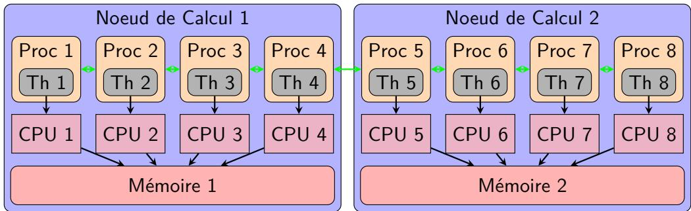
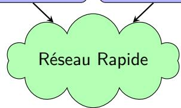
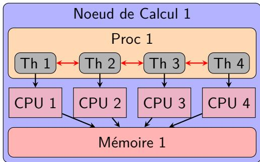
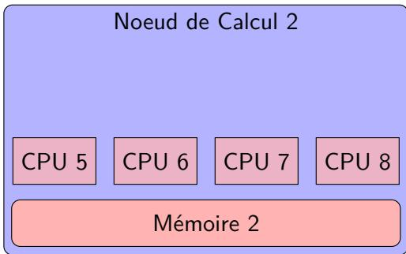
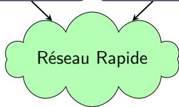
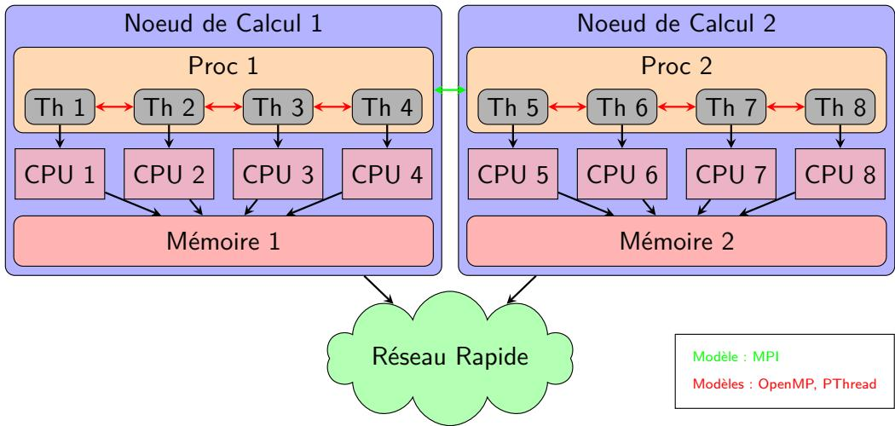
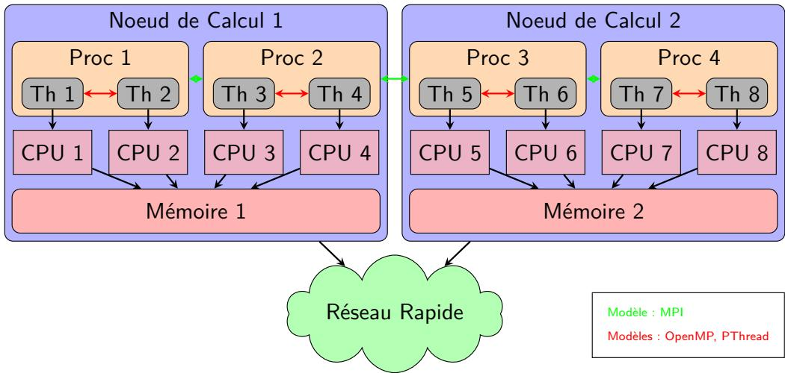

# Programmation parallele et distribuee

并行与分布式编程。

## Cours 6 : POSIX Threads

课程6：POSIX线程（Pthreads）。

### Auteurs

- Marc Perache (marc.perache@cea.fr)

作者：Marc Perache（marc.perache@cea.fr）。

## Table des matieres

1. Definitions
2. Les threads
3. Exclusion mutuelle (mutex)
4. Semaphores
5. Conditions
6. Volatilite
7. Cles (donnees specifiques aux threads)

目录：定义、线程、互斥锁、信号量、条件变量、volatile、线程私有数据。

## Definitions des termes cles

### SMP (Symmetric Multiprocessing)

Architecture ou plusieurs processeurs partagent une memoire commune et executent des threads simultanement.

SMP为共享内存多处理器架构。

### NUMA (Non-Uniform Memory Access)

La memoire est distribuee ; l'acces local est plus rapide que l'acces distant.

NUMA架构中本地内存访问更快。

### Thread

Unite d'execution dans un processus, partageant le meme espace memoire que les autres threads.

线程是进程内的执行单元，共享地址空间。

### Processus

Instance d'un programme en execution, avec son propre espace memoire et ses ressources.

进程是运行中的程序实例，拥有独立资源。

### Preemption

Interruption forcée d'un thread ou processus en cours d'exécution pour permettre à un autre thread ou processus de s'exécuter.

抢占：强制中断当前执行的线程或进程以允许另一个线程或进程运行。

### Section critique

Zone de code qui accede a une ressource partagee et doit etre protegee.

临界区需保护共享资源以避免竞态。

### Attente active (busy waiting)

Un thread boucle en testant une condition sans se bloquer.

忙等待是持续轮询条件。

### Reentrance

Propriete d'une fonction pouvant etre appelee simultanement sans conflit.

可重入函数可被多线程安全调用。

Historique utile : en C, certaines fonctions existent en version reentrante (par exemple `rand_r`) pour eviter les etats globaux partages de versions non reentrantes (`rand`).

历史提示：在C里，一些函数有可重入版本（如 `rand_r`），用于避免非可重入版本（如 `rand`）的共享全局状态问题。

## Structure memoire

### Processus UNIX (mono-thread)

- Section de code : instructions executables
- Donnees initialisees / BSS
- Tas (heap) : allocation dynamique
- Memoire mappee / memoire partagee
- Pile (stack) : variables locales

单线程进程包括代码段、数据段、堆、映射/共享内存与栈。

### Processus multithread

- Code, donnees, heap, memoire mappee/partagee : partages
- Chaque thread a sa propre pile

多线程共享代码与数据，但每个线程有独立栈。

## Programmation distribuee vs partagee

### Memoire distribuee





Modele : MPI.

分布式内存通常使用MPI。

### Memoire partagee







Modeles : OpenMP, Pthreads.

共享内存可用OpenMP或Pthreads。

### Programmation hybride





混合并行结合MPI与Pthreads/OpenMP。

Motivation pratique : a grande echelle, combiner MPI + threads limite la duplication memoire (moins de buffers redondants qu'en tout-MPI) et aide a mieux exploiter les noeuds multicœurs.

实践动机：在大规模场景下，MPI+线程可减少内存复制（比全MPI需要更少冗余buffer），并更好利用多核节点。

Lien avec Amdahl : paralleliser seulement des petites boucles atteint vite un plafond ; des regions paralleles plus larges donnent generalement un meilleur passage a l'echelle.

与Amdahl定律相关：只并行化小循环很快触顶；更大粒度的并行区域通常有更好的扩展性。

## Introduction aux threads

### Qu'est-ce qu'un thread

- Unite d'execution dans un processus
- Partage memoire et ressources avec les autres threads
- Plus leger qu'un processus

线程是轻量执行单元，共享进程资源。

### POSIX Threads (Pthreads)

Standard C/C++ portable pour la creation, gestion et synchronisation de threads.

Pthreads是C/C++线程编程标准API。

## Avantages des threads

- Parallelement : execution simultanee de taches
- Partage de ressources : moins de surcharge qu'entre processus
- Reactivite : execution de taches en arriere-plan
- Efficacite : creation/gestion plus legeres

线程提升并行性、资源共享效率与响应性。

## Fonctions Pthreads (base)

### pthread_create

```c
int pthread_create(pthread_t *thread,
                   const pthread_attr_t *attr,
                   void *(*start_routine)(void *),
                   void *arg);
```

Cree un thread executant start_routine.

创建线程并执行start_routine。

`start_routine` prend un unique argument `void *arg` : pour passer plusieurs valeurs, on regroupe les champs dans une structure et on passe un pointeur vers cette structure.

`start_routine` 只接收一个 `void *arg` 参数：若要传多个值，应封装到结构体后传结构体指针。

### pthread_join

```c
int pthread_join(pthread_t thread, void **retval);
```

Attend la fin d'un thread et recupere sa valeur de retour.

等待线程结束并获取返回值。

### pthread_exit / pthread_kill

```c
void pthread_exit(void *retval);
int pthread_kill(pthread_t thread, int sig);
```

退出线程或向线程发送信号。

### Exemple simple

```c
#include <pthread.h>
#include <stdio.h>

void *thread_function(void *arg) {
    printf("Hello from thread!\n");
    return NULL;
}

int main(void) {
    pthread_t thread;

    if (pthread_create(&thread, NULL, thread_function, NULL) != 0) {
        fprintf(stderr, "Error creating thread\n");
        return 1;
    }

    if (pthread_join(thread, NULL) != 0) {
        fprintf(stderr, "Error joining thread\n");
        return 2;
    }

    printf("Thread finished\n");
    return 0;
}
```

```txt
$ gcc -pthread -o thread_example thread_example.c
$ ./thread_example
```

示例展示创建与等待线程的基本流程。

## Gestion des erreurs

Toujours verifier les codes de retour et utiliser perror/strerror pour diagnostiquer.

务必检查返回值并输出错误信息。

Pour les erreurs, preferer `stderr` (non bufferise) afin de ne pas perdre les messages en cas de crash.

错误输出优先使用 `stderr`（非缓冲），避免崩溃时日志丢失。

Pour faciliter le debug multithread, afficher aussi un identifiant de thread (par exemple `pthread_t` avec `%p` apres cast approprie).

为便于多线程调试，建议同时输出线程标识（例如适当转换后用 `%p` 打印 `pthread_t`）。

`exit` termine le programme de facon controlee (code de retour) ; `abort` provoque un arret brutal et peut produire un core dump utile au debogage post-mortem.

`exit` 会以受控方式结束程序（返回码）；`abort` 会触发异常终止，并可能生成用于事后调试的 core dump。

## Mutex (exclusion mutuelle)

### Definition

Un mutex controle l'acces a une ressource partagee : un seul thread a la fois.

互斥锁确保同一时刻只有一个线程访问共享资源。

Regle pratique : les lectures et les ecritures d'un etat partage doivent suivre la meme discipline de verrouillage, sinon la semantique devient fragile.

实践规则：共享状态的“读/写”都应遵循同一加锁纪律，否则语义会变脆弱。

### Fonctions principales

- pthread_mutex_init / PTHREAD_MUTEX_INITIALIZER
- pthread_mutex_lock
- pthread_mutex_unlock
- pthread_mutex_destroy

互斥锁提供初始化、加锁、解锁与销毁接口。

En pratique, `PTHREAD_MUTEX_INITIALIZER` est souvent preferable pour les mutex globaux (initialisation explicite et robuste).

实践中，全局mutex通常优先 `PTHREAD_MUTEX_INITIALIZER`（初始化语义更直接、稳健）。

`pthread_mutex_destroy` doit etre reserve aux cas ou l'on peut prouver qu'aucun thread n'accedera encore au mutex (souvent apres `join` global). Sinon, mieux vaut conserver un mutex de duree de vie programme.

`pthread_mutex_destroy` 仅应在能证明“后续再无线程访问该锁”时使用（通常在全局 `join` 之后）；否则更稳妥的是让 mutex 与程序同生命周期。

`pthread_mutex_trylock` permet de tester sans bloquer ; il faut toujours traiter explicitement succes/echec.

`pthread_mutex_trylock` 可做非阻塞尝试；必须显式处理成功/失败分支。

Convention POSIX importante : retour `0` = succes, retour non nul = echec ; il faut donc ecrire les tests explicitement pour eviter les inversions logiques.

POSIX 约定要点：返回 `0` 表示成功，非 `0` 表示失败；条件判断应显式写清，避免逻辑反转。

Conseil de lisibilite : garder `pthread_mutex_lock` et `pthread_mutex_unlock` proches dans le code aide a visualiser clairement la section critique protegee.

可读性建议：让 `pthread_mutex_lock` 与 `pthread_mutex_unlock` 在代码中保持接近，可更直观地看到受保护的临界区范围。

En pratique, preferer un schema "point d'entree unique / point de sortie unique" dans une fonction critique (avec cleanup commun si besoin) limite les oublis de `unlock`.

在实践里，临界函数尽量采用“单入口/单出口”结构（必要时用统一清理路径），可明显降低遗漏 `unlock` 的风险。

### Exemple

```c
#include <pthread.h>
#include <stdio.h>

pthread_mutex_t mutex;
int shared_data = 0;

void *thread_function(void *arg) {
    pthread_mutex_lock(&mutex);
    shared_data++;
    printf("Thread %ld: shared_data = %d\n", (long)arg, shared_data);
    pthread_mutex_unlock(&mutex);
    return NULL;
}

int main(void) {
    pthread_t threads[2];

    pthread_mutex_init(&mutex, NULL);
    for (long i = 0; i < 2; i++) {
        pthread_create(&threads[i], NULL, thread_function, (void *)i);
    }
    for (int i = 0; i < 2; i++) {
        pthread_join(threads[i], NULL);
    }
    pthread_mutex_destroy(&mutex);
    return 0;
}
```

示例通过mutex保护共享数据。

### Anatomie d'un mutex (concept)

Un mutex peut maintenir une file d'attente de threads en attente, protegee par un spinlock.

互斥锁内部可含等待队列与自旋锁。

#### Structure d'un mutex

```c
typedef struct slot_s {
    thread_t *thread;
    struct slot_s *next;
} slot_t;

typedef struct {
    /* Compteur de threads dans ou en attente de section critique */
    volatile int nb_thread;
    /* Liste des threads bloques */
    volatile slot_t *list_first;
    volatile slot_t *list_last;
    /* Spinlock pour verrouiller les acces aux donnees du mutex */
    spinlock_t lock;
} mutex_t;
```

结构体包含等待队列与自旋锁，用于保护互斥锁内部状态。

#### Fonction de verrouillage : lock

```c
void mutex_lock(mutex_t *m)
{
    slot_t slot;
    spinlock(&(m->lock));
    if (m->nb_thread == 0) {
        m->nb_thread = 1;
        spinunlock(&(m->lock));
    } else {
        slot.thread = thread_self();
        enqueue(&slot, m);
        thread_self()->status = blocked;
        register_spinunlock(&(m->lock));
        yield();
    }
}
```

lock时若无人占用直接进入，否则入队并阻塞。

#### Fonction de deverrouillage : unlock

```c
void mutex_unlock(mutex_t *m)
{
    slot_t *slot;
    spinlock(&(m->lock));
    if (m->list_first != NULL) {
        slot = dequeue(m);
        wake(slot->thread);
    } else {
        m->nb_thread = 0;
    }
    spinunlock(&(m->lock));
}
```

unlock时若有等待线程则唤醒，否则释放占用计数。

#### Fonction de test : trylock

```c
int mutex_trylock(mutex_t *m)
{
    slot_t slot;
    spinlock(&(m->lock));
    if (m->nb_thread == 0) {
        m->nb_thread = 1;
        spinunlock(&(m->lock));
        return 0;
    }
    spinunlock(&(m->lock));
    return 1;
}
```

trylock不阻塞，成功返回0，失败返回1。

Un mutex POSIX ne garantit pas une equite stricte (FIFO parfait) ; selon l'ordonnancement, l'ordre effectif peut varier.

POSIX mutex不保证严格公平（完美FIFO）；实际获取顺序可能随调度变化。

#### Fonction de test : trylock (variante)

```c
int mutex_trylock(mutex_t *m)
{
    slot_t slot;
    int res = 1;
    spinlock(&(m->lock));
    if (m->nb_thread == 0) {
        m->nb_thread = 1;
        res = 0;
        goto fin;
    }
fin:
    spinunlock(&(m->lock));
    return res;
}
```

同一逻辑的另一种实现方式（使用goto跳转）。

#### Anatomie d'un mutex recursif : lock

```c
void mutex_lock(mutex_t *m)
{
    slot_t slot;
    spinlock(&(m->lock));
    if (m->nb_thread == 0) {
        m->nb_thread = 1;
        m->owner = thread_self();
        spinunlock(&(m->lock));
    } else if (m->owner == thread_self()) {
        m->step++;
        spinunlock(&(m->lock));
    } else {
        slot.thread = thread_self();
        enqueue(&slot, m);
        thread_self()->status = blocked;
        register_spinunlock(&(m->lock));
        yield();
    }
}
```

递归互斥锁允许同一线程重复加锁，用step计数。

#### Anatomie d'un mutex recursif : unlock

```c
void mutex_unlock(mutex_t *m)
{
    slot_t *slot;
    spinlock(&(m->lock));
    if (m->step == 1) {
        m->step--;
        if (m->list_first != NULL) {
            slot = dequeue(m);
            wake(slot->thread);
        } else {
            m->nb_thread = 0;
        }
    } else {
        m->step--;
    }
    spinunlock(&(m->lock));
}
```

递归互斥锁只有在计数归零时才真正释放。

#### Anatomie d'un mutex recursif : trylock

```c
int mutex_trylock(mutex_t *m)
{
    slot_t slot;
    spinlock(&(m->lock));
    if (m->nb_thread == 0) {
        m->nb_thread = 1;
        m->owner = thread_self();
        spinunlock(&(m->lock));
        return 0;
    } else if (m->owner == thread_self()) {
        m->step++;
        spinunlock(&(m->lock));
        return 0;
    }
    spinunlock(&(m->lock));
    return 1;
}
```

递归trylock允许同一线程重复获取，否则失败返回1。

Choix de granularite : des sections critiques trop fines augmentent le cout de lock/unlock ; trop grosses reduisent le parallelisme.

粒度折中：临界区太细会增加 lock/unlock 开销，太粗又会降低并行度。

## Semaphores

### Definition

UMécanisme de synchronisation utilisé pour contrôler l’accès à une ressource
partagée, permettant de gérer un nombre limité de threads accédant
simultanément à la ressource.用于控制共享资源访问的同步机制，可管理同时访问该资源的有限线程数。

Opérations sur les sémaphores :
• Incrémenter le compteur 递增
• Décrémenter le compteur 递减
Si l’on essaye de décrémenter un compteur déjà à zéro, alors le thread est bloqué. 如果尝试将已归零的计数器进一步递减，则线程将被阻塞。
Pour utiliser les sémaphores, il faut inclure semaphore.h
要使用信号量，必须包含 semaphore.h。
### Fonctions

```c
int sem_init(sem_t *sem, int pshared, unsigned int value);
int sem_destroy(sem_t *sem);
int sem_wait(sem_t *sem);
int sem_trywait(sem_t *sem);
int sem_post(sem_t *sem);
```

sem_init/sem_destroy/sem_wait/sem_trywait/sem_post为基本接口。

`sem_wait` decremente le compteur ; si la valeur est deja a 0, le thread se bloque jusqu'a un `sem_post`. `sem_post` incremente le compteur et peut reveiller un thread en attente.

`sem_wait` 会递减计数；若当前已为 0，线程会阻塞直到出现 `sem_post`。`sem_post` 会递增计数，并可能唤醒一个等待线程。

Schema minimal producteur-consommateur : le producteur ecrit la donnee puis fait `sem_post`, le consommateur fait `sem_wait` avant de lire.

最小生产者-消费者模式：生产者写入后执行 `sem_post`，消费者在读取前执行 `sem_wait`。

## Conditions (variables condition)

### Definition

Permettent a un thread d'attendre qu'une condition soit vraie, associee a un mutex.

条件变量需与互斥锁配合使用，实现等待与通知。

### Fonctions

```c
int pthread_cond_init(pthread_cond_t *cond, const pthread_condattr_t *attr);
int pthread_cond_destroy(pthread_cond_t *cond);
int pthread_cond_signal(pthread_cond_t *cond);
int pthread_cond_broadcast(pthread_cond_t *cond);
int pthread_cond_wait(pthread_cond_t *cond, pthread_mutex_t *mutex);
```

cond_wait会原子释放mutex并等待通知。

`pthread_cond_wait` doit etre utilise dans une boucle `while` qui re-verifie le predicat de condition, car un reveil peut etre anticipe ou observe un etat deja modifie par un autre thread.

`pthread_cond_wait` 应放在 `while` 循环中反复检查条件谓词，因为线程可能被提前唤醒，或醒来后状态已被其他线程改变。

## Exercice : semaphore avec mutex + condition

But : implementer un semaphore a partir d'un mutex et d'une condition.

练习：用mutex+condition实现信号量。

## Volatilite (mot-cle volatile)

Volatile indique au compilateur qu'une variable peut changer en dehors du flot courant, evitant certaines optimisations.

volatile提示编译器变量可能被外部修改。

Utile pour variables partagees ou modifiees par interruptions, mais ne remplace pas la synchronisation.

适用于中断/共享变量，但不能替代同步原语。

`volatile` ne fournit ni atomicite, ni exclusion mutuelle, ni ordre de synchronisation inter-thread ; pour cela, utiliser mutex/atomiques/barrieres adaptes.

`volatile` 不提供原子性、互斥性或线程间同步顺序；这些语义必须由 mutex/原子操作/屏障等同步原语提供。

### Exemple C

```c
#include <stdio.h>

volatile int shared_var = 0;

void interrupt_handler(void) {
    shared_var = 1;
}

int main(void) {
    while (shared_var == 0) {
        /* attente active */
    }
    printf("Variable modified!\n");
    return 0;
}
```

volatile避免编译器把循环优化成死循环。

## Cles (donnees specifiques au thread)

### POSIX thread keys

```c
pthread_key_t key;
pthread_key_create(&key, NULL);
pthread_setspecific(key, valeur);
void *val = pthread_getspecific(key);
pthread_key_delete(key);
```

pthread_key_*用于线程私有数据。

### thread_local (C++11)

```cpp
thread_local int compteur = 0;
void fonction(void) { compteur++; }
```

C++11提供thread_local关键字。

### __thread (GNU C)

```c
__thread int compteur = 0;
```

GNU C扩展__thread用于线程局部变量。

### Comparaison

- pthread_key : flexible mais plus lourd
- thread_local : simple et performant (C++)
- __thread : performant mais moins portable

三者在灵活性与可移植性上各有取舍。

## Conclusion

Les Pthreads offrent un controle fin des threads et de la synchronisation (mutex, semaphores, conditions). Les donnees specifiques aux threads et le mot-cle volatile sont utiles mais doivent etre utilises correctement.

Pthreads提供细粒度控制与多种同步机制，线程私有数据与volatile需合理使用。
