# Programmation parallele et distribuee

并行与分布式编程。

## Cours 8 : Introduction a OpenMP

课程8：OpenMP简介。

### Auteurs

- Patrick Carribault
- David Dureau
- Marc Perange (marc.perache@cea.fr)

作者：Patrick Carribault、David Dureau、Marc Perange（marc.perache@cea.fr）。

## Introduction

- Programmation a memoire partagee
- Basee sur des threads
- Modele de programmation OpenMP
- Basee sur des directives
- Utilisation implicite de threads
- Permet de paralleliser un code sequentiel

OpenMP面向共享内存、基于线程、通过指令并行化串行代码，线程创建与管理由运行时隐式完成。

## Plan du cours 8

- Introduction a OpenMP
- Histoire
- Concepts generaux
- Region parallele
- Modele fork/join
- Premiers exemples
- Flot de donnees
- Gestion de la visibilite des donnees
- Synchronisations
- Verrou, section critique, barriere

课程大纲：OpenMP介绍、历史、基本概念、并行区域、fork/join、示例、数据流与可见性、同步（锁/临界区/屏障）。

## Definition

OpenMP (Open Multi-Processing) est une interface de programmation pour le calcul parallele sur architecture a memoire partagee.

OpenMP是共享内存架构上的并行编程接口。

Supportee sur de nombreuses plateformes (Unix, Windows) et langages (C/C++ et Fortran).

支持多平台与多语言（C/C++、Fortran）。

Ensemble de directives, bibliotheque logicielle et variables d'environnement. OpenMP est portable et dimensionnable.

由编译指令、库与环境变量组成，具备可移植与可扩展性。

La programmation parallele hybride est possible, par exemple OpenMP + MPI.

支持混合并行（例如OpenMP与MPI结合）。

## Historique

La parallelisation multitaches existait chez certains constructeurs (CRAY, NEC, IBM) avec des directives proprietaires.

多任务并行在一些厂商上已存在，但指令不统一。

Le besoin de standardisation a conduit a OpenMP, adopte le 28 octobre 1997 comme standard industriel.

1997年OpenMP被广泛厂商采用，成为工业标准。

L'ARB (Architecture Review Board) gere les specifications :

- http://www.openmp.org
- http://www.compunity.org

OpenMP规范由ARB维护，可见官网链接。

OpenMP 2 (2000) : extensions Fortran 95. OpenMP 3 (2008) : notion de tache. OpenMP 4 (2013) : accelerateurs, dependances, SIMD, placement des threads.

2.0扩展Fortran 95，3.0引入任务，4.0加入加速器、任务依赖、SIMD与线程绑定等。

## Concepts generaux

- Un programme OpenMP est execute par un processus unique.
- Ce processus active des threads a l'entree d'une region parallele.
- Chaque thread execute une tache implicite.

OpenMP程序由单进程启动，在并行区创建多个线程并执行任务。

Une variable peut etre privee (sur la pile d'un thread) ou partagee (en memoire commune).

变量可为私有（线程栈）或共享（公共内存）。

## Region parallele

Un programme OpenMP alterne regions sequentielles et regions paralleles. La region sequentielle est executee par le thread maitre (rang 0).

OpenMP程序由串行区与并行区交替组成，串行区由主线程执行。

Une region parallele peut etre executee par plusieurs threads et le travail peut etre partage.

并行区由多个线程并行执行，任务可分配。

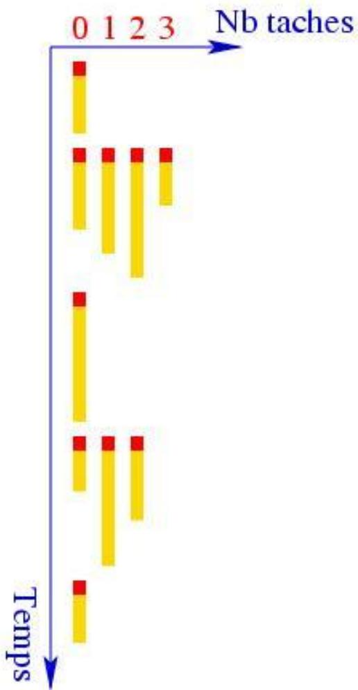

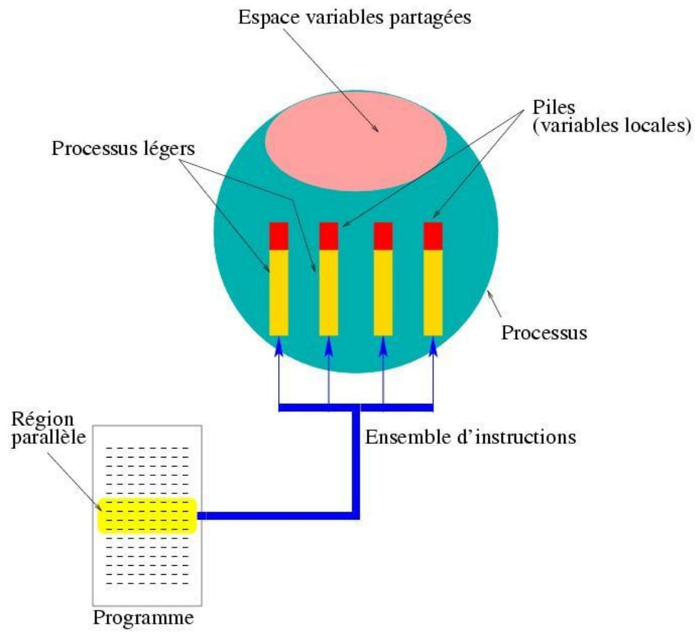

## Partage du travail

Le partage du travail consiste a :

- Repartir les iterations d'une boucle
- Executer des sections de code differentes
- Executer des taches explicites

工作共享包括循环划分、并行段落、显式任务。

Boucle parallele (loop-level parallelism).

循环级并行。

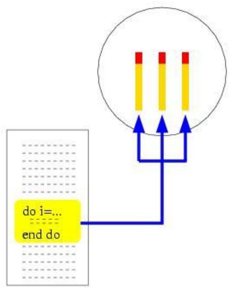

Sections paralleles.

并行section。

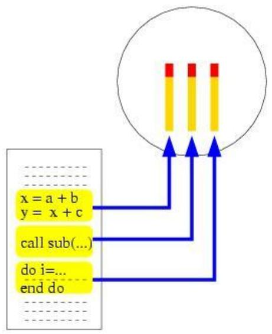

Procedure parallele (orphaning).

过程并行（orphaning）。

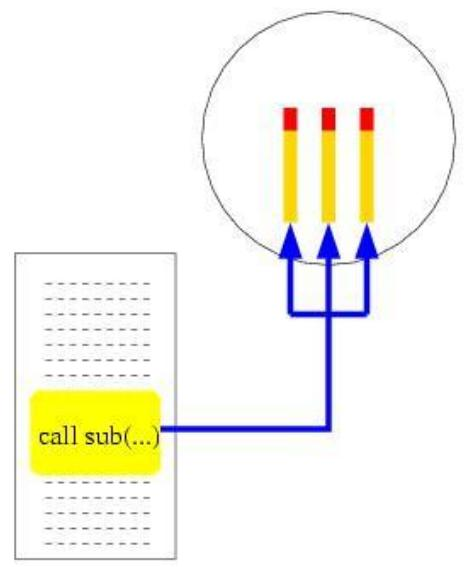

## Placement des threads

Les threads sont souvent affectes aux processeurs par l'OS. Selon la machine, le placement peut etre optimal (1 thread par processeur) ou defavorable (tous les threads sur un seul processeur).

线程的调度依赖操作系统，可能理想也可能低效。

Pour ameliorer, on peut controler l'ordonnancement via le runtime OpenMP.

可通过运行时与环境变量调整调度策略。

## Directives et environnement

- Directives/clauses de compilation : region parallele, partage du travail, synchronisation, flot de donnees...
- Elles sont ignorees sans option de compilation adequates.
- Fonctions OpenMP : bibliotheque liee a l'edition de liens.
- Variables d'environnement : influence a l'execution.

OpenMP由编译指令、运行库与环境变量构成，需编译器开启支持。

## Compilation

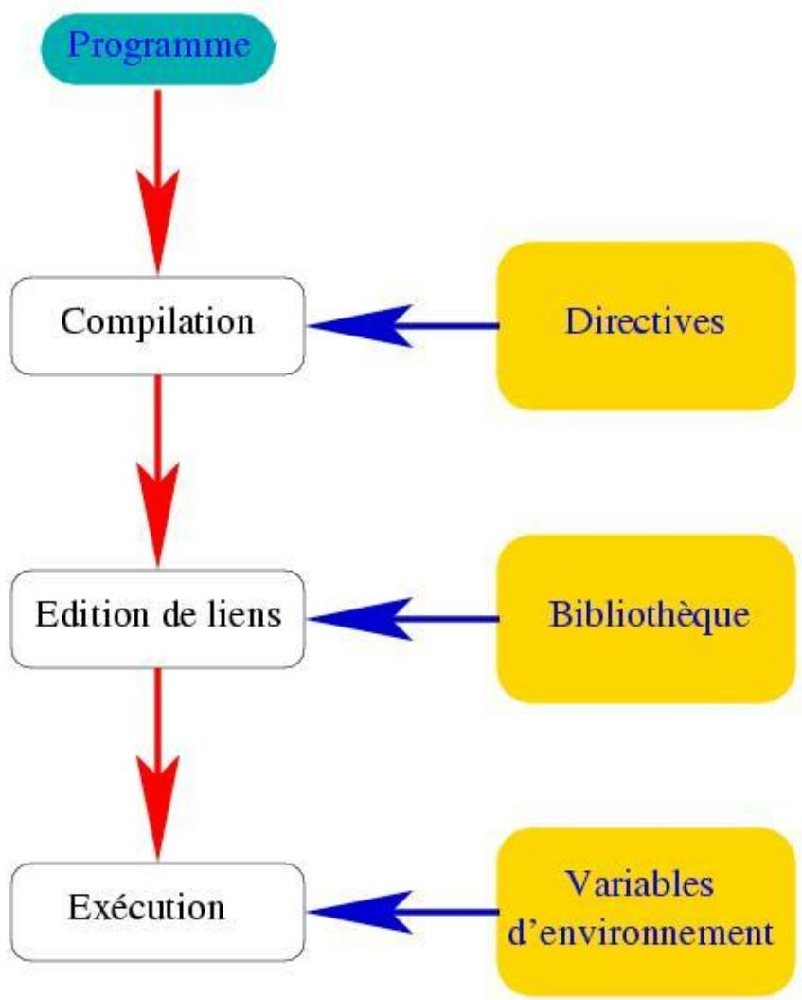

## Comparaison MPI/OpenMP

- Modeles complementaires.
- Interfaces Fortran/C/C++.
- MPI : multiprocessus, communication explicite.
- OpenMP : multitaches, communication implicite geree par le compilateur/runtime.

MPI和OpenMP互补；MPI显式通信，多进程；OpenMP线程并行、通信隐式。

MPI vise la memoire distribuee, OpenMP la memoire partagee. Dans un cluster multiprocesseur, la parallellisation hybride MPI+OpenMP peut etre avantageuse.

MPI适合分布式内存，OpenMP适合共享内存；在集群上可采用混合并行提升性能。

Lecture methodologique utile : MPI est souvent ecrit "parallelisme explicite puis synchronisation", alors qu'OpenMP part d'un code sequentiel qu'on enrichit progressivement de directives.

方法论上可这样理解：MPI 常是“先写显式并行、再补同步”；OpenMP 则通常从串行代码出发，逐步加并行指令。

## Programmation hybride

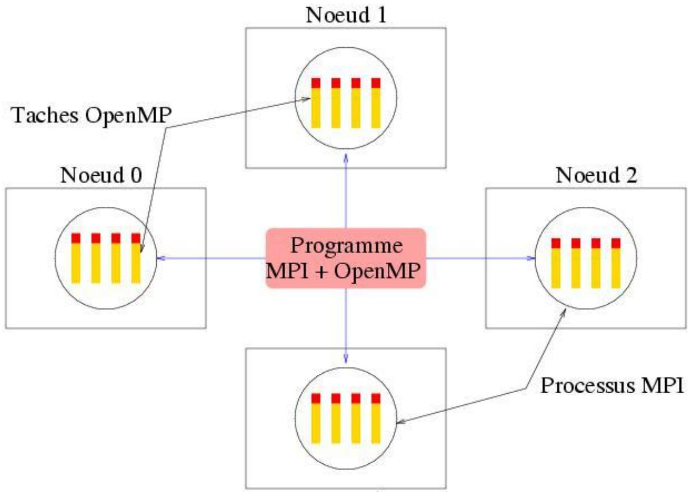

## Principe d'OpenMP (fork/join)

Le programmeur ajoute des directives OpenMP (ou parfois via un outil automatique). Le runtime cree une region parallele selon le modele fork/join.

程序员添加OpenMP指令，运行时按fork/join模型创建并行区。

A l'entree d'une region parallele, le thread maitre fork des threads fils qui rejoignent (join) a la fin de la region.

进入并行区时主线程创建子线程，离开并行区时回收。

Entrer/sortir d'une region parallele a un cout runtime ; en pratique, il vaut mieux quelques regions paralleles larges que beaucoup de petites regions successives.

进入/退出并行区有运行时开销；实践上通常应优先“少量大并行区”，避免大量细碎并行区。

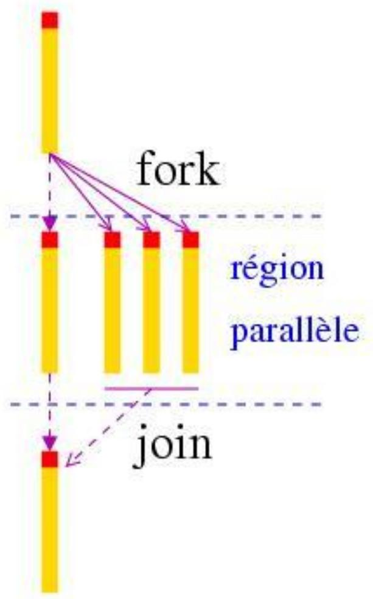

## Syntaxe generale

Une directive OpenMP a la forme :

- sentinelle directive [clause [clause] ...]

OpenMP指令由哨兵、指令与可选子句组成。

Sentinelles :

- C/C++ : #pragma
- Fortran : !$

C/C++用#pragma，Fortran用!$。

Inclure omp.h (C/C++) ou utiliser OMP.lib (Fortran) pour les fonctions OpenMP.

使用OpenMP函数需包含对应头文件或模块。

## Premier programme

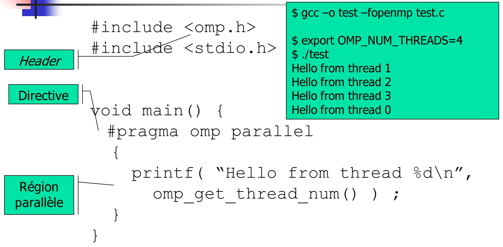

## Construction d'une region parallele

Dans une region parallele, tous les threads executent le meme code. Une barriere implicite existe a la fin.

并行区内线程执行相同代码，结束时有隐式屏障。

Il est interdit de sauter (GOTO, CYCLE, ...) vers l'interieur ou l'exterieur d'une construction OpenMP.

禁止跳转进入/离开OpenMP结构。

## Flot de donnees

### Second programme (exemple)

```c
#include <stdio.h>
#include <omp.h>

int main(void) {
    float a = 92290.0f;
    int p = 0;

    #pragma omp parallel
    {
    #ifdef _OPENMP
        p = omp_in_parallel();
    #endif
        printf("a vaut: %f; p vaut: %d\n", a, p);
    }
    return 0;
}
```

```txt
$ gcc -o prog -fopenmp prog.c
$ export OMP_NUM_THREADS=4
$ ./prog
```

示例展示并行区内变量共享与线程运行状态。

### Donnees partagees par defaut

Dans une region parallele, les variables sont partagees par defaut. La clause DEFAULT permet de changer ce statut.

并行区内变量默认共享，可用DEFAULT调整。

Si une variable est PRIVATE, elle est locale a chaque thread et sa valeur est indeterminee a l'entree.

PRIVATE变量为线程私有，进入并行区时值不确定。

Regle minimale de robustesse : commencer avec `default(none)` puis annoter explicitement `shared/private/firstprivate`; pour les statiques, utiliser `threadprivate` et `copyin` selon le besoin.

最小稳健规则：先用 `default(none)`，再显式标注 `shared/private/firstprivate`；静态变量按需要配合 `threadprivate` 与 `copyin`。

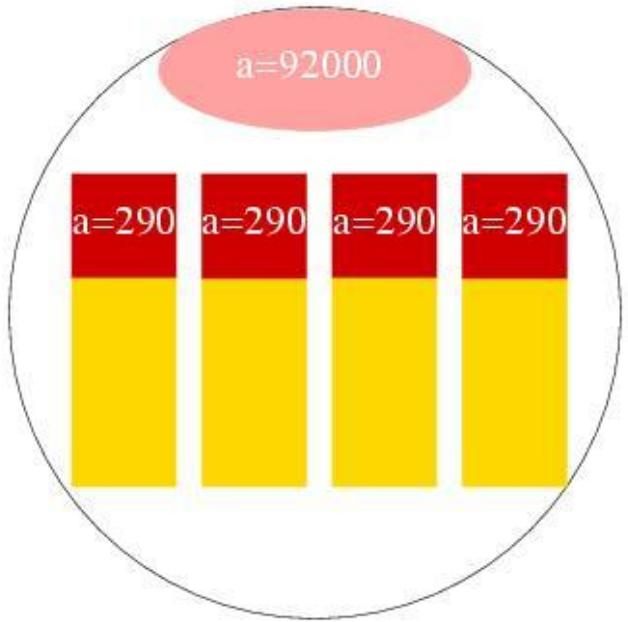

### Donnees privees

```c
#include <stdio.h>
#include <omp.h>

int main(void) {
    float a = 92000.0f;
    printf("Out region: %p\n", (void *)&a);

    #pragma omp parallel
    printf("In region: %p thread %d\n", (void *)&a, omp_get_thread_num());

    return 0;
}
```

未使用private时，变量地址一致，表示共享。

```c
#include <stdio.h>
#include <omp.h>

int main(void) {
    float a = 92000.0f;
    printf("Out region: %p\n", (void *)&a);

    #pragma omp parallel private(a)
    printf("In region: %p thread %d\n", (void *)&a, omp_get_thread_num());

    return 0;
}
```

使用private后，各线程拥有不同地址。

### Donnees privees initialisees (FIRSTPRIVATE)

FIRSTPRIVATE permet d'initialiser la variable privee avec la valeur avant la region parallele.

FIRSTPRIVATE让私有变量从进入并行区前的值初始化。


```c
#include <stdio.h>
#include <omp.h>

int main(void) {
    float a = 92000.0f;

    #pragma omp parallel default(none) firstprivate(a)
    {
        a = a + 290.0f;
        printf("a vaut: %f\n", a);
    }

    printf("Hors region, a vaut: %f\n", a);
    return 0;
}
```

并行区内的a由原值初始化并独立更新。

## Etendue d'une region parallele

L'etendue d'une construction OpenMP est le champ d'influence de cette construction : code lexical (statique) + sous-programmes appeles (dynamique).

并行区的影响范围包括静态代码块及其调用的子程序。

### Exemple

```c
#include <stdio.h>
#include <omp.h>

void sub(void) {
    int p = 0;
    #ifdef _OPENMP
    p = omp_in_parallel();
    #endif
    printf("Parallele ? : %d\n", p);
}

int main(void) {
    #pragma omp parallel
    {
        sub();
    }
    return 0;
}
```

在并行区内调用的子程序也处于并行上下文。

Dans un sous-programme appele dans une region parallele, les variables locales sont implicitement privees.

子程序中的局部变量默认私有。

## Transmission par argument

Les variables passees par reference heritent du statut defini dans l'etendue lexicale.

按引用传参变量继承其在外部的共享/私有属性。

Passage par valeur (`x`) copie la valeur du thread appelant ; passage par adresse (`*y`) expose une ecriture potentielle dans l'objet pointe, donc la correction depend du statut partage/prive de cet objet.

按值传参（`x`）复制调用线程的当前值；按地址传参（`*y`）可能写入被指向对象，其正确性取决于该对象是共享还是私有。

```c
#include <stdio.h>
#include <omp.h>

void sub(int x, int *y) {
    *y = x + omp_get_thread_num();
}

int main(void) {
    int a = 92000, b = 0;
    #pragma omp parallel shared(a) private(b)
    {
        sub(a, &b);
        printf("b vaut: %d\n", b);
    }
    return 0;
}
```

示例中a共享、b私有，子程序按引用更新b。

## Variables statiques

Les variables statiques (C static/externe, Fortran COMMON/MODULE/SAVE) sont partagees par defaut.

静态变量默认共享。

```c
#include <stdio.h>
#include <omp.h>

float a;

void sub(void) {
    float b = a + 290.0f;
    printf("b vaut: %f\n", b);
}

int main(void) {
    a = 92000;
    #pragma omp parallel
    {
        sub();
    }
    return 0;
}
```

静态变量a在各线程中共享。

### THREADPRIVATE et COPYIN

THREADPRIVATE permet de privatiser une variable statique et de la rendre persistante entre regions paralleles.

THREADPRIVATE可让静态变量在每个线程中私有且跨并行区保持。

COPYIN copie la valeur d'une variable statique vers chaque thread a l'entree d'une region parallele.

COPYIN在进入并行区时将值拷贝到各线程。

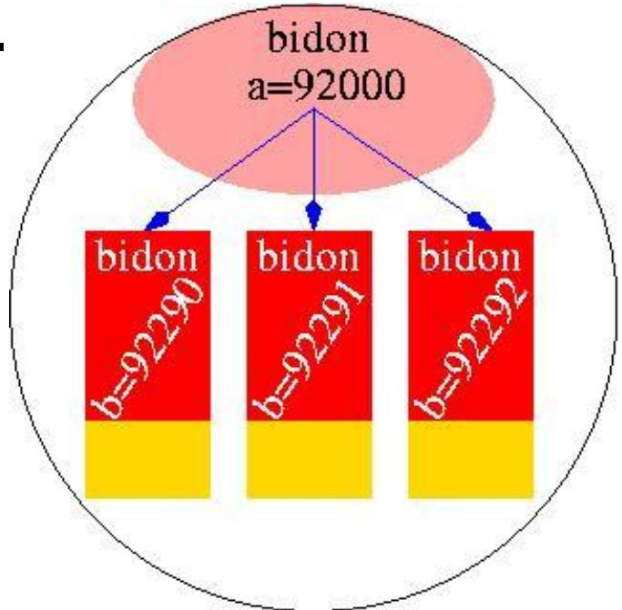

```c
#include <stdio.h>
#include <omp.h>

int a;
#pragma omp threadprivate(a)

void sub(void) {
    int b;
    #pragma omp parallel copyin(a)
    {
        b = a + 290;
        printf("b vaut: %d\n", b);
        a = a + omp_get_thread_num();
    }
}

int main(void) {
    a = 92000;
    sub();
    printf("Hors region, a vaut: %d\n", a);
    return 0;
}
```

示例展示threadprivate与copyin的行为。

## Allocation dynamique

L'allocation/desallocation peut etre faite dans une region parallele. Si la variable est privee, chaque thread a sa propre zone. Si elle est partagee, il vaut mieux qu'un seul thread alloue/libere.

动态内存可在并行区内进行；共享数据最好由单线程管理。

Sur machine NUMA, l'initialisation parallele des tableaux partages est souvent preferable a une initialisation sequentielle (effet "first-touch" et meilleure localite memoire).

在 NUMA 机器上，共享数组通常应并行初始化而非串行初始化（利用 first-touch，改善内存局部性）。

```c
#include <stdio.h>
#include <stdlib.h>
#include <omp.h>

int main(void) {
    int n = 1024, nb_taches = 4;
    int debut, fin, rang, i;
    float *a = (float *)malloc(n * nb_taches * sizeof(float));

    #pragma omp parallel default(none) private(debut, fin, rang, i) shared(a, n)
    {
        rang = omp_get_thread_num();
        debut = rang * n;
        fin = (rang + 1) * n;
        for (i = debut; i < fin; i++) {
            a[i] = 92291.0f + (float)i;
        }
        printf("Rang:%d; A[%04d]...A[%04d]: %.0f...%.0f\n", rang, debut, fin - 1, a[debut], a[fin - 1]);
    }

    free(a);
    return 0;
}
```

示例展示共享数组在并行区内按块写入。

## Complements

Une region parallele accepte :

- REDUCTION : reduction avec synchronisation implicite
- NUM_THREADS : fixe le nombre de threads

并行区常见子句包括reduction与num_threads。

On peut rendre le nombre de threads dynamique via OMP_SET_DYNAMIC ou OMP_DYNAMIC=true. Les regions paralleles peuvent etre imbriquees si OMP_SET_NESTED ou OMP_NESTED=true.

线程数可动态调整，支持嵌套并行（需启用）。

```c
#include <stdio.h>
#include <omp.h>

int main(void) {
    int rang;

    #pragma omp parallel private(rang) num_threads(3)
    {
        rang = omp_get_thread_num();
        printf("Mon rang dans region 1 : %d\n", rang);

        #pragma omp parallel private(rang) num_threads(2)
        {
            rang = omp_get_thread_num();
            printf("Mon rang dans region 2 : %d\n", rang);
        }
    }
    return 0;
}
```

示例展示嵌套并行与num_threads。

## Synchronisations

La synchronisation est necessaire pour :

1) attendre que toutes les taches atteignent un meme point (barriere globale)
2) ordonner l'acces a des donnees partagees (exclusion mutuelle)
3) synchroniser un sous-ensemble de taches (verrous)

同步用于屏障、互斥与局部同步。

On peut utiliser BARRIER, ATOMIC, CRITICAL, REDUCTION, DO ORDERED, FLUSH, ou les verrous de la bibliotheque OpenMP.

OpenMP提供屏障、原子、临界区、排序、flush和锁等机制。

## Barriere

Chaque construction OpenMP a une barriere implicite en fin. La directive BARRIER synchronise toutes les taches d'une equipe.

大多数结构在末尾有隐式屏障，BARRIER可显式同步。

```c
#pragma omp barrier
```

所有线程在此等待彼此。

## Mise a jour atomique

La directive ATOMIC garantit qu'une variable partagee est lue/modifiee par une seule tache a la fois.

ATOMIC保证对共享变量的原子更新。

```c
#pragma omp atomic
compteur++;
```

仅对紧随其后的语句生效。

```c
#include <stdio.h>
#include <omp.h>

int main(void) {
    int compteur = 92290;
    int rang;

    #pragma omp parallel private(rang)
    {
        rang = omp_get_thread_num();
        #pragma omp atomic
        compteur++;
        printf("Rang:%d; compteur vaut:%d\n", rang, compteur);
    }

    printf("Au total, compteur vaut:%d\n", compteur);
    return 0;
}
```

示例展示原子自增。

L'instruction atomique doit avoir des formes precises (x = x op exp, etc.).

原子操作只支持特定形式。

Quand l'operation est une mise a jour elementaire d'une variable, `ATOMIC` est generalement preferable a `CRITICAL` (moins de serialisation).

当操作是单变量的基础更新时，`ATOMIC` 通常优于 `CRITICAL`（串行化更少）。

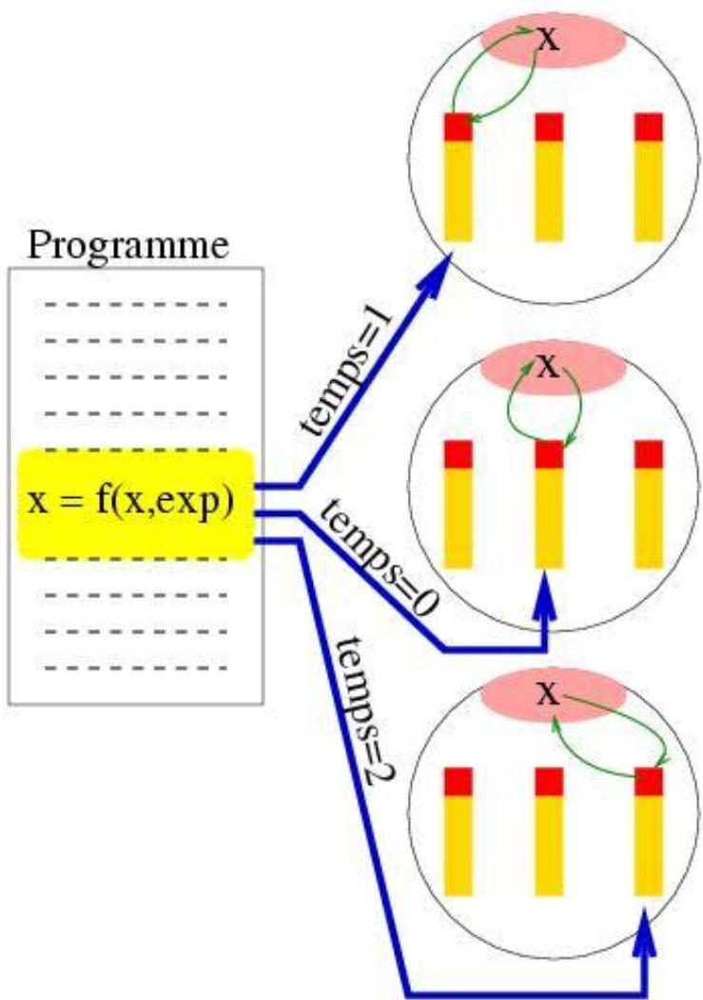

## Regions critiques

Une region critique est une generalisation de ATOMIC : une seule tache execute la section a la fois.

临界区更通用，一次只允许一个线程进入。

`CRITICAL` est plus expressif (plusieurs instructions), mais son cout peut etre plus eleve ; garder la section critique la plus courte possible.

`CRITICAL` 表达力更强（可包含多条语句），但开销通常更高；临界区应尽量短小。

```c
#pragma omp critical
```

临界区可命名，但性能一般不如原子。

```c
#include <stdio.h>
#include <omp.h>

int main(void) {
    int s = 0, p = 1;

    #pragma omp parallel
    {
        #pragma omp critical
        {
            s++;
            p *= 2;
        }
    }

    printf("Somme et produit finaux: %d, %d\n", s, p);
    return 0;
}
```

示例展示critical保护共享变量。

## Directive FLUSH

FLUSH force la coherence des variables partagees en memoire globale. Utile avec une hierarchie de cache et pour des points de synchronisation fins.

FLUSH用于刷新共享变量，确保可见性。

En pratique courante, `barrier/atomic/critical` couvrent la plupart des besoins ; `FLUSH` reste un outil de coherence plus bas niveau, a utiliser avec precision.

在常见实践中，`barrier/atomic/critical` 已覆盖大多数需求；`FLUSH` 更偏底层一致性工具，应精确使用。

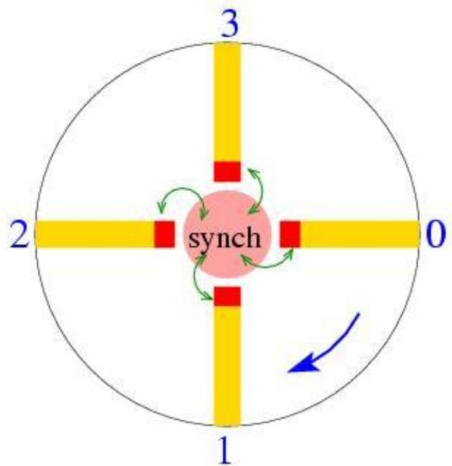

## Resume

- Modele parallele a memoire partagee base sur directives
- Gestion implicite des threads
- OpenMP 4.0 : parallelisme de donnees et de taches
- Flot de donnees controle par le programmeur
- Mecanismes de synchronisation varies

OpenMP是基于指令的共享内存并行模型，线程管理隐式，支持任务与数据并行，提供多种同步机制。
