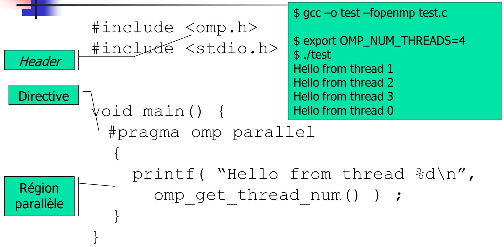

# Programmation parallele et distribuee

并行与分布式编程。

## Cours 9 : Partage de travail en OpenMP

课程9：OpenMP中的工作共享。

### Auteurs

- Patrick Carribault
- David Dureau
- Marc Perange (marc.perache@cea.fr)

作者：Patrick Carribault、David Dureau、Marc Perange（marc.perache@cea.fr）。

## Introduction

- Programmation a memoire partagee
- Modele OpenMP : directives + bibliotheque + variables d'environnement
- Modele fork/join
- Par defaut, le code est sequentiel
- Directives pour entrer dans une region parallele
- Regles strictes de flot de donnees (shared par defaut, private avec/sans initialisation)
- Synchronisations

本课回顾共享内存与OpenMP的fork/join模型，默认串行，依靠指令进入并行区，并强调数据可见性与同步规则。



## Plan du cours 9

- Partage de travail
- Boucle parallele
- Multiples sections
- Exclusion de travail
- Single/Master
- Performances
- Mesure de temps
- Loi d'Amdahl

课程大纲：工作共享、并行循环、并行分段、排他执行、Single/Master、性能与Amdahl定律。

## Partage du travail

La construction d'une region parallele ne suffit pas : le programmeur doit aussi repartir le travail et les donnees, et assurer la synchronisation.

仅创建并行区不够，还需手动划分任务与数据并进行同步。

OpenMP fournit les directives FOR et SECTIONS pour controler la repartition et la synchronisation.

OpenMP提供FOR与SECTIONS指令便于划分工作并管理同步。

Il existe aussi des constructions d'exclusion (SINGLE/MASTER) pour faire executer une portion de code par une seule tache.

还提供SINGLE/MASTER等排他执行机制。

Attention : le partage de travail suppose que les portions de code sont independantes ; ni le compilateur ni le runtime ne verifient la parallelisabilite.

注意：代码段必须可并行，否则不会自动检测依赖关系。

## Boucle parallele

La directive FOR/DO repartit les iterations d'une boucle (ou d'un nid de boucles parfaitement imbriquees).

FOR/DO将循环迭代分配给线程。

Restrictions : pas de boucles irregulieres, indices entiers, structure reguliere.

循环需结构规则，索引为整数。

Le mode de repartition est controle par la clause SCHEDULE (defaut dependant de l'implementation). NOWAIT supprime la barriere implicite de fin.

SCHEDULE控制分配策略，NOWAIT可去除隐式屏障。

### Exemple

```c
#include <stdio.h>
#include <omp.h>

int main(void) {
    int N = 10;

    #pragma omp parallel
    {
        int i;
        #pragma omp for schedule(static)
        for (i = 0; i < N; i++) {
            printf("Thread %d running iteration %d\n", omp_get_thread_num(), i);
        }
    }
    return 0;
}
```

```txt
$ gcc -fopenmp -o prog prog.c
$ OMP_NUM_THREADS=4 ./prog
```

示例展示静态分配下的循环并行。

## Ordonnancement statique

STATIC divise les iterations en paquets (chunks) d'une taille donnee, distribues cycliquement aux threads.

STATIC按chunk划分并轮转分配给线程。


### Exemple : chunk = 1

```c
#pragma omp for schedule(static, 1)
for (i = 0; i < N; i++) {
    printf("Thread %d running iteration %d\n", omp_get_thread_num(), i);
}
```

chunk=1时迭代按轮转方式分发。

### Exemple : chunk = 2

```c
#pragma omp for schedule(static, 2)
for (i = 0; i < N; i++) {
    printf("Thread %d running iteration %d\n", omp_get_thread_num(), i);
}
```

chunk=2时每次分配两次迭代。

Compromis important : petits chunks -> meilleur equilibrage mais plus de cout d'ordonnancement ; gros chunks -> moins d'overhead mais risque de desequilibre.

关键折中：小 chunk 负载更均衡但调度开销更高；大 chunk 调度开销更低但更容易失衡。

Dans certains kernels, choisir une taille de chunk coherente avec la localite memoire et la vectorisation peut ameliorer la performance.

在某些内核中，选择与内存局部性和向量化匹配的 chunk 大小可进一步提升性能。

## Clause schedule

On peut deferer le choix de l'ordonnancement via OMP_SCHEDULE ou omp_set_schedule().

可通过环境变量或API动态调整调度策略。

Le choix du schedule et la taille des chunks influencent l'equilibrage de charge.

调度方式与chunk大小直接影响负载均衡。

En pratique : `static` est souvent le plus faible cout quand les iterations ont un cout proche ; `dynamic` aide si la charge est irreguliere ; `guided` cherche un compromis entre les deux.

实践上：迭代代价接近时 `static` 通常开销最低；负载不规则时 `dynamic` 更稳；`guided` 常作为两者折中。

### DYNAMIC

Les iterations sont decoupees en paquets ; un thread recupere un nouveau paquet des qu'il a fini le precedent.

DYNAMIC按需分配，线程完成后再领取新的块。

Attention : le gain d'equilibrage s'accompagne d'un surcout runtime (prise de nouveaux paquets plus frequente).

注意：动态调度的均衡收益伴随额外运行时开销（更频繁地领取新任务块）。

```txt
$ export OMP_SCHEDULE="DYNAMIC,480"
$ export OMP_NUM_THREADS=4
```


### GUIDED

Les paquets diminuent progressivement ; la taille reste au-dessus d'un minimum (sauf dernier paquet).

GUIDED按递减chunk分配，末尾可能更小。

GUIDED commence avec de gros paquets puis affine, ce qui reduit souvent le cout de planification par rapport a un `dynamic` a tres petits chunks.

GUIDED 先分大块后细化，通常比“极小 chunk 的 dynamic”有更低调度成本。

```txt
$ export OMP_SCHEDULE="GUIDED,256"
$ export OMP_NUM_THREADS=4
```


## Execution ordonnee

On peut executer une partie de la boucle dans l'ordre sequentiel avec ORDERED, utile pour le debug ou les I/O.

ORDERED可保证部分代码按迭代顺序执行，常用于调试或I/O。

```c
#include <stdio.h>
#include <omp.h>

#define N 9

int main(void) {
    int i;

    #pragma omp parallel
    {
        #pragma omp for schedule(runtime) ordered nowait
        for (i = 0; i < N; i++) {
            #pragma omp ordered
            {
                printf("Rang: %d; iteration: %d\n", omp_get_thread_num(), i);
            }
        }
    }
    return 0;
}
```

ORDERED代码块按迭代顺序执行。

`ordered` reintroduit une partie de serialisation ; a reserver aux besoins de reproductibilite d'ordre (trace, I/O, debug), pas au chemin de calcul principal.

`ordered` 会重新引入串行化；应限于顺序可复现需求（日志/I-O/调试），不宜放在主计算路径。

## Reduction

Une reduction est une operation associative appliquee a une variable partagee (arithmetique, logique, ou fonctions intrinseques).

归约是在共享变量上做结合性运算（算术、逻辑或内建函数）。

Chaque tache calcule une valeur partielle puis OpenMP combine les resultats.

每个线程先算局部结果，再由OpenMP合并。

Pour les flottants, l'ordre de combinaison peut changer selon l'ordonnancement ; de faibles differences numeriques par rapport au sequentiel sont normales.

对浮点归约而言，合并顺序会随调度变化；与串行结果出现小幅数值差异属于正常现象。

```c
#include <stdio.h>

#define N 5

int main(void) {
    int i, s = 0, p = 1, r = 1;

    #pragma omp parallel
    {
        #pragma omp for reduction(+:s) reduction(*:p,r)
        for (i = 0; i < N; i++) {
            s = s + 1;
            p = p * 2;
            r = r * 3;
        }
    }

    printf("s = %d ; p = %d ; r = %d\n", s, p, r);
    return 0;
}
```

示例中s做加法归约，p与r做乘法归约。

## Flot de donnees et clauses

La construction FOR accepte :

- PRIVATE : variable privee
- FIRSTPRIVATE : initialise a la valeur avant la region
- LASTPRIVATE : conserve la valeur calculee par la derniere iteration

FOR支持PRIVATE/FIRSTPRIVATE/LASTPRIVATE用于控制变量可见性与初值。

## Region combinee

PARALLEL FOR fusionne PARALLEL et FOR et ne peut pas utiliser NOWAIT (barriere implicite incluse).

PARALLEL FOR合并了并行区与循环，并包含隐式屏障。

Si l'on veut enchaîner plusieurs boucles sans attendre entre elles, preferer une region `parallel` externe et des `omp for nowait` internes.

若要在多段循环间去掉等待，应使用外层 `parallel` + 内层多个 `omp for nowait`，而不是 `parallel for` 组合指令。

## Nid de boucles (collapse)

Depuis OpenMP 3.0, la clause collapse(k) permet de repartir un nid de k boucles parfaitement imbriquees.

collapse(k)可以把k层完美嵌套循环展平分配。

Condition cle : le nid doit etre parfaitement imbrique (pas d'instruction intermediaire entre les boucles fusionnees), sinon `collapse` n'est pas applicable.

关键条件：循环必须是“完美嵌套”（被合并的循环之间不能夹杂语句），否则 `collapse` 不适用。

## Sections paralleles

Une section est executee par une seule tache. SECTIONS permet de definir plusieurs sections independantes.

SECTIONS将不同代码段分配给不同线程执行。

NOWAIT peut supprimer la barriere en fin de SECTIONS.

NOWAIT可去掉SECTIONS末尾同步。

```c
#pragma omp parallel num_threads(3)
{
    #pragma omp sections nowait
    {
        #pragma omp section
        {
            lecture_champ_initializer_x(a);
            printf("Tache %d : init champ en X\n", omp_get_thread_num());
        }
        #pragma omp section
        {
            lecture_champ_initializer_y(b);
            printf("Tache %d : init champ en Y\n", omp_get_thread_num());
        }
    }
}
```

示例中两段独立初始化分别由不同线程执行。

## Execution exclusive

Parfois on veut qu'une seule tache execute une portion de code. OpenMP fournit MASTER et SINGLE.

排他执行可用MASTER或SINGLE。

### MASTER

- Execute uniquement par la tache maitre
- Pas de barriere implicite

MASTER仅主线程执行，且不带隐式屏障。

```c
#pragma omp parallel private(a)
{
    a = 92290.0f;
    #pragma omp master
    {
        a = -92290.0f;
    }
    printf("Rang:%d; a = %f\n", omp_get_thread_num(), a);
}
```

MASTER仅影响主线程，其他线程不会等待。

Usage typique : actions strictement reservees au thread maitre (journalisation centrale, interaction runtime specifique).

典型用途：仅允许主线程执行的动作（集中日志、特定运行时交互）。

### SINGLE

- Execute par une seule tache (non specifiee)
- Barriere implicite en fin, sauf NOWAIT

SINGLE由任意一个线程执行，默认带同步。

```c
#pragma omp parallel private(a)
{
    a = 92290.0f;
    #pragma omp single
    {
        a = -92290.0f;
    }
    printf("Rang:%d; a = %f\n", omp_get_thread_num(), a);
}
```

SINGLE由先到的线程执行。

Usage typique : initialisation unique d'une ressource partagee (allocation, lecture config), puis reprise collective apres la barriere implicite.

典型用途：共享资源的一次性初始化（分配、读取配置），并在隐式屏障后集体继续。

### COPYPRIVATE

COPYPRIVATE permet de diffuser des variables privees depuis la tache SINGLE vers les autres threads.

COPYPRIVATE可把SINGLE内私有变量的值广播到其他线程。

```c
#pragma omp parallel private(a)
{
    a = 92290.0f;
    #pragma omp single copyprivate(a)
    {
        a = -92290.0f;
    }
    printf("Rang:%d; a = %f\n", omp_get_thread_num(), a);
}
```

SINGLE执行完后将a的值复制给其他线程。

`copyprivate` est utile pour diffuser un resultat calcule une seule fois (par exemple un pointeur alloue dans `single`) vers toutes les copies privees.

`copyprivate` 适合广播“只计算一次”的结果（例如在 `single` 中分配得到的指针）到各线程私有副本。

## Quelques pieges

Si une variable shared est lue avant d'etre correctement synchronisee, on obtient une condition de course. Une barriere peut etre necessaire.

共享变量如果缺少同步会产生竞态，必要时加屏障。

```c
#pragma omp parallel default(none) shared(s)
{
    #pragma omp single
    { s = 1.0f; }
    printf("s = %f\n", s);
    s = 2.0f;
}
```

打印可能发生竞态，应考虑同步。

## Performances

Les performances dependent de l'architecture et de l'implementation OpenMP. Objectif : reduire le temps de restitution et estimer l'acceleration.

性能受硬件与实现影响，优化目标是减少运行时间并评估加速比。

### Regles de bonnes performances

1. Maximiser la taille des regions paralleles.
2. Adapter le nombre de threads a la taille du probleme.
3. Parallelliser la boucle la plus externe si possible.
4. Utiliser SCHEDULE(RUNTIME) pour ajuster dynamiquement.
5. SINGLE et NOWAIT peuvent reduire le temps au prix d'une synchronisation explicite.
6. ATOMIC/REDUCTION sont souvent plus performants que CRITICAL.
7. Utiliser IF pour parallelliser conditionnellement.
8. Eviter de parallelliser la dimension non contigue d'un tableau.

以上规则用于减少管理开销与内存访问代价。

### Exemple (boucle externe)

```c
#define N 1025

for (j = 0; j < N; j++)
    for (i = 0; i < N; i++)
        a[i][j] = (float)drand48();

#pragma omp parallel for schedule(runtime) if (N > 514)
for (j = 1; j < N - 1; j++)
    for (i = 0; i < N; i++)
        b[i][j] = a[i][j + 1] - a[i][j - 1];
```

示例强调并行外层循环以提高连续访问效率。

Les conflits de cache et l'organisation NUMA peuvent degrader les performances.

缓存冲突与NUMA会影响性能。

## Mesure du temps

OpenMP fournit :

- OMP_GET_WTIME : mesure du temps en secondes
- OMP_GET_WTICK : precision de la mesure

OpenMP提供计时函数与精度查询。

La mesure depend de la charge machine et de la repartition des threads.

测量受系统负载影响。

En pratique, mesurer plusieurs runs et comparer des medianes est plus robuste qu'une mesure unique.

实践中应进行多次测量并比较中位数，通常比单次计时更稳健。

## Acceleration (loi d'Amdahl)

L'acceleration est definie par S(Nt) = Ts / Tp. Avec Ts = ts + tp = 1 :

$$
S(Nt) = \frac{1}{ts + \frac{tp}{Nt}}
$$

Amdahl定律表明加速比受串行部分限制。

Lecture pratique : meme avec beaucoup de threads, une fraction sequentielle non negligeable fixe un plafond d'acceleration.

实践解读：即使线程很多，只要串行部分不可忽略，加速比上限就会被固定住。


## Resume

- OpenMP est un modele parallele a memoire partagee base sur fork/join.
- Le partage du travail se fait via FOR et SECTIONS.
- SINGLE/MASTER permettent l'execution exclusive.
- Les performances dependent du schedule, de la taille des regions et de l'architecture.

OpenMP通过工作共享和排他执行实现并行，性能依赖调度策略与硬件。
