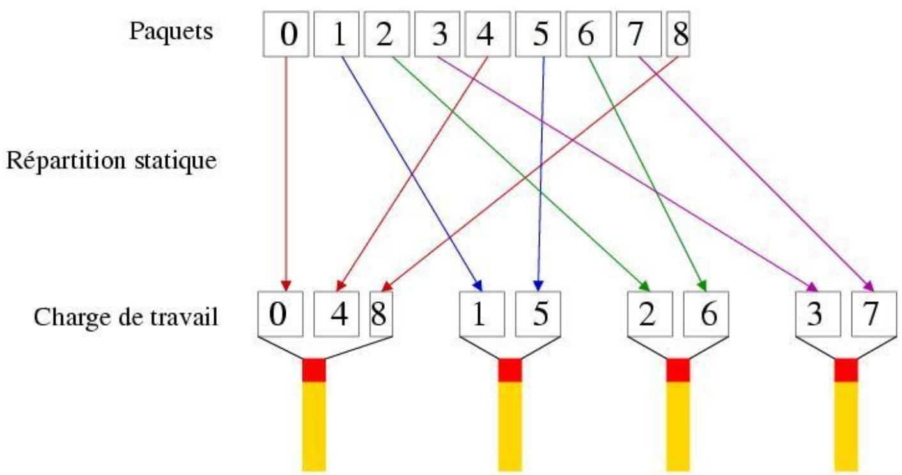
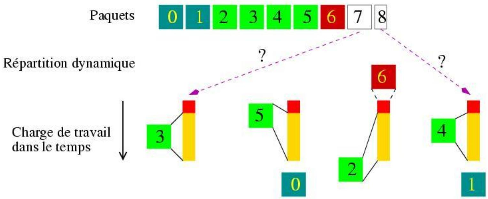
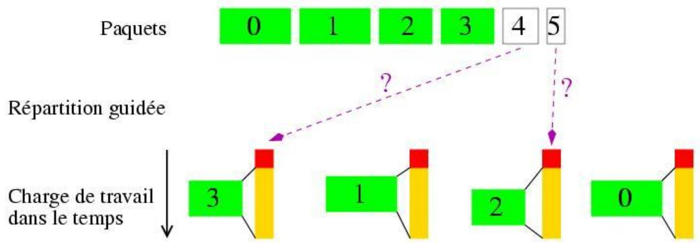
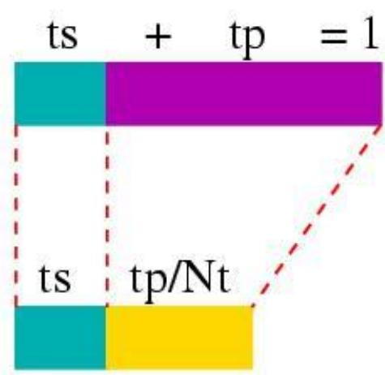
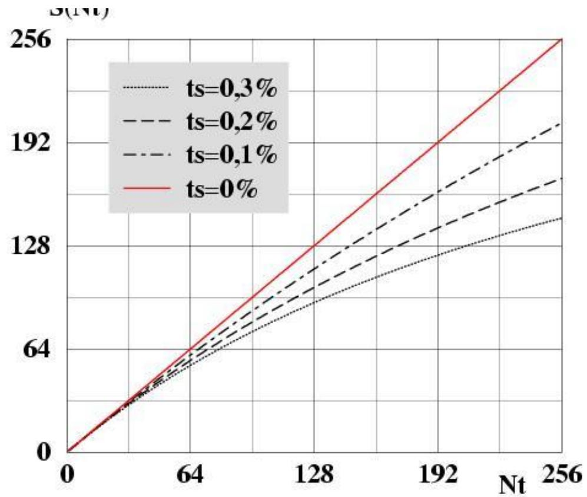

# pthread / OpenMP 课程总结

## Cours 6: POSIX Threads

### 6.1 共享内存模型的基本概念

- `thread`：进程内执行单元；共享代码段、全局数据、heap、映射内存。
- `process`：资源容器；不同进程默认不共享地址空间。
- 多线程程序里：线程共享大部分内存，但**每个线程有自己的 stack**。
- `critical section`：访问共享状态的代码区域；必须受保护。
- `preemption`：线程可能在任意时间被调度器打断，所以不能假设“几行代码一定连续执行完”。
- `busy waiting`：循环反复检查条件但不睡眠；简单但浪费 CPU。
- `reentrant`：函数可被并发调用而不会因共享内部状态出错。

### 6.2 分布式内存 vs 共享内存

- `distributed memory`：典型模型是 MPI；每个进程自己的地址空间。
- `shared memory`：典型模型是 Pthreads / OpenMP；线程共享地址空间。
- `hybrid`：节点间 MPI，节点内 threads；常见于多核集群。
- `SMP`：统一共享内存，多核访问同一物理内存。
- `NUMA`：仍是共享地址空间，但本地内存访问快于远端内存访问。

### 6.3 线程创建与结束

```c
int pthread_create(
    pthread_t *thread,                    // 输出：新线程标识
    const pthread_attr_t *attr,           // 线程属性；通常传 NULL
    void *(*start_routine)(void *),       // 线程入口函数
    void *arg                             // 传给线程入口的唯一参数
);

int pthread_join(
    pthread_t thread,                     // 要等待的线程
    void **retval                         // 可取回线程返回值；不关心可传 NULL
);

void pthread_exit(void *retval);          // 当前线程主动退出
int pthread_kill(pthread_t thread, int sig); // 给目标线程发送信号
```

- `pthread_create` 只允许传一个 `void *arg`；多个参数时应封装到结构体里。
- 主线程如果不 `join` 某个 joinable 线程，就拿不到它的完成状态。
- `pthread_join` 返回后，说明目标线程已经结束。

最短套路：

```c
void *thread_function(void *arg) {
    printf("Hello from thread!\n");
    return NULL;
}

int main(void) {
    pthread_t thread;
    pthread_create(&thread, NULL, thread_function, NULL); // 创建线程
    pthread_join(thread, NULL);                            // 等它结束
    return 0;
}
```

### 6.4 错误处理

- Pthreads / POSIX 接口通常约定：返回 `0` 表示成功，非 `0` 表示失败。
- 多线程程序里更要显式检查返回值，否则出错后现象会很乱。
- 错误信息优先打到 `stderr`。
- 调试多线程时，最好同时打印线程标识，避免日志无法归因。

### 6.5 `mutex`

mutex 保证同一时刻只有一个线程进入临界区。

```c
int pthread_mutex_init(pthread_mutex_t *mutex, const pthread_mutexattr_t *attr); //初始化，attr一般NULL
pthread_mutex_t mutex = PTHREAD_MUTEX_INITIALIZER; // 静态初始化（推荐）；只能用于全局或静态变量；
int pthread_mutex_lock(pthread_mutex_t *mutex);       // 阻塞直到拿到锁
int pthread_mutex_trylock(pthread_mutex_t *mutex);    // 不阻塞；成功返回 0
int pthread_mutex_unlock(pthread_mutex_t *mutex);
int pthread_mutex_destroy(pthread_mutex_t *mutex);
```

- 全局 mutex 常直接用 `PTHREAD_MUTEX_INITIALIZER`。
- `lock` / `unlock` 要尽量靠近，方便看清临界区边界。
- 同一共享状态的读写应遵循同一加锁纪律。
- `trylock` 失败不会阻塞；要显式处理失败分支。
- 临界区太大：并行度差；临界区太小：锁开销大。

最短例子：

```c
pthread_mutex_t mutex = PTHREAD_MUTEX_INITIALIZER;
int shared_data = 0;

void *thread_function(void *arg) {
    pthread_mutex_lock(&mutex);              // 进入临界区
    shared_data++;                           // 修改共享变量，shared_data 的访问受 mutex 保护
    pthread_mutex_unlock(&mutex);            // 离开临界区
    return NULL;
}
```

### 6.6 `semaphore`

semaphore 用一个计数器控制“最多允许多少个线程同时通过”。

```c
int sem_init(sem_t *sem, int pshared, unsigned int value); // value 是初值
int sem_destroy(sem_t *sem);
int sem_wait(sem_t *sem);      // 计数减 1；若当前为 0 则阻塞
int sem_trywait(sem_t *sem);   // 非阻塞尝试减 1
int sem_post(sem_t *sem);      // 计数加 1，并可能唤醒等待线程
```

### 6.7 `condition variable`

condition variable 用来“等某个条件变真”；它本身不保护数据，必须配合 mutex 使用。

```c
int pthread_cond_init(pthread_cond_t *cond, const pthread_condattr_t *attr);
int pthread_cond_destroy(pthread_cond_t *cond);
int pthread_cond_signal(pthread_cond_t *cond);      // 唤醒一个等待线程
int pthread_cond_broadcast(pthread_cond_t *cond);   // 唤醒所有等待线程
int pthread_cond_wait(
    pthread_cond_t *cond,
    pthread_mutex_t *mutex                          // wait 时会原子释放它；返回前再重新加锁
);
```

关键语义：

- `pthread_cond_wait(cond, mutex)` 会**原子地释放 mutex 并睡眠**。
- 被唤醒后，它会**重新拿回 mutex**，然后才返回。
- 因为可能有虚假唤醒 `spurious wakeup`，所以必须放在 `while` 循环里检查条件谓词。

最短套路：

```c
pthread_mutex_lock(&mutex);
while (!condition_ok) {                     // 不能写成 if
    pthread_cond_wait(&cond, &mutex);       // wait 期间自动释放 mutex
}
/* 这里条件成立，而且 mutex 已重新持有 */
pthread_mutex_unlock(&mutex);
```

## Cours 8: Introduction a OpenMP

### 8.1 OpenMP 是什么

- `OpenMP`：共享内存并行编程接口。
- 面向 `C/C++/Fortran`，核心由三部分组成：`directives (Compilation) + runtime library (Edition de liens) + environment variables (Execution)`。
- 典型定位：从串行代码出发，逐步加指令并行化。
- 线程由 OpenMP runtime 隐式创建和管理，不像 Pthreads 需要显式 `pthread_create`。
- 常与 MPI 组成混合并行：节点间 MPI，节点内 OpenMP。

### 8.2 fork/join 模型

- OpenMP 程序从一个主线程开始。
- 进入并行区时：主线程 `fork` 出一个线程团队。
- 离开并行区时：线程团队 `join` 回主线程。
- 进入/退出并行区有开销，所以应优先“少量大并行区”，避免很多碎小并行区。

### 8.3 最基本的并行区

- 常用运行库函数：
  - `omp_get_thread_num()` 当前线程在团队中的编号，范围 `[0, num_threads-1]`。
  - `omp_get_num_threads()` 当前并行区的线程总数。
  - `omp_in_parallel()` 是否处于并行区；主线程在并行区外时返回 `0`，在并行区内时返回 `1`。
- `#pragma omp parallel` 创建并行区；并行区内所有线程默认执行同一段代码。
- 并行区末尾默认有隐式 barrier。

禁止在并行区域或任何其他 OpenMP 构造的内部或外部进行跳转（例如 GOTO、CYCLE 等）。

### 8.4 线程数

- `OMP_NUM_THREADS` 在环境变量中控制默认线程数。
- 也可以在指令里写 `num_threads(n)` 指定某个并行区的线程数。
- `omp_set_num_threads(n)` 也可以在运行时设置默认线程数。

```c
#include <omp.h>

#pragma omp parallel num_threads(3) // 创建并行区；请求该并行区使用 3 个线程
{
    int tid = omp_get_thread_num();      // 当前线程号
    int in  = omp_in_parallel();         // 是否处于并行区
}   // 并行区结束，线程 join 回主线程（隐式 barrier）
```

### 8.5 数据作用域：`default` / `shared` / `private` / `firstprivate`

- 并行区里变量默认为 `shared`，通过 DEFAULT 子句，可以更改并行区域中变量的默认状态。default(none/shared/private/firstprivate)。
- `private(x)`：每个线程都有自己的 `x`，但进入并行区时值**没有被初始化**。
- `firstprivate(x)`：每个线程都有自己的 `x`，并用进入并行区前的值初始化。
- 最稳妥写法：`default(none)`（强制变量私有状态不再自动推断），然后显式写 `shared/private/firstprivate`。

```c
float a = 92000.0f;

#pragma omp parallel default(none) firstprivate(a)
{
    a = a + 290.0f;                     // 每个线程改的是自己的 a
    printf("a = %f\n", a);
}

printf("out = %f\n", a);               // 外面的 a 不变
```

### 8.6 作用域延伸、传参与静态变量

- 并行区的作用范围不只是花括号里的代码，也包括其中调用的子函数。
- 子函数里的局部变量仍是线程私有的。
- 按值传参：传入的是调用线程当前的那个值。
- 按地址传参：是否安全取决于被指对象是否在线程间共享，以及访问它时是否做了正确同步。
- `static` / 全局变量默认共享。

```c
int a; // 假设 a 是静态变量或全局变量
#pragma omp threadprivate(a)
```

- `threadprivate(a)`：把静态变量 `a` 变成“每线程一份”。
- `copyin(a)`：进入并行区时，把主线程当前 `a` 的值复制给其他线程自己的那份。

### 8.7 工作共享

- OpenMP 可做三类典型工作共享：并行循环 `for`/ 并行 sections / 显式 tasks
- 课程这里最核心还是：并行区 + 数据作用域 + 同步。
- 动态分配可以在并行区里做。如果操作涉及私有变量，该变量将在每个任务中保持局部作用域。如果操作涉及共享变量，则更稳妥的做法是由单个任务（例如主任务）负责执行该操作。
- 若共享数组要在 NUMA 机器上高效使用，通常应让各线程并行初始化自己负责的块，利用 `first-touch`。
- 可通过运行时函数 omp_set_dynamic() 或环境变量 OMP_DYNAMIC 调整并发线程数。
- 可以嵌套（nesting）平行区域，但默认不开启；要用 `omp_set_nested(1)` 或环境变量`OMP_NESTED = true`开启嵌套。
- `Reduction` 在并行构造中，为每个线程创建一个归约变量的私有副本，各线程先对自己的私有副本做局部计算，最后在构造结束时按指定操作把这些私有结果合并成一个最终结果。

```c
#pragma omp parallel for reduction(+:sum)
for (int i = 0; i < N; i++) {
    sum += a[i]; // 每个线程有自己的 sum，最后自动合并
}// 这里的 sum 必须在并行区外定义，且不能是 private 的
```

### 8.8 同步：`barrier`

```c
#pragma omp barrier
```

- `barrier`：团队中所有线程都到这里之后，才能继续往下走。
- 许多 OpenMP 构造末尾本来就有隐式 barrier。
- 只在确实需要“所有线程对齐”时再手工加 barrier。

### 8.9 同步：`atomic` vs `critical`

```c
#pragma omp atomic
compteur++;
```

- `atomic` 只保护紧跟着的一条“特定形式”的更新语句。
- 适合 `x++`、`x += y` 这类单变量简单更新。
- 粒度更小，通常比 `critical` 更轻。

```c
#pragma omp critical
{
    s++;
    p *= 2;
}
```

- `critical` 保护一个代码块。
- 表达力比 `atomic` 强，但串行化更重。
- 临界区应尽量短。

结论：

- 单变量简单更新：优先 `atomic`
- 多语句或复杂共享状态：用 `critical`

## Cours 9: Partage de travail en OpenMP

### 9.1 工作共享的目标

- 只创建并行区还不够；还要显式把循环或代码块分配给线程。
- 前提：被拆开的任务彼此独立；OpenMP 不会替你检查依赖关系。
- 最常用的工作共享构造：`for`、`sections`。
- 最常用的排他执行构造：`master`、`single`。

### 9.2 `omp for`

```c
#pragma omp parallel
{
    #pragma omp for schedule(static) // 每次分配一个迭代块给线程，默认块大小是迭代数除以线程数
    for (int i = 0; i < N; i++) {
        work(i);                         // 每次迭代只执行一次，由某个线程负责
    }                                    // 默认有隐式 barrier
}
```

- `omp for` 只负责“分配循环迭代”，不负责创建线程。
- 因此它要么写在并行区内部，要么使用组合指令 `parallel for`。
- 适用于规则循环：循环变量可分析、迭代空间明确。
- 若不想在循环末尾等待，可写 `nowait`。

### 9.3 `schedule`

chunk：迭代块大小。

| 策略 | 机制 | 图示 |
| --- | --- | --- |
| `static[,chunk]` | 预先把迭代块分给线程 |  |
| `dynamic[,chunk]` | 线程做完一块后再领下一块 |  |
| `guided[,chunk]` | 先大块后逐渐减小 |  |
| `runtime` | 运行时读取 `OMP_SCHEDULE` / `omp_set_schedule` | |

- `chunk` 小：负载更均衡，但 runtime 开销更高。
- `chunk` 大：调度开销更低，但更容易失衡。

### 9.4 `ordered`

```c
#pragma omp parallel                         // 创建线程团队
{
    #pragma omp for ordered nowait          // 分配循环迭代；允许内部 ordered；末尾不做隐式 barrier
    for (int i = 0; i < N; i++) {
        compute(i);                         // 这部分仍可并行执行，顺序不固定
        #pragma omp ordered
        printf("iteration %d\n", i);       // 只有这一小段按 i = 0,1,2,... 的顺序执行
    }
}
```

- `ordered` 允许循环体中的一小段代码按顺序执行。
- 常用于日志、I/O、调试。
- 会重新引入串行化，不应放在主计算路径上。

### 9.5 `reduction`

```c
#pragma omp parallel for reduction(+:sum)
for (int i = 0; i < N; i++) {
    sum += a[i];                        // 每线程先算自己的局部 sum，结束时再合并
}
```

- `reduction` = 每线程一份私有累积器，结束时按指定操作合并。
- 常见操作：`+`、`*`、`max`、`min`、逻辑与/或等。
- 浮点归约的合并顺序可能与串行不同，所以结果有微小差异是正常的。

omp for 也支持 private / firstprivate / lastprivate 等数据作用域子句。

- `private(x)`：每线程一份 `x`，但进入循环时不初始化。
- `firstprivate(x)`：每线程一份 `x`，初值来自进入并行区前。
- `lastprivate(x)`：循环结束后，把**逻辑上最后一次迭代**算出的 `x` 写回外部变量。

- `lastprivate` 关心的是“最后一个迭代值”，不是“最后结束的线程”。

### 9.6 `parallel for` 与 `nowait`

- `parallel for` = 创建线程团队 + 立刻分配循环迭代。
- 写法最短，但灵活性比“外层 `parallel` + 内层多个 `for`”小。
- 若要连续执行多段循环且不想每段都同步，更常见写法是：

```c
#pragma omp parallel
{
    #pragma omp for nowait
    for (...) { ... }

    #pragma omp for nowait
    for (...) { ... }
}
```

### 9.7 `collapse(k)`

```c
#pragma omp parallel for collapse(2)
for (int j = 0; j < ny; j++)
    for (int i = 0; i < nx; i++)
        b[i][j] = f(i, j);
```

- `collapse(k)` 把 `k` 层完美嵌套循环展平成一个大的迭代空间再分配。
- 关键前提：循环必须是“完美嵌套”；被合并的循环之间不能夹杂其他语句。
- 常用于单层循环迭代数不够大时增加并行粒度。

### 9.8 `sections`

```c
#pragma omp parallel sections
{
    #pragma omp section
    init_x();

    #pragma omp section
    init_y();
}
```

- `sections` 适合“几段彼此独立、但不是循环”的工作。
- 每个 `section` 只会被某一个线程执行一次。
- 末尾默认有隐式 barrier；可用 `nowait` 去掉。

### 9.9 `master` / `single` / `copyprivate`

| 构造 | 谁执行 | 末尾是否隐式 barrier | 典型用途 |
| --- | --- | --- | --- |
| `master` | 只有主线程 | 否 | 只允许主线程做的动作 |
| `single` | 任意一个先到线程 | 是，除非 `nowait` | 一次性初始化 |
| `single copyprivate(x)` | 一个线程执行，再把 `x` 复制给其他线程私有副本 | 是 | 广播一次性计算结果 |

```c
#pragma omp parallel private(a)
{
    #pragma omp single copyprivate(a)
    {
        a = init_once();                // 只执行一次
    }                                   // 结束后把 a 复制到其他线程各自的私有 a
}
```

### 9.10 性能、计时与 Amdahl

- 优先使用“少量大并行区”，减少 fork/join 开销。
- 迭代代价接近时优先 `static`；负载不均时再考虑 `dynamic/guided`。
- 能并行外层循环就优先并行外层，通常更利于连续内存访问。
- 简单更新优先 `atomic/reduction`，通常比 `critical` 更轻。
- 可用 `if` 子句只在问题规模足够大时再并行化。

```c
double t0 = omp_get_wtime();
work();
double t1 = omp_get_wtime();            // 墙钟时间（秒）
```

- `omp_get_wtime()`：返回墙钟时间。
- `omp_get_wtick()`：返回计时器精度。
- Amdahl 定律：若串行部分占比为 `ts`，并行部分占比为 `tp`，则

$$
S(N_t) = \frac{1}{t_s + \frac{t_p}{N_t}}
$$

- 结论：串行部分越大，可获得的最大加速比上限越低。



