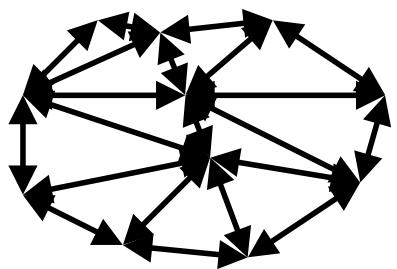

# Algorithmique et Programmation Parallèle TD 2 – Communications point-à-point non-bloquantes MPI / 并行算法与编程 TD 2 – 非阻塞点对点 MPI 通信

## Exercice I : Prise en main sur les communications non-bloquantes / 练习 I：非阻塞通信入门

**Question 1 :** compléter le programme `ini_nonblock/exercice/tantque.c` (/* TRAVAIL A FAIRE */) en utilisant des communications point-à-point non-bloquantes. / **问题 1：** 使用非阻塞点对点通信补全程序 `ini_nonblock/exercice/tantque.c`（/* TRAVAIL A FAIRE */）。

**Réponse / 答案：**

- Code de référence / 参考代码 : [ini_nonblock/correction/corr_tantque.c](ini_nonblock/correction/corr_tantque.c)
- `P1` poste un `MPI_Irecv`, effectue son travail dans une boucle, puis teste périodiquement l'arrivée du message avec `MPI_Test`. / `P1` 先提交一个 `MPI_Irecv`，然后在循环中继续工作，并通过 `MPI_Test` 周期性检查消息是否到达。
- L'idée est de ne pas bloquer `P1` en attente du message de `P0`, afin de faire du calcul utile en attendant. / 核心思想是不让 `P1` 因等待 `P0` 的消息而阻塞，从而在等待期间继续进行有用计算。

**Question 2 :** le programme `ini_nonblock/exercice/deadlock.c` présente un blocage. Résoudre ce blocage en utilisant des communications point-à-point non-bloquantes. / **问题 2：** 程序 `ini_nonblock/exercice/deadlock.c` 发生阻塞。使用非阻塞点对点通信解决该阻塞。

**Réponse / 答案：**

- Codes de référence / 参考代码 : [ini_nonblock/correction/corr1_deadlock.c](ini_nonblock/correction/corr1_deadlock.c), [ini_nonblock/correction/corr2_deadlock.c](ini_nonblock/correction/corr2_deadlock.c)
- Une solution consiste a remplacer `MPI_Ssend` par `MPI_Issend`, puis a effectuer la réception bloquante avant de terminer l'envoi avec `MPI_Wait`. / 一种解法是把 `MPI_Ssend` 改成 `MPI_Issend`，然后先执行阻塞接收，最后用 `MPI_Wait` 完成发送。
- Une autre solution totalement non bloquante consiste a poster `MPI_Issend` et `MPI_Irecv`, puis a appeler `MPI_Waitall` sur les deux requêtes. / 另一种完全非阻塞的解法是同时提交 `MPI_Issend` 和 `MPI_Irecv`，再对两个请求调用 `MPI_Waitall`。

## Exercice II : MPI_Waitall / 练习 II：MPI_Waitall

Ouvrir le fichier `exo_waitall/exo_waitall.c`. Lire le travail à effectuer /* TRAVAIL A EFFECTUER */.
打开文件 `exo_waitall/exo_waitall.c`，阅读需完成的内容 /* TRAVAIL A EFFECTUER */。

Principe général du programme à écrire :
待编写程序的总体原则：

- le processus de rang 0 doit remplir et envoyer des tableaux à tous les processus de rangs impairs (les tableaux sont construits à partir de la fonction `fill_val_array`, pour plus de détails lire le fichier `exo_waitall.c`)
进程号为 0 的进程需要填充并向所有奇数号进程发送数组（数组由函数 `fill_val_array` 构造，详情参见 `exo_waitall.c`）
- chaque processus impair doit recevoir le tableau que lui envoie le processus 0 et appelle la fonction `check_val_array` pour vérifier que le contenu est bien correct
每个奇数号进程需要接收 0 号进程发送的数组，并调用 `check_val_array` 检查内容是否正确

**Question 1 :** Terminer le programme en effectuant uniquement des communications non-bloquantes. Pour ce faire, le processus 0 doit utiliser la fonction `MPI_Waitall`. / **问题 1：** 仅使用非阻塞通信完成程序。为此，0 号进程必须使用 `MPI_Waitall` 函数。

**Réponse / 答案：**

- Code de référence / 参考代码 : [exo_waitall/correction/correct_waitall.c](exo_waitall/correction/correct_waitall.c)
- Côté `P0`, il faut utiliser un buffer distinct et une requête distincte par envoi non bloquant, puis terminer toutes les requêtes avec `MPI_Waitall`. / 在 `P0` 一侧，每个非阻塞发送都必须使用独立的数据缓冲区和独立的请求对象，最后再用 `MPI_Waitall` 完成全部请求。
- Côté processus impairs, on peut poster un `MPI_Irecv` puis faire `MPI_Wait` avant la vérification. / 在奇数号进程一侧，可以先提交 `MPI_Irecv`，然后在校验前调用 `MPI_Wait`。

**Question 2 :** Quelle est la signification du `MPI_Waitall` pour le processus 0 ? Au choix : / **问题 2：** 对于 0 号进程，`MPI_Waitall` 的含义是什么？请选择：

a) barrière sur tous les processus ?
在所有进程上的屏障？

b) ou bien attente de tous les processus impairs ?
或者等待所有奇数号进程？

c) ou bien attente de la fin de tous les envois vers les processus impairs ?
或者等待向所有奇数号进程的发送全部结束？

**Réponse / 答案：**

- Bonne réponse / 正确答案 : `c)`
- `MPI_Waitall` n'est pas une barrière globale. Pour `P0`, cela signifie que toutes ses requêtes d'envoi non bloquant sont terminées localement et que les buffers d'envoi peuvent être réutilisés. / `MPI_Waitall` 不是全局屏障。对 `P0` 来说，它表示本地提交的全部非阻塞发送请求已经完成，因此发送缓冲区可以安全复用。

**Question 3 :** L’appel à `MPI_Waitall` par le processus 0 est-il obligatoire ? / **问题 3：** 0 号进程调用 `MPI_Waitall` 是否必须？

**Réponse / 答案：**

- `MPI_Waitall` lui-meme n'est pas la seule option possible en MPI, mais il faut obligatoirement terminer toutes les requêtes non bloquantes d'une manière ou d'une autre (`MPI_Wait`, `MPI_Waitall`, `MPI_Test`, etc.). / 从 MPI 语义上说，`MPI_Waitall` 本身不是唯一选项，但所有非阻塞请求都必须通过某种方式完成，例如 `MPI_Wait`、`MPI_Waitall`、`MPI_Test` 等。
- Dans cet exercice precis, comme l'enonce demande explicitement `MPI_Waitall` pour `P0`, la reponse attendue est oui dans le cadre du TD. / 但在本题中，题目明确要求 `P0` 使用 `MPI_Waitall`，因此按 TD 预期答案来说应视为必须。

**Question 4 :** Pour les processus impairs, / **问题 4：** 对于奇数号进程，

1. est-il possible d’utiliser uniquement des réceptions bloquantes ?
是否可以只使用阻塞式接收？
2. Dans notre cas de figure, utiliser des réceptions bloquantes est-il aussi performant que des réceptions non-bloquantes ? Justifier
在本场景下，使用阻塞式接收是否与非阻塞式接收一样高效？请说明理由。

**Réponse / 答案：**

1. Oui. Code de référence / 参考代码 : [exo_waitall/correction/correct_recv.c](exo_waitall/correction/correct_recv.c)
2. Dans ce cas, oui en pratique : chaque processus impair n'a qu'un seul message a recevoir depuis `P0` et n'a aucun calcul utile a recouvrir avec cette réception. / 在这个场景下，实际性能通常相同：每个奇数号进程只从 `P0` 接收一条消息，而且没有其他有用计算可以与接收重叠。
3. Le vrai enjeu de non-blocant est surtout côté `P0`, qui doit amorcer plusieurs envois indépendants sans sérialiser inutilement l'application. / 非阻塞通信的真正收益主要在 `P0` 一侧，因为它需要同时发起多个独立发送，避免不必要的串行化。

## Exercice III : Convolution / 练习 III：卷积

Les programmes de création et modification d’image tel que gimp ou photoshop permettent de faire des effets sur les images. Par exemple, l’effet de splitting consiste à remplacer la valeur d’un pixel par la moyenne des pixels voisins. Cela atténue les contrastes et donne un effet plus flou à l’image. Dans cette partie, on se limitera à une image en 1 dimension (1D). Cet algorithme peut être modélisé de cette manière :
诸如 Gimp 或 Photoshop 的图像创建与修改程序可以对图像进行特效处理。例如，splitting 效果是用相邻像素的平均值替换某个像素的值，从而减弱对比度并使图像更模糊。本部分将限制为一维（1D）图像。该算法可建模为：

$$
g (x) = \sum_ {k = - 1} ^ {k = 1} f (x + k) * \left(\frac {1}{3}\right)
$$

**Question 1 :** le programme `convol.c`, fourni dans le répertoire `convolution/`, effectue une convolution d’un tableau 1D de nombres flottants croissants avec 16MB répartis sur N processus. Relever le temps que prend ce programme pour 2, 4 et 32 processus MPI (affichage « Pt2Pt Telaps »). / **问题 1：** 目录 `convolution/` 中的程序 `convol.c` 对一个 1D 递增浮点数组进行卷积，16MB 数据分布在 N 个进程上。记录该程序在 2、4 和 32 个 MPI 进程下的耗时（显示为「Pt2Pt Telaps」）。

**Réponse / 答案：**

- Fichier de base / 基础文件 : [convolution/convol.c](convolution/convol.c)
- Les temps doivent etre releves localement sur la machine d'execution, car ils dependent fortement de l'implementation MPI, du nombre de coeurs disponibles et du reseau. / 这些时间必须在实际运行机器上测量，因为它们强烈依赖 MPI 实现、可用核心数以及网络环境。
- Dans l'environnement courant, `mpicc` et `mpiexec` ne sont pas disponibles, donc je n'ai pas pu ajouter de valeurs mesurees ici. / 当前环境中没有 `mpicc` 和 `mpiexec`，因此这里无法补入实测数值。

**Question 2 :** Transformer les communications de ce programme en des **communications non bloquantes**. Sur 100 passes du filtre, observez vous un gain ? / **问题 2：** 将该程序的通信改为 **非阻塞通信**。在 100 次滤波迭代下，是否观察到性能提升？

**Réponse / 答案：**

- Code de référence / 参考代码 : [convolution/correction/convol_NonBlock.c](convolution/correction/convol_NonBlock.c)
- La transformation consiste a remplacer les echanges bloquants des mailles fantomes par `MPI_Isend` et `MPI_Irecv`, puis a terminer les 4 requêtes avec `MPI_Waitall`. / 改造方式是把幽灵单元交换中的阻塞发送/接收改成 `MPI_Isend` 和 `MPI_Irecv`，然后用 `MPI_Waitall` 等待 4 个请求完成。
- Sur cette version, on n'attend pas un grand gain, car les communications sont lancees puis attendues immediatement avant la convolution : il y a peu ou pas de recouvrement calcul/communication. / 对这个版本通常不应期待明显加速，因为通信一发起就立即等待完成，然后才开始卷积，几乎没有计算与通信的重叠。

**Question 3 :** A présent on considère le programme `convol2.c` qui utilise des communications **bloquantes**. Dans ce programme, par passe du filtre, on applique la convolution sur **deux tableaux indépendants**. / **问题 3：** 现在考虑使用 **阻塞通信** 的程序 `convol2.c`。在该程序中，每次滤波迭代对 **两个独立数组** 进行卷积。

Relever le temps que prend ce nouveau programme.
记录这个新程序的耗时。

Transformer ce programme en utilisant des **communications non-bloquantes**. Comparer les performances entre les versions « bloquantes » et « non-bloquantes ».
将该程序改为使用 **非阻塞通信**，并比较「阻塞」与「非阻塞」版本的性能。

**Réponse / 答案：**

- Fichier de base / 基础文件 : [convolution/convol2.c](convolution/convol2.c)
- Versions non bloquantes / 非阻塞版本 : [convolution/correction/convol2_NonBlock.c](convolution/correction/convol2_NonBlock.c), [convolution/correction/convol2_NonBlockV2.c](convolution/correction/convol2_NonBlockV2.c)
- Les temps, là encore, doivent etre mesures localement. / 同样，这里的运行时间需要在本机实测。
- L'interet du non-bloquant est plus net ici, car on peut amorcer les communications des deux tableaux independants puis exploiter le temps d'attente de l'un pendant que l'autre est calcule. / 这里非阻塞的优势更明显，因为可以先发起两个独立数组的通信，再利用等待其中一个数组通信完成的时间去计算另一个数组。
- La version `convol2_NonBlockV2.c` pousse plus loin ce recouvrement en re-amorcant les communications de l'iteration suivante, ce qui devrait en general etre la plus performante des trois. / `convol2_NonBlockV2.c` 进一步通过预先发起下一轮迭代的通信来增强重叠，因此通常应是三者中性能最好的一版。

## Exercice IV : Graphe de communication / 练习 IV：通信图

On représente par un graphe (non orienté) les communications entre $P$ processus.
用一个（无向）图表示 $P$ 个进程之间的通信。

Chaque nœud du graphe représente un processus MPI.
图中的每个节点代表一个 MPI 进程。

Un arc entre deux nœuds définit l’existence d’envois/réceptions entre les deux processus correspondants.
两节点之间的边表示这两个对应进程之间存在发送/接收。


通信图示。

Un graphe de communication est représenté par la structure suivante :
通信图可用如下结构表示：

```c
struct graphe_t
{
    int nb_noeuds;
    /* tableau dimensionné à nb_noeuds
       nb_voisins[p] : retourne le nombre de nœuds directement connectés au nœud p */
    int *nb_voisins;

    /* tableau à 2 dimensions
       voisins[p] : tableau dimensionné à nb_voisins[p]
       contient les numéros des nœuds directement connectés au nœud p */
    int **voisins;
};
```

L’ensemble des voisins d’un processus $p$ est {`q = voisins[p][iv]` où $0 \leq iv < nb\_voisins[p]$}. Tout processus $p$ $(0 \leq p < P)$ doit envoyer `nb_voisins[p]` messages et recevoir `nb_voisins[p]` messages.
进程 $p$ 的邻居集合为 {`q = voisins[p][iv]` 且 $0 \leq iv < nb\_voisins[p]$}。每个进程 $p$ $(0 \leq p < P)$ 都必须发送 `nb_voisins[p]` 条消息并接收 `nb_voisins[p]` 条消息。

Pour un processus $p$ donné, les buffers des messages à envoyer se trouvent dans le tableau `char **msg_snd` ; les tailles des buffers sont dans le tableau `int *taille_msg_snd`.
对于给定进程 $p$，待发送消息的缓冲区在数组 `char **msg_snd` 中；缓冲区大小在数组 `int *taille_msg_snd` 中。

Autrement dit, le processus $p$ doit envoyer le message `msg_snd[iv]` de taille `taille_msg_snd[iv]` au voisin `q = voisins[p][iv]` pour tout $0 \leq iv < nb\_voisins[p]$.
也就是说，进程 $p$ 需要向邻居 `q = voisins[p][iv]` 发送大小为 `taille_msg_snd[iv]` 的消息 `msg_snd[iv]`，其中 $0 \leq iv < nb\_voisins[p]$。

Pour un processus $p$ donné, les buffers des messages à recevoir se trouvent dans le tableau `char **msg_rcv` ; les tailles des buffers sont dans le tableau `int *taille_msg_rcv`.
对于给定进程 $p$，待接收消息的缓冲区在数组 `char **msg_rcv` 中；缓冲区大小在数组 `int *taille_msg_rcv` 中。

Autrement dit, le processus $p$ doit recevoir le message `msg_rcv[iv]` de taille `taille_msg_rcv[iv]` du voisin `q = voisins[p][iv]` pour tout $0 \leq iv < nb\_voisins[p]$.
也就是说，进程 $p$ 需要从邻居 `q = voisins[p][iv]` 接收大小为 `taille_msg_rcv[iv]` 的消息 `msg_rcv[iv]`，其中 $0 \leq iv < nb\_voisins[p]$。

Soit la fonction
给出函数：

```c
void echange(struct graphe_t *graphe,
             char **msg_snd, int *taille_msg_snd,
             char **msg_rcv, int *taille_msg_rcv);
```

appelée par chaque processus $p$, et qui effectue les envois/réceptions définis par le graphe de communication graphe.
该函数由每个进程 $p$ 调用，并完成通信图所定义的发送/接收。

**Question :** Écrire la fonction `echange` en utilisant des communications **non bloquantes**. / **问题：** 使用 **非阻塞通信** 编写函数 `echange`。

**Réponse / 答案：**

- Fichier a completer / 待补全文件 : [graphe_comm/echange_a_completer.c](graphe_comm/echange_a_completer.c)
- Correction de référence / 参考实现 : [graphe_comm/correction/echange_nonbloq.c](graphe_comm/correction/echange_nonbloq.c)
- La bonne strategie consiste a poster pour chaque voisin un `MPI_Isend` et un `MPI_Irecv`, a stocker toutes les requêtes dans un tableau de taille `2 * nb_voisins[rang]`, puis a appeler `MPI_Waitall`. / 正确策略是针对每个邻居各提交一个 `MPI_Isend` 和一个 `MPI_Irecv`，把全部请求保存到大小为 `2 * nb_voisins[rang]` 的数组中，最后调用 `MPI_Waitall`。

**Question avancée (facultative) :** Écrire la fonction `echange` en utilisant des communications **bloquantes** : / **进阶问题（可选）：** 使用 **阻塞通信** 编写函数 `echange`：

a) bufferisées ;
缓冲式；

b) synchrones.
同步式。

**Réponse / 答案：**

- Version bufferisee / 缓冲式版本 : [graphe_comm/correction/echange_buff.c](graphe_comm/correction/echange_buff.c)
- Version synchrone / 同步式版本 : [graphe_comm/correction/echange_sync.c](graphe_comm/correction/echange_sync.c)
- En bufferise, chaque processus attache un buffer MPI de taille suffisante, envoie tous ses messages avec `MPI_Bsend`, puis effectue les `MPI_Recv`. / 在缓冲发送版本中，每个进程先附加足够大的 MPI 缓冲区，用 `MPI_Bsend` 发出全部消息，再执行各个 `MPI_Recv`。
- En synchrone, il faut casser les dependances circulaires pour eviter le deadlock ; la correction trie les voisins et organise un ordre de reception/envoi compatible. / 在同步发送版本中，必须打破循环依赖以避免死锁；参考实现通过排序邻居并安排兼容的接收/发送顺序来完成这一点。

## Références / 参考

无。
