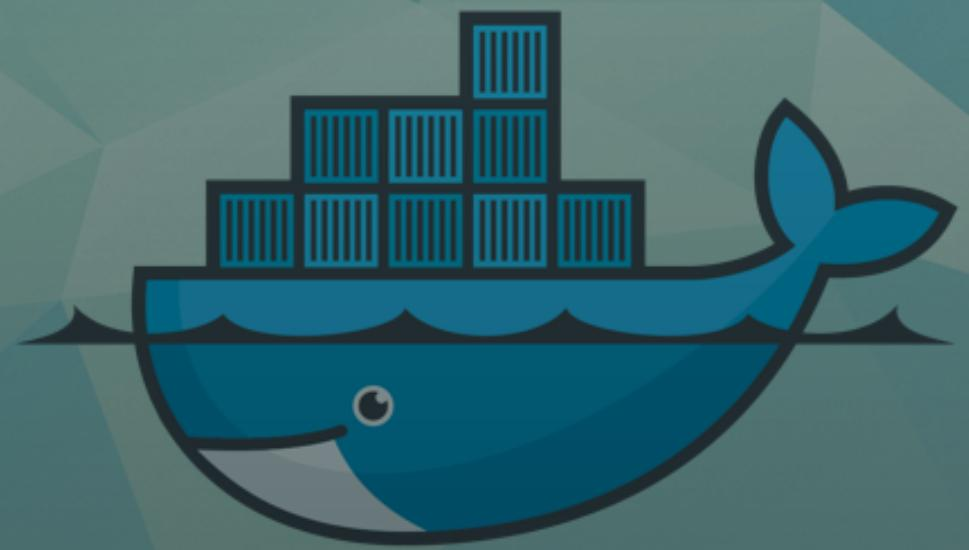
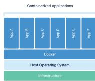
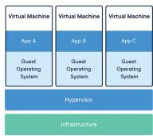
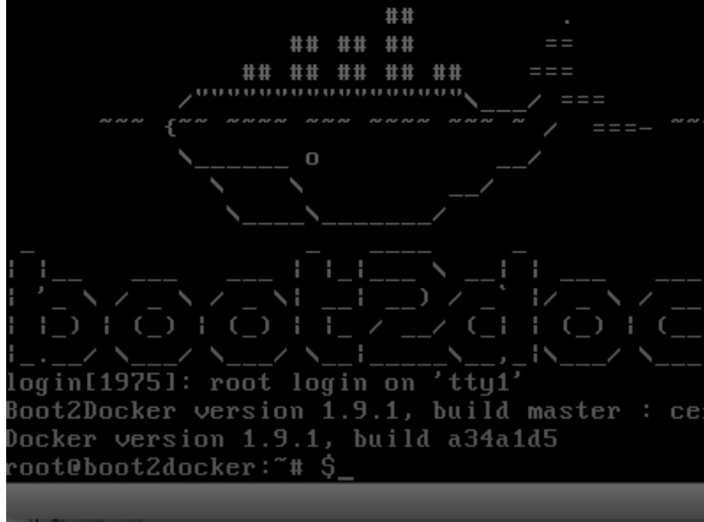
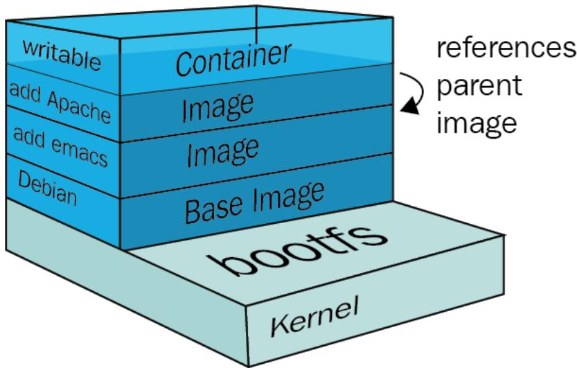

# Docker / Docker 容器

Jerome Gurhem - February 2023  
杰罗姆·古尔赫姆 - 2023 年 2 月

## Contents / 目录

1. The origin of Docker  
   Docker 的起源  
2. Expectations and benefits  
   预期与优势  
3. Running containers  
   运行容器  
4. Image building  
   构建镜像  
5. Summary / cheatsheet  
   总结 / 速查表  
6. Exercises  
   练习  
7. References  
   参考资料

## The origin of Docker / Docker 的起源



Docker solves common environment issues by packaging applications and their dependencies together.  
Docker 通过将应用与其依赖打包在一起，解决常见的环境一致性问题。

## Expectations / 期望

- Ease of use  
  易于使用  
- Portability  
  可移植性  
- Reproducibility  
  可复现性  
- Isolated environment  
  环境隔离  
- Version control  
  版本控制

## Portability / 可移植性

Can easily run on multiple environments:  
能轻松在多种环境中运行：

- Abstraction layer between the operating system and the application  
  在操作系统与应用之间加入抽象层  
- Ability to run everywhere without modifying your application  
  无需修改应用即可在任意环境运行  
- Easier onboarding for new environments  
  让新环境的上手更简单

## Reproducibility / 可复现性

Run the same application reliably:  
可靠地重复运行同一应用：

- Snapshot an application with its exact dependencies  
  为应用及其精确依赖创建快照  
- Re-execute snapshots on other platforms  
  可在其他平台重新执行这些快照  
- Avoid installing the whole stack locally  
  避免在本地安装整套技术栈  
- Simplify debugging and reduce time to reproduce and fix errors  
  简化调试，减少复现和修复错误的时间

## Isolated environment / 隔离环境

Applications only access what they need:  
应用只能访问自身所需：

- Isolation of users, files, and networking  
  隔离用户、文件与网络  
- Snapshots are isolated from each other and the host  
  各快照彼此及与宿主机隔离  
- Multiple isolated environments on a single host, each with its own IP  
  单机可运行多个独立环境，每个有自己的 IP  
- Different Linux distributions can run on the same host  
  同一宿主可运行不同的 Linux 发行版

## Version control / 版本控制

Track and manage changes of an application and its dependencies:  
跟踪并管理应用及依赖的变更：

- Version an application and its exact installation  
  对应用及其精确安装进行版本化  
- Easily refer to versions  
  便于引用特定版本  
- Facilitate rolling back to a previous version  
  方便回滚到历史版本  
- Reduce the cost of updating an application and its dependencies  
  降低更新应用与依赖的成本

## Security / 安全性

Protect hardware and data from threats:  
保护硬件与数据免受威胁：

- Separate components of larger applications  
  将大型应用的组件拆分隔离  
- Isolation prevents one application from accessing another's data  
  隔离保证应用间无法访问彼此数据  
- Isolation alone is not encryption or authentication  
  隔离不等于加密或认证

## Infrastructure approaches / 基础设施方案

### Bare metal / 物理机

- Portability: difficult to install the same app on another system  
  可移植性：在其他系统安装同一应用很困难  
- Reproducibility: no control over dependencies; unexpected behavior may occur  
  可复现性：无法控制依赖，易出现异常行为  
- Isolation: every application runs on the same machine  
  隔离：所有应用都在同一机器上运行  
- Version control: not possible to version a server image  
  版本控制：无法对整台服务器做版本管理

### Virtualization / 虚拟化

- Managed through hypervisors  
  通过虚拟机管理程序管理  
- Portability handled by the hypervisor  
  可移植性由虚拟机管理程序负责  
- Reproducibility: VMs can be saved and copied  
  可复现性：虚拟机可保存并复制  
- Isolation: each VM is isolated  
  隔离：每台虚拟机彼此隔离  
- Version control: VM snapshots can be versioned  
  版本控制：可对虚拟机快照进行版本管理  
- Drawback: performance overhead from emulating a full guest OS; large images  
  缺点：模拟完整客体操作系统导致性能开销大，镜像体积大

### Containerization / 容器化

- Portability, reproducibility, isolation, version control, and lightweight images  
  兼具可移植、可复现、隔离、版本控制，且镜像轻量  
- Use cases: consistent dev environments; production deployments  
  适用场景：一致的开发环境；生产部署  
- Containers share the host kernel—no hardware emulation, smaller size and overhead  
  容器共享宿主机内核，无需硬件模拟，体积与开销更小





Other interests: open-source, widely adopted, cloud-native, microservices, orchestration (Docker Compose, Swarm, ECS, Kubernetes, etc.).  
其他优势：开源、行业广泛采用、云原生与微服务友好，支持 Docker Compose、Swarm、ECS、Kubernetes 等编排。

Drawbacks: limited cross-platform support (Windows containers on Linux), weak GUI support. Alternatives: Podman, Apptainer/Singularity.  
缺点：跨平台支持有限（Linux 无法直接跑 Windows 容器），GUI 支持较弱。替代方案：Podman、Apptainer/Singularity。

## Commands / 常用命令

```txt
b/boot2docker/tls/ca.pem --ca-key=/var/lib/bo
/lib/boot2docker/tls/server.pem --key=/var/1
rg=Boot2Docker
2015/12/25 21:41:55 Generating a server cert
Generating client cert
2015/12/25 21:41:57 no --host parameters, ma
Finished boot2docker init script...
```



### Usual commands / 常见命令

- Get help: `docker COMMAND --help`  
  获取帮助：`docker COMMAND --help`  
- Examples: `docker run --help`, `docker ps --help`, `docker images --help`  
  示例：`docker run --help`、`docker ps --help`、`docker images --help`

### Push / pull images / 推送与拉取镜像

```bash
docker pull image:tag
docker push image:tag
```

- Pull or push an image from/to a registry; tag is optional  
  从/向镜像仓库拉取或推送镜像；标签可选  
- Example: `docker pull ubuntu:22.04`  
  示例：`docker pull ubuntu:22.04`  
- Note: pushing with an existing tag overrides it  
  注意：使用已存在的标签推送会覆盖该标签

### Listing local images / 列出本地镜像

```bash
docker images
```

Example output:  
示例输出：

```bash
REPOSITORY                 TAG      IMAGE ID       CREATED        SIZE
dockerhubaneo/armonik      test     b352dc9ebb5d   4 days ago     227MB
<none>                     <none>   1f5ed6475c91   4 days ago     1.72GB
dockerhubaneo/armonik_control test   aed0776a823d   4 days ago     227MB
<none>                     <none>   6bce402dd842   4 days ago     1.63GB
```

### Deleting images / 删除镜像

- Remove an image: `docker rmi image:tag`  
  删除镜像：`docker rmi image:tag`  
- Remove dangling images: `docker rmi -f $(docker images -a -q -f dangling=true)` or `docker image prune`  
  删除悬空镜像：`docker rmi -f $(docker images -a -q -f dangling=true)` 或 `docker image prune`  
- Remove all unused images/containers/networks: `docker system prune -a`  
  删除未使用的镜像/容器/网络：`docker system prune -a`

### Run a container / 运行容器

```bash
docker run -d --rm --name <NAME> -e ENV_VAR=value image[:TAG]
docker run -u myuser -it image[:TAG]
```

Flags: `-d` detached, `--rm` delete after exit, `--name` set container name, `-e` env var, `-i` interactive stdin, `-t` pseudo-tty, `-u` user.  
参数说明：`-d` 后台运行，`--rm` 退出即删容器，`--name` 指定容器名，`-e` 设置环境变量，`-i` 交互式输入，`-t` 分配终端，`-u` 指定用户。

### List containers / 查看容器

```bash
docker ps            # running
docker ps -a         # all
docker ps -a -q      # IDs only
```

Remove containers:  
删除容器：

```bash
docker rm $(docker ps -a -q)          # stopped
docker rm -f $(docker ps -a -q)       # running + stopped
docker container prune                # easier cleanup
```

### Start/stop containers / 启动与停止容器

```bash
docker start CONTAINER
docker stop CONTAINER
```

To restart an exited container interactively, it needs `-it` at creation.  
若需交互式重启已退出的容器，创建时需使用 `-it`。

### File sharing and ports / 文件挂载与端口映射

```bash
docker run --entrypoint=bash image[:TAG]
docker run -v /host/path:/container/path image[:TAG]
docker run -p HOSTPORT:CONTAINERPORT image[:TAG]
```

- `--entrypoint` overrides the image entrypoint  
  `--entrypoint` 覆盖镜像的入口点  
- `-v` mounts a host path  
  `-v` 挂载宿主路径  
- `-p` exposes container ports to the host  
  `-p` 将容器端口映射到宿主

### Inspect and exec / 检查与执行

```bash
docker inspect NAME_OR_ID
docker exec CONTAINER COMMAND
docker logs [-f] [-t] CONTAINER
docker top CONTAINER [ps options]
docker cp CONTAINER:SRC_PATH DEST_PATH
docker cp SRC_PATH CONTAINER:DEST_PATH
```

Inspect helps find `ENTRYPOINT` or `CMD`.  
`docker inspect` 可查看镜像/容器的 `ENTRYPOINT` 或 `CMD` 等信息。

### Tagging images / 镜像打标签

```bash
docker tag SOURCE_IMAGE[:TAG] TARGET_IMAGE[:TAG]
```

## Image building / 构建镜像


### Dockerfile basics / Dockerfile 基础

- A Dockerfile is a set of instructions to build an image; each instruction creates a new read-only layer  
  Dockerfile 是构建镜像的指令集，每条指令都会生成新的只读层  
- The last layer is writable at runtime  
  最后一层在运行时可写  
- Build uses the cache when layers are unchanged  
  构建时若层未变会使用缓存



Example:  
示例：

```dockerfile
FROM python:3.9-slim
WORKDIR /app
COPY ./app .
RUN pip install -r requirements.txt
ENV NAME=Aneo
EXPOSE 80
CMD ["python", "app.py"]
```

Key instructions:  
关键指令：

- `FROM` base image  
  `FROM` 指定基础镜像  
- `WORKDIR` working directory  
  `WORKDIR` 设置工作目录  
- `RUN` execute command and create a layer  
  `RUN` 执行命令并生成层  
- `COPY` copy files into the image  
  `COPY` 拷贝文件进镜像  
- `ENTRYPOINT` command always executed when running the image  
  `ENTRYPOINT` 运行容器时总会执行的命令  
- `CMD` default parameters appended to entrypoint (overridden by runtime command)  
  `CMD` 作为入口命令的默认参数，运行时可被覆盖  
- `USER` change default user  
  `USER` 修改默认用户  
- `ENV` set environment variables  
  `ENV` 设置环境变量  
- `EXPOSE` document a port  
  `EXPOSE` 声明容器端口  
- `ARG` build-time argument  
  `ARG` 构建阶段参数

### Entrypoint vs CMD / Entrypoint 与 CMD

```txt
ENTRYPOINT ["python", "app.py"]
CMD ["-p", "8080"]
```

- `docker run myapp` executes `python app.py -p 8080`  
  `docker run myapp` 实际执行 `python app.py -p 8080`  
- `docker run myapp --port 8443` executes `python app.py --port 8443`  
  `docker run myapp --port 8443` 实际执行 `python app.py --port 8443`

### Image size optimization / 镜像瘦身

- Fewer layers and smaller base images reduce pull/start time  
  减少层数与使用精简基础镜像可缩短拉取与启动时间  
- Remove temporary files in the same layer that creates them  
  在创建临时文件的同一层内清理它们  
- Use `.dockerignore` to skip unnecessary files  
  使用 `.dockerignore` 排除无关文件  
- Avoid superfluous dependencies  
  避免引入多余依赖  
- Use multi-stage builds; tools like Docker Slim can help  
  使用多阶段构建；也可借助 Docker Slim 等工具

Multi-stage example:  
多阶段示例：

```dockerfile
FROM ubuntu as build
# install build tools
COPY src/* /dest
WORKDIR /dest
RUN make build

FROM ubuntu as base
# install runtime deps
COPY --from=build /dest/bin/ /usr/local/bin/
ENTRYPOINT ["/usr/local/bin/myapplication", "the", "options"]
```

### Building images / 构建命令

```bash
docker build -t myimage[:mytag] .
docker build -t myimage[:mytag] -f path/to/Dockerfile context_path
```

- `-t` sets name and tag (registry included if provided); default tag is `latest`  
  `-t` 设置镜像名与标签（可含仓库地址）；默认标签为 `latest`  
- `-f` selects the Dockerfile  
  `-f` 指定 Dockerfile 路径  
- `context_path` is the root for `COPY` during build  
  `context_path` 是构建时 `COPY` 的上下文根路径

### Registries and login / 仓库与登录

Registries store and distribute Docker images (only layers). Examples: Docker Hub, GitHub Registry, AWS ECR.  
镜像仓库用于存储和分发 Docker 镜像（按层存储），如 Docker Hub、GitHub Registry、AWS ECR 等。

Login:  
登录：

```bash
docker login -u user --password-stdin [SERVER]
echo password | docker login -u user --password-stdin
```

- `SERVER` defaults to the daemon's registry (Docker Hub)  
  `SERVER` 默认是守护进程配置的仓库（Docker Hub）  
- Credentials appear in shell history if passed inline with `-p`  
  使用 `-p` 直接带密码会出现在 shell 历史中

## Summary / 总结


Minimal Dockerfile:  
最小示例：

```dockerfile
FROM python:3.9-slim
RUN pip install -r requirements.txt
CMD ["python", "app.py"]
```

Each instruction creates a layer; additional layers increase image size. Small images start faster.  
每条指令都会生成一层；层越多镜像越大。镜像越小，启动越快。

Cheatsheet highlights:  
速查要点：

```bash
docker build -t <image_name> .
docker images
docker rmi <image_name>
docker image prune
docker run --rm --name <container_name> <image_name>
docker start|stop <container_name>
docker rm <container_name>
```

## Exercises / 练习


### Ex 1: Pull docker images / 拉取镜像

1. `docker pull hello-world` — download the hello-world image from the default registry  
   `docker pull hello-world` —— 从默认仓库下载 hello-world 镜像  
2. `docker pull ubuntu` — download the latest ubuntu image  
   `docker pull ubuntu` —— 下载最新的 ubuntu 镜像  
3. `docker pull fedora` — download the latest fedora image  
   `docker pull fedora` —— 下载最新的 fedora 镜像  
4. `docker pull ubuntu:22.04` — download ubuntu tagged 22.04  
   `docker pull ubuntu:22.04` —— 下载 22.04 标签的 ubuntu 镜像

### Ex 2: Remove local images / 删除本地镜像

1. `docker images` — list all local images to inspect tags/IDs  
   `docker images` —— 列出本地所有镜像查看标签/ID  
2. Note: ubuntu tags may share the same image ID (same layers)  
   注意：ubuntu 不同标签可能共享同一镜像 ID（同一层）  
3. `docker rmi ubuntu` — remove the ubuntu image (all tags if no tag specified)  
   `docker rmi ubuntu` —— 删除 ubuntu 镜像（未指明标签则删除全部标签）  
4. `docker rmi $(docker images -q)` — remove all listed images, or `docker image prune` — remove dangling images  
   `docker rmi $(docker images -q)` —— 删除列出的所有镜像；或用 `docker image prune` 删除悬空镜像

### Ex 3: Run a container / 运行容器

1. `docker pull hello-world` — fetch the image  
   `docker pull hello-world` —— 拉取镜像  
2. `docker images` — confirm it is present locally  
   `docker images` —— 确认镜像已在本地  
3. `docker run hello-world` — run the container and print the hello message  
   `docker run hello-world` —— 运行容器并输出问候  
4. `docker ps -a` — list all containers, including the exited hello-world  
   `docker ps -a` —— 查看所有容器（含已退出的 hello-world）  
5. `docker rm $(docker ps -a -q)` — remove all containers shown  
   `docker rm $(docker ps -a -q)` —— 删除列出的所有容器

### Ex 4: The ubuntu image / ubuntu 镜像

1. `docker run ubuntu` — run default ubuntu command (exits immediately)  
   `docker run ubuntu` —— 运行默认命令（很快退出）  
2. `docker run --rm ubuntu` — run and auto-delete the container afterward  
   `docker run --rm ubuntu` —— 运行后自动删除容器  
3. `docker run -it ubuntu` — start ubuntu with interactive TTY (typically drops into shell)  
   `docker run -it ubuntu` —— 交互式启动，进入 shell  
4. `docker inspect ubuntu | jq -r '.[0].ContainerConfig.Cmd'` — view the image default CMD  
   `docker inspect ubuntu | jq -r '.[0].ContainerConfig.Cmd'` —— 查看镜像默认 CMD  
5. `docker run --entrypoint echo ubuntu "some text"` — override entrypoint to echo text  
   `docker run --entrypoint echo ubuntu "some text"` —— 覆盖入口点输出文本  
6. `docker run ubuntu echo "some text"` — override only CMD to echo text  
   `docker run ubuntu echo "some text"` —— 仅覆盖 CMD 输出文本  
7. `docker run --entrypoint echo ubuntu echo "some text"` — override both entrypoint and CMD  
   `docker run --entrypoint echo ubuntu echo "some text"` —— 同时覆盖入口点与 CMD

### Ex 5: Running in the background / 后台运行

1. `docker run -it -d --name myubuntu ubuntu bash` — start ubuntu detached, keep TTY, name it, run bash  
   `docker run -it -d --name myubuntu ubuntu bash` —— 后台启动 ubuntu，保留 TTY，命名 myubuntu，并运行 bash  
2. `docker ps` — list running containers (should show myubuntu)  
   `docker ps` —— 查看运行中的容器（应包含 myubuntu）  
3. `docker exec myubuntu whoami` — run a command inside the running container  
   `docker exec myubuntu whoami` —— 在容器内执行命令  
4. `docker exec -it myubuntu bash` — open an interactive shell in the container  
   `docker exec -it myubuntu bash` —— 进入容器交互式 shell

### Ex 6: Run an nginx server / 运行 nginx

1. `docker pull nginx` — fetch the nginx image  
   `docker pull nginx` —— 拉取 nginx 镜像  
2. `docker run -it -d -p 8080:80 --rm --name mynginx nginx` — run nginx detached, map host 8080 to container 80, auto-remove on stop  
   `docker run -it -d -p 8080:80 --rm --name mynginx nginx` —— 后台运行 nginx，映射 8080:80，停止即删  
3. Check [http://localhost:8080/](http://localhost:8080/) — verify the server responds  
   访问 [http://localhost:8080/](http://localhost:8080/) —— 验证服务可用  
4. `docker logs -f mynginx` — follow nginx logs  
   `docker logs -f mynginx` —— 实时查看日志  
5. `docker top mynginx` — view processes inside the container  
   `docker top mynginx` —— 查看容器内进程  
6. `docker exec -it mynginx bash` — get a shell inside nginx (install editors if needed)  
   `docker exec -it mynginx bash` —— 进入容器 shell（可视需要安装编辑器）  
7. `docker cp mynginx:/usr/share/nginx/html/index.html .` — copy the default page out, edit locally, then `docker cp index.html mynginx:/usr/share/nginx/html/index.html` — copy modified page back in  
   `docker cp mynginx:/usr/share/nginx/html/index.html .` —— 拷出默认页面编辑，再用 `docker cp index.html mynginx:/usr/share/nginx/html/index.html` 拷回

### Ex 7: Write a Dockerfile and build the image / 编写 Dockerfile 并构建

Dockerfile:  
Dockerfile 示例：

```dockerfile
FROM ubuntu
RUN apt-get update \
 && apt-get install -y git jq curl unzip mandoc \
 && apt-get clean \
 && rm -rf /var/cache/apt/lists/*

RUN curl "https://awscli.amazon.com/awscli-exe-linux-x86_64.zip" -o "awscliv2.zip" \
 && unzip awscliv2.zip \
 && ./aws/install \
 && rm awscliv2.zip

RUN useradd -m -U aneo
USER aneo
ENTRYPOINT ["aws"]
```

Commands:  
构建与清理命令：

```bash
docker build -t my_awscli .                       # build image with tag my_awscli
docker tag my_awscli my_awscli:v1                 # add version tag v1 to the same image
docker images                                     # list images to confirm tags
docker image prune                                # remove dangling images
docker rmi $(docker images -q -f dangling=true)   # force-remove dangling images explicitly
```

### Ex 8: Make the AWS CLI work through Docker / 让 AWS CLI 在容器中工作

#### aws configure - way 1 / 方式 1

1. `docker run -it --name awscli my_awscli bash`  
   `docker run -it --name awscli my_awscli bash`  
2. `aws configure`  
   `aws configure`  
3. `aws sts get-caller-identity`  
   `aws sts get-caller-identity`  
4. Limitation: CLI only available inside the container session  
   限制：CLI 仅在容器会话内可用

#### aws configure - way 2 / 方式 2

1. `docker run -it -d --name awscli my_awscli bash` — start CLI container in background with bash as entry command  
   `docker run -it -d --name awscli my_awscli bash` —— 后台启动 CLI 容器，入口命令为 bash  
2. `docker exec -it awscli aws configure` — run interactive credential setup inside the running container  
   `docker exec -it awscli aws configure` —— 在运行中的容器内交互配置凭证  
3. `docker exec awscli aws sts get-caller-identity` — call AWS STS using the configured creds  
   `docker exec awscli aws sts get-caller-identity` —— 使用已配置凭证调用 STS  
4. Needs a running background container  
   需保持容器在后台运行

Alternative: `docker exec awscli mkdir -p /home/aneo/.aws && docker cp $HOME/.aws/credentials awscli:/home/aneo/.aws/credentials`  
替代方案：`docker exec awscli mkdir -p /home/aneo/.aws && docker cp $HOME/.aws/credentials awscli:/home/aneo/.aws/credentials`

#### Environment variables / 环境变量方式

```bash
docker run -e AWS_ACCESS_KEY_ID=xxx -e AWS_SECRET_ACCESS_KEY=xxx my_awscli aws sts get-caller-identity
```

- Credentials appear in shell history and command output  
  凭证会出现在命令行历史与输出中

#### Mount credentials / 挂载凭证文件

```bash
docker run -v "$HOME/.aws/credentials:/home/aneo/.aws/credentials" my_awscli aws sts get-caller-identity    # mount creds for user aneo
docker run -v "$HOME/.aws/credentials:/root/.aws/credentials" -u root my_awscli aws sts get-caller-identity # mount creds for root user
```

Warning: mounting files lets container processes modify host files (possibly with elevated permissions).  
警告：挂载文件可能允许容器内进程修改宿主文件（甚至提升权限）。

## References / 参考资料

- [https://d2iq.com/blog/brief-history-containers](https://d2iq.com/blog/brief-history-containers)  
- [https://blog.packagecloud.io/what-are-docker-image-layers](https://blog.packagecloud.io/what-are-docker-image-layers)  
- [https://docs.docker.com/registry/introduction/](https://docs.docker.com/registry/introduction/)  
- [https://blog.runcloud.io/when-and-why-to-use-docker/](https://blog.runcloud.io/when-and-why-to-use-docker/)  
- [https://docs.docker.com/get-started/docker_cheatsheet.pdf](https://docs.docker.com/get-started/docker_cheatsheet.pdf)  
- [https://dev.to/kitarp29/reducing-docker-image-size-a67](https://dev.to/kitarp29/reducing-docker-image-size-a67)
- [https://www.geeksforgeeks.org/why-should-you-use-docker-7-major-reasons/](https://www.geeksforgeeks.org/why-should-you-use-docker-7-major-reasons/)