# Arithmetique à virgule flottante 浮点算术

Pablo de Oliveira (pablo. oliveira@uvsq.fr)
巴勃罗·德·奥利维拉（pablo.oliveira@uvsq.fr）

2024-2025
2024-2025 学年

M1 Calcul Haute Performance Simulation, Calcul Numérique
M1 高性能计算仿真与数值计算

    Standard IEEE-754
    IEEE-754 标准

    Analyse d'Erreurs
    误差分析

    Étude de la somme
    求和研究

    Arithmetique stochastique
    随机算术

## Standard IEEE-754 IEEE-754 标准

IEEE-754 définit une représentation flottante standardisée.
IEEE-754 定义了一种标准化的浮点数表示。

$$
f = s \times 2 ^ {e} \times m
$$

- $s \in \{-1, +1\}$  est le signe, 0 est positif, 1 est négatif.
$s \in \{-1, +1\}$ 是符号位，0 表示正数，1 表示负数。
- $e$  est l'exposant, floats 8 bits, double 11 bits, $e \in [-126; 127]$  pour floats,  $e \in [-1022; 1023]$  pour double.
$e$ 是指数，float 占 8 位，double 占 11 位，float 时 $e \in [-126; 127]$，double 时 $e \in [-1022; 1023]$。
- $m$  est la mantisse, floats 23 bits, double 52 bits.
$m$ 是尾数

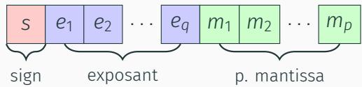

## Example 示例

$$
\begin{array}{l} (1. 1 0 1 0 \times 2 ^ {0}) _ {2} = (1 \times 2 ^ {0} + 1 \times 2 ^ {- 1} + 0 \times 2 ^ {- 2} + 1 \times 2 ^ {- 3}) _ {1 0} \\ = (1 + 0. 5 + 0. 1 2 5) _ {1 0} = 1. 6 2 5 _ {1 0} \\ \end{array}
$$

$$
(1. 1 1 1 0 \times 2 ^ {3}) _ {2} = (1 \times 2 ^ {3} + 1 \times 2 ^ {2} + 1 \times 2 ^ {1} + 1 \times 2 ^ {0}) _ {1 0} = 1 5. 0 _ {1 0}
$$

## Somme de deux flottants (example) 两个浮点数之和（示例）

```
1.1110 \*2^3   
+ 1.1010 \*2^0   
<=>   
1.1110000 \*2^3   
+ 0.0011010 \*2^3 (meme exposant)  ---> 3 bits  
---  
10.0001010 \*2^3   
1.00001010 \*2^4 (renormalisation) <--- 1 bit
16.625_10   

```

## Formats classiques : binary32 (float), binary64 (double) 常见格式：binary32（float）、binary64（double）

### Pour un double: 对于 double

- 11 bits pour l'exposant,  $e \in [-1022; 1023]$  
指数位占 11 位，$e \in [-1022; 1023]$
- 52 bits de pseudo-mantisse (epsilon machine  $\epsilon = 2^{-52}$ )
伪尾数 52 位（机器精度 $\epsilon = 2^{-52}$）

### Pseudo-mantisse car le premier bit est implicite 伪尾数是因为首位是隐式的

- 1 pour les normaux  
正规数时该位为 1
- 0 pour les dénomaux
非正规数时该位为 0

L'exposant est codé avec biais, il faut souatraire 1023
指数采用偏移编码，需要减去 1023。

$$
\left(= 2 ^ {q - 1} - 1\right) \text { à la valeur binaire } E = e _ {1} \dots e _ {q}
$$

- pour l'exposant  $2^{1}$ , on stockera  $E = 1024$  en binaire  
对于指数 $2^{1}$，二进制中存储 $E = 1024$
- pour l'exposant le plus petit  $2^{-1022}$ , on stockera  $E = 1$  en binaire  
对于最小指数 $2^{-1022}$，二进制中存储 $E = 1$
- pour l'exposant le plus grand  $2^{1023}$ , on stockera  $E = 2046$  en binaire
对于最大指数 $2^{1023}$，二进制中存储 $E = 2046$

## Valeur spéciales 特殊取值

- $E = 2047$  représentent  $+\infty, -\infty, NaN$  (en fonction de  $s$  et  $m$ )  
当 $E = 2047$ 时，根据 $s$ 和 $m$ 对应 $+\infty, -\infty, NaN$
- $E = 0$  et  $m = 0$  représentent  $+0$  et  $-0$  
$E = 0$ 且 $m = 0$ 表示 $+0$ 与 $-0$
- $E = 0$  et  $m \neq 0$  représenté un dénominal
$E = 0$ 且 $m \neq 0$ 表示一个非正规数

$$
m = 1. 0 \times 2 ^ {-1022}
$$

- Le plus petit double normal (en valeur absolue):  
绝对值意义下最小的正规 double：
- $\frac{m}{4}$  est non représentable car son exposant est trop petit; c'est un underflow.  
$\frac{m}{4}$ 无法表示，因为指数过小；这就是下溢。
- Retourner la valeur 0 à la place ? Pour ne pas perdre complètement la précision on utilise des dénormaux.  
直接返回 0 会损失全部精度？为避免这种情况我们使用非正规数。
- On encode  $\frac{m}{4} = 0.01 \times 2^{-1022}$ . Pour les dénormaux le bit implicite est remplaçé par un zéro. Ici on perds deux bits de précision dans la mantisse.
我们编码 $\frac{m}{4} = 0.01 \times 2^{-1022}$。对于非正规数，隐式位改用 0，此处在尾数中损失两个比特精度。

Exemple:

- Représentation binaire de m :
  - m 的二进制表示：
    0 (1 bits s) 0000...0001 (11 bits e) 0000...0000 (52 bits m)
  - Valeur :  $(-1)^0 \times 2^{-1022} \times 1.0 = 2^{-1022}$
- Représentation binaire de m/2 :
  - m/2 的二进制表示：
    0 (1 bits s) 0000...0000 (11 bits e) 1000...0000 (52 bits de mantisse — perte d’un bit de précision car le bit implicite n’est plus présent)
  - Valeur :  $(-1)^0 \times 2^{-1022} \times 0.1_2 = 2^{-1023}$
- Représentation binaire de m/4 :
  - m/4 的二进制表示：
    0 (1 bits s) 0000...0000 (11 bits e) 0100...0000 (52 bits m)
  - Valeur :  $(-1)^0 \times 2^{-1022} \times 0.01_2 = 2^{-1024}$
  - m/4 perd deux bits de précision parce que le bit implicite n’est plus présent et que la mantisse doit se décaler de deux positions.
    m/4 损失两个比特精度，因为隐式位不再存在，尾数必须向右移动两位。

## Répartition sur la droite des réels 实数轴上的分布

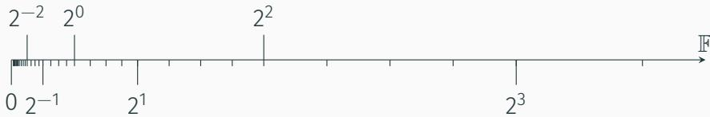

Plus on se rapproche de zéro plus les flottants sont proches entre eux. Ici on a utilisé une précision  $p = 2$ . Donc 4 valeurs possibles entre deux puissances de deux (1.00, 1.01, 1.10, 1.11).
越接近零，浮点数之间的间隔越小。此处使用精度 $p = 2$，因此在相邻的 2 的幂之间有 4 个可能值（1.00、1.01、1.10、1.11）。

Si le résultat d'un calcul x n'est pas représentable, il est arrondi.
若计算结果 x 不可表示，就会执行舍入。

- Mode au plus après: la valeur la plus proche est可以选择 (en cas d'équidistance, par défaut la mantisse paire est可以选择).  
最接近模式：选择最邻近的值（在等距时默认选择偶尾数）。
- Vers  $\pm \infty$  ou vers 0: on arrondit vers  $+\infty$ ,  $-\infty$  ou 0.
向 $ \pm \infty$ 或向 0：舍入到 $+\infty$、$-\infty$ 或 0。

La norme IEEE-754 garantit l'arrondi correct pour  $+ - \times / \sqrt{}$
IEEE-754 标准确保 $+ - \times / \sqrt{}$ 的正确舍入。

Ces règles sont précisément celles qu'on applique lorsque la mantisse ne dispose plus de suffisamment de bits pour représenter exactement le résultat.
当尾数的有效位数不足以精确表示结果时，就会套用这些舍入规则。

Lors d'un arrondi on commet une erreur maximal  $d' \, 1/2$  ulp (unit in the last place). 
在一次舍入操作中，最大误差为 $d'\,1/2$ 个 ulp（最低有效位单元）。
随着指数位的提高，最低有效位单元的值也会增加。
Soit pour un exposant  $2^0$ , on commet une erreur maximal de  $\frac{\epsilon}{2} = u = 2^{-53}$ .
对于指数 $2^0$，最大误差为 $\frac{\epsilon}{2} = u = 2^{-53}$。

## Analyse d'Erreurs 误差分析

### Modèle standard (Higham) 标准模型（Higham）

$$
f l (x \circ y) = (x \circ y) (1 + \delta) \quad \text {avec } | \delta | \leqslant u = 2 ^ {- 5 3}
$$

Le terme  $(1 + \delta)$  capture l'erreur commise.
$(1 + \delta)$ 项用于刻画产生的误差。

### Erreurs numériques: Représentation 数值误差：表示

- Example:  $0.1_{10} = 0.0001100110011 \ldots_{2}$  a une mantisse infinie.  
示例：$0.1_{10} = 0.0001100110011 \ldots_{2}$ 的尾数是无限长的。
- La mantisse est tronquée en double précision.
在双精度格式中，尾数会被截断。

### Bug du missile Patriot (1991) 爱国者导弹故障（1991）

- Utilisation d'un registre de 24 bits pour multiplier 0.1 par l'horloge interne du système (pas de 0.1s).  
使用 24 位寄存器将 0.1 与系统内部时钟（步长 0.1s）相乘。
- Après 100 heures, erreur d'approximation de 0.34s, soit 500m à la vitesse du missile Scud iraqien.  
约 100 小时后近似误差达 0.34s，按伊拉克飞毛腿导弹的速度折合为 500m。
- Non interception du missile Scud, 34 soldats américain morts.
未能拦截飞毛腿导弹，造成 34 名美军士兵阵亡。

### Erreurs numériques: Absorption 数值误差：吸收

- Lors d'une addition ou soustraction, on renormalise le résultat.  
执行加减时需要重新规格化结果。
- Les chiffres les plus à droite de la mantisse peuvent être perdus.
尾数最右边的位可能会丢失。

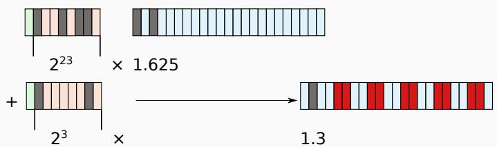

### Erreurs numériques: Cancellation catastrophe 数值误差：灾难性抵消

- Lorsque l'on soustrait deux valeurs proches, une partie de la mantisse s'annule (en angeais on parle de cancellation)
当两个非常接近的值相减时，尾数的一部分会抵消（英语称为 cancellation）。

- 9633812.0 - 9633792.0 = 20.000000

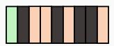

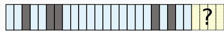

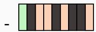

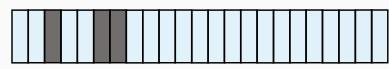

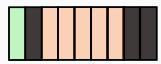

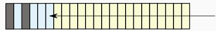

- On compte la mantisse avec des zéros.  
尾数中填充了若干个零。
- Si les deux opérandes contenaient des erreurs sur les derniers bits (erreur d'arrondi sur les opérations précédentes), c'est une cancellation catastrophe.  
若两个操作数的末位都带有误差（来自之前运算的舍入），就会发生灾难性抵消。
- En effet, l'erreur est promue en début de mantisse.
因为误差会被提升到尾数的高位。

原来的两个数很大，差值却很小。尾数里那些代表高位的大量有效位在相减时全部抵消掉，只剩下末尾几位在撑着整个结果。与此同时，这些末尾位在先前运算中可能已有舍入误差；当高位被抵消掉后，这些“残余误差”就变成了结果的主导部分，甚至可能比结果真正应该有的有效位还大。于是你得到的差值几乎全部是误差，精度自然就“比误差还小”了。

### Perte d’associativité 丧失结合律

- En raison des erreurs d'arrondi, absorption, cancellation, l'arithmetique IEEE-754 n'est pas associative.
由于舍入、吸收和抵消等误差，IEEE-754 算术不具备结合律。

$$
a + (b + c) \neq (a + b) + c
$$

L'ordre des opérations est donc important.
因此运算顺序至关重要。

- Sommations: produits scalaires, moyennes, réductions.  
求和：点积、平均、归约。
- Accumulation d'erreurs sur le temps: intégration méthodes explicites.  
误差随时间累计：显式积分方法。
- Calcul de gradient sur des quantités proches.  
在接近的数值上计算梯度。
- Non reproductibilité:
不可复现性：
  - Parallelisme (change l'ordre des opérations)  
    并行化（改变运算顺序）
  - Vectorisation et optimisations agressives  
    向量化和激进优化
  - Branchements instables
    不稳定的分支

## Quelques techniques pour atténuer les problèmes 缓解问题的一些技术

- Réécrite une expression pour éviter des cancellations catastrophiques ou absorptions.
重写表达式以避免灾难性抵消或吸收。

$$
\frac {\sqrt {x ^ {2} + 1} - 1}{x} = \frac {x}{\sqrt {x ^ {2} + 1} + 1} \qquad \text{cancellation pour } x \rightarrow 0
$$

- Remplacer une formule par une approximation qui se comporte correctement.  
用表现稳定的近似公式替代原公式。
- Utiliser les bons facteurs d'échelle pour éviter les dépassements.  
使用合适的缩放因子防止上溢。
- Augmenter la précision.  
提高数值精度。
- Utiliser des algorithmes compensés.
使用补偿算法。

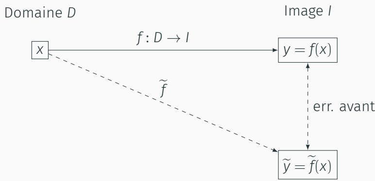

Erreur avant  $= \widetilde{y} - y$
前向误差 $= \widetilde{y} - y$

### Analyse d'erreur en avant et en arrière 前向与后向误差分析

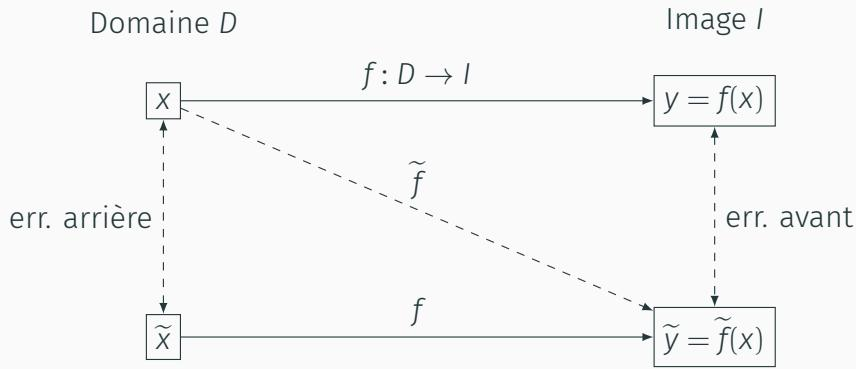

- Erreur arrière: on voit y comme l'image d'une entrée perturbée.
后向误差：将 $y$ 视为受到扰动输入的像。

$$
\widetilde {y} = f (\widetilde {x}) = f (x + \underbrace {\delta x} _ {\text {erreur arrière}})
$$

err. arrière
后向误差

### Étude de la somme 求和研究

Exemple de la somme naïve

    ```python
    sum = 0
    for i in range(n):
        sum += x[i]
    ```

$$
f (\mathbf {x}) = S _ {n} = \sum_ {i = 1} ^ {n} x _ {i}
$$

Erreur en avant (Wilkinson, Higham):

$$
\begin{aligned}
&
  \widetilde{S}_k = (\widetilde{S}_{k-1} + x_k)(1 + \delta_k), \quad
  |\delta_k| \le u, \; \delta_1 = 0, \; \widetilde{S}_0 = 0 \\
&
\widetilde{S}_n = \sum_{i=1}^{n} x_i
  \prod_{k=i}^{n} (1 + \delta_k) \quad (\text{récursivement: chaque } x_i \text{ subit les erreurs des étapes } i \rightarrow n) \\
&
  \widetilde{S}_n - S_n
  = \sum_{i=1}^{n} x_i \left( \prod_{k=i}^{n} (1 + \delta_k) - 1 \right) \qquad (\text{comparaison au vrai } S_n) \\
&
  \left| \widetilde{S}_n - S_n \right|
  \le \sum_{i=1}^{n} |x_i|
  \left| \prod_{k=i}^{n} (1 + \delta_k) - 1 \right|
  &
  \quad (\text{inégalité triangulaire: somme des erreurs absolues}) \\
&
  \left| \prod_{k=i}^{n} (1 + \delta_k) - 1 \right|
  \le \sum_{k=i}^{n} |\delta_k| + O(u^2啊)
  \le (n - i + 1)u + O(u^2) \qquad (\text{approximation linéaire des produits}) \\
&
  \left| \widetilde{S}_n - S_n \right|
  \le n u \sum_{i=1}^{n} |x_i| + O(u^2) \\
&
  \frac{\left| \widetilde{S}_n - S_n \right|}{|S_n|}
  \le n u
  \underbrace{\left[
  \frac{\sum_{i=1}^{n} |x_i|}{\left| \sum_{i=1}^{n} x_i \right|}
  \right]}_{\text{Conditionnement}}
  + O(u^2)
\end{aligned}
$$

- Si tous les termes sont de même signe, le conditionnement de la somme est 1. L'erreur numérique augmente linéairement avec le nombre d'opérations.  
若所有项同号，求和的条件数为 1，数值误差随操作次数线性增长。
- En pratique, souvent les erreurs tendent à se compenser et l'augmentation de l'erreur est en  $O(\sqrt{n})$ .
在实践中误差常会互相抵消，误差增长通常为 $O(\sqrt{n})$。

Plutôt que de sommer les termes en série, il est possible de les sommer en arbre.
与其串行累加各项，可以采用树形求和。

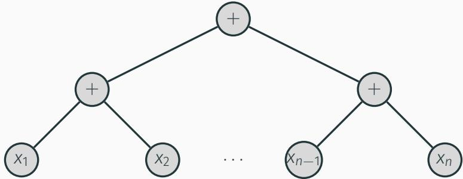

- Erreur majorée par  $O(\log(n))$  et en pratique  $O(\sqrt{\log(n)})$  
误差上界为 $O(\log(n))$，实践中约为 $O(\sqrt{\log(n)})$。
- D'autres algorthèmes encore plus précis (Somme de Kahan)
还有更精确的算法（如 Kahan 求和）。

### Arithmetique stochastique 随机算术

Problème: il est souvent difficile de faire une analyse formelle d'erreur pour un algorithme compliqué. Méthode empirique de mesure d'erreur ?
问题：复杂算法难以进行形式化误差分析，是否可以采用经验性的误差测量方法？

$$
f l (x \circ y) = (x \circ y) (1 + \delta)
$$

- On remplace  $\delta$  par une variable aléatoire.  
将 $\delta$ 替换为随机变量。
- On simule la distribution des erreurs arithmetiques d'un programme à l'aide de plusieurs tirages stochastiques.  
通过多次随机抽样来模拟程序算术误差的分布。
- On besoin δ comme un bruit uniforme de magnitude u.
把 δ 视为幅度为 u 的均匀噪声。

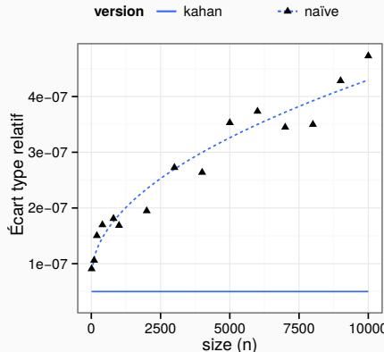  
Figure 1: Erreur relative  $(\frac{\sigma}{\mu})$ . L'erreur pour la version naïve évolue en  $O(\sqrt{n})$ ; la méthode compensée de Kahan est résistante au bruit numérique. Résultats obtenus avec le logiciel https://github.com/verificarlo/verificarlo
图 1：相对误差 $(\frac{\sigma}{\mu})$。朴素版本的误差按 $O(\sqrt{n})$ 增长；Kahan 补偿方法对数值噪声更稳健。结果来自 https://github.com/verificarlo/verificarlo

- GAO report - Patriot Missile Defense, https://www-users.cse.umn.edu/~arnold/disasters/GAO-IMTEC-92-96.pdf  
GAO 报告 - Patriot Missile Defense，https://www-users.cse.umn.edu/~arnold/disasters/GAO-IMTEC-92-96.pdf
- The accuracy of floating-point summations, Nicholas Higham, 1993.
《浮点求和的准确性》，Nicholas Higham，1993。
