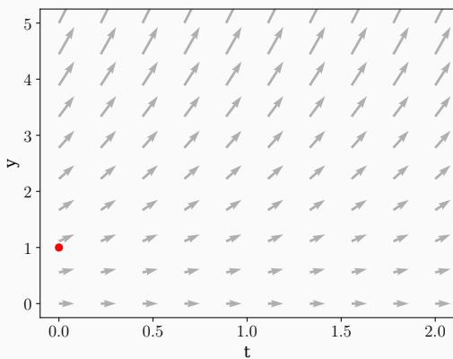
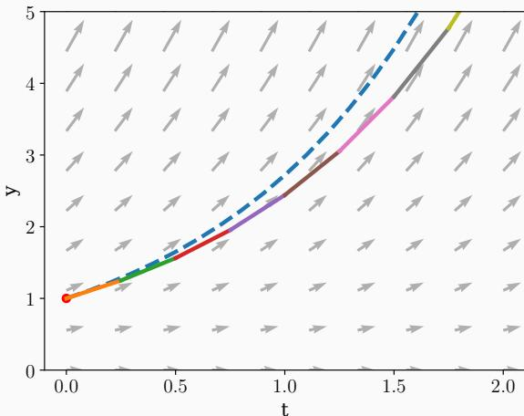
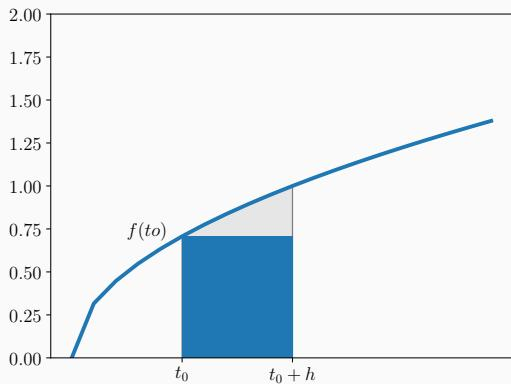
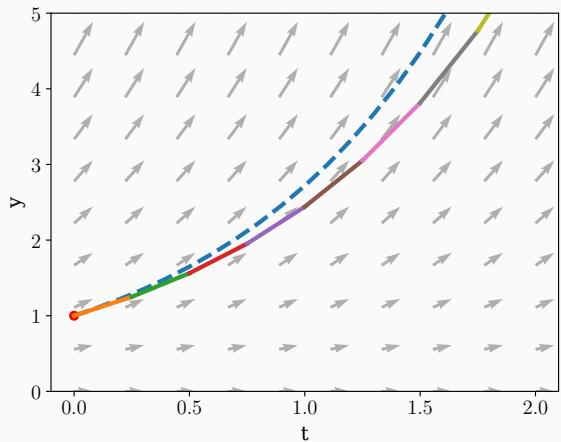
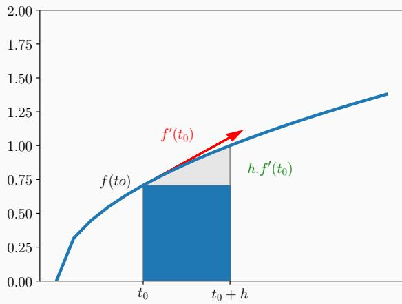
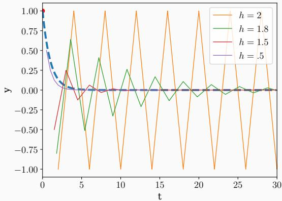
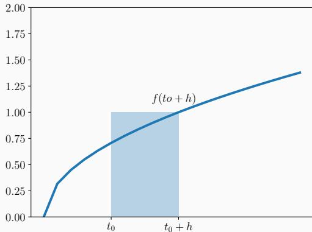
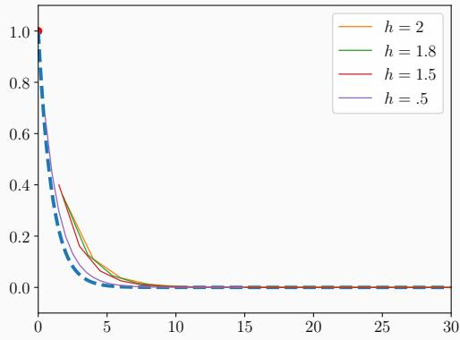

# Intégration numérique (Introduction) 数值积分（导论）

Pablo de Oliveira (pablo. oliveira@uvsq.fr)
巴勃罗·德·奥利维拉（pablo.oliveira@uvsq.fr）

2024-2025
2024-2025 学年

M1 Calcul Haute Performance Simulation, Calcul Numérique
M1 高性能计算仿真与数值计算

Problème de Cauchy
柯西问题

Méthode d'Euler explicite
显式欧拉方法

Analyse d'erreur et convergence
误差分析与收敛性

Stabilité pour un système linéaire
线性系统的稳定性

Méthode d'Euler implicite
隐式欧拉方法

Références
参考文献

## Problème de Cauchy 柯西问题

Équation différentielle du premier ordre
一阶微分方程

$$
\left\{ \begin{array}{l l} y ^ {\prime} = f (t, y (t)) \\ y (t _ {0}) = y _ {0}, t _ {0} \in I \end{array} \right.
$$

avec une fonction  $f$  définie sur  $I \times \mathbb{R}^p \to \mathbb{R}^p$  où  $I$  est un intervalle de  $\mathbb{R}$ .
其中 $f$ 定义在 $I \times \mathbb{R}^p \to \mathbb{R}^p$，$I$ 是 $\mathbb{R}$ 上的一个区间。

Si  $p > 1$  il s'agit d'un système différentiel. Dans la suite on prendra  $p = 1$ .
当 $p > 1$ 时是一个微分方程组，以下我们取 $p = 1$。

Le problème de Cauchy admet une unique solution  $y(t)$  si:
柯西问题存在唯一解 $y(t)$ 的条件：

- $f(t, y(t))$ est une fonction continue  
 $f(t, y(t))$ 是连续函数
- $f(t,y(t))$ est Lipschitzienne en  $y$ , c'est à dire
 $f(t,y(t))$在 $y$ 上满足 Lipschitz 条件，即

$$
\forall t, y _ {1}, y _ {2}, \exists k > 0, \qquad | f (t, y _ {1}) - f (t, y _ {2}) | \leqslant k | y _ {1} - y _ {2} |
$$

Objectif: Calculer numériquement la solution  $y(t)$  sur l'intervalle  $t \in [t_0, t_0 + T]$
目标：在区间 $t \in [t_0, t_0 + T]$ 上数值求解 $y(t)$。

- Problème de Cauchy:  $y' = y$ ,  $y(0) = 1$  
柯西问题：$y' = y$，$y(0) = 1$
- Solution analytique:  $y(t) = e^{t}$  
解析解：$y(t) = e^{t}$
- Methode numérique pour tracer la solution lorsqu'une solution analytique n'est pas connue?
当解析解未知时，如何用数值方法绘制解的轨迹？

## Méthode d'Euler explicite 显式欧拉方法

Idée: On simule la solution en se déplaçant à partir du point initial avec un pas d'intégration  $h$ .
思路：从初始点出发，采用步长 $h$ 沿着解的方向向前推进来模拟解。

  
Figure 1: Champ vectoriel pour  $y'(t) = f(t, y(t)) = y(t)$
图 1：$y'(t) = f(t, y(t)) = y(t)$ 的向量场

  
Figure 2:  $h = 0.25$
图 2：$h = 0.25$

$$
\begin{array}{l} \int_ {t} ^ {t + h} y ^ {\prime} (t) d t = y (t + h) - y (t) \\ y (t + h) = y (t) + \int_ {t} ^ {t + h} y ^ {\prime} (t) d t \\ y (t + h) = y (t) + \int_ {t} ^ {t + h} f (t, y (t)) d t \quad \text {c a r} y ^ {\prime} = f (t, y (t)) \\ \end{array}
$$

On approxime l'aire sous la courbe par un rectangle.
用矩形近似曲线下面积。



$$
y (t _ {0} + h) = y (t _ {0}) + \int_ {t _ {0}} ^ {t _ {0} + h} f (t, y (t)) d t
$$

$$
y (t _ {0} + h) \simeq y (t _ {0}) + f (t _ {0}). h
$$

```python
def euler(f, y0, t0, h, n):
    s, y, t = [], y0, t0
    for i in range(n):
        y = y + f(y, t) * h
        t = t + h
        s.append((t, y))
    
    return s
#application: y' = y
f = lambda y, t: y
y0 = 1.0
t0 = 0.0
h = .25
solution = euler(f, y0, t0, h, 7)
```

<table><tr><td>i</td><td>t</td><td>ŷ</td></tr><tr><td>1</td><td>0.25</td><td>1.250000</td></tr><tr><td>2</td><td>0.50</td><td>1.562500</td></tr><tr><td>3</td><td>0.75</td><td>1.953125</td></tr><tr><td>4</td><td>1.00</td><td>2.441406</td></tr><tr><td>5</td><td>1.25</td><td>3.051758</td></tr><tr><td>6</td><td>1.50</td><td>3.814697</td></tr><tr><td>7</td><td>1.75</td><td>4.768372</td></tr></table>

  
Figure 3:  $h = 0.25$
图 3：$h = 0.25$

## Analyse d'erreur et convergence 误差分析与收敛

- Soit  $y(t)$  la vraie solution du problème de Cauchy.  
设 $y(t)$ 为柯西问题的真实解。
- Soit  $\widetilde{y}_n$  la valeur approchée à l' étape  $n$ .  
设 $\widetilde{y}_n$ 为第 $n$ 步的近似解。
- Par exemple pour les premières étape d'Euler explicite,
例如显式欧拉法的前几步：

$$
\widetilde {y} _ {1} = y \left(t _ {0}\right) + h. f \left(t _ {0}, y _ {0}\right)
$$

$$
\widetilde {y} _ {2} = \widetilde {y} _ {1} + h. f \left(t _ {1}, \widetilde {y} _ {1}\right) \quad \text {a v e c} t _ {1} = t _ {0} + h
$$

$$
\widetilde {y} _ {3} = \widetilde {y} _ {2} + h. f (t _ {2}, \widetilde {y} _ {2}) \quad \text {a v e c} t _ {2} = t _ {0} + 2 h
$$

- Erreur locale (à chaque étape  $n$ )
局部误差（每一步 $n$）

$$
e _ {n} = y (t _ {n}) - \widetilde {y} _ {n}
$$

- Erreur globale sur l'intervalle  $[t_0, t_0 + T]$
区间 $[t_0, t_0 + T]$ 上的全局误差

$$
\epsilon (T,h) = \max_{0\leqslant n\leqslant \frac{T}{h}}|e_{n}|
$$

- Erreurs de méthode (schéma numérique):
方法误差（数值格式本身造成）：

- Erreur locale de troncature: le pas d'intégration est une approximation au premier ordre de la fonction.  
局部截断误差：积分步长仅是函数的一阶近似。
- À chaque nouvelle étape  $f$  est évalué sur  $\widetilde{y}_n \neq y(t_n)$ . Il y a un « décalage » du point sur lequel on évalué la dérivée.
在每一步，$f$ 评估于 $\widetilde{y}_n \neq y(t_n)$，即求导点发生偏移。

- Erreurs numériques:
数值误差：

- Dues à l'utilisation de nombres flottants (arrondis, cancellation).
来自浮点数（舍入、抵消）运算。

## Erreur locale de troncature (interpretation graphique) 局部截断误差（图示理解）

Figure 4: Erreur de troncature  $\simeq$  
图 4：截断误差 $\simeq$
  
Aire du triangle  $= \frac{h\times h.f^{\prime}(t_{0})}{2} = \frac{h^{2}}{2}.f^{\prime}(t_{0})$
三角形面积 $= \frac{h\times h.f^{\prime}(t_{0})}{2} = \frac{h^{2}}{2}.f^{\prime}(t_{0})$

Avec un développement de Taylor:
利用泰勒展开：

$$
\begin{array}{l} y (t _ {0} + h) = y (t _ {0}) + h. y ^ {\prime} (t _ {0}) + \frac {h ^ {2}}{2}. y ^ {\prime \prime} (t _ {0}) + \frac {h ^ {3}}{6}. y ^ {\prime \prime \prime} (t _ {0}) + O (h ^ {3}) \\ = \underbrace {y (t _ {0}) + h . f (t _ {0} , y _ {0})} _ {\text {Méthode d'Euler}} + \underbrace {\frac {h ^ {2}}{2} . f ^ {\prime} (t _ {0} , y _ {0}) + \frac {h ^ {3}}{6} . f ^ {\prime \prime} (t _ {0} , y _ {0}) + O (h ^ {4})} _ {\text {Erreur de troncature}} \\ \end{array}
$$

La méthode numérique est convergente si
当数值方法满足以下条件时即为收敛：

$$
\lim  _ {h \to 0} \epsilon (h) = \lim  _ {h \to 0} \max  _ {0 \leqslant n \leqslant \frac {T}{h}} | e _ {n} | = 0
$$

C'est à dire, si pour un pas d'intégration qui tends vers 0, l'erreur globale converge aussi vers 0.
也就是说，当步长趋于 0 时，全局误差也趋于 0。

Pour  $f(t,y(t))$  Lipschitzienne en  $y$ , on montre que la méthode d'Euler explicite est convergente.
若 $f(t,y(t))$ 在 $y$ 上为 Lipschitz，显式欧拉法可证明是收敛的。

C'est une méthode du premier ordre, car la convergence est linéaire,  $\epsilon (h)\sim O(h)$
该方法为一阶方法，因为其收敛速度为线性，$\epsilon (h)\sim O(h)$。

Nous détaillerons la preuve en TD.
我们将在习题课中详述证明。

## Stabilité pour un système linéaire 线性系统的稳定性

- Pour  $\lambda < 0$ , on considere le probleme  $y' = \lambda y, y(0) = y_0 = 1$  
对于 $\lambda < 0$，考虑问题 $y' = \lambda y,\, y(0) = y_0 = 1$
- La solution analytique est:  $y(t) = e^{\lambda t} \xrightarrow[t \to \infty]{} 0$  
其解析解为 $y(t) = e^{\lambda t} \xrightarrow[t \to \infty]{} 0$
- Pour-quelles valeurs de  $h$  aura t'on  $\widetilde{y}_n \xrightarrow[n\to\infty]{0} 0$ ?
哪些 $h$ 值可以让 $\widetilde{y}_n \xrightarrow[n\to\infty]{} 0$？

$$
\widetilde {y} _ {n + 1} = \widetilde {y} _ {n} + h \lambda \widetilde {y} _ {n}
$$

$$
\widetilde {y} _ {n + 1} = (1 + \lambda h) \widetilde {y} _ {n} \quad \text{\text(suite géométrique)}
$$

$$
\widetilde {y} _ {n + 1} = (1 + \lambda h) ^ {n} y _ {0}
$$

Converge si  $|1 + \lambda h| < 1$ , donc pour  $h < -\frac{2}{\lambda}$ .
当 $|1 + \lambda h| < 1$ 时收敛，即 $h < -\frac{2}{\lambda}$。

  
Figure 5: Pour  $\lambda = -1$  on obtient  $y' = -y$  qui converge pour  $h < 2$
图 5：当 $\lambda = -1$ 时得到 $y' = -y$，其在 $h < 2$ 时收敛。

## Méthode d'Euler implicite 隐式欧拉方法

Plutôt que en  $t_0$ , on considère le rectangle en  $f(t_0 + h)$ .
不再在 $t_0$ 上构造矩形，而是采用 $f(t_0 + h)$。



$$
y (t _ {0} + h) = y (t _ {0}) + \int_ {t _ {0}} ^ {t _ {0} + h} f (t, y (t)) d t
$$

$$
y (t _ {0} + h) \simeq y (t _ {0}) + f (t _ {0} + h). h
$$

$$
\widetilde {y} _ {n + 1} = \widetilde {y} _ {n} + f (\widetilde {y} _ {n + 1}). h
$$

- Cette méthode est implicite car il faut résoudre l'équation d'inconnue  $\widetilde{y}_{n+1}$ .  
- Cette méthode est implicite car il faut résoudre l'équation d'inconnue  $\widetilde{y}_{n+1}$ .  
该方法为隐式方法，因为需解未知数 $\widetilde{y}_{n+1}$ 的方程。
- Mais parfois plus stable que la version explicite.
但有时比显式版本更稳定。

$$
\text {Pour} \lambda <   0, y ^ {\prime} = \lambda y, y (0) = y _ {0} = 1
$$

$$
\widetilde {y} _ {n + 1} = \widetilde {y} _ {n} + f (\widetilde {y} _ {n + 1}). h
$$

$$
\widetilde {y} _ {n + 1} = \widetilde {y} _ {n} + \lambda h \widetilde {y} _ {n + 1}
$$

$$
\widetilde {y} _ {n + 1} = (\frac {1}{1 - \lambda h}) \widetilde {y} _ {n}
$$

$$
\widetilde {y} _ {n + 1} = \left(\frac {1}{1 - \lambda h}\right) ^ {n} y _ {0}
$$

$$
- \lambda h > 0 \Rightarrow 1 - \lambda h > 1 \Rightarrow \frac {1}{1 - \lambda h} <   1
$$

Euler implicite converge lorsque  $t \to \infty$  pour toute valeur de  $h$ .
隐式欧拉在 $t \to \infty$ 时对任何 $h$ 都收敛。

  
Figure 6:  $\lambda = -1$  convergence pour tout  $h$
图 6：$\lambda = -1$，对所有 $h$ 都收敛。

$$
\widetilde {y} _ {n + 1} = \widetilde {y} _ {n} + f (\widetilde {y} _ {n + 1}). h
$$

- Il faut résoudre l'équation d'inconnue  $\widetilde{y}_{n+1}$  à chaque étape.  
每一步都要解含未知数 $\widetilde{y}_{n+1}$ 的方程。
- Plus couteuse en calcul! Pour  $f$  quelconque besoin d'un algorithme itératif comme Newton-Rhapson pour résoudre l'équation.
计算代价更高！对于一般的 $f$，需要用牛顿-拉夫森等迭代算法求解。

## Références 参考资料

- Simulation interactive: [https://mathlets.org/mathlets/eulers-method/](https://mathlets.org/mathlets/eulers-method/)

- 交互式模拟
