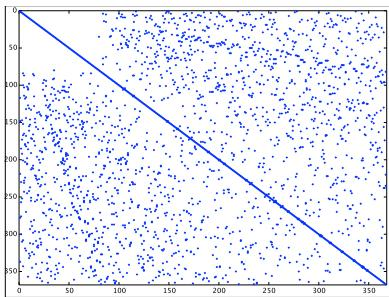
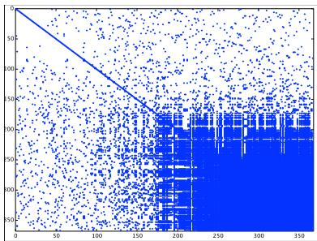
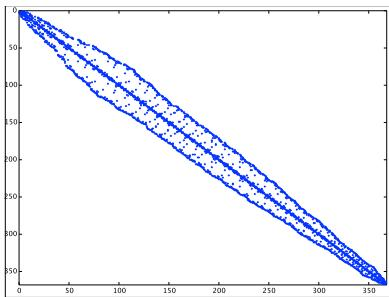
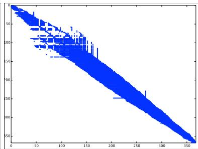

# CM4 - Vers l'optimisation d'algorithmes numériques / CM4 - 数值算法优化之路

T. DUFAUD
UVSQ – UNIVERSITE DE VERSAILLES SAINT-QUENTIN-EN-YVELINES  

## Matrices creuses, structure irrégulière / 稀疏矩阵与非规则结构

- Généralités et exploitation des propriétés des opérateurs
- 运算符性质的一般性与利用
- Exploitation des structures régulières
- 利用规则结构
  - Graphe et manipulation des structures
  - 图与结构操作
  - Permutation et réordonnancement
  - 排列与重排序

## Généralités et exploitation des propriétés des opérateurs / 一般性与运算符性质的利用

### Remarques sur les propriétés des matrices / 关于矩阵性质的备注

- Le cours CM3 repose sur l'hypothèse que $A \in \mathbb{R}^{n \times n}$ est inversible.
- CM3 仅假设 $A \in \mathbb{R}^{n \times n}$ 可逆。
- $A$ peut être symétrique définie positive (exemple : Poisson).
- $A$ 可以是对称正定矩阵（如 Poisson）。
- $A$ est généralement creuse.
- $A$ 一般是稀疏的。
- $A$ peut avoir une structure (triangulaire, diagonales, blocs).
- $A$ 可能具备结构（上/下三角、对角、分块）。

$\Rightarrow$ Ces propriétés peuvent être exploitées pour optimiser l'occupation mémoire ou réduire la complexité arithmétique.
$\Rightarrow$ 这些性质可用于优化内存占用或降低运算复杂度。

### Matrice SPD : $A \in \mathbb{R}^{n \times n}$ / 对称正定矩阵

- Une matrice $A$ est symétrique si $A^T = A$.
- 若 $A^T = A$，矩阵 $A$ 对称。
- Une matrice symétrique est définie positive si $\forall x \in \mathbb{R}^n$, $x \neq 0_n$, on a $x^{T} A x > 0$.
- 若对所有非零 $x \in \mathbb{R}^n$ 满足 $x^{T} A x > 0$，则 $A$ 对称正定。

### Propositions / 命题

Les trois propositions suivantes sont équivalentes :
以下三条互相等价：

- $A = A^T$ est définie positive si $\forall x \in \mathbb{R}^n, x \neq 0_n$, on a $x^{T} A x > 0$.
- 若 $A = A^T$ 且对所有非零 $x$ 有 $x^{T} A x > 0$，则 $A$ 正定。
- $A = A^T$ est définie positive si $\det(A(1:k, 1:k)) > 0$ pour $k = 1:n$.
- 若 $A = A^T$ 且所有顺序主子式 $\det(A(1:k,1:k))>0$（$k=1..n$），则 $A$ 正定。
- $A = A^T$ est définie positive si les valeurs propres de $A$ vérifient $\lambda_k(A) > 0$ pour $k = 1:n$ (avec $\lambda_k$ la $k$-ème plus grande valeur propre).
- 若 $A = A^T$ 且全部特征值 $\lambda_k(A)>0$（按从大到小排序），则 $A$ 正定。

### Exploiter les propositions / 利用这些命题

- Il existe une unique factorisation $LU$ de $A$ et les pivots sont tous positifs.
- $A$ 存在唯一的 $LU$ 分解，且主元均为正。
- En factorisant la diagonale de $U$ et en prenant sa racine carrée, on convertit la factorisation $LU$ en une factorisation de Cholesky $A = R R^T$ avec $R$ triangulaire supérieure et diagonale positive.
- 将 $U$ 的对角提取并开方，可把 $LU$ 转为 Cholesky 分解 $A = R R^T$，其中 $R$ 为上三角且对角正。
- L'algorithme 1 propose une implémentation avec l'arrangement de boucle « jik ».
- 算法 1 给出了 “jik” 循环顺序的实现。

### Rapplel : Factorisation LU (Version kij a version jik) / 回顾：LU 分解 （kij 顺序 到 jik 顺序）

Require: A \in R^{n\times n} inversible et det(A(1:k,1:k)) != 0 pour k=1:n

```matlab
for k = 1:n-1
    for i = k+1:n
        A(i, k) = A(i, k) / A(k, k);
    end
    for i = k+1:n
        for j = k+1:n
            A(i, j) = A(i, j) - A(i, k) * A(k, j);
        end
    end
end
```

### Algorithme 1 – Factorisation de Cholesky $A = R R^T$ (version « jik ») / 算法 1：Cholesky 分解（jik 顺序）

Require: A \in R^{n\times n} symétrique définie positive

```matlab
for j = 1:n
    for i = 1:j-1
        R(i,j) = A(i,j) - R(1:(i-1), i)' * R(1:(i-1), j);
        R(i,j) = R(i,j) / R(i,i);
    end
    R(j,j) = A(j,j) - R(:, j)' * R(:, j);
    R(j,j) = sqrt(R(j,j));
end
```

```matlab
% Version non vectorisée
for j = 1:n
    for i = 1:j-1
        sum = 0;
        for k = 1:i-1
            sum = sum + R(k,i) * R(k,j);
        end
        R(i,j) = (A(i,j) - sum) / R(i,i);
    end
    sum = 0;
    for k = 1:j-1
        sum = sum + R(k,j)^2;
    end
    R(j,j) = sqrt(A(j,j) - sum);
end
```

### Implémentation $A = L D L^{T}$ / 以 $A = L D L^{T}$ 形式的实现

Dans la littérature et les bibliothèques on trouve la factorisation de Cholesky sous la forme
在文献与库中，Cholesky 分解常写作：
$$
A = L D L^{T}
$$
avec $D = \operatorname{diag}(r_{ij}^2)$ et $L = R^T \operatorname{diag}(r_{ii})^{-1}$. On évite le calcul des racines carrées et, pour les matrices tridiagonales, cela nécessite $n$ divisions en moins pendant la substitution (voir [Higham 2002]).
其中 $D = \operatorname{diag}(r_{ij}^2)$，$L = R^T \operatorname{diag}(r_{ii})^{-1}$；可避免开方，对三对角矩阵可减少 $n$ 次除法（见 [Higham 2002]）。

### De $LU$ à $LDL^T$ pour $A = A^T$ / 对称矩阵从 $LU$ 到 $LDL^T$

- Existence et unicité de $LU$ avec $L$ unitaire inférieure.
- $LU$ 分解存在且唯一，$L$ 为单位下三角。
- Si $A = A^T$, existence et unicité de $A = L D L^T$.
- 若 $A = A^T$，则 $A = L D L^T$ 也存在且唯一。

```matlab
% Version de boucle jik
for j = 1:n
    % [1]
    for i = 1:j-1
        v(i) = L(j, i) * d(i);
    end
    % [2]
    d(j) = A(j, j) - L(j, 1:j-1) * v(1:j-1)';
    % [3]
    L(j+1:n, j) = (A(j+1:n, j) - L(j+1:n, 1:j-1) * v(1:j-1)') / d(j);
end
```

Algorithme avec forme compacte (écrasement de $a_{ij}$ par $\ell_{ij}$ si $i \ge j$ et $d_{i}$ si $i=j$) :

```matlab
for j = 1:n
    % [1]
    for i = 1:j-1
        v(i) = A(j, i) * A(i, i);
    end
    % [2]
    A(j, j) = A(j, j) - A(j, 1:j-1) * v(1:j-1)';
    % [3]
    A(j+1:n, j) = (A(j+1:n, j) - A(j+1:n, 1:j-1) * v(1:j-1)') / A(j, j);
end
```

## Exploitation des structures régulières / 利用规则结构

### Matrices bandes / 带状矩阵

- Englobent un grand nombre de matrices issues de la discrétisation des EDP.
- 覆盖许多 PDE 离散化得到的矩阵。
- BLAS et LAPACK fournissent des implémentations pour les matrices stockées par bande (suffixe GB pour general band, GE pour dense).
- BLAS 与 LAPACK 提供带状存储实现（带状后缀 GB，稠密为 GE）。

### Stockage GB / GB 带状存储

- Une matrice $m \times n$ avec $kl$ sous-diagonales et $ku$ sur-diagonales est stockée dans un tableau à deux dimensions avec $kl + ku + 1$ lignes et $n$ colonnes.
- 具有 $kl$ 条下对角与 $ku$ 条上对角的 $m \times n$ 矩阵，可存入 $(kl+ku+1) \times n$ 的二维数组。
- Les colonnes de la matrice sont stockées dans les colonnes correspondantes du tableau et les diagonales dans ses lignes.
- 矩阵列对应数组列，各对角线对应数组行。
- À utiliser seulement si $kl, ku \ll \min(m, n)$. Dans LAPACK les matrices de ce type portent un nom se terminant par B.
- 仅当 $kl, ku \ll \min(m,n)$ 时使用；LAPACK 中此类矩阵名以 B 结尾。

L'élément $a_{ij}$ de $A$ est stocké dans $AB(ku + 1 + i - j, j)$. Par exemple, pour $m = n = 5$, $kl = 2$, $ku = 1$ :
元素 $a_{ij}$ 存于 $AB(ku + 1 + i - j, j)$。示例：$m=n=5$, $kl=2$, $ku=1$：
$$
A = \begin{pmatrix}
 a_{11} & a_{12} &        &        &        \\
 a_{21} & a_{22} & a_{23} &        &        \\
 a_{31} & a_{32} & a_{33} & a_{34} &        \\
        & a_{42} & a_{43} & a_{44} & a_{45} \\
        &        & a_{53} & a_{54} & a_{55}
\end{pmatrix}
\Rightarrow
AB = \begin{pmatrix}
 *      & a_{12} & a_{23} & a_{34} & a_{45} \\
 a_{11} & a_{22} & a_{33} & a_{44} & a_{55} \\
 a_{21} & a_{32} & a_{43} & a_{54} & *      \\
 a_{31} & a_{42} & a_{53} & *      & *
\end{pmatrix}
$$
Les cases marquées \* doivent être affectées (souvent à 0). Ce format permet de stocker les éléments dans la bande, y compris les zéros. BLAS et LAPACK ne sont pas, dans leur version d'origine, des bibliothèques pour l'algèbre creuse.
标注 * 的位置需填充值（通常为 0）。该格式在带宽内存储元素（含零）；BLAS 与 LAPACK 原版并非稀疏代数库。

Avec MATLAB ou Octave on peut stocker des matrices au format diagonal creux (seules les diagonales non nulles sont stockées). La routine correspondante est `spdiags`.
在 MATLAB/Octave 中可用对角稀疏格式（仅存非零对角），对应函数 `spdiags`。

## Matrices creuses, structure irrégulière

稀疏矩阵与非规则结构

### Graphe / 图

Un graphe est défini par deux ensembles :
图由以下两类集合定义：

- Sommets (Vertices) $V = \{v_1, v_2, \dots, v_n\}$.
- 顶点 $V = \{v_1, v_2, \dots, v_n\}$。
- Arêtes (Edges) $e_{ij} = (v_i, v_j)$ avec $E \subseteq V \times V$.
- 边 $e_{ij} = (v_i, v_j)$，集合 $E \subseteq V \times V$。
On note $G = (V, E)$ un ensemble de points connectés par des arêtes.
记 $G = (V,E)$，表示点与边的集合。

### $G = (V, E)$ d'une matrice $A \in \mathbb{M}^{n \times n}$ / 矩阵 $A$ 的图

- Les $n$ sommets de $V$ correspondent aux $n$ inconnues du système $Ax = b$.
- $V$ 中的 $n$ 个顶点对应 $Ax=b$ 的 $n$ 个未知。
- Les arêtes $e_{ij}$ représentent les relations binaires issues des équations : il y a une arête de $i$ vers $j$ quand $a_{ij} \neq 0$ ($\Rightarrow$ l'équation $i$ implique l'inconnue $j$).
- 边 $e_{ij}$ 表示方程的二元关系：当 $a_{ij}\neq 0$ 时有边 $i \to j$（方程 $i$ 关联未知 $j$）。

### Graphe orienté ou non orienté ? / 有向或无向图？

- Si le patron de la matrice est symétrique ($a_{ij} \neq 0$ et $a_{ji} \neq 0$) alors le graphe est **non orienté**.
- 若矩阵非零模式对称（$a_{ij}\neq0$ 且 $a_{ji}\neq0$），则图为**无向**。
- Sinon le graphe est **orienté**.
- 否则为**有向**。

### 1 inconnue physique par point de maillage / 每网格点一未知

Le graphe d'adjacence de la matrice issue de la discrétisation correspond souvent au graphe du maillage.
离散矩阵的邻接图通常即为网格图。

### Plusieurs inconnues physiques par point de maillage / 每网格点多未知

Deux choix :
两种编号方式：

- Les marquer de manière contiguë à chaque point de maillage.
- 在每个网格点连续编号各物理量。
- Les marquer type par type.
- 按类型分组编号。

Les deux cas donnent une information redondante. On préfère le graphe quotienté, qui correspond au maillage physique.
两种方式都会产生冗余，通常采用对应物理网格的商图。

### Permutation des lignes et colonnes / 行列置换

Soit $A \in \mathbb{M}^{n \times m}$ et $\Pi = \{i_1, i_2, \dots, i_n\}$ une permutation de $\{1, 2, \dots, n\}$. Les matrices :
设 $A \in \mathbb{M}^{n \times m}$，$\Pi = \{i_1, \dots, i_n\}$ 为 $\{1..n\}$ 的置换，则：
$$
A_{\Pi, *} = \{a_{\Pi(i), j}\}_{i = 1..n;\ j = 1..m}, \quad
A_{*, \Pi} = \{a_{i, \Pi(j)}\}_{i = 1..n;\ j = 1..m}
$$
sont appelées row $\Pi$-permutation et column $\Pi$-permutation de $A$.
称为 $A$ 的行置换与列置换。

### Matrice d'intervention / 交换矩阵

- Toute permutation de $\{1,2,\dots,n\}$ est un produit d'interventions (permutations élémentaires) où 2 entrées sont interverties.
- 任意置换可视为若干次交换（两元素互换）的乘积。
- Une matrice d'intervention (interchange matrix) est une matrice identité dont deux lignes sont interverties. On note $X_{ij}$ l'intervention des lignes $i$ et $j$.
- 交换矩阵是将单位矩阵的两行互换，记为 $X_{ij}$。
- Soit $\Pi$ une permutation arbitraire : c'est le produit d'une série de $n$ interventions consécutives $\sigma(i_k, j_k)$, $k = 1..n$.
- 任意置换 $\Pi$ 可写作一系列交换 $\sigma(i_k,j_k)$ 的乘积。

### Proposition / 命题

Pour une permutation $\Pi$ résultant des $\sigma(i_k, j_k)$ :
若 $\Pi$ 由交换序列得到，则：
$$
A_{\Pi, *} = P_{\Pi} A, \qquad A_{*, \Pi} = A Q_{\Pi}
$$
avec
并且
$$
P_{\Pi} = X_{i_n j_n} X_{i_{n-1} j_{n-1}} \dots X_{i_1 j_1}, \qquad
Q_{\Pi} = X_{i_1 j_1} X_{i_2 j_2} \dots X_{i_n j_n}.
$$

### Remarques / 备注

- $P_{\Pi}$ et $Q_{\Pi}$ sont des matrices de permutation, $X_{ij}^2 = I$.
- $P_{\Pi}$ 与 $Q_{\Pi}$ 为置换矩阵，且 $X_{ij}^2 = I$。
- $P_{\Pi} Q_{\Pi} = I$.
- $P_{\Pi} Q_{\Pi} = I$。
- $P_{\Pi}$ et $Q_{\Pi}$ sont inversibles.
- $P_{\Pi}$、$Q_{\Pi}$ 可逆。
- Chaque $X_{ij}$ est symétrique, donc $Q_{\Pi}$ est la transposée de $P_{\Pi}$ : $Q_{\Pi} = P_{\Pi}^T = P_{\Pi}^{-1}$.
- 每个 $X_{ij}$ 对称，因此 $Q_{\Pi} = P_{\Pi}^T = P_{\Pi}^{-1}$。
- Les matrices de permutation sont unitaires.
- 置换矩阵是酉矩阵。

### Écriture matricielle des permutations ligne et colonne / 行列置换的矩阵写法

Avec la notation précédente :
用上述记号：
$$
P_{\Pi} = I_{\Pi, *}, \qquad Q_{\Pi} = I_{*, \Pi}
$$
d'où
因此
$$
A_{\Pi, *} = I_{\Pi, *} A = P_{\Pi} A, \qquad
A_{*, \Pi} = A I_{*, \Pi} = A P_{\Pi}^T.
$$

### Interprétation / 解释

- Permuter les lignes revient à changer l'ordre des équations.
- 行置换 = 改变方程顺序。
- Permuter les colonnes revient à changer l'ordre des inconnues.
- 列置换 = 改变未知顺序。

### Permutation symétrique / 对称置换

Permutation simultanée des lignes et colonnes de $A$ :
同时置换 $A$ 的行列：
$$
A_{\Pi, \Pi} = P_{\Pi}^T A P_{\Pi}
$$
$\Rightarrow$ ré-ordonner équations et inconnues de la même manière.
$\Rightarrow$ 以同样顺序重排方程与未知。

### Permutation symétrique et graphe d'adjacence / 对称置换与邻接图

Une permutation symétrique préserve le graphe d'adjacence. Si $(i, j)$ est un sommet du graphe de $A$ et $A'$ la matrice permutée, alors $a'_{ij} = a_{\Pi(i) \Pi(j)}$ : $(i, j)$ est une arête du graphe de $A'$ ssi $(\Pi(i), \Pi(j))$ est une arête du graphe de $A$.
对称置换保持邻接图：若 $a'_{ij} = a_{\Pi(i)\Pi(j)}$，则 $(i,j)$ 是 $A'$ 的边当且仅当 $(\Pi(i),\Pi(j))$ 是 $A$ 的边。

### Réordonnancement / 重排序

- Level-set
- 层次集方法
- Cuthill-McKee
- Cuthill-McKee 算法

### Réduire l'occupation mémoire pour l'élimination de Gauss / 高斯消元的内存减法

Pour les matrices creuses, l'élimination de Gauss nécessite le stockage de tous les éléments compris dans la bande la plus large. On réordonne la matrice pour rapprocher les éléments de la diagonale principale et réduire la bande.
对稀疏矩阵，高斯消元需存储最宽带内的元素；通过重排使元素靠近主对角以缩小带宽、降低内存。

### Illustration / 示例

- Cas de la matrice de test `poisson2D` de la toolbox FEMLAB pour la résolution d'EDP par éléments finis (Tim Davis's collection).
- 示例：FEMLAB 工具箱中的 `poisson2D` 测试矩阵（有限元离散，Tim Davis 集合）。
- $A \in \mathbb{R}^{n \times n}$, $n = 367$, $nnz = 2417$.
- $A \in \mathbb{R}^{n \times n}$，$n=367$，$nnz=2417$。
- Permutation symétrique de $A$ avec Cuthill-McKee (RCM) implémentée dans Octave :
- 在 Octave 中用 Cuthill-McKee（RCM）进行对称置换：

$$
p = \operatorname{symrcm}(A)
$$

- Factorisation $LU$ avec pivot partiel sur $A$ et sur $A(p, p)$.
- 对 $A$ 与 $A(p,p)$ 进行部分主元 LU 分解。

  



Figure : Profils de la matrice $A$ de FEMLAB/poisson2D (au-dessus) et de sa factorisation LU (au-dessous).
图：FEMLAB/poisson2D 的矩阵剖面（上）与其 LU 剖面（下）。

  



Figure : Profils de la matrice $A$ réordonnée par RCM (au-dessus) et de sa factorisation LU (au-dessous).
图：经 RCM 重排的矩阵 $A$ 剖面（上）与其 LU 剖面（下）。

| matrice (矩阵) | nnz (非零元) | M.O. (内存占用) | ratio (相对大小) |
|---------------|--------------|----------------|------------------|
| A             | 2417         | 30.476         |                  |
| lu(A)         | 30531        | 372.248        | 12.2             |
| lu(A(p,p))    | 13042        | 162.380        | 5.3              |

Table : Influence de la largeur de bande sur le stockage pour la matrice $A$, sa factorisation LU compressée et celle de $A$ ordonnée par RCM.
表：带宽对矩阵 $A$、其压缩 LU 分解及 RCM 重排后 LU 的存储影响。

## Stockage creux / 稀疏存储

- Le nombre d'éléments non nuls est noté $nnz \ll n^2$.
- 非零元素数记为 $nnz \ll n^2$。
- Au stockage creux on associe un algorithme permettant d'accéder aux éléments de la matrice.
- 稀疏存储需配合相应算法访问矩阵元素。
- Principales méthodes :
- 主要方法：
  - CSR, Compressed Sparse Row (stockage ligne)
  - CSR，压缩稀疏行格式
  - CSC, Compressed Sparse Column (stockage colonne)
  - CSC，压缩稀疏列格式
  - COO, Coordinate storage (stockage $(i, j)$)
  - COO，坐标格式（按 $(i,j)$ 存）

### COO / 坐标格式

COO (Coordinate storage) : on stocke les éléments non nuls de la matrice dans un tableau `AA` de taille $nnz$. Pour accéder aux éléments on ajoute deux tableaux d'entiers `JR` et `JC` de taille $nnz$ contenant les indices $i$ et $j$ associés à l'objet $(i, j)$.
COO：将非零元素存入长度为 $nnz$ 的数组 `AA`，并用整数数组 `JR`、`JC`（长度 $nnz$）记录对应的行列索引。

### Exemple 3.7 (Saad 2003, chap. 3 p.84) / 示例 3.7

$$
A = \begin{pmatrix}
 1. & 0. & 0. & 2. & 0. \\
 3. & 4. & 0. & 5. & 0. \\
 6. & 0. & 7. & 8. & 9. \\
 0. & 0. & 10. & 11. & 0. \\
 0. & 0. & 0. & 0. & 12.
\end{pmatrix}
$$
sera représentée (par exemple) par :
例如可以表示为：

|     | 1  | 2  | 3  | 4  | 5  | 6  | 7  | 8  | 9  | 10 | 11 | 12 |
|-----|----|----|----|----|----|----|----|----|----|----|----|----|
| AA  | 12 | 9  | 7  | 5  | 1  | 2  | 11 | 3  | 6  | 4  | 8  | 10 |
| JR  | 5  | 3  | 3  | 2  | 1  | 1  | 4  | 2  | 3  | 2  | 3  | 4  |
| JC  | 5  | 5  | 3  | 4  | 1  | 4  | 4  | 1  | 1  | 2  | 4  | 3  |

### CSR, CSC / CSR 与 CSC

- **CSR (Compressed Sparse Row)** : on stocke les éléments non nuls dans un tableau `AA` de taille $nnz$ (ligne par ligne). Pour accéder aux éléments on ajoute deux tableaux :
- **CSR**：按行依次将非零元存入长度为 $nnz$ 的 `AA`；并加入两个数组：
  - `JA` (taille $nnz$) contenant les numéros de colonne ;
  - `JA`（长度 $nnz$）存列号；
  - `IA` (taille $n + 1$) contenant les pointeurs de début de ligne.
  - `IA`（长度 $n+1$）存行起始指针。
- **CSC (Compressed Sparse Column)** : stockage colonne par colonne ; `JA` contient les numéros de ligne et `IA` les pointeurs de début de colonne.
- **CSC**：按列存储；`JA` 存行号，`IA` 存列起始指针。

### Stockage CSR (Saad 2003, chap. 3 p.85) / CSR 存储示例

|     | 1  | 2  | 3  | 4  | 5  | 6  | 7  | 8  | 9  | 10 | 11 | 12 |
|-----|----|----|----|----|----|----|----|----|----|----|----|----|
| AA  | 1. | 2. | 3. | 4. | 5. | 6. | 7. | 8. | 9. | 10. | 11. | 12. |
| JA  | 1  | 4  | 1  | 2  | 4  | 1  | 3  | 4  | 5  | 3   | 4   | 5   |

| IA | 1 | 3 | 6 | 10 | 12 | 13 |

## Exercice / 练习

- Écrire le stockage CSC.
- 写出 CSC 存储格式。
- Écrire un algorithme pour le produit matrice-vecteur pour CSR.
- 给出 CSR 形式下的矩阵-向量乘算法。

## Références / 参考文献

- [Golub 1996] Gene H. Golub, Charles F. Van Loan, *Matrix Computations* (3rd ed.), Johns Hopkins University Press, 1996.
- [Golub 1996] Gene H. Golub, Charles F. Van Loan，《Matrix Computations》第三版。
- [Higham 2002] N. J. Higham, *Accuracy and Stability of Numerical Algorithms* (2e éd.), SIAM, 2002.
- [Higham 2002] N. J. Higham，《Accuracy and Stability of Numerical Algorithms》第二版，SIAM，2002。
- [Saad 2003] Y. Saad, *Iterative Methods for Sparse Linear Systems* (2e éd.), SIAM, 2003.
- [Saad 2003] Y. Saad，《Iterative Methods for Sparse Linear Systems》第二版，SIAM，2003。
- [netlib 19YY] [http://www.netlib.org/blur/].
