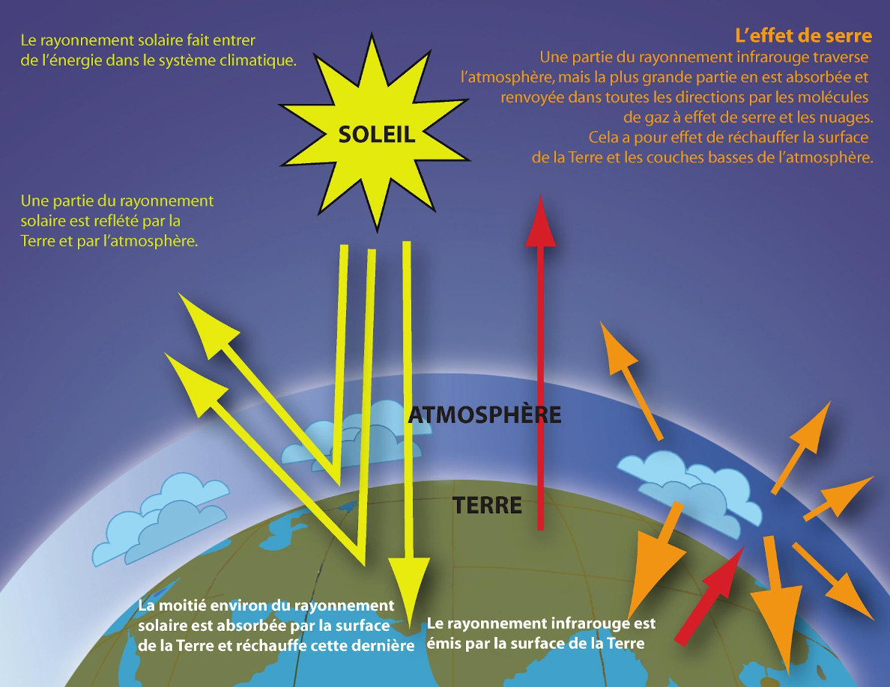
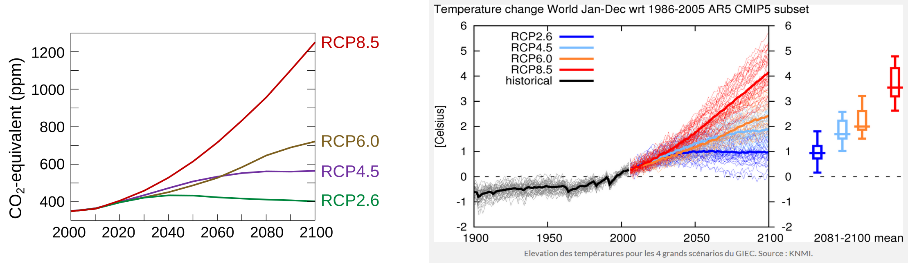
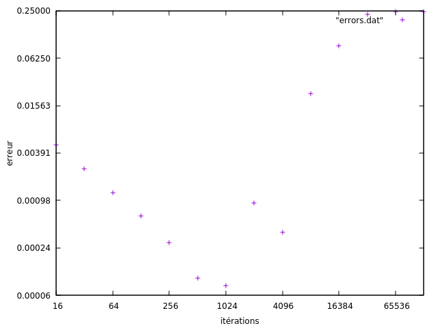

# TD1: Simulation d'un modèle climatique simple TD1：简单气候模型的模拟

_Calcul Numérique, M1 CHPS, 2021-2022 Pablo Oliveira [<pablo.oliveira@uvsq.fr>]_
_数值计算课程，M1 CHPS，2021-2022，Pablo Oliveira [<pablo.oliveira@uvsq.fr>]_

## Partie A: Preuve de la convergence de la méthode d'Euler explicite 第 A 部分：显式欧拉方法收敛性的证明

Soit le problème de Cauchy suivant:
给定如下柯西问题：

$$
\left\{
\begin{array}{l}
   y' = f(t,y(t))          \\
   y(t_0) = y_0, t_0 \in I \\
\end{array}
\right.
$$

avec $f$ définie sur $\mathbb{R} \times \mathbb{R} \rightarrow \mathbb{R}$.

La fonction $f(t, y(t))$ est continue et Lipschitzienne en $y$, c'est à dire
$$
\forall t \quad \exists k > 0 \quad \forall y_1,y_2, \qquad |f(t,y_1) - f(t,y_2)| \leq k|y_1-y_2|
$$

Soit $h > 0$ le pas d'intégration, la méthode d'Euler explicite s'exprime récursivement:
取 $h > 0$ 为积分步长，显式欧拉方法递推写作：

$$
\widetilde{y}_{n+1} = \widetilde{y}_n + hf(t_n, \widetilde{y}_n) \qquad t_n = t_0 + nh
$$

On s'intéresse à l'erreur locale à l'étape $n+1$,
我们关心第 $n+1$ 步的局部误差，

$$
|e_{n+1}| = |y(t_{n+1}) - \widetilde{y}_{n+1}|
$$

1. Montrer que $|e_{n+1}| \le (1+kh)|e_n| + mh^2$ où $k > 0$ et $m > 0$ sont constantes. 证明 $|e_{n+1}| \le (1+kh)|e_n| + mh^2$，其中 $k > 0$ 与 $m > 0$ 为常数。

   _Conseils:_
   建议：
   - Utiliser un développement de Taylor-Lagrange à l'ordre 2 de $y$
   使用 $y$ 的二阶泰勒-拉格朗日展开
   - Utiliser le fait que $f$ est $k$-Lipschitzienne sur la deuxième variable
   利用 $f$ 在第二个变量上是 $k$-利普希茨函数

   _Rappel:_
   提示：

   - Taylor-Lagrange (à l'ordre 2):
   泰勒-拉格朗日展开（2 阶）：
      $$y(t+h) = y(t) + y'(t)h + R(h)$$
      avec $|R(h)| \leq \frac{Mh^2}{2}$ et $M \geq 0$
      其中 $|R(h)| \leq \frac{Mh^2}{2}$ 且 $M \geq 0$

   _Resolve:_
   解答：

   **Démonstration:** **证明：**
  
   Or: $|e_{n+1}| = |y(t_{n+1}) - \widetilde{y}_{n+1}|$
  
   On a: $y(t_{n+1}) = y(t_n + h) = y(t_n) + y'(t_n)h + R(h)$
  
   Donc:
   因此：
   $$|e_{n+1}| = |y(t_n) + y'(t_n)h + R(h) - \widetilde{y}_n - hf(t_n, \widetilde{y}_n)|$$
   $$= |y(t_n) - \widetilde{y}_n + h[y'(t_n) - f(t_n, \widetilde{y}_n)] + R(h)|$$
   $$= |e_n + h[f(t_n, y(t_n)) - f(t_n, \widetilde{y}_n)] + R(h)|$$

   En utilisant l'inégalité triangulaire:
   利用三角不等式：
   $$|e_{n+1}| \leq |e_n| + h|f(t_n, y(t_n)) - f(t_n, \widetilde{y}_n)| + |R(h)|$$

   Avec la condition k-Lipschitz:
   结合 $k$-利普希茨条件：
   $$|e_{n+1}| \leq |e_n| + hk|y(t_n) - \widetilde{y}_n| + |R(h)|$$
   $$\leq |e_n| + hk|e_n| + |R(h)|$$
   $$= (1+kh)|e_n| + |R(h)|$$

   Et avec $|R(h)| \leq \frac{Mh^2}{2}$, on pose $m = \frac{M}{2}$:
   再利用 $|R(h)| \leq \frac{Mh^2}{2}$，取 $m = \frac{M}{2}$：
   $$|e_{n+1}| \leq (1+kh)|e_n| + mh^2$$

2. Poser $u_n = (1+kh)^{-n}e_n$ et montrer que $\sum_{i=0}^{n-1} |u_{i+1}| - |u_{i}| \le \frac{m}{k}h$.

   _Conseils:_
   建议：
   - Utiliser la majoration montrée dans la question précédente
   使用上一问中得到的上界
   - Rappel: $\sum_{i=0}^{n-1}a^i = \frac{a^n-1}{a-1}$ pour $a$ constante
   回顾：对于常数 $a$，$\sum_{i=0}^{n-1}a^i = \frac{a^n-1}{a-1}$

   _Resolve:_
   解答：

   On pose $u_n = (1+kh)^{-n}e_n$. De la question précédente, on a:
   令 $u_n = (1+kh)^{-n}e_n$，由上一问可得：
   $$|e_{n+1}| \leq (1+kh)|e_n| + mh^2$$

   En divisant par $(1+kh)^{n+1}$:
   两边同除以 $(1+kh)^{n+1}$：
   $$\frac{|e_{n+1}|}{(1+kh)^{n+1}} \leq \frac{(1+kh)|e_n|}{(1+kh)^{n+1}} + \frac{mh^2}{(1+kh)^{n+1}}$$
   $$|u_{n+1}| \leq \frac{|e_n|}{(1+kh)^n} + \frac{mh^2}{(1+kh)^{n+1}}$$
   $$|u_{n+1}| \leq |u_n| + \frac{mh^2}{(1+kh)^{n+1}}$$

   Donc:
   因此：
   $$|u_{n+1}| - |u_n| \leq \frac{mh^2}{(1+kh)^{n+1}}$$

   En sommant de $i=0$ à $n-1$:
   对 $i=0$ 到 $n-1$ 求和：
   $$\sum_{i=0}^{n-1}(|u_{i+1}| - |u_i|) \leq \sum_{i=0}^{n-1}\frac{mh^2}{(1+kh)^{i+1}}$$
   $$= \frac{mh^2}{1+kh}\sum_{i=0}^{n-1}\frac{1}{(1+kh)^i}$$

   En utilisant la formule géométrique avec $a = \frac{1}{1+kh} < 1$:
   利用几何级数求和公式，取 $a = \frac{1}{1+kh} < 1$：
   $$= \frac{mh^2}{1+kh} \cdot \frac{1-(\frac{1}{1+kh})^n}{1-\frac{1}{1+kh}} = \frac{mh^2}{1+kh} \cdot \frac{1-(\frac{1}{1+kh})^n}{\frac{kh}{1+kh}}$$
   $$= \frac{mh}{k}(1-(\frac{1}{1+kh})^n) \leq \frac{mh}{k}$$

3. Montrer que $|e_n| \le (1+kh)^n(|e_0| + \frac{m}{k}h)$ 证明 $|e_n| \le (1+kh)^n(|e_0| + \frac{m}{k}h)$

   _Conseils:_
   建议：
   - Sommer télescopiquement $\sum_{i=0}^{n-1}|u_{i+1}| - |u_{i}|$
   对 $\sum_{i=0}^{n-1}|u_{i+1}| - |u_{i}|$ 进行望远镜求和

   _Resolve:_
   解答：

   **Démonstration:**
   **证明：**

   Par sommation télescopique:
   由望远镜求和可得：
   $$\sum_{i=0}^{n-1}(|u_{i+1}| - |u_i|) = |u_n| - |u_0|$$

   De la question précédente, on sait que:
   根据上一问可知：
   $$\sum_{i=0}^{n-1}(|u_{i+1}| - |u_i|) \leq \frac{mh}{k}$$

   Donc:
   因此：
   $$|u_n| - |u_0| \leq \frac{mh}{k}$$
   $$|u_n| \leq |u_0| + \frac{mh}{k}$$

   Comme $u_n = (1+kh)^{-n}e_n$ et $u_0 = e_0$:
   由于 $u_n = (1+kh)^{-n}e_n$ 且 $u_0 = e_0$：
   $$\frac{|e_n|}{(1+kh)^n} \leq |e_0| + \frac{mh}{k}$$

   En multipliant par $(1+kh)^n$:
   两边乘以 $(1+kh)^n$：
   $$|e_n| \leq (1+kh)^n\left(|e_0| + \frac{mh}{k}\right)$$

4. Montrer que $|e_n| \le e^{khn}(|e_0|+\frac{m}{k}h)$

   _Conseils:_
   - Montrer que $(1+kh) \le e^{kh}$

   _Resolve:_
   解答：

   **Démonstration:**
   **证明：**

   D'abord, montrons que $(1+kh) \leq e^{kh}$ pour $h > 0$.
   首先证明对 $h > 0$ 有 $(1+kh) \leq e^{kh}$。

   Soit $g(x) = e^x - (1+x)$ pour $x \geq 0$. On a $g'(x) = e^x - 1$ et $g''(x) = e^x > 0$.

   Comme $g(0) = 0$ et $g'(0) = 0$, et $g''(x) > 0$ pour $x > 0$, on a $g(x) \geq 0$ pour $x \geq 0$.

   Donc $e^x \geq 1+x$ pour $x \geq 0$, ce qui donne $(1+kh) \leq e^{kh}$.

   De la question précédente:
   $$|e_n| \leq (1+kh)^n\left(|e_0| + \frac{mh}{k}\right)$$

   En utilisant $(1+kh) \leq e^{kh}$:
   使用 $(1+kh) \leq e^{kh}$：
   $$(1+kh)^n \leq (e^{kh})^n = e^{khn}$$

   Donc:
   因此：
   $$|e_n| \leq e^{khn}\left(|e_0| + \frac{mh}{k}\right)$$

5. Montrez que $\forall n,\;\lim_{h \rightarrow 0} |e_n| = 0$ lorsque $\widetilde{y}_0 = y(t_0)$. Que pouvez vous dire sur la vitesse de convergence ? 证明当 $\widetilde{y}_0 = y(t_0)$ 时，对所有 $n$ 有 $\lim_{h \rightarrow 0} |e_n| = 0$。并讨论收敛速度。

   _Resolve:_
   解答：

   **Démonstration:**
   **证明：**

   Quand $\widetilde{y}_0 = y(t_0)$, on a $|e_0| = 0$.
   当 $\widetilde{y}_0 = y(t_0)$ 时，有 $|e_0| = 0$。

   De la question précédente:
   根据上一问：
   $$|e_n| \leq e^{khn}\left(|e_0| + \frac{mh}{k}\right) = e^{khn} \cdot \frac{mh}{k}$$

   Pour un temps fixé $t = t_0 + nh$, quand $h \to 0$, on a $n \to \infty$ mais $nh = t - t_0$ reste constant.
   对于固定时间 $t = t_0 + nh$，当 $h \to 0$ 时，$n \to \infty$ 但 $nh = t - t_0$ 保持常数。

   Donc $khn = k(t - t_0)$ est constant, et:
   因此 $khn = k(t - t_0)$ 为常数，并且：
   $$|e_n| \leq e^{k(t-t_0)} \cdot \frac{mh}{k}$$

   Quand $h \to 0$:
   当 $h \to 0$ 时：
   $$\lim_{h \to 0} |e_n| \leq \lim_{h \to 0} e^{k(t-t_0)} \cdot \frac{mh}{k} = e^{k(t-t_0)} \cdot \frac{m \cdot 0}{k} = 0$$

   **Vitesse de convergence:** La méthode d'Euler explicite a une vitesse de convergence d'ordre 1, c'est-à-dire $|e_n| = O(h)$, car l'erreur est proportionnelle à $h$.
   **收敛速度：** 显式欧拉方法具有一阶收敛速度，即 $|e_n| = O(h)$，因为误差与 $h$ 成正比。

## Partie B: Un modèle climatique simple 第 B 部分：一个简单的气候模型

Dans cette partie nous souhaitons simuler le réchauffement climatique par un modèle simple de l'effet de serre.
本部分我们希望用一个简单的温室效应模型来模拟气候变暖。

Le modèle utilisé est une simplification du modèle utilisé dans les logiciels [SimClimat](https://www.lmd.jussieu.fr/~crlmd/simclimat/) développé par Camille Risi et [py-simclimat](https://gitlab.in2p3.fr/alexis.tantet/py-simclimat) développé par Alexis Tantet.
我们采用的模型是对 Camille Risi 开发的 [SimClimat](https://www.lmd.jussieu.fr/~crlmd/simclimat/) 和 Alexis Tantet 开发的 [py-simclimat](https://gitlab.in2p3.fr/alexis.tantet/py-simclimat) 软件中模型的简化。

### Description du modèle 模型描述

La figure ci-dessous, extraite du rapport du [GIEC](https://www.ipcc.ch/languages-2/francais/) 2007, schématise l'effet de serre naturel.
下图摘自 2007 年 [IPCC](https://www.ipcc.ch/languages-2/francais/) 报告，示意了自然温室效应。



Pour modéliser l'effet de serre, nous allons utiliser un modèle radiatif global.
为建模温室效应，我们将使用一个整体辐射模型。

- Radiatif: car nous allons faire le bilan énergétique des rayonnements entrants et sortants.
- 辐射模型：因为我们将对入射与出射辐射的能量进行平衡。
- Global: car nous considérons la terre comme un seul point et ne modélisons pas des phénomènes localisés.
- 整体模型：因为我们把地球视为单个点，不对局部现象建模。

#### Puissance entrante 入射功率

La puissance entrante est due au rayonnement solaire. Elle correspond à $S_0/4$ où la constante solaire $S_0=1370W.m^{-2}$. Le facteur $\frac{1}{4}$ est nécessaire car seulement un quart du globe est éclairé par le soleil à chaque instant.
入射功率来自太阳辐射，对应于 $S_0/4$，其中太阳常数 $S_0=1370W.m^{-2}$；因任意时刻只有四分之一的地球被太阳照亮，所以需要乘以系数 $\frac{1}{4}$。

Néanmoins une partie de ce rayonnement est reflété par la terre et l'atmosphère. L'albedo planétaire, $\alpha$, est la fraction du rayonnement reflété.
然而部分辐射会被地球和大气反射，行星反照率 $\alpha$ 表示被反射辐射的比例。

Ainsi, la puissance entrante est
因此入射功率为

$$P_{in} = (1-\alpha)\frac{S_0}{4}$$

#### Puissance sortante 出射功率

La puissance sortante est émise sous forme d'infrarouges par la surface de la terre. En considérant que la terre est un corps noir, elle peut-être calculée avec la formule $\sigma.T^4$ où $\sigma$ est la constante de Stefan-Boltzmann et $T$ est la température.
出射功率由地球表面以红外形式辐射出去，将地球视为黑体时，可用 $\sigma T^4$ 计算，其中 $\sigma$ 为斯特藩-玻尔兹曼常数、$T$ 为温度。

À nouveau, une partie du rayonnement infrarouge est absorbé et rediffusé par l'atmosphère dans toutes les directions. Ce phénomène, appelé l'effet de serre, conserve une partie de l'énergie infrarouge réémise.
同样，大气会吸收并向各方向再辐射部分红外辐射，这一现象称为温室效应，会保留部分再辐射的红外能量。

La fraction d'énergie conservée est modélisée par $G(t,T)$.
保留下来的能量分数由 $G(t,T)$ 描述。
Donc, la puissance sortante s'écrit
因此出射功率为

$$P_{out} = (1-G(t, T))\sigma T^4$$

#### Calcul de $G(t,T)$ 计算 $G(t,T)$

 $G(t, T)$ dépends de la quantité de gaz à effet de serre dans l'atmosphère à un instant $t$. Ici pour simplifier, on s'intéressera uniquement aux deux gaz à effet de serre ayant l'effet le plus important: la vapeur d'eau et au dioxyde de carbone (CO$_2$).
 $G(t, T)$ 取决于时刻 $t$ 大气中的温室气体含量；为简化，我们仅关注影响最大的两种气体：水汽与二氧化碳（CO$_2$）。

 Le dioxyde de carbone présent dans l'atmosphère peut être d'origine naturel (activité volcanique, géothermique, incendies naturels, etc.) ou d'origine anthropique, c'est à dire produit par l'activité humaine. Depuis plusieurs décennies, les émissions anthropiques sont en forte croissance et responsables de la crise climatique actuelle.
 大气中的二氧化碳既可能来自自然源（火山、地热、自然火灾等），也可能来自人类活动；近几十年来人为排放急剧增加，是当下气候危机的主要因素。

La quantité de vapeur présente dans l'atmosphère dépends de la température, en effet lorsqu'elle augmente il y a plus d'évaporation.
大气中的水汽量与温度相关，温度越高蒸发越强。

Dans ce TP nous modéliserons $G$ avec un modèle linéaire qui dépend de la concentration en CO$_{2}$ exprimée en ppm et de la température $T$,
在本次实验中，我们用一个依赖二氧化碳浓度（ppm）和温度 $T$ 的线性模型表示 $G$，

 $$ G(t,T) = 0.0033507 \times T + 0.000032099 \times C_{CO_2}(t) - 0.56159 $$

Ce modèle linéaire est une approximation du modèle plus complexe décrit dans le  [modèle SimClimat](https://www.lmd.jussieu.fr/~crlmd/simclimat/documentation_2019/node7.html).
该线性模型近似于 [SimClimat 模型](https://www.lmd.jussieu.fr/~crlmd/simclimat/documentation_2019/node7.html) 中更复杂的描述。

#### Variation de la température 温度变化

Dans notre modèle la température varie en fonction du bilan radiatif
在此模型中，温度随辐射收支变化
$$dT = (P_{in} - P_{out}) \times \frac{dt}{100}$$
où $dt$ est une variation du temps $t$ exprimé en années.
其中 $dt$ 是以年为单位的时间增量。

La constante 100 modélise l'inertie de changement de température.
常数 100 用于模拟温度变化的惯性。

1. Dans le fichier `simulation.c`, rajouter les fonctions `real P_in(void)` et `real P_out(real t, real T)` qui calculent les puissances en entrée et en sortie du système terre.
在 `simulation.c` 中添加 `real P_in(void)` 与 `real P_out(real t, real T)` 函数，用于计算地球系统的入射与出射功率。

   Conseil: Utiliser l'alias `real` pour les types flottants car cela nous permettra de changer facilement d'une représentation `double` vers une représentation `float` (simple précision).
   建议：使用 `real` 作为浮点类型别名，便于在 `double` 与 `float`（单精度）表示之间切换。

2. Rajouter la fonction `real F(real t, real T)` qui calcule la différence de température $dT$ selon la formule ci-dessus.
添加 `real F(real t, real T)` 函数，根据上述公式计算温差 $dT$。

### Intégration temporelle 时间积分

Nous souhaitons prédire l'évolution de la température avec le modèle précédent.
我们希望利用上述模型预测温度的演化。

1. Montrer que le modèle peut-être intégré sur le temps avec la méthode d'Euler explicite (on admettra que la fonction est lipschitzienne). Écrivez la formule permettant de calculer la température $\widetilde{T}_{n+1}$ à partir de $\widetilde{T}_{n}$.
说明该模型可用显式欧拉方法进行时间积分（假设函数满足利普希茨条件），并写出由 $\widetilde{T}_{n}$ 计算 $\widetilde{T}_{n+1}$ 的公式。

2. Rajouter une fonction `real euler(real t_final, int steps)`. La fonction utilisera un schéma d'Euler explicite pour simuler la température à $t_0 à t_{final}$; on choisira le pas d'intégration de manière à effectuer $steps$ itérations avec la formule $h = \frac{t_{final} - t_{0}}{steps}$.
添加 `real euler(real t_final, int steps)` 函数，使用显式欧拉格式从 $t_0$ 模拟到 $t_{final}$，并用 $h = \frac{t_{final} - t_{0}}{steps}$ 选择步长以执行 `steps` 次迭代。

3. Modifier la fonction précédente de manière à pouvoir imprimer à chaque itération l'année $t$ et la température $T$ en Kelvins.
修改上述函数，使其在每次迭代时输出年份 $t$ 与以开尔文为单位的温度 $T$。

4. Réaliser une simulation sur 100 ans (donc de 2007 à 2107). Utilisez un logiciel de tracé (comme par exemple `gnuplot`) pour tracer la courbe de températures obtenues.
进行一次跨越 100 年（即 2007 至 2107）的模拟，并使用绘图软件（如 `gnuplot`）绘制得到的温度曲线。

Si vous utilisez gnuplot un script `plot-simulation.gp` est inclus.
若使用 gnuplot，仓库中已提供脚本 `plot-simulation.gp`。
Il attends un fichier `output.dat` avec deux colonnes séparées par une espace, la première colonne est l'année et la deuxième la température. Vous pouvez afficher le tracé avec la commande:
该脚本需要一个包含两列、以空格分隔的 `output.dat`：第一列为年份，第二列为温度。可用以下命令生成图像：

```bash
gnuplot plot-simulation.gp
```

### Validité du modèle et discussion 模型有效性与讨论

Le GIEC (Groupe d'experts intergouvernemental sur l'évolution du climat) réunit des scientifiques en sciences du climat et de nombreuses autres disciplines qui depuis trente ans maintenant étudient et produisent des rapports sur l'évolution du climat.
GIEC（政府间气候变化专门委员会）集合了气候科学及多学科的科学家，三十年来一直研究并发布关于气候变化的报告。

Pour réduire le réchauffement climatique le levier d'action le plus direct est la réduction des émissions de $CO{_2}$ anthropiques.
要减缓气候变暖，最直接的手段是减少人为 $CO{_2}$ 排放。
Le GIEC étudie plusieurs scénarios, nommés RCP (_Representative Concentration Pathways_), d'évolution de la concentration de $CO{_2}$. La figure gauche ci-dessous trace le profil des quatre RCP considérés.  La figure à droite capture les prédictions du GIEC pour ces différents scénarios sur l'élévation de la température.
GIEC 研究了多个 $CO{_2}$ 浓度演化情景，称为 RCP（代表性浓度路径）。下方左图展示了四个 RCP 的浓度曲线，右图给出了对应温升预测。



Dans cette partie nous allons comparer notre modèle simple avec les projections du GIEC qui se basent sur des simulations bien plus complexes.
本节将把我们的简化模型与 GIEC 基于更复杂模拟得出的预估进行比较。

1. Modifiez votre programme pour pouvoir faire varier la concentration de dioxyde de carbone en fonction de $t$. Vous pouvez, par exemple, considérer un taux de variation constant par année.
修改程序，使其能够根据 $t$ 改变二氧化碳浓度，例如设定每年固定的增长率。
2. Tracez les courbes de température pour des scénarios proche de RCP6.0 et RCP2.6.
绘制接近 RCP6.0 与 RCP2.6 情景的温度曲线。
3. Comparez les résultats obtenus avec ceux du GIEC. Commentez ?
将得到的结果与 GIEC 的预测比较，并给出评论。
4. Lisez la FAQ12.1 « Why are so many models and scenarios used to project climate change?» en page 1036 du [rapport du groupe 1AR5 DU GIEC de 2018](https://www.ipcc.ch/site/assets/uploads/2018/02/WG1AR5_Chapter12_FINAL.pdf). Discuter les limites de notre modèle à la lumière de cette lecture. Donner des exemples de phénomènes physiques qui ne sont pas pris en compte.
阅读 [GIEC 2018 年第一工作组 AR5 报告](https://www.ipcc.ch/site/assets/uploads/2018/02/WG1AR5_Chapter12_FINAL.pdf) 第 1036 页的 FAQ12.1《为何要使用众多模型与情景预测气候变化？》，并据此讨论我们模型的局限性，指出未被考虑的物理过程。

### Erreurs numériques du modèle 模型的数值误差

Pour cette partie on va garder la concentration en dioxyde de carbone fixe à sa valeur initiale en 2007.
本节将把二氧化碳浓度固定在 2007 年的初始值。

1. Simuler la température en 2107 avec 5000 itérations et affichez l'ensemble des chiffres du résultat en double précision. Garder la valeur obtenue qui sera utilisée comme référence pour la suite.
进行 5000 次迭代模拟 2107 年的温度，并以双精度输出全部有效数字；保留该值作为后续的参考。

2. Changer la définition de `real` de manière à utiliser la simple précision lors des calculs.
修改 `real` 类型定义，使计算过程中使用单精度。

3. Implémenter une fonction `errors()` qui exécute la simulation pour un nombre d'itérations croissant de manière exponentielle: 16,32,64,128, ..., 65536. Lors de ces exécutions vous n'afficherez pas les valeurs au fur à mesure de la simulation.
实现函数 `errors()`，按指数增长的迭代次数（16、32、64、128、...、65536）运行模拟，执行过程中不要逐步输出结果。

4. Modifier `errors()` de manière à afficher l'erreur obtenue en fin de simulation pour chacune des exécutions. L'erreur numérique sera calculée par rapport à la valeur de référence obtenue en B.1.
修改 `errors()`，在每次模拟结束时输出与 B.1 参考值相比的误差，作为数值误差评估。

5. Tracer la courbe d'erreur en fonction du nombre d'itérations. Utilisez une échelle logarithmique en abscisses et ordonnées.
绘制误差随迭代次数变化的曲线，并在横纵轴上使用对数坐标。
   Dans `gnuplot` vous pouvez utiliser la commande `set logscale xy 2`.
   在 `gnuplot` 中可使用 `set logscale xy 2` 命令。
   Vous devriez obtenir une courbe semblable à la figure ci-dessous.
   预计可得到类似下图的曲线。

6. À l'aide des éléments vus en cours expliquez le profil de la courbe. Pourquoi l'erreur diminue de 16 à 1024 itérations ? Pourquoi l'erreur augmente de 1024 à 65536 itérations ? Les variations semblent linéaires, est-ce que la théorie explique ce résultat ?
根据课堂内容解释曲线形状：为何误差在 16 到 1024 次迭代间下降，又为何在 1024 到 65536 次迭代间上升？变化近似线性，理论能否解释这一现象？

{ width=400px }
