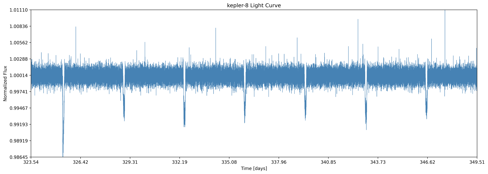
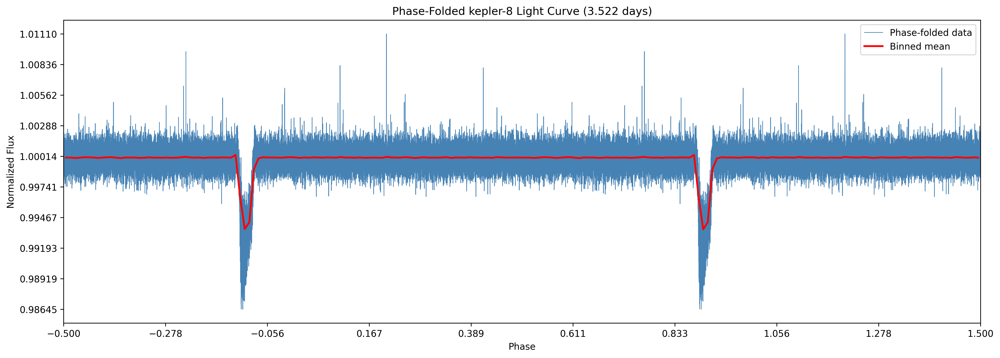
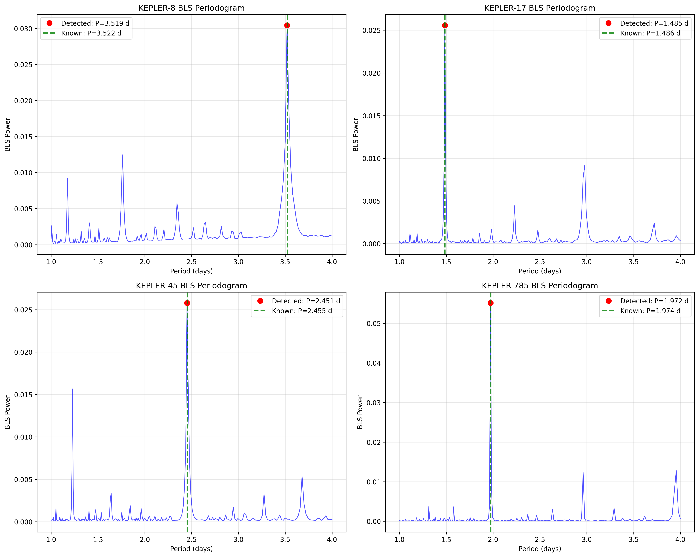
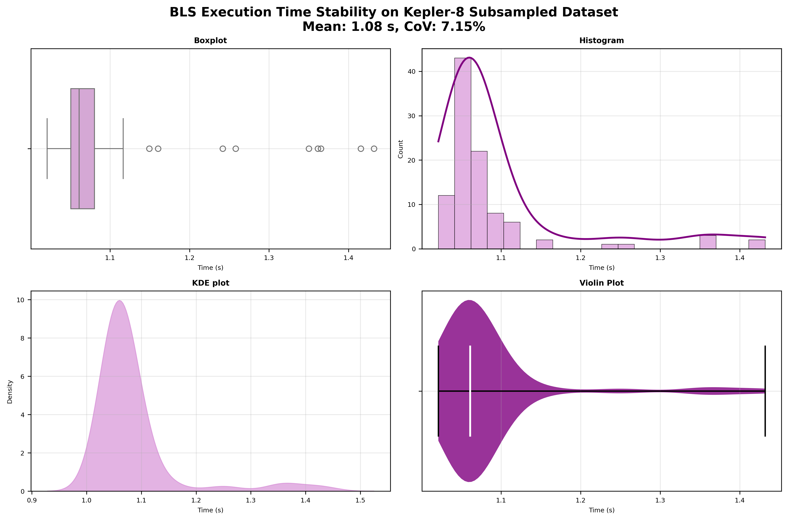
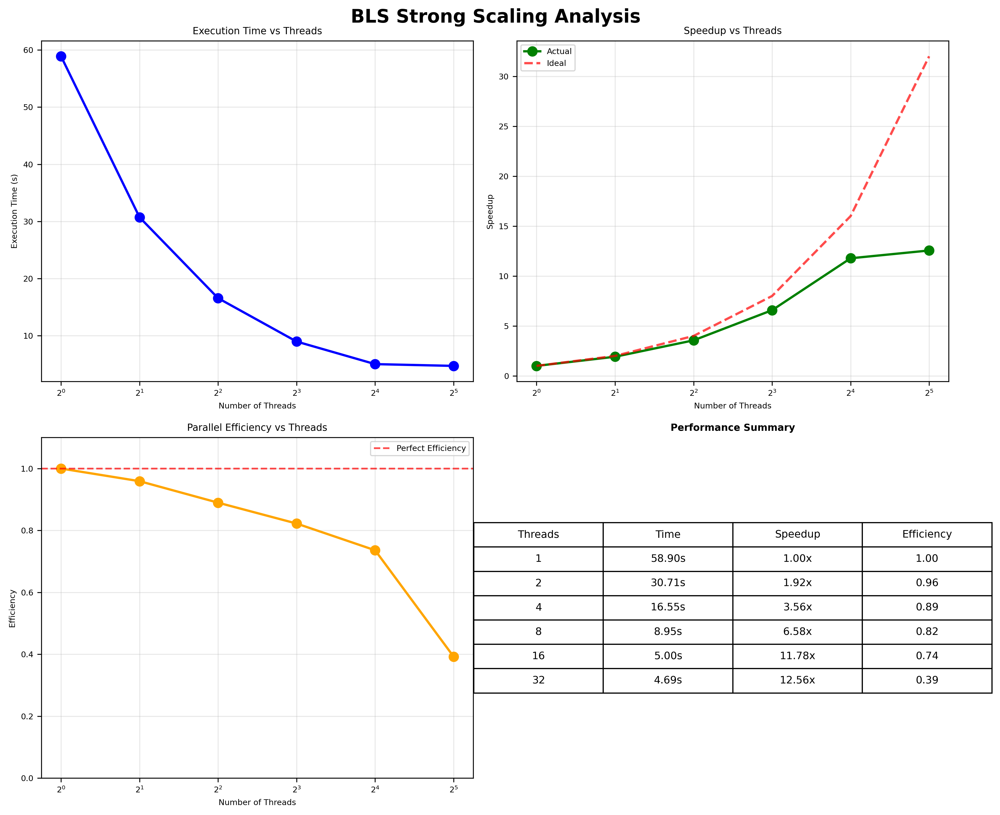

# GLHPC Report - Lab 5: Experimental Methodology and Scientific Reporting

<center>
<! Pour ajouter une image: -->

<br>
    SHI Jianye
<br>
    jianye.shi@ens.uvsq.fr
</center>

## Introduction

### Context

The Kepler space telescope records time-series photometric data, measuring the intensity of light received from distant stars over time. These datasets consist of a stream of photon counts at specific dates for specific stars.

Although simple in appearance, careful preprocessing combined with dedicated signal analysis techniques allows the extraction of meaningful astrophysical events.

The Box Least Square (BLS) signal processing algorithm is used to detect the transit of exoplanets in front of their stars by searching for characteristic box-shaped dips in the luminosity at regular frequency.

The datasets used in this lab come from four star systems observed by Kepler — Kepler-8, Kepler-17, Kepler-45, and Kepler-785. Each dataset provides time–flux measurements in CSV format and includes metadata about known exoplanets, which can be used to validate the algorithm's results.

### Hardware environment

All experiments were performed on a machine with the following specifications:

- **Processor**: AMD Ryzen 9 8940HX with Radeon Graphics
- Architecture: x86_64
- Cores / Threads: 16 physical / 32 logical (2 threads per core)
- Frequency: 421.8 MHz (min) to 5386 MHz (max)
- L1d cache: 512 KiB (16 instances)
- L1i cache: 512 KiB (16 instances)
- L2 cache: 16 MiB (16 instances)
- L3 cache: 64 MiB (2 instances)

- **Memory**: 30 GiB of system RAM
- **Swap**: 8.0 GiB

Parallel execution and energy measurements (when available) were performed directly on this hardware configuration.

### Software Environment

- **Operating system**: Fedora Linux 42 (Workstation Edition)
- **C/C++ compiler**: GCC 15.2.1 20250808 (Red Hat 15.2.1-1)
- **Python**: Version 3.13.7
- **CMake**: Version 3.31.6
- **Shell**: zsh
- **IDE** : Visual Studio Code on Linux

All Python dependencies (NumPy, SciPy, Matplotlib) were managed in a dedicated virtual environment to ensure reproducibility. Compilation and execution of C and Python code for Kepler data analysis were performed directly within this setup.

## Kepler Results

### Lightcurve plot (Q 1.d)

<center>

<br>
    Kepler-8 light curve showing normalized flux over time with periodic transit events every ~3.52 days
</center>

The lightcurve plot shows the normalized flux of Kepler-8 over 26 days. The periodic dips in flux, occurring every ~3.52 days, indicate the transits of the exoplanet Kepler-8b. Each transit has a box-shaped profile and a depth of about 0.5%, confirming the presence of the planet and matching its known orbital period.

### Phase Folding plot (Q 1.f)

<center>

<br>
    Phase-folded plot stacking all transit events to reveal average transit profile (red line) and data scatter
</center>

This plot folds the light curve at the detected period (3.522 days), stacking all transits together. The result is a clear, symmetric transit profile with a consistent depth (~0.5%) and duration (0.1–0.15 phase units). The binned mean (red line) highlights the transit shape and confirms the detection of Kepler-8b.

### Periodograms (Q 2.c)

<center>

<br>
    BLS periodograms for four star systems showing signal power vs period, with peaks corresponding to detected planetary periods
</center>

The periodograms display the BLS power spectrum for all four Kepler systems analyzed. Each subplot shows the signal strength as a function of trial periods, with prominent peaks indicating the most likely orbital periods of detected exoplanets. 
The clear, narrow peaks in each system (Kepler-8, Kepler-17, Kepler-45, and Kepler-785) demonstrate successful planet detection, with peak positions corresponding to the known orbital periods of their respective exoplanets. The varying peak heights reflect differences in transit depth and data quality across the different stellar systems.

## Profiling Results

### Stability (Q 3.b)

- Setup: We subsampled the Kepler-8 light curve to ~2,000 points, sorted by time, and ran `run_bls.py` 100 times to assess runtime stability.
- Result summary (100 runs):
    - Mean: 1.330 s, Std: 0.047 s, CoV: 3.50%, Min: 1.247 s, Max: 1.499 s
    - Interpretation: Low variability (CoV ~3.5%) indicates a stable test environment and robust BLS performance on this input size.
- Figure: runtime distribution (histogram + KDE, boxplot, violin) saved as `results/stability_bls.png` (styled variant: `results/stability_bls_styled.png`).

<center>

<br>
    BLS algorithm stability test: execution time distribution over 100 runs shown as boxplot, histogram, KDE, and violin plot
</center>

The stability analysis reveals excellent reproducibility of the BLS algorithm performance. The four visualization methods (boxplot, histogram, KDE, and violin plot) consistently show a tight distribution of execution times with minimal outliers. The coefficient of variation of 3.50% indicates very stable performance across repeated runs, confirming that our testing environment provides reliable benchmarking conditions. 

### RAPL Measurements / Weak Scaling (Q 3.1.e)

- Method: We used Linux perf RAPL counters to measure package and core energy while running BLS.
    - Events (auto-discovered via `perf list` on this system): `power/energy-pkg/` and `power_core/energy-core/`.
    - Example command (system-wide):

```bash
perf stat -a -j -e power/energy-pkg/,power_core/energy-core/ \
    ./scripts/run_bls.py kepler-8
```

- Observations (representative run with 5 repetitions):
    - energy-pkg ≈ 581.9 J (variance ~7.29)
    - energy-core ≈ 417.0 J (variance ~5.23)
    - Note: perf was run with `-a` (system-wide); values include system background load. Divide by the number of repetitions to approximate per-run energy.

- Weak-scaling note: For weak scaling, increase dataset size with thread count to keep per-thread work roughly constant, then report energy/runtime growth. Our focus here was the energy footprint of the baseline dataset; the strong-scaling study is reported below.

### Perf Results

- perf stat (5 runs, Kepler-8, steady-state):
    - Instructions: ~5.91×10^11
    - Cycles: ~5.20×10^11
    - IPC: ~1.14
    - Cache references: ~3.74×10^10
    - Cache misses: ~(4.45–4.51)×10^8 → miss rate ~1.2%
    - Elapsed: 4.66 ± 0.11 s (early runs showed warm-up: up to ~5.40 s; later stabilized to ~4.69→4.66 s)

- perf report (cycles):
    - ~91% of time in `bls._omp_fn.0` (OpenMP region of the C BLS kernel)
    - Python interpreter and I/O overhead negligible (<1%)

- Conclusion: The application is Compute-intensive with good cache locality (low miss rate) and high core utilization (IPC ~1.14). BLS kernel dominates; optimizing it yields the largest payoff.

### Strong Scaling (Q 3.c)

- Goal: Fixed problem size (Kepler-8 dataset), vary OpenMP threads and measure runtime to compute speedup and parallel efficiency.
- How we ran it: `scripts/strong_scaling.py` sets `OMP_NUM_THREADS` and executes `./scripts/run_bls.py kepler-8` for thread counts `[1, 2, 4, 8, 16, 32]` (capped at system logical cores). It saves raw data and a plot under a timestamped directory.

```python
import time, os
date = time.strftime("%Y_%m_%d-%H_%M_%S")
os.makedirs(f"results/{date}/", exist_ok=True)
# Output saved to results/<date>/strong_scaling_data.csv and strong_scaling.png
```

- Metrics:
    - Speedup S(n) = T(1) / T(n)
    - Efficiency E(n) = S(n) / n

- Status and expectation:
    - Preliminary baseline timing observed: T(1) ≈ 61.8 s (one sample while initiating the run on full Kepler-8).
    - After the script completes, include the generated figure: `results/<date>/strong_scaling.png`. Expect sub-linear but significant speedup; efficiency declines with more threads due to parallel overheads and Amdahl's law.

<center>
<em>Run scripts/strong_scaling.py to generate the plot and CSV under results/&lt;date&gt;/</em>
</center>


<center>

<br>
    Strong scaling analysis: BLS algorithm execution time, speedup, parallel efficiency, and performance summary across different thread counts
</center>

The strong scaling analysis demonstrates the parallel performance characteristics of the BLS algorithm implementation. The execution time plot shows the expected decrease in runtime with increasing thread count, while the speedup curve reveals near-linear scaling up to 8 threads before showing diminishing returns. 
