# QDC

**Comment atteindre de telles performances ?**
**如何达到如此性能？**

- Améliorations algorithmiques :
  算法改进：
    - Utiliser des méthodes arborescentes (Barnes–Hut) pour réduire la complexité de $O(n^2)$ à $O(n \log n)$ ou mieux.
      采用基于树的方法（Barnes–Hut）将复杂度从 $O(n^2)$ 降至 $O(n \log n)$ 或更优。
- Parallélisation : répartir le calcul sur de nombreux cœurs.
  并行化：将计算分配到大量内核上。
- Vectorisation : utiliser les instructions SIMD pour traiter plusieurs données en parallèle.
  向量化：使用 SIMD 指令并行处理多数据点。
- Localité des données : optimiser les schémas d'accès mémoire pour réduire la latence et maximiser l'utilisation des caches.
  数据局部性：优化数据访问模式，降低内存延迟并最大化缓存命中。

Les optimisations du compilateur, l'affinage des performances et l'accélération matérielle sont également cruciales.
编译器优化、性能调优与硬件加速同样至关重要。

# Architectures HPC
HPC 架构

## CPU et jeu d'instructions (ISA) — rappel rapide
CPU 与指令集（ISA）——快速回顾

- Un cœur CPU exécute des instructions ; l'état machine = registres, compteur de programme et drapeaux.
- CPU 核心执行指令；机器状态由寄存器、程序计数器和标志位构成。
- L'assembleur encode les instructions ; les compilateurs traduisent le code de haut niveau vers l'ISA.
- 汇编对指令进行编码；编译器将高级代码翻译为 ISA。
  - types : arithmétique/logique, chargement/stockage (mémoire), contrôle de flux (branches, appels), appels système
  - 类型：算术/逻辑、装载/存储（内存）、控制流（分支、调用）、系统调用
- Les registres sont le stockage le plus rapide ; la pression sur les registres influence la performance.
- 寄存器是最快的存储；寄存器压力会影响性能。

## Pipeline, hiérarchie mémoire et interruptions
流水线、内存层次与中断

- Le **pipeline** augmente le débit d'instructions, schéma classique en 5 étapes :
- **流水线**提高指令吞吐量，经典五阶段：
  - Fetch → Decode → Execute → Memory → Write-back
  - 取指 → 译码 → 执行 → 访存 → 回写
- **Aléas** : aléas de données (dépendances), aléas de contrôle (prédiction de branchement), conflits de ressources.
- **冒险**：数据冒险（依赖）、控制冒险（分支预测）、资源冲突。

- **Hiérarchie mémoire** : registres → caches L1/L2/L3 → DRAM → stockage persistant ; les localités spatiale et temporelle conditionnent l'efficacité du cache.
- **内存层次**：寄存器 → L1/L2/L3 缓存 → DRAM → 永久存储；空间与时间局部性决定缓存效果。

- Bus, **cohérence et NUMA** : l'accès mémoire inter-socket a une latence plus élevée ; la cohérence de cache et la bande passante mémoire limitent la scalabilité.
- 总线、**一致性与 NUMA**：跨插槽内存访问延迟更高；缓存一致性与内存带宽限制可扩展性。

- **Interruptions et exceptions** : les interruptions asynchrones signalent des événements externes ; les exceptions/pièges gèrent les fautes synchrones ; l'OS effectue le changement de contexte et le service.
- **中断与异常**：异步中断指示外部事件；异常/陷阱处理同步故障；操作系统执行上下文切换与服务。

## Niveaux de parallélisme et mappage
并行层次与映射

- Inter-nœuds (mémoire distribuée) via MPI ; multithreading intra-nœud via OpenMP/pthreads ; unités SIMD/vecteur pour le parallélisme de données.
  跨节点（分布式内存）使用 MPI；节点内多线程采用 OpenMP/pthreads；利用 SIMD/向量单元实现数据级并行。
- Déport vers accélérateur (CUDA/HIP/OpenCL) pour des schémas applicatifs hybrides MPI+X.
  加速器卸载（CUDA/HIP/OpenCL）形成混合式 MPI+X 应用模式。
- Choisir le mappage en fonction des caractéristiques de l'algorithme (communicant vs intensif en calcul).
  根据算法特性选择映射（通信密集型 vs 计算密集型）。

## Qu'est-ce que le shell ?
什么是 Shell？

- **Définition** : Le shell est une interface en ligne de commande pour interagir avec le système d'exploitation.
  定义：Shell 是与操作系统交互的命令行界面。
- **But** : Exécuter des commandes, lancer des programmes et automatiser des tâches.
  目的：执行命令、运行程序与自动化任务。

## Commandes de base du shell
Shell 基本命令

- **Gestion des fichiers et répertoires** :
    - `ls` : Lister les fichiers et répertoires.
      列出文件与目录。
    - `cd <directory>` : Changer de répertoire.
      切换目录。
    - `pwd` : Afficher le répertoire courant.
      显示当前工作目录。
    - `mkdir <directory>` : Créer un nouveau répertoire.
      创建新目录。
    - `rm <file>` : Supprimer un fichier.
      删除文件。
- **Visualisation de fichiers** :
    - `cat <file>` : Afficher le contenu du fichier.
      显示文件内容。
    - `less <file>` : Visualisation interactive du contenu.
      交互式查看文件内容。
    - `head <file>` : Afficher les 10 premières lignes.
      显示前 10 行。
    - `tail <file>` : Afficher les 10 dernières lignes.
      显示后 10 行。

## Redirections
重定向

- **Entrées/Sorties standards** :
    - `<` : Rediriger l'entrée depuis un fichier.
      将输入从文件重定向。
    - `>` : Rediriger la sortie vers un fichier (écrasement).
      将输出重定向到文件（覆盖）。
    - `>>` : Ajouter la sortie à la fin d'un fichier.
      将输出追加到文件末尾。
- **Exemples** :
    - `cat file.txt > output.txt` : Enregistrer le contenu de `file.txt` dans `output.txt`.
      将 `file.txt` 内容保存到 `output.txt`。
    - `grep \"error\" log.txt >> errors.txt` : Ajouter les lignes contenant "error" à `errors.txt`.
      将包含 "error" 的行追加到 `errors.txt`。

## Tubes (pipes)
管道（pipes）

- **Définition** : Les pipes (`|`) relient la sortie d'une commande à l'entrée d'une autre.
  定义：管道（`|`）将一个命令的输出连接到另一个命令的输入。
- **Exemples** :
    - `ls | grep ".txt"` : Lister les fichiers `.txt`.
      列出 `.txt` 文件。
    - `cat file.txt | wc -l` : Compter le nombre de lignes de `file.txt`.
      统计 `file.txt` 行数。
- **Pourquoi utiliser des pipes ?**
    - Combiner des commandes simples pour accomplir des tâches complexes.
      组合简单命令完成复杂任务。
    - Éviter la création de fichiers intermédiaires.
      避免生成中间文件。

## conteneurs
语言特定管理器与容器

- **Conteneurs** : des outils comme Docker encapsulent le logiciel et ses dépendances.
  容器：Docker/Singularity 等工具封装软件及其依赖。
- Favorisent la portabilité inter-systèmes et la reproductibilité des environnements.
  提升跨系统可移植性与环境可复现性。

# Systèmes de gestion de versions
版本控制系统

## Qu'est-ce que la gestion de versions ?
什么是版本控制？

La gestion de versions consiste à **suivre et gérer** les **modifications** apportées aux fichiers d'un projet.
版本控制涉及对项目文件所做的**更改**进行**跟踪与管理**。

## Objectifs
目标

- **Améliorer la communication** entre développeurs (suivi de l'évolution du code, messages).
  增强开发者之间的沟通（跟踪代码演进及提交信息）。
- **Isoler les développements expérimentaux** (branches de travail).
  隔离实验性开发（工作分支）。
- **Assurer la stabilité du code** (version stable sur la branche principale, possibilité de revenir à une version stable).
  确保代码稳定性（主分支保持稳定版本，可回退到稳定版本）。
- **Gérer les versions** (tags pour des versions spécifiques).
  管理发布（使用标签标注特定版本）。

## VCS distribués
分布式版本控制系统

Système de contrôle de versions distribué (DVCS)
分布式版本控制系统（DVCS）

### Avantages
优势

- **Multiples dépôts** peuvent coexister.
  可以存在多个仓库。
- Le contrôle de versions peut être effectué **localement**.
  版本控制可以在本地执行。
- Pas besoin de connectivité réseau.
  无需网络连接。

## Introduction aux DVCS : Git
DVCS 简介：Git

- Conçu comme un **système de gestion de versions distribué**.
  被设计为一种**分布式版本控制系统**。

### Hachage (Hash)
哈希（Hash）

- Chaque objet possède un hachage unique (SHA1).
  每个对象都有唯一的哈希（SHA1）。
- Git identifie les objets identiques en comparant leurs hachages.
  Git 通过比较哈希来识别相同对象。

## Répertoire de travail
工作目录

- Version courante des fichiers du projet.  
  项目文件的当前版本。  
- Les fichiers sont remplacés ou supprimés par Git lors des changements de branche ou de version.
  在切换分支或版本时，Git 会替换或删除文件。

### Index / Zone de staging
索引/暂存区

- Pont entre le répertoire de travail et le dépôt.  
  连接工作目录与仓库的桥梁。  
- Sert à regrouper des changements pour un seul commit.  
  用于将一组改动归入一次提交。  
- Seul le **contenu de l'index** est soumis, pas le répertoire de travail.
  只有**索引内容**会被提交，而非整个工作目录。

## Commandes de base
基础命令

- `git init` : Initialiser un dépôt Git.
  初始化一个 Git 仓库。
- `git clone <repository>` : Cloner un dépôt.
  克隆一个仓库。
- `git status` : Vérifier l'état du répertoire de travail et de la zone de staging.
  查看工作目录与暂存区状态。
- `git add <file>` : Mettre en staging des modifications.
  将改动加入暂存区。
- `git commit` : Valider les changements en staging.
  提交暂存区中的改动。
- `git pull` : Mettre à jour le dépôt local depuis le distant.
  从远程更新本地仓库。
- `git push` : Envoyer les commits locaux vers le dépôt distant.
  将本地提交推送到远程仓库。
- `git log` : Afficher l'historique des commits.
  查看提交历史。
- `git checkout <hash>` : Basculer vers un commit spécifique via son SHA1.
  使用 SHA1 切换到特定提交。
- `git branch <branchName>` : Créer une nouvelle branche.
  创建一个新分支。

## Branches : objectifs
分支：目的

- Travailler sur des changements qui divergent de la branche principale ou d'une autre branche.
  用于处理与主分支或其他分支分歧的改动。
- Isoler des développements expérimentaux.
  隔离实验性开发。
- Éviter de perturber le développement partagé.
  避免扰乱共享开发工作。
- Versionner des développements parallèles avec possibilité de fusion ultérieure.
  为并行开发建立版本，并可在之后合并。

## Branches : commandes
分支：命令

- `git branch` ou `git checkout -b <branchName>` : Créer une nouvelle branche.
  创建新分支。
- `git checkout <branchName>` : Basculer vers une branche existante.
  切换到已存在的分支。
- `git merge <branchName>` : Fusionner une branche dans la branche courante.
  将某分支合并到当前分支。
- `git branch -d <branchName>` : Supprimer une branche.
  删除一个分支。
- `git branch` : Lister toutes les branches et afficher la branche courante.
  列出所有分支并显示当前分支。

## Gestion des conflits
冲突管理

- **Conflit :** Se produit lors d'une fusion de branches quand deux modifications touchent les mêmes lignes.
  冲突：在分支合并时，当两个改动影响相同行时发生。

- **Étapes de résolution :**
  1. La fusion est mise en pause.
    合并被暂停。
  2. Les zones de conflit sont marquées dans le fichier.
    文件中标记出冲突区域。
  3. Éditer le fichier pour résoudre le conflit en choisissant une version ou en combinant les changements.
    通过选择其一或合并改动来编辑文件解决冲突。
  4. Vérifier et valider la résolution.
    检查并确认解决结果。
  5. Committer la résolution du conflit.
    提交解决冲突后的更改。

## Méthodes de correction
更正方法

- **Annuler des changements :** Utiliser `git reset` pour abandonner des modifications.
  撤销更改：使用 `git reset` 放弃修改。
- **Amender le dernier commit :** Utiliser `git commit --amend` pour modifier le commit précédent.
  修订上一次提交：使用 `git commit --amend` 修改先前提交。
- **Correction basée sur une branche :** Créer une nouvelle branche depuis une version spécifique et travailler dessus.
  基于分支的更正：从某一特定版本建立新分支并在其上工作。
- **Réécrire l'historique :** Utiliser `git rebase` pour éditer des commits et l'historique.
  重写历史：使用 `git rebase` 编辑提交与历史。

### Avertissement
警告

- **Réécriture de l'historique :** Le rebase interactif est risqué. Ne réécrivez que les commits qui n'ont pas été poussés vers un dépôt distant. Préférez des corrections basées sur des branches pour plus de sécurité.
  重写历史：交互式 rebase 存在风险。仅重写尚未推送到远程的提交。为安全起见，更倾向基于分支的更正。


---------------
---------------

## Pourquoi C, C++, Python ?
为何选择 C、C++、Python？

- Les couches proches du matériel sont plus difficiles à programmer…
    - Mais elles offrent un contrôle et des performances maximales。
  越接近硬件的层次越难编程，
    - 但能获得最大的控制与性能。
- Les abstractions de haut niveau maximisent la productivité…
    - Mais elles introduisent des surcoûts et réduisent le contrôle sur la performance。
  高层抽象提高生产力，
    - 但带来显著开销，且对性能控制较少。

En pratique, nous combinons souvent plusieurs langages。
在实践中，我们常常组合使用多种语言。

  - C pour les sections critiques en performance, Python pour les API de plus haut niveau。
    性能关键部分用 C，较高层 API 用 Python。

## Programmation C — Fonctions
C 语言编程——函数

```c
#include <stdio.h> // Pour printf(...)
// 用于 printf(...)

int sum_and_square(int a, int n) {
  int tmp = a + n;
  return tmp * tmp;
}

int main() {
  int a = 5;
  int b = 4;
  int c = sum_and_square(a, b);
  int d = sum_and_square(3, 9);

  // Afficher le résultat dans la console
  // 将结果打印到控制台
  printf("(5+4)**2: %d\n", c);
  printf("(3+9)**2: %d\n", d);
  return 0;
}
```

## Programmation C — Boucles
C 语言编程——循环

Implémentation en C de $\sum_{i=1}^{100}{i}$
C 实现 $\sum_{i=1}^{100}{i}$

```c
#include <stdio.h> // Pour printf(...)
// 用于 printf(...)

int sum_range(const int start, const int end) {
  int sum = 0;
  // Considérer start = 0 ; end = 100
  // Pour i démarrant à 0 ; tant que i <= 100 ; incrémenter i de un
  // 设 start = 0；end = 100
  // i 从 0 开始；当 i <= 100；每次将 i 加 1
  for (int i = start; i <= end; i = i + 1) {
    sum += i;
  }
  return sum;
}

int main() {
  printf("Result: %d\n", sum_range(1, 100));
  return 0;
}
```
Une variable qualifiée `const` ne peut pas être modifiée. Cela peut permettre des optimisations lors de la compilation。
被 `const` 限定的变量不可修改，这可能使编译期间的优化成为可能。

 

## Programmation C — Conditions
C 语言编程——条件

Nombre de multiples de 3 dans $[0, 99]$ (c.-à-d. $i \mod 3 = 0$)
区间 $[0, 99]$ 内 3 的倍数个数（即 $i \mod 3 = 0$）
```c
void count_multiples_of_three() {
  unsigned int count = 0;
  // Pour i démarrant à 0 ; tant que i < 100 ; incrémenter i de un
  // i 从 0 开始；当 i < 100；每次将 i 加 1
  for (unsigned int i = 0; i < 100; i++) {
    // si i % 3 (reste de la division entière) est égal à 0
    // 如果 i % 3（整数除法的余数）等于 0
    if (i % 3 == 0) {
      count++;
    }
  }
  printf("Result: %d\n", count);
}
```

### Remarque {.example}
备注 {.example}

Ici, nous pourrions aussi écrire `for (unsigned int i = 0; i < 100; i += 3)`
此处也可写为 `for (unsigned int i = 0; i < 100; i += 3)`


## Programmation C — Pointeurs de base
C 语言编程——基础指针

```c
int a = 0;
int b = 5;

int* c = &a;
*c = *c + b;
printf("a: %d; b: %d; c: %d\n", a, b , *c);
```
`c` contient l'adresse de `a` ; ainsi `*c = *c + b` écrit dans `a` la somme de `a` et `b`。
`c` 保存了 `a` 的地址；因此 `*c = *c + b` 会把 `a` 与 `b` 的和写入 `a`。

## Programmation C — Tableaux
C 语言编程——数组

```c
int main() {
  char morpion[9] = {'X', 'O',  '\0',
                     'O', 'X',  '\0',
                     'O', '\0', '\0'};
  morpion[8] = 'X'; // Le joueur a cliqué sur la case en bas à droite !
  // 玩家点击了右下角的格子！
}
```

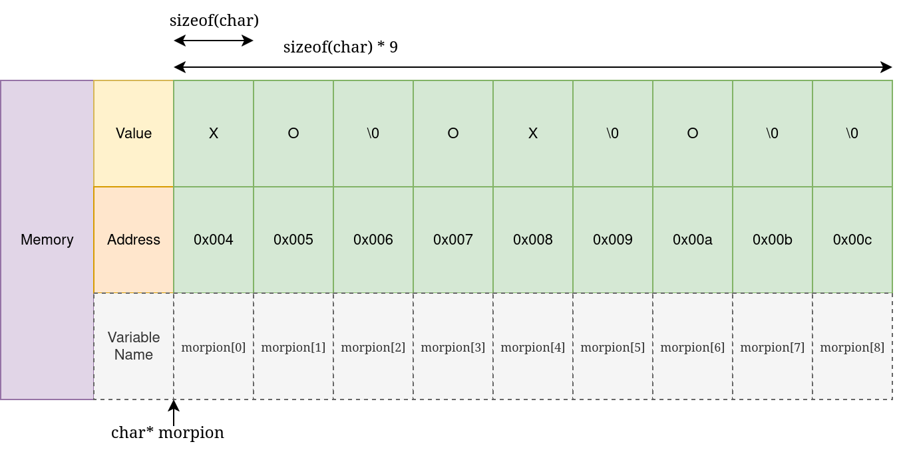{ width=90% }


## Programmation C — Structures
C 语言编程——结构体

Les structures sont des types composites définis par l'utilisateur：
结构体是用户自定义的复合类型：

```c
typedef struct {
  char* first_name;
  char* last_name;
  int age;
  float mean_grade;
  char gender;
} Student;
```

```c
Student e1 = {"Dupont", "Pierre", 22, 13, 'm'};
Student e2 = {"Major", "Major", 22, 13.5, 'a'};
Student e3 = {"Martin", "Evelynne", 24, 14, 'f'};

if (e1.mean_grade > 10) {
  printf("(%s %s) is a pretty good student !\n", 
         e1.first_name, e1.last_name);
}
```

Le C n'a pas de notions de `classe`, `objet` ou `méthode` ！
C 语言没有 `class`、`object` 或 `method` 的概念！


## Programmation C — Structures (2)
C 语言编程——结构体（2）

```c
void display_student(Student* s) {
  // s->age est équivalent à (*s).age
  // s->age 等价于 (*s).age
  printf("%s %s (%i): %f\n", s->first_name, 
                             s->last_name, s->age,
                             s->mean_grade);
}

// Nous pouvons avoir des tableaux de n'importe quel type !
// 我们可以拥有任意类型的数组！
Student students[3] = {{"Dupont", "Pierre", 22, 13, 'm'}, ...};
for (int i = 0; i < 3; i++)
  display_student(&students[i]);
```


# Gestion de la mémoire
内存管理

## Gestion de la mémoire — Concept
内存管理——概念

### Dans les langages de haut niveau {.alert}
在高级语言中 {.alert}

- Nous manipulons des structures de données abstraites (listes, dictionnaires, etc.).
  我们操作抽象的数据结构（列表、字典等）。
- La mémoire est gérée automatiquement (allocation, redimensionnement, libération).
  内存由系统自动管理（分配、扩容、释放）。
- On ne s'occupe pas de l'alignement mémoire, pile vs. tas, taille des pages, effets NUMA, etc.
  我们无需关心内存对齐、栈与堆、页大小、NUMA 影响等。

### En C {.example}
在 C 语言中 {.example}

- Nous travaillons directement avec des données primitives et de la mémoire brute。
  我们直接与原始数据与裸内存打交道。
- Nous sommes responsables de l'allocation, de la disposition et du nettoyage。
  我们负责内存的分配、布局与释放清理。
- Nous ne pouvons demander que des blocs de mémoire brute, à remplir comme nous le souhaitons。
  我们只能申请一块原始内存，并按需自行填充。
- Ceci est critique pour la performance。
  这是性能的关键。

Ce contrôle bas niveau est essentiel pour la performance；nous devons donc comprendre le fonctionnement de la mémoire en profondeur！
这种底层控制对性能至关重要；因此我们必须理解内存的底层机制！


## Gestion de la mémoire — Types de mémoire
内存管理——内存类型

Nous pouvons distinguer deux types de mémoire。
我们可以区分两类内存。

- Mémoire automatiquement allouée par le compilateur sur **la pile (stack)**。
  自动由编译器在**栈（stack）**上分配的内存。
    - Stocke des variables, des arguments de fonctions, etc.
      存放变量、函数参数等。
    - Rapide mais de taille limitée。
      速度快但容量有限。
- Mémoire allouée dynamiquement (manuellement) sur **le tas (heap)**。
  由开发者在**堆（heap）**上手动动态分配的内存。
    - Doit être allouée et libérée par le développeur！
      必须由开发者手动分配与释放！

Le noyau (Linux / Windows) alloue des **pages mémoire** et opère à un niveau grossier。  
内核（Linux / Windows）以较粗粒度分配**内存页**。  
La bibliothèque standard (`libc`) manipule ces pages à plus fine échelle et fournit la mémoire à l'utilisateur。
标准库（`libc`）以更细粒度管理页面并向用户提供内存。


## Gestion de la mémoire — Allocation
内存管理——分配

```c
#include <time.h> // pour time
// 用于 time
#include <stdlib.h> // pour malloc, srand, rand
// 用于 malloc、srand、rand

int do_the_thing(int n) {
  // Nous allouons n nombres
  // 我们分配 n 个数
  float* numbers = malloc(sizeof(float) * n);

  // Initialiser la graine du générateur aléatoire
  // 为随机数生成器设置种子
  srand(time(NULL));

  // Nous générons n nombres aléatoires
  // 生成 n 个随机数
  for (int i = 0; i < n; i++) {
    numbers[i] = (float) rand() / RAND_MAX; // Générer un nombre dans [0, 1]
    // 生成位于 [0, 1] 的数
  }
  ... // Faire ici un traitement complexe
  // 在此执行较复杂的处理
  free(numbers); // Rendre la mémoire au noyau
  // 将内存归还给内核
  return 0;
}
```


## Gestion de la mémoire — Allocation
内存管理——分配

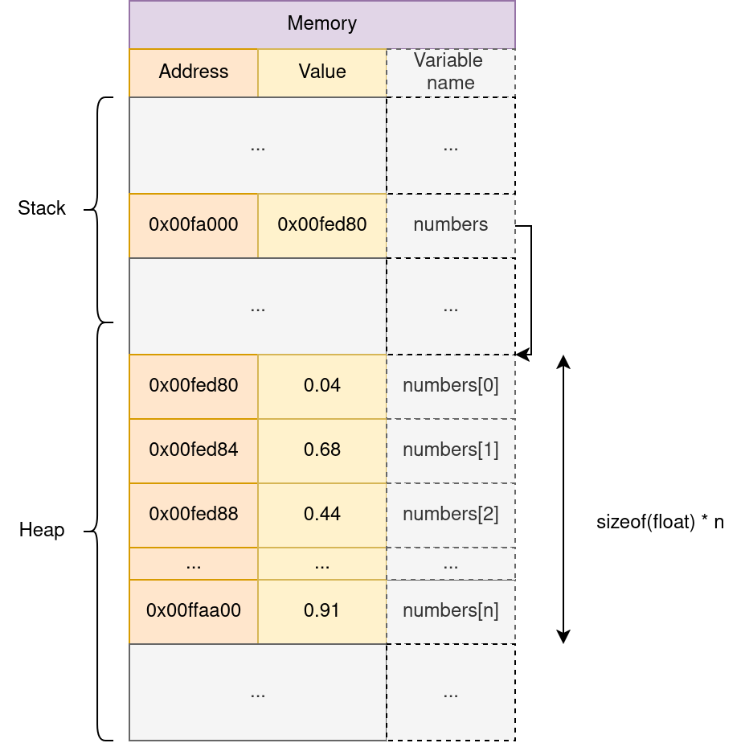{ height=75% }

**`malloc` renvoie un pointeur vers le début de la zone mémoire allouée**
**`malloc` 返回指向已分配内存区域起始位置的指针**


## Gestion de la mémoire — Désallocation
内存管理——释放

La mémoire n'est pas infinie！ 
内存不是无限的！

En Python (et Java, C#, etc.)；la mémoire est gérée par le ramasse-miettes (GC)：
在 Python（以及 Java、C# 等）中，内存由垃圾回收器（GC）管理：

- Le runtime suit toutes les allocations mémoire et toutes les références。
  运行时会跟踪所有内存分配及其引用。
- Lorsqu'un bloc mémoire n'est plus référencé par le programme, le GC rend la mémoire au noyau。
  当某块内存不再被程序引用时，GC 会将其归还给内核。

En C/C++，**l'utilisateur doit désallouer la mémoire** via `free(ptr)`。
在 C/C++ 中，**用户必须显式释放内存**，使用 `free(ptr)`。

### Fuite de mémoire {.alert}
内存泄漏 {.alert}

Si la mémoire n'est pas libérée（fuite mémoire），la machine peut耗尽内存：
如果内存未释放（内存泄漏），计算机会耗尽内存：

- Le noyau peut tuer le programme。
  内核可能会终止程序。
- Le système d'exploitation peut planter。
  操作系统可能崩溃。
- D'autres applications demandant de la mémoire peuvent planter ou échouer。
  其他申请内存的应用可能崩溃或失败。


## Mémoire virtuelle et physique — Problématique
虚拟内存与物理内存——问题

- Comment le noyau peut-il garantir que la mémoire est toujours contiguë？
  内核如何保证内存始终是连续的？
- Puis-je accéder à la mémoire d'un autre programme et voler ses données？
  我能否访问其他程序的内存并窃取其数据？
- Comment plusieurs applications peuvent-elles partager la même mémoire？
  多个应用如何共享同一片内存？
  - Certaines variables ont des adresses codées en dur！
    有些变量有硬编码地址！
- Comment gérer la fragmentation (interne/externe)（空洞）？ 
  如何处理（内部/外部）碎片（空洞）？


## Mémoire virtuelle et physique — Concept
虚拟内存与物理内存——概念

Nous séparons les **adresses physiques**（emplacements en mémoire）des **adresses virtuelles**（emplacements logiques）vues par chaque programme！
我们将每个程序所见的**虚拟地址**（逻辑位置）与**物理地址**（内存中的真实位置）相分离！

- La mémoire physique est divisée en **blocs de taille fixe** appelés **pages**（typiquement ~4KB）。
  物理内存被划分为固定大小的**页面（page）**（通常约 4KB）。
- Le CPU inclut une **MMU**（Memory Management Unit）qui traduit les adresses virtuelles en adresses physiques。
  CPU 内含**内存管理单元 MMU**，负责将虚拟地址翻译为物理地址。
- Chaque programme dispose de son propre espace d'adressage virtuel isolé。
  每个程序拥有其独立的虚拟地址空间。
- Le noyau maintient une **table des pages** pour chaque programme, indiquant à la MMU comment traduire les adresses。
  内核为每个程序维护**页表**，告知 MMU 如何进行地址转换。

## L'illusion de la contiguïté
连续性的错觉
Chaque processus croit accéder à un grand bloc de mémoire contigu；alors qu'en réalité il peut être physiquement fragmenté ou partagé。
每个进程都“以为”自己拥有一大片连续内存；但物理上可能是碎片化的或被共享的。


## Mémoire virtuelle et physique — Schéma
虚拟与物理内存——示意图

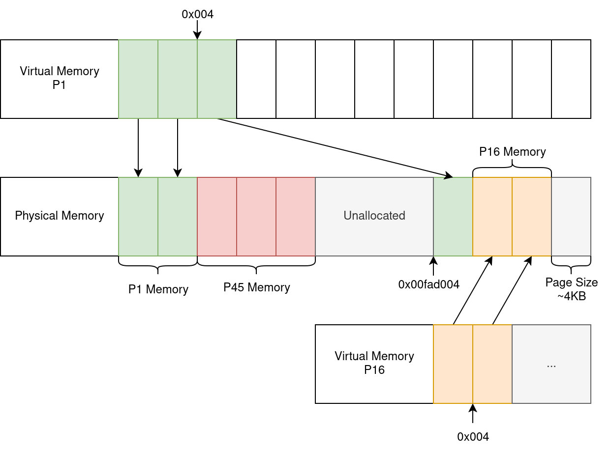{ width=80% }

\***Notez qu'il s'agit d'une représentation simplifiée**.
\***请注意：这是一种简化示意图**。


## Hiérarchie mémoire
内存层次结构

De quelle mémoire parlons-nous？
我们在谈哪一种内存？

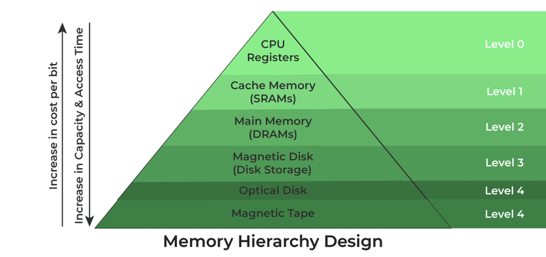{ width=100% }

Notez que les GPU disposent également de leur propre mémoire dédiée！
请注意：GPU 也有其独立的专用内存！


## Hiérarchie mémoire
内存层次结构

* Les calculs CPU sont extrêmement rapides, et l'accès mémoire peut devenir un goulot d'étranglement。
  - Les registres ont la latence la plus faible。
    寄存器延迟最低。
  - Les caches CPU（L1, L2, L3）servent de tampons rapides pour la mémoire。
    CPU 缓存（L1、L2、L3）充当内存的高速缓冲。
* La DRAM（mémoire principale）est bien plus lente, mais moins coûteuse et plus grande。
  - L'accès à la DRAM induit des délais significatifs comparé au cache。
    相比缓存，访问 DRAM 会引入明显延迟。

Pour obtenir de hautes performances, nous devons maximiser la réutilisation des données dans les registres ou les caches, et minimiser les accès à la DRAM。
要实现高性能，需最大化寄存器/缓存中的数据复用，并尽量减少对 DRAM 的访问。


## Caches CPU
CPU 缓存

La plupart des CPU possèdent 3 niveaux de cache。
多数 CPU 具有三级缓存。

- L1d — Premier niveau de cache（très rapide）
  L1d——一级缓存（非常快）
- L2 — Deuxième niveau de cache（rapide）
  L2——二级缓存（较快）
- L3（Last Level Cache, LLC）— Plus grand mais plus lent que L1/L2
  L3（末级缓存，LLC）——容量更大但比 L1/L2 更慢

Certains niveaux de cache sont par cœur（L1, souvent L2），tandis que d'autres sont partagés entre plusieurs cœurs（L3）。
某些缓存级别按核心独享（L1，通常 L2），另一些在多核间共享（L3）。

### Cache d'instructions {.alert}
指令缓存 {.alert}

Les instructions d'assemblage sont stockées dans un cache d'instructions séparé (L1i)。
汇编指令存储在独立的（L1i）指令缓存中。


## Caches CPU
CPU 缓存

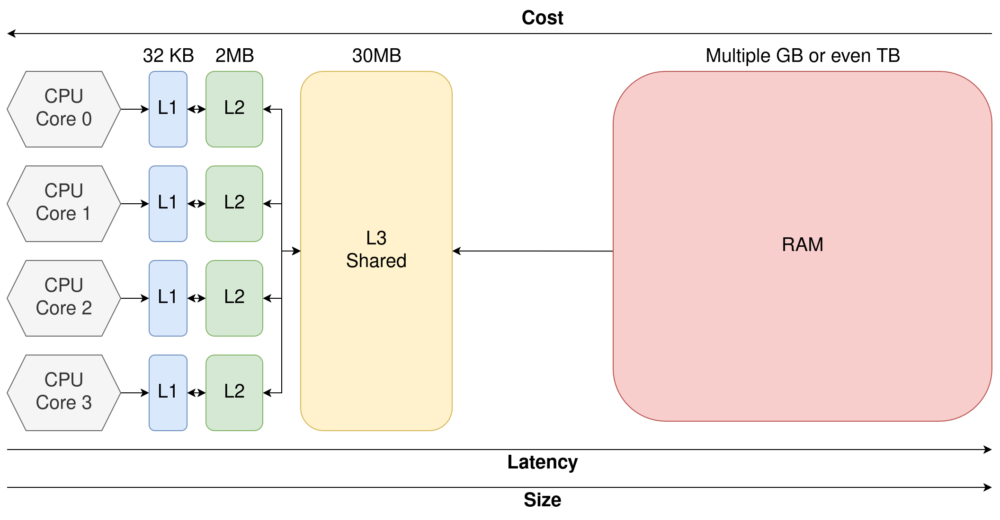{ width=95% }

On parle de **hiérarchie mémoire hétérogène**：les mêmes accès mémoire peuvent avoir des latences différentes selon l'emplacement des données！
我们称之为**异构内存层次**：相同的内存访问会因数据所在位置不同而具有不同的延迟！


[**Exemple en direct：LSTOPO**]
【现场示例：LSTOPO】


## Caches CPU — En pratique
CPU 缓存——实践

```c
for (int i = 0; i < n; i++) {
  T[i] = A[i] * B[i];
}
```

1. Le contrôleur de cache recherche les données dans les caches CPU (L1 → L2 → L3)。
  缓存控制器在 CPU 缓存（L1 → L2 → L3）中查找数据。
2. Si présentes, les données sont envoyées aux registres pour l'ALU。
  若命中，数据被送入寄存器供算术逻辑单元（ALU）使用。
3. Sinon, une requête mémoire est émise。
  否则，发出一次内存请求。
  - Cela introduit de la latence et une bulle dans le pipeline du CPU。
    这会引入延迟并在 CPU 流水线中产生气泡。
4. Quand la requête mémoire est satisfaite, l'exécution reprend。
  当内存请求完成后，执行继续。
5. Le résultat de $a*b$ est écrit dans le cache, puis sera recopié plus tard vers la mémoire principale。
  $a*b$ 的结果首先写回缓存，随后再写回主存。


## Caches CPU — En pratique
CPU 缓存——实践

En pratique：
在实践中：

- Le CPU récupère une **ligne de cache** entière（souvent 64 octets）en une fois（si float：$64\text{B} / 4\text{B} = 16$ valeurs）。 
  CPU 每次抓取一整条**缓存行**（通常 64 字节）（若为 float：$64\text{B} / 4\text{B} = 16$ 个值）。
- Le CPU peut **pré-extraire (prefetch)** les données：il apprend les schémas d'accès et anticipe les futurs accès。
  CPU 能进行**预取（prefetch）**：学习访问模式并提前取数。
- Le CPU peut exécuter **hors ordre (out-of-order)**：在内存请求未完成时执行彼此独立的指令。
  CPU 可**乱序执行（out-of-order）**：在内存请求进行期间先执行独立指令。


## Caches CPU — Accès à pas (stridé)
CPU 缓存——跨步（strided）访问

Considérons deux implémentations NBody 3D：
考虑两种三维 NBody 的实现方式：

**Array Of Structures (AoS)**
**结构体数组（AoS）**

```c
// Nous allouons N triplets de positions (x, y, z)
// 我们为 (x, y, z) 位置分配 N 个三元组
float* positions = malloc(sizeof(float) * N * 3);
```

**Structure Of Arrays (SoA)**
**数组的结构（SoA）**

```c
// Nous allouons des tableaux séparés pour chaque composante
// 为每个分量分别分配数组
float* x = malloc(sizeof(float) * N);
float* y = malloc(sizeof(float) * N);
float* z = malloc(sizeof(float) * N);
```


## Caches CPU — Accès à pas (stridé)
CPU 缓存——跨步（strided）访问

Nous voulons enregistrer le nombre de particules telles que $x \leq 0.5$。
我们希望统计满足 $x \leq 0.5$ 的粒子数量。


**Array Of Structures (AoS)**
**结构体数组（AoS）**

```c
for (int i = 0; i < N; i += 3)
  if (positions[i] < 0.5)
    count++;
```

**Structure Of Arrays (SoA)**
**数组的结构（SoA）**

```c
for (int i = 0; i < N; i++)
  if (x[i] < 0.5)
    count++;
```

Laquelle est la plus rapide, et pourquoi？
哪一种更快？为什么？

Quel schéma d'accès exploite le mieux les lignes de cache？
哪种访问模式能更好地利用缓存行？


## Caches CPU — Accès à pas (stridé)
CPU 缓存——跨步（strided）访问

Résultats `perf` cumulés sur 100 exécutions：
`perf` 工具在 100 次运行中的累计结果：

|  | Temps  | # Instr | # L1 Loads   | # L1 Miss  | # LLC Loads | # LLC Miss |
|--------|--------|---------------|--------------|------------|-------------|------------|
| AoS    | ~1.93s  | ~14 Billion   | ~3.5 Billion | ~1 Million | ~400k       | ~382k      |
| SoA    | ~1.75s | ~14 Billion   | ~3.5 Billion | ~300k      | ~24k        | ~15k       |

|  | # Références cache (LLC) | # Cache miss |
|--------|------------------------|--------------|
| AoS    | ~158 Million           | ~151 Million |
| SoA    | ~52 Million            | ~35 Million  |

Avec AoS, davantage de chargements échouent en L1, entraînant des accès au LLC。
在 AoS 中，更多加载在 L1 失败，导致访问 LLC。

La plupart des chargements LLC aboutissent encore à des ratés, conduisant à des accès DRAM。
多数 LLC 加载仍会未命中，从而落到 DRAM 访问。


# Compilation et assemblage
编译与汇编

## Compilation et assemblage — Introduction
编译与汇编——引言

Le C est un langage compilé：nous devons traduire le code source en assembleur pour le CPU。
C 是一种编译型语言：我们需要将源代码翻译为 CPU 的汇编指令。

`gcc ./main.c -o main (<flags>)`

- Python est interprété。
  - Plus flexible mais **nettement plus lent**。
  Python 是解释执行的。
  - 更灵活但**显著更慢**。
- C# et Java sont compilés en bytecode intermédiaire puis exécutés via une machine virtuelle（ou JIT）。
  - Un compromis entre performance et productivité。
  C# 与 Java 先编译为中间字节码，再由虚拟机执行（或 JIT）。
  - 在性能与生产力之间取得平衡。
- C/C++/Rust sont compilés en code assembleur。
  - Faible portabilité, mais pas d'intermédiaire。
  C/C++/Rust 直接编译为汇编代码。
  - 可移植性较差，但无中间层。


## Compilation et assemblage — Boucle simple
编译与汇编——简单循环

```c
int sum = 0;
for (int i = 0; i < 100000; i++){
  sum += i;
}
```

```asm
main:
.LFB6:
  pushq	%rbp                 // Nous enregistrons le pointeur de pile
                             // 我们保存栈指针
    movq	%rsp, %rbp
  movl	$0, -4(%rbp)         // Initialiser sum
                             // 初始化 sum
  movl	$0, -8(%rbp)         // Initialiser i
                             // 初始化 i
    jmp	.L2
.L3:
  movl	-8(%rbp), %eax       // Charger i dans un registre
                             // 将 i 加载到寄存器
  addl	%eax, -4(%rbp)       // Ajouter i à sum（depuis la mémoire）
                             // 将 i 与 sum 相加（从内存）
  addl	$1, -8(%rbp)         // Incrémenter i de 1（depuis la mémoire）
                             // 将 i 加 1（从内存）
.L2:
  cmpl	$99999, -8(%rbp)     // Vérifier si i < 100 000
                             // 检查是否 i < 100000
  jle	.L3                      // Sauter si inférieur ou égal
                             // 小于等于则跳转
  movl	$0, %eax             // Définir la valeur de retour de main
                             // 设置 main 的返回值
    popq	%rbp
  ret                          // Retour de main
                                // 从 main 返回
```

`gcc ./main.c -o main -OO`


## Compilation et assemblage
编译与汇编

L'assembleur est ce qui se rapproche le plus du matériel, et il dépend de l'architecture：
汇编语言最接近硬件，并且与体系结构相关：

- Intel et AMD utilisent le jeu d'instructions x86。
  Intel 与 AMD 使用 x86 指令集。
- x86 possède de multiples extensions（FMA, SSE, AVX, AVX512, etc.）。
  x86 有多种扩展（FMA、SSE、AVX、AVX512 等）。
- Pour maximiser la performance, nous devrions compiler nos applications sur chaque plateforme。
  为了最大化性能，我们应在各自平台上进行编译。
  - Nos binaires ne sont pas portables。
    生成的二进制不可移植。
  - Mais nous pouvons utiliser des instructions dédiées。
    但可使用特定的指令扩展。
- D'autres jeux d'instructions existent（ARM, RISC‑V, etc.）。
  也存在其他指令集（ARM、RISC‑V 等）。


## Compilation et assemblage — Passes d'optimisation
编译与汇编——优化过程

Le compilateur n'est pas *qu'un* simple traducteur：
编译器不仅仅是“翻译器”：

- Il peut générer des instructions optimisées à partir du programme。
  它可以从程序生成优化后的指令。
- Les constantes peuvent être propagées, le code/valeurs inutilisés supprimés。
  常量可以传播，未使用的值/代码会被移除。
- Les opérations peuvent être réordonnées, inline, vectorisées via SIMD, etc.
  操作可重排、内联，并通过 SIMD 向量化等。
- Et bien d'autres optimisations。
  还有许多其他优化。

Ces optimisations sont activées via des options telles que `-O1`, `-O2`, `-O3`，qui correspondent à des ensembles prédéfinis de passes。
这些优化可通过 `-O1`、`-O2`、`-O3` 等选项启用，这些是预定义的优化集合。

L'option `-march=native` permet de cibler la machine courante et d'utiliser toutes les extensions assembleur disponibles。
`-march=native` 选项使编译器针对当前机器并使用所有可用的汇编扩展。


## Compilation et assemblage — Chaîne du compilateur
编译与汇编——编译器流水线

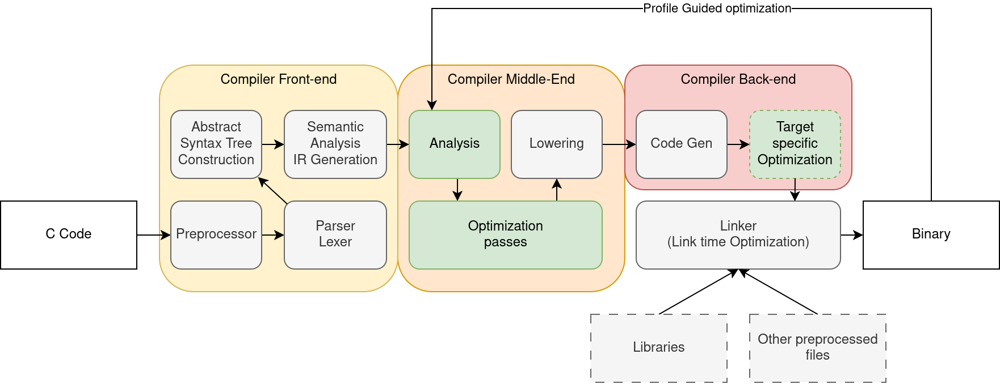{ width=105% }

Il existe plusieurs compilateurs aux performances et fonctionnalités variées：
存在多种编译器，其性能与特性各不相同：

- GCC et Clang‑LLVM（classiques）。
  GCC 与 Clang‑LLVM（经典选择）。
- MSVC（Microsoft）, mingw‑LLVM, arm‑clang（pour ARM）et bien d'autres。
  MSVC（微软）、mingw‑LLVM、arm‑clang（用于 ARM）等。


## Bases de Makefile — Introduction
Makefile 基础——引言

**Make** est un outil de script pour automatiser des flux de compilation complexes。Il fonctionne en définissant des règles dans des **Makefiles**。
Make 是用于自动化复杂编译流程的脚本工具；它通过在 **Makefile** 中定义规则来工作。

```makefile
CC := gcc
CFLAGS := -g

main: main.c my_library.c my_library.h
  $(CC) -o $@ $^ $(CFLAGS)
```

- `main` est la cible（ce que nous voulons construire）。
  `main` 是目标（我们要构建的产物）。
- `main.c my_library.c my_library.h` sont les dépendances：la règle se relance si l'une change。
  `main.c my_library.c my_library.h` 是依赖项：任一变化会触发规则重建。
- `$(CC) -o $@ $< $(CFLAGS)` est la recette。
  `$(CC) -o $@ $< $(CFLAGS)` 是配方命令。
- `$@` s'étend au nom de la cible。
  `$@` 展开为目标名称。
- `$^` s'étend à toutes les dépendances。
  `$^` 展开为全部依赖。


## Bases de Makefile — Règles phony
Makefile 基础——伪目标规则

Make s'attend à ce qu'une règle `main` produise un fichier nommé `main`。Cependant, toutes les règles ne produisent pas de fichiers：
Make 期望规则 `main` 生成名为 `main` 的文件；但并非所有规则都会产出文件：

```makefile
.PHONY: all clean

all: main mylibrary

...

clean:
  rm -rf *.o
  rm -rf ./main
```

Ici, `make all` sera un alias pour tout construire, tandis que `make clean` est une règle personnalisée pour nettoyer les artefacts。
此处，`make all` 作为构建全部的别名，`make clean` 则用于清理构建产物的自定义规则。

Make 还有许多其他功能，不在本课程讨论范围内。


## Bases de Makefile — Utilisation
Makefile 基础——用法

Un projet typique ressemble à ceci：
典型项目结构示例：

```
Project/
  src/
    main.c
    my_library.c
  include/
    my_library.h
  Makefile # We define the Make rules here
```

`make` recherchera un fichier nommé `Makefile` ou `makefile` dans le répertoire courant（cwd）。
make 将在 cwd 中查找名为 Makefile 或 makefile 的文件。您可以直接调用 make all 、 make clean 等。


# Notions de base du parallélisme
并行基础

## Notions de base du parallélisme — Introduction
并行基础——引言

L'optimisation par le compilateur n'est qu'une facette du calcul haute performance。
编译器优化只是高性能计算的一面。

Rappelez-vous；nous avons vu dans `LSTOPO` que notre CPU possède de nombreux cœurs：
回想一下：在 `LSTOPO` 中我们看到 CPU 有许多核心：

- Chaque cœur peut effectuer des calculs indépendamment des autres。
  每个核心都可独立执行计算。
- Plusieurs processus（Google, VSCode, Firefox, Excel）peuvent s'exécuter **simultanément** sur des cœurs différents。
  多个进程（Google、VSCode、Firefox、Excel）可在不同核心上**同时**运行。
- Le noyau gère l'exécution via l'ordonnancement des threads et le time‑slicing。
  内核通过线程调度与时间片进行管理。

### Thread principal 主线程

Chaque processus possède au moins un « thread d'exécution » (thread of execution), qui est une séquence ordonnée d'instructions exécutées par le CPU。
每个进程至少有一个“执行线程”，即由 CPU 执行的一系列有序指令序列。


## Notions de base du parallélisme — Introduction
并行基础——引言

Et si nous pouvions découper nos programmes en plusieurs threads ?
如果我们能把程序拆分为多个线程会怎样？

- Avec 1 thread, un seul calcul se produit à la fois。
  只有 1 个线程时，一次只能进行一个计算。
- Avec 2 threads, nous pouvons potentiellement doubler le débit！
  若有 2 个线程，吞吐量有望翻倍！

En pratique, il existe un surcoût；nous devons gérer les dépendances entre instructions, ect.
实际中会有开销，还需处理指令间依赖等问题。


## Notions de base du parallélisme — Types de parallélisme
并行基础——并行类型

Nous considérons trois grands types de parallélisme：
我们主要考虑三种并行类型：

- Single Instruction Multiple Data（SIMD）: également appelée vectorisation。
  单指令多数据（SIMD）：也称为向量化
  - Une seule instruction opère simultanément sur plusieurs éléments de données。
    单条指令同时作用于多个数据元素。
- Mémoire partagée : plusieurs threads dans le même espace mémoire。
  共享内存：多个线程位于同一内存空间。
  - Les threads partagent un espace mémoire，communication/synchronisation rapides。
    线程共享内存空间，通信与同步开销较小。
- Mémoire distribuée : plusieurs processus。
  分布式内存：多个进程。
  - Les communications sont plus lentes, mais ce modèle permet de passer à l'échelle sur plusieurs machines。
  - 通信较慢，但可扩展到多机。

Dans ce cours, nous nous concentrerons sur SIMD et la mémoire partagée。
本课程仅聚焦 SIMD 与共享内存并行。


## Notions de base du parallélisme — Mémoire partagée
并行基础——共享内存

Considérons la boucle suivante：
考虑如下循环：

```c
int sum = 0;
for (int i = 0; i < 100; i++)
  sum += i;
```

Nous pouvons découper l'espace d'itération en plusieurs blocs：
我们可以将迭代空间切分成多个块：

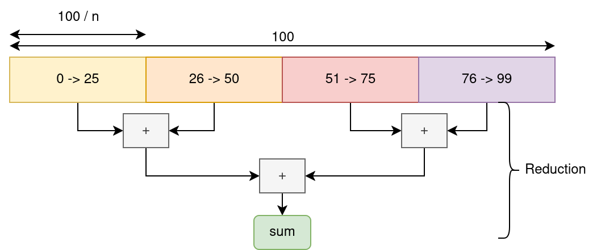{ width=100% }


## Notions de base du parallélisme — Mémoire partagée
并行基础——共享内存

Nous scindons le programme en plusieurs séquences d'instructions s'exécutant en parallèle。
我们将程序拆分为多条并行执行的指令序列。

- Chaque thread calcule une somme sur un sous-ensemble des données。
  每个线程在数据子集上进行求和。
- Nous synchronisons les threads et combinons les sommes partielles via une réduction globale。
  我们对各线程进行同步并通过全局归约合并部分和。

`OpenMP` est un outil HPC conçu pour ce type de scénario！
`OpenMP` 是为此类场景设计的 HPC 工具！

C'est une bibliothèque et un ensemble de passes de compilation simples à utiliser pour paralléliser des boucles triviales。
它是一种简单易用的库/编译器通道，可并行化简单循环。


## Notions de base du parallélisme — `OpenMP`
并行基础——`OpenMP`

```c
int sum = 0;

#pragma omp parallel for reduction(sum: +)
for (int i = 0; i < 100; i++)
  sum += i;
```
`gcc ./main.c -fopenmp -O3 -march=native`

Cette directive répartit automatiquement les itérations de boucle sur tous les cœurs CPU disponibles，
et effectue une réduction thread‑safe sur sum。
该指令会自动将循环迭代分配到所有可用 CPU 核心上，
并对 sum 执行线程安全的归约。


## Notions de base du parallélisme — Détails `OpenMP`
并行基础——`OpenMP` 细节

`OpenMP` définit un ensemble de « clauses » : des opérations suivies de modificateurs。
`OpenMP` 定义了一组 `clause`（子句），即操作及其修饰符。

- `#pragma omp` : début de toutes les clauses OpenMP。
  `#pragma omp`：所有 OpenMP 子句的起始。
- `parallel` : crée plusieurs threads。
  `parallel:` 启用多线程创建。
- `for` : active la découpe automatique de la boucle suivante。
  `for`：对后续循环进行自动切分。
- `reduction(sum: +)` : effectue une réduction sur sum avec l'opérateur `+`。
  `reduction(sum: +)`：对 sum 使用 `+` 运算进行归约。

Ce code suffit dans la plupart des cas；mais `OpenMP` permet des opérations nettement plus complexes。
此代码对大多数情形已足够；但 `OpenMP` 亦支持更复杂的操作。


## Notions de base du parallélisme — Exemple `OpenMP` avancé
并行基础——高级 `OpenMP` 示例

```c
float global_min = FLT_MAX;
int global_min_index = -1;
#pragma omp parallel
{
  float min_value = FLT_MAX;
  int min_index = -1;
#pragma omp for nowait schedule(dynamic)
  for (int i = 0; i < N; i++) {
    if (T[i] < min_value) {
      min_value = T[i];
      min_index = i;
    }
  }
#pragma omp critical
  {
    if (min_value < global_min) {
      global_min = min_value;
      global_min_index = min_index;
    }
  }
}
```


## NBody 3D naïf — Strong Scaling — Configuration
朴素 NBody 3D 强扩展——实验设置

Nous augmentons le nombre de threads tout en gardant la taille du travail constante。
我们在保持工作量不变的情况下增加线程数量。

`OMP_PLACES={0,2,4,6,8,10,12,14} OMP_PROC_BIND=True OMP_NUM_THREADS=8 ./nbody 10000`
`sudo cpupower frequency-set -g performance`

5 répétitions méta par exécution，13th Gen Intel(R) Core(TM) i7-13850HX @5.30 GHz，32KB/2MB/30MB：L1/L2/L3，15GB DDR5。
每轮 5 次元重复（Meta repetitions），13th Gen Intel(R) Core(TM) i7-13850HX @5.30 GHz，32KB/2MB/30MB：L1/L2/L3，15GB DDR5。

## NBody 3D naïf — Strong Scaling — Résultats 朴素 NBody 3D 强扩展——结果

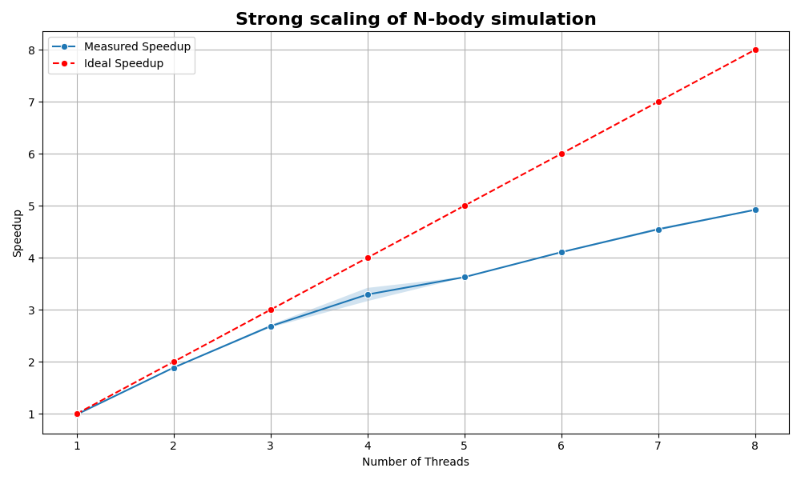{ width=80% }

L'accélération est limitée par les surcoûts d'exécution, la concurrence, la bande passante mémoire, la taille des données, etc.
加速比受运行时开销、并发度、内存带宽、数据规模等因素限制。


## Objectifs
课程目标

- Systèmes de construction : Makefiles avancés, introduction à CMake pour gérer des projets multi-fichiers et multi‑plateformes。
  构建系统：高级 Makefile，介绍 CMake 以管理多文件与多平台项目。
- Débogage : GDB, Valgrind pour détecter les erreurs et fuites mémoire。
  调试：GDB、Valgrind 用于检测内存错误与内存泄漏。
- Tests logiciels：
  软件测试：
    - Principes：tests unitaires, tests d'intégration。
      原则：单元测试、集成测试。
    - Cadres de tests en C（p. ex. Unity）。
      C 语言的测试框架（如 Unity）。
    - Importance des tests pour prévenir les régressions et assurer la validation。
      测试对于防止回归与结果验证的重要性。
- Documentation du code：Doxygen。
  代码文档：Doxygen。

# Makefiles
Makefile

## Gestion des dépendances
依赖管理

- Comment déterminer quels fichiers ont changé ?
  如何判断哪些文件发生了变更？


- **dépendances** : `main.o` dépend des modifications de `lib.h`
  依赖关系：`main.o` 依赖于 `lib.h` 的变更

## Makefile
Makefile 基础

- Un `Makefile` utilise un langage déclaratif pour décrire des cibles et leurs dépendances。
  `Makefile` 使用声明式语言来描述目标与其依赖。

- Il est exécuté par la commande `make`，qui permet de construire différentes **cibles**。
  它由 `make` 命令执行，可构建不同的目标。

    - `make` utilise les horodatages pour déterminer les fichiers modifiés。
      `make` 通过时间戳判断哪些文件被修改。

    - `make` évalue récursivement les règles pour satisfaire les dépendances。
      `make` 递归地解析规则以满足依赖关系。

## Règle Makefile
Makefile 规则

```Makefile
prog: main.c lib.c lib.h
  clang -o prog main.c lib.c -lm

target: dependencies
\t  command to build the target from the dependencies
```

## Separate Compilation

```Makefile
prog: main.o lib.o
  clang -o prog main.o lib.o -lm

main.o: main.c lib.h
  clang -c -o main.o main.c

lib.o: lib.c lib.h
  clang -c -o lib.o lib.c
```

Si `lib.c` est modifié, quelles commandes seront exécutées ?
如果 `lib.c` 被修改，将会执行哪些命令？

## Cibles phony
伪目标（Phony Targets）

Vous pouvez ajouter des cibles qui ne correspondent pas à un fichier produit。Par exemple, il est utile d'ajouter une cible `clean` pour nettoyer le projet。
可以添加不对应任何输出文件的目标。例如，添加 `clean` 目标用于清理项目非常有用。

```Makefile
clean:
  rm -f *.o prog
.PHONY: clean
```

`.PHONY` indique que la règle `clean` doit toujours être exécutée。声明所有伪目标可确保它们总会被调用（即便出现同名文件）。
`.PHONY` 指定 `clean` 规则应始终执行。将所有伪目标声明为 phony，确保它们被调用（即使出现同名文件）。

## Règle par défaut
默认规则

```bash
make clean
make prog
make
```

- Si `make` est appelé avec une règle，cette règle est construite。
  若 `make` 指定了规则，则构建该规则。
- Si `make` est appelé sans argument，la première règle est construite。Il est d'usage d'inclure une règle par défaut `all:` en première position。
  若 `make` 无参数调用，将构建第一个规则。通常会把默认的 `all:` 规则放在首位。

```Makefile
all: prog

prog: ...
```

## Variables
变量

```Makefile
CC=clang
CFLAGS=-O2
LDFLAGS=-lm

prog: main.o lib.o
  $(CC) -o prog main.o lib.o $(LDFLAGS)

main.o: main.c lib.h
  $(CC) $(CFLAGS) -c -o main.o main.c

lib.o: lib.c lib.h
  $(CC) $(CFLAGS) -c -o lib.o lib.c
```

Les variables peuvent être surchargées lors de l'appel à `make`，par ex.：
调用 `make` 时可以覆盖变量，例如：

```bash
make CC=gcc
```

## Variables spéciales
特殊变量

----  ------------------------
`$@`  nom de la cible
`$@`  目标名称
`$^`  toutes les dépendances
`$^`  所有依赖
`$<`  première dépendance
`$<`  第一项依赖
----  ------------------------

```Makefile
prog: main.o lib.o
  $(CC)  -o $@ $^ $(LDFLAGS)

main.o: main.c lib.h
  $(CC) $(CFLAGS) -c -o $@ $<

lib.o: lib.c lib.h
  $(CC) $(CFLAGS) -c -o $@ $< 
```

Les deux dernières règles sont très similaires…
最后两条规则非常相似……

## Règles implicites
隐式规则

### Avant
之前

```Makefile
main.o: main.c lib.h
  $(CC) $(CFLAGS) -c -o $@ $<

lib.o: lib.c lib.h
  $(CC) $(CFLAGS) -c -o $@ $< 
```

### Avec règle implicite
使用隐式规则

```Makefile
%.o: %.c
  $(CC) $(CFLAGS) -c -o $@ $<

main.o: lib.h
lib.o: lib.h
```

## Autres systèmes de construction
其他构建系统

- **automake / autoconf**：生成复杂 Makefile 并管理特定系统配置的自动化工具。
  **automake / autoconf**：自动生成复杂的 makefile，并管理与系统相关的配置。

- **cmake, scons**：Makefile 的后继者，提供更优雅的语法和新特性。
  **cmake, scons**：作为 Makefile 的后续方案，语法更优雅并带来新功能。

# CMake
CMake 构建系统

## Pourquoi CMake ?
为什么选择 CMake？

- **Avantages des Makefiles：**
    - Simplicité et transparence。
    - Aucun outil supplémentaire requis。
    - Contrôle direct sur le processus de compilation。
  Makefile 的优势：
    - 简单透明。
    - 无需额外工具。
    - 对构建过程具有直接控制。

- **Avantages de CMake：**
    - Multiplateforme（Linux、Windows、macOS）。
    - Génère des fichiers pour plusieurs systèmes de build（Make、Ninja etc.）.
    - Conception modulaire et orientée cibles。
    - Support intégré pour les tests、l'installation et le packaging。
  CMake 的优势：
    - 跨平台支持（Linux、Windows、macOS）。
    - 生成多种构建系统的文件（Make、Ninja 等）。
    - 模块化、以目标为中心的设计。
    - 内置测试、安装与打包支持。

## Conception générale de CMake
CMake 的总体设计

- **CMake en tant que méta‑système de build：**
    - Génère des fichiers de construction pour différents générateurs（如 Make、Ninja）。
    - Abstrait les détails spécifiques à la plateforme。
  作为元构建系统的 CMake：
    - 为不同生成器（如 Make、Ninja）生成构建文件。
    - 抽象平台相关细节。

- **Flux de travail：** 工作流：
  1. Écrire `CMakeLists.txt` pour définir le projet。编写 `CMakeLists.txt` 定义项目。
  2. Configurer le projet：配置项目：

       ```sh
       cmake -B build
       ```

   3. Construire le projet：构建项目：

       ```sh
       cmake --build build
       # or when using Make as backend
       make -C build
       ```

  Les **compilations hors source** sont recommandées pour garder les répertoires sources propres。
  建议使用**源外构建**以保持源目录整洁。

## Structure de base de `CMakeLists.txt`
`CMakeLists.txt` 的基本结构

```cmake
cmake_minimum_required(VERSION 3.15)
project(MyProject LANGUAGES C)

set(CMAKE_C_STANDARD 11)
```

- **`cmake_minimum_required`：** Spécifie la version minimale requise de CMake。
  指定所需的 CMake 最低版本。
- **`project`：** Définit le nom du projet et les langages utilisés。
  定义项目名称及使用的编程语言。
- **`set`：** Définit des variables（例如 C 标准版本）。
  设置变量，例如 C 语言标准版本。

## Ajouter un exécutable
添加可执行文件

```cmake
add_executable(my_executable src/main.c)
```

- Crée un exécutable nommé `my_executable`。
  创建名为 `my_executable` 的可执行文件。

## Ajouter une bibliothèque partagée
添加共享库

```cmake
add_library(my_library SHARED src/library.c)
```

- Crée une bibliothèque partagée nommée `libmy_library.so`（在 Linux 上）。
  创建共享库 `libmy_library.so`（Linux）。

## Lier des bibliothèques aux exécutables
为可执行文件链接库

```cmake
add_library(my_library SHARED src/library.c)
add_executable(my_executable src/main.c)
target_link_libraries(my_executable PRIVATE my_library)
```

- **`add_library`：** Crée une bibliothèque partagée。
  创建共享库。
- **`add_executable`：** Crée un exécutable。
  创建可执行文件。
- **`target_link_libraries`：** Lie la bibliothèque à l'exécutable。
  将库链接到可执行文件。

`PRIVATE` signifie que `my_executable` utilise `my_library`，mais que `my_library` n'a pas besoin d'être lié lorsque d'autres cibles lient `my_executable`。
`PRIVATE` 表示 `my_executable` 使用 `my_library`，但其他目标链接到 `my_executable` 时无需再链接 `my_library`。

## Transitivité des dépendances de bibliothèque
库依赖的传递性

```cmake
add_library(libA SHARED src/libA.c)
add_library(libB SHARED src/libB.c)
target_link_libraries(libB PUBLIC libA)
add_executable(my_executable src/main.c)
target_link_libraries(my_executable PRIVATE libB)
```

- `my_executable` est lié à `libB` et aussi à `libA` car `libB` lie `libA` avec `PUBLIC`。
  由于 `libB` 以 `PUBLIC` 链接 `libA`，`my_executable` 也会链接到 `libA`。
- Si `libB` liait `libA` avec `PRIVATE`，`my_executable` ne serait pas lié à `libA`。
  若使用 `PRIVATE`，`my_executable` 将不会链接到 `libA`。
- Si `libB` liait `libA` avec `INTERFACE`，`my_executable` serait lié à `libA` mais pas à `libB`。
  若使用 `INTERFACE`，`my_executable` 会链接到 `libA` 而不是 `libB`。
- Voir [cette référence](https://cmake.org/cmake/help/latest/command/target_link_libraries.html) pour plus de détails。
  详见参考链接。

## Répertoires d'inclusion globaux
全局包含目录

```cmake
include_directories(include)
```

- Ajoute le répertoire `include` de manière globale pour toutes les cibles。
  为所有目标全局添加 `include` 目录。
- **Limitation：** Peut entraîner des conflits dans les grands projets。
  限制：在大型项目中可能导致冲突。

## Répertoires d'inclusion spécifiques aux cibles
针对目标的包含目录

```cmake
target_include_directories(my_library
    PUBLIC include
)
```

- **PUBLIC：** 头文件目录在构建与使用库时都需要。
  构建与使用时均需。
- **PRIVATE：** 仅在构建该库时需要包含目录。
  仅构建时需要。
- **INTERFACE：** 仅在使用该库时需要包含目录。
  仅使用时需要。

## 将最小 Makefile 示例移植到 CMake
将最小 Makefile 示例移植到 CMake

```cmake
cmake_minimum_required(VERSION 3.15)
project(MyProject LANGUAGES C)

# Add the executable target
add_executable(prog main.c lib.c)

# Specify include directories for the target
target_include_directories(prog 
  PRIVATE ${CMAKE_CURRENT_SOURCE_DIR})

# Add compile options
target_compile_options(prog PRIVATE ${CFLAGS})

# Link libraries if needed
target_link_libraries(prog PRIVATE m)
```


```cmake
cmake_minimum_required(VERSION 3.15)
project(MyProject LANGUAGES C)

set(CMAKE_C_STANDARD 11)

# 所有目标定义
add_library(math_lib math.c)
add_library(utils_lib utils.c)
add_executable(my_app main.c)

# 所有属性设置
target_include_directories(math_lib PUBLIC include)
target_include_directories(my_app PRIVATE src)

# 编译选项
target_compile_options(my_app PRIVATE ${CFLAGS})

# 所有链接设置
target_link_libraries(utils_lib PUBLIC math_lib)
target_link_libraries(my_app PRIVATE utils_lib m)
```

## 构建类型：Debug 与 Release
构建类型：Debug 与 Release

- **构建类型 Debug：**
  - 包含用于调试的符号信息。
  - 典型标志：`-g`、`-O0`。

- **构建类型 Release：**
  - 针对性能进行优化。
  - 典型标志：`-O3`、`-DNDEBUG`。

## 在 CMake 中设置构建类型
在 CMake 中设置构建类型

```cmake
if(NOT CMAKE_BUILD_TYPE)
  set(CMAKE_BUILD_TYPE RelWithDebInfo CACHE STRING "Build type" FORCE)
endif()
```

- types de construction：`Debug`、`Release`、`RelWithDebInfo`、`MinSizeRel`。
  构建类型：`Debug`、`Release`、`RelWithDebInfo`、`MinSizeRel`。

    - CACHE：rend la variable persistante d'une exécution CMake à l'autre. Dans les compilations hors source, CMakeLists.txt n'est pas réévalué lors des exécutions suivantes.使变量在 CMake 多次运行间保持持久化；在源外构建中 `CMakeLists.txt` 在后续运行时不会被重新求值。
    - FORCE：Remplace toute valeur précédente.覆盖之前的任何值。
    - STRING： Le « type de compilation » fournit une description dans l'interface graphique CMake. “Build type” 在 CMake 图形界面中显示描述。

## Ajout d'indicateurs de compilation
添加编译器标志

```cmake
target_compile_options(my_library PRIVATE
    $<$<CONFIG:Debug>:-g -Wall>
    $<$<CONFIG:Release>:-O3 -DNDEBUG>
)
```

- **Expressions génératrices :** `$<CONFIG:Debug>` applique des options uniquement pour la configuration Debug。
  **生成器表达式：** `$<CONFIG:Debug>` 仅在 Debug 构建时应用对应标志。
  Les expressions génératrices permettent d'appliquer des options conditionnellement selon la configuration。
  生成器表达式：按配置条件应用。

## Installer des cibles 安装目标

```cmake

install(TARGETS <targets...>
    [RUNTIME DESTINATION <dir>]
    [LIBRARY DESTINATION <dir>]
    [ARCHIVE DESTINATION <dir>]
    [PUBLIC_HEADER DESTINATION <dir>]
)

install(TARGETS my_library
    LIBRARY DESTINATION lib
    PUBLIC_HEADER DESTINATION include
)
```

- Installe la bibliothèque partagée dans le répertoire `lib`。
  将共享库安装到 `lib` 目录。
- Installe les en-têtes publics dans le répertoire `include`。
  将公共头文件安装到 `include` 目录。

## Utiliser GNUInstallDirs 使用 GNUInstallDirs

```cmake
include(GNUInstallDirs)

install(TARGETS my_library
    LIBRARY DESTINATION ${CMAKE_INSTALL_LIBDIR}
    PUBLIC_HEADER DESTINATION ${CMAKE_INSTALL_INCLUDEDIR}
)
```

- Définit les chemins standard des répertoires de bibliothèques et d'en‑têtes GNU。 定义标准 GNU 库与头文件目录路径。

## Générer et construire le projet 生成与构建项目

1. **Configurer le projet :**
   配置项目：

   ```sh
   cmake -B build
   ```

  - Génère les fichiers de construction dans le répertoire `build`。
    在 `build` 目录生成构建文件。

2. **Construire le projet :** 构建项目：

  ```sh
  cmake --build build
  # ou si vous utilisez Make comme moteur
  # 或当使用 Make 作为后端时
  make -C build
  ```

3. **Exécuter le programme :**
3. 运行程序：

   ```sh
   ./build/my_executable
   ```

## Bonnes pratiques pour CMake
CMake 的最佳实践

- **Utiliser des commandes orientées cibles：**
    - Préférer `target_include_directories` à `include_directories`。
    - Préférer `target_link_libraries` au lien global。
  使用面向目标的命令：
    - 优先使用 `target_include_directories` 而不是 `include_directories`。
    - 优先使用 `target_link_libraries` 而不是全局链接。

- **Organiser `CMakeLists.txt`：**
    - Regrouper les cibles liées。
    - Utiliser des commentaires pour expliquer chaque部分。
  组织 `CMakeLists.txt`：
    - 将相关目标归组。
    - 使用注释解释各部分。

- **Exploiter les fonctionnalités modernes de CMake：**
    - Expressions génératrices pour配置条件化。
    - `FetchContent` 用于管理外部依赖。
  使用现代 CMake 特性：
    - 使用生成器表达式进行条件配置。
    - 使用 `FetchContent` 管理外部依赖。

# Outils de débogage 调试工具

## Exemple de programme bogué 有缺陷的程序示例

```c
/* Liste chaînée de n = 5 nœuds
   由 n = 5 个节点构成的链表
         .---------.    .---------.           .--------------.
         | val = 4 |    | val = 3 |           | val = 0      |
 head -> | next  --|--> | next  --|--> ... -> | next =  NULL |
         '---------'    '---------'           '--------------'
 */

#include <stdlib.h>
#include <assert.h>

struct Node
{
  int val;
  struct Node *next;
};

int main()
{
  int n = 5;

  struct Node *head = init_list(n);
  // ... do something with the list ...
  delete(head);

  return 0;
}
```

## Initialisation et suppression de la liste chaînée
链表的初始化与删除

```c
struct Node *init_list(int n)
{
  struct Node *head = NULL;
  for (int i = 0; i < n; ++i)
  {
    struct Node *p = malloc(sizeof *p);
    assert(p != NULL);
    p->val = i;
    p->next = head;
    head = p;
  }
  return head;
}

void delete(struct Node *head)
{
  while (head)
  {
    struct Node *next = head->next;
    free(head);
    head = head->next;
  }
}
```

## Exécuter le programme…
运行程序…

```bash
$ gcc -g -O0 -o buggy buggy.c
$ ./buggy
Segmentation fault (core dumped)
```

## GDB : GNU Debugger
GDB：GNU 调试器

- Inspecter l'état d'un programme au moment du crash。
  在程序崩溃时检查其状态。
- Exécuter pas à pas, ligne par ligne。
  逐行单步执行代码。
- Inspecter les variables et la mémoire。
  查看变量与内存。
- Définir des points d'arrêt pour suspendre l'exécution à des lignes précises。
  设置断点以在特定行暂停执行。

(Démonstration en direct)
（现场演示）

```bash
$ gdb ./buggy
Program received signal SIGSEGV, Segmentation fault.
0x000055555555522b in delete (head=0xa45d97b66d0683e8) at buggy.c:28
28          struct Node *next = head->next;
(gdb) x head
0xa45d97b66d0683e8:     Cannot access memory at address 0xa45d97b66d0683e8
```

## Valgrind : débogage mémoire et détection des fuites
Valgrind：内存调试与泄漏检测

- Détecte les fuites, les accès mémoire invalides et l'utilisation de mémoire non initialisée。
  检测内存泄漏、非法内存访问以及未初始化内存的使用。
- Exécute le code dans un bac à sable virtuel qui surveille chaque opération mémoire。
  在虚拟沙箱中运行代码，监控每一次内存操作。

(Démonstration en direct)
（现场演示）

```bash
$ valgrind --leak-check=full ./buggy
==537945== Invalid read of size 8
==537945==    at 0x109243: delete (buggy.c:30)
==537945==    by 0x109282: main (buggy.c:40)
==537945==  Address 0x4a94188 is 8 bytes inside a block of size 16 free'd
==537945==    at 0x484988F: free (in /usr/libexec/valgrind/vgpreload_memcheck-amd64-linux.so)
==537945==    by 0x10923E: delete (buggy.c:29)
==537945==    by 0x109282: main (buggy.c:40)
==537945==  Block was alloc'd at
==537945==    at 0x4846828: malloc (in /usr/libexec/valgrind/vgpreload_memcheck-amd64-linux.so)
==537945==    by 0x1091B2: init_list (buggy.c:15)
==537945==    by 0x109272: main (buggy.c:38)
```

## Autres outils : ASAN, UBSAN
其他工具：ASAN、UBSAN

- **AddressSanitizer (ASAN)：** Détecte les erreurs mémoire（如缓冲区溢出与 use-after-free）。
  AddressSanitizer（ASAN）：检测内存错误（如缓冲区溢出、释放后使用）。
- **UndefinedBehaviorSanitizer (UBSAN)：** Détecte les comportements indéfinis dans les programmes C/C++。
  UndefinedBehaviorSanitizer（UBSAN）：检测 C/C++ 程序中的未定义行为。
- Fonctionne avec les programmes multi‑threads et a une surcharge inférieure à Valgrind。
  适用于多线程程序，开销通常低于 Valgrind。

(Démonstration en direct)
（现场演示）
```bash
$ gcc -fsanitize=address -g -O0 -o buggy_asan buggy.c
$ ./buggy_asan
=================================================================
==538335==ERROR: AddressSanitizer: heap-use-after-free on address 0x502000000098 at pc 0x5bec7c7343e9 bp 0x7ffdf3015150 sp 0x7ffdf3015140
READ of size 8 at 0x502000000098 thread T0
    #0 0x5bec7c7343e8 in delete /home/poliveira/test-gdb/buggy.c:30
    #1 0x5bec7c73442c in main /home/poliveira/test-gdb/buggy.c:40
```

# Tests logiciels
软件测试

## Importance des tests logiciels
软件测试的重要性

- 1996: Ariane-5 self-destructed due to an unhandled floating-point exception, resulting in a \$500M loss.
- 1998: Mars Climate Orbiter lost due to navigation data expressed in imperial units, resulting in a \$327.6M loss.
- 1988-1994: FAA Advanced Automation System project abandoned due to management issues and overly ambitious specifications, resulting in a \$2.6B loss.
- 1985-1987: Therac-25 medical accelerator malfunctioned due to a thread concurrency issue, causing five deaths and numerous injuries.

## Dette technique
技术负债


## Coûts logiciels
软件成本


## Vérification et validation (V&V)
验证与确认（V&V）

- **Validation**：Le logiciel répond‑il aux besoins du client？  
  验证：软件是否满足客户需求？
    - « Construisons‑nous le bon produit ? »
      “我们是否在构建正确的产品？”

- **Vérification**：Le logiciel fonctionne‑t‑il correctement？  
  确认：软件是否正确地工作？
    - « Construisons‑nous le produit correctement ? »
      “我们是否以正确的方式构建产品？”

## Approches de vérification
验证方法

- Méthodes formelles
  形式化方法
- Modélisation et simulations
  建模与仿真
- Relectures de code
  代码走查/评审
- **Tests**
  测试

## Processus de test
测试流程


## Modèle en V
V 模型


## Différents types de tests
不同类型的测试

- **Tests unitaires：**
    - Tester des fonctions individuelles de manière isolée。
      对单个函数进行隔离测试。
    - Développement piloté par les tests（TDD）：viser un code可维护、简单、解耦。
      测试驱动开发（TDD）：强调可维护、简单、解耦的代码。

- **Tests d'intégration：**
    - Vérifier le comportement correct lors de l'assemblage des modules。
      当模块组合时验证正确行为。
    - Ne valider que la correction fonctionnelle。
      关注功能正确性。

- **Tests de validation：**
    - Vérifier la conformité au cahier des charges。
      测试是否符合规格说明。
    - Tester d'autres caractéristiques：性能、安全等。
      也可关注其他特性：性能、安全等。

- **Tests d'acceptation：**
    - Valider les exigences avec le client。
      与客户一起验证需求。

- **Tests de régression：**
    - S'assurer que les bogues corrigés ne réapparaissent pas。
      确保修复的缺陷不再复现。

## Tests en boîte noire et boîte blanche
黑盒与白盒测试

### Boîte noire（fonctionnelle）
黑盒测试（功能性）

- Les tests sont générés à partir des spécifications。
  基于规格说明生成测试。
- Utilise des hypothèses différentes de celles du programmeur。
  使用与程序员不同的假设。
- Indépendant de l'implémentation。
  与实现无关。
- Difficile de trouver certains défauts de programmation。
  难以发现某些编程缺陷。

### Boîte blanche（structurelle）
白盒测试（结构性）

- Les tests sont dérivés du code source。
  从源码导出测试。
- Vise une couverture maximale（分支全覆盖等）。
  旨在最大化覆盖率（如分支覆盖）。
- Difficile de détecter les omissions ou erreurs de spécification。
  不易发现遗漏或规格错误。

Les deux approches sont complémentaires。
两种方法相辅相成。

## Que tester ?
测试什么？

- Tester所有可能输入的代价过高。
  对所有可能输入进行测试代价过高。
- Choisir un sous‑ensemble d'entrées：
  选择一部分代表性输入：
    - Partitioner les entrées en classes d'équivalence pour maximiser la couverture。
      将输入划分为等价类以最大化覆盖率。
    - Tester toutes les branches de code。
      测试所有代码分支。
    - Tester les cas limites。
      测试边界情况。
    - Tester les cas invalides。
      测试无效输入。
    - Tester des combinaisons（设计实验）。
      测试多种组合（实验设计）。

## Exemple de partitionnement（1/3）
分区示例（1/3）

### Spécification
规格说明

```c
/* compare returns:
 *   0 if a is equal to b
 *   1 if a is strictly greater than b
 *  -1 if a is strictly less than b
 */
int compare (int a, int b);
```

Quelles entrées doivent être testées？
应测试哪些输入？

## Classes d'équivalence（2/3）
等价类（2/3）

| Variable | Possible Values            |
|----------|----------------------------|
| a        | {positive, negative, zero} |
| b        | {positive, negative, zero} |
| result   |                 {0, 1, -1} |

### Exemples de cas de test
测试用例示例

| a   | b   | result |
|-----|-----|--------|
| 10  | 10  | 0      |
| 20  | 5   | 1      |
| 3   | 7   | -1     |
| -30 | -30 | 0      |
| -5  | -10 | 1      |
| ... | ... | ...    |

Il est possible de sélectionner un sous‑ensemble de classes！
可以只选择其中一部分等价类！

## Tests de frontières（3/3）
边界测试（3/3）

|a          | b  | result
|-----------|----|-------
|-2147483648|-1  | -1

## Discussion
讨论

- Génération automatique de tests。
  自动生成测试。
- Calcul de la couverture de test。
  计算测试覆盖率。
- Tests de mutation。
  变异测试。
- Fuzzing。
  模糊测试（Fuzzing）。
- Importance d'outils d'automatisation des tests。
  使用自动化测试工具的重要性。
- Importance de l'intégration continue（CI）。
  使用持续集成工具的重要性。


# Cadre de tests Unity
Unity 测试框架

## Introduction à Unity
Unity 简介

  

  [Cadre de tests Unity](http://www.throwtheswitch.org/unity)

  - Cadre de tests unitaire léger et simple pour le C。
    面向 C 语言的轻量级、简单的单元测试框架。
  - Conçu pour l'embarqué mais utilisable dans tout projet C。
    最初为嵌入式设计，但适用于任何 C 项目。
  - Fournit des macros et fonctions pour définir et exécuter des tests。
    提供一组宏与函数以定义并运行测试。
  

## Mise en place de Unity 
配置 Unity

- Séparer les tests Unity dans un répertoire dédié，如 `tests/`。
  将 Unity 测试放在单独目录，例如 `tests/`。

- Inclure l'en‑tête Unity dans vos fichiers de test：
  在测试文件中包含 Unity 的头文件：

  ```c
  #include "unity.h"
  ```

- Nécessite un lien avec la bibliothèque Unity。
  需要链接 Unity 库。
- Nous lierons une bibliothèque statique `libunity.a`；puisque Unity utilise CMake, nous emploierons FetchContent pour l'ajouter au projet。
  我们将链接静态库 `libunity.a`；鉴于 Unity 使用 CMake，我们将用 FetchContent 将其引入项目。

## Écriture des tests
编写测试

- Les fonctions de test utilisent les macros `TEST` de Unity pour vérifier des conditions。
  测试函数使用 Unity 提供的 `TEST` 宏进行断言。

  ```c
  void test_function_name(void) {
      ...
      TEST_ASSERT_EQUAL_INT(expected, actual);
      TEST_ASSERT_NOT_NULL(pointer);
      TEST_ASSERT_TRUE(condition);
      ... 
  }
  ```

- Référence pour toutes les assertions： [Unity Assertions](https://github.com/ThrowTheSwitch/Unity/blob/master/docs/UnityAssertionsReference.md)

## Example: testing our linked list

```c
#include "unity.h"
#include "buggy.h"
void test_delete_single_node(void) {
    struct Node *head = init_list(1); 
    TEST_ASSERT_NOT_NULL(head); // head should not be NULL
    TEST_ASSERT_EQUAL_INT(0, head->val); // head should be 0
    delete(head); // should not crash
    TEST_ASSERT_NULL(head); // head should be NULL after deletion
}
void test_delete_multiple_nodes(void) {
    struct Node *head = init_list(5);
    TEST_ASSERT_EQUAL_INT(4, head->val); // head should be 4
    TEST_ASSERT_EQUAL_INT(3, head->next->val); 
    delete(head); // should not crash
    TEST_ASSERT_NULL(head); // head should be NULL after deletion
}
```

## Exécuter les tests
运行测试

- Créer une fonction « test runner » pour exécuter tous les tests：
  创建一个测试运行器函数来执行所有测试：

  ```c
  int main(void) ## Boundary Tests{
      UNITY_BEGIN();
      RUN_TEST(test_function_name);
      ...
      return UNITY_END();
  }
  ```

## SetUp et TearDown
SetUp 与 TearDown

- Les fonctions SetUp et TearDown s'exécutent avant et après chaque test。
  SetUp 与 TearDown 分别在每个测试之前与之后执行。

  ```c
  void setUp(void) {
  // Code exécuté avant chaque test
  // 在每个测试前运行的代码
  }

  void tearDown(void) {
  // Code exécuté après chaque test
  // 在每个测试后运行的代码
  }
  ```

## Couverture de code avec tests unitaires
使用单元测试进行代码覆盖率统计

- Utiliser `gcov` ou `llvm-cov` pour mesurer la couverture。
  使用 `gcov` 或 `llvm-cov` 统计覆盖率。
- Compiler avec les options de couverture：
  使用覆盖率编译选项进行编译：

  ```sh
  gcc --coverage -g -O0 -o test_runner test_runner.c my_code.c -lunity
  ```

- gcov 插桩基本块以记录测试期间执行情况。
  gcov 对代码基本块插桩以记录测试执行路径。

- gcovr 生成 HTML 报告，展示哪些代码被测试覆盖。
  gcovr 生成覆盖率报告（HTML）。

## Documentation avec Doxygen
使用 Doxygen 生成文档
- Doxygen est un générateur de documentation pour C、C++ 及其他语言。
  Doxygen 是用于 C、C++ 等语言的文档生成器。
- Il extrait les commentaires du code source et génère de la documentation（HTML、LaTeX 等）。
  它从源码注释中提取信息并生成文档（HTML、LaTeX 等）。
- Utiliser des blocs de commentaires spéciaux pour说明函数、参数、返回值等。
  使用特殊注释块来描述函数、参数、返回值等。
- Exemple de fonction documentée：
  文档化函数示例：

```c
/**
 * @brief Initializes a linked list with n nodes.
 * @param n Number of nodes to create.
 * @return Pointer to the head of the linked list
 * @return NULL if memory allocation fails.
 */
struct Node *init_list(int n);
```


# Profilage
性能分析

## Profilage — Motivation
性能分析——动机

- Les codes HPC sont massifs，complexes et hétérogènes。
  HPC 代码庞大、复杂且异构。
- Les humains sont **mauvais** pour prédire les goulots d'étranglement。 
  人类**很不擅长**预测瓶颈。
- Ne pas optimiser aveuglément tout。
  不要盲目地优化所有东西。
- Le profilage guide l'optimisation。
  性能分析指导优化。

Rappel：**Toujours profiler d'abord**。
记住：**始终先进行性能分析**。

## Profilage — Loi d'Amdahl
性能分析——阿姆达尔定律

$$
\mathrm{Speedup} = \frac{1}{1 - f + \frac{f}{S}}
$$

Où f est la fraction du programme améliorée，et S est l'accélération sur cette fraction。
其中 f 是程序改进的部分，S 是该部分的加速比。

Exemple：
示例：

- J'ai optimisé 80% de mon application，avec une accélération de ×10。
  我优化了应用的 80%，加速比为 10 倍。
- Au total，mon application est maintenant $\frac{1}{0.2 + (0.8 / 10)} = 3.57 \times$ plus rapide。
  总体而言，我的应用现在快了 $\frac{1}{0.2 + (0.8 / 10)} = 3.57 \times$。

Les 20% restants constituent un goulot d'étranglement！
剩余的 20% 构成了瓶颈！

## Profilage — Étapes
性能分析——步骤

1. Où（Points chauds）？
   在哪里（热点）？
    - Dans quelles fonctions passons‑nous du temps/énergie？
      我们在哪些函数上花费时间/能量？
    - Dans quel **arbre d'appels** passons‑nous du temps/énergie？
      我们在哪个**调用树**上花费时间/能量？
2. Pourquoi？
   为什么？
    - Densité arithmétique，modèles d'accès mémoire。
      算术密度、内存访问模式。
    - Ratés de cache，mauvaises prédictions de branchement，efficacité de vectorisation（compteurs matériels）。
      缓存未命中、分支预测错误、向量化效率（硬件计数器）。
3. Quel objectif？
   什么目标？
    - Dois‑je optimiser pour la vitesse？Pour l'énergie？L'empreinte mémoire？
      应该针对速度优化？还是能量？内存占用？
      - Qu'en est‑il de la taille/compression du stockage à froid？
        冷存储大小/压缩怎么办？
    - Ai‑je des contraintes（例如 mémoire limitée）？
      我有约束吗（如内存限制）？
    - Dois‑je optimiser ou changer d'algorithme？
      应该优化还是换算法？


## Profilage — Temps
性能分析——时间

Il est assez facile de benchmarker une seule fonction en utilisant une horloge（haute résolution, monotone）：
使用（高精度、单调）时钟对单个函数进行基准测试相当容易：

```python 
begin = time.now()
my_function()
end = time.now()
elapsed = end - begin
```

Méthode rapide et rudimentaire pour profiler une partie de mon programme。
对程序的一部分进行性能分析的快速粗糙方法。

## Profilage — Temps (Stabilité)
## 剖析 — 时间（稳定性）

Mais nous devons tenir compte du bruit :
但我们必须考虑噪声：

```python
for _ in range(NWarmup):  # 预热阶段循环
  my_function()

times = []
for i in range(NMeta):  # 测量循环
  begin = time.perf_counter()  # 开始计时
  my_function()
  times.append((i, time.perf_counter() - begin))  # 记录时间

df = pd.DataFrame(times, columns=["Iteration", "Time"])  # 创建数据框

median = np.median(df["Time"])  # 计算中位数
std = np.std(df["Time"])  # 计算标准差
print(f"Time: {median} +/- {std}")  # 打印结果
...
# Plot through seaborn !  # 通过seaborn绘图！
sns.plot(data=df, x="Iteration", y="Time", ax=ax)
...
```

Nous devons vérifier que nos mesures sont acceptables !
我们必须检查我们的测量结果是否可接受！

## Profilers - Introduction
## 剖析器 — 介绍

Application complète -> Des milliers de fonctions à mesurer !
完整应用程序 -> 需要测量成千上万个函数！

- Les profileurs sont des outils pour automatiser ceci
- 剖析器是自动化这一过程的工具
- Deux types principaux :
- 两种主要类型：
  - Échantillonnage : Pause le programme et enregistre où se trouve le programme
  - 采样法：暂停程序并记录程序的位置
  (Fonctions coûteuses -> Plus d'échantillons !)
  （耗时函数 -> 更多采样！）
  - Instrumentation : Modifie le programme pour ajouter automatiquement des minuteurs
  - 插桩法：修改程序以自动添加计时器

Les profileurs peuvent également vérifier l'utilisation des threads, la vectorisation, l'accès à la mémoire, etc.
剖析器还可以检查线程使用情况、向量化、内存访问等。

## Perf - Record
## Perf - 记录

Linux Perf est un profileur puissant et polyvalent :
Linux Perf是一个强大且多功能的剖析器：

```bash
gcc ... -g -fno-omit-frame-pointer  # 编译时保留调试信息和帧指针
perf record -g -- ./mytransform ./pipelines/big.pipeline  # 记录性能数据
Loaded image: images/image1.bmp (3660x4875, 3 channels)
[ perf record: Woken up 3 times to write data ]
[ perf record: Captured and wrote 0.484 MB perf.data (2941 samples) ]


perf report  # 生成报告
```

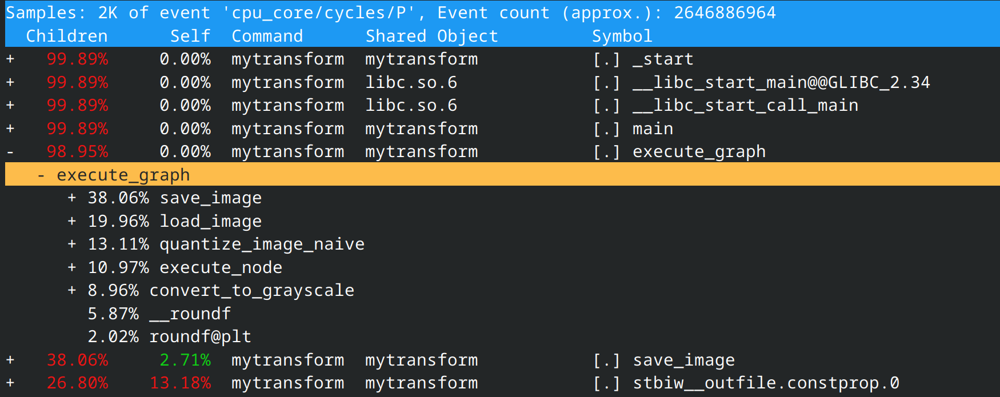

C'est un excellent outil pour obtenir rapidement des piles d'appels avec peu de dépendances.
这是一个能够快速获取调用栈且依赖较少的优秀工具。

## Profiling - Hardware counters
## 剖析 — 硬件计数器

En réalité, perf n'est pas seulement un profileur !
实际上，perf不仅仅是一个剖析器！

- L'API Linux Perf peut être utilisée pour accéder à de nombreux compteurs matériels
- Linux Perf API可以用来访问许多硬件计数器
- Perf record n'est qu'une utilisation de perf
- Perf record只是perf的一种用法

La plupart des CPU/GPU ont des compteurs matériels qui surveillent différents événements :
大多数CPU/GPU都有监控不同事件的硬件计数器：

- Nombre de cycles
- 时钟周期数
- Nombre d'instructions retirées
- 已退役指令数
- Nombre d'accès mémoire
- 内存访问次数
- Compteurs d'énergie RAPL
- RAPL能耗计数器

## Profiling - Perf for Hardware counters
## 剖析 — 使用Perf监控硬件计数器

```bash
perf stat -e cycles,instructions python3 ./scripts/run_bls.py ...  # 统计周期和指令数
...

 Performance counter stats:
   749,352,412,722      cpu_core/cycles/                                                      
 3,142,707,494,308      cpu_core/instructions/           #    4.19  insn per cycle               

      32.363472139 seconds time elapsed
     225.351168000 seconds user
       0.111367000 seconds sys
```

- 4,19 instruction par cycle -> Très bonne vectorisation
- 每周期4.19条指令 -> 很好的向量化效果
- temps écoulé -> "Temps d'horloge murale"
- 经过时间 -> "挂钟时间"
- secondes utilisateur -> Temps CPU dans l'espace utilisateur -> $225 / 30 \approx 7$ threads !
- 用户秒数 -> 用户空间的CPU时间 -> $225 / 30 \approx 7$ 个线程！

## Profiling - Perf for Hardware counters
## 剖析 — 使用Perf监控硬件计数器

```bash
perf stat -e cache-references,cache-misses python3 ./scripts/run_bls.py ...  # 统计缓存引用和缓存未命中
...

 Performance counter stats:    
       394,258,269      cpu_core/cache-references/                                            
        36,823,151      cpu_core/cache-misses/           #    9.34% of all cache refs         

      32.363472139 seconds time elapsed
     225.351168000 seconds user
       0.111367000 seconds sys
```

- 394 258 269 références au LLC (Sur Intel)
- 394,258,269次对LLC（最后级缓存）的引用（在Intel上）
- 36 283 151 échecs LLC -> 9,3% de taux d'échec
- 36,283,151次LLC未命中 -> 9.3%的未命中率 

## Profilage - Perf pour les compteurs matériels
## 剖析 — 使用Perf监控硬件计数器

```bash
perf stat -e branches,branch-misses python3 ./scripts/run_bls.py ...  # 统计分支和分支预测错误
...

 Performance counter stats:    
   761,974,570,065      cpu_core/branches/                                                    
       248,674,718      cpu_core/branch-misses/          #    0.03% of all branches       

      32.363472139 seconds time elapsed
     225.351168000 seconds user
       0.111367000 seconds sys
```

- 761 974 570 065 ruptures de flux d'exécution (if, returns, boucles, etc.)
- 761,974,570,065次执行流中断（if语句、返回、循环等）
- 248 674 718 échecs de branche -> Bonne prédiction de branche ! (taux d'échec de $0,9%$)
- 248,674,718次分支预测错误 -> 很好的分支预测！（$0.9%$ 错误率）

## Perf - Enregistrer avec d'autres événements
## Perf - 记录其他事件

Nous pouvons également utiliser `perf record` avec d'autres événements !
我们也可以在`perf record`中使用其他事件！

```bash
perf record -e "cache-references,cache-misses,branches,branch-misses" -g -- ./mytransform ./pipelines/big.pipeline  # 记录多种事件
Loaded image: images/image1.bmp (3660x4875, 3 channels)
[ perf record: Woken up 7 times to write data ]
[ perf record: Captured and wrote 1.709 MB perf.data (10260 samples) ]

perf report  # 生成报告
```

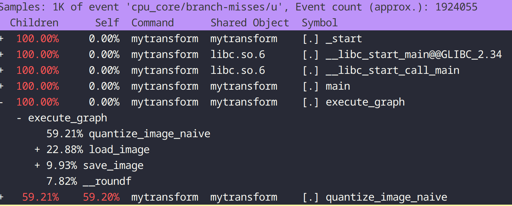


## Intel VTune
## Intel VTune

Perf est un peu "basique" : de nombreux profileurs s'appuient sur perf comme Intel VTune
Perf有点"简陋"：许多剖析器都基于perf构建，如Intel VTune

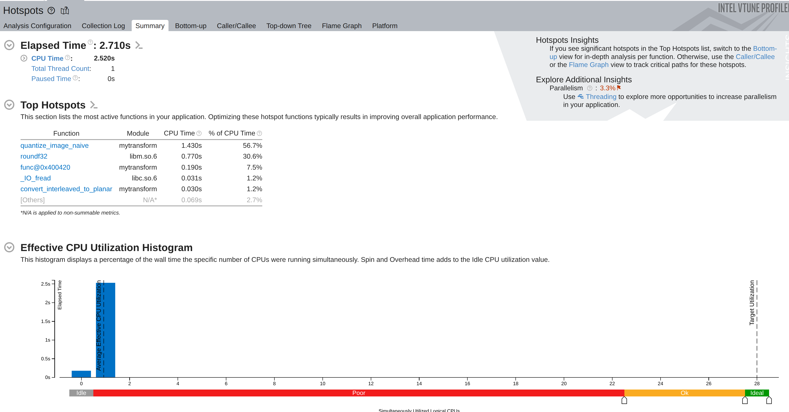

## VTune - CPU Usage
## VTune - CPU使用情况

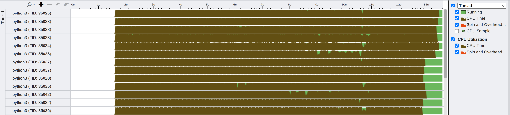
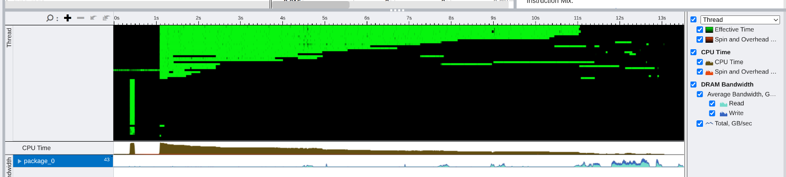


## VTune - Collections Mode
## VTune - 收集模式
VTune a plusieurs modes de collecte :
VTune有多种收集模式：

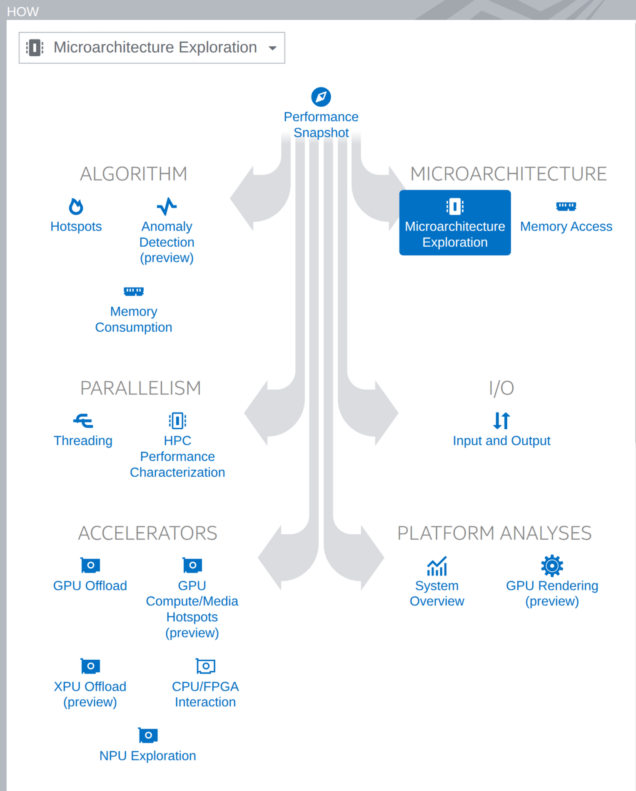

## VTune - HPC Performance
## VTune - HPC性能

VTune a plusieurs modes de collecte :
VTune有多种收集模式：

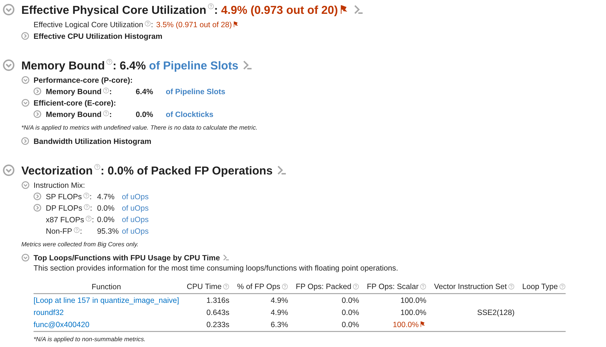

## Other profilers
## 其他剖析器

- MAQAO est un profileur développé par le LIPARAD
- MAQAO是由LIPARAD开发的剖析器
- AMD, NVIDIA et ARM ont leurs propres profileurs pour leurs plateformes
- AMD、NVIDIA和ARM都有适用于各自平台的剖析器
- Et beaucoup, beaucoup d'autres (likwid, gprof, etc.)
- 还有很多很多其他的（likwid、gprof等）

Habituellement, nous combinons un profileur "rapide" comme gprof/perf record avec un plus approfondi quand nécessaire.
通常，我们会结合使用"快速"剖析器（如gprof/perf record）和更深入的剖析器（需要时）。

## Profiling - Energy
## 剖析 — 能耗

L'énergie est une préoccupation croissante :
能耗是一个日益关注的问题：

- Un cluster HPC consomme des millions de dollars d'électricité **annuellement**
- 一个HPC集群每年消耗数百万美元的电力
- ChatGPT et d'autres LLM sont computationnellement intensifs :
- ChatGPT和其他LLM计算密集：
  - Les GPU Nvidia consomment beaucoup d'énergie
  - Nvidia GPU消耗大量能源

D'un autre côté, mesurer l'énergie est plus difficile que mesurer le temps.
另一方面，测量能耗比测量时间更困难。

De nombreux acteurs se concentrent encore uniquement sur le temps d'exécution -> L'énergie est perçue comme "de second rang"
许多参与者仍然只关注执行时间 -> 能耗被视为"次要指标"

## Profiling - RAPL
## 剖析 — RAPL

Running Average Power Limit (RAPL) est un compteur matériel x86 qui surveille la consommation d'énergie :
运行平均功率限制（RAPL）是监控能耗的x86硬件计数器：

- L'énergie est suivie à différents niveaux
- 能耗在不同级别被跟踪
  - Cœur, Ram, Package, GPU, etc.
  - 核心、内存、封装、GPU等
- Il ne tient pas compte des consommateurs d'énergie secondaires (Ventilateurs, Refroidissement liquide, etc.)
- 它不计算二级耗电设备（风扇、水冷等）
- RAPL n'est pas basé sur les événements : Toute la machine est mesurée ! (Processus en arrière-plan, etc.)
- RAPL不是基于事件的：整个机器都被测量！（后台进程等）

Il nécessite des permissions sudo pour y accéder (comparé à une horloge)
访问它需要sudo权限（相比于时钟）

```bash
perf stat -a -j -e power/energy-pkg,power/energy-cores <app>  # 测量封装和核心能耗
{"counter-value" : "88.445740", "unit" : "Joules", "event" : "power/energy-pkg/", "event-runtime" : 10002168423, "pcnt-running" : 100.00}
{"counter-value" : "10.848633", "unit" : "Joules", "event" : "power/energy-cores/", "event-runtime" : 10002166697, "pcnt-running" : 100.00}
```

## Profiling - Watt-Meter (Yokogawa)
## 剖析 — 功率计（横河）

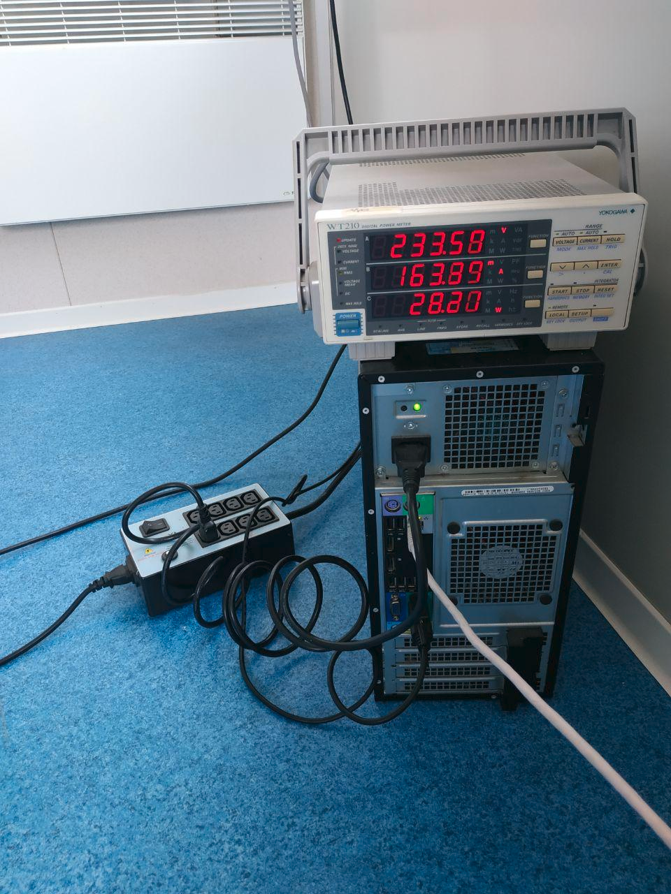

Des solutions matérielles sont également disponibles pour surveiller la consommation d'énergie.
硬件解决方案也可用于监控能耗。
Elles ont généralement une résolution d'échantillonnage lente ($\approx 1s$) et sont plus difficiles à adapter à des clusters entiers.
它们通常采样分辨率较慢（$\approx 1s$），并且难以扩展到整个集群。

D'un autre côté, elles donnent des mesures de puissance précises par rapport à RAPL.
另一方面，与RAPL相比，它们提供精确的功率测量。

## Profiling - RAPL accuracy
## 剖析 — RAPL准确性

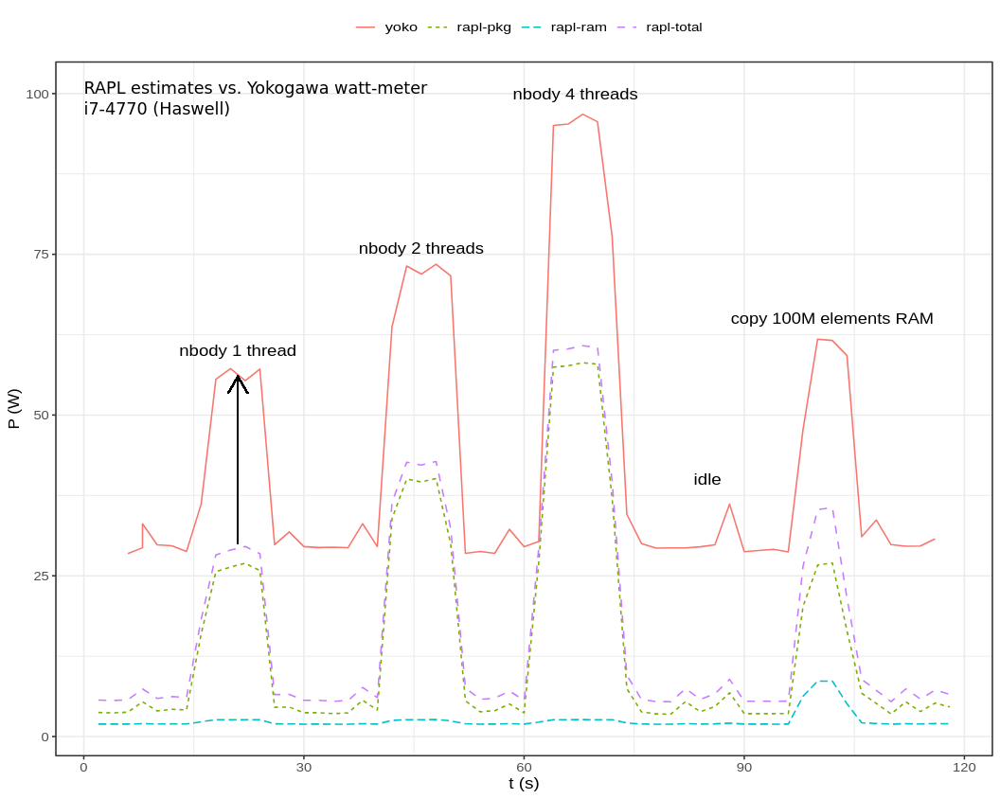

En pratique, RAPL sous-estime la consommation d'énergie, mais les tendances sont correctement appariées.
在实践中，RAPL低估了功耗，但趋势匹配正确。
