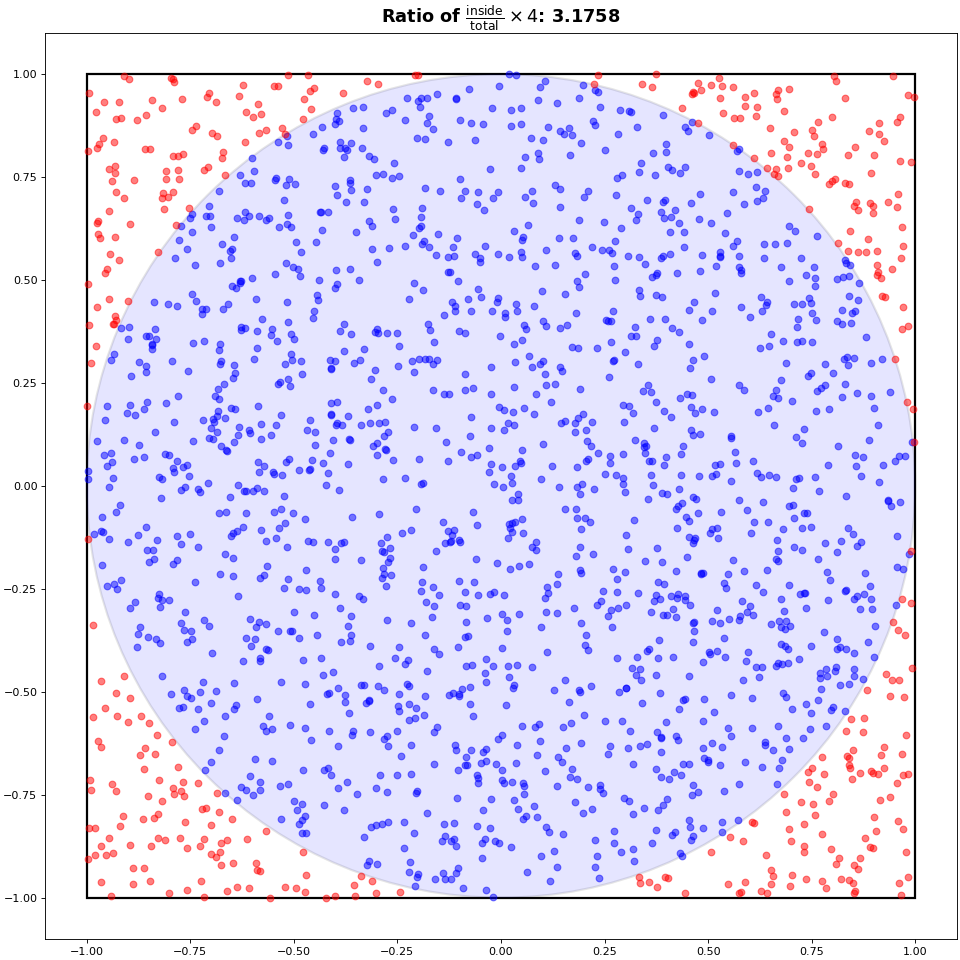

# Lab 4: Monte-Carlo Sampling

<hr class="gradient" />


Monte-Carlo methods are useful for approximating quantities that are difficult or computationally expensive to determine analytically or through deterministic algorithms. These methods introduce randomness into the computations in order to obtain a statistically meaningful estimate over multiple repetitions of the same routine.

In this lab, we explore the approximation of π using Monte-Carlo sampling. To do this, we consider a unit circle (radius 1) inscribed within a square of side length 2, centered at the origin. By generating random points uniformly within the square and counting how many fall inside the circle, we can estimate the ratio of the areas of the two shapes. 

Since the area of the circle is $\pi \cdot r^2 = \pi$, and the area of the square is 4, we expect the ratio of points falling inside the circle to converge to $\pi / 4$.

<figure markdown="span">
  
  <figcaption>Monte-Carlo Pi</figcaption>
</figure>

<hr class="gradient" />

## 1 - Implementing the MC Method

Implement your own version of the $\pi$ estimator inside `src/compute_pi.c` using the Monte-Carlo method. This method receives $n$ the number of Monte-Carlo samples to take as arguments, and must return the approximation of $\pi$ in `double` precision.

You will have to setup a CMake for this lab. The program can be run using:
```bash title="Run the estimator"
# piestimator <nsamples>
piestimator 1000000
```

<hr class="gradient" />

## 2 - Timing and serialization

### 1. Implementing timing

#### a) Modify the function `src/main.c:mc_harness(...)` to measure the execution time of your method. 

You must repeat the measurements `nmeta` times, and record the values of Pi as well as the execution time for each execution.

What function did you use to measure time? How accurate is it? Is it monotonic?

#### b) Modify the function `src/main.c:print_results(...)` to print a table with the following values:

| Avg. Pi             | Std Pi                   | Avg. Time              | Std Time                             | Min Time           | Max Time           |
|---------------------|--------------------------|------------------------|--------------------------------------|--------------------|--------------------|
| Average Value of Pi | Standard Deviation of Pi | Average execution time | Standard Deviation of execution time | Min execution time | Max Execution time |

You may need to modify other functions or the provided structures to achieve this.

#### c) Implement csv serialization inside the program. 

You must exactly match this format and header:

```csv title="output.csv"
NMeta,Pi,Time
1,3.145584,0.025
2,3.13547,0.028
```

Print at least 10 decimals, and ensure that the file is saved in the path provided by the user.

Check that you can run the following:
```sh title="Expected API"
# Run MC Pi Estimator with 1 Million sample, 2048 meta-repetitions and save the results in results.csv
./piestimator 1000000 2048 results.csv
```

!!! Warning
    The following questions will reuse this CSV serialization. Be sure that you match exactly the prescribed format. Be careful not to introduce blank spaces in the header name (e.g. `NMeta,Pi,Time` rather than `NMeta,   Pi,   Time`)

### 2. Run the provided experiments

If you correctly implemented csv serialization, this will generate plots inside the `results` folder.

```sh title="First sequential run"
# ./run_all.sh <run_label>
./run_all.sh sequential
```

#### a) First, look at the top figure in `convergence.png`
What do you observe? How does the error evolve when increasing the number of Monte-Carlo samples?  
If needed, fix your program so that the relative error converges toward zero.

####  b) Look at the bottom figure: how does execution time evolve when increasing the number of samples? 
If needed, fix your program so that the execution time scales linearly with the number of samples.

####  c) Look at the top figure in `stability.png`
How are the values of the Pi estimations distributed? Is there any bias, and if so, why?
If needed, fix your program so that the Pi estimations are normally distributed around 3.14.

#### d) Look at the bottom figure: how is the execution time distributed?
Check whether the timings are stable, and if not, propose an explanation.
Do you observe any measurement noise? How would you characterize it?

If needed, fix your measurements so that the execution time is mostly normally distributed, and the measurement noise is tolerable.


!!! Tip
    The `results/expected_results` folder contains examples of plots that were run on a stable machine, with a correct implementation of the Monte-Carlo estimator.


<div class="goingfurther-section box-section" markdown>

## 2.5 - <span class="toc-title"> (Going-Further)</span> Understanding the scripts

### 1. Look at `run_all.sh`, and try to understand each line.

#### a) What does `set -e`, `set -o pipefail` and `2>&1 | tee ...` do?

#### b) What is the purpose of the `run_label` argument (Why should we label our data)? 

What files are generated, and what's the purpose of every one of them?

### 2. Look at `scripts/analyse.py` and try to understand how each plot is built. 
Try to link every components of `convergence.png` and `stability.png` (The titles, the axis label, the axis ticks, the distributions, the grid, ...) with the code that generates it.

</div>

<hr class="gradient" />

## 3 - Optimization

### 1) Setting up Makefile

#### a) Modify the `makefile` and play around with compilation flags and different compilers.  

Remember that you can run `run_all.sh <run_label>` to compare the different runs later.  

What configuration gives you the fastest execution time? Can you understand why?

### 2. Use OpenMP to parallelize your Monte-Carlo algorithm. 

You may need to modify the `makefile` to link to OpenMP.  

#### a) How are you generating random numbers in the sampling algorithm?

- Read the fourth paragraph in the description section of the `rand`/`srand` man page using `man 3 srand` or the [online version](https://linux.die.net/man/3/srand).
- If necessary, research thread-safe alternatives.


#### b) Where did you implement parallelization?

- Are you averaging multiple Pi values from separate runs, or
- Are you summing the counts of points inside the circle across threads?
    - Does each thread accumulate its count in a private variable?
    - If you accumulate in a shared variable, do you protect it using mutexes, locks, or OpenMP critical sections?


#### c) Do you see any performance gains compared to the sequential version?

#### d) Rerun the provided experiments, and compare with your previous sequential result.

``` bash title="Running the experiment(s)"
./run_all.sh parallel
```

Is your program faster using OpenMP? If not, ensure you are correctly running multiple threads.

#### e) Is the performance stable? Is there any impact on the accuracy of your estimator?

If performance is unstable, investigate thread affinity and how to bind threads to specific cores.

On Intel CPUs, check if your processor has Performance (P) and Efficiency (E) cores, as this can affect timing consistency.

```sh title="Checking your CPU Model Name"
lscpu | grep "Model name"
```

<div class="optional-section box-section" markdown>

#### e - Bonus) For students with an heterogeneous CPU (Efficiency (E) Cores and Performance (P) Cores)

Using both E and P cores can introduce instabilities in your measurements, load balancing issues, and should be avoided.  
Run the following to check your CPU topology:
```sh title="Checking CPU Topology"
lscpu --all --extended

# CPU NODE SOCKET CORE L1d:L1i:L2:L3 ONLINE    MAXMHZ   MINMHZ       MHZ
#   0    0      0    0 0:0:0:0          yes 5100.0000 800.0000  800.0000
#   1    0      0    0 0:0:0:0          yes 5100.0000 800.0000  800.0000
#   2    0      0    1 4:4:1:0          yes 5100.0000 800.0000  800.0000
#   3    0      0    1 4:4:1:0          yes 5100.0000 800.0000  800.0000
#   4    0      0    2 8:8:2:0          yes 5100.0000 800.0000  800.0000
#   5    0      0    2 8:8:2:0          yes 5100.0000 800.0000  800.0000
#   6    0      0    3 12:12:3:0        yes 5100.0000 800.0000  800.0000
#   7    0      0    3 12:12:3:0        yes 5100.0000 800.0000  800.0000
#   8    0      0    4 16:16:4:0        yes 5300.0000 800.0000  843.1520
#   9    0      0    4 16:16:4:0        yes 5300.0000 800.0000  800.0000
#  10    0      0    5 20:20:5:0        yes 5300.0000 800.0000 2329.4590
#  11    0      0    5 20:20:5:0        yes 5300.0000 800.0000  800.0000
#  12    0      0    6 24:24:6:0        yes 5100.0000 800.0000  800.0000
#  13    0      0    6 24:24:6:0        yes 5100.0000 800.0000  800.0000
#  14    0      0    7 28:28:7:0        yes 5100.0000 800.0000  800.0000
#  15    0      0    7 28:28:7:0        yes 5100.0000 800.0000  800.0000
#  16    0      0    8 32:32:8:0        yes 3800.0000 800.0000  800.0000
#  17    0      0    9 33:33:8:0        yes 3800.0000 800.0000  842.6700
#  18    0      0   10 34:34:8:0        yes 3800.0000 800.0000  799.7680
#  19    0      0   11 35:35:8:0        yes 3800.0000 800.0000  800.0000
#  20    0      0   12 40:40:10:0       yes 3800.0000 800.0000  800.0000
#  21    0      0   13 41:41:10:0       yes 3800.0000 800.0000  800.0000
#  22    0      0   14 42:42:10:0       yes 3800.0000 800.0000  800.0000
#  23    0      0   15 43:43:10:0       yes 3800.0000 800.0000  800.0000
#  24    0      0   16 44:44:11:0       yes 3800.0000 800.0000  799.0440
#  25    0      0   17 45:45:11:0       yes 3800.0000 800.0000  800.0000
#  26    0      0   18 46:46:11:0       yes 3800.0000 800.0000  800.0000
#  27    0      0   19 47:47:11:0       yes 3800.0000 800.0000  800.0000
```

You should be able to see that some cores have a higher Max Frequency (MAXMHZ) than other: those are typically performance cores.  
If you have hyperthreading enabled, you should also see that some cores share the same "core id": classically, only performance cores have hyperthreading enabled.  
From the previous output, we can deduce that cores 0-15 are P-cores and that hyperthreading is enabled.
As such, we can run the following command to change the thread affinity of our shell to only use physical cores:

```sh title="Restricting Thread Affinity"
# Adjust the core list based on your actual topology
taskset -cp 0,2,4,6,8,10,12,14 $$
# You can also use `hwloc-ls` or `lstopo` (from hwloc) for a visual map of your CPU topology.
```

From now on, all the executable run in this shell will inherit this thread affinity.
Feel free to create an alias for this command inside your `.bashrc` for future use.

You can also use the following variable for OpenMP:
```sh title="OMP Places for E/P cores"
OMP_PLACES="{0, 2, 4, 6, 8, 10, 12, 14}"
```

</div>

#### f) Verify your implementation's strong scaling:

``` bash title="Strong Scaling"
OMP_NUM_THREADS=1 ./piestimator 1000000
OMP_NUM_THREADS=2 ./piestimator 1000000
OMP_NUM_THREADS=4 ./piestimator 1000000
OMP_NUM_THREADS=8 ./piestimator 1000000
```

Does using 2 threads instead of 1 make your code twice as fast? Propose an explanation.

#### g) Verify your implementation's weak-scaling:

``` bash title="Weak scaling"
OMP_NUM_THREADS=1 ./piestimator 1000000
OMP_NUM_THREADS=2 ./piestimator 2000000
OMP_NUM_THREADS=4 ./piestimator 4000000
OMP_NUM_THREADS=8 ./piestimator 8000000
```

What results do you expect to see? Does that match your empirical observations? Propose an explanation.

<hr class="gradient" />

<div class="summary-section box-section" markdown>

<h2 class="hidden-title"> 5 - Summary</h2>

Upon completing this third lab, you should be able to:

- [x] Explain the principle of Monte-Carlo algorithms and apply them to numerical estimation
- [x] Implement and benchmark a Monte-Carlo estimator with statistical analysis (mean, stddev, min/max)
- [x] Account for variability and noise in timing benchmarks
- [x] Use OpenMP to parallelize a minimal compute-bound code and understand implications for thread safety
- [x] Perform simple analysis of scaling behavior (strong/weak scaling)
- [x] Understand thread affinity and hardware topology impacts on performance and timing stability

</div>