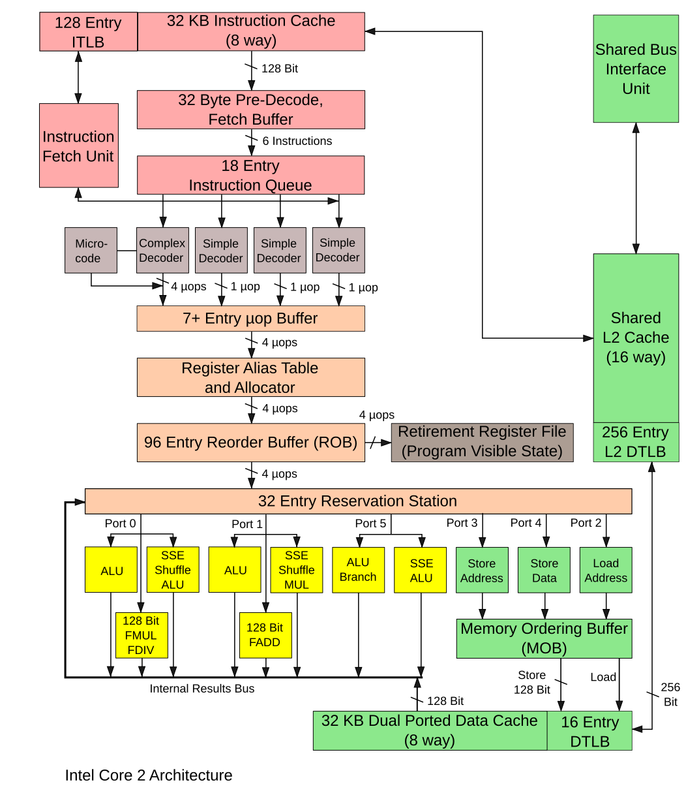
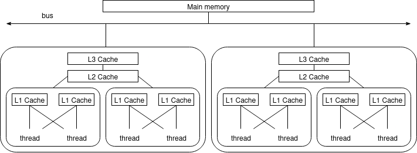
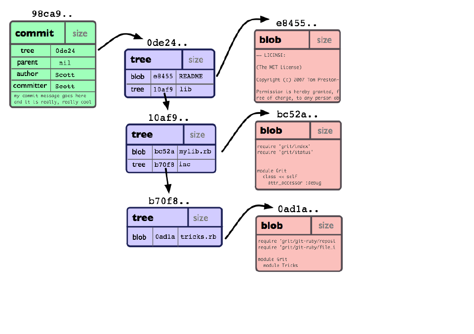
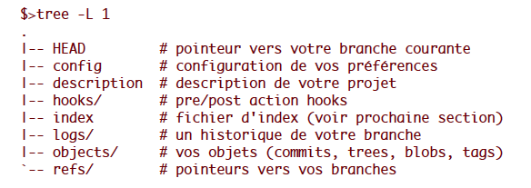
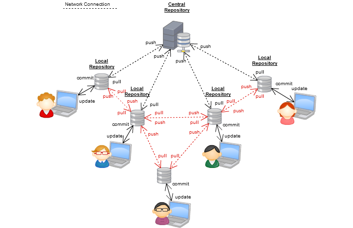

# Introduction à l'ingénierie logicielle pour le calcul haute performance (HPC) et l'intelligence artificielle (IA)
面向高性能计算（HPC）与人工智能（AI）的软件工程导论

<div class="mkdocs-only" markdown>
  <p align="right" markdown>
  [Download as slides 📥](slides/lecture1.pdf)
  </p>
</div>

## Plan du cours
课程大纲

- **Cours 1** : Introduction et environnement de développement
  第1讲：导论与开发环境
- **Cours 2** : Programmation C consciente des performances 
  第2讲：面向性能的 C 编程
- **Cours 3** : Construction, tests et débogage des logiciels scientifiques
  第3讲：科学软件的构建、测试与调试
- **Cours 4** : Conception expérimentale, profilage et optimisation des performances/énergie
  第4讲：实验设计、分析剖析与性能/能耗优化
- **Cours 5** : HPC pour l'IA et impact environnemental du calcul
  第5讲：面向 AI 的 HPC 与计算的环境影响

*Projet* : Moteur d'inférence pour un réseau profond
项目：深度网络推理引擎

## Introduction et environnement de développement
引言与开发环境

- Principes de **l'ingénierie logicielle appliquée au HPC et à l'IA**.
  面向 HPC 与 AI 的软件工程原则。
- Introduction aux **architectures de calcul**.
  计算体系结构概览。
- **Outils de développement** : scripts shell, gestion de paquets, Git, IDE, etc.
  开发工具：Shell 脚本、包管理、Git、IDE 等。

## Solution analytique du problème à deux corps
二体问题的解析解

Considérons deux particules de masses $m_1$ et $m_2$ aux positions $x_1$ et $x_2$ en interaction gravitationnelle.
设两颗粒子质量为 $m_1$、$m_2$，位置为 $x_1$、$x_2$，相互之间存在万有引力作用。

$$m_1.a_1 = -\frac{G.m_1.m_2}{\|x_1 - x_2\|^3} (x_2 - x_1)$$

$$m_2.a_2 = -\frac{G.m_1.m_2}{\|x_1 - x_2\|^3} (x_1 - x_2)$$

Résolu par Bernoulli en 1734, $x_1$ et $x_2$ peuvent s'exprimer par des équations simples dépendant du temps, des masses et des conditions initiales.
该问题由伯努利于 1734 年求解：$x_1$ 与 $x_2$ 可写成随时间、质量与初始条件变化的简单方程。

## Pourquoi simuler le problème à n corps ?
为何要模拟 n 体问题？

- Pour $n=3$ ou plus, il n'existe pas de solution analytique praticable.
  当 $n\ge 3$ 时，不存在可实际使用的解析解。
- Même des solutions mathématiques avancées (p. ex. Sundman, 1909) sont trop lentes pour un usage réel.
  即便是高阶数学解（如 Sundman，1909）在实际应用中也过于缓慢。
- Les **simulations numériques** nous permettent d'étudier le mouvement de nombreuses particules en interaction.
  **计算机模拟**使我们能够研究大量相互作用粒子的运动。
  - Des algorithmes efficaces (p. ex. Barnes–Hut, multipôle rapide) rendent possibles des simulations à grande échelle.
    高效算法（如 Barnes–Hut、快速多极子）使大规模模拟成为可能。
- Le **HPC est essentiel** pour simuler des systèmes réalistes en physique, astronomie et IA.
  - Simulation + HPC = compréhension des systèmes complexes !
 - **HPC 对于**在物理、天文学和 AI 中模拟真实系统至关重要。
  - 模拟 + HPC = 理解复杂系统！

## Simulation n-corps naïve en C
C 语言的朴素 n 体模拟

```c
// Calculer les accélérations à partir des forces gravitationnelles
// 基于万有引力计算加速度
for (int i = 0; i < num_particles; i++) {
  double ax = 0.0, ay = 0.0, az = 0.0;
  for (int j = 0; j < num_particles; j++) {
    if (i == j) continue;
    double dx = p[j].x - p[i].x;
    double dy = p[j].y - p[i].y;
    double dz = p[j].z - p[i].z;
    double d_sq = dx * dx + dy * dy + dz * dz;
    double d = sqrt(d_sq);
    double f = G * p[i].m * p[j].m / (d_sq * d);
    ax += f * dx / p[i].m;
    ay += f * dy / p[i].m;
    az += f * dz / p[i].m;
  }
  p[i].ax = ax;
  p[i].ay = ay;
  p[i].az = az;
}
```

## Simulation n-corps naïve en C
C 语言的朴素 n 体模拟

Introduire un petit pas de temps `dt` et mettre à jour les positions selon les forces gravitationnelles.
引入较小时间步长 `dt`，并根据引力更新位置。

```c
// Mettre à jour la vitesse et les positions selon les accélérations calculées
// 根据已计算的加速度更新速度与位置
for (int i = 0; i < num_particles; i++) {
  p[i].vx += p[i].ax * dt;
  p[i].vy += p[i].ay * dt;
  p[i].vz += p[i].az * dt;

  p[i].x += p[i].vx * dt;
  p[i].y += p[i].vy * dt;
  p[i].z += p[i].vz * dt;
}
```

## Calcul haute performance (HPC)
高性能计算（HPC）

**Fugaku (2020, 442 petaflops, 7,3 millions de cœurs)**
**Fugaku（2020 年，442 petaflops，730 万个核心）**

  - n-corps : intègre **1,45 billion** de particules par seconde.
  - n 体：每秒积分处理约 **1.45 万亿** 个粒子。

**Comment atteindre de telles performances ?**
**如何达到如此性能？**

- Améliorations algorithmiques :
  算法改进：
    - Utiliser des méthodes arborescentes (Barnes–Hut) pour réduire la complexité de $O(n^2)$ à $O(n \log n)$ ou mieux.
      采用基于树的方法（Barnes–Hut）将复杂度从 $O(n^2)$ 降至 $O(n \log n)$ 或更优。
- Parallélisation : répartir le calcul sur de nombreux cœurs.
  并行化：将计算分配到大量内核上。
- Vectorisation : utiliser les instructions SIMD pour traiter plusieurs données en parallèle.
  向量化：使用 SIMD 指令并行处理多数据点。
- Localité des données : optimiser les schémas d'accès mémoire pour réduire la latence et maximiser l'utilisation des caches.
  数据局部性：优化数据访问模式，降低内存延迟并最大化缓存命中。

Les optimisations du compilateur, l'affinage des performances et l'accélération matérielle sont également cruciales.
编译器优化、性能调优与硬件加速同样至关重要。


# Architectures HPC
HPC 架构

## CPU et jeu d'instructions (ISA) — rappel rapide
CPU 与指令集（ISA）——快速回顾

- Un cœur CPU exécute des instructions ; l'état machine = registres, compteur de programme et drapeaux.
- CPU 核心执行指令；机器状态由寄存器、程序计数器和标志位构成。
- L'assembleur encode les instructions ; les compilateurs traduisent le code de haut niveau vers l'ISA.
- 汇编对指令进行编码；编译器将高级代码翻译为 ISA。
  - types : arithmétique/logique, chargement/stockage (mémoire), contrôle de flux (branches, appels), appels système
  - 类型：算术/逻辑、装载/存储（内存）、控制流（分支、调用）、系统调用
- Les registres sont le stockage le plus rapide ; la pression sur les registres influence la performance.
- 寄存器是最快的存储；寄存器压力会影响性能。

## Exemple : architecture Intel Core2
示例：Intel Core2 架构



## Pipeline, hiérarchie mémoire et interruptions
流水线、内存层次与中断

- Le **pipeline** augmente le débit d'instructions, schéma classique en 5 étapes :
- **流水线**提高指令吞吐量，经典五阶段：
  - Fetch → Decode → Execute → Memory → Write-back
  - 取指 → 译码 → 执行 → 访存 → 回写
- **Aléas** : aléas de données (dépendances), aléas de contrôle (prédiction de branchement), conflits de ressources.
- **冒险**：数据冒险（依赖）、控制冒险（分支预测）、资源冲突。

- **Hiérarchie mémoire** : registres → caches L1/L2/L3 → DRAM → stockage persistant ; les localités spatiale et temporelle conditionnent l'efficacité du cache.
- **内存层次**：寄存器 → L1/L2/L3 缓存 → DRAM → 永久存储；空间与时间局部性决定缓存效果。

- Bus, **cohérence et NUMA** : l'accès mémoire inter-socket a une latence plus élevée ; la cohérence de cache et la bande passante mémoire limitent la scalabilité.
- 总线、**一致性与 NUMA**：跨插槽内存访问延迟更高；缓存一致性与内存带宽限制可扩展性。

- **Interruptions et exceptions** : les interruptions asynchrones signalent des événements externes ; les exceptions/pièges gèrent les fautes synchrones ; l'OS effectue le changement de contexte et le service.
- **中断与异常**：异步中断指示外部事件；异常/陷阱处理同步故障；操作系统执行上下文切换与服务。

## Hiérarchie mémoire multicœur (plus dans le prochain cours ...)
多核内存层次（更多内容将在下一讲介绍…）



## Hiérarchie du système (vue physique)
系统层级（物理视角）

- Châssis → rack → nœud → socket → cœur → thread matériel : une organisation physique multi-niveaux.
  机箱 → 机架 → 节点 → 插槽 → 核心 → 硬件线程：一种多层级物理组织。
- Les nœuds incluent souvent des accélérateurs (GPU, TPU, FPGA) et disposent de leur propre mémoire (DRAM, parfois HBM).
  节点通常包含加速器（GPU、TPU、FPGA），并配有其自身内存（DRAM，有时为 HBM）。
- Le matériel hétérogène et le parallélisme multi-niveaux sont la norme des systèmes HPC modernes.
  异构硬件与多层次并行是现代 HPC 系统的常态。

## Interconnexions et E/S
互连与输入/输出（I/O）

### Interconnexions
互连
- Deux métriques clés : latence (coût des petits messages) et bande passante (débit soutenu).
  两个关键指标：时延（小消息开销）与带宽（持续传输速率）。
- Tissus réseaux : Ethernet, InfiniBand, Omni-Path ; éléments notables : RDMA, contournement du noyau, déchargements matériels.
  网络结构：以太网、InfiniBand、Omni-Path；需关注 RDMA、内核旁路、硬件卸载等能力。
- La topologie réseau influence le routage, la contention et la scalabilité.
  网络拓扑影响路由、争用与可扩展性。

### Stockage et E/S
存储与 I/O
- Les systèmes de fichiers parallèles offrent un stockage partagé à haut débit pour les tâches HPC.
  并行文件系统为 HPC 作业提供高吞吐共享存储。
- Concevoir l'E/S pour éviter les goulots d'étranglement et s'aligner sur la cadence de checkpoint/analyse (E/S collectives, tampon en NVMe).
  设计 I/O 以避免瓶颈，并适配检查点/分析节奏（集体 I/O、NVMe 缓冲）。

## Niveaux de parallélisme et mappage
并行层次与映射

- Inter-nœuds (mémoire distribuée) via MPI ; multithreading intra-nœud via OpenMP/pthreads ; unités SIMD/vecteur pour le parallélisme de données.
  跨节点（分布式内存）使用 MPI；节点内多线程采用 OpenMP/pthreads；利用 SIMD/向量单元实现数据级并行。
- Déport vers accélérateur (CUDA/HIP/OpenCL) pour des schémas applicatifs hybrides MPI+X.
  加速器卸载（CUDA/HIP/OpenCL）形成混合式 MPI+X 应用模式。
- Choisir le mappage en fonction des caractéristiques de l'algorithme (communicant vs intensif en calcul).
  根据算法特性选择映射（通信密集型 vs 计算密集型）。

### Pile logicielle, opérations et tendances actuelles
软件栈、运维与当前趋势

- Pile typique : compilateurs, MPI/libfabric, bibliothèques mathématiques, bibliothèques système
  典型栈：编译器、MPI/libfabric、数学库、系统库
- Les ordonnanceurs (Slurm/PBS) gèrent l'allocation des ressources, les files d'attente et les workflows batch.
  作业调度器（Slurm/PBS）负责资源分配、队列与批处理流程。

# Notions de base du shell et scripting
Shell 基础与脚本编写

## Qu'est-ce que le shell ?
什么是 Shell？

- **Définition** : Le shell est une interface en ligne de commande pour interagir avec le système d'exploitation.
  定义：Shell 是与操作系统交互的命令行界面。
- **But** : Exécuter des commandes, lancer des programmes et automatiser des tâches.
  目的：执行命令、运行程序与自动化任务。
- **Shells courants** : `bash`, `zsh`, `fish`, `sh`.
  常见 Shell：`bash`、`zsh`、`fish`、`sh`。
- **Pourquoi l'apprendre ?**
    - Indispensable dans les environnements HPC.
      在 HPC 环境中必不可少。
    - Permet l'automatisation et des interactions systèmes efficaces.
      支持自动化与高效的系统交互。

## Commandes de base du shell
Shell 基本命令

- **Gestion des fichiers et répertoires** :
    - `ls` : Lister les fichiers et répertoires.
      列出文件与目录。
    - `cd <directory>` : Changer de répertoire.
      切换目录。
    - `pwd` : Afficher le répertoire courant.
      显示当前工作目录。
    - `mkdir <directory>` : Créer un nouveau répertoire.
      创建新目录。
    - `rm <file>` : Supprimer un fichier.
      删除文件。
- **Visualisation de fichiers** :
    - `cat <file>` : Afficher le contenu du fichier.
      显示文件内容。
    - `less <file>` : Visualisation interactive du contenu.
      交互式查看文件内容。
    - `head <file>` : Afficher les 10 premières lignes.
      显示前 10 行。
    - `tail <file>` : Afficher les 10 dernières lignes.
      显示后 10 行。

## Redirections
重定向

- **Entrées/Sorties standards** :
    - `<` : Rediriger l'entrée depuis un fichier.
      将输入从文件重定向。
    - `>` : Rediriger la sortie vers un fichier (écrasement).
      将输出重定向到文件（覆盖）。
    - `>>` : Ajouter la sortie à la fin d'un fichier.
      将输出追加到文件末尾。
- **Exemples** :
    - `cat file.txt > output.txt` : Enregistrer le contenu de `file.txt` dans `output.txt`.
      将 `file.txt` 内容保存到 `output.txt`。
    - `grep \"error\" log.txt >> errors.txt` : Ajouter les lignes contenant "error" à `errors.txt`.
      将包含 "error" 的行追加到 `errors.txt`。

## Tubes (pipes)
管道（pipes）

- **Définition** : Les pipes (`|`) relient la sortie d'une commande à l'entrée d'une autre.
  定义：管道（`|`）将一个命令的输出连接到另一个命令的输入。
- **Exemples** :
    - `ls | grep ".txt"` : Lister les fichiers `.txt`.
      列出 `.txt` 文件。
    - `cat file.txt | wc -l` : Compter le nombre de lignes de `file.txt`.
      统计 `file.txt` 行数。
- **Pourquoi utiliser des pipes ?**
    - Combiner des commandes simples pour accomplir des tâches complexes.
      组合简单命令完成复杂任务。
    - Éviter la création de fichiers intermédiaires.
      避免生成中间文件。

## Variables et environnement
变量与环境

- **Variables** :
    - `VAR=value` : Définir une variable.
      定义变量。
    - `$VAR` : Accéder à la valeur de la variable.
      访问变量的值。
- **Variables d'environnement** :
    - `echo $HOME` : Afficher le répertoire personnel.
      显示主目录。
    - `export PATH=$PATH:/new/path` : Ajouter un répertoire au `PATH`.
      向 `PATH` 添加目录。

- **Exemple** :
 - **示例**：

  ```bash
  NODES=4
  PROGRAM="my_hpc_program"
  echo "Running $PROGRAM on $NODES MPI nodes..."
  mpirun -np $NODES ./$PROGRAM
  ```

## Écrire un script simple
编写一个简单脚本

- **Qu'est-ce qu'un script ?**
   - Un fichier contenant une séquence de commandes shell.
    一个包含一系列 Shell 命令的文件。
- **Créer un script** :
   1. Créer un fichier : `vim script.sh`.
     新建文件：`vim script.sh`。
   2. Ajouter des commandes :
     添加命令：

         ```bash
         #!/bin/bash
         echo "Hello, World!"
         ```

   3. Le rendre exécutable : `chmod +x script.sh`.
     赋予可执行权限：`chmod +x script.sh`。
   4. L'exécuter : `./script.sh`.
     运行脚本：`./script.sh`。

## Structures conditionnelles
条件语句

  ```bash
  # Vérifier l'existence du fichier et lancer le programme HPC
  # 检查文件是否存在并运行 HPC 程序
  if [ -f "config.json" ]; then
    echo "config.json exists. Running the HPC program..."
    ./my_hpc_program --config=config.json
  else
    echo "Error: config.json does not exist."
  fi
  ```

## Boucles
循环

  ```bash
  # Exécuter une série de simulations avec différents paramètres
  # 使用不同参数集批量运行模拟
  for i in {1..5}; do
    echo "Running simulation with parameter set $i..."
    ./my_hpc_program --config=config_$i.json
  done
  ```

## Fonctions dans les scripts shell
Shell 脚本中的函数

```bash
# Définir une fonction utilitaire pour lancer une simulation MPI
# 定义一个用于启动 MPI 模拟的辅助函数
run_simulation() {
  echo "Starting with config file: $1 and $2 nodes..."
  mpirun -np $2 ./simulation_program --config=$1
  echo "Simulation completed."
}
run_simulation "simulation_config.json" 8
```

## Débogage et bonnes pratiques
调试与最佳实践

- **Débogage** :
  - Exécuter avec `bash -x script.sh` pour tracer l'exécution.
  - Utiliser `set -e` en tête pour quitter en cas d'erreur.
 - **调试**：
  - 使用 `bash -x script.sh` 跟踪执行过程。
  - 在脚本开头使用 `set -e` 以便出错即退出。
- **Bonnes pratiques** :
  - Utiliser des commentaires (`#`) pour expliquer le code.
  - Écrire des fonctions réutilisables.
  - Vérifier les erreurs（`if [ $? -ne 0 ]; then`）。
  - Tester les scripts sur de petites entrées avant de passer à l'échelle.
 - **最佳实践**：
  - 使用注释（`#`）解释代码。
  - 编写可复用函数。
  - 检查错误（`if [ $? -ne 0 ]; then`）。
  - 在放大规模前先用小输入测试脚本。

# Gestion des paquets
包管理

## Gestion des paquets : aperçu
包管理：概览

- **Problème résolu** : simplifie l'installation des logiciels, les mises à jour et la gestion des dépendances.
  解决问题：简化软件安装、更新与依赖管理。
- Garantit la compatibilité entre bibliothèques et applications.
  确保库与应用之间的兼容性。
- Suit les versions installées pour des mises à niveau ou retours faciles.
  追踪已安装的软件版本，便于升级或回滚。
- Exemples : `dnf` (Fedora/RHEL), `apt` (Debian/Ubuntu).
  示例：`dnf`（Fedora/RHEL）、`apt`（Debian/Ubuntu）。

## Gestionnaires de paquets pour le HPC
HPC 环境下的包管理器

- **Outils spécifiques aux clusters** : `spack`, `guix` permettent d'installer des logiciels sans privilèges root.
  集群特定工具：`spack`、`guix` 支持在无 root 权限下安装软件。
- Utile en environnements HPC où les utilisateurs n'ont pas de droits d'administration.
  适用于 HPC 环境中用户无管理员权限的情形。
- Gèrent plusieurs versions de bibliothèques et d'outils pour la reproductibilité.
  管理库与工具的多个版本，保障可复现性。
- Facilitent le déploiement de piles logicielles scientifiques complexes.
  便于部署复杂的科学软件栈。

## Gestionnaires spécifiques aux langages et conteneurs
语言特定管理器与容器

- **Gestionnaires spécifiques aux langages** : `pip` (Python), `cargo` (Rust) simplifient la gestion des écosystèmes.
  语言特定的管理器：`pip`（Python）、`cargo`（Rust）简化生态管理。
- **Conteneurs** : des outils comme Docker/Singularity encapsulent le logiciel et ses dépendances.
  容器：Docker/Singularity 等工具封装软件及其依赖。
- Favorisent la portabilité inter-systèmes et la reproductibilité des environnements.
  提升跨系统可移植性与环境可复现性。
- La virtualisation/conteneurisation est de plus en plus utilisée dans les workflows HPC modernes.
  虚拟化/容器化在现代 HPC 工作流中日益普及。

# Systèmes de gestion de versions
版本控制系统

## Qu'est-ce que la gestion de versions ?
什么是版本控制？

La gestion de versions consiste à **suivre et gérer** les **modifications** apportées aux fichiers d'un projet.
版本控制涉及对项目文件所做的**更改**进行**跟踪与管理**。

Chaque version est associée à une date, un auteur et un message. Les développeurs peuvent travailler sur une copie correspondant à une version spécifique.
每个版本都关联日期、作者与说明。开发者可以在对应特定版本的副本上工作。

## Objectifs
目标

- **Améliorer la communication** entre développeurs (suivi de l'évolution du code, messages).
  增强开发者之间的沟通（跟踪代码演进及提交信息）。
- **Isoler les développements expérimentaux** (branches de travail).
  隔离实验性开发（工作分支）。
- **Assurer la stabilité du code** (version stable sur la branche principale, possibilité de revenir à une version stable).
  确保代码稳定性（主分支保持稳定版本，可回退到稳定版本）。
- **Gérer les versions** (tags pour des versions spécifiques).
  管理发布（使用标签标注特定版本）。

## Vocabulaire des versions
版本相关词汇

- **Version** — un état enregistré ou une révision dans l'historique du projet.
  版本——项目历史中的某个记录状态或修订。
- **Commit** — un instantané du projet à une version donnée avec des métadonnées.
  提交（commit）——某一版本下项目的快照，附带元数据。
- **Branche (branch)** — une ligne de développement indépendante (une branche par fonctionnalité/expérience).
  分支（branch）——独立的开发分支（每个功能/实验使用一条分支）。
- **Tag** — une étiquette stable pointant vers un commit spécifique (par ex. les releases).
  标签（tag）——指向特定提交的稳定标记（如发布版本）。
- **Diff / Patch** — représentation textuelle des changements entre versions.
  差异/补丁（diff/patch）——版本间变更的文本表示。
- **Conflit** — modifications concurrentes incompatibles à résoudre manuellement.
  冲突（conflict）——相互不兼容的并发修改，需要手动解决。

## Vocabulaire du stockage
存储相关词汇

- **Repository (dépôt)** — stockage de l'historique du projet (répertoire local `.git` et métadonnées).
  仓库（repository）——存放项目历史（本地 `.git` 与元数据）。
- **Clone** — copie locale complète du dépôt, y compris l'historique.
  克隆（clone）——包含完整历史的本地副本。
- **Working copy (copie de travail)** — fichiers éditables extraits d'un dépôt.
  工作副本（working copy）——从仓库检出的可编辑文件。
- **Index / Staging area** — zone de préparation des modifications pour le prochain commit.
  索引/暂存区（index/staging）——为下一次提交准备所选改动的区域。
- **Remote (distant)** — dépôt hébergé (p. ex. `origin` sur GitHub/GitLab) pour la collaboration.
  远程（remote）——托管的仓库（如 GitHub/GitLab 上的 `origin`），用于协作。

## VCS distribués
分布式版本控制系统

Système de contrôle de versions distribué (DVCS)
分布式版本控制系统（DVCS）

### Avantages
优势

- **Multiples dépôts** peuvent coexister.
  可以存在多个仓库。
- Le contrôle de versions peut être effectué **localement**.
  版本控制可以在本地执行。
- Pas besoin de connectivité réseau.
  无需网络连接。

### Exemples
示例

- Mercurial (2005) *(Mozilla, Python, OpenOffice.org)*
  Mercurial（2005）（Mozilla、Python、OpenOffice.org）
- Bazaar (2005) *(Ubuntu, MySQL)*
- Git (2005) *(Linux Kernel, Debian, VLC, Android, Gnome, Qt)*
  Git（2005）（Linux 内核、Debian、VLC、Android、Gnome、Qt）

## Introduction aux DVCS : Git
DVCS 简介：Git

### Historique
历史

- Git a été créé en **2005** pour gérer les versions du développement du noyau Linux.
  Git 于 **2005** 年创建，用于为 Linux 内核开发进行版本管理。
- Conçu comme un **système de gestion de versions distribué** (remplaçant BitKeeper).
  被设计为一种**分布式版本控制系统**（取代 BitKeeper）。

### Contexte
背景

- Largement utilisé par des projets tels que le noyau Linux, Debian, VLC, Android, Gnome, Qt, etc.
  被广泛应用于 Linux 内核、Debian、VLC、Android、Gnome、Qt 等项目。
- Accessible via une interface en ligne de commande.
  通过命令行界面使用。
- Des outils graphiques sont disponibles : gitk, qgit.
  也提供图形化工具：gitk、qgit。

## Principes fondamentaux de Git
Git 的核心原理

- Git ne **stocke pas les différences** entre commits (contrairement à SVN).
  与 SVN 不同，Git 并非**存储提交间的差异**。
- À la place, Git stocke des **instantanés** de la hiérarchie de fichiers du projet à chaque commit.
  相反，Git 在每次提交时存储项目文件层次的**快照**。
- Ces instantanés reposent sur des **structures hiérarchiques d'objets**.
  这些快照基于**对象的层次结构**。
- Les opérations Git s'articulent autour de la manipulation de ces objets.
  Git 的各种操作围绕对这些对象的操作展开。

### Hachage (Hash)
哈希（Hash）

- Chaque objet possède un hachage unique (SHA1).
  每个对象都有唯一的哈希（SHA1）。
- Git identifie les objets identiques en comparant leurs hachages.
  Git 通过比较哈希来识别相同对象。
- Un même contenu stocké dans des dépôts différents aura toujours le même hachage.
  相同内容即使存于不同仓库，其哈希也相同。

## Objets Git
Git 对象

Les types d'objets incluent :
对象类型包括：

- **Blob** : Stocke les données de fichiers.
  Blob：存储文件数据。
- **Tree** : Référence une liste d'autres arbres ou blobs.
  Tree：引用其他 tree 或 blob 的列表。
- **Commit** : Pointe vers un seul arbre, représentant un instantané du projet. Inclut des métadonnées (horodatage, auteur, commits parents).
  Commit：指向单个 tree，表示项目快照；包含元数据（时间戳、作者、父提交等）。
- **Tag** : Étiquette un commit spécifique pour référence aisée.
  Tag：为特定提交打上便于引用的标签。

## Représentation d'un commit
提交的表示

*(Git Community Book, p.13)*  
（Git 社区书，第 13 页）  


## Structure d'un commit
提交的结构

*(Git Community Book, p.14)*  
（Git 社区书，第 14 页）  


## Dépôt Git
Git 仓库

- **Répertoire .git** :  
    - Stocke l'historique du projet.  
      存储项目历史。  
    - Contient les métadonnées pour le contrôle de versions.  
      包含版本控制的元数据。  
    - Situé à la racine du projet.
      位于项目根目录。



## Répertoire de travail
工作目录

- Version courante des fichiers du projet.  
  项目文件的当前版本。  
- Les fichiers sont remplacés ou supprimés par Git lors des changements de branche ou de version.
  在切换分支或版本时，Git 会替换或删除文件。

### Index / Zone de staging
索引/暂存区

- Pont entre le répertoire de travail et le dépôt.  
  连接工作目录与仓库的桥梁。  
- Sert à regrouper des changements pour un seul commit.  
  用于将一组改动归入一次提交。  
- Seul le **contenu de l'index** est soumis, pas le répertoire de travail.
  只有**索引内容**会被提交，而非整个工作目录。

## Commandes de base
基础命令

- `git init` : Initialiser un dépôt Git.
  初始化一个 Git 仓库。
- `git clone <repository>` : Cloner un dépôt.
  克隆一个仓库。
- `git status` : Vérifier l'état du répertoire de travail et de la zone de staging.
  查看工作目录与暂存区状态。
- `git add <file>` : Mettre en staging des modifications.
  将改动加入暂存区。
- `git commit` : Valider les changements en staging.
  提交暂存区中的改动。

## Commandes de base (suite)
基础命令（续）

- `git pull` : Mettre à jour le dépôt local depuis le distant.
  从远程更新本地仓库。
- `git push` : Envoyer les commits locaux vers le dépôt distant.
  将本地提交推送到远程仓库。
- `git log` : Afficher l'historique des commits.
  查看提交历史。
- `git checkout <hash>` : Basculer vers un commit spécifique via son SHA1.
  使用 SHA1 切换到特定提交。
- `git branch <branchName>` : Créer une nouvelle branche.
  创建一个新分支。

## Branches : objectifs
分支：目的

- Travailler sur des changements qui divergent de la branche principale ou d'une autre branche.
  用于处理与主分支或其他分支分歧的改动。
- Isoler des développements expérimentaux.
  隔离实验性开发。
- Éviter de perturber le développement partagé.
  避免扰乱共享开发工作。
- Versionner des développements parallèles avec possibilité de fusion ultérieure.
  为并行开发建立版本，并可在之后合并。

## Branches : commandes
分支：命令

- `git branch` ou `git checkout -b <branchName>` : Créer une nouvelle branche.
  创建新分支。
- `git checkout <branchName>` : Basculer vers une branche existante.
  切换到已存在的分支。
- `git merge <branchName>` : Fusionner une branche dans la branche courante.
  将某分支合并到当前分支。
- `git branch -d <branchName>` : Supprimer une branche.
  删除一个分支。
- `git branch` : Lister toutes les branches et afficher la branche courante.
  列出所有分支并显示当前分支。

## Gestion des conflits
冲突管理

- **Conflit :** Se produit lors d'une fusion de branches quand deux modifications touchent les mêmes lignes.
  冲突：在分支合并时，当两个改动影响相同行时发生。

- **Étapes de résolution :**
  1. La fusion est mise en pause.
    合并被暂停。
  2. Les zones de conflit sont marquées dans le fichier.
    文件中标记出冲突区域。
  3. Éditer le fichier pour résoudre le conflit en choisissant une version ou en combinant les changements.
    通过选择其一或合并改动来编辑文件解决冲突。
  4. Vérifier et valider la résolution.
    检查并确认解决结果。
  5. Committer la résolution du conflit.
    提交解决冲突后的更改。

## Méthodes de correction
更正方法

- **Annuler des changements :** Utiliser `git reset` pour abandonner des modifications.
  撤销更改：使用 `git reset` 放弃修改。
- **Amender le dernier commit :** Utiliser `git commit --amend` pour modifier le commit précédent.
  修订上一次提交：使用 `git commit --amend` 修改先前提交。
- **Correction basée sur une branche :** Créer une nouvelle branche depuis une version spécifique et travailler dessus.
  基于分支的更正：从某一特定版本建立新分支并在其上工作。
- **Réécrire l'historique :** Utiliser `git rebase` pour éditer des commits et l'historique.
  重写历史：使用 `git rebase` 编辑提交与历史。

### Avertissement
警告

- **Réécriture de l'historique :** Le rebase interactif est risqué. Ne réécrivez que les commits qui n'ont pas été poussés vers un dépôt distant. Préférez des corrections basées sur des branches pour plus de sécurité.
  重写历史：交互式 rebase 存在风险。仅重写尚未推送到远程的提交。为安全起见，更倾向基于分支的更正。

## Collaboration centralisée 
集中式协作 


(image provenant de la documentation de Joomla)
（图片来自 Joomla 文档）

## Décentralisé avec dépôt central
去中心化但有中心仓库


(image provenant de la documentation de Joomla)
（图片来自 Joomla 文档）

## Collaboration entièrement décentralisée
完全去中心化的协作



(image provenant de la documentation de Joomla)
（图片来自 Joomla 文档）

## Bonnes pratiques pour le développement collaboratif
协同开发的最佳实践

### Avant le développement
开发前

- Définir une **charte de développement** :
    - Conventions de nommage pour les fichiers, fonctions, variables.
      文件、函数、变量的命名约定。
    - Standards pour la documentation technique et les commentaires.
      技术文档与注释规范。
    - Règles d'indentation (tabulations vs espaces).
      缩进规则（制表符 vs 空格）。

- Établir une **stratégie de gestion de versions**.
  制定**版本控制策略**。

### Pendant le développement
开发中

- Créer des **commits isolés** (un commit = un changement cohérent).
  保持提交相互独立（一次提交 = 一项连贯变更）。
- Rédiger des **messages de commit concis** (60 caractères max résumant le changement).
  编写简洁的提交信息（不超过 60 个字符概述变更）。
- Ajouter des descriptions détaillées si nécessaire.
  必要时补充详细描述。
- **Mettre à jour régulièrement** votre copie de travail.
  定期更新你的工作副本。
- **Partager les mises à jour** avec les membres de l'équipe.
  与团队成员**共享更新**。

## Références
参考资料

- [*The Art of HPC* by Victor Eijkhout](https://theartofhpc.com/)
- [*What Every Programmer Should Know About Memory* by Ulrich Drepper](https://people.freebsd.org/~lstewart/articles/cpumemory.pdf)
- [*The Git Community Book*](https://shafiul.github.io/gitbook/index.html)
  《Git 社区书》
- [Tech Talk: Linus Torvalds on Git (YouTube)](http://www.youtube.com/watch?v=4XpnKHJAok8)
  技术演讲：Linus Torvalds 谈 Git（YouTube）
- [*TOP500 Supercomputers*](http://www.top500.org/)
  TOP500 超级计算机排行榜
- *Modern Operating Systems* par Andrew S. Tanenbaum
  《现代操作系统》，作者 Andrew S. Tanenbaum
- *GIT Lecture Notes* par Thomas Dufaud (IUT Vélizy - UVSQ)
  《GIT 讲义》，作者 Thomas Dufaud（IUT Vélizy - UVSQ）
