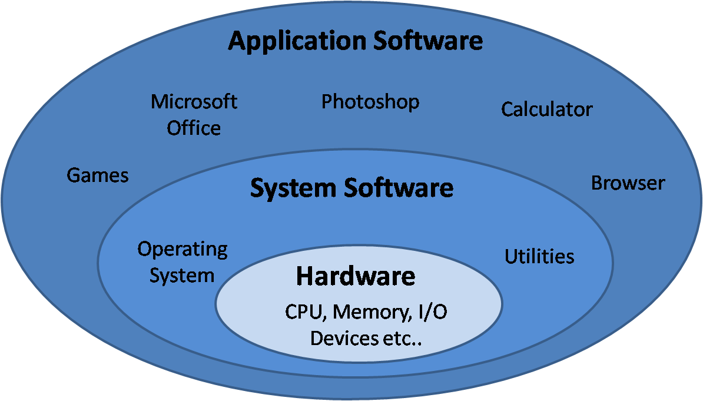
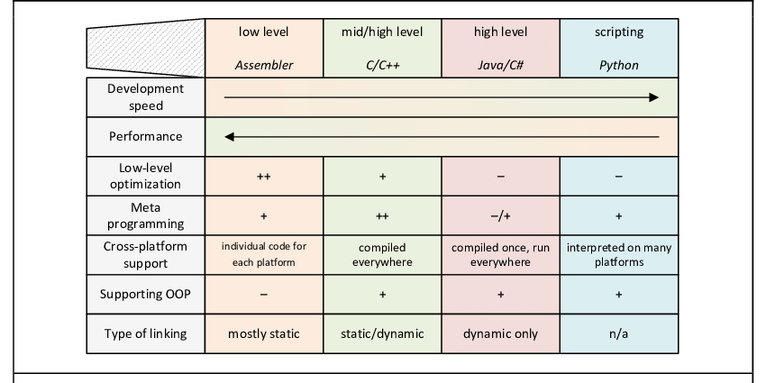
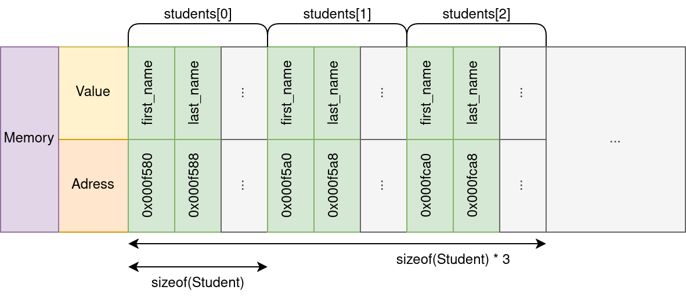

# C pour le calcul haute performance 面向高性能计算的 C 语言

<div class="mkdocs-only" markdown>
  <p align="right" markdown>
  [Download as slides 📥](slides/lecture2.pdf)
  </p>
</div>

## Pourquoi C, C++, Python ?
为何选择 C、C++、Python？

La programmation s'effectue à plusieurs niveaux d'abstraction par rapport au matériel.
编程相对于硬件存在多个抽象层次。

{ width=60% }

## Pourquoi C, C++, Python ?
为何选择 C、C++、Python？

- Les couches proches du matériel sont plus difficiles à programmer…
    - Mais elles offrent un contrôle et des performances maximales。
  越接近硬件的层次越难编程，
    - 但能获得最大的控制与性能。
- Les abstractions de haut niveau maximisent la productivité…
    - Mais elles introduisent des surcoûts et réduisent le contrôle sur la performance。
  高层抽象提高生产力，
    - 但带来显著开销，且对性能控制较少。

En pratique, nous combinons souvent plusieurs langages。
在实践中，我们常常组合使用多种语言。

  - C pour les sections critiques en performance, Python pour les API de plus haut niveau。
    性能关键部分用 C，较高层 API 用 Python。

## Pourquoi C, C++, Python ?
为何选择 C、C++、Python？

{ width=100% }

## Programmation C — Opérations et typage
C 语言编程——运算与类型

Le C est un langage impératif fortement typé：
C 是一种强类型的命令式语言：

```c
int main() {
  int a = 5;
  int b = 10;

  int c = a + b;
  float d = c / a;
  float e = (float)c / a;

  int f = a * a * a * a;

  return 0;
}
```

`main` est le point d'entrée du programme。
`main` 是程序入口点。

## Programmation C — Fonctions
C 语言编程——函数

```c
#include <stdio.h> // Pour printf(...)
// 用于 printf(...)

int sum_and_square(int a, int n) {
  int tmp = a + n;
  return tmp * tmp;
}

int main() {
  int a = 5;
  int b = 4;
  int c = sum_and_square(a, b);
  int d = sum_and_square(3, 9);

  // Afficher le résultat dans la console
  // 将结果打印到控制台
  printf("(5+4)**2: %d\n", c);
  printf("(3+9)**2: %d\n", d);
  return 0;
}
```

## Programmation C — Boucles
C 语言编程——循环

Implémentation en C de $\sum_{i=1}^{100}{i}$
C 实现 $\sum_{i=1}^{100}{i}$

```c
#include <stdio.h> // Pour printf(...)
// 用于 printf(...)

int sum_range(const int start, const int end) {
  int sum = 0;
  // Considérer start = 0 ; end = 100
  // Pour i démarrant à 0 ; tant que i <= 100 ; incrémenter i de un
  // 设 start = 0；end = 100
  // i 从 0 开始；当 i <= 100；每次将 i 加 1
  for (int i = start; i <= end; i = i + 1) {
    sum += i;
  }
  return sum;
}

int main() {
  printf("Result: %d\n", sum_range(1, 100));
  return 0;
}
```
Une variable qualifiée `const` ne peut pas être modifiée. Cela peut permettre des optimisations lors de la compilation。
被 `const` 限定的变量不可修改，这可能使编译期间的优化成为可能。

 

## Programmation C — Conditions
C 语言编程——条件

Nombre de multiples de 3 dans $[0, 99]$ (c.-à-d. $i \mod 3 = 0$)
区间 $[0, 99]$ 内 3 的倍数个数（即 $i \mod 3 = 0$）
```c
void count_multiples_of_three() {
  unsigned int count = 0;
  // Pour i démarrant à 0 ; tant que i < 100 ; incrémenter i de un
  // i 从 0 开始；当 i < 100；每次将 i 加 1
  for (unsigned int i = 0; i < 100; i++) {
    // si i % 3 (reste de la division entière) est égal à 0
    // 如果 i % 3（整数除法的余数）等于 0
    if (i % 3 == 0) {
      count++;
    }
  }
  printf("Result: %d\n", count);
}
```

### Remarque {.example}
备注 {.example}

Ici, nous pourrions aussi écrire `for (unsigned int i = 0; i < 100; i += 3)`
此处也可写为 `for (unsigned int i = 0; i < 100; i += 3)`


## Programmation C — Pointeurs de base
C 语言编程——基础指针

```c
int a = 0;
int b = 5;

int* c = &a;
*c = *c + b;
printf("a: %d; b: %d; c: %d\n", a, b , *c);
```
`c` contient l'adresse de `a` ; ainsi `*c = *c + b` écrit dans `a` la somme de `a` et `b`。
`c` 保存了 `a` 的地址；因此 `*c = *c + b` 会把 `a` 与 `b` 的和写入 `a`。

| Adresse     | Valeur      | Variable |
|--|--|-|
| 0x004 | 0            | a        |
| 0x008 | 5            | b        |
| 0x00c | 0x004         | c        |
| ...          | ...          | ...      |


## Programmation C — Tableaux
C 语言编程——数组

```c
int main() {
  char morpion[9] = {'X', 'O',  '\0',
                     'O', 'X',  '\0',
                     'O', '\0', '\0'};
  morpion[8] = 'X'; // Le joueur a cliqué sur la case en bas à droite !
  // 玩家点击了右下角的格子！
}
```

{ width=90% }


## Programmation C — Structures
C 语言编程——结构体

Les structures sont des types composites définis par l'utilisateur：
结构体是用户自定义的复合类型：

```c
typedef struct {
  char* first_name;
  char* last_name;
  int age;
  float mean_grade;
  char gender;
} Student;
```

```c
Student e1 = {"Dupont", "Pierre", 22, 13, 'm'};
Student e2 = {"Major", "Major", 22, 13.5, 'a'};
Student e3 = {"Martin", "Evelynne", 24, 14, 'f'};

if (e1.mean_grade > 10) {
  printf("(%s %s) is a pretty good student !\n", 
         e1.first_name, e1.last_name);
}
```

Le C n'a pas de notions de `classe`, `objet` ou `méthode` ！
C 语言没有 `class`、`object` 或 `method` 的概念！


## Programmation C — Structures (2)
C 语言编程——结构体（2）

```c
void display_student(Student* s) {
  // s->age est équivalent à (*s).age
  // s->age 等价于 (*s).age
  printf("%s %s (%i): %f\n", s->first_name, 
                             s->last_name, s->age,
                             s->mean_grade);
}

// Nous pouvons avoir des tableaux de n'importe quel type !
// 我们可以拥有任意类型的数组！
Student students[3] = {{"Dupont", "Pierre", 22, 13, 'm'}, ...};
for (int i = 0; i < 3; i++)
  display_student(&students[i]);
```

{ width=75% }


## Programmation C — Échanger l'abstraction contre la performance
C 语言编程——以抽象换性能

### En C, nous devons gérer manuellement des concepts très bas niveau {.alert}
在 C 语言中我们必须手动处理非常底层的概念 {.alert}

- Nous nous soucions de la disposition des données, des adresses mémoire, des pointeurs, etc.
  我们需要关注数据布局、内存地址、指针等。
- Le langage ne fournit pas de listes chaînées, de tableaux dynamiques, de dictionnaires, etc.
  语言不提供链表、动态数组、字典等。
- Pas d'algorithmes de base comme le tri.
  没有诸如排序等基础算法。

### À l'inverse, nous pouvons {.example}
另一方面，我们可以 {.example}

- Disposer manuellement les données pour maximiser l'efficacité。
  手动布局数据以最大化效率。
- Supprimer les abstractions et surcoûts pour maximiser les performances。
  移除抽象与开销以最大化性能。
- Générer du code s'exécutant au plus près du matériel。
  生成尽可能贴近硬件运行的代码。
- Optimiser le programme pour le matériel cible。
  针对硬件优化程序。


## Programmation C — Échanger l'abstraction pour la performance (Exemple)
C 语言编程——以抽象换性能（示例）

Considérons les codes suivants en Python et en C：
请考虑下面的 Python 与 C 代码：

```Python
sum = 0
for i in range(ub):
  sum += i
print(sum)
```

```c
unsigned long long sum = 0;
for (unsigned int i = 0; i < ub; i++){
    sum += i;
}
printf("Sum of first %llu integers is: %llu\n", ub, sum);
```

Ici, ub est un très grand nombre (100 millions dans cet exemple)。
其中，ub 是一个非常大的数（本例为 1 亿）。
Laquelle est la plus rapide, et de combien ?
哪个更快？快多少？


## Programmation C — Échanger l'abstraction pour la performance (Exemple)
C 语言编程——以抽象换性能（示例）

Résultats：
结果：

- Version `C`：0.024s
  `C` 版本：0.024s
- Version `Python`：5.650s
  `Python` 版本：5.650s

Cela représente une accélération de $\times 235$。
这相当于 $\times 235$ 的加速比。

Nous verrons plus tard dans ce cours comment cela est possible。
本课程后续将解释为何能达到这样的差距。


### Numpy et autres bibliothèques {.alert}
Numpy 与其他库 {.alert}

Notez que nous pourrions utiliser `numpy` ou la fonction Python `sum`：mais celles-ci sont en réalité implémentées en `C`！
需要注意的是，我们也可以使用 `numpy` 或 Python 的 `sum` 函数；但这些其实都是用 `C` 实现的！


# Gestion de la mémoire
内存管理

## Gestion de la mémoire — Concept
内存管理——概念

### Dans les langages de haut niveau {.alert}
在高级语言中 {.alert}

- Nous manipulons des structures de données abstraites (listes, dictionnaires, etc.).
  我们操作抽象的数据结构（列表、字典等）。
- La mémoire est gérée automatiquement (allocation, redimensionnement, libération).
  内存由系统自动管理（分配、扩容、释放）。
- On ne s'occupe pas de l'alignement mémoire, pile vs. tas, taille des pages, effets NUMA, etc.
  我们无需关心内存对齐、栈与堆、页大小、NUMA 影响等。

### En C {.example}
在 C 语言中 {.example}

- Nous travaillons directement avec des données primitives et de la mémoire brute。
  我们直接与原始数据与裸内存打交道。
- Nous sommes responsables de l'allocation, de la disposition et du nettoyage。
  我们负责内存的分配、布局与释放清理。
- Nous ne pouvons demander que des blocs de mémoire brute, à remplir comme nous le souhaitons。
  我们只能申请一块原始内存，并按需自行填充。
- Ceci est critique pour la performance。
  这是性能的关键。

Ce contrôle bas niveau est essentiel pour la performance；nous devons donc comprendre le fonctionnement de la mémoire en profondeur！
这种底层控制对性能至关重要；因此我们必须理解内存的底层机制！


## Gestion de la mémoire — Types de mémoire
内存管理——内存类型

Nous pouvons distinguer deux types de mémoire。
我们可以区分两类内存。

- Mémoire automatiquement allouée par le compilateur sur **la pile (stack)**。
  自动由编译器在**栈（stack）**上分配的内存。
    - Stocke des variables, des arguments de fonctions, etc.
      存放变量、函数参数等。
    - Rapide mais de taille limitée。
      速度快但容量有限。
- Mémoire allouée dynamiquement (manuellement) sur **le tas (heap)**。
  由开发者在**堆（heap）**上手动动态分配的内存。
    - Doit être allouée et libérée par le développeur！
      必须由开发者手动分配与释放！

Le noyau (Linux / Windows) alloue des **pages mémoire** et opère à un niveau grossier。  
内核（Linux / Windows）以较粗粒度分配**内存页**。  
La bibliothèque standard (`libc`) manipule ces pages à plus fine échelle et fournit la mémoire à l'utilisateur。
标准库（`libc`）以更细粒度管理页面并向用户提供内存。


## Gestion de la mémoire — Allocation
内存管理——分配

```c
#include <time.h> // pour time
// 用于 time
#include <stdlib.h> // pour malloc, srand, rand
// 用于 malloc、srand、rand

int do_the_thing(int n) {
  // Nous allouons n nombres
  // 我们分配 n 个数
  float* numbers = malloc(sizeof(float) * n);

  // Initialiser la graine du générateur aléatoire
  // 为随机数生成器设置种子
  srand(time(NULL));

  // Nous générons n nombres aléatoires
  // 生成 n 个随机数
  for (int i = 0; i < n; i++) {
    numbers[i] = (float) rand() / RAND_MAX; // Générer un nombre dans [0, 1]
    // 生成位于 [0, 1] 的数
  }
  ... // Faire ici un traitement complexe
  // 在此执行较复杂的处理
  free(numbers); // Rendre la mémoire au noyau
  // 将内存归还给内核
  return 0;
}
```


## Gestion de la mémoire — Allocation
内存管理——分配

{ height=75% }

**`malloc` renvoie un pointeur vers le début de la zone mémoire allouée**
**`malloc` 返回指向已分配内存区域起始位置的指针**


## Gestion de la mémoire — Désallocation
内存管理——释放

La mémoire n'est pas infinie！ 
内存不是无限的！

En Python (et Java, C#, etc.)；la mémoire est gérée par le ramasse-miettes (GC)：
在 Python（以及 Java、C# 等）中，内存由垃圾回收器（GC）管理：

- Le runtime suit toutes les allocations mémoire et toutes les références。
  运行时会跟踪所有内存分配及其引用。
- Lorsqu'un bloc mémoire n'est plus référencé par le programme, le GC rend la mémoire au noyau。
  当某块内存不再被程序引用时，GC 会将其归还给内核。

En C/C++，**l'utilisateur doit désallouer la mémoire** via `free(ptr)`。
在 C/C++ 中，**用户必须显式释放内存**，使用 `free(ptr)`。

### Fuite de mémoire {.alert}
内存泄漏 {.alert}

Si la mémoire n'est pas libérée（fuite mémoire），la machine peut耗尽内存：
如果内存未释放（内存泄漏），计算机会耗尽内存：

- Le noyau peut tuer le programme。
  内核可能会终止程序。
- Le système d'exploitation peut planter。
  操作系统可能崩溃。
- D'autres applications demandant de la mémoire peuvent planter ou échouer。
  其他申请内存的应用可能崩溃或失败。


## Mémoire virtuelle et physique — Problématique
虚拟内存与物理内存——问题

- Comment le noyau peut-il garantir que la mémoire est toujours contiguë？
  内核如何保证内存始终是连续的？
- Puis-je accéder à la mémoire d'un autre programme et voler ses données？
  我能否访问其他程序的内存并窃取其数据？
- Comment plusieurs applications peuvent-elles partager la même mémoire？
  多个应用如何共享同一片内存？
  - Certaines variables ont des adresses codées en dur！
    有些变量有硬编码地址！
- Comment gérer la fragmentation (interne/externe)（空洞）？ 
  如何处理（内部/外部）碎片（空洞）？


## Mémoire virtuelle et physique — Concept
虚拟内存与物理内存——概念

Nous séparons les **adresses physiques**（emplacements en mémoire）des **adresses virtuelles**（emplacements logiques）vues par chaque programme！
我们将每个程序所见的**虚拟地址**（逻辑位置）与**物理地址**（内存中的真实位置）相分离！

- La mémoire physique est divisée en **blocs de taille fixe** appelés **pages**（typiquement ~4KB）。
  物理内存被划分为固定大小的**页面（page）**（通常约 4KB）。
- Le CPU inclut une **MMU**（Memory Management Unit）qui traduit les adresses virtuelles en adresses physiques。
  CPU 内含**内存管理单元 MMU**，负责将虚拟地址翻译为物理地址。
- Chaque programme dispose de son propre espace d'adressage virtuel isolé。
  每个程序拥有其独立的虚拟地址空间。
- Le noyau maintient une **table des pages** pour chaque programme, indiquant à la MMU comment traduire les adresses。
  内核为每个程序维护**页表**，告知 MMU 如何进行地址转换。

## L'illusion de la contiguïté
连续性的错觉
Chaque processus croit accéder à un grand bloc de mémoire contigu；alors qu'en réalité il peut être physiquement fragmenté ou partagé。
每个进程都“以为”自己拥有一大片连续内存；但物理上可能是碎片化的或被共享的。


## Mémoire virtuelle et physique — Schéma
虚拟与物理内存——示意图

{ width=80% }

\***Notez qu'il s'agit d'une représentation simplifiée**.
\***请注意：这是一种简化示意图**。


## Hiérarchie mémoire
内存层次结构

De quelle mémoire parlons-nous？
我们在谈哪一种内存？

{ width=100% }

Notez que les GPU disposent également de leur propre mémoire dédiée！
请注意：GPU 也有其独立的专用内存！


## Hiérarchie mémoire
内存层次结构

* Les calculs CPU sont extrêmement rapides, et l'accès mémoire peut devenir un goulot d'étranglement。
  - Les registres ont la latence la plus faible。
    寄存器延迟最低。
  - Les caches CPU（L1, L2, L3）servent de tampons rapides pour la mémoire。
    CPU 缓存（L1、L2、L3）充当内存的高速缓冲。
* La DRAM（mémoire principale）est bien plus lente, mais moins coûteuse et plus grande。
  - L'accès à la DRAM induit des délais significatifs comparé au cache。
    相比缓存，访问 DRAM 会引入明显延迟。

Pour obtenir de hautes performances, nous devons maximiser la réutilisation des données dans les registres ou les caches, et minimiser les accès à la DRAM。
要实现高性能，需最大化寄存器/缓存中的数据复用，并尽量减少对 DRAM 的访问。


## Caches CPU
CPU 缓存

La plupart des CPU possèdent 3 niveaux de cache。
多数 CPU 具有三级缓存。

- L1d — Premier niveau de cache（très rapide）
  L1d——一级缓存（非常快）
- L2 — Deuxième niveau de cache（rapide）
  L2——二级缓存（较快）
- L3（Last Level Cache, LLC）— Plus grand mais plus lent que L1/L2
  L3（末级缓存，LLC）——容量更大但比 L1/L2 更慢

Certains niveaux de cache sont par cœur（L1, souvent L2），tandis que d'autres sont partagés entre plusieurs cœurs（L3）。
某些缓存级别按核心独享（L1，通常 L2），另一些在多核间共享（L3）。

### Cache d'instructions {.alert}
指令缓存 {.alert}

Les instructions d'assemblage sont stockées dans un cache d'instructions séparé (L1i)。
汇编指令存储在独立的（L1i）指令缓存中。


## Caches CPU
CPU 缓存

{ width=95% }

On parle de **hiérarchie mémoire hétérogène**：les mêmes accès mémoire peuvent avoir des latences différentes selon l'emplacement des données！
我们称之为**异构内存层次**：相同的内存访问会因数据所在位置不同而具有不同的延迟！


[**Exemple en direct：LSTOPO**]
【现场示例：LSTOPO】


## Caches CPU — En pratique
CPU 缓存——实践

```c
for (int i = 0; i < n; i++) {
  T[i] = A[i] * B[i];
}
```

1. Le contrôleur de cache recherche les données dans les caches CPU (L1 → L2 → L3)。
  缓存控制器在 CPU 缓存（L1 → L2 → L3）中查找数据。
2. Si présentes, les données sont envoyées aux registres pour l'ALU。
  若命中，数据被送入寄存器供算术逻辑单元（ALU）使用。
3. Sinon, une requête mémoire est émise。
  否则，发出一次内存请求。
  - Cela introduit de la latence et une bulle dans le pipeline du CPU。
    这会引入延迟并在 CPU 流水线中产生气泡。
4. Quand la requête mémoire est satisfaite, l'exécution reprend。
  当内存请求完成后，执行继续。
5. Le résultat de $a*b$ est écrit dans le cache, puis sera recopié plus tard vers la mémoire principale。
  $a*b$ 的结果首先写回缓存，随后再写回主存。


## Caches CPU — En pratique
CPU 缓存——实践

En pratique：
在实践中：

- Le CPU récupère une **ligne de cache** entière（souvent 64 octets）en une fois（si float：$64\text{B} / 4\text{B} = 16$ valeurs）。 
  CPU 每次抓取一整条**缓存行**（通常 64 字节）（若为 float：$64\text{B} / 4\text{B} = 16$ 个值）。
- Le CPU peut **pré-extraire (prefetch)** les données：il apprend les schémas d'accès et anticipe les futurs accès。
  CPU 能进行**预取（prefetch）**：学习访问模式并提前取数。
- Le CPU peut exécuter **hors ordre (out-of-order)**：在内存请求未完成时执行彼此独立的指令。
  CPU 可**乱序执行（out-of-order）**：在内存请求进行期间先执行独立指令。


## Caches CPU — Accès à pas (stridé)
CPU 缓存——跨步（strided）访问

Considérons deux implémentations NBody 3D：
考虑两种三维 NBody 的实现方式：

**Array Of Structures (AoS)**
**结构体数组（AoS）**

```c
// Nous allouons N triplets de positions (x, y, z)
// 我们为 (x, y, z) 位置分配 N 个三元组
float* positions = malloc(sizeof(float) * N * 3);
```

**Structure Of Arrays (SoA)**
**数组的结构（SoA）**

```c
// Nous allouons des tableaux séparés pour chaque composante
// 为每个分量分别分配数组
float* x = malloc(sizeof(float) * N);
float* y = malloc(sizeof(float) * N);
float* z = malloc(sizeof(float) * N);
```


## Caches CPU — Accès à pas (stridé)
CPU 缓存——跨步（strided）访问

Nous voulons enregistrer le nombre de particules telles que $x \leq 0.5$。
我们希望统计满足 $x \leq 0.5$ 的粒子数量。


**Array Of Structures (AoS)**
**结构体数组（AoS）**

```c
for (int i = 0; i < N; i += 3)
  if (positions[i] < 0.5)
    count++;
```

**Structure Of Arrays (SoA)**
**数组的结构（SoA）**

```c
for (int i = 0; i < N; i++)
  if (x[i] < 0.5)
    count++;
```

Laquelle est la plus rapide, et pourquoi？
哪一种更快？为什么？

Quel schéma d'accès exploite le mieux les lignes de cache？
哪种访问模式能更好地利用缓存行？


## Caches CPU — Accès à pas (stridé)
CPU 缓存——跨步（strided）访问

Résultats `perf` cumulés sur 100 exécutions：
`perf` 工具在 100 次运行中的累计结果：

|  | Temps  | # Instr | # L1 Loads   | # L1 Miss  | # LLC Loads | # LLC Miss |
|--------|--------|---------------|--------------|------------|-------------|------------|
| AoS    | ~1.93s  | ~14 Billion   | ~3.5 Billion | ~1 Million | ~400k       | ~382k      |
| SoA    | ~1.75s | ~14 Billion   | ~3.5 Billion | ~300k      | ~24k        | ~15k       |

|  | # Références cache (LLC) | # Cache miss |
|--------|------------------------|--------------|
| AoS    | ~158 Million           | ~151 Million |
| SoA    | ~52 Million            | ~35 Million  |

Avec AoS, davantage de chargements échouent en L1, entraînant des accès au LLC。
在 AoS 中，更多加载在 L1 失败，导致访问 LLC。

La plupart des chargements LLC aboutissent encore à des ratés, conduisant à des accès DRAM。
多数 LLC 加载仍会未命中，从而落到 DRAM 访问。


# Compilation et assemblage
编译与汇编

## Compilation et assemblage — Introduction
编译与汇编——引言

Le C est un langage compilé：nous devons traduire le code source en assembleur pour le CPU。
C 是一种编译型语言：我们需要将源代码翻译为 CPU 的汇编指令。

`gcc ./main.c -o main (<flags>)`

- Python est interprété。
  - Plus flexible mais **nettement plus lent**。
  Python 是解释执行的。
  - 更灵活但**显著更慢**。
- C# et Java sont compilés en bytecode intermédiaire puis exécutés via une machine virtuelle（ou JIT）。
  - Un compromis entre performance et productivité。
  C# 与 Java 先编译为中间字节码，再由虚拟机执行（或 JIT）。
  - 在性能与生产力之间取得平衡。
- C/C++/Rust sont compilés en code assembleur。
  - Faible portabilité, mais pas d'intermédiaire。
  C/C++/Rust 直接编译为汇编代码。
  - 可移植性较差，但无中间层。


## Compilation et assemblage — Boucle simple
编译与汇编——简单循环

```c
int sum = 0;
for (int i = 0; i < 100000; i++){
  sum += i;
}
```

```asm
main:
.LFB6:
  pushq	%rbp                 // Nous enregistrons le pointeur de pile
                             // 我们保存栈指针
	movq	%rsp, %rbp
  movl	$0, -4(%rbp)         // Initialiser sum
                             // 初始化 sum
  movl	$0, -8(%rbp)         // Initialiser i
                             // 初始化 i
	jmp	.L2
.L3:
  movl	-8(%rbp), %eax       // Charger i dans un registre
                             // 将 i 加载到寄存器
  addl	%eax, -4(%rbp)       // Ajouter i à sum（depuis la mémoire）
                             // 将 i 与 sum 相加（从内存）
  addl	$1, -8(%rbp)         // Incrémenter i de 1（depuis la mémoire）
                             // 将 i 加 1（从内存）
.L2:
  cmpl	$99999, -8(%rbp)     // Vérifier si i < 100 000
                             // 检查是否 i < 100000
  jle	.L3                      // Sauter si inférieur ou égal
                             // 小于等于则跳转
  movl	$0, %eax             // Définir la valeur de retour de main
                             // 设置 main 的返回值
	popq	%rbp
  ret                          // Retour de main
                                // 从 main 返回
```

`gcc ./main.c -o main -OO`


## Compilation et assemblage
编译与汇编

L'assembleur est ce qui se rapproche le plus du matériel, et il dépend de l'architecture：
汇编语言最接近硬件，并且与体系结构相关：

- Intel et AMD utilisent le jeu d'instructions x86。
  Intel 与 AMD 使用 x86 指令集。
- x86 possède de multiples extensions（FMA, SSE, AVX, AVX512, etc.）。
  x86 有多种扩展（FMA、SSE、AVX、AVX512 等）。
- Pour maximiser la performance, nous devrions compiler nos applications sur chaque plateforme。
  为了最大化性能，我们应在各自平台上进行编译。
  - Nos binaires ne sont pas portables。
    生成的二进制不可移植。
  - Mais nous pouvons utiliser des instructions dédiées。
    但可使用特定的指令扩展。
- D'autres jeux d'instructions existent（ARM, RISC‑V, etc.）。
  也存在其他指令集（ARM、RISC‑V 等）。


## Compilation et assemblage — Passes d'optimisation
编译与汇编——优化过程

Le compilateur n'est pas *qu'un* simple traducteur：
编译器不仅仅是“翻译器”：

- Il peut générer des instructions optimisées à partir du programme。
  它可以从程序生成优化后的指令。
- Les constantes peuvent être propagées, le code/valeurs inutilisés supprimés。
  常量可以传播，未使用的值/代码会被移除。
- Les opérations peuvent être réordonnées, inline, vectorisées via SIMD, etc.
  操作可重排、内联，并通过 SIMD 向量化等。
- Et bien d'autres optimisations。
  还有许多其他优化。

Ces optimisations sont activées via des options telles que `-O1`, `-O2`, `-O3`，qui correspondent à des ensembles prédéfinis de passes。
这些优化可通过 `-O1`、`-O2`、`-O3` 等选项启用，这些是预定义的优化集合。

L'option `-march=native` permet de cibler la machine courante et d'utiliser toutes les extensions assembleur disponibles。
`-march=native` 选项使编译器针对当前机器并使用所有可用的汇编扩展。


## Compilation et assemblage — Chaîne du compilateur
编译与汇编——编译器流水线

{ width=105% }

Il existe plusieurs compilateurs aux performances et fonctionnalités variées：
存在多种编译器，其性能与特性各不相同：

- GCC et Clang‑LLVM（classiques）。
  GCC 与 Clang‑LLVM（经典选择）。
- MSVC（Microsoft）, mingw‑LLVM, arm‑clang（pour ARM）et bien d'autres。
  MSVC（微软）、mingw‑LLVM、arm‑clang（用于 ARM）等。


## Bases de Makefile — Introduction
Makefile 基础——引言

**Make** est un outil de script pour automatiser des flux de compilation complexes。Il fonctionne en définissant des règles dans des **Makefiles**。
Make 是用于自动化复杂编译流程的脚本工具；它通过在 **Makefile** 中定义规则来工作。

```makefile
CC := gcc
CFLAGS := -g

main: main.c my_library.c my_library.h
  $(CC) -o $@ $^ $(CFLAGS)
```

- `main` est la cible（ce que nous voulons construire）。
  `main` 是目标（我们要构建的产物）。
- `main.c my_library.c my_library.h` sont les dépendances：la règle se relance si l'une change。
  `main.c my_library.c my_library.h` 是依赖项：任一变化会触发规则重建。
- `$(CC) -o $@ $< $(CFLAGS)` est la recette。
  `$(CC) -o $@ $< $(CFLAGS)` 是配方命令。
- `$@` s'étend au nom de la cible。
  `$@` 展开为目标名称。
- `$^` s'étend à toutes les dépendances。
  `$^` 展开为全部依赖。


## Bases de Makefile — Règles phony
Makefile 基础——伪目标规则

Make s'attend à ce qu'une règle `main` produise un fichier nommé `main`。Cependant, toutes les règles ne produisent pas de fichiers：
Make 期望规则 `main` 生成名为 `main` 的文件；但并非所有规则都会产出文件：

```makefile
.PHONY: all clean

all: main mylibrary

...

clean:
  rm -rf *.o
  rm -rf ./main
```

Ici, `make all` sera un alias pour tout construire, tandis que `make clean` est une règle personnalisée pour nettoyer les artefacts。
此处，`make all` 作为构建全部的别名，`make clean` 则用于清理构建产物的自定义规则。

Make 还有许多其他功能，不在本课程讨论范围内。


## Bases de Makefile — Utilisation
Makefile 基础——用法

Un projet typique ressemble à ceci：
典型项目结构示例：

```
Project/
  src/
    main.c
    my_library.c
  include/
    my_library.h
  Makefile # We define the Make rules here
```

`make` recherchera un fichier nommé `Makefile` ou `makefile` dans le répertoire courant（cwd）。
make 将在 cwd 中查找名为 Makefile 或 makefile 的文件。您可以直接调用 make all 、 make clean 等。


# Notions de base du parallélisme
并行基础

## Notions de base du parallélisme — Introduction
并行基础——引言

L'optimisation par le compilateur n'est qu'une facette du calcul haute performance。
编译器优化只是高性能计算的一面。

Rappelez-vous；nous avons vu dans `LSTOPO` que notre CPU possède de nombreux cœurs：
回想一下：在 `LSTOPO` 中我们看到 CPU 有许多核心：

- Chaque cœur peut effectuer des calculs indépendamment des autres。
  每个核心都可独立执行计算。
- Plusieurs processus（Google, VSCode, Firefox, Excel）peuvent s'exécuter **simultanément** sur des cœurs différents。
  多个进程（Google、VSCode、Firefox、Excel）可在不同核心上**同时**运行。
- Le noyau gère l'exécution via l'ordonnancement des threads et le time‑slicing。
  内核通过线程调度与时间片进行管理。

### Thread principal 主线程

Chaque processus possède au moins un « thread d'exécution » (thread of execution), qui est une séquence ordonnée d'instructions exécutées par le CPU。
每个进程至少有一个“执行线程”，即由 CPU 执行的一系列有序指令序列。


## Notions de base du parallélisme — Introduction
并行基础——引言

Et si nous pouvions découper nos programmes en plusieurs threads ?
如果我们能把程序拆分为多个线程会怎样？

- Avec 1 thread, un seul calcul se produit à la fois。
  只有 1 个线程时，一次只能进行一个计算。
- Avec 2 threads, nous pouvons potentiellement doubler le débit！
  若有 2 个线程，吞吐量有望翻倍！

En pratique, il existe un surcoût；nous devons gérer les dépendances entre instructions, ect.
实际中会有开销，还需处理指令间依赖等问题。


## Notions de base du parallélisme — Types de parallélisme
并行基础——并行类型

Nous considérons trois grands types de parallélisme：
我们主要考虑三种并行类型：

- Single Instruction Multiple Data（SIMD）: également appelée vectorisation。
  单指令多数据（SIMD）：也称为向量化
  - Une seule instruction opère simultanément sur plusieurs éléments de données。
    单条指令同时作用于多个数据元素。
- Mémoire partagée : plusieurs threads dans le même espace mémoire。
  共享内存：多个线程位于同一内存空间。
  - Les threads partagent un espace mémoire，communication/synchronisation rapides。
    线程共享内存空间，通信与同步开销较小。
- Mémoire distribuée : plusieurs processus。
  分布式内存：多个进程。
  - Les communications sont plus lentes, mais ce modèle permet de passer à l'échelle sur plusieurs machines。
  - 通信较慢，但可扩展到多机。

Dans ce cours, nous nous concentrerons sur SIMD et la mémoire partagée。
本课程仅聚焦 SIMD 与共享内存并行。


## Notions de base du parallélisme — Mémoire partagée
并行基础——共享内存

Considérons la boucle suivante：
考虑如下循环：

```c
int sum = 0;
for (int i = 0; i < 100; i++)
  sum += i;
```

Nous pouvons découper l'espace d'itération en plusieurs blocs：
我们可以将迭代空间切分成多个块：

{ width=100% }


## Notions de base du parallélisme — Mémoire partagée
并行基础——共享内存

Nous scindons le programme en plusieurs séquences d'instructions s'exécutant en parallèle。
我们将程序拆分为多条并行执行的指令序列。

- Chaque thread calcule une somme sur un sous-ensemble des données。
  每个线程在数据子集上进行求和。
- Nous synchronisons les threads et combinons les sommes partielles via une réduction globale。
  我们对各线程进行同步并通过全局归约合并部分和。

`OpenMP` est un outil HPC conçu pour ce type de scénario！
`OpenMP` 是为此类场景设计的 HPC 工具！

C'est une bibliothèque et un ensemble de passes de compilation simples à utiliser pour paralléliser des boucles triviales。
它是一种简单易用的库/编译器通道，可并行化简单循环。


## Notions de base du parallélisme — `OpenMP`
并行基础——`OpenMP`

```c
int sum = 0;

#pragma omp parallel for reduction(sum: +)
for (int i = 0; i < 100; i++)
  sum += i;
```
`gcc ./main.c -fopenmp -O3 -march=native`

Cette directive répartit automatiquement les itérations de boucle sur tous les cœurs CPU disponibles，
et effectue une réduction thread‑safe sur sum。
该指令会自动将循环迭代分配到所有可用 CPU 核心上，
并对 sum 执行线程安全的归约。


## Notions de base du parallélisme — Détails `OpenMP`
并行基础——`OpenMP` 细节

`OpenMP` définit un ensemble de « clauses » : des opérations suivies de modificateurs。
`OpenMP` 定义了一组 `clause`（子句），即操作及其修饰符。

- `#pragma omp` : début de toutes les clauses OpenMP。
  `#pragma omp`：所有 OpenMP 子句的起始。
- `parallel` : crée plusieurs threads。
  `parallel:` 启用多线程创建。
- `for` : active la découpe automatique de la boucle suivante。
  `for`：对后续循环进行自动切分。
- `reduction(sum: +)` : effectue une réduction sur sum avec l'opérateur `+`。
  `reduction(sum: +)`：对 sum 使用 `+` 运算进行归约。

Ce code suffit dans la plupart des cas；mais `OpenMP` permet des opérations nettement plus complexes。
此代码对大多数情形已足够；但 `OpenMP` 亦支持更复杂的操作。


## Notions de base du parallélisme — Exemple `OpenMP` avancé
并行基础——高级 `OpenMP` 示例

```c
float global_min = FLT_MAX;
int global_min_index = -1;
#pragma omp parallel
{
  float min_value = FLT_MAX;
  int min_index = -1;
#pragma omp for nowait schedule(dynamic)
  for (int i = 0; i < N; i++) {
    if (T[i] < min_value) {
      min_value = T[i];
      min_index = i;
    }
  }
#pragma omp critical
  {
    if (min_value < global_min) {
      global_min = min_value;
      global_min_index = min_index;
    }
  }
}
```


## NBody 3D naïf — Strong Scaling — Configuration
朴素 NBody 3D 强扩展——实验设置

Nous augmentons le nombre de threads tout en gardant la taille du travail constante。
我们在保持工作量不变的情况下增加线程数量。

`OMP_PLACES={0,2,4,6,8,10,12,14} OMP_PROC_BIND=True OMP_NUM_THREADS=8 ./nbody 10000`
`sudo cpupower frequency-set -g performance`

5 répétitions méta par exécution，13th Gen Intel(R) Core(TM) i7-13850HX @5.30 GHz，32KB/2MB/30MB：L1/L2/L3，15GB DDR5。
每轮 5 次元重复（Meta repetitions），13th Gen Intel(R) Core(TM) i7-13850HX @5.30 GHz，32KB/2MB/30MB：L1/L2/L3，15GB DDR5。

## NBody 3D naïf — Strong Scaling — Résultats 朴素 NBody 3D 强扩展——结果

{ width=80% }

L'accélération est limitée par les surcoûts d'exécution, la concurrence, la bande passante mémoire, la taille des données, etc.
加速比受运行时开销、并发度、内存带宽、数据规模等因素限制。
