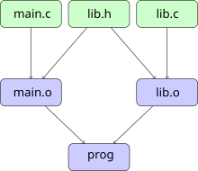
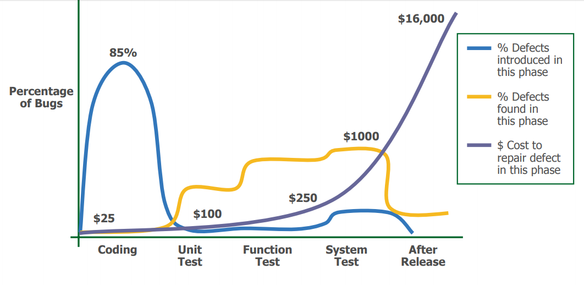
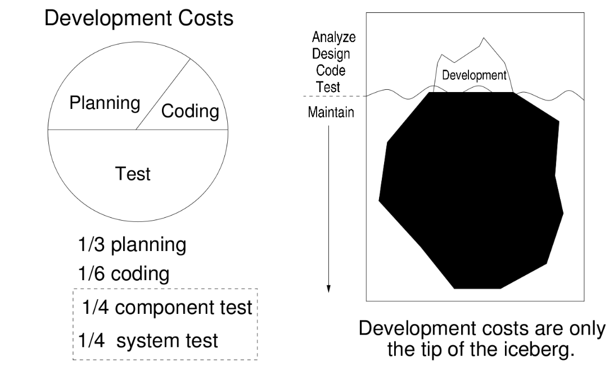
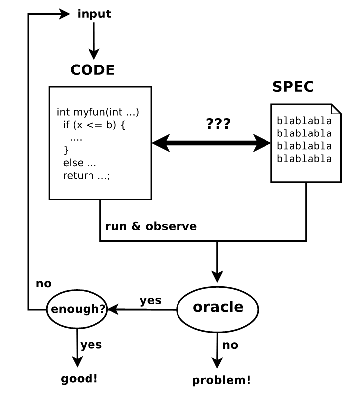

# Construction, tests et débogage de logiciels scientifiques
科学软件的构建、测试与调试

<div class="mkdocs-only" markdown>
  <p align="right" markdown>
  [Download as slides 📥](slides/lecture3.pdf)
  </p>
</div>

## Objectifs
课程目标

- Systèmes de construction : Makefiles avancés, introduction à CMake pour gérer des projets multi-fichiers et multi‑plateformes。
  构建系统：高级 Makefile，介绍 CMake 以管理多文件与多平台项目。
- Débogage : GDB, Valgrind pour détecter les erreurs et fuites mémoire。
  调试：GDB、Valgrind 用于检测内存错误与内存泄漏。
- Tests logiciels：
  软件测试：
    - Principes：tests unitaires, tests d'intégration。
      原则：单元测试、集成测试。
    - Cadres de tests en C（p. ex. Unity）。
      C 语言的测试框架（如 Unity）。
    - Importance des tests pour prévenir les régressions et assurer la validation。
      测试对于防止回归与结果验证的重要性。
- Documentation du code：Doxygen。
  代码文档：Doxygen。

# Makefiles
Makefile

## Gestion des dépendances
依赖管理

- Comment déterminer quels fichiers ont changé ?
  如何判断哪些文件发生了变更？



- **dépendances** : `main.o` dépend des modifications de `lib.h`
  依赖关系：`main.o` 依赖于 `lib.h` 的变更

## Makefile
Makefile 基础

- Un `Makefile` utilise un langage déclaratif pour décrire des cibles et leurs dépendances。
  `Makefile` 使用声明式语言来描述目标与其依赖。

- Il est exécuté par la commande `make`，qui permet de construire différentes **cibles**。
  它由 `make` 命令执行，可构建不同的目标。

    - `make` utilise les horodatages pour déterminer les fichiers modifiés。
      `make` 通过时间戳判断哪些文件被修改。

    - `make` évalue récursivement les règles pour satisfaire les dépendances。
      `make` 递归地解析规则以满足依赖关系。

## Règle Makefile
Makefile 规则

```Makefile
prog: main.c lib.c lib.h
  clang -o prog main.c lib.c -lm

target: dependencies
\t  command to build the target from the dependencies
```

## Separate Compilation

```Makefile
prog: main.o lib.o
  clang -o prog main.o lib.o -lm

main.o: main.c lib.h
  clang -c -o main.o main.c

lib.o: lib.c lib.h
  clang -c -o lib.o lib.c
```

Si `lib.c` est modifié, quelles commandes seront exécutées ?
如果 `lib.c` 被修改，将会执行哪些命令？

## Cibles phony
伪目标（Phony Targets）

Vous pouvez ajouter des cibles qui ne correspondent pas à un fichier produit。Par exemple, il est utile d'ajouter une cible `clean` pour nettoyer le projet。
可以添加不对应任何输出文件的目标。例如，添加 `clean` 目标用于清理项目非常有用。

```Makefile
clean:
  rm -f *.o prog
.PHONY: clean
```

`.PHONY` indique que la règle `clean` doit toujours être exécutée。声明所有伪目标可确保它们总会被调用（即便出现同名文件）。
`.PHONY` 指定 `clean` 规则应始终执行。将所有伪目标声明为 phony，确保它们被调用（即使出现同名文件）。

## Règle par défaut
默认规则

```bash
make clean
make prog
make
```

- Si `make` est appelé avec une règle，cette règle est construite。
  若 `make` 指定了规则，则构建该规则。
- Si `make` est appelé sans argument，la première règle est construite。Il est d'usage d'inclure une règle par défaut `all:` en première position。
  若 `make` 无参数调用，将构建第一个规则。通常会把默认的 `all:` 规则放在首位。

```Makefile
all: prog

prog: ...
```

## Variables
变量

```Makefile
CC=clang
CFLAGS=-O2
LDFLAGS=-lm

prog: main.o lib.o
  $(CC) -o prog main.o lib.o $(LDFLAGS)

main.o: main.c lib.h
  $(CC) $(CFLAGS) -c -o main.o main.c

lib.o: lib.c lib.h
  $(CC) $(CFLAGS) -c -o lib.o lib.c
```

Les variables peuvent être surchargées lors de l'appel à `make`，par ex.：
调用 `make` 时可以覆盖变量，例如：

```bash
make CC=gcc
```

## Variables spéciales
特殊变量

----  ------------------------
`$@`  nom de la cible
`$@`  目标名称
`$^`  toutes les dépendances
`$^`  所有依赖
`$<`  première dépendance
`$<`  第一项依赖
----  ------------------------

```Makefile
prog: main.o lib.o
  $(CC)  -o $@ $^ $(LDFLAGS)

main.o: main.c lib.h
  $(CC) $(CFLAGS) -c -o $@ $<

lib.o: lib.c lib.h
  $(CC) $(CFLAGS) -c -o $@ $< 
```

Les deux dernières règles sont très similaires…
最后两条规则非常相似……

## Règles implicites
隐式规则

### Avant
之前

```Makefile
main.o: main.c lib.h
  $(CC) $(CFLAGS) -c -o $@ $<

lib.o: lib.c lib.h
  $(CC) $(CFLAGS) -c -o $@ $< 
```

### Avec règle implicite
使用隐式规则

```Makefile
%.o: %.c
  $(CC) $(CFLAGS) -c -o $@ $<

main.o: lib.h
lib.o: lib.h
```

## Autres systèmes de construction
其他构建系统

- **automake / autoconf**：生成复杂 Makefile 并管理特定系统配置的自动化工具。
  **automake / autoconf**：自动生成复杂的 makefile，并管理与系统相关的配置。

- **cmake, scons**：Makefile 的后继者，提供更优雅的语法和新特性。
  **cmake, scons**：作为 Makefile 的后续方案，语法更优雅并带来新功能。

# CMake
CMake 构建系统

## Pourquoi CMake ?
为什么选择 CMake？

- **Avantages des Makefiles：**
    - Simplicité et transparence。
    - Aucun outil supplémentaire requis。
    - Contrôle direct sur le processus de compilation。
  Makefile 的优势：
    - 简单透明。
    - 无需额外工具。
    - 对构建过程具有直接控制。

- **Avantages de CMake：**
    - Multiplateforme（Linux、Windows、macOS）。
    - Génère des fichiers pour plusieurs systèmes de build（Make、Ninja etc.）.
    - Conception modulaire et orientée cibles。
    - Support intégré pour les tests、l'installation et le packaging。
  CMake 的优势：
    - 跨平台支持（Linux、Windows、macOS）。
    - 生成多种构建系统的文件（Make、Ninja 等）。
    - 模块化、以目标为中心的设计。
    - 内置测试、安装与打包支持。

## Conception générale de CMake
CMake 的总体设计

- **CMake en tant que méta‑système de build：**
    - Génère des fichiers de construction pour différents générateurs（如 Make、Ninja）。
    - Abstrait les détails spécifiques à la plateforme。
  作为元构建系统的 CMake：
    - 为不同生成器（如 Make、Ninja）生成构建文件。
    - 抽象平台相关细节。

- **Flux de travail：** 工作流：
  1. Écrire `CMakeLists.txt` pour définir le projet。编写 `CMakeLists.txt` 定义项目。
  2. Configurer le projet：配置项目：

       ```sh
       cmake -B build
       ```

   3. Construire le projet：构建项目：

       ```sh
       cmake --build build
       # or when using Make as backend
       make -C build
       ```

  Les **compilations hors source** sont recommandées pour garder les répertoires sources propres。
  建议使用**源外构建**以保持源目录整洁。

## Structure de base de `CMakeLists.txt`
`CMakeLists.txt` 的基本结构

```cmake
cmake_minimum_required(VERSION 3.15)
project(MyProject LANGUAGES C)

set(CMAKE_C_STANDARD 11)
```

- **`cmake_minimum_required`：** Spécifie la version minimale requise de CMake。
  指定所需的 CMake 最低版本。
- **`project`：** Définit le nom du projet et les langages utilisés。
  定义项目名称及使用的编程语言。
- **`set`：** Définit des variables（例如 C 标准版本）。
  设置变量，例如 C 语言标准版本。

## Ajouter un exécutable
添加可执行文件

```cmake
add_executable(my_executable src/main.c)
```

- Crée un exécutable nommé `my_executable`。
  创建名为 `my_executable` 的可执行文件。

## Ajouter une bibliothèque partagée
添加共享库

```cmake
add_library(my_library SHARED src/library.c)
```

- Crée une bibliothèque partagée nommée `libmy_library.so`（在 Linux 上）。
  创建共享库 `libmy_library.so`（Linux）。

## Lier des bibliothèques aux exécutables
为可执行文件链接库

```cmake
add_library(my_library SHARED src/library.c)
add_executable(my_executable src/main.c)
target_link_libraries(my_executable PRIVATE my_library)
```

- **`add_library`：** Crée une bibliothèque partagée。
  创建共享库。
- **`add_executable`：** Crée un exécutable。
  创建可执行文件。
- **`target_link_libraries`：** Lie la bibliothèque à l'exécutable。
  将库链接到可执行文件。

`PRIVATE` signifie que `my_executable` utilise `my_library`，mais que `my_library` n'a pas besoin d'être lié lorsque d'autres cibles lient `my_executable`。
`PRIVATE` 表示 `my_executable` 使用 `my_library`，但其他目标链接到 `my_executable` 时无需再链接 `my_library`。

## Transitivité des dépendances de bibliothèque
库依赖的传递性

```cmake
add_library(libA SHARED src/libA.c)
add_library(libB SHARED src/libB.c)
target_link_libraries(libB PUBLIC libA)
add_executable(my_executable src/main.c)
target_link_libraries(my_executable PRIVATE libB)
```

- `my_executable` est lié à `libB` et aussi à `libA` car `libB` lie `libA` avec `PUBLIC`。
  由于 `libB` 以 `PUBLIC` 链接 `libA`，`my_executable` 也会链接到 `libA`。
- Si `libB` liait `libA` avec `PRIVATE`，`my_executable` ne serait pas lié à `libA`。
  若使用 `PRIVATE`，`my_executable` 将不会链接到 `libA`。
- Si `libB` liait `libA` avec `INTERFACE`，`my_executable` serait lié à `libA` mais pas à `libB`。
  若使用 `INTERFACE`，`my_executable` 会链接到 `libA` 而不是 `libB`。
- Voir [cette référence](https://cmake.org/cmake/help/latest/command/target_link_libraries.html) pour plus de détails。
  详见参考链接。

## Répertoires d'inclusion globaux
全局包含目录

```cmake
include_directories(include)
```

- Ajoute le répertoire `include` de manière globale pour toutes les cibles。
  为所有目标全局添加 `include` 目录。
- **Limitation：** Peut entraîner des conflits dans les grands projets。
  限制：在大型项目中可能导致冲突。

## Répertoires d'inclusion spécifiques aux cibles
针对目标的包含目录

```cmake
target_include_directories(my_library
    PUBLIC include
)
```

- **PUBLIC：** 头文件目录在构建与使用库时都需要。
  构建与使用时均需。
- **PRIVATE：** 仅在构建该库时需要包含目录。
  仅构建时需要。
- **INTERFACE：** 仅在使用该库时需要包含目录。
  仅使用时需要。

## 将最小 Makefile 示例移植到 CMake
将最小 Makefile 示例移植到 CMake

```cmake
cmake_minimum_required(VERSION 3.15)
project(MyProject LANGUAGES C)

# Add the executable target
add_executable(prog main.c lib.c)

# Specify include directories for the target
target_include_directories(prog 
  PRIVATE ${CMAKE_CURRENT_SOURCE_DIR})

# Add compile options
target_compile_options(prog PRIVATE ${CFLAGS})

# Link libraries if needed
target_link_libraries(prog PRIVATE m)
```


```cmake
cmake_minimum_required(VERSION 3.15)
project(MyProject LANGUAGES C)

set(CMAKE_C_STANDARD 11)

# 所有目标定义
add_library(math_lib math.c)
add_library(utils_lib utils.c)
add_executable(my_app main.c)

# 所有属性设置
target_include_directories(math_lib PUBLIC include)
target_include_directories(my_app PRIVATE src)

# 编译选项
target_compile_options(my_app PRIVATE ${CFLAGS})

# 所有链接设置
target_link_libraries(utils_lib PUBLIC math_lib)
target_link_libraries(my_app PRIVATE utils_lib m)
```

## 构建类型：Debug 与 Release
构建类型：Debug 与 Release

- **构建类型 Debug：**
  - 包含用于调试的符号信息。
  - 典型标志：`-g`、`-O0`。

- **构建类型 Release：**
  - 针对性能进行优化。
  - 典型标志：`-O3`、`-DNDEBUG`。

## 在 CMake 中设置构建类型
在 CMake 中设置构建类型

```cmake
if(NOT CMAKE_BUILD_TYPE)
  set(CMAKE_BUILD_TYPE RelWithDebInfo CACHE STRING "Build type" FORCE)
endif()
```

- types de construction：`Debug`、`Release`、`RelWithDebInfo`、`MinSizeRel`。
  构建类型：`Debug`、`Release`、`RelWithDebInfo`、`MinSizeRel`。

    - CACHE：rend la variable persistante d'une exécution CMake à l'autre. Dans les compilations hors source, CMakeLists.txt n'est pas réévalué lors des exécutions suivantes.使变量在 CMake 多次运行间保持持久化；在源外构建中 `CMakeLists.txt` 在后续运行时不会被重新求值。
    - FORCE：Remplace toute valeur précédente.覆盖之前的任何值。
    - STRING： Le « type de compilation » fournit une description dans l'interface graphique CMake. “Build type” 在 CMake 图形界面中显示描述。

## Ajout d'indicateurs de compilation
添加编译器标志

```cmake
target_compile_options(my_library PRIVATE
    $<$<CONFIG:Debug>:-g -Wall>
    $<$<CONFIG:Release>:-O3 -DNDEBUG>
)
```

- **Expressions génératrices :** `$<CONFIG:Debug>` applique des options uniquement pour la configuration Debug。
  **生成器表达式：** `$<CONFIG:Debug>` 仅在 Debug 构建时应用对应标志。
  Les expressions génératrices permettent d'appliquer des options conditionnellement selon la configuration。
  生成器表达式：按配置条件应用。

## Installer des cibles 安装目标

```cmake

install(TARGETS <targets...>
    [RUNTIME DESTINATION <dir>]
    [LIBRARY DESTINATION <dir>]
    [ARCHIVE DESTINATION <dir>]
    [PUBLIC_HEADER DESTINATION <dir>]
)

install(TARGETS my_library
    LIBRARY DESTINATION lib
    PUBLIC_HEADER DESTINATION include
)
```

- Installe la bibliothèque partagée dans le répertoire `lib`。
  将共享库安装到 `lib` 目录。
- Installe les en-têtes publics dans le répertoire `include`。
  将公共头文件安装到 `include` 目录。

## Utiliser GNUInstallDirs 使用 GNUInstallDirs

```cmake
include(GNUInstallDirs)

install(TARGETS my_library
    LIBRARY DESTINATION ${CMAKE_INSTALL_LIBDIR}
    PUBLIC_HEADER DESTINATION ${CMAKE_INSTALL_INCLUDEDIR}
)
```

- Définit les chemins standard des répertoires de bibliothèques et d'en‑têtes GNU。 定义标准 GNU 库与头文件目录路径。

## Générer et construire le projet 生成与构建项目

1. **Configurer le projet :**
   配置项目：

   ```sh
   cmake -B build
   ```

  - Génère les fichiers de construction dans le répertoire `build`。
    在 `build` 目录生成构建文件。

2. **Construire le projet :** 构建项目：

  ```sh
  cmake --build build
  # ou si vous utilisez Make comme moteur
  # 或当使用 Make 作为后端时
  make -C build
  ```

3. **Exécuter le programme :**
3. 运行程序：

   ```sh
   ./build/my_executable
   ```

## Bonnes pratiques pour CMake
CMake 的最佳实践

- **Utiliser des commandes orientées cibles：**
    - Préférer `target_include_directories` à `include_directories`。
    - Préférer `target_link_libraries` au lien global。
  使用面向目标的命令：
    - 优先使用 `target_include_directories` 而不是 `include_directories`。
    - 优先使用 `target_link_libraries` 而不是全局链接。

- **Organiser `CMakeLists.txt`：**
    - Regrouper les cibles liées。
    - Utiliser des commentaires pour expliquer chaque部分。
  组织 `CMakeLists.txt`：
    - 将相关目标归组。
    - 使用注释解释各部分。

- **Exploiter les fonctionnalités modernes de CMake：**
    - Expressions génératrices pour配置条件化。
    - `FetchContent` 用于管理外部依赖。
  使用现代 CMake 特性：
    - 使用生成器表达式进行条件配置。
    - 使用 `FetchContent` 管理外部依赖。

# Outils de débogage 调试工具

## Exemple de programme bogué 有缺陷的程序示例

```c
/* Liste chaînée de n = 5 nœuds
   由 n = 5 个节点构成的链表
         .---------.    .---------.           .--------------.
         | val = 4 |    | val = 3 |           | val = 0      |
 head -> | next  --|--> | next  --|--> ... -> | next =  NULL |
         '---------'    '---------'           '--------------'
 */

#include <stdlib.h>
#include <assert.h>

struct Node
{
  int val;
  struct Node *next;
};

int main()
{
  int n = 5;

  struct Node *head = init_list(n);
  // ... do something with the list ...
  delete(head);

  return 0;
}
```

## Initialisation et suppression de la liste chaînée
链表的初始化与删除

```c
struct Node *init_list(int n)
{
  struct Node *head = NULL;
  for (int i = 0; i < n; ++i)
  {
    struct Node *p = malloc(sizeof *p);
    assert(p != NULL);
    p->val = i;
    p->next = head;
    head = p;
  }
  return head;
}

void delete(struct Node *head)
{
  while (head)
  {
    struct Node *next = head->next;
    free(head);
    head = head->next;
  }
}
```

## Exécuter le programme…
运行程序…

```bash
$ gcc -g -O0 -o buggy buggy.c
$ ./buggy
Segmentation fault (core dumped)
```

## GDB : GNU Debugger
GDB：GNU 调试器

- Inspecter l'état d'un programme au moment du crash。
  在程序崩溃时检查其状态。
- Exécuter pas à pas, ligne par ligne。
  逐行单步执行代码。
- Inspecter les variables et la mémoire。
  查看变量与内存。
- Définir des points d'arrêt pour suspendre l'exécution à des lignes précises。
  设置断点以在特定行暂停执行。

(Démonstration en direct)
（现场演示）

```bash
$ gdb ./buggy
Program received signal SIGSEGV, Segmentation fault.
0x000055555555522b in delete (head=0xa45d97b66d0683e8) at buggy.c:28
28          struct Node *next = head->next;
(gdb) x head
0xa45d97b66d0683e8:     Cannot access memory at address 0xa45d97b66d0683e8
```

## Valgrind : débogage mémoire et détection des fuites
Valgrind：内存调试与泄漏检测

- Détecte les fuites, les accès mémoire invalides et l'utilisation de mémoire non initialisée。
  检测内存泄漏、非法内存访问以及未初始化内存的使用。
- Exécute le code dans un bac à sable virtuel qui surveille chaque opération mémoire。
  在虚拟沙箱中运行代码，监控每一次内存操作。

(Démonstration en direct)
（现场演示）

```bash
$ valgrind --leak-check=full ./buggy
==537945== Invalid read of size 8
==537945==    at 0x109243: delete (buggy.c:30)
==537945==    by 0x109282: main (buggy.c:40)
==537945==  Address 0x4a94188 is 8 bytes inside a block of size 16 free'd
==537945==    at 0x484988F: free (in /usr/libexec/valgrind/vgpreload_memcheck-amd64-linux.so)
==537945==    by 0x10923E: delete (buggy.c:29)
==537945==    by 0x109282: main (buggy.c:40)
==537945==  Block was alloc'd at
==537945==    at 0x4846828: malloc (in /usr/libexec/valgrind/vgpreload_memcheck-amd64-linux.so)
==537945==    by 0x1091B2: init_list (buggy.c:15)
==537945==    by 0x109272: main (buggy.c:38)
```

## Autres outils : ASAN, UBSAN
其他工具：ASAN、UBSAN

- **AddressSanitizer (ASAN)：** Détecte les erreurs mémoire（如缓冲区溢出与 use-after-free）。
  AddressSanitizer（ASAN）：检测内存错误（如缓冲区溢出、释放后使用）。
- **UndefinedBehaviorSanitizer (UBSAN)：** Détecte les comportements indéfinis dans les programmes C/C++。
  UndefinedBehaviorSanitizer（UBSAN）：检测 C/C++ 程序中的未定义行为。
- Fonctionne avec les programmes multi‑threads et a une surcharge inférieure à Valgrind。
  适用于多线程程序，开销通常低于 Valgrind。

(Démonstration en direct)
（现场演示）
```bash
$ gcc -fsanitize=address -g -O0 -o buggy_asan buggy.c
$ ./buggy_asan
=================================================================
==538335==ERROR: AddressSanitizer: heap-use-after-free on address 0x502000000098 at pc 0x5bec7c7343e9 bp 0x7ffdf3015150 sp 0x7ffdf3015140
READ of size 8 at 0x502000000098 thread T0
    #0 0x5bec7c7343e8 in delete /home/poliveira/test-gdb/buggy.c:30
    #1 0x5bec7c73442c in main /home/poliveira/test-gdb/buggy.c:40
```

# Tests logiciels
软件测试

## Importance des tests logiciels
软件测试的重要性

- 1996: Ariane-5 self-destructed due to an unhandled floating-point exception, resulting in a \$500M loss.
- 1998: Mars Climate Orbiter lost due to navigation data expressed in imperial units, resulting in a \$327.6M loss.
- 1988-1994: FAA Advanced Automation System project abandoned due to management issues and overly ambitious specifications, resulting in a \$2.6B loss.
- 1985-1987: Therac-25 medical accelerator malfunctioned due to a thread concurrency issue, causing five deaths and numerous injuries.

## Dette technique
技术负债



## Coûts logiciels
软件成本



## Vérification et validation (V&V)
验证与确认（V&V）

- **Validation**：Le logiciel répond‑il aux besoins du client？  
  验证：软件是否满足客户需求？
    - « Construisons‑nous le bon produit ? »
      “我们是否在构建正确的产品？”

- **Vérification**：Le logiciel fonctionne‑t‑il correctement？  
  确认：软件是否正确地工作？
    - « Construisons‑nous le produit correctement ? »
      “我们是否以正确的方式构建产品？”

## Approches de vérification
验证方法

- Méthodes formelles
  形式化方法
- Modélisation et simulations
  建模与仿真
- Relectures de code
  代码走查/评审
- **Tests**
  测试

## Processus de test
测试流程



## Modèle en V
V 模型


## Différents types de tests
不同类型的测试

- **Tests unitaires：**
    - Tester des fonctions individuelles de manière isolée。
      对单个函数进行隔离测试。
    - Développement piloté par les tests（TDD）：viser un code可维护、简单、解耦。
      测试驱动开发（TDD）：强调可维护、简单、解耦的代码。

- **Tests d'intégration：**
    - Vérifier le comportement correct lors de l'assemblage des modules。
      当模块组合时验证正确行为。
    - Ne valider que la correction fonctionnelle。
      关注功能正确性。

- **Tests de validation：**
    - Vérifier la conformité au cahier des charges。
      测试是否符合规格说明。
    - Tester d'autres caractéristiques：性能、安全等。
      也可关注其他特性：性能、安全等。

- **Tests d'acceptation：**
    - Valider les exigences avec le client。
      与客户一起验证需求。

- **Tests de régression：**
    - S'assurer que les bogues corrigés ne réapparaissent pas。
      确保修复的缺陷不再复现。

## Tests en boîte noire et boîte blanche
黑盒与白盒测试

### Boîte noire（fonctionnelle）
黑盒测试（功能性）

- Les tests sont générés à partir des spécifications。
  基于规格说明生成测试。
- Utilise des hypothèses différentes de celles du programmeur。
  使用与程序员不同的假设。
- Indépendant de l'implémentation。
  与实现无关。
- Difficile de trouver certains défauts de programmation。
  难以发现某些编程缺陷。

### Boîte blanche（structurelle）
白盒测试（结构性）

- Les tests sont dérivés du code source。
  从源码导出测试。
- Vise une couverture maximale（分支全覆盖等）。
  旨在最大化覆盖率（如分支覆盖）。
- Difficile de détecter les omissions ou erreurs de spécification。
  不易发现遗漏或规格错误。

Les deux approches sont complémentaires。
两种方法相辅相成。

## Que tester ?
测试什么？

- Tester所有可能输入的代价过高。
  对所有可能输入进行测试代价过高。
- Choisir un sous‑ensemble d'entrées：
  选择一部分代表性输入：
    - Partitioner les entrées en classes d'équivalence pour maximiser la couverture。
      将输入划分为等价类以最大化覆盖率。
    - Tester toutes les branches de code。
      测试所有代码分支。
    - Tester les cas limites。
      测试边界情况。
    - Tester les cas invalides。
      测试无效输入。
    - Tester des combinaisons（设计实验）。
      测试多种组合（实验设计）。

## Exemple de partitionnement（1/3）
分区示例（1/3）

### Spécification
规格说明

```c
/* compare returns:
 *   0 if a is equal to b
 *   1 if a is strictly greater than b
 *  -1 if a is strictly less than b
 */
int compare (int a, int b);
```

Quelles entrées doivent être testées？
应测试哪些输入？

## Classes d'équivalence（2/3）
等价类（2/3）

| Variable | Possible Values            |
|----------|----------------------------|
| a        | {positive, negative, zero} |
| b        | {positive, negative, zero} |
| result   |                 {0, 1, -1} |

### Exemples de cas de test
测试用例示例

| a   | b   | result |
|-----|-----|--------|
| 10  | 10  | 0      |
| 20  | 5   | 1      |
| 3   | 7   | -1     |
| -30 | -30 | 0      |
| -5  | -10 | 1      |
| ... | ... | ...    |

Il est possible de sélectionner un sous‑ensemble de classes！
可以只选择其中一部分等价类！

## Tests de frontières（3/3）
边界测试（3/3）

|a          | b  | result
|-----------|----|-------
|-2147483648|-1  | -1

## Discussion
讨论

- Génération automatique de tests。
  自动生成测试。
- Calcul de la couverture de test。
  计算测试覆盖率。
- Tests de mutation。
  变异测试。
- Fuzzing。
  模糊测试（Fuzzing）。
- Importance d'outils d'automatisation des tests。
  使用自动化测试工具的重要性。
- Importance de l'intégration continue（CI）。
  使用持续集成工具的重要性。


# Cadre de tests Unity
Unity 测试框架

## Introduction à Unity
Unity 简介

  

  [Cadre de tests Unity](http://www.throwtheswitch.org/unity)

  - Cadre de tests unitaire léger et simple pour le C。
    面向 C 语言的轻量级、简单的单元测试框架。
  - Conçu pour l'embarqué mais utilisable dans tout projet C。
    最初为嵌入式设计，但适用于任何 C 项目。
  - Fournit des macros et fonctions pour définir et exécuter des tests。
    提供一组宏与函数以定义并运行测试。
  

## Mise en place de Unity 
配置 Unity

- Séparer les tests Unity dans un répertoire dédié，如 `tests/`。
  将 Unity 测试放在单独目录，例如 `tests/`。

- Inclure l'en‑tête Unity dans vos fichiers de test：
  在测试文件中包含 Unity 的头文件：

  ```c
  #include "unity.h"
  ```

- Nécessite un lien avec la bibliothèque Unity。
  需要链接 Unity 库。
- Nous lierons une bibliothèque statique `libunity.a`；puisque Unity utilise CMake, nous emploierons FetchContent pour l'ajouter au projet。
  我们将链接静态库 `libunity.a`；鉴于 Unity 使用 CMake，我们将用 FetchContent 将其引入项目。

## Écriture des tests
编写测试

- Les fonctions de test utilisent les macros `TEST` de Unity pour vérifier des conditions。
  测试函数使用 Unity 提供的 `TEST` 宏进行断言。

  ```c
  void test_function_name(void) {
      ...
      TEST_ASSERT_EQUAL_INT(expected, actual);
      TEST_ASSERT_NOT_NULL(pointer);
      TEST_ASSERT_TRUE(condition);
      ... 
  }
  ```

- Référence pour toutes les assertions： [Unity Assertions](https://github.com/ThrowTheSwitch/Unity/blob/master/docs/UnityAssertionsReference.md)

## Example: testing our linked list

```c
#include "unity.h"
#include "buggy.h"
void test_delete_single_node(void) {
    struct Node *head = init_list(1); 
    TEST_ASSERT_NOT_NULL(head); // head should not be NULL
    TEST_ASSERT_EQUAL_INT(0, head->val); // head should be 0
    delete(head); // should not crash
    TEST_ASSERT_NULL(head); // head should be NULL after deletion
}
void test_delete_multiple_nodes(void) {
    struct Node *head = init_list(5);
    TEST_ASSERT_EQUAL_INT(4, head->val); // head should be 4
    TEST_ASSERT_EQUAL_INT(3, head->next->val); 
    delete(head); // should not crash
    TEST_ASSERT_NULL(head); // head should be NULL after deletion
}
```

## Exécuter les tests
运行测试

- Créer une fonction « test runner » pour exécuter tous les tests：
  创建一个测试运行器函数来执行所有测试：

  ```c
  int main(void) ## Boundary Tests{
      UNITY_BEGIN();
      RUN_TEST(test_function_name);
      ...
      return UNITY_END();
  }
  ```

## SetUp et TearDown
SetUp 与 TearDown

- Les fonctions SetUp et TearDown s'exécutent avant et après chaque test。
  SetUp 与 TearDown 分别在每个测试之前与之后执行。

  ```c
  void setUp(void) {
  // Code exécuté avant chaque test
  // 在每个测试前运行的代码
  }

  void tearDown(void) {
  // Code exécuté après chaque test
  // 在每个测试后运行的代码
  }
  ```

## Couverture de code avec tests unitaires
使用单元测试进行代码覆盖率统计

- Utiliser `gcov` ou `llvm-cov` pour mesurer la couverture。
  使用 `gcov` 或 `llvm-cov` 统计覆盖率。
- Compiler avec les options de couverture：
  使用覆盖率编译选项进行编译：

  ```sh
  gcc --coverage -g -O0 -o test_runner test_runner.c my_code.c -lunity
  ```

- gcov 插桩基本块以记录测试期间执行情况。
  gcov 对代码基本块插桩以记录测试执行路径。

- gcovr 生成 HTML 报告，展示哪些代码被测试覆盖。
  gcovr 生成覆盖率报告（HTML）。

## Documentation avec Doxygen
使用 Doxygen 生成文档
- Doxygen est un générateur de documentation pour C、C++ 及其他语言。
  Doxygen 是用于 C、C++ 等语言的文档生成器。
- Il extrait les commentaires du code source et génère de la documentation（HTML、LaTeX 等）。
  它从源码注释中提取信息并生成文档（HTML、LaTeX 等）。
- Utiliser des blocs de commentaires spéciaux pour说明函数、参数、返回值等。
  使用特殊注释块来描述函数、参数、返回值等。
- Exemple de fonction documentée：
  文档化函数示例：

```c
/**
 * @brief Initializes a linked list with n nodes.
 * @param n Number of nodes to create.
 * @return Pointer to the head of the linked list
 * @return NULL if memory allocation fails.
 */
struct Node *init_list(int n);
```

- Générer la documentation avec la commande `doxygen` et un fichier de configuration（`Doxyfile`）。
  使用 `doxygen` 命令与配置文件（`Doxyfile`）生成文档。

## Crédits et bibliographie
致谢与参考资料

- Cours « Automated Software Testing »，Sébastien Bardin。
  课程 “Automated Software Testing”，Sébastien Bardin。
- [Tutoriel CMake](https://cmake.org/cmake/help/latest/guide/tutorial/index.html)
  [CMake 教程](https://cmake.org/cmake/help/latest/guide/tutorial/index.html)
- [Bonnes pratiques CMake](https://cliutils.gitlab.io/modern-cmake/)
  [CMake 最佳实践](https://cliutils.gitlab.io/modern-cmake/)
- [Cadre de tests Unity](http://www.throwtheswitch.org/unity)
  [Unity 测试框架](http://www.throwtheswitch.org/unity)
- [Valgrind](http://valgrind.org/)
- [GDB](https://www.gnu.org/software/gdb/)
- [ASAN/UBSAN](https://clang.llvm.org/docs/AddressSanitizer.html)
- [Doxygen](https://www.doxygen.nl/index.html)
