# Conception expérimentale, profilage et optimisation performance/énergie
实验设计、性能分析与性能/能耗优化

<div class="mkdocs-only" markdown>
  <p align="right" markdown>
  [Download as slides 📥](slides/lecture4.pdf)
  </p>
</div>


## Exemple de tracé — Introduction
绘图示例——引言

Dans les diapositives suivantes, vous verrez une série de graphiques，principalement tirés des rapports de cours PPN d'anciens étudiants。
接下来的幻灯片将展示一系列图表，主要来自往届学生的 PPN 课程报告。


Pour chaque figure：
对于每个图：

- Essayez de comprendre ce qui est représenté。
  先理解图表所表达的内容。
- Expliquez ce que vous observez。
  说明你的观察。
- Donnez une conclusion **définitive** à partir des données montrées。
  基于图中数据给出一个**明确**结论。

Levez la main lorsque vous êtes prêt à proposer une explication。
当你准备好给出解释时请举手。

## Exemple de tracé (1)
绘图示例（1）

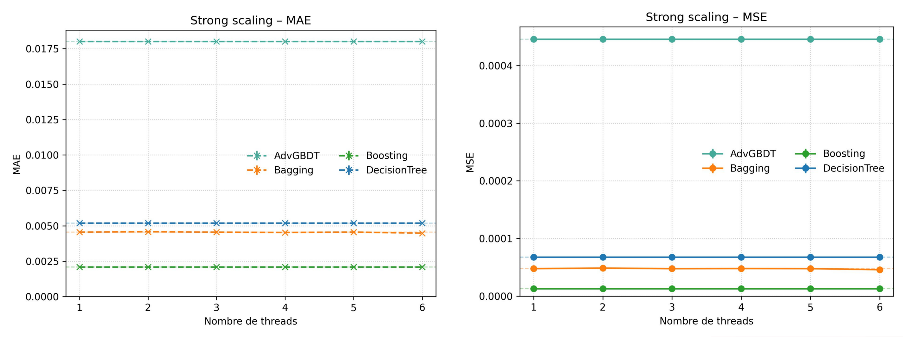{ width=100% }

<div class="mkdocs-only" markdown>
  **PPN Example** - (No Caption)
</div>

## Exemple de tracé (2) 绘图示例（2）

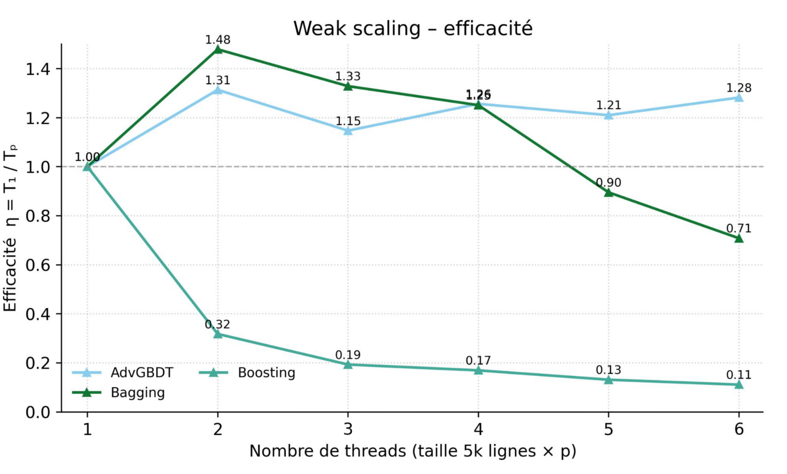{ width=80% }

<div class="mkdocs-only" markdown>
  **PPN Example** - (No Caption)
</div>


## Exemple de tracé (3)
绘图示例（3）

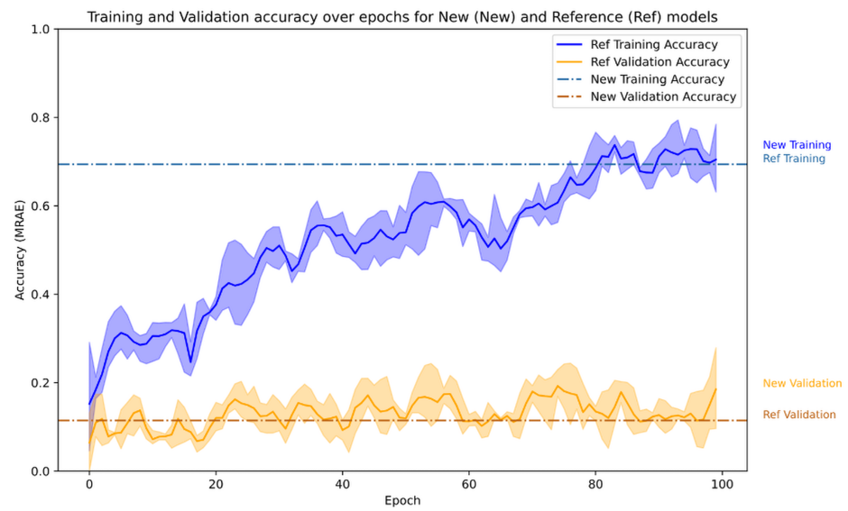{ width=100% }

<div class="mkdocs-only" markdown>
  **PPN Example** - (No Caption)
</div>


## Exemple de tracé (4)
绘图示例（4）

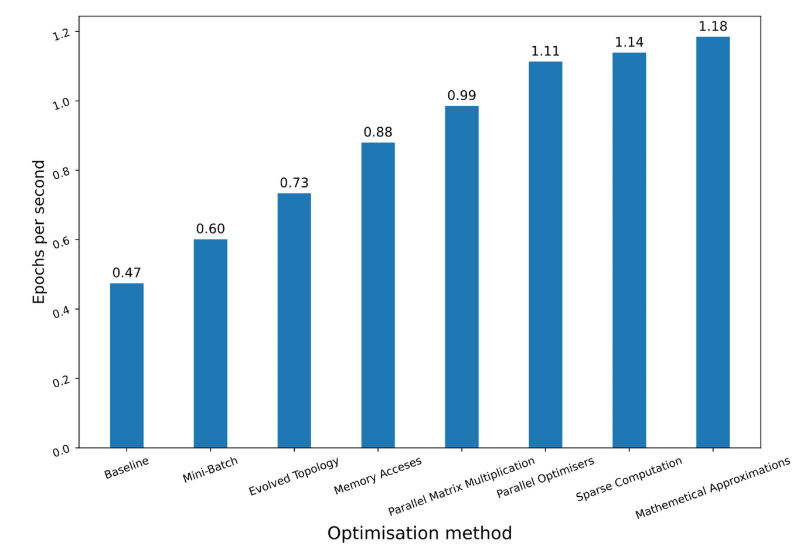{ width=100% }

<div class="mkdocs-only" markdown>
  **PPN Example** - "Récapitulatif des optimisations faites"
</div>


## Exemple de tracé (5)
绘图示例（5）

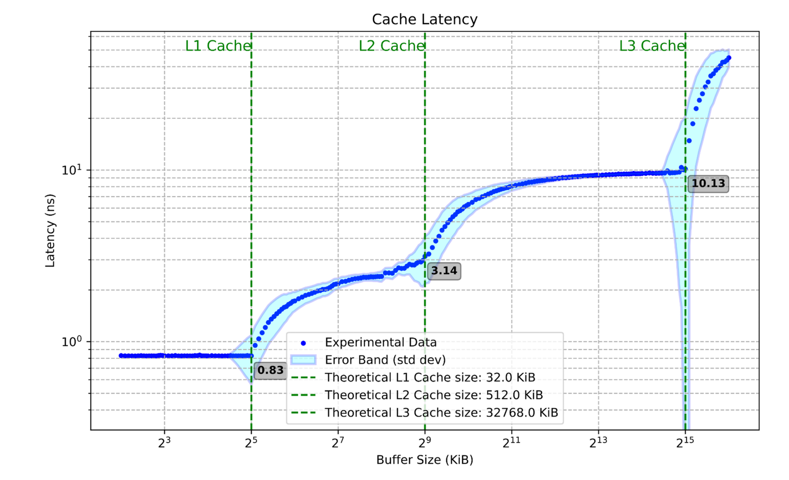{ width=100% }

<div class="mkdocs-only" markdown>
  **PPN Example** - "Nouveau tracé de la latence cache"
</div>


## Exemple de tracé (6)
绘图示例（6）

{ width=100% }

<div class="mkdocs-only" markdown>
  **Prof Example** - (KNM): (a) Speedup map of GA-Adaptive (7k samples) over the Intel MKL hand-tuning for `dgetrf` (LU), higher is better. (b) Analysis of the slowdown region (performance regression). (c) Analysis of the high speedup region. $3,000$ random solutions were evaluated for each distribution.
</div>


## Exemple de tracé (7)
绘图示例（7）

{ width=100% }

<div class="mkdocs-only" markdown>
  **Prof Example** - (SPR): Geometric mean Speedup (higher is better)  against the MKL reference configuration on `dgetrf` (LU), depending on the sampling algorithm. 46x46 validation grid. 7k/15k/30k denotes the samples count. GA-Adaptive outperforms all other sampling strategies for auto-tuning. With 30k samples it achieves a mean speedup of $\times 1.3$ of the MKL dgetrf kernel.
</div>

## Exemple de tracé — Synthèse
绘图示例——小结

**Le HPC est une démarche scientifique**；l'analyse de données et la visualisation sont des éléments de premier plan。
**高性能计算是一项科学实践**；数据分析与图表绘制是第一等公民。

- Les graphiques guident les décisions。
  图表帮助我们做出决策。
- Les graphiques rendent les résultats fiables。
  图表使结果更值得信赖。
- Les graphiques expliquent des comportements complexes。
  图表能解释复杂行为。

Les jeux de données sont volumineux、多学科且 souvent difficiles à reproduire。
数据集往往规模巨大、跨学科且难以复现。

## Exemple de tracé — Qu'est‑ce qu'un bon graphique
绘图示例——什么是好图

Posez‑vous les questions suivantes：
自问如下：

- **À qui est‑ce que je m'adresse？**
  **我在对谁说话？**
- Quel est mon fil narratif？
  我的叙事主线是什么？
- **Mon graphique est‑il compréhensible en ~10 secondes？**
  **我的图是否能在约 10 秒内看懂？**
- Mon graphique est‑il autoportant？
  图是否自洽且自解释？
- Le contexte, l'environnement et la méthodologie sont‑ils clairs？
  背景、环境与方法是否清晰？


# Méthodologie expérimentale
实验方法论

## Méthodologie expérimentale — Flux de travail
实验方法论——工作流程

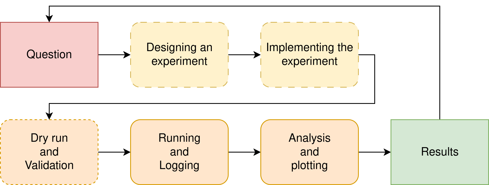{ width=100% }


## Signification statistique — Introduction
统计显著性——引言

Les ordinateurs sont des systèmes bruyants et complexes：
计算机是嘈杂且复杂的系统：

- L'ordonnancement des threads est non déterministe -> le temps d'exécution varie。
  线程调度具有非确定性——不同运行的耗时会变化。
- Fréquence CPU dynamique（Turbo/Boost）。
  CPU 频率动态变化（睿频/加速）。
- Systèmes hétérogènes（CPU/GPU，double socket，effets NUMA，cœurs E/P）。
  系统异构（CPU/GPU、双路、NUMA 效应、E/P 核心）。
- La température / le thermal throttling peuvent modifier le runtime。
  温度/热限速会改变运行时间。

Comment s'assurer que nos mesures expérimentales sont fiables et concluantes？
如何确保我们的实验测量可靠且有结论性？


## Signification statistique — Effets de « warm‑up »
统计显著性——预热效应

Les systèmes ont besoin de temps pour atteindre un régime stationnaire：
系统需要时间进入稳态：

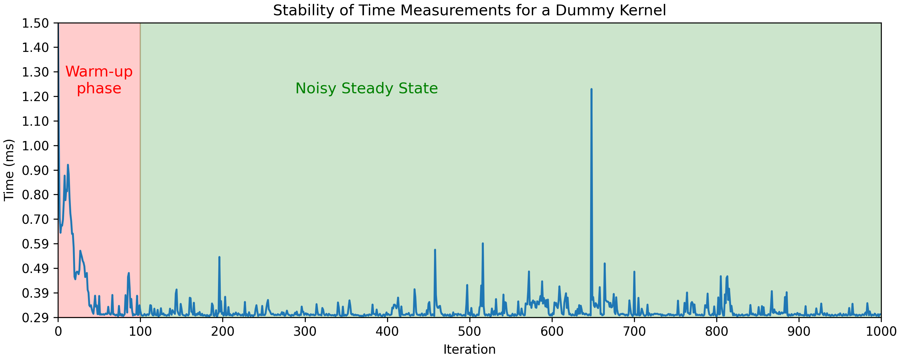{ width=100% }

**Sur un ordinateur portable**：$\mathrm{Mean} = 0.315\ \mathrm{ms},\ \mathrm{CV} = 13.55\%$  
在笔记本电脑上：$\mathrm{Mean} = 0.315\ \mathrm{ms},\ \mathrm{CV} = 13.55\%$  

Nous avons besoin d'itérations de « warm‑up » pour mesurer des performances stables et éviter caches froids、缺页、频率切换等影响。
我们需要进行“预热”迭代，以测量稳定性能并避开冷缓存、缺页与频率波动等影响。


## Signification statistique — Réduction du bruit
统计显著性——噪声缓解

Le bruit ne peut qu'être atténué：
噪声只能被缓解：

- Arrêter tous les processus en arrière‑plan（autres utilisateurs）。
  停止所有后台进程（包括其他用户）。
- Stabiliser la fréquence CPU（`sudo cpupower -g performance`）。
  稳定 CPU 频率（`sudo cpupower -g performance`）。
    - S'assurer que les portables sont branchés pour éviter les politiques d'économie d'énergie。
      确保笔记本接通电源以避免省电策略。
- Épingler les threads via `taskset`、`OMP_PLACES`、`OMP_PROC_BIND`。
  通过 `taskset`、`OMP_PLACES` 与 `OMP_PROC_BIND` 固定线程。
- Considérer l'hyper‑threading。
  考虑超线程。
- Utiliser des nœuds de calcul stables。
  使用稳定的计算节点。

Les méta‑répétitions sont essentielles pour atténuer les mesures bruitées。
进行多轮元重复对减小噪声至关重要。

## Signification statistique — Exemple
统计显著性——示例

Même expérience sur un serveur de benchmark stabilisé：
在一台稳定的基准测试服务器上重复实验：

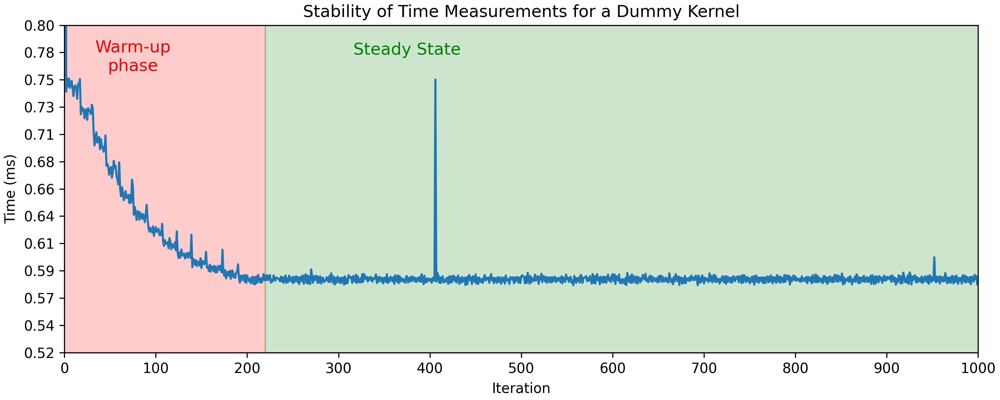{ width=100% }

**Sur portable：** $\mathrm{Mean} = 0.315\ \mathrm{ms},\ \mathrm{CV} = 13.55\%$  
在笔记本：$\mathrm{Mean} = 0.315\ \mathrm{ms},\ \mathrm{CV} = 13.55\%$  
**Nœud stabilisé：** $\mathrm{Mean} = 0.582\ \mathrm{ms},\ \mathrm{CV} = 1.14\%$
稳定节点：$\mathrm{Mean} = 0.582\ \mathrm{ms},\ \mathrm{CV} = 1.14\%$

### Note
备注
  Le chronométrage sur un portable est toujours inférieur。
  在笔记本电脑上的计时表现通常不佳。


## Signification statistique — Moyenne, médiane, variance
统计显著性——均值、中位数与方差

Une seule exécution peut induire en erreur；il nous faut des statistiques。
单次测量容易误导；我们需要统计量。

- Temps moyen $\bar{x} = \frac{1}{n}\sum_{i=1}^{n}x_i$。
  平均运行时间 $\bar{x} = \frac{1}{n}\sum_{i=1}^{n}x_i$。
- Médiane：moins sensible aux valeurs aberrantes。
  中位数：对异常值不敏感。
- Variance/écart‑type：mesure de l'incertitude。
  方差/标准差：不确定性的度量。
- Mesures relatives utiles：coefficient de variation（$CV = \frac{\sigma}{\bar{x}} \times 100 \%$）。
  相对度量：变异系数。

Nous communiquons généralement la moyenne et l'écart‑type pour les résultats de performance。
  报告性能时通常同时给出均值与标准差。
Les tracés affichent souvent $\bar{x} \pm 1 \sigma$ sous forme de zone ombrée autour de la moyenne pour représenter l'incertitude。
  图中常以均值周围的阴影带表示 $\bar{x} \pm 1 \sigma$ 的不确定性。

### Remarque 注释
Les graphiques de distribution peuvent être utiles : les mesures stables sont souvent proches de la distribution gaussienne.
même si le bruit systématique peut entraîner des distributions asymétriques ou à queue lourde.

分布图可能很有用：稳定的测量值通常接近正态分布。
即使系统性噪声可能导致分布出现偏斜或重尾现象。

## Signification statistique — Intervalles de confiance
统计显著性——置信区间

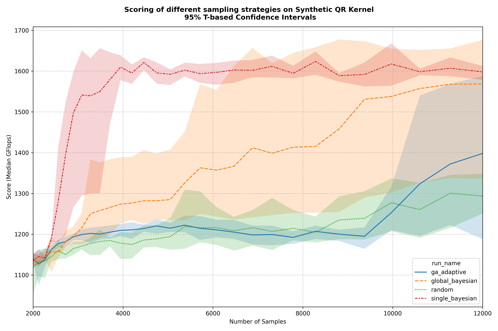{ width=100% }

Le tracé de la variance/incertitude à travers les intervalles de confiance peut changer l'interprétation.
通过置信区间绘制方差/不确定性可以改变解释。


## Signification statistique — Intervalles de confiance
## 统计显著性 — 置信区间

Comment décider combien de répétitions nous devrions effectuer ?
如何决定我们应该进行多少次重复？

- Habituellement, plus les noyaux sont coûteux, moins on s'attend à de méta-répétitions
- 通常，内核越昂贵，预期的元重复次数越少
- Les noyaux courts ou très courts devraient avoir plus de méta pour réduire l'influence du bruit
- 短或非常短的内核应该有更多的元重复以减少噪声的影响

Rappelez-vous que :
记住：

$$CI_{0.95} \approx \bar{x} \pm 1.96 \cdot \frac{\sigma}{\sqrt{n}}$$

Plus de répétitions augmentent la confiance, mais les rendements diminuent :
更多的重复增加置信度，但收益递减：
Largeur CI $\propto \tfrac{1}{\sqrt{n}}$

### Note {.example}
### 注意 {.example}
  Les intervalles de confiance sont un peu moins courants dans les graphiques que $\pm 1 \sigma$ mais peuvent aussi être utilisés !
  置信区间在图中不如 $\pm 1 \sigma$ 常见，但也可以使用！


## Signification statistique — Test de p-score et d'hypothèse
## 统计显著性 — p分数和假设检验

En HPC, la moyenne/médiane et la variance suffisent souvent, mais les tests d'hypothèse peuvent devenir utiles dans certains contextes.
在HPC中，均值/中位数和方差通常就足够了，但假设检验在某些情况下可能很有用。

- Hypothèse nulle ($H_0$) : GPU et CPU ont la même performance pour les petites matrices
- 零假设 ($H_0$)：GPU和CPU在小矩阵上性能相同
    - Les différences dans les mesures ne sont **que** dues au bruit
    - 测量中的差异**仅**由噪声引起
- Hypothèse alternative : CPU est plus rapide pour les petites matrices
- 备择假设：CPU在小矩阵上更快

- La **valeur p** est la probabilité que $H_0$ explique un phénomène.
- **p值**是$H_0$解释现象的概率。
- Si $p < 0,05$, nous pouvons rejeter $H_0$ en toute sécurité (Différence statistiquement significative)
- 如果$p < 0.05$，我们可以安全地拒绝$H_0$（统计显著差异）

Exemple :
示例：
$\bar{x}_{GPU} = 5.0 \mathrm{s}$, $\sigma_{GPU} = 0.20$,
$\bar{x}_{CPU} = 4.8 \mathrm{s}$, $\sigma_{CPU} = 0.4$,
Test t à deux échantillons avec 10 échantillons $p = 0.02$.
10个样本的双样本t检验 $p = 0.02$。

Les différences mesurées entre les temps CPU et GPU sont **statistiquement significatives**。
CPU 与 GPU 执行时间的差异**具有统计显著性**。


## Méthodologie expérimentale — Reproductibilité
实验方法论——可复现性

La reproductibilité est un sujet brûlant（crise de reproductibilité dans les sciences）：
可复现性是热门议题（科学中的可复现性危机）：

- **Les données et protocoles sont des citoyens de première classe**：aussi importants que les figures elles‑mêmes。  
  **数据与流程是一等公民**：与图表本身同等重要。  
- L'**transparence** compte：rendre accessibles données、脚本与参数。  
  **透明性**很重要：开放数据、脚本与参数。  
- Permet aux autres de **vérifier、延续并信任** vos résultats。
  使他人能够**验证、复用并信任**你的结果。


### Note {.example}
  Beware of your mindset: your results should be credible and honest before being "good".
  
  "Our results are unstable, we have yet to understand why, this is what we tried"
  is a completely valid answer

# Outils de tracé
绘图工具

## Outils de tracé — Aide‑mémoire
绘图工具——速查表

| Name       | Use                                  |
|------------|--------------------------------------|
| pandas     | Storing and saving tabular data      |
| numpy      | Numerical arrays, manipulating data  |
| matplotlib | Basic 2D plots, full control         |
| seaborn    | Statistical plots, higher-level API  |
| logging    | Logging experiment progress/results  |
| OpenCV     | Image processing, animations/videos  |
| ffmpeg     | Generating and encoding videos       |

Consultez la galerie de référence rapide dans l'annexe！  
附录中提供了快速参考图库！  
`matplotlib` et `seaborn` proposent de vastes galeries en ligne。
`matplotlib` 与 `seaborn` 都提供了丰富的在线示例图库。


[**Live Example of the matplotlib gallery <https://matplotlib.org/stable/gallery/index.html>**]


## Outils de tracé — Matplotlib
绘图工具——Matplotlib

Matplotlib est l'une des bibliothèques de tracé les plus utilisées。  
一幅图形由嵌套元素按层次构建：
Une figure est construite hiérarchiquement à partir d'éléments imbriqués：

```
- Figure (The canvas)
  - (Subfigures)
    - Axes (One or more subplots)
      - Axis (x/y/z scales, ticks, labels)
      - Artists (Lines, markers, text, patches, etc.)
```

- Les données sont tracées via des fonctions au niveau des axes，如 `ax.plot`、`ax.histogram`。
  使用轴级函数绘制数据，例如 `ax.plot`、`ax.histogram`。
- La personnalisation s'effectue aux niveaux Figure et Axes。
  可在 Figure 与 Axes 两个层级自定义。
- Les mises en page complexes multi‑graphiques se font au niveau Figure。
  多子图的复杂布局发生在 Figure 层级。

## Outils de tracé — Matplotlib
绘图工具——Matplotlib

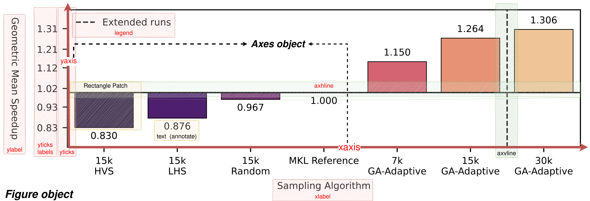


## Outils de tracé — Matplotlib
绘图工具——Matplotlib

```python
import matplotlib.pyplot as plt

x = [0, 1, 2, 3]
y = [2.8, 5.7, 12.5, 14]

# Créer une nouvelle figure, axe unique
# 创建新图形，单个坐标轴
# Taille 8 pouces sur 8 pouces, et mise en page contrainte
# 尺寸为 8 英寸 x 8 英寸，使用约束布局
fig, ax = plt.subplots(figsize=(8, 8), layout="constrained")

# Tracer une ligne simple
# 绘制简单的线条
ax.plot(x, y, color="red", label="Mon Algorithme")  # 我的算法

# Personnaliser les axes
# 自定义坐标轴
ax.set_xlabel("Iteration") # Nom de l'axe X
                           # X 轴名称
ax.set_ylabel("Time (s)") # Nom de l'axe Y
                          # Y 轴名称
# Titre du graphique
# 图形标题
ax.set_title("Évolution du temps avec le nombre d'itérations")  # 时间随迭代次数的演化

ax.margins(0, 0) # Supprimer les espaces blancs autour de la figure
                 # 移除图形周围的空白
ax.legend(loc="upper right") # Dessiner la légende en haut à droite
                             # 在右上角绘制图例

fig.savefig("mon_graphique.png", dpi=300) # DPI élevé -> image plus grande
                                          # 高 DPI -> 更大的图像
                                    # 高 DPI -> 更大的图像
plt.close() # Terminer le tracé et libérer les ressources
            # 结束绘图并释放资源
```

## Outils de tracé — Matplotlib (Multi axes)
绘图工具——Matplotlib（多坐标轴）

Nous pouvons facilement avoir plusieurs graphiques sur la même figure：
我们可以在同一图形上轻松创建多个子图：

```python
nrows = 5, ncols = 1
fig, axs = plt.subplots(5, 1, figsize(8 * ncols, 3 * nrows))

ax = axs[0]
ax.plot()
...

ax = axs[1]
ax.plot()
...

fig.tight_layout() # Alternative à la mise en page contrainte
                   # 约束布局的替代方案
fig.savefig("mon_multi_graphique.png", dpi=300)  # 我的多图
```

Chaque axe est son propre graphique，avec sa propre légende et ses artistes。
每个坐标轴都是独立的图，拥有自己的图例与艺术元素。

### Note {.example}
备注 {.example}

Utilisez abondamment la référence（<https://matplotlib.org/stable/api/index.html>）et la galerie（<https://matplotlib.org/stable/gallery/index.html>）！
大量使用参考文档（<https://matplotlib.org/stable/api/index.html>）与示例图库（<https://matplotlib.org/stable/gallery/index.html>）！

## Outils de tracé — Seaborn
绘图工具——Seaborn

Seaborn est une extension de Matplotlib dédiée à la visualisation statistique：
Seaborn 是 Matplotlib 的扩展，专门用于统计可视化：

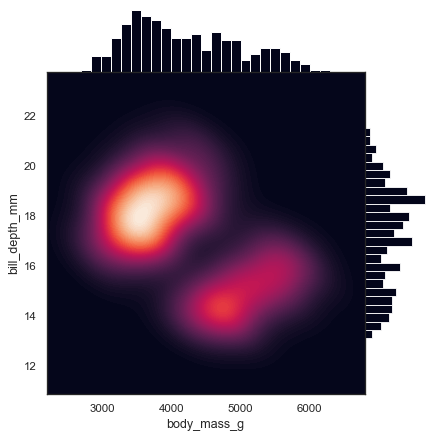{ width=40% }

Elle est utile pour les histogrammes、graphiques en barres、kdeplots、nuages de points，et constitue globalement une excellente bibliothèque compagnon。
它在直方图、条形图、核密度图、散点图等方面很有用，总体而言是一个优秀的伴生库。

## Outils de tracé — Seaborn
绘图工具——Seaborn


```python
import matplotlib.pyplot as plt
import seaborn as sns
import pandas as pd
import numpy as np

df = pd.read_csv(...) # Lire le dataframe depuis quelque part
                      # 从某个地方读取 dataframe

fig, ax = plt.subplots(figsize=(8, 8), layout="constrained")

# Nous devons passer l'axe sur lequel tracer comme argument
# 我们必须将要绘图的坐标轴作为参数传递
sns.kdeplot(data=df, x="Time", label="Algorithme", color="red", fill=True, ax=ax)  # 算法

ax.set_title("Distribution du temps d'exécution de l'algorithme")  # 设置标题："算法执行时间的分布"
ax.margins(0, 0)
ax.set_xlabel("Time (s)", fontweight="bold")  # 设置x轴标签："时间（秒）"
ax.set_ylabel("Density", fontweight="bold")  # 设置y轴标签："密度"

ax.set_xticks(np.linspace(df["Time"].min(), df["Time"].max(), 10)
# Formater les graduations de l'axe x : `3.25s`
# 格式化 x 轴刻度：`3.25s`
ax.xaxis.set_major_formatter(StrMethodFormatter("{x:.2f}s"))

fig.savefig("ma_distribution.png")  # 我的分布图
```

<https://matplotlib.org/stable/gallery/ticks/tick-formatters.html>

# Profilage
性能分析

## Profilage — Motivation
性能分析——动机

- Les codes HPC sont massifs，complexes et hétérogènes。
  HPC 代码庞大、复杂且异构。
- Les humains sont **mauvais** pour prédire les goulots d'étranglement。 
  人类**很不擅长**预测瓶颈。
- Ne pas optimiser aveuglément tout。
  不要盲目地优化所有东西。
- Le profilage guide l'optimisation。
  性能分析指导优化。

Rappel：**Toujours profiler d'abord**。
记住：**始终先进行性能分析**。

## Profilage — Loi d'Amdahl
性能分析——阿姆达尔定律

$$
\mathrm{Speedup} = \frac{1}{1 - f + \frac{f}{S}}
$$

Où f est la fraction du programme améliorée，et S est l'accélération sur cette fraction。
其中 f 是程序改进的部分，S 是该部分的加速比。

Exemple：
示例：

- J'ai optimisé 80% de mon application，avec une accélération de ×10。
  我优化了应用的 80%，加速比为 10 倍。
- Au total，mon application est maintenant $\frac{1}{0.2 + (0.8 / 10)} = 3.57 \times$ plus rapide。
  总体而言，我的应用现在快了 $\frac{1}{0.2 + (0.8 / 10)} = 3.57 \times$。

Les 20% restants constituent un goulot d'étranglement！
剩余的 20% 构成了瓶颈！

## Profilage — Étapes
性能分析——步骤

1. Où（Points chauds）？
   在哪里（热点）？
    - Dans quelles fonctions passons‑nous du temps/énergie？
      我们在哪些函数上花费时间/能量？
    - Dans quel **arbre d'appels** passons‑nous du temps/énergie？
      我们在哪个**调用树**上花费时间/能量？
2. Pourquoi？
   为什么？
    - Densité arithmétique，modèles d'accès mémoire。
      算术密度、内存访问模式。
    - Ratés de cache，mauvaises prédictions de branchement，efficacité de vectorisation（compteurs matériels）。
      缓存未命中、分支预测错误、向量化效率（硬件计数器）。
3. Quel objectif？
   什么目标？
    - Dois‑je optimiser pour la vitesse？Pour l'énergie？L'empreinte mémoire？
      应该针对速度优化？还是能量？内存占用？
      - Qu'en est‑il de la taille/compression du stockage à froid？
        冷存储大小/压缩怎么办？
    - Ai‑je des contraintes（例如 mémoire limitée）？
      我有约束吗（如内存限制）？
    - Dois‑je optimiser ou changer d'algorithme？
      应该优化还是换算法？


## Profilage — Temps
性能分析——时间

Il est assez facile de benchmarker une seule fonction en utilisant une horloge（haute résolution, monotone）：
使用（高精度、单调）时钟对单个函数进行基准测试相当容易：

```python 
begin = time.now()
my_function()
end = time.now()
elapsed = end - begin
```

Méthode rapide et rudimentaire pour profiler une partie de mon programme。
对程序的一部分进行性能分析的快速粗糙方法。

## Profilage — Temps (Stabilité)
## 剖析 — 时间（稳定性）

Mais nous devons tenir compte du bruit :
但我们必须考虑噪声：

```python
for _ in range(NWarmup):  # 预热阶段循环
  my_function()

times = []
for i in range(NMeta):  # 测量循环
  begin = time.perf_counter()  # 开始计时
  my_function()
  times.append((i, time.perf_counter() - begin))  # 记录时间

df = pd.DataFrame(times, columns=["Iteration", "Time"])  # 创建数据框

median = np.median(df["Time"])  # 计算中位数
std = np.std(df["Time"])  # 计算标准差
print(f"Time: {median} +/- {std}")  # 打印结果
...
# Plot through seaborn !  # 通过seaborn绘图！
sns.plot(data=df, x="Iteration", y="Time", ax=ax)
...
```

Nous devons vérifier que nos mesures sont acceptables !
我们必须检查我们的测量结果是否可接受！

## Profilers - Introduction
## 剖析器 — 介绍

Application complète -> Des milliers de fonctions à mesurer !
完整应用程序 -> 需要测量成千上万个函数！

- Les profileurs sont des outils pour automatiser ceci
- 剖析器是自动化这一过程的工具
- Deux types principaux :
- 两种主要类型：
  - Échantillonnage : Pause le programme et enregistre où se trouve le programme
  - 采样法：暂停程序并记录程序的位置
  (Fonctions coûteuses -> Plus d'échantillons !)
  （耗时函数 -> 更多采样！）
  - Instrumentation : Modifie le programme pour ajouter automatiquement des minuteurs
  - 插桩法：修改程序以自动添加计时器

Les profileurs peuvent également vérifier l'utilisation des threads, la vectorisation, l'accès à la mémoire, etc.
剖析器还可以检查线程使用情况、向量化、内存访问等。

## Perf - Record
## Perf - 记录

Linux Perf est un profileur puissant et polyvalent :
Linux Perf是一个强大且多功能的剖析器：

```bash
gcc ... -g -fno-omit-frame-pointer  # 编译时保留调试信息和帧指针
perf record -g -- ./mytransform ./pipelines/big.pipeline  # 记录性能数据
Loaded image: images/image1.bmp (3660x4875, 3 channels)
[ perf record: Woken up 3 times to write data ]
[ perf record: Captured and wrote 0.484 MB perf.data (2941 samples) ]


perf report  # 生成报告
```


C'est un excellent outil pour obtenir rapidement des piles d'appels avec peu de dépendances.
这是一个能够快速获取调用栈且依赖较少的优秀工具。

## Profiling - Hardware counters
## 剖析 — 硬件计数器

En réalité, perf n'est pas seulement un profileur !
实际上，perf不仅仅是一个剖析器！

- L'API Linux Perf peut être utilisée pour accéder à de nombreux compteurs matériels
- Linux Perf API可以用来访问许多硬件计数器
- Perf record n'est qu'une utilisation de perf
- Perf record只是perf的一种用法

La plupart des CPU/GPU ont des compteurs matériels qui surveillent différents événements :
大多数CPU/GPU都有监控不同事件的硬件计数器：

- Nombre de cycles
- 时钟周期数
- Nombre d'instructions retirées
- 已退役指令数
- Nombre d'accès mémoire
- 内存访问次数
- Compteurs d'énergie RAPL
- RAPL能耗计数器

## Profiling - Perf for Hardware counters
## 剖析 — 使用Perf监控硬件计数器

```bash
perf stat -e cycles,instructions python3 ./scripts/run_bls.py ...  # 统计周期和指令数
...

 Performance counter stats:
   749,352,412,722      cpu_core/cycles/                                                      
 3,142,707,494,308      cpu_core/instructions/           #    4.19  insn per cycle               

      32.363472139 seconds time elapsed
     225.351168000 seconds user
       0.111367000 seconds sys
```

- 4,19 instruction par cycle -> Très bonne vectorisation
- 每周期4.19条指令 -> 很好的向量化效果
- temps écoulé -> "Temps d'horloge murale"
- 经过时间 -> "挂钟时间"
- secondes utilisateur -> Temps CPU dans l'espace utilisateur -> $225 / 30 \approx 7$ threads !
- 用户秒数 -> 用户空间的CPU时间 -> $225 / 30 \approx 7$ 个线程！

## Profiling - Perf for Hardware counters
## 剖析 — 使用Perf监控硬件计数器

```bash
perf stat -e cache-references,cache-misses python3 ./scripts/run_bls.py ...  # 统计缓存引用和缓存未命中
...

 Performance counter stats:    
       394,258,269      cpu_core/cache-references/                                            
        36,823,151      cpu_core/cache-misses/           #    9.34% of all cache refs         

      32.363472139 seconds time elapsed
     225.351168000 seconds user
       0.111367000 seconds sys
```

- 394 258 269 références au LLC (Sur Intel)
- 394,258,269次对LLC（最后级缓存）的引用（在Intel上）
- 36 283 151 échecs LLC -> 9,3% de taux d'échec
- 36,283,151次LLC未命中 -> 9.3%的未命中率 

## Profilage - Perf pour les compteurs matériels
## 剖析 — 使用Perf监控硬件计数器

```bash
perf stat -e branches,branch-misses python3 ./scripts/run_bls.py ...  # 统计分支和分支预测错误
...

 Performance counter stats:    
   761,974,570,065      cpu_core/branches/                                                    
       248,674,718      cpu_core/branch-misses/          #    0.03% of all branches       

      32.363472139 seconds time elapsed
     225.351168000 seconds user
       0.111367000 seconds sys
```

- 761 974 570 065 ruptures de flux d'exécution (if, returns, boucles, etc.)
- 761,974,570,065次执行流中断（if语句、返回、循环等）
- 248 674 718 échecs de branche -> Bonne prédiction de branche ! (taux d'échec de $0,9%$)
- 248,674,718次分支预测错误 -> 很好的分支预测！（$0.9%$ 错误率）

## Perf - Enregistrer avec d'autres événements
## Perf - 记录其他事件

Nous pouvons également utiliser `perf record` avec d'autres événements !
我们也可以在`perf record`中使用其他事件！

```bash
perf record -e "cache-references,cache-misses,branches,branch-misses" -g -- ./mytransform ./pipelines/big.pipeline  # 记录多种事件
Loaded image: images/image1.bmp (3660x4875, 3 channels)
[ perf record: Woken up 7 times to write data ]
[ perf record: Captured and wrote 1.709 MB perf.data (10260 samples) ]

perf report  # 生成报告
```


## Intel VTune
## Intel VTune

Perf est un peu "basique" : de nombreux profileurs s'appuient sur perf comme Intel VTune
Perf有点"简陋"：许多剖析器都基于perf构建，如Intel VTune


## VTune - CPU Usage
## VTune - CPU使用情况


## VTune - Collections Mode
## VTune - 收集模式
VTune a plusieurs modes de collecte :
VTune有多种收集模式：


## VTune - HPC Performance
## VTune - HPC性能

VTune a plusieurs modes de collecte :
VTune有多种收集模式：


## Other profilers
## 其他剖析器

- MAQAO est un profileur développé par le LIPARAD
- MAQAO是由LIPARAD开发的剖析器
- AMD, NVIDIA et ARM ont leurs propres profileurs pour leurs plateformes
- AMD、NVIDIA和ARM都有适用于各自平台的剖析器
- Et beaucoup, beaucoup d'autres (likwid, gprof, etc.)
- 还有很多很多其他的（likwid、gprof等）

Habituellement, nous combinons un profileur "rapide" comme gprof/perf record avec un plus approfondi quand nécessaire.
通常，我们会结合使用"快速"剖析器（如gprof/perf record）和更深入的剖析器（需要时）。

## Profiling - Energy
## 剖析 — 能耗

L'énergie est une préoccupation croissante :
能耗是一个日益关注的问题：

- Un cluster HPC consomme des millions de dollars d'électricité **annuellement**
- 一个HPC集群每年消耗数百万美元的电力
- ChatGPT et d'autres LLM sont computationnellement intensifs :
- ChatGPT和其他LLM计算密集：
  - Les GPU Nvidia consomment beaucoup d'énergie
  - Nvidia GPU消耗大量能源

D'un autre côté, mesurer l'énergie est plus difficile que mesurer le temps.
另一方面，测量能耗比测量时间更困难。

De nombreux acteurs se concentrent encore uniquement sur le temps d'exécution -> L'énergie est perçue comme "de second rang"
许多参与者仍然只关注执行时间 -> 能耗被视为"次要指标"

## Profiling - RAPL
## 剖析 — RAPL

Running Average Power Limit (RAPL) est un compteur matériel x86 qui surveille la consommation d'énergie :
运行平均功率限制（RAPL）是监控能耗的x86硬件计数器：

- L'énergie est suivie à différents niveaux
- 能耗在不同级别被跟踪
  - Cœur, Ram, Package, GPU, etc.
  - 核心、内存、封装、GPU等
- Il ne tient pas compte des consommateurs d'énergie secondaires (Ventilateurs, Refroidissement liquide, etc.)
- 它不计算二级耗电设备（风扇、水冷等）
- RAPL n'est pas basé sur les événements : Toute la machine est mesurée ! (Processus en arrière-plan, etc.)
- RAPL不是基于事件的：整个机器都被测量！（后台进程等）

Il nécessite des permissions sudo pour y accéder (comparé à une horloge)
访问它需要sudo权限（相比于时钟）

```bash
perf stat -a -j -e power/energy-pkg,power/energy-cores <app>  # 测量封装和核心能耗
{"counter-value" : "88.445740", "unit" : "Joules", "event" : "power/energy-pkg/", "event-runtime" : 10002168423, "pcnt-running" : 100.00}
{"counter-value" : "10.848633", "unit" : "Joules", "event" : "power/energy-cores/", "event-runtime" : 10002166697, "pcnt-running" : 100.00}
```

## Profiling - Watt-Meter (Yokogawa)
## 剖析 — 功率计（横河）


Des solutions matérielles sont également disponibles pour surveiller la consommation d'énergie.
硬件解决方案也可用于监控能耗。
Elles ont généralement une résolution d'échantillonnage lente ($\approx 1s$) et sont plus difficiles à adapter à des clusters entiers.
它们通常采样分辨率较慢（$\approx 1s$），并且难以扩展到整个集群。

D'un autre côté, elles donnent des mesures de puissance précises par rapport à RAPL.
另一方面，与RAPL相比，它们提供精确的功率测量。

## Profiling - RAPL accuracy
## 剖析 — RAPL准确性


En pratique, RAPL sous-estime la consommation d'énergie, mais les tendances sont correctement appariées.
在实践中，RAPL低估了功耗，但趋势匹配正确。

# Live Demo
# 现场演示

## Experiment example
## 实验示例

[Annex/run_experiment.sh](https://m1-chps.github.io/glhpc/annex/example_experiment/run_experiment/)
[附录/run_experiment.sh](https://m1-chps.github.io/glhpc/annex/example_experiment/run_experiment/)

[Annex/model_convergence.py](https://m1-chps.github.io/glhpc/annex/example_experiment/model_convergence/)
[附录/model_convergence.py](https://m1-chps.github.io/glhpc/annex/example_experiment/model_convergence/)


