# HPC pour les applications IA et impact environnemental du calcul
# 高性能计算在AI应用中的应用及计算的环境影响

<div class="mkdocs-only" markdown>
  <p align="right" markdown>
  [Download as slides 📥](slides/lecture5.pdf)
  </p>
</div>

# Introduction aux applications IA
# AI应用简介

## Renaissance de l'IA : Réseaux de neurones
## AI复兴：神经网络

- 2012 : **Renaissance de l'IA** apportée par l'augmentation de la disponibilité des données
- 2012年：**AI复兴**由数据可用性增加带来的
    et des ressources de calcul
    和计算资源的提升
  
    - percées dans de multiples domaines
    - 多个领域的突破
    - nombreuses innovations : algorithmes, processeurs spécialisés, optimisations
    - 众多创新：算法、专用处理器、优化技术

- La plupart des systèmes utilisent des **réseaux de neurones** :
- 大多数系统使用**神经网络**：

    - Entraînement (descente de gradient stochastique + rétropropagation)
    - 训练（随机梯度下降+反向传播）
    - Inférence (passage avant)
    - 推理（前向传播）

- Pour les deux, **le goulot d'étranglement est la multiplication de matrices**
- 对于两者，**瓶颈都是矩阵乘法**

## Objectifs
## 目标

- Expliquer pourquoi l'algèbre linéaire dense (GEMM) domine le calcul des réseaux de neurones
- 解释为什么密集线性代数（GEMM）主导神经网络计算
- Idées centrales du noyau SGEMM et optimisations courantes
- SGEMM核心思想和常见优化
- Utiliser le modèle Roofline pour identifier les goulots d'étranglement
- 使用Roofline模型识别瓶颈

## Brève introduction aux réseaux de neurones
## 神经网络简介

- Les réseaux de neurones sont composés de couches de neurones
- 神经网络由神经元层组成
- Chaque neurone calcule une somme pondérée de ses entrées suivie d'une fonction d'activation non linéaire $f$
- 每个神经元计算其输入的加权和，然后应用非线性激活函数 $f$

$$ \begin{bmatrix} x_1 \\ x_2 \\ \vdots \\ x_n \end{bmatrix} \rightarrow \textbf{neuron} \rightarrow y $$ 

$$ y = f\left(\sum_{i} w_i x_i + b\right) $$

- Fonctions d'activation courantes : ReLU, sigmoïde, ...
- 常见激活函数：ReLU、sigmoid等

- **Perceptron** : couche unique de neurones (1958 Rosenblatt)
- **感知器**：单层神经元（1958年罗森布拉特）

## Architectures
## 架构

- Différentes architectures pour différentes tâches :
- 不同任务采用不同架构：

    - Couches entièrement connectées
    - 全连接层
    - Couches convolutionnelles
    - 卷积层
    - Couches récursives
    - 循环层
    - Transformers (mécanisme d'attention)
    - Transformers（注意力机制）

    

## Inférence
## 推理

- Inférence : utiliser le modèle entraîné pour faire des prédictions sur de nouvelles données
- 推理：使用训练好的模型对新数据进行预测
- Passage avant à travers le réseau :
- 通过网络的前向传播：
  
    - Pour chaque couche, calculer la somme pondérée et appliquer la fonction d'activation
    - 对于每一层，计算加权和并应用激活函数

    - La somme pondérée est une multiplication matrice-vecteur pour les couches entièrement connectées et les convolutions (souvent implémentée comme GEMM).
    - 加权和是全连接层和卷积的矩阵-向量乘法（通常实现为GEMM）

## Réseau à deux couches
## 双层网络

Couche 1 :
第1层：

- $X$ : données d'entrée [K × B]  → K caractéristiques, B taille de lot
- $X$：输入数据 [K × B]  → K个特征，B为批次大小
- $W_1$ : poids [H × K]  → H unités cachées
- $W_1$：权重 [H × K]  → H个隐藏单元
- $b_1$ : biais [H × 1]
- $b_1$：偏置 [H × 1]

Couche 2 :
第2层：

- $W_2$ : poids [O × H]  → O sorties
- $W_2$：权重 [O × H]  → O个输出
- $b_2$ : biais [O × 1]
- $b_2$：偏置 [O × 1]

ReLU $f(x) = max(0,x)$, $f'(x) = 1_{x>0}$

## Inférence avant
## 前向推理

- Couche 1 Pré-activation cachée (GEMM, H×K × K×B → H×B)
- 第1层 隐藏层前激活（GEMM, H×K × K×B → H×B）

$$Z_1 = W_1 · X + B_1$$

- Couche 1 Activation - ReLU (élément par élément)
- 第1层 激活 - ReLU（逐元素）

$$H = f(Z_1)$$

- Couche 2 Pré-activation de sortie (GEMM, O×H × H×B → O×B)
- 第2层 输出前激活（GEMM, O×H × H×B → O×B）

$$Z_2 = W_2 · H + B_2$$

- Couche 2 Activation - ReLU (élément par élément)
- 第2层 激活 - ReLU（逐元素）

$$Y = f(Z_2)$$

- Le passage avant est dominé par les deux grandes opérations GEMM Z1 et Z2.
- 前向传播由两个大型GEMM操作Z1和Z2主导。

## Entraînement
## 训练

- Entraînement : ajuster les poids $W$ et les biais $b$ pour minimiser une fonction de perte $L$ sur un ensemble de données d'entraînement
- 训练：调整权重$W$和偏置$b$以最小化训练数据集上的损失函数$L$
- Utiliser la **rétropropagation** pour calculer les gradients sur chaque couche (règle de la chaîne)
- 使用**反向传播**计算每层的梯度（链式法则）

- Exemple avec un neurone et une perte MSE :
- 单神经元和MSE损失的示例：

$$ y = f(w_1 x_1 + w_2 x_2 + b) $$

$$ L = (y - y_{true})^2 $$

$$ \frac{\partial L}{\partial w_1} = \frac{\partial L}{\partial y} \cdot \frac{\partial y}{\partial w_1} = 2(y - y_{true}) \cdot f'(w_1 x_1 + w_2 x_2 + b) \cdot x_1 $$

- Le passage arrière peut être implémenté efficacement en utilisant la différentiation automatique et les multiplications de matrices.
- 反向传播可以通过自动微分和矩阵乘法高效实现。

## Descente de gradient stochastique
## 随机梯度下降

- Utiliser la **descente de gradient stochastique** pour mettre à jour les poids :
- 使用**随机梯度下降**更新权重：

$$ w_1 \leftarrow w_1 - \eta \cdot \frac{\partial L}{\partial w_1} $$

$$ w_2 \leftarrow w_2 - \eta \cdot \frac{\partial L}{\partial w_2} $$

$$ b \leftarrow b - \eta \cdot \frac{\partial L}{\partial b} $$

- $\eta$ est le taux d'apprentissage
- $\eta$是学习率
- Répéter pendant de nombreuses époques sur l'ensemble de données d'entraînement
- 在训练数据集上重复多个时期

## Entraînement
## 训练

1. Passage avant pour calculer $H$ et $Y$
1. 前向传播计算$H$和$Y$
2. Calculer la perte $L(Y, Y_{true})$
2. 计算损失$L(Y, Y_{true})$
3. Passage arrière pour calculer les gradients.
3. 反向传播计算梯度。

Le passage arrière est également dominé par les GEMM.
反向传播也由GEMM操作主导。

## Frameworks
## 框架

- Frameworks populaires : TensorFlow, PyTorch, JAX, ...
- 流行框架：TensorFlow、PyTorch、JAX等

- API de haut niveau pour définir des modèles, différentiation automatique, accélération GPU
- 用于定义模型的高级API、自动微分、GPU加速

```python
# Simple 2-layer NN in PyTorch
# PyTorch中的简单双层神经网络
import torch
import torch.nn as nn

class Net(nn.Module):
    def __init__(self):
        super().__init__()
        self.fc1 = nn.Linear(28*28, 512)  # 全连接层1
        self.fc2 = nn.Linear(512, 10)     # 全连接层2

    def forward(self, x):
        x = torch.flatten(x, 1)        # 展平输入
        x = torch.relu(self.fc1(x))    # ReLU激活
        x = torch.relu(self.fc2(x))    # ReLU激活
        return x
```

## SGEMM

Multiplication de matrices générales en simple précision (SGEMM) :
单精度通用矩阵-矩阵乘法（SGEMM）：

$$ RES = A \times B + C $$

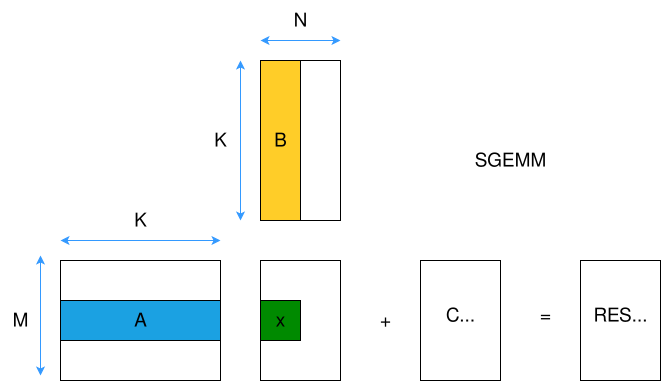

## Implémentation naïve de SGEMM (pseudocode)
## SGEMM的朴素实现（伪代码）

```c
// Initialize RES to C
// 将RES初始化为C
for (i = 0; i < M; i++)
    for (j = 0; j < N; j++)
        RES[i][j] = C[i][j];

// Matrix multiply
// 矩阵乘法
for (i = 0; i < M; i++) {
    for (j = 0; j < N; j++) {
        for (k = 0; k < K; k++) {
            RES[i][j] += A[i][k] * B[k][j];
        }
    }
}
```

- FLOPS: $2 \times M \times N \times K$
- Mémoire min. : $4$ octets $\times (M \times K + K \times N + M \times N)$
- 最小内存：$4$字节 $\times (M \times K + K \times N + M \times N)$

## Problèmes de localité dans SGEMM naïf
## 朴素SGEMM中的局部性问题

$$
{\color{green}\text{ordre en mémoire} \rightarrow}
$$

$$
\begin{bmatrix}
\color{red} b_{11} & b_{12} & b_{13} & b_{14} \\
\color{red} b_{21} & b_{22} & b_{23} & b_{24} \\
\color{red} b_{31} & b_{32} & b_{33} & b_{34} \\
\color{red} b_{41} & b_{42} & b_{43} & b_{44} \\
\end{bmatrix}
$$

- Enjambée dans l'accès à B (colonne-majeure)
- 访问矩阵B的步长（列主序）
    - Mauvaise localité spatiale
    - 空间局部性差
    - Difficile à vectoriser
    - 难以向量化
    - Échecs de cache pour les grandes matrices (distance de réutilisation trop grande)
    - 大矩阵的缓存未命中（重用距离过大）

- **Faible intensité arithmétique** : $\approx 0.5$ FLOP/octet pour les grandes matrices
- **低算术强度**：大矩阵约为0.5 FLOP/字节

## Réordonnancement des boucles (i,k,j)
## 循环重排序（i,k,j）

- Les sommes `RES[i][j] += A[i][k] * B[k][j];` sont indépendantes → réordonner les boucles :
- 求和`RES[i][j] += A[i][k] * B[k][j];`是独立的 → 重新排序循环：

```c
for (i = 0; i < M; i++) 
    for (k = 0; k < K; k++) 
        for (j = 0; j < N; j++) 
            RES[i][j] += A[i][k] * B[k][j];
```

- `A[i][k]` ne dépend pas de `j` → charger une fois, réutiliser N fois
- `A[i][k]`不依赖于`j` → 加载一次，重用N次

- Les accès à `RES` et `B` sont maintenant avec un pas de 1 (ligne-majeure)
- `RES`和`B`的访问现在是步长为1的（行主序）

```c
for (i = 0; i < M; i++) 
    for (k = 0; k < K; k++) {
        const float temp = A[i][k];
        for (j = 0; j < N; j++) 
             RES[i][j] += temp * B[k][j];
        }
```

- Meilleure localité spatiale et plus facile à vectoriser
- 更好的空间局部性且更容易向量化

## Vectorisation
## 向量化

Code assembleur de la boucle interne pour l'ordonnancement (i,k,j) avec AVX (8 `float` dans un vecteur) :
内层循环的汇编代码，采用(i,k,j)排序和AVX（向量中8个`float`）：

```asm
.loop:                                   # Boucle interne / 内层循环
    vmovss  xmm0, DWORD PTR A[i][k]      # Charger A[i][k] / 加载A[i][k]
    vbroadcastss ymm0, xmm0              # Diffuser le scalaire à toutes les voies / 将标量广播到所有通道
    vmovaps ymm1, YMMWORD PTR B[k][j]    # Charger B[k][j:j+8] / 加载B[k][j:j+8]
    vfmadd231ps ymm2, ymm1, ymm0         # Addition-multiplication fusionnée / 融合乘加运算
    vmovaps YMMWORD PTR RES[i][j], ymm2  # Stocker RES[i][j:j+8] / 存储RES[i][j:j+8]
    add     j, 8                         # Incrémenter j par 8 (largeur de vecteur) / j增加8（向量宽度）
    cmp     j, N                         # Comparer j avec N / 比较j与N
    jl      .loop                        # Boucler si j < N / 如果j < N则循环
```

## Problèmes avec l'ordonnancement (i,k,j)
## (i,k,j)排序的问题

- Analyse de la localité temporelle :
- 时间局部性分析：
    - **BON** : $A[i][k]$ réutilisé dans la boucle interne, distance de réutilisation $1$.
    - **好**：$A[i][k]$在内层循环中重用，重用距离为$1$。
    - **MOYEN** : Pour un $(i,j)$ donné, chaque $RES[i][j]$ est revisité une fois par k. Donc distance de réutilisation $K$ (une ligne complète).
    - **中等**：对于给定的$(i,j)$，每个$RES[i][j]$每次k都被重访一次。因此重用距离为$K$（一整行）。
        - Pour garder RES en cache entre les utilisations, il faudrait un cache $\ge N \times 4B$
        - 要在使用之间保持RES在缓存中，需要缓存$\ge N \times 4B$
    - **MAUVAIS** : Pour un $(k,j)$ donné, $B[k][j]$ utilisé une fois par i. Donc distance de réutilisation $K \times N$ (matrice B entière).
    - **不好**：对于给定的$(k,j)$，$B[k][j]$每次i被使用一次。因此重用距离为$K \times N$（整个B矩阵）。
        - Pour garder B en cache entre les utilisations, il faudrait un cache $\ge K \times N \times 4B$
        - 要在使用之间保持B在缓存中，需要缓存$\ge K \times N \times 4B$

- Localité temporelle encore médiocre pour les grandes matrices
- 对于大矩阵，时间局部性仍然较差

- Solution : **pavage / blocage** pour augmenter la réutilisation
- 解决方案：**瓦片化/分块**以增加重用

## Blocage (pavage)
## 分块（瓦片化）

- **Idée :** opérer sur des blocs de sous-matrices qui tiennent dans le cache
- **思路：**在适合缓存的子矩阵块上操作

$$ 
\begin{bmatrix}
\textcolor{red}{A_{11}} & A_{12} \\
A_{21} & A_{22} \\
\end{bmatrix}
\times
\begin{bmatrix}
\textcolor{blue}{B_{11}} & B_{12} \\
B_{21} & B_{22} \\
\end{bmatrix}
=
\begin{bmatrix}
\textcolor{red}{A_{11}}\textcolor{blue}{B_{11}} + A_{12}B_{21} & A _{11}B_{12} + A_{12}B_{22} \\
A_{21}B_{11} + A_{22}B_{21} & A_{21}B_{12} + A_{22}B_{22} \\
\end{bmatrix}
$$

```c
#define BS 64 // Taille de bloc / 块大小
// Boucle sur les blocs / 在块上循环
for (ii = 0; ii < M; ii += BS)
    for (kk = 0; kk < K; kk += BS)
        for (jj = 0; jj < N; jj += BS)

            // Opérer sur les blocs A[ii:ii+BS, kk:kk+BS],
            // 在块上操作 A[ii:ii+BS, kk:kk+BS],
            // B[kk:kk+BS, jj:jj+BS], RES[ii:ii+BS, jj:jj+BS]
            for (i = ii; i < min(ii+BS, M); i++)
                for (k = kk; k < min(kk+BS, K); k++)
                    for (j = jj; j < min(jj+BS, N); j++)
                        RES[i][j] += A[i][k] * B[k][j];
```

## Parallélisation
## 并行化

- Chaque opération de bloc est indépendante → paralléliser sur les blocs
- 每个块操作都是独立的 → 在块上并行化

```c
#pragma omp parallel for collapse(3)
for (ii = 0; ii < M; ii += BS)
    for (jj = 0; jj < N; jj += BS)
        for (kk = 0; kk < K; kk += BS)
            // Multiplication de blocs comme avant / 如前所述的块乘法
```

- Chaque thread travaille sur son propre bloc → pas de faux partage
- 每个线程在自己的块上工作 → 没有伪共享
- Synchronisation uniquement à la fin de la région parallèle
- 仅在并行区域末端同步
- Considérations NUMA : épingler les threads aux cœurs, allouer la mémoire près des threads
- NUMA考虑：将线程绑定到核心，在线程附近分配内存
- Équilibrage de charge : la planification statique fonctionne généralement bien pour les grandes matrices
- 负载均衡：静态调度通常对大矩阵效果良好


## Bibliothèques & auto-tuners
## 库和自动调优器

- Des implémentations SGEMM hautement optimisées existent :
- 存在高度优化的SGEMM实现：

    - OpenBLAS, Intel MKL pour CPU
    - OpenBLAS，Intel MKL适用于CPU

    - NVIDIA cuBLAS pour GPU
    - NVIDIA cuBLAS适用于GPU

- Les implémentations utilisent le blocage, la vectorisation, la parallélisation, et de nombreuses optimisations spécifiques à l'architecture
- 实现使用分块、向量化、并行化以及许多特定于架构的优化

- Les bibliothèques sont soigneusement ajustées pour différentes tailles et formes de matrices.
- 库针对不同大小和形状的矩阵进行了精心调优。

- Les auto-tuners (par exemple, ATLAS, TVM, **MLKAPS**) peuvent générer du code optimisé pour des matériels et tailles de problèmes spécifiques.
- 自动调优器（例如，ATLAS，TVM，**MLKAPS**）可以为特定硬件和问题大小生成优化代码。

## Modèle Roofline - Définitions
## 屋顶线模型 - 定义

- Hypothèse : la performance est limitée soit par le calcul, soit par la bande passante mémoire
- 假设：性能受计算或内存带宽限制

    - performance : FLOP/s (axe vertical)
    - 性能：FLOP/s（垂直轴）
    - bande passante mémoire : Bytes/s
    - 内存带宽：Bytes/s
    - intensité arithmétique : FLOP/byte (axe horizontal)
    - 算术强度：FLOP/byte（水平轴）

- Modèle visuel simple pour comprendre les goulots d'étranglement
- 理解瓶颈的简单视觉模型

## Modèle Roofline - Limites
## 屋顶线模型 - 边界

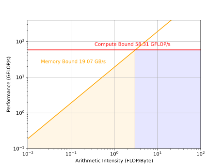

- *Lié au calcul* : ligne horizontale au pic FLOP/s
- *计算受限*：在峰值FLOP/s处的水平线
- *Lié à la mémoire* : ligne inclinée avec pente = bande passante mémoire
- *内存受限*：斜率 = 内存带宽的倾斜线
    - $\frac{\text{Flop/s}}{\text{Flop/Byte}} = \text{Byte/s}$ 

## Modèle Roofline - Analyse SGEMM
## 屋顶线模型 - SGEMM分析

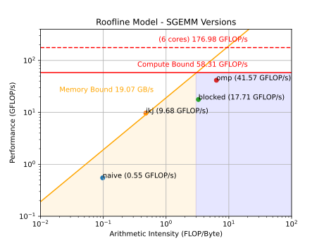

- Démonstration et analyse interactives
- 交互式演示和分析

# Impact environnemental du calcul
# 计算的环境影响

## Introduction
## 介绍

- **Crise écologique majeure** : la feuille de route française vise la neutralité carbone en 2050 (Stratégie Nationale Bas Carbone).
- **重大生态危机**：法国路线图目标是2050年实现碳中和（国家低碳战略）。

- Nécessite une **réduction de 40% de la consommation d'énergie**.
- 需要**减少40%的能源消耗**。

- HPC **fait partie de la solution** : modélisation et amélioration des systèmes complexes
- HPC**是解决方案的一部分**：建模和改进复杂系统

## HPC **fait partie du problème**
## HPC**是问题的一部分**

- Système Frontier à ORNL
- ORNL的Frontier系统

    - Plus de $10^{18}$ opérations en virgule flottante par seconde
    - 每秒超过$10^{18}$次浮点运算

    - Consomme **21MW** : l'énergie d'une petite ville ($16\,000$ maisons françaises)
    - 消耗**21MW**：一个小镇的能源（$16\,000$个法国家庭）


## Impact environnemental du calcul
## 计算的环境影响

- Le secteur des TIC consomme **$\approx$ 5% de l'énergie** dans le monde
- 信息通信技术行业消耗全球**约5%的能源**

- Il représente **1.8% - 2.8%** des émissions de GES \[Freitag, 2021\] :
- 占温室气体排放的**1.8% - 2.8%** \[Freitag, 2021\]：

    - Inclut les émissions incorporées.
    - 包括内含排放。

    - Énergie grise pendant **tout le cycle de vie : extraction minière, fabrication, transport, recyclage**.
    - **整个生命周期的灰色能源：采矿、制造、运输、回收**。

- Les émissions de GES ne sont qu'un des problèmes de durabilité
- 温室气体排放只是可持续性问题之一

    - extraction de terres rares et élimination des déchets (par exemple, Agbogbloshie).
    - 稀土开采和废物处理（例如，阿格博格布洛希）。

        - violations des droits de l'homme, problèmes de santé, pollution.
        - 侵犯人权、健康问题、污染。

- **Cette présentation se concentre sur la consommation d'énergie du HPC**
- **本演示重点关注HPC的能源消耗**


## Qu'en est-il des énergies renouvelables ?
## 可再生能源怎么样？

- L'électricité bas carbone est une **ressource limitée**
- 低碳电力是一种**有限资源**

- Décarbonation $\rightarrow$ énorme augmentation de la demande d'électricité
- 脱碳 $\rightarrow$ 电力需求大幅增加

    - Chauffage, Transport, Industrie
    - 供暖、交通、工业

    - L'informatique va concurrencer l'électricité bas carbone.
    - 计算将竞争低碳电力。


# Consommation d'énergie du HPC
# HPC的能源消耗

## Évolution des unités de traitement \[Batten, 2023\]
## 处理单元的演进 \[Batten, 2023\]

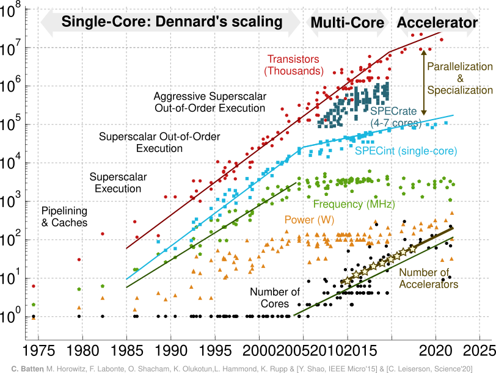


## Mise à l'échelle de Dennard 1970-2005
## 登纳德缩放 1970-2005


$$\begin{aligned}
        \text{Puissance CMOS} &  & P = \underbrace{1/2.C.V^2.f}_{P_{\text{dynamique}}} + \underbrace{V.I_{\text{fuite}}}_{P_{\text{statique}}}
\end{aligned}$$

À chaque génération, les dimensions des transistors réduites de **30%**,
每一代，晶体管尺寸减少**30%**，

- Tension et capacité réduites de 30%
- 电压和电容减少30%

- Fréquence augmente : $\times 1.4 \approx 1/0.7$
- 频率增加：$\times 1.4 \approx 1/0.7$

- Surface divisée par deux : $0.5 \approx 0.7 \times 0.7$
- 表面积减半：$0.5 \approx 0.7 \times 0.7$

- Puissance divisée par deux : $\Delta P = 0.7 \times 0.7^2 \times 1/0.7 \approx 0.5$
- 功率减半：$\Delta P = 0.7 \times 0.7^2 \times 1/0.7 \approx 0.5$

**La puissance par unité de surface reste constante** mais les fabricants doublent le nombre de transistors et la fréquence augmente :
**每单位面积的功率保持恒定**，但制造商将晶体管数量加倍，频率增加：

- L'efficacité énergétique double tous les 1.57 ans
- 能效每1.57年翻倍

- La puissance totale augmente
- 总功率增加

## Multicœur 2005-2020
## 多核 2005-2020

- À l'échelle actuelle, les courants de fuite commencent à augmenter ($P_{\textrm{statique}} \nearrow$). **Le mur de puissance ralentit la mise à l'échelle de Dennard.**
- 在当前规模下，泄漏电流开始增加（$P_{\textrm{静态}} \nearrow$）。**功率墙减缓了登纳德缩放。**

- Demande informatique $\rightarrow$ **parallélisme** et **spécialisation**.
- 计算需求 $\rightarrow$ **并行性**和**专业化**。

- Le nombre de cœurs augmente exponentiellement depuis 2005.
- 自2005年以来，核心数量呈指数增长。

- L'efficacité énergétique s'améliore encore :
- 能效仍在改善：

    - désactivation sélective des transistors inactifs ;
    - 选择性关闭非活动晶体管；

    - optimisations de conception d'architecture ;
    - 架构设计优化；

    - optimisations logicielles.
    - 软件优化。


## Accélérateurs IA 2020-2024
## AI加速器 2020-2024

- Pour les applications spécifiques au domaine, comme l'IA, des accélérateurs spécialisés sont utilisés
- 对于特定领域的应用，如AI，使用专门的加速器

    - Unités mémoire et de calcul adaptées à un problème spécifique (multiplication matricielle) ;
    - 针对特定问题（矩阵乘法）调优的内存和计算单元；

    - Plus rapide et meilleure efficacité énergétique : GPU, TPU, FPGA, ASIC.
    - 更快且更好的能效：GPU、TPU、FPGA、ASIC。


## Analyse des 100 premiers systèmes HPC
## TOP-100 HPC系统分析

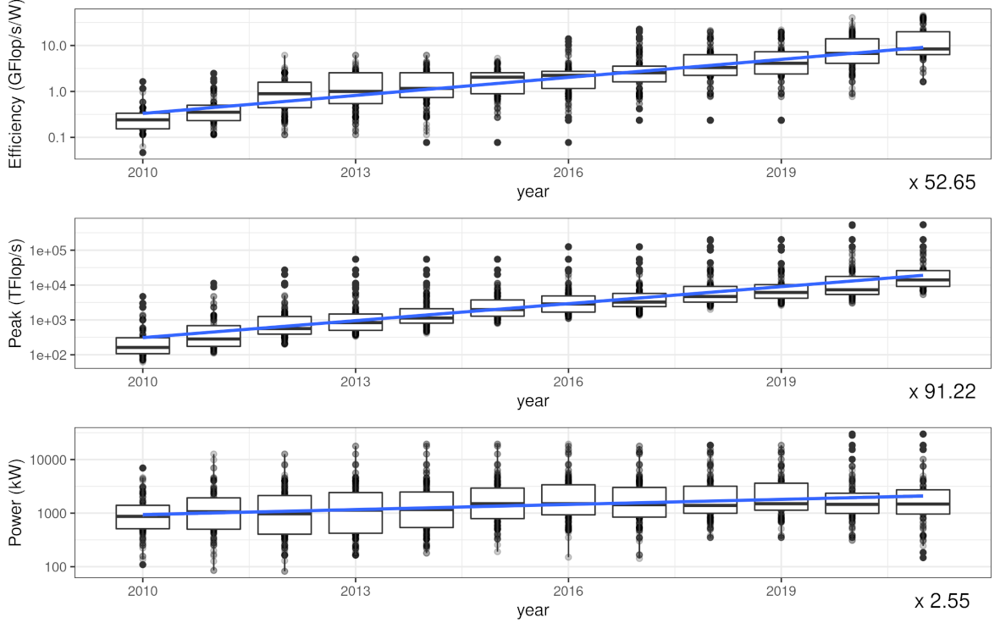

**Augmentation exponentielle de l'efficacité et du calcul de pointe.**
**效率和峰值计算呈指数增长。**

## Effets rebond
## 反弹效应

- En 1865, Jevons montre que les améliorations des machines à vapeur se traduisent par une augmentation de la consommation de charbon.
- 1865年，杰文斯表明蒸汽机的改进转化为煤炭消费的增加。

- En HPC, les gains d'efficacité contribuent à la demande croissante de calcul.
- 在HPC中，效率收益促进了对计算需求的增长。

    - **augmentation nette de la consommation totale d'énergie.**
    - **总能耗净增长。**

- Effets rebond pour les centres de données \[Masanet, 2020\]
- 数据中心的反弹效应 \[Masanet, 2020\]

    - Augmentation de 6% de la consommation d'énergie de 2010 à 2018\ (augmentation de 255% des nœuds).
    - 2010年至2018年能耗增长6%\（节点增长255%）。

- **Effets rebond indirects** : les avancées informatiques peuvent contribuer à l'accélération d'autres domaines.
- **间接反弹效应**：计算进步可能促进其他领域的加速发展。

# Coûts énergétiques et de calcul de l'IA
# AI的能源和计算成本

## Le coût d'entraînement double tous les 3.4 mois \[OpenAI, 2020\]
## 训练成本每3.4个月翻倍 \[OpenAI, 2020\]

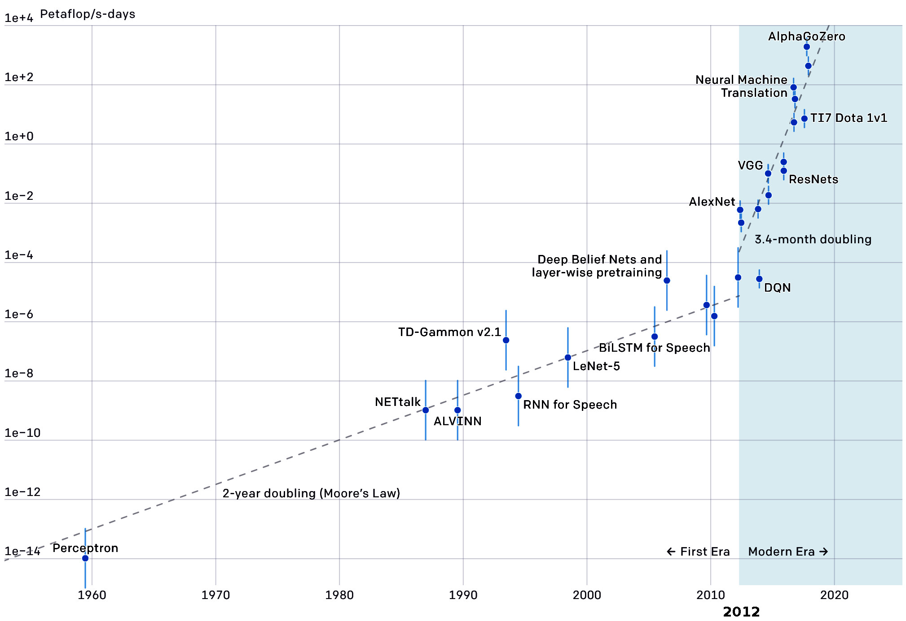

## Faut-il étudier l'entraînement ou l'inférence ?
## 应该研究训练还是推理？

- **Entraînement** : coût énorme mais fait une seule fois
- **训练**：成本巨大但只做一次

    - GPT3, 175 milliards de paramètres, $\approx$ 314 ZettaFLOP
    - GPT3，1750亿参数，约314 ZettaFLOP

    - GPT4, 1.7 billion de paramètres
    - GPT4，1.7万亿参数

- **Inférence** : des millions d'utilisateurs et de requêtes
- **推理**：数百万用户和请求

    - 80-90% du coût d'un système IA déployé est dépensé en inférence \[NVIDIA, 2019\]
    - 已部署AI系统80-90%的成本花费在推理上 \[NVIDIA, 2019\]

## Coût d'inférence - Rendements décroissants pour la vision par ordinateur
## 推理成本 - 计算机视觉的边际效益递减

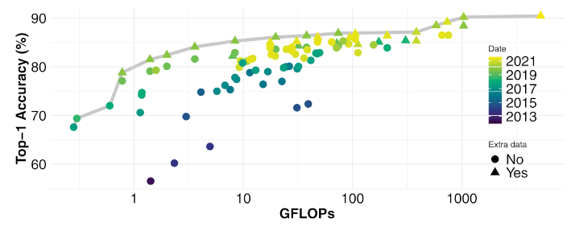
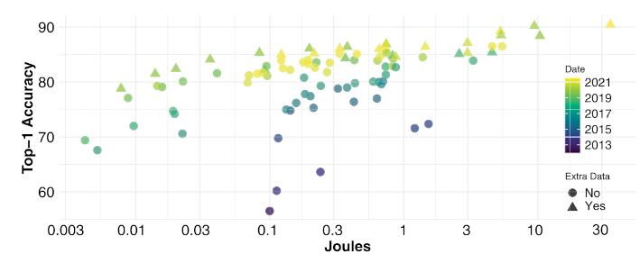

Augmentation exponentielle du calcul pour un gain de précision linéaire \[Desislavov, 2023 / Schwartz, 2019\]
计算呈指数增长而精度收益呈线性增长 \[Desislavov, 2023 / Schwartz, 2019\]


# Calcul plus frugal ?
# 更节约的计算？

## Précision plus petite / Modèles plus petits pour l'IA
## 较小精度/较小的AI模型

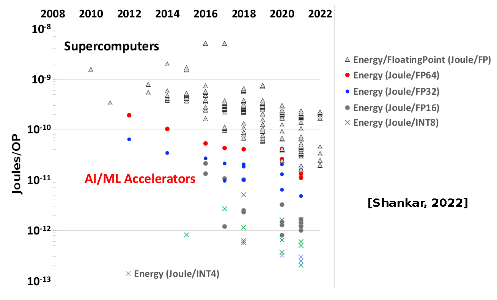

Succès des LLM avec des modèles plus petits (Llama, Chinchilla) affinés pour des tâches spécifiques avec LoRA.
LLM在较小模型（Llama，Chinchilla）方面的成功，这些模型通过LoRA针对特定任务进行微调。


## Compromis : Complexité du modèle - Coût - Explicabilité
## 权衡：模型复杂性 - 成本 - 可解释性

- Le coût d'inférence augmente avec la complexité du modèle
- 推理成本随模型复杂性增加

- Les modèles plus simples sont souvent plus interprétables
- 更简单的模型通常更易解释

    - La science traditionnelle préfère aussi les modèles plus simples
    - 传统科学也偏好更简单的模型

- Les DNN ne sont pas nécessaires pour toutes les tâches
- DNN并非所有任务都需要


## Étude DVFS de la décomposition LU
## LU分解的DVFS研究
- Knights Mill 72 cœurs
- Knights Mill 72核
- Intel MKL dgetrf
- $n \in [1000,3000]$
- Estimation RAPL
- RAPL估算

(Thomas Roglin, stage M1 UVSQ/INTEL 2023)
(Thomas Roglin，2023年UVSQ/INTEL硕士一年级实习)

## Économiser l'énergie en calculant plus lentement : 1GHz
## 通过更慢计算节约能源：1GHz

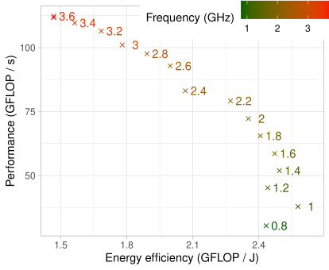

## Quand on prend en compte tout le système
## 当考虑整个系统时

- Modèle : RAPL + **40W**
- 模型：RAPL + **40W**
- La puissance du système domine aux basses fréquences
- 系统功率在低频时占主导

## Course vers l'inactivité : 2.6 GHz calculer plus vite et éteindre la machine
## 竞相空闲：2.6 GHz更快计算然后关闭机器

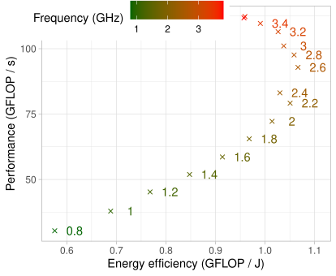
 
## Besoin d'une discussion interdisciplinaire
## 需要跨学科讨论

- L'IA / HPC peut contribuer à la durabilité (par exemple, accélération des modèles de prévision météorologique) ... **mais son coût énergétique doit être réduit**
- AI/HPC可以促进可持续性（例如，加速天气预报模型）... **但必须降低其能源成本**

- **Efficacité :**
- **效率：**

    - Améliorer le matériel et les logiciels
    - 改善硬件和软件

    - Utiliser des modèles plus petits / précision plus petite
    - 使用更小的模型/更小的精度

    ... **soumis aux effets rebond**
    ... **受反弹效应影响**

- **Frugalité en calcul :**
- **计算节俭性：**

    - Équilibrer le coût de calcul vs. les résultats pour chaque tâche
    - 平衡每个任务的计算成本与结果

    - Choisir le modèle de la bonne taille
    - 选择合适大小的模型

    - Évaluer l'impact environnemental
    - 评估环境影响


## Exemple : solution e-santé en Tanzanie \[d'Acremont, 2021\]
## 例子：坦桑尼亚的电子健康解决方案 \[d'Acremont, 2021\]

Traitement des maladies fébriles chez les enfants dans les dispensaires.
在诊所治疗儿童发热性疾病。

- **IMCI :** Arbre de décision papier OMS
- **IMCI：**WHO纸质决策树

- **e-POCT** Arbre CART adapté aux données réelles sur une tablette autonome
- **e-POCT** 在独立平板电脑上根据真实数据定制的CART树

    - Arbre CART final facile à interpréter et vérifié manuellement
    - 最终的CART树易于解释且经过手动检查

    - Essai randomisé $\rightarrow$ meilleurs résultats cliniques et réduction des prescriptions d'antibiotiques
    - 随机试验 $\rightarrow$ 更好的临床结果和减少抗生素处方

- IA sophistiquée qui collecte continuellement les données des patients et adapte l'algorithme ?
- 持续收集患者数据并调整算法的复杂AI？

    - Augmentation des coûts de matériel et de calcul.
    - 硬件和计算成本增加。

    - Perte d'explicabilité et de vérification de l'algorithme.
    - 算法可解释性和验证的丢失。

## Références - HPC pour les applications IA
## 参考文献 - AI应用的HPC

- [S. Boehm Optimizing, How to Optimize a CUDA Matmul Kernel](https://siboehm.com/articles/22/CUDA-MMM)

## Références - Impact environnemental du calcul
## 参考文献 - 计算的环境影响
- Jones, Nicola (2018) 'How to stop data centres from gobbling up the world's electricity'. Nature, 561(7722), pp. 163–167.

- Freitag, Charlotte, Berners-Lee, Mike, Widdicks, Kelly, Knowles, Bran, et al. (2021) ‘The real climate and transformative impact of ICT: A critique of estimates, trends, and regulations'. Patterns, 2(9), p. 100340. [online](https://www.sciencedirect.com/science/article/pii/S2666389921001884)

- Masanet, Eric, Shehabi, Arman, Lei, Nuoa, Smith, Sarah and Koomey, Jonathan (2020) ‘Recalibrating global data center energy-use estimates'. Science, 367(6481), pp. 984–986.

- Schwartz, Roy, Dodge, Jesse, Smith, Noah A. and Etzioni, Oren (2019) ‘Green AI'. [arXiv:1907.10597](http://arxiv.org/abs/1907.10597)

- Amodei, Dario, Hernandez, Danny, Sastry, Girish, Clark, Jack, et al. (2018) ‘AI and compute. OpenAI'. [https://openai.com/blog/ai-and-compute/](https://openai.com/blog/ai-and-compute/)

- D'Acremont presentation: <https://youtu.be/oKcy_cY0QOw>
