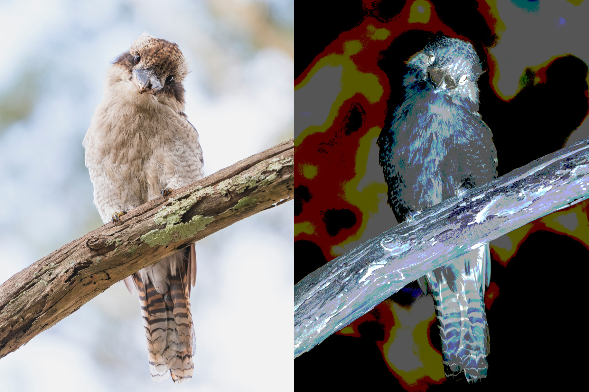
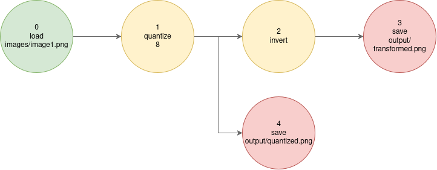
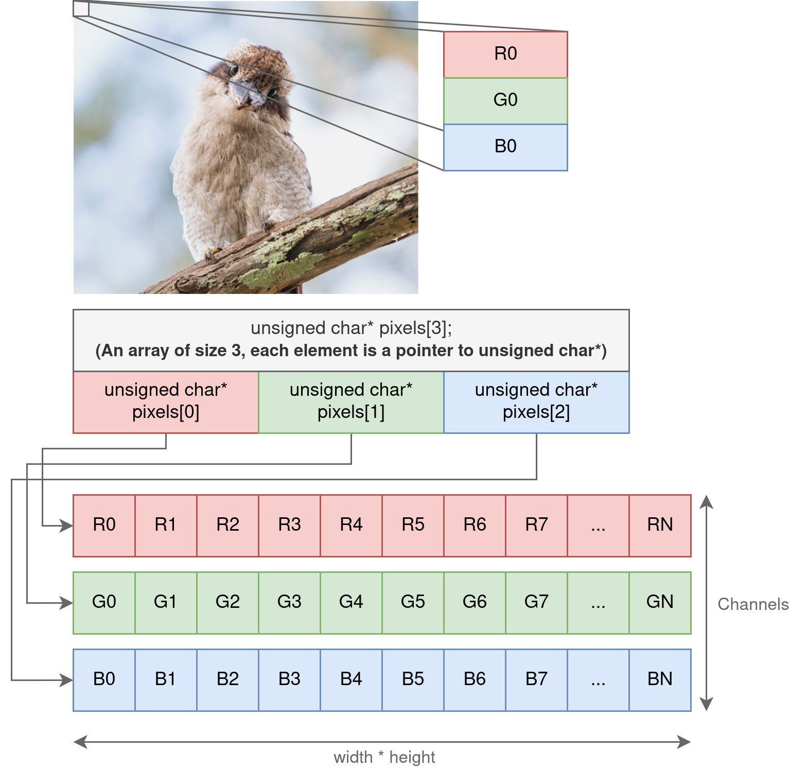

# Lab 2: Performance Aware C Computing
<hr class="gradient" />


### Objectives

You are tasked with implementing an efficient image processing pipeline using the C programming language. The goal is to apply a series of transformation to an input image like so:

<figure markdown="span">
  
  <figcaption>Example Processing pipeline you will have to implement</figcaption>
</figure>


We represent this pipeline using a simple text format:

```text title="Example transformation pipeline"
0 -1 load images/image1.png
1 0 quantize 8
2 1 invert
3 2 save output/transformed.png
4 1 save output/quantized.png
```

<figure markdown="span">
  
  <figcaption>Example of a simple processing pipeline</figcaption>
</figure>

The line `1 0 quantize 8` declares the node 1, whose parent is the node 0, and performs a quantization transformation with 8 levels. 

!!! Note
    This structure is a Directed Acyclic Graph (DAG), a type of graph often used in data processing and scheduling.

---

### Provided Files

The parsing and pipeline execution logic have already been implemented so you can focus on managing memory and kernel implementations. The starter codebase contains the following directories and files:

| Path                   | Description                                                  |
| ---------------------- | ------------------------------------------------------------ |
| `images/`              | Image resources for the lab.                                 |
| `pipelines/`           | Sample transformation pipelines to test your implementation. |
| `src/`                 | C source code for this lab. Contains the files listed below: |
| `src/main.c`           | Parses the transformation graph and executes it.             |
| `src/parser.(c         | h)`                                                          | DAG representation for the image processing pipeline.                                                  |
| `src/image.(c          | h)`                                                          | Image structure and utilities for memory allocation and management.                                    |
| `src/stb_image.h`      | Public domain header-only image I/O library (from GitHub).   |
| `src/transformation.(c | h)`                                                          | Implementation of image processing kernels. Most functions are missing and must be implemented by you. |


<hr class="gradient" />

## 1 - Setting up compilation

Before starting to code, we will set up a `Makefile` to make compilation easier. We need to:

- Compile `main.c`, `image.c`, `parser.c` and `transformation.c` using `gcc`
- Produce a binary named `mytransform` at the root of the project
- Expose a `clean` target that removes compiled artifacts
    - This includes any `.o`, `.so`, `.out`, as well as the `mytransform` binary
- You should link to the math standard library by using the `-lm` compilation flag 

!!! Danger
    The output binary **must** be named `mytransform`, or later parts of the lab may not work correctly.

#### a) Create a `Makefile` at the root of the project

Create `Makefile` with the following content:


```makefile title="Makefile"
mytransform: src/main.c src/image.c src/parser.c src/transformation.c
    gcc $^ -o $@  -lm
```

Then, run the `make` command to test this starter makefile:
```sh title="Running make"
$ make
gcc -o mytransform src/main.c src/image.c src/parser.c src/transformation.c -lm
```

!!! Tip
    Note that you should use tabs instead of spaces before the `gcc $^ ...` line, or `make` will complain.


#### b) Create variables for the compiler and compilation flags

Add two new variables, `CC` and `CFLAGS` at the top of the `Makefile` so we can customize the compilation process:

```makefile title="Makefile"
mytransform: src/main.c src/image.c src/parser.c src/transformation.c
    $(CC) $(CFLAGS) $^ -o $@ -lm
```

To start, you should use `-g -O0 --Wall` as compilation flags.

**Note that you may need to `rm ./mytransform` to test your makefile**

#### c) Make the compilation process incremental

If we modify the `src/image.c` file, we currently have to recompile the entire application !
We would like to compile `src/image.c` to the `src/image.o` object file, this way we can incrementally rebuild the binary when a file changes:


```makefile title="Makefile"
mytransform: src/main.c src/image.o src/parser.c src/transformation.c
    $(CC) $(CFLAGS) $^ -o $@ -lm

src/image.o: src/image.c src/image.h
    $(CC) $(CFLAGS) -c $< -o $@ 
```


Update your Makefile so that the `mytransform` binary is built incrementally from all `.c` files.

If you did it correctly, you should get something like this:

```sh title="Running make"
$ make
gcc -g -O0 --Wall -c src/image.c -o src/image.o
gcc -g -O0 --Wall -c src/parser.c -o src/parser.o
gcc -g -O0 --Wall -c src/transformation.c -o src/transformation.o
gcc -g -O0 --Wall -c src/main.c -o src/main.o
gcc -g -O0 --Wall -o mytransform src/image.o src/parser.o src/transformation.o src/main.o -lm
```

#### d) Add a `clean` and `re` target

We would like to be able to run `make clean` to remove all the object files. Because the `clean` rules does not produce a file, we must declare it as phony:

```makefile title="Makefile"
.PHONY: clean

clean:
    rm -f ./src/image.o
```

Implement the clean rule in your makefile so that you can effectively remove all compilation artifacts.

We want to implement a rule to **RE**build the entire application from scratch. `make re` should first run the `clean` rule, and then rebuild `mytransform`. Make sure to mark `re` as phony.

#### e) When you are done, compare your makefile with the following proposal:

??? "Makefile proposal"
    ```makefile title="Makefile"
    # We create variables to define the C Compiler and the compilation flags (options)
    CC := gcc
    CFLAGS := -g -Wall -O0

    # By default, `make` executes the first, top-most rule
    # We want to build mytransform by default, so we make it the first rule!
    # To build mytransform, we first need image.o, parser.o, etc.
    mytransform: src/image.o src/parser.o src/transformation.o src/main.o
        # - We then call CC (gcc), output to $@ (mytransform)
        # - link to the math library (-lm)
        # - add all compilation flags (CFLAGS)
        # We need to compile all the dependencies ($^)
        $(CC) $(CFLAGS) -o $@ $^ -lm 

    # To obtain src/main.o, we need src/main.c
    src/main.o: src/main.c
        # We need to add the `-c` flag because we are building a .o file and not the final application!
        $(CC) $(CFLAGS) -c $< -o $@

    src/image.o: src/image.c src/image.h
        $(CC) $(CFLAGS) -c $< -o $@

    src/parser.o: src/parser.c src/parser.h
        $(CC) $(CFLAGS) -c $< -o $@

    src/transformation.o: src/transformation.c src/transformation.h
        $(CC) $(CFLAGS) -c $< -o $@

    # We define an helper rule to clean the build artifacts
    clean:
        rm -f mytransform
        rm -f src/*.o

    # We add an helper "re" rule to RE-build everything (clean and rebuild)
    re: clean mytransform

    # We make `clean` and `re` phony rules because they don't produce files
    # (Otherwise, `make` will except files named "clean" and "re" to be produced)
    .PHONY: clean re
    ```

---

We can now run the application:
```sh title="Running a simple pipeline"
./mytransform ./pipelines/all_transform.pipeline
```

```sh title="Expected Output"
create_image - Not implemented yet
Could not allocate image for load
convert_to_grayscale - Not implemented yet
invert_image - Not implemented yet
quantize_image_naive - Not implemented yet
Node 4 requested to save an image from node 3, which did not produce an image
```

This indicates that your build works correctly and you can continue the lab.

<hr class="gradient" />

## 2 - Allocating & Manipulating memory

An image is made up of pixels. Every pixel is made up of one or more channels. Classically three channels are used: Red, Green, and Blue (RGB). Each channel can have a value in the range $[0, 255]$. This means that each value can be stored inside an `unsigned char` which is exactly one byte (8 bits) as $2^8 = 256$. 

The BMP format stores each pixel in the interleaved format: pixels are stored contiguously like so: $R_0G_0B_0R_1G_1B_1R_2G_2B_2 \dots R_nG_nB_n$. For this lab, we will instead use the planar storage format:

<figure markdown="span">
  
  <figcaption markdown>Memory representation of an RGB image using planar storage.
  <br>
  **We use one array per channel.**</figcaption>
</figure>

### 0. Understanding the Image data structure

Before implementing the image processing pipeline, it is important you understand how images are stored in memory, and how we can manipulate them.

#### a) Look at `image.c` and `image.h`, and try to understand the provided structure.

- Pixels are stored as `unsigned char* pixels[3]`: 
    - How many arrays do we have to allocate to store an **RGB** Image? 
    - What's the size of each array? 
    - What happens if we have a **grayscale** image (black & white).
- How do we distinguish between **grayscale** and **RGB** images?

---

### 1. Implement Memory Allocation

#### a) Implement image allocation
You must implement the function `image.c:create_image(...)`.
 
This function should allocate memory buffers big enough to hold an image of size $\text{width} \cdot \text{height}$. Note for this lab, channels can either be 1 (**grayscale**) or 3 (**RGB**).

#### b) Implement image deallocation
You must implement `image.c:free_image(...)`.

Make sure you can free both **grayscale** and **RGB** images. **Note**: you must also free the `Image` structure itself.

#### c) Execute the memory implementation test

Compile your program and fix any errors until none are left. Run the following:
```sh title="Memory Test"
./mytransform --memory-check
```

You should get the following:
```sh title="Expected Output"
Memory Allocations tests completed successfully
<Lots of error about copy failure>
```

---

### 2. Image Copying

#### a) Implement image copy

You must implement `Image* copy_image(const Image* image)` inside `src/image.c`

This function receives an `Image*`, and produces a **deepcopy**, meaning that we are not copying the pointers, but allocating new pixels buffers and duplicating the image in memory.

**You should not use `memcpy` or `strcpy` for this exercise: perform a manual copy.**

#### b) Execute the memory implementation test

Compile again and run:
```sh title="Memory Test"
./mytransform --memory-check
```

You should get the following (Exact results may vary depending on your machine):
```
Memory Allocations tests completed in 5 seconds
Copy Test: 3000x3000x3 image -> 3524.74 Melem/s, 3.52 GB/s
```

<div class="optional-section box-section" markdown>

#### c) Implement 2d copy loops

When copying, we have to deal with three dimensions: the channels, the width and the height.

In which order does your current implementation traverse the pixel buffer ?

Implement the following loop structure in C:
```python title="3D loop traversal"
for c in channels
  for x in width
    for y in height
      # Do the copy here
```

!!! Tip
    You should make a copy of your current implementation before implementing this structure, so you can compare the different versions. 
    Optionally, make multiple versions of `copy_image` with different names (e.g. `copy_image_cxy`, `copy_image_xyc`), and have `copy_image` call the version you want to test.

Now, try swapping out the loop. First iterate on `y`, then `x`, then`c`. Try all possible combinations to find which one is faster. Can you explain why ?

#### d) Implement the linear versions

While images are 3D structures (When taking the channels into account), you may have noticed that we have stored them as 2D arrays (One linear array per channel). 
Each channel is stored in row-major order.

- Implement two nested loops: the upper levels iterating on the channels, the inner loop iterating over each pixel.
- Implement one loop: iterate only over the pixel, copying RGB in a single loop.

Compare the performance by running the `--memory-check` option. Which loops gives you the best performance ? Do you understand why ?

</div>

<hr class="gradient" />

## 3 - Executing a transformation pipeline 

Look at `src/parser.h` and try to understand the different structures of the parser. Do the same for `src/transformation.c`

### 1. Implementing Grayscale

The grayscale transform receives an RGB image and converts it into a black-and-white, single channel image.
The formula for the transformation is:

$$
C_{out} = 0.299 \cdot R_{in} + 0.587 \cdot G_{in} + 0.114 \cdot B_{in}
$$

Where C is the grayscale channel, and R,G,B are the corresponding components of the RGB image.
Note: If the grayscale transform receives a grayscale image as input, it should output a (deep) copy of the input.


#### a) Implement this transformation in `src/transformation.c:convert_to_grayscale(...)`
You should read data from `node.input`, and **allocate and write data** to `node.output`. 
You do not need to free the `input` and `output` buffer of any of the nodes: it will be handled for you.

Test using
```sh title="Test grayscale"
mkdir -p ./output
./mytransform ./pipelines/grayscale.pipeline
```

At this stage, `output/test_grayscale.png` should contain the grayscale of `images/test.png`

---

### 2. Implementing Inversion

The inversion transform is simple:

$$
C_{out} = 255 - C_{in}
$$

Where C is one of the input image channels (RGB or Grayscale). Implement this kernel in `transformation.c:invert_image(...)`.

Test using
```sh title="Test inversion"
./mytransform ./pipelines/invert.pipeline
```

---

### 3. Implementing Quantization

We will implement a **uniform quantization** transform, which uniformly reduces the number of possible values in each component of the image.

$$\begin{aligned}
\text{step} &= \frac{255}{\text{levels} - 1} \\\\
C_{out} &= \text{round}\left(\frac{C_{in}}{\text{step}}\right) \cdot \text{step}
\end{aligned}$$

Where $\text{levels}$ is the target number of discrete values per component. This maps each input color channel value $C_{in} \in [0, 255]$ to a quantized output $C_{out}$ in the same range.

#### a) Implement this transformation using the formula provided above.

You must implement this function in `transformation.c:quantize_image_naive(...)`

Test using
```sh title="Test Quantization"
./mytransform ./pipelines/quantize.pipeline
```

#### b) Optimize using a lookup table

Division and floating-point operations can be costly. Since $C_{in} \in [0, 255]$, we can easily precompute all possible outputs in a **lookup table (LUT)** of size 256, 
then convert each pixel using:

$$
C_{out} = LUT[C_{in}]
$$

We are trading **memory overhead for performance**, which is a very common pattern.

Implement this function in `transformation.c:quantize_image_lut(...)`, and be sure to correctly allocate and free the LUT.

#### c) Compare performance

Modify `transformation.c:quantize_image(...)` to either use the LUT or the naive version, and run the following code:
```title="Benchmarking"
time ./mytransform ./pipelines/quantize_benchmark.pipeline
```

Which version is faster ? What's the speedup of the LUT algorithm over the naive version ?

<hr class="gradient" />

## 4) Validation

At this stage, your code should be able to execute all pipelines in the `pipelines/` directory. 
Validate your implementation by checking that output images are generated and appear visually correct.

---

### 1. Improving performance

Once your implementation is functionally correct, your next goal is to **optimize performance**.

Use the provided script:

```sh
# run_all.sh <run_label>
./run_all.sh first_version
```

!!! Tip
    You should run the previous script with both the LUT and naive implementation of quantization to compare.

Check the resulting plots in `./results/first_version/`. Take a look at `./results/first_version/pipeline.pipeline` to understand which operations are being evaluated.
Re-run the benchmark after every meaningful optimization, and check `./results/comparisons.png` to see if you improved performance or not. **Tip**: play around with compilation flags.

To remove a version, remove the corresponding folder in `./results`

!!! Important
    You need to have python installed for `run_all.sh` to work. On Fedora:
    ```sh title="Installing python on fedora"
    sudo dnf install python3 python3-pip python3-virtualenv
    ```

<hr class="gradient" />

<div class="summary-section box-section" markdown>

<h2 class="hidden-title"> 5 - Summary</h2>

Upon completing this second lab, you should be able to:

- [x] Create a makefile, link to a dynamic library.
- [x] Explore compilation flags for performance
- [x] Allocate and free memory in C.
- [x] Explore the effect of memory layout and loop order on performance.
- [x] Implement loop-based algorithms.
- [x] Rearrange your algorithm to avoid costly operations.
- [x] Understand the basics of the optimization loop.

</div>
  

