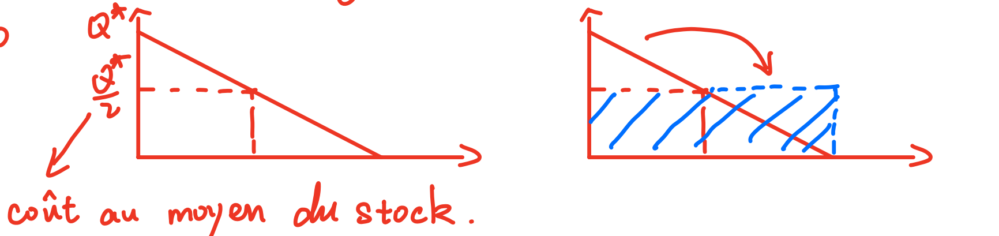
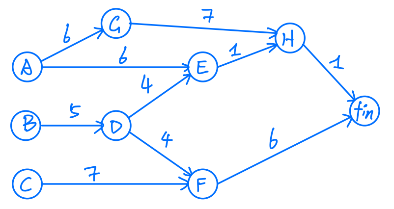
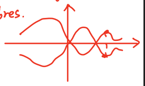
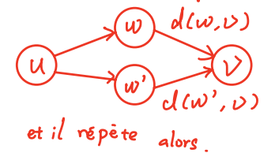
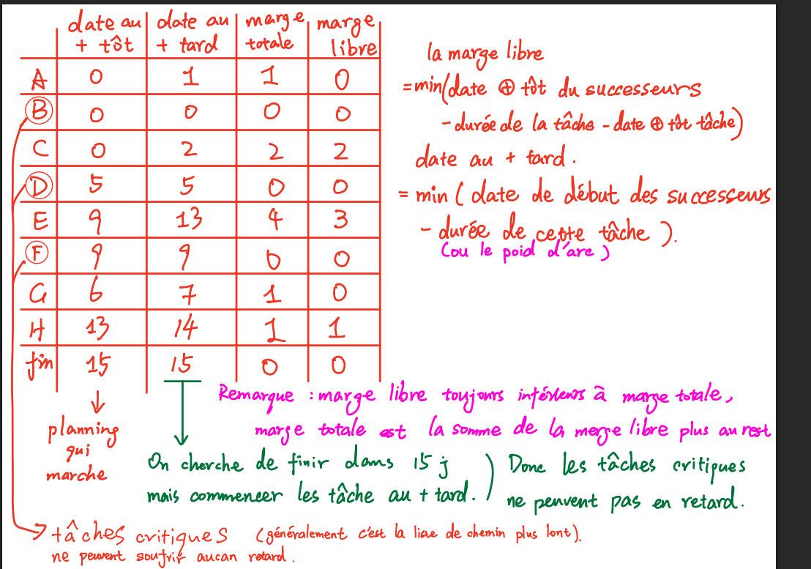
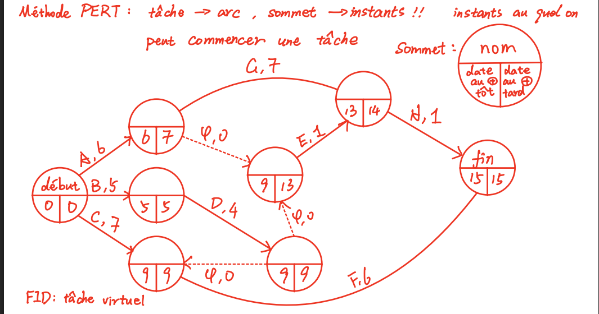
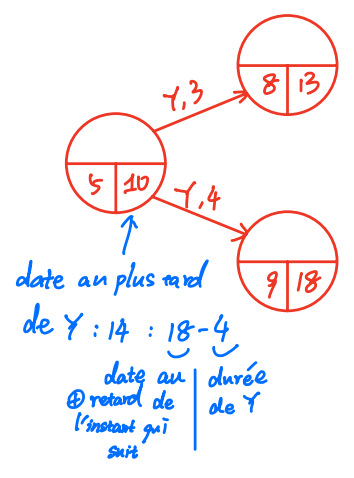

# Cour1 第一课 - Optimisation et recherche opérationnelle 优化与运筹学

- Optimisation : $\min/\max$ 优化：$\min/\max$
- Opérationnel : mise en oeuvre sur des objets concrets 运筹：在具体对象上的实施
- Fonction objectif : fonction que l'on cherche à optimiser ($\mathrm{i.e.}$ à maximiser ou minimiser) 目标函数：我们试图优化的函数（即最大化或最小化）

## Démarche 方法

- modélisation 建模
- optimisation 优化
- mise en oeuvre de la solution 解决方案的实施

## Plan 课程内容

1. Ordonnancement 排程
2. Programmation linéaire 线性规划
3. Séparation et évaluation 分支定界

## Définitions 定义

On appelle fonction objectif la fonction que l'on cherche à optimiser ($\mathrm{i.e.}$ à maximiser ou minimiser). 我们把要优化的函数（即要最大化或最小化的函数）称为目标函数。

Cette fonction dépend de variables de décision, donc on cherche à déterminer sa valeur optimale. 这个函数依赖于决策变量，因此我们要寻找其最优值。

La mise en oeuvre de la solution consistera alors à décider ou à fixer les objets correspondants à cette valeur. 解决方案的实施，就是决定或确定与这个取值相对应的对象。

Les variables de décision correspondent donc à des quantités dont on peut décider la valeur. 因此，决策变量对应的是那些我们可以决定其取值的量。

La valeur de ces variables est presque toujours limitée par des contraintes. 这些变量的取值几乎总是受到约束条件限制。

## Exemple : gestion de stock 例子：库存管理

Un problème de gestion de stock : 一个库存管理问题：

- $g=100$ unités sortant chaque jour du stock $g=100$：每天从库存中取出 100 个单位
- $a=0.6\,€/\text{jour}$ : coût d'une unité en stock $a=0.6$ 欧元/天：库存中每单位每天的持有成本
- $b=50\,€$ : coût d'une commande $b=50$ 欧元：每次下订单的成本
- $c=400$ : nombre maximal d'unités dans une commande $c=400$：一次订单中的最大单位数

Dès que le stock est vide, on passe une commande. 一旦库存为空，就下一个订单。

On cherche à déterminer le volume optimal $Q^*$ d'une commande. 我们要确定一次订单的最优订货量 $Q^*$。

La variable de décision, ici, est le volume $Q$ de commande. 这里的决策变量是订货量 $Q$。

On cherche à minimiser le coût de gestion de cet entrepôt. 我们希望最小化这个仓库的管理成本。

Les deux schémas représentent le coût moyen du stock. 这两个示意图表示库存的平均成本。



Le coût moyen de stockage est : 平均库存持有成本为：

$$a\times \frac{Q^*}{2}\ \text{€ / jour}$$

Le coût associé à la passation des commandes, $b=50\,€$, doit être rapporté au nombre de jours entre deux commandes : 与下订单相关的成本 $b=50$ 欧元，需要折算到两次下单之间的天数上：

$$\frac{Q^*}{g}\ \longrightarrow\ \frac{bg}{Q}\ \text{€ / jour}$$

La fonction objectif, c'est le coût de gestion du stock : 目标函数就是库存管理成本：

$$\min\left\{a\times\frac{Q}{2}+\frac{bg}{Q}\right\}$$

Les contraintes sont : 约束条件为：

$$0\le Q\le 400=c$$

Résolvons maintenant ce problème. 现在来求解这个问题。

On définit : $f:Q\mapsto \dfrac{aQ}{2}+\dfrac{bg}{Q}=0.08Q+\dfrac{5000}{Q}$ avec $Q\in]0,c]=]0,400]$. 定义：$f:Q\mapsto \dfrac{aQ}{2}+\dfrac{bg}{Q}=0.08Q+\dfrac{5000}{Q}$，其中 $Q\in]0,c]=]0,400]$。

Pour tout $Q\in]0,c]$, $f'(Q)=\dfrac{a}{2}-\dfrac{bg}{Q^2}=0.08-\dfrac{5000}{Q^2}$ 对任意 $Q\in]0,c]$，有 $f'(Q)=\dfrac{a}{2}-\dfrac{bg}{Q^2}=0.08-\dfrac{5000}{Q^2}$。

$$f'(Q)=0 \Longleftrightarrow \frac{a}{2}-\frac{bg}{Q^2}=0$$

$$\Longleftrightarrow \frac{a}{2}=\frac{bg}{Q^2} \Longleftrightarrow Q^2=\frac{2bg}{a}$$

$$\Longleftrightarrow Q=\sqrt{\frac{2bg}{a}}\quad \text{car } Q>0 \Longleftrightarrow Q=250$$ $Q>0$，所以 $\Longleftrightarrow Q=\sqrt{\frac{2bg}{a}}$，即 $\Longleftrightarrow Q=250$。

Si $\sqrt{\dfrac{2bg}{a}}\le c$, 如果 $\sqrt{\dfrac{2bg}{a}}\le c$，

alors $Q^*=\sqrt{\dfrac{2bg}{a}}$ est le point où se réalise le minimum de $f$, qui vaut : 那么 $Q^*=\sqrt{\dfrac{2bg}{a}}$ 就是 $f$ 取得最小值的点，此时：

$$f(Q^*)=\frac{a}{2}\sqrt{\frac{2bg}{a}}+\frac{bg}{\sqrt{2bg/a}}=\sqrt{2abg}=40$$

Si $\sqrt{\dfrac{2bg}{a}}>c$, alors 如果 $\sqrt{\dfrac{2bg}{a}}>c$，那么

$Q^*=c$ est le point où se réalise le minimum de $f$, qui vaut $Q^*=c$ 是 $f$ 取得最小值的点，此时

$$f(Q^*)=f(c)=\frac{ac}{2}+\frac{bg}{c}$$

Le coût d'entrepôt et le coût de commande valent chacun $\sqrt{\dfrac{abg}{2}}$. 仓储成本和订货成本各自都等于 $\sqrt{\dfrac{abg}{2}}$。

## I. Ordonnancement I. 排程

On a un certain nombre de tâches $(t_i)_{i=1}^n$, qui ont chacune une durée $(d_i)_{i=1}^n$, et dont certaines doivent être réalisées avant d'autres : chaque tâche $t_i$ a une liste $P_i$ de prédécesseurs. 我们有若干任务 $(t_i)_{i=1}^n$，每个任务都有一个持续时间 $(d_i)_{i=1}^n$，并且其中一些任务必须在另一些任务之前完成：每个任务 $t_i$ 都有一个前驱列表 $P_i$。

Toutes les tâches de $P_i$ doivent être réalisées avant que $t_i$ ne puisse démarrer. $P_i$ 中的所有任务都必须在 $t_i$ 开始之前完成。

On cherche à établir un planning permettant de terminer le projet le plus tôt possible. 我们要建立一个排程，使项目能够尽可能早地完成。

On choisit $0$ pour date de début du calendrier et les variables de décision seront les dates $D_i$ de début de chaque tâche. 我们选择 $0$ 作为日程表的起始时间，决策变量是每个任务的开始时间 $D_i$。

On a pour contraintes : 我们有如下约束：

$$\forall i,\ \forall j\in P_i,\ D_j+d_j\le D_i$$

$$\forall i,\ D_i\ge 0$$

La fonction dynamique est : 动态函数为：

$$\min\left\{\max\left\{D_i+d_i\mid i\in\{1,\ldots,n\}\right\}\,/\,D_i\right\}$$

Pour résoudre ce problème, on va le représenter sous forme d'un graphe, dont les noeuds sont les tâches. 为了解决这个问题，我们把它表示成一个图，其中节点是各个任务。

Un arc relie une tâche $A$ à une tâche $B$ si $A\in P_B$ ; cet arc aura $d_A$ pour poids. 如果 $A\in P_B$，就从任务 $A$ 向任务 $B$ 连一条弧；这条弧的权重是 $d_A$。

| Tâche 任务 | durée 持续时间 | précédente 前驱 |
| --- | --- | --- |
| A | 6 | - |
| B | 5 | - |
| C | 7 | - |
| D | 4 | B |
| E | 1 | A, D |
| F | 6 | C, D |
| G | 7 | A |
| H | 1 | E, G |



Un chemin dans ce graphe correspond à une séquence de tâches devant être effectuées les unes après les autres. 这个图中的一条路径对应于一串必须依次执行的任务序列。

Sa longueur correspond à la durée de cette séquence. 它的长度对应于这个任务序列的总持续时间。

Deux tâches qui ne sont pas sur le même chemin peuvent être traitées en parallèle. 两个不在同一路径上的任务可以并行处理。

Le problème de déterminer la date de fin la plus petite possible pour le projet revient donc à trouver le plus long chemin dans ce graphe. 因此，确定项目最早完成时间的问题就转化为寻找这个图中的最长路径。

Un DAG est un graphe orienté acyclique. DAG 是有向无环图。

$$\max\{f\}=-\min\{-f\}$$

La recherche d'un plus long chemin est un problème en général sans solution. 一般来说，寻找最长路径的问题通常是无解的。

S'il existe un cycle de poids strictement positif, accessible depuis la source et co-accessible depuis la destination, on peut construire des chemins de longueurs arbitrairement grandes en répétant suffisamment ce cycle. 如果存在一个严格正权的环，并且它从源点可达、同时也能到达终点，那么通过反复经过这个环，就能构造出长度任意大的路径。

Ici, on a un graphe orienté acyclique (DAG), ce qui garantit que ce scénario est exclu. 这里我们有的是一个有向无环图（DAG），因此这种情况不会发生。

On peut essayer de résoudre ce problème en utilisant un algorithme de recherche de plus courts chemins, ainsi que le fait que $\max\{f\}=-\min\{-f\}$. 我们可以利用最短路径算法来尝试解决这个问题，并结合 $\max\{f\}=-\min\{-f\}$ 这一事实。

Cela revient à multiplier par `-1` le poids de tous les arbres. 这相当于把所有边的权重都乘以 `-1`。



L'algorithme de Dijkstra est exclu, car il ne traite que des graphes valués positivement. Dijkstra 算法不适用，因为它只处理权值为正的图。

L'algorithme de Bellman-Ford part du constat que : Bellman-Ford 算法基于这样一个事实：

$$\forall u\ne v,\ d(u,v)=\min\{\,w(u,w)+d(w,v)\mid w\text{ successeur de }u\,\}$$



et il répète alors. 然后它重复这个过程。

```text
Pour v = 0, destination donnée :
    change <- faux
    pour tout u du G sauf 0 faire
        pour tout w successeur de u faire
            si (w(u,w) + d[w] > d[u]) alors
                d[u] <- d[w] + w(u,w)
                plu <- w
                change <- vrai
            fin si
        fin pour
    fin pour
jusqu'à ce que change soit faux
```

Si on a un DAG, en traitant les noeuds de façon que tout noeud ne soit traité qu'après ses prédécesseurs ($\mathrm{i.e.}$ selon un ordre topologique), on sait que l'algorithme Bellman-Ford converge en une itération. 如果我们有一个 DAG，并且按照一种使每个节点都在其前驱之后才被处理的方式处理节点（即按拓扑序），那么 Bellman-Ford 算法在一次迭代后就会收敛。

On appelle souvent cette version l'algorithme de Bellman. 这个版本通常称为 Bellman 算法。

## Dates et marges 时间与余量

### Date au plus tôt 最早开始时间

Définition : la date de début au plus tôt d'une tâche est 定义：一个任务的最早开始时间是

$$\max\{\,\text{date de début au plus tôt}+\text{durée}\mid \text{prédécesseur du noeud}\,\}$$

Explication : c'est la première date à laquelle la tâche peut commencer, une fois tous ses prédécesseurs terminés. 解释：也就是在所有前驱任务都完成之后，该任务能够开始的最早时间。

### Date au plus tard 最晚开始时间

Définition : la date de début au plus tard est la date la plus tardive à laquelle on peut commencer une tâche sans retarder la fin du projet. 定义：最晚开始时间是在不延误整个项目完工的前提下，一个任务最晚可以开始的时间。

Explication : on cherche ici à finir dans les temps, mais en commençant chaque tâche aussi tard que possible sans créer de retard. 解释：这里我们的目标是在项目按时完成的同时，让每个任务尽可能晚地开始而不造成延期。

La date au plus tard vaut 而最晚开始时间为

$$=\min(\text{date de début des successeurs}-\text{durée de cette tâche})$$

Parfois, selon les exigences de l'énoncé, la « durée de cette tâche » peut prendre une autre signification, mais il s'agit toujours du poids des liens représentés sur le graphe. 有时候根据题目要求 durée de cette tâche 可能会改成别的定义，但总是图上的链接的权重

### Marge totale 总时差

Définition : la marge totale est la différence entre la date au plus tard et la date au plus tôt. 定义：总时差等于最晚开始时间减去最早开始时间。

Explication : elle mesure le retard maximal que peut subir une tâche sans retarder la date de fin du projet. 解释：它衡量一个任务最多可以延迟多少而不会推迟整个项目的完工时间。

### Marge libre 自由时差

Définition : la marge libre vaut 定义：自由时差为

$$=\min(\text{date au plus tôt des successeurs}-\text{durée de la tâche}-\text{date au plus tôt de la tâche})$$

Explication : la marge libre mesure de combien on peut retarder une tâche sans retarder le début au plus tôt de ses successeurs. 解释：自由时差表示一个任务可以推迟多少，而不会推迟其后继任务的最早开始时间。

Remarque : la marge libre est toujours inférieure ou égale à la marge totale. 备注：自由时差总是小于或等于总时差。

### Tâches critiques 关键任务

Définition : les tâches critiques ne peuvent subir aucun retard. 定义：关键任务不能有任何延误。

Le chemin critique est l'ensemble des tâches critiques. 关键路径就是所有关键任务构成的集合。

Explication : ce sont les tâches de marge nulle ; en général, elles se trouvent sur la ligne du chemin le plus long. 解释：这些是时差为零的任务；一般来说，它们位于最长路径上。

Appliqué dans notre exo : 应用到我们的例子中：

| Tâche 任务 | date au plus tôt 最早开始 | date au plus tard 最晚开始 | marge totale 总时差 | marge libre 自由时差 |
| --- | --- | --- | --- | --- |
| A | 0 | 1 | 1 | 0 |
| B | 0 | 0 | 0 | 0 |
| C | 0 | 2 | 2 | 2 |
| D | 5 | 5 | 0 | 0 |
| E | 9 | 13 | 4 | 3 |
| F | 9 | 9 | 0 | 0 |
| G | 6 | 7 | 1 | 0 |
| H | 13 | 14 | 1 | 1 |
| fin 结束 | 15 | 15 | 0 | 0 |

Remarque : la marge libre est toujours inférieure à la marge totale ; la marge totale est la somme de la marge libre plus du reste. 备注：自由时差总是小于总时差；总时差等于自由时差加上其余部分。

On cherche à finir dans $15$ j, mais à commencer les tâches au plus tard. 我们希望在 $15$ 天内完成，同时让任务尽量晚开始。

Donc les tâches critiques ne peuvent pas être en retard. 因此，关键任务不能延误。



## Methode PERF PERF 方法



