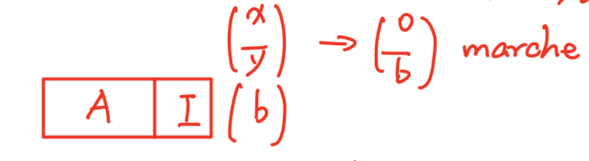
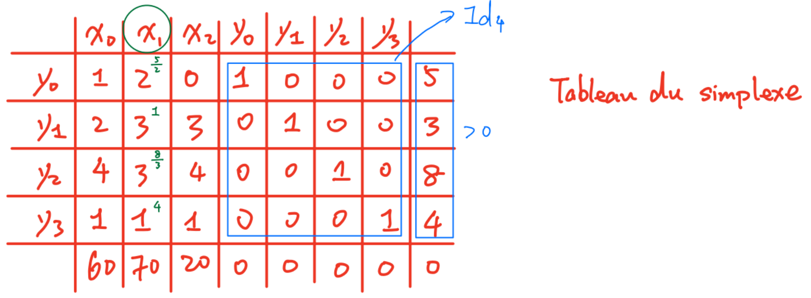
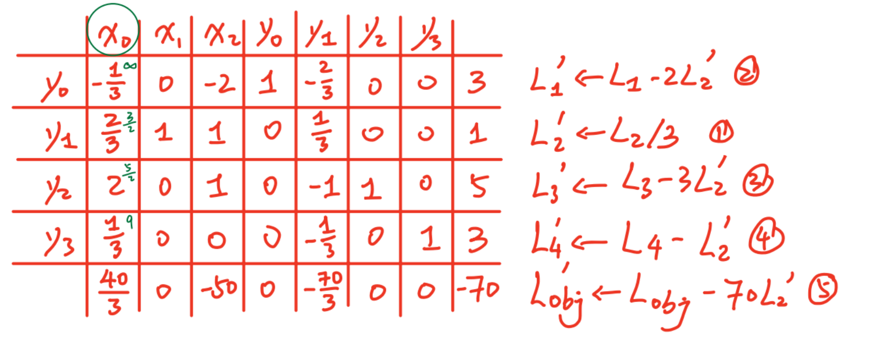
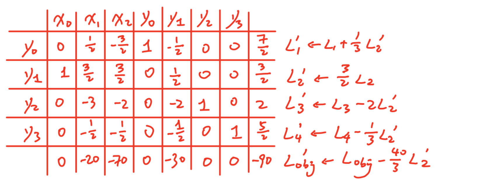

# Cour2 第二课 - La programmation linéaire (recherche opérationnelle) 线性规划（运筹学）

$\operatorname{opt}\{f(x)\mid x\in D\}$ 优化问题：在 $x\in D$ 的条件下优化 $f(x)$。

Le programme linéaire s'intéresse au cas où `f` est linéaire, et où `D` peut être décrit par un ensemble (fini) de contraintes affines. 线性规划研究的是这样一种情形：`f` 是线性的，并且 `D` 可以由一组有限个仿射约束来描述。

$\forall i,\ g_i(x)\ge 0$ avec $g_i$ affines ($i$ est fini). 对任意 $i$，$g_i(x)\ge 0$，其中 $g_i$ 是仿射函数（并且 $i$ 的个数是有限的）。

Donc un programme linéaire a la forme : 因此，一个线性规划具有如下形式：

$$
\begin{aligned}
\min/\max\quad &\{c_1x_1+c_2x_2+\cdots+c_nx_n\}
\end{aligned}
$$

Sous contraintes : 约束条件：

$$
\left\{
\begin{aligned}
a_{11}x_1+a_{12}x_2+\cdots+a_{1n}x_n &\le b_1\\
a_{21}x_1+a_{22}x_2+\cdots+a_{2n}x_n &\le b_2\\
&\vdots\\
a_{n1}x_1+a_{n2}x_2+\cdots+a_{nn}x_n &\le b_n
\end{aligned}
\right.
$$

programme linéaire. 这就是线性规划。

On peut aussi l'écrire : 也可以把它写成：

$$\max\{\,{}^tc\cdot x\mid Ax\le b\,\}$$

composante par composante. 这里的不等式是按分量逐个成立的。

## Modelisation du problème de l'ordonnancement 排程问题建模

Le problème de l'ordonnancement peut être représenté sous forme d'une programmation linéaire. 排程问题可以表示成一个线性规划问题。

- Variables de décision : pour toute tâche $i$, sa date de début $t_i$. 对每一个任务 $i$，它的开始时间 $t_i$。

- Contraintes : $\forall i,\ \forall j\in T_i,\ t_j+d_j\le t_i$, et $\forall i,\ t_i\ge 0$.

- Fonction objective : $\min\{\max\{t_i+d_i\}\}$.

On ajoute une variable de décision $f$, représentant la date de fin du projet : $\forall i,\ f\ge t_i+d_i$. 我们再加入一个决策变量 $f$，表示项目结束时间：$\forall i,\ f\ge t_i+d_i$。

La fonction objective peut alors être remplacée par $\min\{f\}$. 这样目标函数就可以改写成 $\min\{f\}$。

## Exemple 1 例 1

Exemple : pour fabriquer $1\ \mathrm{kg}$ de compotes. 例子：为了生产 $1\ \mathrm{kg}$ 果酱。

- pomme-fraise : $2\ \mathrm{kg}$ pomme, $1\ \mathrm{kg}$ fraise 苹果草莓果酱：需要 $2\ \mathrm{kg}$ 苹果和 $1\ \mathrm{kg}$ 草莓
- fraise : $1\ \mathrm{kg}$ pomme, $2\ \mathrm{kg}$ fraise 草莓果酱：需要 $1\ \mathrm{kg}$ 苹果和 $2\ \mathrm{kg}$ 草莓
- pomme : $3\ \mathrm{kg}$ pomme 苹果果酱：需要 $3\ \mathrm{kg}$ 苹果

L'usine reçoit chaque jour $3\ \mathrm{t}$ de pomme et $5\ \mathrm{t}$ de fraise. 工厂每天收到 $3\ \mathrm{t}$ 苹果和 $5\ \mathrm{t}$ 草莓。

Pour préparer $1\ \mathrm{t}$ de compote pomme-fraise, il faut $40\ \mathrm{h}$ de travail. 制作 $1\ \mathrm{t}$ 苹果草莓果酱需要 $40\ \mathrm{h}$ 的工作时间。

Pour $1\ \mathrm{t}$ de compote de fraise, il faut $30\ \mathrm{h}$ et pour $1\ \mathrm{t}$ de compote de pommes, $40\ \mathrm{h}$. 制作 $1\ \mathrm{t}$ 草莓果酱需要 $30\ \mathrm{h}$，制作 $1\ \mathrm{t}$ 苹果果酱需要 $40\ \mathrm{h}$。

L'usine a $80\ \mathrm{h}$ de travail par jour à disposition. 工厂每天有 $80\ \mathrm{h}$ 的工作时间可用。

Les capacités d'entreposage ne permettent pas de stocker plus de $4\ \mathrm{t}$ de compote chaque jour. 仓储能力不允许每天存放超过 $4\ \mathrm{t}$ 的果酱。

Les bénéfices par tonne de compotes sont de $70\,€$ pour les fraises, $60\,€$ pour les pomme-fraise, $20\,€$ pour les pommes. 每吨果酱的利润分别是：草莓果酱 $70\,€$，苹果草莓果酱 $60\,€$，苹果果酱 $20\,€$。

Notons : 记作：

- $x_1$ la quantité (en $\mathrm{t}$) de compote de pommes-fraise produite chaque jour $x_1$：每天生产的苹果草莓果酱数量（单位：吨）
- $x_2$ la quantité (en $\mathrm{t}$) de compote de fraise produite chaque jour $x_2$：每天生产的草莓果酱数量（单位：吨）
- $x_3$ la quantité (en $\mathrm{t}$) de compote de pommes produite chaque jour $x_3$：每天生产的苹果果酱数量（单位：吨）

L'objectif est de maximiser le bénéfice : $\max\{60x_1+70x_2+20x_3\}$. 目标是最大化利润：$\max\{60x_1+70x_2+20x_3\}$。

Les quantités de matières premières disponibles imposent que : 可用原材料数量给出以下约束：

$$
\begin{aligned}
2x_1+x_2+3x_3 &\le 3 \quad (\text{pommes})\\
x_1+2x_2 &\le 5 \quad (\text{fraise})
\end{aligned}
$$

Le temps de travail des ouvriers impose que : 工人的工作时间给出以下约束：

$$40x_1+30x_2+40x_3\le 80$$

La taille de l'entrepôt oblige à avoir : 仓库容量要求：

$$x_1+x_2+x_3\le 4$$

On a de plus : $x_1,x_2,x_3\ge 0$. 此外还有：$x_1,x_2,x_3\ge 0$。

## Rappel 回顾

Le problème au final est : 最终问题是：

$$
\begin{aligned}
\max\ &\{60x_1+70x_2+20x_3\}
\end{aligned}
$$

Sous contraintes : 约束条件：

$$
\left\{
\begin{aligned}
2x_1+x_2+3x_3 &\le 3\\
x_1+2x_2 &\le 5\\
40x_1+30x_2+40x_3 &\le 80\\
x_1+x_2+x_3 &\le 4\\
x_1,x_2,x_3 &\ge 0
\end{aligned}
\right.
$$

On considère le problème $\max\{\,{}^tc\cdot x\mid Ax\le b\,\}$. 我们考虑问题 $\max\{\,{}^tc\cdot x\mid Ax\le b\,\}$。

Intéressons-nous à la forme du domaine $\{Ax\le b\}$. 现在我们来关注定义域 $\{Ax\le b\}$ 的形状。

Une contrainte $A_jx\le b_j$ ($\sum_{i=1}^n a_{ji}x_i\le b_j$) définit un demi-espace de frontière l'hyperplan d'équation $A_jx=b_j$. 一个约束 $A_jx\le b_j$（即 $\sum_{i=1}^n a_{ji}x_i\le b_j$）定义了一个半空间，它的边界是超平面 $A_jx=b_j$。

$\{x\mid x\cdot a=0\}$ -> équation d'hyperplan passant par l'origine. $\{x\mid x\cdot a=0\}$ 对应一个经过原点的超平面方程。

$\{x\mid x\cdot a=b\}$ -> hyperplan. $\{x\mid x\cdot a=b\}$ 对应一个超平面。

Le domaine $\{Ax\le b\}$ est l'intersection des demi-espaces $\{A_j\cdot x\le b_j\}$. 定义域 $\{Ax\le b\}$ 是各个半空间 $\{A_j\cdot x\le b_j\}$ 的交集。

Il s'agit d'un polyèdre convexe : tout segment joignant deux points de ce polyèdre est intégralement contenu dedans. 这是一个凸多面体：连接该多面体中任意两点的整条线段都完全包含在其中。

On cherche à maximiser la fonction $f:x\in\mathbb{R}^n\mapsto {}^tc\cdot x\in\mathbb{R}$ sur le domaine $\{x\in\mathbb{R}^n\mid Ax\le b\}$. 我们要在定义域 $\{x\in\mathbb{R}^n\mid Ax\le b\}$ 上最大化函数 $f:x\in\mathbb{R}^n\mapsto {}^tc\cdot x\in\mathbb{R}$。

Or $\nabla f$ est constant et vaut $c\in\mathbb{R}^n$. 而 $\nabla f$ 是常向量，且等于 $c\in\mathbb{R}^n$。

Une ligne de niveau de $f$ est un ensemble de points $\{x\mid f(x)=k\}$ pour une constante $k$ ; le gradient en $x_0$ est nécessairement normal à la ligne de niveau $\{x\mid f(x)=f(x_0)\}$. $f$ 的一条等值线是点集 $\{x\mid f(x)=k\}$，其中 $k$ 是常数；在 $x_0$ 处的梯度必然垂直于等值线 $\{x\mid f(x)=f(x_0)\}$。

$$A_jx=b_j$$

Un sommet du polygone est forcément solution optimale. 多边形的某个顶点必然是最优解。

Tout optimum local d'une fonction linéaire sur un ensemble convexe est global. 在线性函数作用于凸集的情况下，任何局部最优都是全局最优。

## Algorithme du simplexe 单纯形算法

C'est une méthode de points frontières, qui va examiner les sommets du polygone jusqu'à trouver un sommet optimal. 这是一种边界点方法，它会依次考察多边形的顶点，直到找到最优顶点。

On a besoin que le problème soit sous la forme : 我们要求问题写成如下形式：

$$\max\{\,{}^tc\cdot x\mid Ax\le b,\ x\ge 0\,\}\quad \text{avec } b\ge 0$$

La condition $x\ge 0$ garantit que si $0$ est réalisable, c'est un sommet du polygone ($=$ une solution de base). 条件 $x\ge 0$ 保证如果 $0$ 是可行的，那么它就是多边形的一个顶点（也就是一个基解）。（原点 x=0 就是一个可行解，单纯形法需要一个起始的基可行解。）

La condition $b\ge 0$ garantit que $0$ est une solution réalisable. 条件 $b\ge 0$ 保证 $0$ 是一个可行解。

Ces deux conditions imposées à la forme du problème garantissent que $0$ est un sommet de départ de l'algorithme. 这两个对问题形式的要求保证 $0$ 是算法的出发顶点。

$\left(x^+,x^-,\ x=x^+-x^-\right)$ 正负变量分解：$x=x^+-x^-$。

On commence par transformer les contraintes d'inégalité en contraintes d'égalité, en introduisant pour chaque contrainte une variable d'écart. 我们首先把不等式约束转化为等式约束，为每一个约束引入一个松弛变量。

$\sum_{j=1}^n a_{ij}x_j\le b_i \Longleftrightarrow \sum_{j=1}^n a_{ij}x_j+y_i=b_i$, avec $y_i\ge 0$.

La variable d'écart représente l'écart entre disponibilité et utilisation de la ressource n° `i`. 松弛变量表示第 `i` 个资源的可用量与使用量之间的差值。

Une fois que l'on a des égalités, on peut travailler dessus de façon algébrique. 一旦把约束写成等式，我们就可以用代数方法处理它们。

La forme des équations ci-dessus, le fait que le coefficient de la variable $y_i$ est $1$ dans la contrainte n° $i$ et $0$ dans toutes les autres, permet de trouver une solution évidente : $\forall i,\ y_i=b_i$, $\forall j,\ x_j=0$. 上述方程组的形式，以及变量 $y_i$ 在第 $i$ 个约束中的系数为 $1$、在其他所有约束中的系数为 $0$，使我们能立刻得到一个显然的解：$\forall i,\ y_i=b_i$，$\forall j,\ x_j=0$。

Cette solution est associée à la valeur $0$ : ${}^tc\cdot x={}^tc\cdot 0=0$. 这个解对应的目标函数值为 $0$：${}^tc\cdot x={}^tc\cdot 0=0$。

L'algorithme du simplexe va transformer à chaque étape le problème posé par des manipulations "à la Gauss", en faisant toujours à maintenir cette structure (une sous-matrice identité). 单纯形算法在每一步都会通过“高斯式”的变换来改写问题，同时始终保持这种结构（即保留一个单位子矩阵）。

À chaque étape, la solution évidente sera un sommet du polygone adjacent à la solution évidente de l'itération précédente. 在每一步中，这个显然解都会对应于与前一次迭代的显然解相邻的一个多边形顶点。

## Exemple du simplexe 单纯形算法例子

Exemple : $\max\{60x_0+70x_1+20x_2\}$.

Sous contraintes : 约束条件：

$$
\begin{aligned}
x_0+2x_1 &\le 5\\
2x_0+x_1+3x_2 &\le 3\\
4x_0+3x_1+4x_2 &\le 8\\
x_0+x_1+x_2 &\le 4\\
x_0,x_1,x_2 &\ge 0
\end{aligned}
$$

Ce système est équivalent à : 这个系统等价于：

$$
\begin{aligned}
x_0+2x_1+y_0 &= 5\\
2x_0+x_1+3x_2+y_1 &= 3\\
4x_0+3x_1+4x_2+y_2 &= 8\\
x_0+x_1+x_2+y_3 &= 4\\
x_0,x_1,x_2,y_0,y_1,y_2,y_3 &\ge 0
\end{aligned}
$$

À partir de ce point, les variables d'écart ont exactement le même statut que les autres du point de vue de l'algo. 从这一刻起，从算法角度看，松弛变量和其他变量具有完全相同的地位。

Une étape consiste à sélectionner une variable hors-base (qui n'est pas face à une colonne de la matrice identité dans la formulation actuelle du problème) et à la faire entrer dans la base. Cela donne une valeur non-nulle dans la nouvelle solution évidente à une variable qui était à $0$ dans l'ancienne. 单纯形法的一步，是选取一个非基变量（即当前问题形式中不对应单位矩阵某一列的变量），并让它进入基中。这样一来，在新的显然解中，一个原来等于 $0$ 的变量会取得非零值。

On ne peut pas choisir une variable ayant un coefficient négatif dans la fonction objective : cela diminuerait la valeur de la solution évidente, et la convexité garantit que cela n'est jamais nécessaire. 我们不能选择目标函数中系数为负的变量作为入基变量；那会降低当前显然解的目标值，而凸性保证这永远不是必须的。

On peut choisir toute variable ayant un coefficient positif dans la fonction objective ; généralement on choisit celle ayant le coefficient le plus élevé (règle du pivot de Dantzig). 我们可以选择目标函数中任何系数为正的变量；通常选择系数最大的那个（Dantzig 枢轴规则）。

On fait alors entrer cette variable dans la base, à la place d'une variable qui s'y trouvait déjà pour maintenir la structure. 接着让这个变量进入基中，同时让一个已经在基中的变量离开，以保持原有结构。

Il faut choisir la variable qui va sortir de la base de façon à garantir que tous les membres droits des contraintes restent positifs ou nuls. 我们必须选择一个离开基的变量，使得所有约束右端项仍然保持非负。

Par exemple, si on fait entrer $x_0$ dans la base : 例如，如果让 $x_0$ 进入基：

$$
\begin{aligned}
x_0+2x_1+y_0 &= 5 &&\Rightarrow x_0\le 5\\
2x_0+x_1+3x_2+y_1 &= 3 &&\Rightarrow 2x_0\le 3 \Leftrightarrow x_0\le \tfrac32\\
4x_0+3x_1+4x_2+y_2 &= 8 &&\Rightarrow 4x_0\le 8 \Leftrightarrow x_0\le 2\\
x_0+x_1+x_2+y_3 &= 4 &&\Rightarrow x_0\le 4
\end{aligned}
$$

On est obligé, pour ce faire, de choisir de faire sortir de la base la variable associée à la contrainte qui restreint le plus la valeur de la variable qui entre dans la base. 因此，我们必须让与“对入基变量限制最强”的那个约束相对应的变量离开基。

On prend donc la contrainte associée à la variable que l'on fait sortir de la base ; on la divise par le coefficient qu'y a la variable que l'on fait entrer (`= faire apparaître le 1 de la colonne identité`). 因而我们取与出基变量对应的那条约束，并用入基变量在该约束中的系数去除这一整行（也就是在单位列中制造一个 `1`）。

Enfin, on retire à chacune des autres contraintes cette nouvelle contrainte multipliée par le coefficient de la variable qui entre dans la base (`= faire apparaître les 0`). 最后，再从其他每个约束中减去若干倍这条新约束，使入基变量在其他行中的系数都变成 `0`。

On fait de même pour la fonction objective. 对目标函数也做同样的处理。

On fait entrer $x_1$ dans la base (règle du pivot de Dantzig). 这里令 $x_1$ 入基（按照 Dantzig 枢轴规则）。

La première contrainte impose $2x_1\le 5 \Leftrightarrow x_1\le \tfrac52$, la 2ème que $3x_1\le 3 \Leftrightarrow x_1\le 1$, la 3ème que $3x_1\le 8 \Leftrightarrow x_1\le \tfrac83$, et la 4ème que $x_1\le 4$. 第一条约束给出 $2x_1\le 5 \Leftrightarrow x_1\le \tfrac52$，第二条给出 $3x_1\le 3 \Leftrightarrow x_1\le 1$，第三条给出 $3x_1\le 8 \Leftrightarrow x_1\le \tfrac83$，第四条给出 $x_1\le 4$。

La 2ème contrainte est la plus forte, et c'est donc à la place de $y_1$ que $x_1$ va entrer dans la base. 第二条约束最紧，因此 $x_1$ 将取代 $y_1$ 进入基。

La deuxième contrainte est équivalente à : $2x_0+3x_1+3x_2+y_1=3 \Leftrightarrow x_1=1-\tfrac23x_0-x_2-\tfrac13y_1$. 第二个约束等价于：$2x_0+3x_1+3x_2+y_1=3 \Leftrightarrow x_1=1-\tfrac23x_0-x_2-\tfrac13y_1$。

On remplace toutes les occurrences de $x_1$ par cette formule. 我们用这个式子替换所有出现的 $x_1$。

On obtient alors : 于是得到：

$$
\begin{aligned}
70+\max\left\{\tfrac{40}{3}x_0-50x_2-\tfrac{70}{3}y_1\right\}
\end{aligned}
$$

Sous contraintes : 约束条件：

$$
\left\{
\begin{aligned}
-\tfrac13x_0-2x_2-\tfrac23y_1+y_0 &= 3\\
-\tfrac23x_0+x_1+x_2-\tfrac13y_1 &= 1\\
2x_0+x_2-y_1+y_2 &= 5\\
\tfrac13x_0-\tfrac13y_1+y_3 &= 4\\
x_0,x_1,x_2,y_0,y_1,y_2,y_3 &\ge 0
\end{aligned}
\right.
$$

La nouvelle solution évidente est $y_0=3$, $x_1=1$, $y_2=5$, $y_3=4$, $x_0=x_2=y_1=0$. 新的显然解为 $y_0=3$，$x_1=1$，$y_2=5$，$y_3=4$，$x_0=x_2=y_1=0$。

Sa valeur est $70$. 它的目标函数值是 $70$。

On répète ces transformations jusqu'à ce que toutes les variables hors base aient des coefficients négatifs ou nuls dans la fonction objective : la solution évidente est alors solution optimale. 我们重复这些变换，直到所有非基变量在目标函数中的系数都小于或等于零：这时显然解就是最优解。

$x_0$ entre dans la base à la place de $x_1$. $x_0$ 进入基，取代 $x_1$。

$x_0=\tfrac32-\tfrac32x_1-\tfrac32x_2-\tfrac12y_1$. $x_0=\tfrac32-\tfrac32x_1-\tfrac32x_2-\tfrac12y_1$。

On obtient alors : 于是得到：

$$
\begin{aligned}
90+\max\{-20x_1-70x_2-30y_1\}
\end{aligned}
$$

Sous contraintes : 约束条件：

$$
\left\{
\begin{aligned}
\tfrac12x_1-\tfrac32x_2-\tfrac12y_1+y_0 &= \tfrac72\\
x_0+\tfrac32x_1+\tfrac32x_2+\tfrac12y_1 &= \tfrac32\\
-3x_1-2x_2-2y_1+y_2 &= 2\\
-\tfrac12x_1-\tfrac12x_2-\tfrac12y_1+y_3 &= \tfrac72\\
x_0,x_1,x_2,y_0,y_1,y_2,y_3 &\ge 0
\end{aligned}
\right.
$$

$(x_1,x_2,y_1)\in(\mathbb{R}_+)^3 \Rightarrow -20x_1-70x_2-30y_1$ est négatif. 对任意 $(x_1,x_2,y_1)\in(\mathbb{R}_+)^3$，$-20x_1-70x_2-30y_1$ 都是非正的。

Puisque $(0,0,0)$ est réalisable (c'est la solution évidente), c'est son maximum. 由于 $(0,0,0)$ 是可行的（这正是显然解），因此它就是最大值点。

Donc la solution évidente $y_0=\tfrac72$, $x_0=\tfrac32$, $y_2=2$, $y_3=\tfrac72$, $x_1=x_2=y_1=0$ est optimale. 因而显然解 $y_0=\tfrac72$，$x_0=\tfrac32$，$y_2=2$，$y_3=\tfrac72$，$x_1=x_2=y_1=0$ 是最优的。

Ainsi la solution optimale du problème de départ consiste à produire $1.5\ \mathrm{t}$ de compote pomme-fraise (et pas des autres types) pour un bénéfice de $90\,€$ : $x_0=1.5$, $x_1=0$, $x_2=0$. 因此，原问题的最优解是生产 $1.5\ \mathrm{t}$ 苹果草莓果酱（而不生产其他种类），对应利润为 $90\,€$：$x_0=1.5$，$x_1=0$，$x_2=0$。

## Tableau du simplexe 单纯形表

On peut aussi présenter les étapes du simplexe sous forme de tableau. 我们也可以把单纯形算法的步骤写成表的形式。

Le tableau du simplexe regroupe les coefficients des variables, les variables de base, les seconds membres et la ligne de la fonction objective. 单纯形表把变量系数、基变量、右端常数项以及目标函数行集中写在同一个表中。

À chaque pivot, on choisit une colonne entrante, puis une ligne sortante, et on effectue des opérations de type Gauss pour transformer la colonne pivot en colonne de base. 在每一次 pivot 中，我们先选入基列，再选出基行，然后做高斯型变换，把该 pivot 列变成基列。

Exemple : $\max\{60x_0+70x_1+20x_2\}$.

Sous contraintes : 约束条件：

$$
\begin{aligned}
x_0+2x_1 &\le 5\\
2x_0+3x_1+3x_2 &\le 3\\
4x_0+3x_1+4x_2 &\le 8\\
x_0+x_1+x_2 &\le 4\\
x_0,x_1,x_2 &\ge 0
\end{aligned}
$$

Ce système est équivalent à : 这个系统等价于：

$$
\begin{aligned}
x_0+2x_1+y_0 &= 5\\
2x_0+3x_1+3x_2+y_1 &= 3\\
4x_0+3x_1+4x_2+y_2 &= 8\\
x_0+x_1+x_2+y_3 &= 4\\
x_0,x_1,x_2,y_0,y_1,y_2,y_3 &\ge 0
\end{aligned}
$$

每次迭代先在目标函数行中选一个允许改进目标值的列作为入基列（最大化时通常选正系数里最大的），再只在该列系数严格大于 `0` 的约束行里做最小比值检验 `b_i/a_{ij}` 来选出基行并取其交点为 pivot；重复直到目标函数行中不再有可改进的系数（最大化时全都 `≤ 0`），若存在可改进列但该列所有约束系数都 `≤ 0`，则问题无界。
