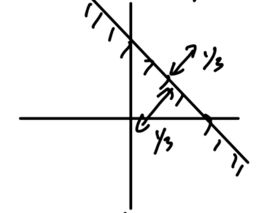
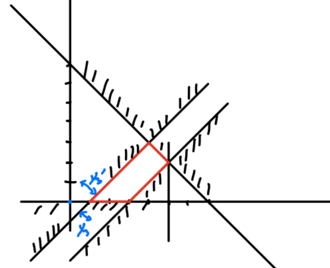

# Cour3 第三课 - Cas où `0` n'est pas réalisable 当 `0` 不可行时

## Rappel : algorithme du simplexe 回顾：单纯形算法

Rappel : algo simplexe `max { t c · x / Ax ≤ b, x ≥ 0 }`. 回顾：单纯形算法处理的问题是 `max { t c · x / Ax ≤ b, x ≥ 0 }`。

On prend la colonne `j` ayant le coefficient le plus élevé (ou un coefficient `> 0`) dans la fonction objective. 我们选取目标函数中系数最大的列 `j`（或者任取一个正系数列）。

On sélectionne la ligne `i` telle que `m_ij x_j ≤ b_i` impose la contrainte la plus forte sur `x_j`. 我们再选择满足 `m_ij x_j ≤ b_i` 中对 `x_j` 限制最强的那一行 `i`。

On transforme ensuite le tableau par des transformations à la "Gauss", pour que son coeff `(i,j)` vaille `1`, et toutes les autres cases de la colonne valent `0`, en maintenant les autres colonnes de la matrice identité. 随后对表做“高斯式”变换，使 `(i,j)` 位置的系数变成 `1`，该列其他位置都变成 `0`，同时保持其他基列仍构成单位矩阵。

On itère jusqu'à ce que la ligne de la fonction objective ne contienne que des valeurs `≤ 0`. 这样不断迭代，直到目标函数行里只剩下 `≤ 0` 的值为止。

`0` est solution non réalisable. `0` 是一个不可行解。

On ne peut alors exécuter l'algo du simplexe. 这时就不能直接执行单纯形算法。

Que faire quand `0` n'est pas réalisable ? 当 `0` 不可行时该怎么办？

Plutôt que d'interdire de "visiter" le sommet `0`, on va pénaliser la visite de points ne respectant pas toutes les contraintes. 与其禁止“访问”顶点 `0`，不如对那些不满足全部约束的点进行惩罚。

Considérons l'exemple : 考虑下面这个例子：

$$
\max\{2x_1-x_2\}
$$

Sous contraintes : 约束条件：

$$
\left\{
\begin{aligned}
x_1-x_2 &\le 3\\
x_1+x_2 &\le 7\\
x_1-x_2 &\ge 1\\
x_1 &\le 5\\
x_1,x_2 &\ge 0
\end{aligned}
\right.
$$

Dans ce problème, $0$ n'est pas réalisable car il ne respecte pas la contrainte $x_1-x_2\ge 1$. 在这个问题里，$0$ 不可行，因为它不满足约束 $x_1-x_2\ge 1$。

On relaxe cette contrainte, mais on pénalise le fait de ne pas la respecter. 我们放松这个约束，但同时对“不满足它”这件事加入惩罚。

$$x_1-x_2\ge 1 \Longleftrightarrow -x_1+x_2\le -1$$

$$\Longleftrightarrow \exists\, y_3\ge 0,\ -x_1+x_2+y_3=-1$$

$$\Longleftrightarrow \exists\, y_3\ge 0,\ x_1-x_2-y_3=1$$

Comme on ne respecte pas cette contrainte initialement, la variable d'écart devrait prendre un coefficient $-1$. 由于一开始并不满足这条约束，所以这个松弛变量会带上一个 $-1$ 的系数。

On introduit une variable, souvent appelée artificielle $y_3'$, qui représente l'éloignement entre la solution courante et la contrainte qu'elle ne respecte pas. 我们引入一个变量，通常称为人工变量 $y_3'$，它表示当前解与其不满足的约束之间的“距离”。

Dans la fonction objective, on pénalise cette variable artificielle d'un coefficient $M$ très grand. 在目标函数中，我们给这个人工变量加上一个非常大的惩罚系数 $M$。

$M$ est sans valeur numérique précise, mais plus grand que toute autre quantité apparaissant au cours de l'algorithme. $M$ 不需要有精确数值，只要它比算法过程中出现的任何其他量都大即可。

La contrainte devient $x_1-x_2-y_3+y_3'=1$, avec $y_3'\ge 0$. 该约束于是变成 $x_1-x_2-y_3+y_3'=1$，其中 $y_3'\ge 0$。

La fonction objective devient $2x_1-x_2-My_3'$. 目标函数于是变成 $2x_1-x_2-My_3'$。

Ainsi, si $y_3'>0$ dans une solution que l'on considère, la fonction objective est pénalisée d'une quantité dépendant de $M$, et l'on peut ainsi voir que cette solution n'est pas réalisable, ou plus cette solution est moins bonne que toute solution réalisable. 因而，如果某个候选解中 $y_3'>0$，目标函数就会受到一个依赖于 $M$ 的惩罚；这说明该解不可行，或者至少它会比任何可行解更差。

L'algorithme du simplexe permet alors de trouver une solution au problème transformé. 于是，单纯形算法就可以用来求解这个变换后的问题。

- Si cette solution ne fait plus intervenir $M$ et $y_3'$, c'est une solution réalisable du problème initial, et comme elle est optimale pour le problème transformé, elle l'est aussi pour le problème initial. 如果最后得到的解不再涉及 $M$ 和 $y_3'$，那么它就是原问题的一个可行解；并且由于它对变换后的问题是最优的，所以对原问题也最优。

-Si cette solution fait intervenir $M$ et $y_3'$, alors le problème initial ne peut pas avoir de solution réalisable. 如果最后的解仍然涉及 $M$ 和 $y_3'$，那么原问题就不可能存在可行解。

Pour l'exemple précédent, on écrit : 对上面的例子，我们写成：

$$
\max\{2x_1-x_2-My_3'\}
$$

Sous contraintes :

$$
\left\{
\begin{aligned}
2x_1-x_2+y_1 &= 3\\
x_1+x_2+y_2 &= 7\\
x_1-x_2-y_3+y_3' &= 1\\
x_1+y_4 &= 5\\
x_1,x_2,y_1,y_2,y_3,y_3',y_4 &\ge 0
\end{aligned}
\right.
$$

## Tableau initial avec variable artificielle 含人工变量的初始表

Dans le tableau initial, comme $y_3'$ est dans la base, on n'a pas de $0$ dans la fonction objective sous cette colonne. 在初始表中，由于 $y_3'$ 在基里，所以目标函数行在这一列下面不会自然出现 $0$。

On ajoute donc $ML_3$ à $L_{\mathrm{obj}}$. 因此要把 $ML_3$ 加到目标函数行 $L_{\mathrm{obj}}$ 上。

| Base | $x_1$ | $x_2$ | $y_1$ | $y_2$ | $y_3$ | $y_3'$ | $y_4$ | Second membre | Opérations |
| --- | ---: | ---: | ---: | ---: | ---: | ---: | ---: | ---: | --- |
| $y_1$ | $1$ | $-1$ | $1$ | $0$ | $0$ | $0$ | $0$ | $3$ |  |
| $y_2$ | $1$ | $1$ | $0$ | $1$ | $0$ | $0$ | $0$ | $7$ |  |
| $y_3$ | $1$ | $-1$ | $0$ | $0$ | $-1$ | $1$ | $0$ | $1$ |  |
| $y_4$ | $1$ | $0$ | $0$ | $0$ | $0$ | $0$ | $1$ | $5$ |  |
| $L_M$ | $0$ | $0$ | $0$ | $0$ | $0$ | $-M$ | $0$ | $0$ |  |
| $L_{\mathrm{obj}}$ | $M+2$ | $-M-1$ | $0$ | $0$ | $-M$ | $0$ | $0$ | $M$ | $L_{\mathrm{obj}} \leftarrow L_{\mathrm{obj}} + ML_3$ |

avec 其中：

$$
L_{\mathrm{obj}} \leftarrow L_{\mathrm{obj}} + ML_3
$$

La solution évidente avec $y_3'=1$ a une valeur de $-M$. 显然解中 $y_3'=1$ 时，对应目标函数值为 $-M$。

Après cela, on exécute l'algo du simplexe comme d'habitude. 在这之后，就像平常一样执行单纯形算法。

Après élimination de la colonne artificielle, on obtient par exemple : 消去人工变量所在列后，例如可得到：

| Base | $x_1$ | $x_2$ | $y_1$ | $y_2$ | $y_3$ | $y_3'$ | $y_4$ | Second membre | Opérations |
| --- | ---: | ---: | ---: | ---: | ---: | ---: | ---: | ---: | --- |
| $y_1$ | $0$ | $0$ | $1$ | $0$ | $1$ | $-1$ | $0$ | $2$ | $L_1' \leftarrow L_1 - L_3'$ |
| $y_2$ | $0$ | $2$ | $0$ | $1$ | $1$ | $-1$ | $0$ | $6$ | $L_2' \leftarrow L_2 - L_3'$ |
| $y_3$ | $1$ | $-1$ | $0$ | $0$ | $-1$ | $1$ | $0$ | $1$ | $L_3' \leftarrow L_3$ |
| $y_4$ | $0$ | $1$ | $0$ | $0$ | $1$ | $-1$ | $1$ | $4$ | $L_4' \leftarrow L_4 - L_3'$ |
| $L_M$ | $0$ | $0$ | $0$ | $0$ | $0$ | $-M$ | $0$ | $0$ | $L_M' \leftarrow L_M - ML_3'$ |
| $L_{\mathrm{obj}}$ | $0$ | $1$ | $0$ | $0$ | $2$ | $-2$ | $0$ | $-2$ | $L_{\mathrm{obj}}' \leftarrow L_{\mathrm{obj}} - 2L_3'$ |

et ensuite : 再下一步：

| Base | $x_1$ | $x_2$ | $y_1$ | $y_2$ | $y_3$ | $y_3'$ | $y_4$ | Second membre | Opérations |
| --- | ---: | ---: | ---: | ---: | ---: | ---: | ---: | ---: | --- |
| $y_1$ | $0$ | $0$ | $1$ | $0$ | $1$ | $-1$ | $0$ | $2$ | $L_1' \leftarrow L_1$ |
| $y_2$ | $0$ | $2$ | $-1$ | $1$ | $0$ | $0$ | $0$ | $4$ | $L_2' \leftarrow L_2 - L_1'$ |
| $x_1$ | $1$ | $-1$ | $1$ | $0$ | $0$ | $0$ | $0$ | $3$ | $L_3' \leftarrow L_3 + L_1'$ |
| $y_4$ | $0$ | $1$ | $-1$ | $0$ | $0$ | $0$ | $1$ | $2$ | $L_4' \leftarrow L_4 - L_1'$ |
| $L_M$ | $0$ | $0$ | $0$ | $0$ | $0$ | $-M$ | $0$ | $0$ | $L_M' \leftarrow L_M - 0L_1'$ |
| $L_{\mathrm{obj}}$ | $0$ | $1$ | $2$ | $0$ | $0$ | $0$ | $0$ | $-6$ | $L_{\mathrm{obj}}' \leftarrow L_{\mathrm{obj}} - 2L_1'$ |

Cette colonne ne sert plus. 这个人工变量对应的列之后就不再使用了。

## Deuxième exemple 第二个例子

Considérons : 考虑：

$$
\max\{3x_1+7x_2\}
$$

Sous contraintes : 约束条件：

$$
\left\{
\begin{aligned}
x_1+3x_2 &\le 4\\
x_1+x_2 &\le 2\\
x_2-x_1 &\ge 2\\
x_1,x_2 &\ge 0
\end{aligned}
\right.
$$

On transforme le problème en : 我们把问题变换成：

$$
\max\{3x_1+7x_2-My_3'\}
$$

Sous contraintes : 约束条件：

$$
\left\{
\begin{aligned}
x_1+3x_2+y_1 &= 4\\
x_1+x_2+y_2 &= 2\\
-x_1+x_2-y_3+y_3' &= 2\\
x_1,x_2,y_1,y_2,y_3,y_3' &\ge 0
\end{aligned}
\right.
$$

Là encore, on ajoute $ML_3$ à $L_{\mathrm{obj}}$ pour initialiser correctement le tableau. 这里同样需要把 $ML_3$ 加到 $L_{\mathrm{obj}}$，以便正确初始化单纯形表。

## Séparation et évaluation 分支与定界

Pour résoudre le problème $B$, on peut résoudre les problèmes $B_1$ et $B_2$, puis choisir la meilleure des deux solutions. 为了解决问题 $B$，我们可以先解决子问题 $B_1$ 和 $B_2$，然后从两者中选出更好的那个解。

Il s'agit d'un mécanisme récursif. 这是一个递归机制。

On dérécurse ce mécanisme, ce qui introduit une pile d'appels, mais on choisit de remplacer cette pile par une file à priorité, permettant de traiter les problèmes offrant les meilleures perspectives. 我们把这个递归机制改写成非递归形式，这会引入一个调用栈；但通常我们选择用一个优先队列来替代它，从而优先处理那些最有希望的子问题。

Ces perspectives sont mesurées par l'évaluation, qui fournit avec relativement peu de calculs une borne : inférieure pour un problème de minimisation et supérieure pour un problème de maximisation. 这些“前景”由评价函数来衡量，它用相对较少的计算给出一个界：对于最小化问题给出下界，对于最大化问题给出上界。

Pour évaluer les problèmes, on utilise souvent ce qu'on appelle des relaxations continues. 为了评价各个子问题，我们经常使用所谓的连续松弛。

On fait "comme si" des variables discrètes étaient en fait continues. 也就是说，我们暂时把离散变量当成连续变量来处理。

## Programmation linéaire en nombres entiers 整数线性规划

Considérons le problème $(P_0)$ : 考虑问题 $(P_0)$：

$$
\max\{5x_1+7x_2\}
$$

Sous contraintes : 约束条件：

$$
\left\{
\begin{aligned}
-2x_1+2x_2 &\le 3\\
3x_1+2x_2 &\le 10\\
2x_1+3x_2 &\le 9\\
x_1,x_2 &\in \mathbb{N}
\end{aligned}
\right.
$$

On relaxe ce problème continûment. 我们对这个问题做连续松弛。

$(P_0')$ : $(P_0')$：

$$
\max\{5x_1+7x_2\}
$$

Sous contraintes : 约束条件：

$$
\left\{
\begin{aligned}
-2x_1+2x_2 &\le 3\\
3x_1+2x_2 &\le 10\\
2x_1+3x_2 &\le 9\\
x_1,x_2 &\ge 0
\end{aligned}
\right.
$$

La solution optimale de $(P_0')$ est $(2.4,1.4)$ de valeur $21.8$. $(P_0')$ 的最优解是 $(2.4,1.4)$，目标值为 $21.8$。

Cette solution n'est pas entière, donc on sépare. 这个解不是整数解，因此我们要进行分支。

On crée deux sous-problèmes : $x_1\le 2$ et $x_1\ge 3$. 我们于是创建两个子问题：$x_1\le 2$ 和 $x_1\ge 3$。

Le premier sous-problème $P_1$ admet une borne $\le \dfrac{65}{3}$. 第一个子问题 $P_1$ 的上界是 $\le \dfrac{65}{3}$。

Le second sous-problème $P_2$ admet une borne $\le \dfrac{37}{2}$. 第二个子问题 $P_2$ 的上界是 $\le \dfrac{37}{2}$。

Dans $P_2$, on pose $x_1'=x_1-3$, donc $x_1=x_1'+3$. 在 $P_2$ 中，我们令 $x_1'=x_1-3$，于是 $x_1=x_1'+3$。

Le problème devient : 问题变成：

$$
15+\max\{5x_1'+7x_2\}
$$

Sous contraintes : 约束条件：

$$
\left\{
\begin{aligned}
-2x_1'+2x_2 &\le 9\\
3x_1'+2x_2 &\le 1\\
2x_1'+3x_2 &\le 3\\
x_1',x_2 &\ge 0
\end{aligned}
\right.
$$

Dans l'arbre de séparation, on continue ensuite en branchant selon les variables fractionnaires restantes. 在分支树中，接下来继续对仍然取分数值的变量进行分支。

Par exemple, pour $P_1$, on sépare ensuite selon $x_2\le 1$ et $x_2\ge 2$. 例如，对 $P_1$，接下来可以继续按 $x_2\le 1$ 和 $x_2\ge 2$ 分支。

Le noeud $P_3$ donne la solution entière $(2,1)$ de valeur $17$. 节点 $P_3$ 给出整数解 $(2,1)$，其目标值为 $17$。

Les autres noeuds sont ensuite évalués ou élagués selon leur borne. 其他节点则根据它们的界继续被评价或剪枝。
