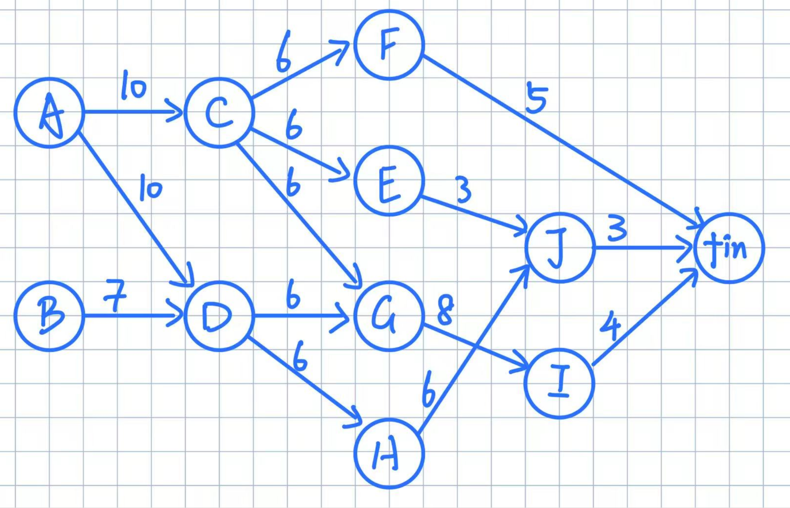
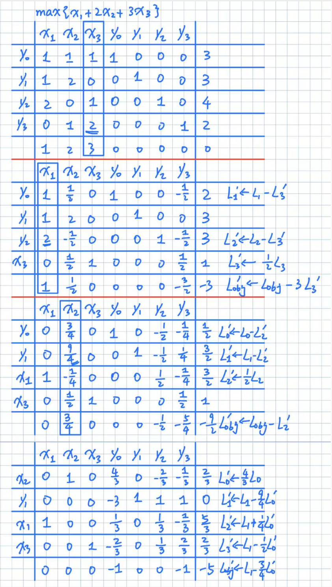
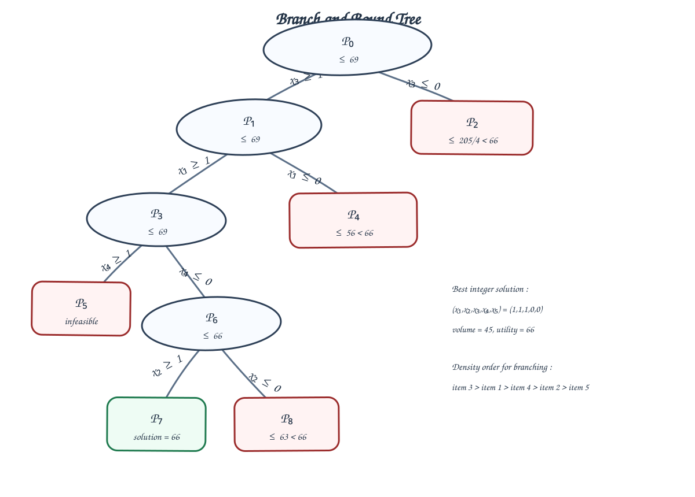

# Examen de recherche opérationnelle SS1 运筹学考试 SS1

9 mai 2025

## Exercice 1 : Ordonnancement 练习 1：排程

Dans le tableau ci-dessous sont récapitulées les 10 principales tâches d'un projet, avec l'estimation de la durée probable de chacune ainsi que les contraintes d'antériorité. 下表汇总了一个项目中的 10 个主要任务，并给出了每个任务的预计工期以及前置约束。

| Nom de la tâche 任务名称 | Durée 工期 | Antériorités 前置关系 |
| --- | ---: | --- |
| A | 10 | - |
| B | 7 | - |
| C | 6 | A |
| D | 6 | A, B |
| E | 3 | C |
| F | 5 | C |
| G | 8 | C, D |
| H | 6 | D |
| I | 4 | G |
| J | 3 | E, H |

1. Résoudre ce problème par la méthode des potentiels. Indiquer clairement la durée totale minimum et le calendrier prévisionnel d'exécution des tâches. 用势方法求解这个问题，并清楚给出最短总工期和任务的预计执行日程。
2. Quelles sont les tâches critiques ? Pour les autres tâches, donner les marges totales et libres. 哪些是关键任务？对于其他任务，给出总时差和自由时差。

| Tâche 任务 | date au plus tôt 最早开始 | date au plus tard 最晚开始 | marge totale 总时差 | marge libre 自由时差 |
| --- | --- | --- | --- | --- |
| A | 0 | 0 | 0 | 0 |
| B | 0 | 3 | 3 | 3 |
| C | 10 | 10 | 0 | 0 |
| D | 10 | 10 | 0 | 0 |
| E | 16 | 22 | 6 | 3 |
| F | 16 | 23 | 7 | 5 |
| G | 16 | 16 | 0 | 0 |
| H | 16 | 19 | 3 | 0 |
| I | 24 | 24 | 0 | 0 |
| J | 22 | 25 | 3 | 3 |
| fin | 28 | 28 | 0 | 0 |

Durée totale minimum : `28`. 最短总工期：`28`。

les tâches critiques sont : `A`, `C`, `D`, `G`, `I`。关键任务是：`A`、`C`、`D`、`G`、`I`。

les chemins critiques sont : `A -> C -> G -> I` et `A -> D -> G -> I`。关键路径是：`A -> C -> G -> I` 和 `A -> D -> G -> I`。

## Exercice 2 : Programmation linéaire 练习 2：线性规划

Résolvez le programme linéaire ci-dessous avec l'algorithme du simplexe : 用单纯形算法求解下面的线性规划：

$$\max \{x_1 + 2x_2 + 3x_3\}$$

s.c.

$$
\begin{cases}
x_1 + x_2 + x_3 \leq 3 \\
x_1 + 2x_2 \leq 3 \\
2x_1 + x_3 \leq 4 \\
x_2 + 2x_3 \leq 2 \\
x_1, x_2, x_3 \geq 0
\end{cases}$$

Réponse:

s.c.

$$\max \{x_1 + 2x_2 + 3x_3\}$$

s.c.

$$
\begin{cases}
x_1 + x_2 + x_3 + y_0 = 3 \\
x_1 + 2x_2 + y_1 = 3 \\
2x_1 + x_3 + y_2 = 4 \\
x_2 + 2x_3 + y_3 = 2 \\
x_1, x_2, x_3, y_0, y_1, y_2, y_3 \geq 0
\end{cases}$$

Alors quand (x1, x2, x3) = (5/3, 2/3, 2/3), la valeur optimale est 5.

## Exercice 3 : Modélisation 练习 3：建模

On cherche à produire un bronze, alliage de cuivre, d'étain, et de plomb. Cet alliage devra contenir au moins deux fois plus de cuivre que d'étain, et trois fois plus que de plomb. Il devra contenir moins de plomb que d'étain, et au moins un quart d'étain. 我们希望生产一种青铜，即由铜、锡和铅组成的合金。该合金中铜的含量至少应是锡的两倍、铅的三倍；铅的含量必须少于锡，并且锡至少占总量的四分之一。

Le plomb coûte 10€ la tonne, l'étain 15, et le cuivre 12. 铅每吨 10 欧元，锡每吨 15 欧元，铜每吨 12 欧元。

On cherche la proportion (en pourcentage) de chacun des composants qui minimise le coût de production. 我们希望求出各成分的百分比，使生产成本最小。

1. Modélisez ce problème sous forme de programme linéaire en précisant ce que représente chacune des variables que vous utiliserez. 将该问题建模为线性规划，并说明每个变量表示什么。
2. Exprimez une variable en fonction des autres et simplifiez le programme linéaire de la question précédente. 用其他变量表示其中一个变量，并化简上一问得到的线性规划。
3. Mettez ce programme linéaire sous forme standard. 将该线性规划写成标准形式。

### Réponse 答案

On note : 记作：

- $x_1$ : proportion de cuivre dans l’alliage $x_1$：合金中铜的比例
- $x_2$ : proportion d’étain dans l’alliage $x_2$：合金中锡的比例
- $x_3$ : proportion de plomb dans l’alliage $x_3$：合金中铅的比例

Comme il s’agit de proportions, on a : 因为这里表示的是比例，所以有：

$$
x_1+x_2+x_3=1
$$

avec : 并且：

$$
x_1,x_2,x_3\ge 0
$$

#### 1. Modélisation 建模

Le coût de production à minimiser est : 要最小化的生产成本为：

$$
\min\; 12x_1+15x_2+10x_3
$$

Les contraintes traduisent l’énoncé : 约束由题意直接得到：

- le cuivre est au moins deux fois l’étain 铜至少是锡的两倍：
$$x_1\ge 2x_2$$

- le cuivre est au moins trois fois le plomb 铜至少是铅的三倍：
$$x_1\ge 3x_3$$

- le plomb est inférieur à l’étain 铅少于锡：
$$x_3\le x_2$$

- l’alliage contient au moins un quart d’étain 合金中锡至少占四分之一：
$$x_2\ge \frac14$$

Donc le programme linéaire est : 所以线性规划模型为：

$$
\min\; 12x_1+15x_2+10x_3
$$

Sous contraintes : 约束条件：

$$
\left\{
\begin{aligned}
x_1+x_2+x_3 &= 1 \\
x_1 &\ge 2x_2 \\
x_1 &\ge 3x_3 \\
x_3 &\le x_2 \\
x_2 &\ge \frac14 \\
x_1,x_2,x_3 &\ge 0
\end{aligned}
\right.
$$

#### 2. Simplification 化简

On exprime une variable en fonction des autres : 用其余变量表示一个变量：

$$
x_1=1-x_2-x_3
$$

En remplaçant dans la fonction objectif : 代入目标函数：

$$
12x_1+15x_2+10x_3
=12(1-x_2-x_3)+15x_2+10x_3
=12+3x_2-2x_3
$$

Comme $12$ est une constante, on peut minimiser : 因为 $12$ 是常数，所以等价于最小化：

$$
\min\; (3x_2-2x_3)
$$

Les contraintes deviennent : 约束变为：

$$
1-x_2-x_3\ge 2x_2
\Longleftrightarrow
3x_2+x_3\le 1
$$

$$
1-x_2-x_3\ge 3x_3
\Longleftrightarrow
x_2+4x_3\le 1
$$

$$
x_3\le x_2
$$

$$
x_2\ge \frac14
$$

$$
x_2,x_3\ge 0
$$

Donc le programme simplifié est : 所以化简后的线性规划为：

$$
\min\; (3x_2-2x_3)
$$

Sous contraintes : 约束条件：

$$
\left\{
\begin{aligned}
3x_2+x_3 &\le 1 \\
x_2+4x_3 &\le 1 \\
x_3 &\le x_2 \\
x_2 &\ge \frac14 \\
x_2,x_3 &\ge 0
\end{aligned}
\right.
$$

#### 3. Forme standard 标准形式

On remplacer $x_2$ a $x_2 - 1/4$

$$
\max\; (-3x_2+2x_3)
$$

Sous contraintes : 约束条件：

$$
\left\{
\begin{aligned}
3x_2+x_3 &\le 1 \\
x_2+4x_3 &\le 1 \\
x_3-x_2 &\le 0 \\
-x_2 &\le -\frac14 \\
x_2,x_3 &\ge 0
\end{aligned}
\right.
$$

## Exercice 4 : Méthode du grand \(M\) 练习 4：大 \(M\) 法

1. Mettez le programme linéaire ci-dessous sous forme standard. 将下面的线性规划写成标准形式。
2. Montrez que 0 n'est pas une solution réalisable, et dessinez le tableau de simplexe associé à ce problème en utilisant la méthode du grand \(M\). 说明 0 不是一个可行解，并用大 \(M\) 法写出该问题对应的单纯形表。
3. Trouvez une solution optimale au programme en utilisant l'algorithme du simplexe. 用单纯形算法求出该问题的最优解。

$$\min \{x_2 - x_1\}$$

s.c.

$$
\begin{cases}
x_1 + x_2 \geq 1 \\
x_1 \leq 3 \\
x_2 - 2x_1 \leq 4 \\
x_1, x_2 \geq 0
\end{cases}
$$

### Réponse  答案

On réécrit d'abord le problème sous forme de maximisation : 先把问题改写成最大化形式：

$$
\max \{x_1-x_2\}
$$

Sous contraintes : 约束保持不变：

$$
\left\{
\begin{aligned}
x_1+x_2 &\ge 1 \\
x_1 &\le 3 \\
x_2-2x_1 &\le 4 \\
x_1,x_2 &\ge 0
\end{aligned}
\right.
$$

Puis on introduit la variable artificielle et la pénalité du grand $M$ : 然后引入人工变量和大 $M$ 惩罚项：

$$
\max \{x_1-x_2-My_1'\}
$$

Sous contraintes : 约束为：

$$
\left\{
\begin{aligned}
x_1+x_2-y_1+y_1' &= 1 \\
x_1+y_2 &= 3 \\
-2x_1+x_2+y_3 &= 4 \\
x_1,x_2,y_1,y_1',y_2,y_3 &\ge 0
\end{aligned}
\right.
$$

La solution nulle n'est pas réalisable, car la première contrainte impose $x_1+x_2\ge 1$. 零解不是可行解，因为第一条约束要求 $x_1+x_2\ge 1$。

#### Tableau initial 初始表

| Base | $x_1$ | $x_2$ | $y_1$ | $y_1'$ | $y_2$ | $y_3$ | Second membre | Opérations |
| --- | ---: | ---: | ---: | ---: | ---: | ---: | ---: | --- |
| $y_1'$ | $1$ | $1$ | $-1$ | $1$ | $0$ | $0$ | $1$ | |
| $y_2$ | $1$ | $0$ | $0$ | $0$ | $1$ | $0$ | $3$ | |
| $y_3$ | $-2$ | $1$ | $0$ | $0$ | $0$ | $1$ | $4$ | |
| $L_M$ | $0$ | $0$ | $0$ | $-M$ | $0$ | $0$ | $0$ | |
| $L'_{\mathrm{obj}}$ | $1$ | $-1$ | $0$ | $0$ | $0$ | $0$ | $0$ | $L_{\mathrm{obj}}\leftarrow L'_{\mathrm{obj}}+ML_1$ |

Le tableau de l'objectif combiné est alors : 合并目标函数行后得到：

| Base | $x_1$ | $x_2$ | $y_1$ | $y_1'$ | $y_2$ | $y_3$ | Second membre |
| --- | ---: | ---: | ---: | ---: | ---: | ---: | ---: |
| $L_{\mathrm{obj}}$ | $M+1$ | $M-1$ | $-M$ | $0$ | $0$ | $0$ | $M$ |

On choisit alors la colonne $x_1$, et $y_1'$ sort de la base. 于是选择 $x_1$ 列入基，$y_1'$ 出基。

#### Itération 1 第一次迭代

| Base | $x_1$ | $x_2$ | $y_1$ | $y_1'$ | $y_2$ | $y_3$ | Second membre | Opérations |
| --- | ---: | ---: | ---: | ---: | ---: | ---: | ---: | --- |
| $x_1$ | $1$ | $1$ | $-1$ | $1$ | $0$ | $0$ | $1$ | $L_1'=L_1$ |
| $y_2$ | $0$ | $-1$ | $1$ | $-1$ | $1$ | $0$ | $2$ | $L_2'=L_2-L_1'$ |
| $y_3$ | $0$ | $3$ | $-2$ | $2$ | $0$ | $1$ | $6$ | $L_3'=L_3+2L_1'$ |
| $L_M$ | $0$ | $0$ | $0$ | $-M$ | $0$ | $0$ | $0$ | $L_M'=L_M-0L_1'$ |
| $L'_{\mathrm{obj}}$ | $0$ | $-2$ | $1$ | $-1$ | $0$ | $0$ | $-1$ | $L'_{\mathrm{obj}}{}'=L'_{\mathrm{obj}}-L_1'$ |

Le nouvel objectif combiné vaut : 此时合并后的目标函数行为：

| Base | $x_1$ | $x_2$ | $y_1$ | $y_1'$ | $y_2$ | $y_3$ | Second membre |
| --- | ---: | ---: | ---: | ---: | ---: | ---: | ---: |
| $L_{\mathrm{obj}}$ | $0$ | $-2$ | $1$ | $-M-1$ | $0$ | $0$ | $-1$ |

On choisit alors la colonne $y_1$, et $y_2$ sort de la base. 于是选择 $y_1$ 列入基，$y_2$ 出基。

#### Itération 2 第二次迭代

| Base | $x_1$ | $x_2$ | $y_1$ | $y_1'$ | $y_2$ | $y_3$ | Second membre | Opérations |
| --- | ---: | ---: | ---: | ---: | ---: | ---: | ---: | --- |
| $x_1$ | $1$ | $0$ | $0$ | $0$ | $1$ | $0$ | $3$ | $L_1''=L_1'+L_2'$ |
| $y_1$ | $0$ | $-1$ | $1$ | $-1$ | $1$ | $0$ | $2$ | $L_2''=L_2'$ |
| $y_3$ | $0$ | $1$ | $0$ | $0$ | $2$ | $1$ | $10$ | $L_3''=L_3'+2L_2'$ |
| $L_M$ | $0$ | $0$ | $0$ | $-M$ | $0$ | $0$ | $0$ | |
| $L'_{\mathrm{obj}}$ | $0$ | $-1$ | $0$ | $0$ | $-1$ | $0$ | $-3$ | $L'_{\mathrm{obj}}{}''=L'_{\mathrm{obj}}{}'-L_2'$ |

Le dernier objectif combiné est : 最后合并后的目标函数行为：

| Base | $x_1$ | $x_2$ | $y_1$ | $y_1'$ | $y_2$ | $y_3$ | Second membre |
| --- | ---: | ---: | ---: | ---: | ---: | ---: | ---: |
| $L_{\mathrm{obj}}$ | $0$ | $-1$ | $0$ | $-M$ | $-1$ | $0$ | $-3$ |

Tous les coefficients utiles sont alors non positifs, donc on s'arrête. 此时所有还能改进目标值的系数都已非正，因此算法停止。

La solution optimale est donc : 最优解为：

$$
x_1^*=3,\qquad x_2^*=0
$$

Ici, $x_2$ n'est pas une variable de base, donc $x_2^*=0$. 这里，$x_2$ 不是基变量，因此 $x_2^*=0$。

La valeur optimale du problème de maximisation est : 最大化问题的最优值为：

$$
\max(x_1-x_2)=3
$$

Donc, pour le problème initial : 所以对原最小化问题来说：

$$
\min(x_2-x_1)=-3
$$

Réponse finale : 最终答案：

$$
(x_1^*,x_2^*)=(3,0),\qquad z_{\min}=-3
$$

## Exercice 5 : Branch and Bound 练习 5：分支定界法

On cherche à remplir un sac à dos avec les objets ci-dessous : 我们希望用下列物品装满一个背包：

| | 1 | 2 | 3 | 4 | 5 |
| --- | ---: | ---: | ---: | ---: | ---: |
| utilité (€) 效用 | 27 | 9 | 30 | 16 | 6,5 |
| volume (l) 体积 | 18 | 12 | 15 | 16 | 13 |

Le sac à dos a une capacité de 45. Après avoir ordonné les objets par utilité volumique décroissante, déterminez, par une méthode de séparation et évaluation, un remplissage du sac à dos maximisant son utilité sans dépasser sa capacité. 背包容量为 45。请先按单位体积效用从高到低排列这些物品，然后用分支与评价方法求出一个不超过容量且总效用最大的装包方案。

### Réponse 答案

On introduit des variables binaires : 引入 0-1 决策变量：

$$
x_i=
\begin{cases}
1 & \text{si l'objet } i \text{ est choisi} \\
0 & \text{sinon}
\end{cases}
\qquad (i=1,\dots,5)
$$

Le problème initial est donc : 原问题为：

$$
(P_0)\quad
\max \{27x_1+9x_2+30x_3+16x_4+6.5x_5\}
$$

Sous contraintes : 约束为：

$$
\left\{
\begin{aligned}
18x_1+12x_2+15x_3+16x_4+13x_5 &\le 45 \\
x_1,x_2,x_3,x_4,x_5 &\in \{0,1\}
\end{aligned}
\right.
$$

Les utilités volumiques sont : 单位体积效用为：

$$
\frac{30}{15}=2,\qquad
\frac{27}{18}=1.5,\qquad
\frac{16}{16}=1,\qquad
\frac{9}{12}=0.75,\qquad
\frac{6.5}{13}=0.5
$$

Donc l'ordre décroissant est : 因此按单位体积效用递减排序为：

$$
3 \succ 1 \succ 4 \succ 2 \succ 5
$$

On branche dans cet ordre. 我们按这个顺序分支。

Les sous-problèmes sont définis précisément par : 各子问题精确定义如下：

- $P_0$ : problème initial. 原问题。
- $P_1 = P_0 + \{x_3 \ge 1\}$. 在原问题中加入 $x_3 \ge 1$。
- $P_2 = P_0 + \{x_3 \le 0\}$. 在原问题中加入 $x_3 \le 0$。
- $P_3 = P_1 + \{x_1 \ge 1\}$. 在 $P_1$ 中加入 $x_1 \ge 1$。
- $P_4 = P_1 + \{x_1 \le 0\}$. 在 $P_1$ 中加入 $x_1 \le 0$。
- $P_5 = P_3 + \{x_4 \ge 1\}$. 在 $P_3$ 中加入 $x_4 \ge 1$。
- $P_6 = P_3 + \{x_4 \le 0\}$. 在 $P_3$ 中加入 $x_4 \le 0$。
- $P_7 = P_6 + \{x_2 \ge 1\}$. 在 $P_6$ 中加入 $x_2 \ge 1$。
- $P_8 = P_6 + \{x_2 \le 0\}$. 在 $P_6$ 中加入 $x_2 \le 0$。

Comme au tableau, on peut noter directement les bornes sous la forme $P_i \le \cdots$. 按老师板书的风格，也可以直接把上界写成 $P_i \le \cdots$ 的形式：

$$
P_0 \le 69,\quad
P_1 \le 69,\quad
P_2 \le \frac{205}{4}=51.25
$$

$$
P_3 \le 69,\quad
P_4 \le 56,\quad
P_5\text{ infaisable},\quad
P_6 \le 66
$$

$$
P_7\text{ donne une solution entière de valeur }66,\qquad
P_8 \le 63
$$

Le meilleur remplissage est donc : 因而最优装包方案是：

$$
(x_1,x_2,x_3,x_4,x_5)=(1,1,1,0,0)
$$

avec volume total et utilité totale : 总体积与总效用分别为：

$$
18+12+15=45,\qquad 27+9+30=66
$$

Donc la solution optimale vaut : 所以最优值为：

$$
z^*=66
$$

### Arbre binaire 二叉树

