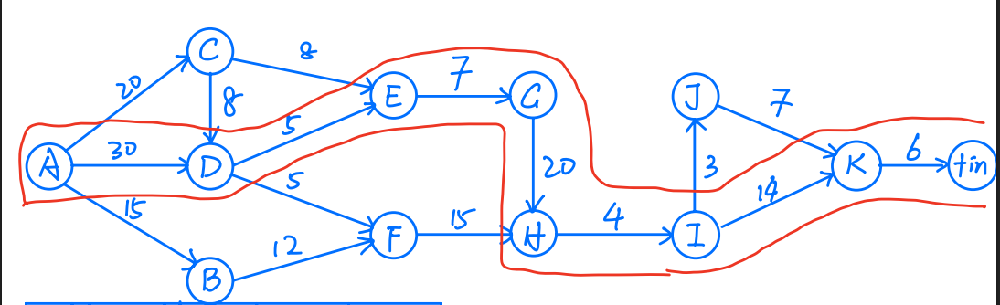
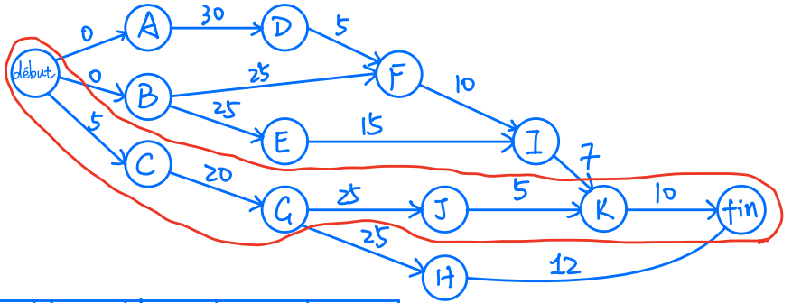
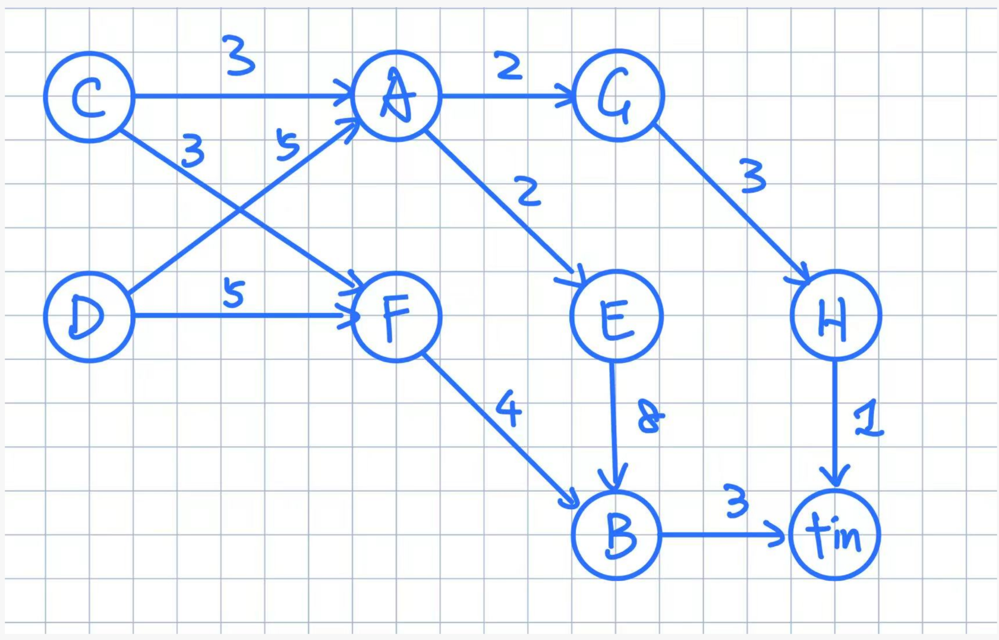
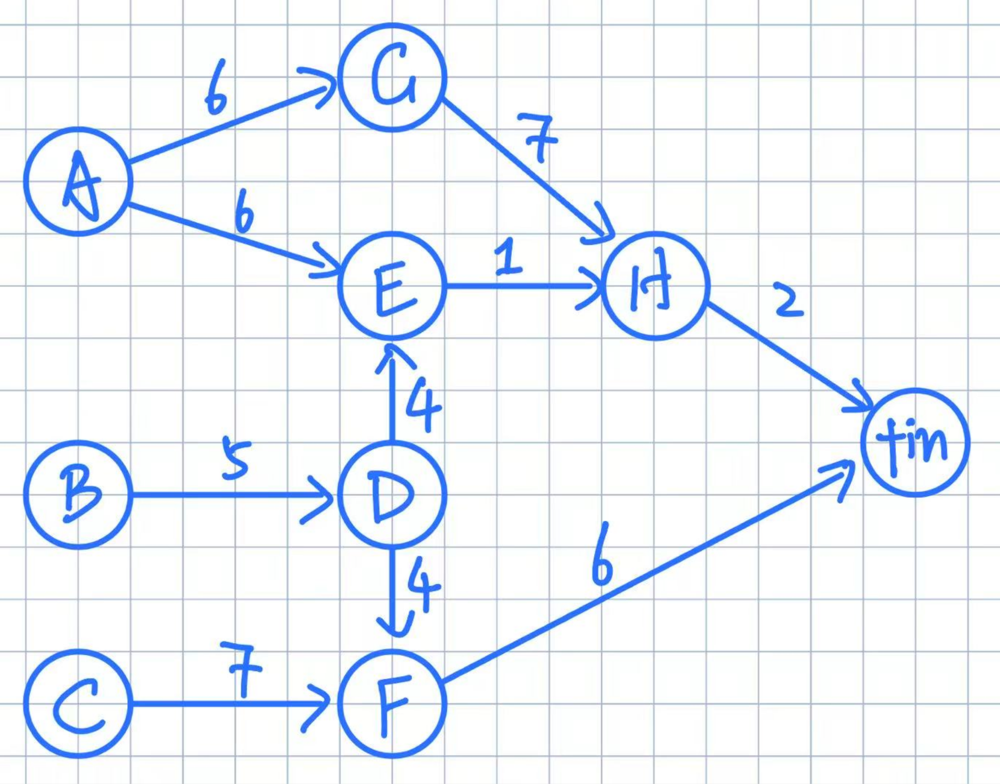

# TD1

## Exercice 1 : En direct de la Croisette 练习 1：来自戛纳海滨大道的直播

Un producteur de cinéma est confronté au problème du planning de son prochain film et vous soumet les tâches qui doivent être effectuées. 一位电影制片人面临其下一部电影的排程问题，并给出了必须完成的任务。

| Code de la tâche 任务代码 | Intitulé 名称 | Durée 工期 | Antériorités 前置关系 |
| --- | --- | --- | --- |
| A | Ecriture scénario 剧本写作 | 30 | - |
| B | Casting - choix comédiens 选角 | 12 | A + 15j |
| C | Choix lieux de tournage 选择拍摄地点 | 8 | A + 20j |
| D | Découpage technique 技术分镜 | 5 | A et C |
| E | Préparation Décors 布景准备 | 7 | C et D |
| F | Tournage extérieurs 外景拍摄 | 15 | B et D |
| G | Tournage intérieurs 内景拍摄 | 20 | E |
| H | Synchronisation 同步处理 | 4 | F et G |
| I | Montage 剪辑 | 14 | H |
| J | Bande son 配音与音轨 | 7 | I + 3j |
| K | Mixage 混音 | 6 | I et J |

1. Résoudre ce problème par la méthode des potentiels. Indiquer clairement la durée totale minimum et le calendrier d'exécution des tâches. 用势方法求解这个问题，并明确给出最短总工期和任务执行日程。
2. Le chemin critique est-il unique ? 关键路径是否唯一？
3. Quelles sont les marges totales et les marges libres des tâches non critiques ? 非关键任务的总时差和自由时差分别是多少？

### Tableau des dates et marges 日期与时差表

| Tâche 任务 | date au plus tôt 最早开始 | date au plus tard 最晚开始 | marge totale 总时差 | marge libre 自由时差 |
| --- | --- | --- | --- | --- |
| A | 0 | 0 | 0 | 0 |
| B | 15 | 35 | 20 | 8 |
| C | 20 | 22 | 2 | 2 |
| D | 30 | 30 | 0 | 0 |
| E | 35 | 35 | 0 | 0 |
| F | 35 | 47 | 12 | 12 |
| G | 42 | 42 | 0 | 0 |
| H | 62 | 62 | 0 | 0 |
| I | 66 | 66 | 0 | 0 |
| J | 69 | 73 | 4 | 4 |
| K | 80 | 80 | 0 | 0 |
| fin | 86 | 86 | 0 | 0 |

Durée totale minimum : `86`. 最短总工期：`86`。

1. La durée totale minimum est `86`. 最短总工期是 `86`。
2. Le chemin critique est unique : `A -> D -> E -> G -> H -> I -> K`. 关键路径唯一：`A -> D -> E -> G -> H -> I -> K`。
3. Les tâches non critiques et leurs marges sont : 非关键任务及其时差如下：
   - `B` : marge totale `20`, marge libre `8` 任务 `B`：总时差 `20`，自由时差 `8`
   - `C` : marge totale `2`, marge libre `2` 任务 `C`：总时差 `2`，自由时差 `2`
   - `F` : marge totale `12`, marge libre `12` 任务 `F`：总时差 `12`，自由时差 `12`
   - `J` : marge totale `4`, marge libre `4` 任务 `J`：总时差 `4`，自由时差 `4`

## Exercice 2 练习 2

Dans le tableau ci-dessous sont récapitulées les 11 principales tâches d'un projet dont vous avez la responsabilité. Vous avez aussi estimé la durée probable de chacune et déterminé les contraintes d'antériorité. 下表汇总了一个由你负责的项目中的 11 个主要任务。你已经估计了每个任务的可能工期，并确定了它们之间的前置约束。

| Code de la tâche 任务代码 | Durée (en j) 工期（天） | Antériorités 前置关系 |
| --- | --- | --- |
| A | 30 | - |
| B | 25 | - |
| C | 20 | 5j après le début du projet 项目开始后 5 天 |
| D | 5 | A doit être terminée A 完成后 |
| E | 15 | B doit être terminée B 完成后 |
| F | 10 | B et D |
| G | 25 | C |
| H | 12 | G |
| I | 7 | E et F |
| J | 5 | G |
| K | 10 | I et J |

1. Résoudre ce problème par la méthode de votre choix. Indiquer clairement la durée totale minimum et le calendrier prévisionnel d'exécution des tâches. 用你选择的方法求解该问题，并明确给出最短总工期和任务的预计执行日程。
2. Quelles sont les tâches critiques ? 哪些是关键任务？
3. 30 jours après le début du projet, vous faites un premier bilan et vous constatez que : 项目开始 30 天后，你做第一次阶段总结，并发现：
   - L'exécution de la tâche A a pris un peu de retard et ne pourra finalement se terminer que dans 3 jours. 任务 A 有些延误，最终还需要 3 天才能完成。
   - La tâche B s'est très bien déroulée. Elle a même été bouclée en 24 jours. On a toutefois respecté le planning prévisionnel et la tâche E a commencé à sa date prévue. Cette tâche E semble pour l'instant se dérouler normalement. 任务 B 进展很好，甚至 24 天就完成了。不过仍然按照原计划执行，任务 E 在预定日期开始，目前看来 E 的执行正常。
   - La tâche C n'a pu malheureusement débuter que 7 jours après le début du projet, mais a été exécutée en 20 jours comme prévu. Tout semble pour l'instant normal quant à l'exécution de la tâche G, qui, c'est vrai, débute seulement. 很遗憾，任务 C 直到项目开始后 7 天才启动，但仍按计划用 20 天完成。至于任务 G，目前看起来一切正常，不过它也确实才刚开始。

Quelles modifications éventuelles devez-vous envisager vis à vis de votre planning initial ? 相对于最初计划，你需要考虑做哪些调整？

| Tâche 任务 | date au plus tôt 最早开始 | date au plus tard 最晚开始 | marge totale 总时差 | marge libre 自由时差 |
| --- | --- | --- | --- | --- |
| A | 0 | 3 | 3 | 0 |
| B | 0 | 8 | 8 | 0 |
| C | 5 | 5 | 0 | 0 |
| D | 30 | 33 | 3 | 0 |
| E | 25 | 33 | 8 | 5 |
| F | 35 | 38 | 3 | 0 |
| G | 25 | 25 | 0 | 0 |
| H | 50 | 53 | 3 | 3 |
| I | 45 | 48 | 3 | 3 |
| J | 50 | 50 | 0 | 0 |
| K | 55 | 55 | 0 | 0 |
| fin | 65 | 65 | 0 | 0 |

Durée totale minimum : `65`. 最短总工期：`65`。

1. La durée totale minimum est `65`. 最短总工期是 `65`。
2. Les tâches critiques sont `C`, `G`, `J` et `K`. 关键任务是 `C`、`G`、`J` 和 `K`。
3. Modifications à envisager 30 jours après le début du projet : 项目开始 30 天后，需要考虑的调整如下：
   - Le retard de `A` n'allonge pas la durée totale du projet, car `A` disposait d'une marge totale de `3` jours ; cette marge est simplement consommée. `A` 的延误不会拉长项目总工期，因为 `A` 原本有 `3` 天总时差；现在只是把这部分时差消耗掉了。
   - L'avance sur `B` ne change pas la date de fin du projet ; `E` a déjà commencé à la date prévue. `B` 的提前完成不会改变项目完工日期；`E` 也已经在预定日期开始。
   - Le retard de `C` de `2` jours reporte la chaîne critique issue de `C`. `C` 延误了 `2` 天，会推迟从 `C` 引出的关键链。
   - Il faut donc décaler le planning des tâches dépendant de `C`, en particulier `G`, `H`, `J` et `K`. 因此需要顺延依赖 `C` 的任务安排，特别是 `G`、`H`、`J` 和 `K`。
   - La nouvelle durée minimale du projet devient `67` jours. 项目的新最短工期变为 `67` 天。
   - Un calendrier cohérent révisé est par exemple : 一组合理的修订日程例如：
     - `D` : début `33`, fin `38` `D`：开始 `33`，结束 `38`
     - `F` : début `38`, fin `48` `F`：开始 `38`，结束 `48`
     - `G` : début `27`, fin `52` `G`：开始 `27`，结束 `52`
     - `H` : début `52`, fin `64` `H`：开始 `52`，结束 `64`
     - `I` : début `48`, fin `55` `I`：开始 `48`，结束 `55`
     - `J` : début `52`, fin `57` `J`：开始 `52`，结束 `57`
     - `K` : début `57`, fin `67` `K`：开始 `57`，结束 `67`

## Exercice 3 练习 3

L'exécution d'un projet exige la réalisation de 8 tâches A, B, C, D, E, F, G et H, dont les durées (en jours) et les contraintes de dépendance sont données par le tableau suivant : 一个项目的执行需要完成 8 个任务 A、B、C、D、E、F、G 和 H，它们的工期（天）以及依赖关系由下表给出：

| Tâche 任务 | Durée 工期 | Antériorités 前置关系 |
| --- | --- | --- |
| A | 2 | C, D |
| B | 3 | E, F |
| C | 3 | - |
| D | 5 | - |
| E | 8 | A |
| F | 4 | C, D |
| G | 3 | A |
| H | 1 | G |

1. Construire le graphe potentiels du projet, calculer la date de début au plus tôt de chaque tâche. Quelles sont les tâches critiques. 构造项目的势图，计算每个任务的最早开始时间，并找出关键任务。
2. Indiquer la marge libre de chaque tâche non critique. 给出每个非关键任务的自由时差。

| Tâche 任务 | date au plus tôt 最早开始 | date au plus tard 最晚开始 | marge totale 总时差 | marge libre 自由时差 |
| --- | --- | --- | --- | --- |
| A | 5 | 5 | 0 | 0 |
| B | 15 | 15 | 0 | 0 |
| C | 0 | 2 | 2 | 2 |
| D | 0 | 0 | 0 | 0 |
| E | 7 | 7 | 0 | 0 |
| F | 5 | 11 | 6 | 6 |
| G | 7 | 14 | 7 | 0 |
| H | 10 | 17 | 7 | 7 |
| fin | 18 | 18 | 0 | 0 |

Durée totale minimum : `18`. 最短总工期：`18`。

D -> A -> E -> B

## Exercice 4 练习 4

Un projet a été découpé en 8 tâches A, B, C, D, E, F, G et H, qui doivent être réalisées par des personnes différentes. Les contraintes de précédence et les durées (en jours) des tâches sont données par le tableau suivant : 一个项目被划分为 8 个任务 A、B、C、D、E、F、G 和 H，它们必须由不同的人完成。任务的前序约束和工期（天）如下表所示：

| Tâche 任务 | Durée 工期 | Dépendances 依赖关系 |
| --- | --- | --- |
| A | 6 | - |
| B | 5 | - |
| C | 7 | - |
| D | 4 | B |
| E | 1 | A, D |
| F | 6 | C, D |
| G | 7 | A |
| H | 2 | E, G |

1. Représenter les données par un graphe potentiels. 用势图表示这些数据。
2. Déterminer la durée minimale du projet ; indiquer les dates de début au plus tôt et au plus tard de chaque tâche, ainsi que sa marge totale (on ne détaillera pas les algorithmes utilisés). Quelles sont les tâches critiques ? 求项目最短工期；给出每个任务的最早开始时间、最晚开始时间以及总时差（不要求详细说明算法）。哪些任务是关键任务？

| Tâche 任务 | date au plus tôt 最早开始 | date au plus tard 最晚开始 | marge totale 总时差 | marge libre 自由时差 |
| --- | --- | --- | --- | --- |
| A | 0 | 0 | 0 | 0 |
| B | 0 | 0 | 0 | 0 |
| C | 0 | 2 | 2 | 2 |
| D | 5 | 5 | 0 | 0 |
| E | 9 | 12 | 3 | 3 |
| F | 9 | 9 | 0 | 0 |
| G | 6 | 6 | 0 | 0 |
| H | 13 | 13 | 0 | 0 |
| fin | 15 | 15 | 0 | 0 |

Durée totale minimum : `15`. 最短总工期：`15`。

les tâches critiques sont `A`, `B`, `D`, `F`, `G` et `H`. 关键任务是 `A`、`B`、`D`、`F`、`G` 和 `H`。

les chemins critiques sont `B -> D -> F` et `A -> G -> H`. 关键路径是 `B -> D -> F` 和 `A -> G -> H`。
