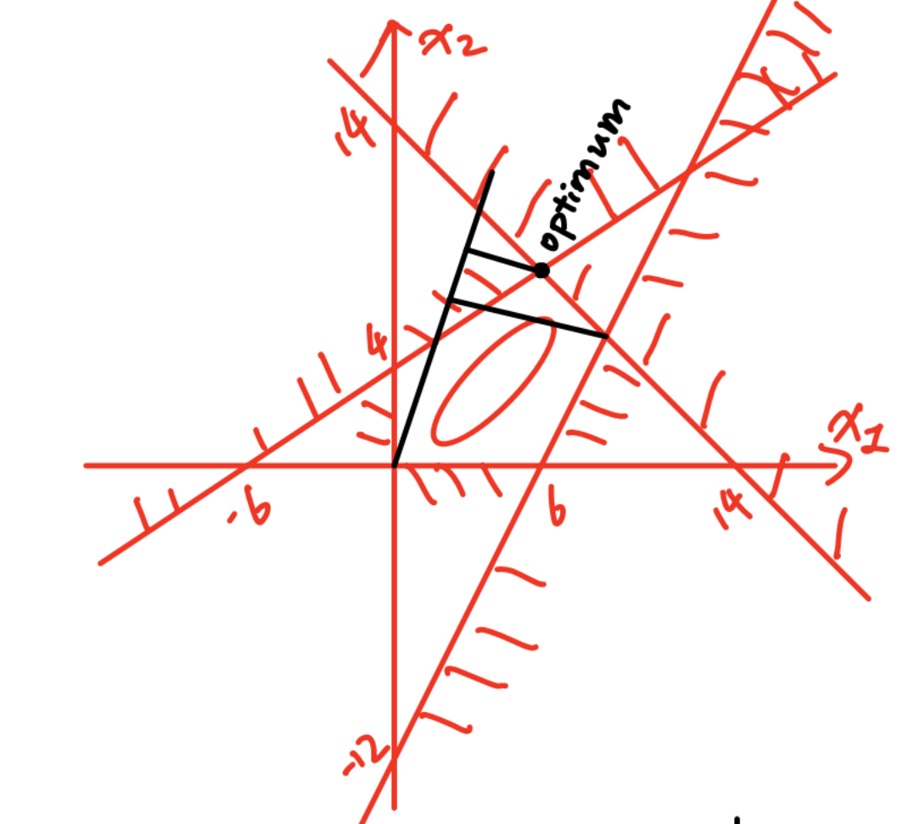

# TD2

Faire une résolution graphique. 做图解法求解。

## Exercice 1 练习 1

$$
\max\ x_1+3x_2
$$

Sous contraintes : 约束条件：

$$
\left\{
\begin{aligned}
x_1+x_2 &\le 14\\
-2x_1+3x_2 &\le 12\\
2x_1-x_2 &\le 12\\
x_1,x_2 &\ge 0
\end{aligned}
\right.
$$

On a : 记作：

$$c=\begin{bmatrix}
1\\3
\end{bmatrix}$$

$$f={}^tc\cdot x=b \Longleftrightarrow x_1+3x_2=b$$

$$\nabla f=c=\begin{bmatrix}
1\\3
\end{bmatrix}$$

Point optimal : `(6,8)`.

## Exercice 2 练习 2

$$
\min\ x_2-x_1
$$

Sous contraintes : 约束条件：

$$
\left\{
\begin{aligned}
2x_1-x_2 &\ge -2\\
x_1-x_2 &\le 2\\
x_1+x_2 &\le 5\\
x_1,x_2 &\ge 0
\end{aligned}
\right.
$$

## Exercice 3 练习 3

$$
\max\ 2x_1+x_2
$$

Sous contraintes : 约束条件：

$$
\left\{
\begin{aligned}
x_1-x_2 &\le 3\\
x_1+2x_2 &\le 6\\
-x_1+2x_2 &\le 2\\
x_1 &\ge 4\\
x_2 &\ge 0
\end{aligned}
\right.
$$

## Exercice 4 练习 4

$$
\max\ x_1+2x_2
$$

Sous contraintes : 约束条件：

$$
\left\{
\begin{aligned}
x_1-\frac{1}{5}x_2 &\le 1\\
x_1+x_2 &\ge 6\\
-x_1+x_2 &= 3\\
x_1,x_2 &\ge 0
\end{aligned}
\right.
$$

## Exercice 5 练习 5

$$
\max(\min)\ x_1+2x_2
$$

Sous contraintes : 约束条件：

$$
\left\{
\begin{aligned}
-2x_1+x_2 &\le 2\\
-x_1+2x_2 &\le 5\\
x_1-3x_2 &\le 4
\end{aligned}
\right.
$$
