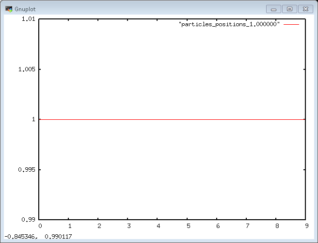
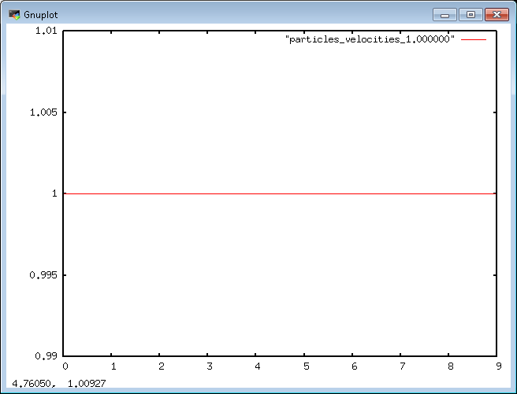

# TD 2 à 4 simulateur de pollution atmosphérique （大气污染模拟器第2至4次）

Contexte : il est aujourd'hui primordial de contrôler la quantité de polluants dans l'air de nos grandes agglomérations ainsi que son évolution.  
（背景：必须监测大城市空气污染物的数量及其变化。）  
Il est possible de prédire cette quantité par des simulations particulaires où l'on pourra suivre la dispersion des particules de polluants dans l'air.  
（可以用粒子模拟预测数量并跟踪扩散。）

Nous proposons d'utiliser ce contexte comme fil rouge de nos séances de TD.  
（本系列TD以此场景为主线。）

## TD 3 Calcul 1D stationnaire （一维稳态计算）

Les particules seront décrites par leur position et leur vitesse.  
（粒子由位置和速度描述。）  
Les données et les opérations sur les particules seront regroupées dans votre classe `Particles`, dans laquelle vous rajouterez le nombre de particules allouées qui sera donné en construction.  
（将粒子数据与操作集中在`Particles`类，构造时传入粒子数量并存为成员。）

## 3.0 Finalisation structure （完善结构）

En fin de TD précédent, vous aviez créé vos classes de simulateurs, toutes dérivant d'une classe de base. Pour commencer ce TD,  
（上一节已创建派生自基类的模拟器，本节需：）

- vous transformerez votre classe de base `Simulator` en interface, afin de vous assurer que toutes les classes dérivées implémentent la méthode `compute` ;  
  （将`Simulator`改为接口，强制子类实现`compute`。）
- vous stockerez vos simulateurs dans des `std::unique_ptr<Simulator>` et non des pointeurs `Simulator*`.  
  （用`std::unique_ptr<Simulator>`而非裸指针保存模拟器。）
- Vous stockerez dans un entier membre de la classe `Particles` le nombre de particules utilisées pour la simulation qui sera initialisé dans le constructeur.  
  （在`Particles`中以整型成员保存粒子数量，构造时初始化。）

## 3.1 Initialisation des particules （粒子初始化）

 La méthode `Particles::init_particles` va vous permettre d'initialiser ces positions et vitesses.  
 （`Particles::init_particles`用于初始化位置和速度。）  
 Les particules seront initialisées à la position $x=0$ et la vitesse sera initialisée à $v = 0$.  
 （位置初始化为$x=0$，速度为$v=0$。）  
 Afin de ne pas exposer dans le simulateur le choix de votre implémentation de tableau, vous créerez une class `Array` qui sera un wrapper au-dessus de `std::vector<double>`.  
 （为隐藏底层容器，实现包装`std::vector<double>`的`Array`类。）  
 Vous utiliserez cette classe pour stocker comme membres de la classe `Particles` les positions et les vitesses des particules que vous initialiserez à 0.  
 （在`Particles`中用该类存储位置与速度，初始为0。）

## 3.2 Export des particules （粒子导出）

Une fois vos vitesses et positions initialisées, vous pourrez d'ores et déjà les exporter et les visualiser pour vérifier, grâce à votre méthode `Particles::print_particles`.  
（初始化完成后，可用`Particles::print_particles`导出并可视化检查。）  
Pour visualiser ces tableaux 1D :  
（可视化这些一维数组：）

- vous écrirez deux fichiers `particle_positions` et `particle_velocities` qui contiendront les positions et les vitesses des particules (une valeur par ligne). Vous pourrez utiliser `std::ofstream` pour effectuer ces sorties.  
    （写两个文件`particle_positions`与`particle_velocities`，每行一值，使用`std::ofstream`输出。）
- vous utiliserez *gnuplot* (ou un outil équivalent) et vous tracerez simplement les positions et les vitesses en fonctions du numéro de la particule.  
    （用gnuplot等工具按粒子编号绘制位置和速度。）
  
l’exécution devrait produire une sortie de type :  
（运行输出示例：）

```txt
--- init particles ---
--- print particle positions at time : 0 ---
--- Export particles positions at time t = 0 in file particles_positions
--- Export particles velocities at time t = 0 in file particles_velocities
```

Pour les visualiser dans *gnuplot*, il suffit, après avoir lancé `gnuplot` en ligne de commande, de taper la commande `plot "MonFichierResultat"`. Il est également possible d'ajouter la commande `with lines` après le nom du fichier.
（在命令行启动gnuplot后输入`plot "MonFichierResultat"`即可查看，亦可在文件名后加`with lines`绘线。）

## 3.3 Mise à jour des particules （更新粒子）

Vous allez maintenant réaliser une première implémentation de la méthode `Particles::compute_particles`.  
（现在实现`Particles::compute_particles`的初版。）

### *Modèle physique*  （物理模型）

Nos particules de polluant sont mises en mouvement par l'écoulement d'air dans lequel elles évoluent.  
（污染物粒子由空气流动驱动。）  
Dans ce premier exemple, nous supposerons une vitesse de l'air constante en temps et en espace.  
（本例假设空气速度在时空上恒定。）  
Une première approximation de particules très faiblement inertielles permettra de supposer que la vitesse des particules est instantanément égale à la vitesse de l'air.  
（低惯性近似下，粒子速度即时等于空气速度。）  
L'instant initial sera pris égal à $t_{ini} = 0$ et le temps final $t_{final} = 1$.  
（起始时间$t_{ini}=0$，结束时间$t_{final}=1$。）

### *Implémentation* （实现）

Pour cette simulation stationnaire, la mise à jour se fera en deux temps :  
（稳态模拟的更新分两步：）

- la mise à jour de la vitesse $v$ des particules, égale à la vitesse du gaz.
  （更新粒子速度为气体速度。）
- la mise à jour de la position $x$ des particules, calculée avec cette nouvelle vitesse :  
  （用新速度更新粒子位置：）
  $$x_{particule} = v_{particule} * \Delta t.$$

### *Structure de code* （代码结构）

Afin de réaliser ces calculs de vitesses et de position, vous allez devoir modifier la signature de votre méthode `Simulator::compute` que vous lancez dans `Particles::compute_particles`, afin de lui passer les vitesses et les positions des particules.  
（为进行速度与位置计算，需要修改`Simulator::compute`签名，使其接收粒子位置和速度。）

Afin de rendre les modèles utilisés pour la simulation (les formules de calcul des vitesses et des positions)  indépendants du simulateur vous créerez une classe `Model` que vous passerez au simulateur. La signature de la méthode sera donc : `Simulator::compute(Array& positions, Array& velocities, Model& particle_model)`.  
（为使计算公式与模拟器解耦，创建`Model`类传入模拟器，方法签名如上。）

Au sein de cette méthode, vous appellerez les méthodes `Model::compute_velocities(Array& velocities, Array const& positions, double time)` et `Model::compute_positions(Array& positions, Array const& velocities, double time)`.  
（在此方法内调用`Model::compute_velocities`与`Model::compute_positions`。）

Finalement pour avoir accès à la vitesse du gaz vous créerez une classe `ConstantGasField` avec une méthode statique `GasField::velocity(double position, double time)`. Dans cette première version où la vitesse du gaz est constante en temps et en espace, cette méthode retournera une constante égale à 1 quel que soit les arguments.  
（最后为获取气体速度，创建`ConstantGasField`类，提供静态`GasField::velocity`，在此版本恒返回1。）

Cette classe sera donnée en argument template à la classe Model :  
（该类作为模板参数传递给Model：）

```c++
Model<ConstantGasField> particle_model;
```

l'exécution devrait alors produire une sortie de type :  
（运行输出应类似：）

```txt
--- init particles ---
--- compute particle evolution at time : 1 ---
--- print particle positions at time : 1 ---
--- Export particles positions at time t = 1 in file particles_positions
--- Export particles velocities at time t = 1 in file particles_velocities
```

Vous pourrez alors visualiser vos sorties vitesses et positions avec gnuplot pour vérifier qu'elles sont bien mises à jour.  
（之后可用gnuplot查看速度和位置输出，确认已更新。）

## 3.4 Résultats （结果）

Les positions et les vitesses des particules sont constantes.  
（粒子位置和速度恒定。）  
Positions des particules au cours du temps (pour 10 particules et v_air = 1) :  
（随时间的粒子位置（10粒子，气速1）：）


Vitesses des particules au cours du temps (pour 10 particules et v_air = 1) :  
（随时间的粒子速度（10粒子，气速1）：）


## Bonus : algorithmes STL et concepts （加分：STL算法与concept）

### Algorithmes de la STL （STL算法）

L'utilisation des algorithmes de la STL à la place des boucles sur les conteneurs permet de gagner en lisibilité et en efficacité. En particulier ces algorithmes sont facilement parallélisables via l'ajout d'un contexte d'exécution.  
（用STL算法替代容器循环能提高清晰度和效率，并可通过执行策略轻易并行化。）

Dans le contexte très parallèle de la simulation particulaires (les particules sont indépendantes), il paraît intéressant d'utiliser ces algorithmes. Vous réécrirez donc les boucles utilisées pour le calcul des vitesses et des positions en utilisant des algorithmes de la STL.  
（粒子模拟高度并行，适合用这些算法；将速度与位置计算的循环改写为STL算法。）

### Rendre le code plus robuste via les concepts （用concept增强健壮性）

Il est enfin possible de rendre votre code plus robuste en vérifiant, là où vous utilisez des paramètres template, que les objets donnés en paramètre template remplissent le bon contrat, grâce aux **`concept`** introduit en C++20. Vous pouvez vérifier que la classe ```ConstantGasField``` possède bien la méthode `velocity(double position, double time)`.  
（借助C++20的concept，验证模板参数满足契约，例如检查`ConstantGasField`是否具备`velocity(double position, double time)`。）
