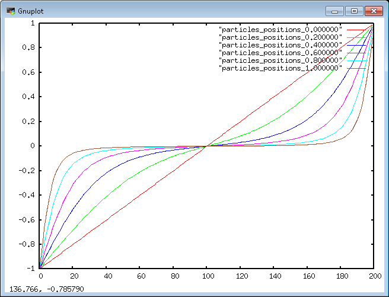
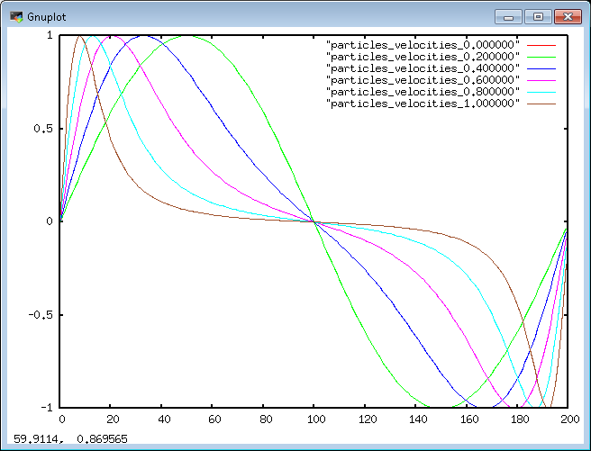

# TD 2 à 5 simulateur de pollution atmosphérique （大气污染模拟器第2至5次）

Contexte : il est aujourd'hui primordial de contrôler la quantité de polluants dans l'air de nos grandes agglomérations ainsi que son évolution. Il est possible de prédire cette quantité par des simulations particulaires où l'on pourra suivre la dispersion des particules de polluants dans l'air.  
（背景：必须监测大城市空气污染物的数量及其变化，可用粒子模拟预测并跟踪扩散。）

Nous proposons d'utiliser ce contexte comme fil rouge de nos séances de TD.  
（本系列TD以此场景为主线。）

## TD 4 : Calcul 1D instationnaire （一维非稳态计算）

Nous utiliserons dans ce TP une vitesse de l'écoulement d'air variable en espace.  
（本实验使用随空间变化的空气流速。）

## 4.1 Initialisation de la position des particules （粒子位置初始化）

La première modification à apporter par rapport au TD3 sera de modifier les positions initiales des particules afin qu'elles ne soient pas toutes initialement en $x=0$ mais équi-réparties dans l'espace. Il faut donc :  
（相较TD3，首先要把粒子初始位置改为空间均匀分布，而非全部在$x=0$，因此需要：）

- ajouter un mode à la méthode `init` pour qu'elle puisse proposer une initialisation uniforme en espace et non localisée en un point. Vous pourrez par exemple utiliser une `enum class` ;  
  （给`init`增加模式以支持空间均匀初始化，可用`enum class`区分。）
- initialiser les positions de manière uniforme entre **-1 et 1**. Comme d'habitude, n'hésitez pas à utiliser des algorithmes de la STL pour manipuler vos particules.  
  （将位置均匀分布在-1到1间，照例可用STL算法处理。）

## 4.2 Vitesse de l'écoulement d'air variable en espace （空气流速随空间变化）

On se propose de refaire le travail de la partie *3.3* avec une vitesse de l'air variable en espace. Pour cela, nous introduisons une vitesse de l'air fonction de la position des particules.  
（将第3.3节的工作改为使用随空间变化的气速，引入依赖粒子位置的空气速度。）

### *Modèle physique*  （物理模型）

La vitesse de l'air sera prise égale à un sinus : `sin(-Pi*x)` où `x` est la position de la particule. Pi pourra être pris égal à `std::atan(1)*4` (nécessitant `#include <cmath>`).  
（空气速度设为正弦`sin(-Pi*x)`，其中`x`为粒子位置，Pi可用`std::atan(1)*4`计算，需要`<cmath>`。）
  
### *Implémentation* （实现）

Sur le modèle de votre classe `ConstantGasField` vous allez maintenant créer une nouvelle classe `NonUniformGasField` qui définira également la méthode `double velocity(double position, double time)` pour calculer la vitesse. Seule l'argument `position` vous servira dans cette méthode pour calculer la vitesse du gaz à la position de la particule.  
（仿照`ConstantGasField`创建`NonUniformGasField`类，实现`velocity`，其中仅用`position`计算该点气速。）
  
### *Structure de code* （代码结构）

Pour prendre en compte cette nouvelle vitesse vous devrez donc créer une nouvelle instance de `Model` :  
（为使用新气速，需创建一个新的`Model`实例：）

```c++
Model<NonUniformGasField> particle_model;
```

La prise en compte de cette nouvelle instance de `Model` ne devrait pas modifier le code de `Particles::compute_particles`  
（引入新`Model`不应修改`Particles::compute_particles`的代码。）

Afin d'avoir un code où vous pouvez choisir de lancer un calcul avec une vitesse de l'air constante ou variable en espace, vous stockerez au sein de la classe `Particles` cette instance de `Model`.  
（为可选择恒定或空间变速的气流，在`Particles`中存储此`Model`实例。）

Le constructeur de `Particles` pourra par exemple prendre en argument cette instance de `Model`. Vous pourrez alors construire un **premier groupe de particules** soumis à une **vitesse d'air constante** et un **second** soumis à une **vitesse d'air variable** afin de calculer l'évolution de leur position dans ces deux cas de figure.  
（`Particles`构造函数可接受该模型实例，从而构建一组受恒定气速作用的粒子，另一组受变速气流作用，以对比位置演化。）

## 4.3 Résultats （结果）

Les positions et les vitesses des particules doivent tendre vers 0, les particules étant 'piégées' au centre de la sinusoïde.  
（粒子位置和速度应趋向0，粒子被“困”在正弦中心。）

Afin d'afficher les vitesses et les positions à chaque pas de temps, vous implémenterez dans la classe `Array` une méthode `Array::print(filename)` qui vous permettra de sortir dans un fichier les positions et les vitesses au sein de la boucle en temps dans la méthode `UnsteadySimulator::compute`.  
（为在每个时间步输出速度与位置，在`Array`中实现`print(filename)`，供`UnsteadySimulator::compute`的时间循环写文件。）

Positions des particules au cours du temps (pour 200 particules) :  
（200个粒子随时间的位置：）


Vitesses des particules au cours du temps (pour 200 particules) :  
（200个粒子随时间的速度：）

