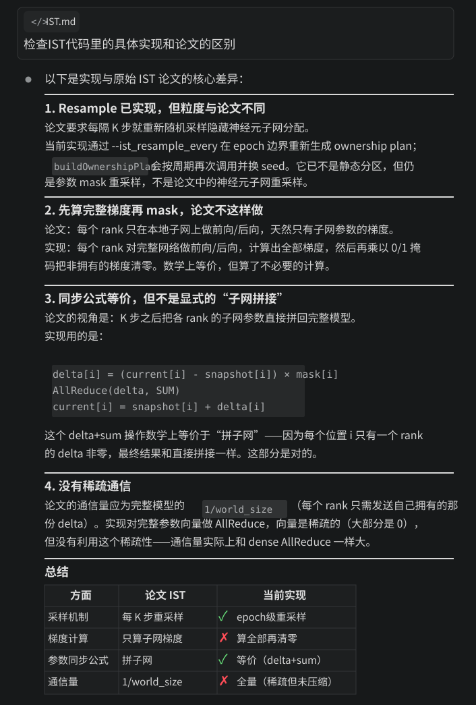

本项目参考 IST（Independent Subnet Training）思想，将其引入现有 MPI 分布式训练流程，目标是在尽量不损失模型效果的前提下，降低同步开销并提升训练效率。按照原始论文的定义，IST 的核心思想是：将隐藏层神经元无重叠地分配给不同 rank，形成若干与原网络同深度的子网；各 rank 对本地子网执行若干步 local SGD 后，再将子网参数回填并重组为完整模型，随后重新随机采样新的子网并重复这一过程，从而同时降低通信频率和通信量。原始 IST 主要面向全连接网络；扩展到 CNN 时，论文建议仅对其中的全连接层使用 IST。

在工程实现上，本项目并未逐字复现论文中的子网级训练流程，而是在现有 MPI 全模型训练框架上实现了一个受 IST 启发的变体。项目按四个步骤推进。第一步是在训练入口接入 IST 相关配置参数，包括 `train_mode`、`ist_local_steps`、`ist_partition_seed` 和 `ist_resample_every`，并补充与 resume 相关的冲突检查和合法性约束。第二步是实现 ownership plan（参数归属方案）生成逻辑：当前实现不直接按隐藏神经元采样子网，而是根据参数形状推断切分轴（rows/cols/elements），为每个参数构造 0/1 掩码，并保证多 rank 之间覆盖完整、彼此互斥且结果可复现（即相同 seed 下结果一致）。第三步是将这一变体接入训练循环：反向传播后先按掩码过滤梯度，仅更新本地拥有的参数；每经过 `K=ist_local_steps` 步执行一次参数 delta 同步（all-reduce），并在每个 epoch 末补齐未对齐窗口，以保证参数一致性。第四步是接入重采样与实验脚本：`--ist_resample_every` 控制每隔若干个 epoch 重新生成 ownership plan，并重置 IST 本地同步窗口；批量脚本则支持 dense/IST 对照、k 值扫描、seed/lr 矩阵以及结果汇总，形成可复现实验链路。

在集群验证中，我们首先完成了该 IST 变体路径的打通（Tiny-ImageNet，MPI world size=2），确认训练、评估和汇总文件均可稳定产出。随后开展了 dense 与 IST(k=4) 的对照实验。1 epoch 的快筛结果显示，该方法在多个 seed 上表现为正向收益，且训练时长总体与 dense 接近。进一步在 2 epochs、seed=42/43/44 的条件下复验后发现，IST(k=4) 在三个 seed 上均表现出小幅时长优化（约 1.1%），精度方面则为 2 个 seed 提升、1 个 seed 下降，说明其收益在一定程度上具有 seed 依赖性。

综合来看，本项目已经完成从“配置接入—训练实现—重采样支持—集群验证”的闭环，具备实际可用性。需要强调的是，当前实验结果对应的是一个受 IST 启发的参数掩码/周期同步变体，而不是对原始 IST 的逐字复现：它已经支持由 `--ist_resample_every` 控制的 epoch 级 ownership 重采样，但仍不是论文中严格按隐藏神经元构造并训练子网的流程。现有结果表明，该变体呈现出较稳定的效率收益趋势，但精度收益并未在所有 seed 上一致出现，因此整体仍需更多实验支撑。后续可通过增加训练轮数和 seed 数量，进一步提升统计稳定性，并完善最终结论。

参考论文与链接：

- Binhang Yuan, Cameron R. Wolfe, Chen Dun, Yuxin Tang, Anastasios Kyrillidis, Chris Jermaine. *Distributed Learning of Fully Connected Neural Networks using Independent Subnet Training*. PVLDB 15(8), 2022.
- PDF: https://www.vldb.org/pvldb/vol15/p1581-wolfe.pdf
- DOI: https://doi.org/10.14778/3529337.3529343
- 项目页: https://akyrillidis.github.io/ist/IST.html
