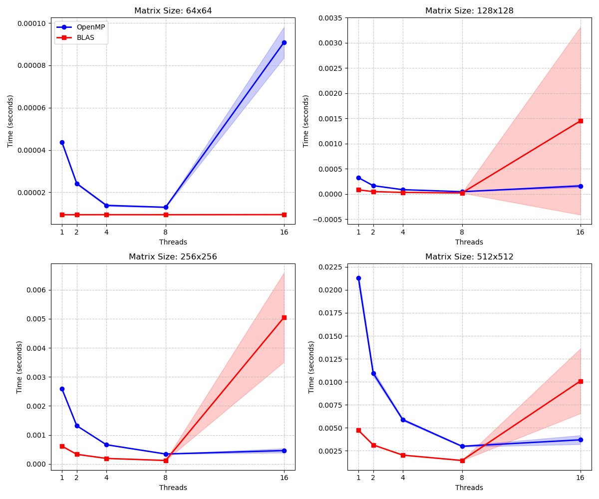
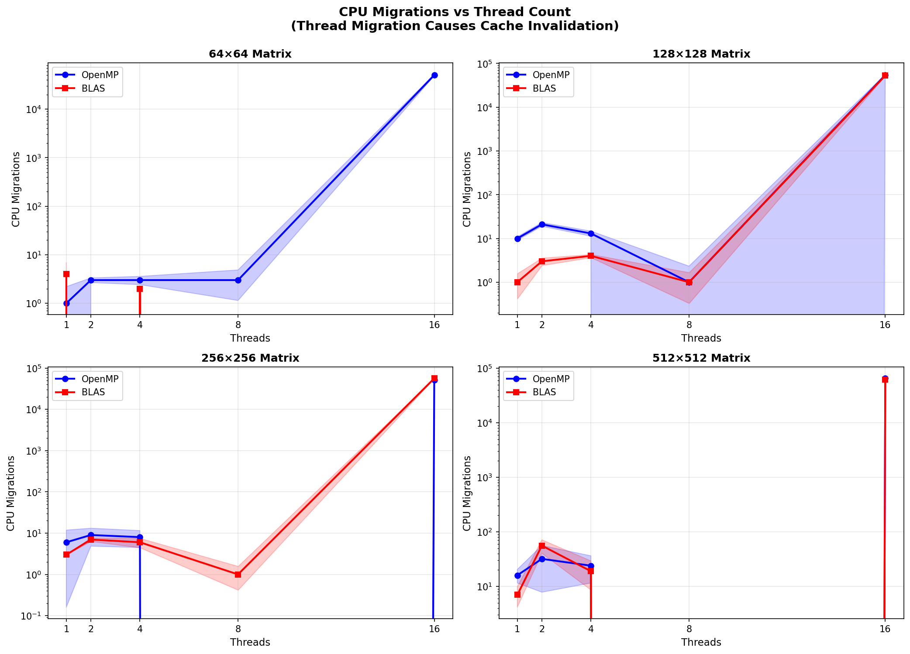

# GEMM 多线程实验分析

## 目录

1. [实验目标](#1-实验目标)
2. [实验设置与测量协议](#2-实验设置与测量协议)
3. [测量方法修正](#3-测量方法修正)
4. [主要实验结果](#4-主要实验结果)
5. [16 线程异常的解释](#5-16-线程异常的解释)
6. [实验结论与参数建议](#6-实验结论与参数建议)
7. [附录：环境准备与复现命令](#7-附录环境准备与复现命令)

---

## 1. 实验目标

本实验围绕三个核心问题展开。第一，小矩阵（64×64 量级，对应 MNIST 28×28 的实际计算规模）在多线程 GEMM 下能否获得性能收益，或同步开销是否反而成为主要成本。第二，OpenMP 手工并行实现与 OpenBLAS（内置线程管理）在扩展性和稳定性上有何差异，哪种实现在不同矩阵规模下更适合实际部署。第三，当线程数超过物理核心数（本实验为 16 线程运行在 8 个物理核心上，即 SMT/超线程模式）时，系统出现了指令数暴增、性能退化等异常，其最一致的解释是什么，以及绑定线程亲和性是否能有效缓解。

实验的具体目标不局限于得出"最优线程数"的单点结论，而是通过执行时间、指令数、IPC、上下文切换、CPU 迁移、缓存缺失等多维指标，建立对多线程 GEMM 扩展行为的整体认知，并评估超线程配置在当前硬件环境下的适用性。

---

## 2. 实验设置与测量协议

### 硬件与软件环境

| 参数 | 配置 |
|---|---|
| 处理器 | AMD Ryzen 9 8940HX（16 物理核心，32 逻辑核心） |
| 核心限制 | `taskset -c 0-7`，限制到 8 个 CPU；在已验证拓扑下（见附录），该集合对应 8 个物理核心 |
| CPU 频率 | 锁定在 4.0 GHz，关闭 Turbo Boost |
| 实现方式 | OpenMP (OMP) 手工并行，OpenBLAS (BLAS) |
| 矩阵尺寸 | 64×64、128×128、256×256、512×512 |
| 线程数 | 1、2、4、8、16 |
| 迭代次数 | 程序内部 2000 次（时间与计数器），perf 外部重复 3 次（`-r 3`） |

### 测量协议

时间测量使用 `std::chrono`，每个配置在程序内部循环 2000 次，取平均值与标准差；硬件计数器通过 `perf stat` 采集，同样在 2000 次迭代窗口内统计，并由 perf 外部重复 3 次以提供方差估计。每组测试前执行 5 次预热迭代，以稳定指令缓存和数据缓存状态。

为减少组间异质性，关键批次之间重启系统，并在每次测量前执行 `drop_caches` 清空页缓存。预热是稳定执行路径的主要机制；重启与清空页缓存的作用是降低系统整体状态带来的跨组干扰，而非替代预热。

最终采用的 `perf` 命令如下：

```bash
# scripts/ExperienceGEMM/find_optimal_threads.sh
perf stat -x, -r 3 -e instructions,cycles,context-switches,cpu-migrations,cache-misses,cache-references
```

`-x,` 输出 CSV 格式，`-r 3` 提供 perf 层面的方差估计，不带 `:u` 修饰符以同时覆盖用户态与内核态事件。CSV 输出格式为：

```
Implementation,Size,Threads,Time_us,StdDev_us,
Instructions,Instr_StdDev,Cycles,Cycles_StdDev,
IPC,IPC_StdDev,CS,CS_StdDev,CpuMigrations,Mig_StdDev,
CacheMisses,Cache_StdDev,Reps
```

---

## 3. 测量方法修正

实验过程中对两项初始测量方案进行了修正，修正原因具有独立的方法学意义，在此集中说明。

**上下文切换的测量方式**：初始命令使用 `perf stat -e context-switches:u`，结果始终为 0。原因在于 `:u` 修饰符限定仅在用户态计数，而上下文切换由内核调度器在内核态完成，该事件在发生时不满足 `:u` 的计数条件，因此统计值为 0 或极小。这一结果不代表系统未发生调度切换；去掉 `:u` 修饰符后，改用 `perf stat -e context-switches,cpu-migrations` 即可捕获内核态调度事件。需要注意，在极短的执行窗口内，单次采样中上下文切换的绝对数量本身较少，但在 2000 次迭代的总窗口下已具备统计可观测性。

**缓存缺失的归因层级**：初始方案尝试使用 `sudo perf stat -a -e amd_l3/l3_lookup_state.l3_miss/` 测量 L3 缺失，结果变异系数高达 58%，无法用于定量比较。主要原因是 `amd_l3` 属于 uncore PMU，该类事件不支持 per-task 归因，无论是否显式指定 `-a`，perf 均以 system-wide 方式采集，包含浏览器、IDE、系统守护进程等所有进程的 L3 访问，在短窗口下污染严重。因此主分析改用 per-task 的通用事件 `cache-misses,cache-references`，去掉 `-a` 与 `sudo`。需要说明，`cache-misses` 是聚合性的内存压力指标，不能据此对 L1/L2/L3 进行精确层级归因；本文中该指标仅用于相对比较（不同线程数之间），而非绝对层级定量。

---

## 4. 主要实验结果

### 规模效应与线程效应

**图表**：执行时间与 IPC 扩展性 `output/ExperienceGEMM/BLAS1/scaling_plot_advanced.png`



在 64×64 矩阵上，BLAS 对所有线程配置均返回相近的执行时间（约 9.4 μs），说明其内部并行化阈值尚未触发，实际以单线程路径执行。OMP 在 2/4/8 线程下可获得小幅改善，但增益有限。在 128×128 至 512×512 范围内，BLAS 随线程数增加呈现出明显的扩展收益，8 线程时达到最优（相比单线程加速 3.3×–5.0×）；OMP 在相同范围内加速比显著偏低，且稳定性较差。在 16 线程配置下，两种实现均出现性能退化：OMP 在 64×64 上执行时间从 8.97 μs 增至 73.00 μs（约 8.1 倍降级），BLAS 在中大矩阵出现指令数暴增和方差极大的异常，该现象将在第 5 节专门分析。

对比启用 `OMP_PROC_BIND=true`（线程绑定到物理核心）后的重测结果，最优配置汇总如下（`output/ExperienceGEMM/BLAS2/scaling_plot_advanced.png`）：


| 矩阵尺寸 | 最优配置 | 性能 (μs) | 相比单线程 |
|---|---|---|---|
| 64×64 | BLAS 单线程 | 9.42 | — |
| 128×128 | BLAS 8 线程 | 24.29 | 3.5× 加速 |
| 256×256 | BLAS 8 线程 | 123.75 | 5.0× 加速 |
| 512×512 | BLAS 8 线程 | 1428.53 | 3.3× 加速 |

### 调度开销：上下文切换与 CPU 迁移

**图表**：Context Switches vs 线程数 `output/ExperienceGEMM/BLAS1/context_switches_vs_threads.png`


在 1–8 线程范围内，上下文切换次数维持在个位数至数十次的低水平，说明线程数不超过物理核心数时内核调度介入有限。进入 16 线程配置后，上下文切换数量急剧增加，在小矩阵（64×64）OMP 配置下达到约 89,617 次，大矩阵绝对数量仍然显著，尽管单位计算时间的切换率有所下降。这一变化与线程数超过物理核心数导致的核心争用高度相关，两者在配置维度上同步出现。

**图表**：CPU Migrations vs 线程数 `output/ExperienceGEMM/BLAS1/cpu_migrations_vs_threads.png`



16 线程配置下，CPU 迁移数量在 12K–20K 范围内，说明线程在物理核心之间的漂移相当频繁。每次迁移都可能导致私有缓存（L1/L2）的工作集失效，以及预取器和 TLB 局部性的潜在损失，与缓存缺失指标的高方差观察相洽。

### 缓存缺失

**图表**：进程级 Cache Misses `output/ExperienceGEMM/BLAS1/cache_misses_vs_threads.png`


**图表**：Cache Misses 变异系数 `output/ExperienceGEMM/BLAS1/cache_cv_vs_threads.png`


在 1–8 线程范围内，BLAS 的缓存缺失随矩阵增大而增加，且变异系数（CV）通常低于 5%，说明实现具有较好的可重复性。OMP 在中大矩阵的低线程配置下 CV 波动较大，反映出实现的不稳定性。在 16 线程配置下，OMP 64×64 的缓存缺失是 8 线程的约 6.7 倍，但变异系数反而从 1.9% 降至 0.5%——这一反常的"方差收敛"与调度模式的确定性有关：超线程争用下，每次运行均触发相似的大量调度事件，行为趋于稳定，但代价是持续的高缓存缺失。大矩阵（512×512）的 CV 在 8–13% 范围内，高于小矩阵，可能指向内存带宽竞争或 NUMA 相关的额外不确定性，但目前尚无对照实验支持精确归因。

### 指令数与 IPC

**图表**：指令数统计 `output/ExperienceGEMM/BLAS1/hw_metric_instructions.png`


OMP 的总指令数随线程数近似线性增加，反映同步指令开销的累积；BLAS 在 1–8 线程范围内指令数相对稳定，体现了其 SIMD 优化路径的高效性。在 16 线程配置下，BLAS 在 128/256/512 矩阵时出现指令数暴增（128×128 从 1.74B 增至 438.68B，约 252 倍），方差同时急剧扩大。对比不同矩阵规模的单位操作指令数（Instr/Op），128×128 约为 0.587，1024×1024 约为 0.128，前者是后者的 4.5 倍。这说明绝对指令数的膨胀主要源于同步开销在极小计算工作量上的比例放大，而非计算本身产生了更多指令。

**图表**：每周期指令数 (IPC) `output/ExperienceGEMM/BLAS1/hw_metric_ipc.png`


在正常配置下，BLAS 的 IPC 维持在 1.3–1.8，OMP 为 3.3–6.7（包含大量轻量级同步指令，拉高了 IPC 数值）。BLAS 16 线程出现 IPC > 10 的极端异常，这在方法学上意味着 instructions retired / cycles 已不再是有效计算吞吐的可靠代理指标——更可能是大量自旋等待指令（如 PAUSE）被计入，而这类低延迟指令在单位周期内退休数量极高，但不代表实际浮点工作。因此本文将该 IPC 异常作为故障诊断信号，而非性能评估指标。需要特别指出，OMP 在正常配置下的 IPC（3.3–6.7）高于 BLAS（1.3–1.8），这不代表 OMP 计算效率更高，而是反映其同步指令比例更高、单条指令的计算强度更低；本文不使用 IPC 直接排序两种实现的优劣，而是将其与执行时间、指令数和调度事件结合用于异常诊断。

---

## 5. 16 线程异常的解释

GEMM 的高性能实现（如 OpenBLAS 内部的 GotoBLAS 风格内核）通常已能充分占用物理核心上的 FMA 单元、SIMD 寄存器、L1/L2 缓存带宽以及 load/store 端口。SMT（超线程）并不增加新的物理执行资源，两个逻辑核心共享同一套物理资源；因此在计算密集型负载下，16 线程在 8 物理核心上不仅难以带来额外收益，还需要承担额外的竞争成本。小矩阵场景下，计算部分完成极快，线程在 barrier 处的自旋等待时间占比极高，这进一步放大了同步、调度和迁移的相对成本。

从实验证据链来看，上下文切换和 CPU 迁移的急剧增加（分别达到约 89K 次和 12K–20K 次）是最直接可观测的信号，与性能退化在时间维度上同步出现。针对该异常设计的对照实验提供了进一步支持：在 128×128 矩阵、5000 次迭代的条件下，将线程绑定到物理核心（`OMP_PROC_BIND=true` + `taskset`，配置B）与自由调度（配置A）相比：

| 指标 | 配置A（自由调度） | 配置B（线程绑定） | 变化 |
|:---|:---|:---|:---|
| Context Switches | 2,013（甚至更多） | 14 | −99.3% |
| Instructions | 13.45B | 4.05B | −69.9% |
| Cache Misses StdDev% | 1.32% | 0.06% | 稳定约 22 倍 |

绑定线程后，上下文切换降至接近零，指令数减少约 70%，缓存缺失的方差大幅收窄。这一结果强支持调度/迁移是当前测量条件下最一致的主导解释，但需要说明的是：本实验尚未通过形式化对照排除 false sharing、内存带宽竞争等因素的贡献，以上结论是在现有证据下最一致的解释，而非对所有其他原因的完全排除。

此外，补充实验表明 16 线程配置在短窗口（500 次迭代）下变异系数高达 30.34%，而在标准窗口（2000 次迭代）下降至 1.44%，说明该配置下测量的稳定性对采样窗口长度较为敏感。

综合来看，16 线程在 8 物理核心上的异常机制可概括为：小矩阵的计算工作量不足以抵消同步固定开销（Instr/Op 占比极高），线程数超过物理核心数后调度竞争加剧（CS 和 migrations 显著增加），导致自旋等待时间被延长、指令数膨胀、性能退化。

---

## 6. 实验结论与参数建议

基于上述实验结果，对不同规模矩阵的 GEMM 配置给出以下建议：

**MNIST 28×28 / 64×64 量级**：BLAS 单线程是合理选择。矩阵尺寸未达到 OpenBLAS 内部并行化阈值，多线程配置的性能与单线程相当，额外的线程管理成本没有对应的计算收益。BLAS 的 SIMD 优化路径在单线程下已充分发挥效用。

**128×128 至 512×512**：优先使用物理核心数附近的线程数。本实验中 8 线程（恰好等于通过 `taskset` 限制的物理核心数）在性能和稳定性上均为最优，相比单线程可获得 3.3×–5.0× 的加速。不应将逻辑核心数（本系统为 16 或 32）作为默认线程数，因为超线程配置在 GEMM 类计算密集型负载下不增加物理执行资源，反而引入额外的竞争开销。

**大矩阵（≥ 1024×1024）**：补充测量显示 1024×1024 的 Instr/Op 约为 0.128，低于 128×128 的 0.587，说明同步开销占比下降、计算主导性增强。但由于本文主图集中在 64×64–512×512 范围，≥1024×1024 的扩展行为未经系统测量，具体最优线程数仍需在目标硬件上复测。工程默认可先以物理核心数作为线程数上限，并在实际场景下验证。

在后续报告和性能对比中，16 线程配置适合作为"超线程压力测试"的参照基线，用于展示 SMT 在 GEMM 类负载下的局限性，而不应作为主推荐配置。

推荐的运行环境配置：

```bash
OMP_PROC_BIND=true OMP_PLACES=cores taskset -c 0-7 ./your_gemm_binary
```

---

## 7. 附录：环境准备与复现命令

### 验证 CPU 拓扑

在使用 `taskset -c 0-7` 之前，建议通过以下命令确认 CPU 0–7 是否覆盖 8 个不同的物理核心：

```bash
lscpu -e=CPU,CORE,SOCKET,NODE
```

若输出中 CPU 0–7 对应的 CORE 列均不重复，则该配置等价于 8 个独立物理核心；若存在重复（表明 CPU 0–7 包含超线程对），需调整 `taskset` 参数以确保核心隔离。

### 准备实验环境

```bash
# 设置为 performance 模式并锁定频率
sudo cpupower frequency-set -g performance
sudo cpupower frequency-set -u 4000MHz -d 4000MHz
cpupower frequency-info | grep "current CPU frequency"

# 清空页缓存
sync; echo 3 | sudo tee /proc/sys/vm/drop_caches

# 关闭 Turbo Boost（AMD 路径）
if [ -f /sys/devices/system/cpu/cpufreq/boost ]; then
    echo 0 | sudo tee /sys/devices/system/cpu/cpufreq/boost
fi
```

### 运行测试

```bash
sudo taskset -c 0-7 bash scripts/ExperienceGEMM/find_optimal_threads.sh
```

结果输出至：`output/thread_scaling.csv`

### 生成图表

```bash
python3 scripts/ExperienceGEMM/plot_scaling.py
python3 scripts/Utils/plot_metrics.py
```

生成的图表：

- `output/ExperienceGEMM/BLAS1/scaling_plot_advanced.png`：执行时间与 IPC 扩展性
- `output/ExperienceGEMM/BLAS2/scaling_plot_advanced.png`：绑定配置下的性能对比
- `output/ExperienceGEMM/BLAS1/context_switches_vs_threads.png`：上下文切换（2×2）
- `output/ExperienceGEMM/BLAS1/cpu_migrations_vs_threads.png`：CPU 迁移（2×2）
- `output/ExperienceGEMM/BLAS1/cache_misses_vs_threads.png`：缓存缺失（2×2，含方差）
- `output/ExperienceGEMM/BLAS1/cache_cv_vs_threads.png`：缓存缺失变异系数（2×2）
- `output/ExperienceGEMM/BLAS1/hw_metric_instructions.png`：总指令数
- `output/ExperienceGEMM/BLAS1/hw_metric_ipc.png`：每周期指令数 (IPC)
- `output/ExperienceGEMM/BLAS1/hw_metric_cycles.png`：CPU 周期数

### 恢复环境

```bash
sudo cpupower frequency-set -g powersave
sudo cpupower frequency-set -d 421MHz -u 5386MHz
sudo sysctl -w kernel.perf_event_paranoid=2
```

---

## 参考资料

- [perf 文档](https://perf.wiki.kernel.org/)
- [AMD 性能监控](https://developer.amd.com/resources/developer-guides-manuals/)
- [Linux 内核 perf 事件](https://www.kernel.org/doc/html/latest/admin-guide/perf-security.html)
