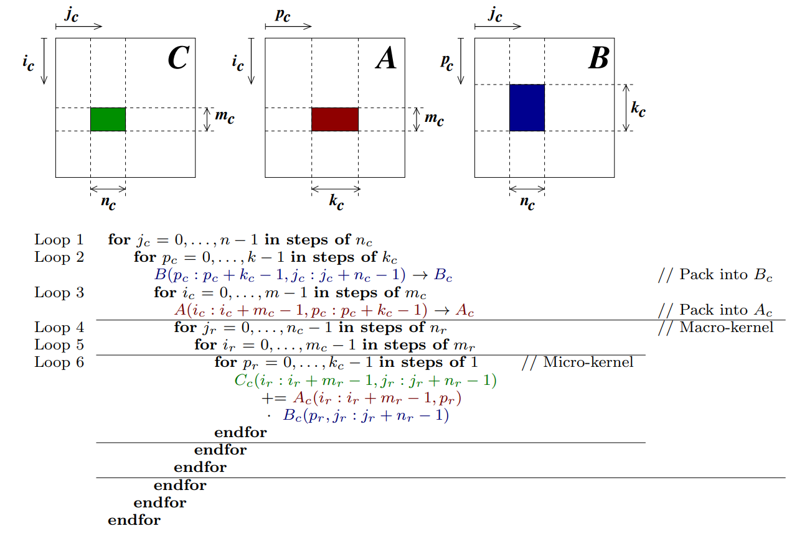
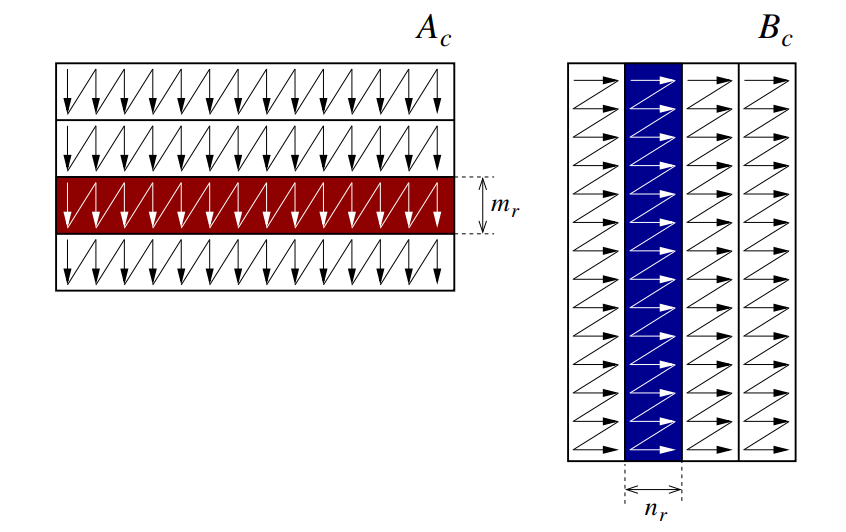
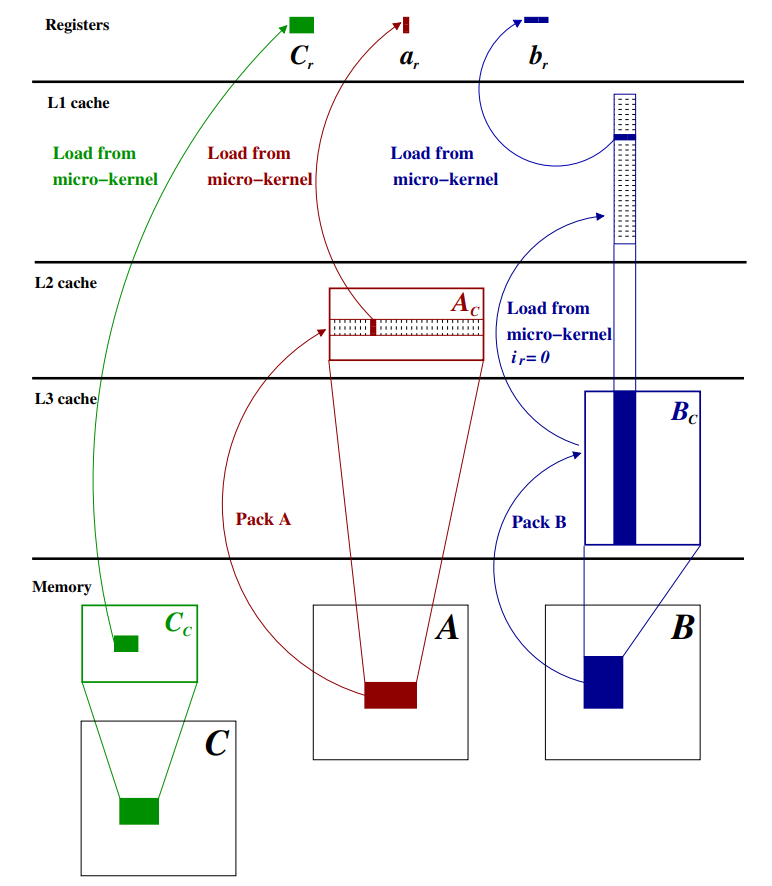

# Guide des scripts de test

## Expériences GEMM (Multiplication Matricielle)

Pour les expériences sur la multiplication matricielle (thread scaling, optimisations, profiling), voir [scripts/ExperienceGEMM/README.md](ExperienceGEMM/README.md).





## Kernel Shape 实验归档

之前围绕 kernel shape 做过一批探索性实验，现在已经统一归档，原因不是这些实验完全没有价值，而是它们的组织方式和接下来准备采用的 `micro-kernel / macro-kernel / real workload path` 结构并不一致，继续把它们放在当前主线里，会让后面的论证变得不清楚。

这批归档内容包括 pure micro-kernel shape 对比、完整 AVX2 GEMM 路径下的固定 `KC` sweep，以及面向当前 AVX2 fast-path 的 real-shape NN benchmark。对应脚本现在放在 `scripts/ExperienceGEMM/archive/2026-04-pre-micro-macro-refactor/`，对应输出放在 `output/ExperienceGEMM/archive/2026-04-pre-micro-macro-refactor/`。如果之后需要回看旧图、旧脚本或旧结论，仍然可以从这个归档目录里找到。

接下来的实验会按更清晰的层次重做。第一层只讨论 micro-kernel 本体，第二层讨论 macro-kernel 或 blocked GEMM 路径，第三层再看真实 workload 路径里的实际收益。旧实验保留为历史证据，但不再作为当前主线的默认组织方式。

## Autres scripts : générer un diagramme PlantUML

```bash
python3 scripts/Utils/encode_plantuml.py output/thread_scaling.csv
```

## Qualification Stage C

Le script Stage C pré-enregistre un groupe de runs baseline/overlap, exécute les répétitions MPI,
archive les manifests de run, compare les snapshots de paramètres step par step, puis produit
une décision `Pass` / `Partial` / `Fail`.

```bash
python3 scripts/Performance/stage_c_qualification.py \
  --binary ./build-mpi/ppn_train \
  --out-root /tmp/stage_c_ws2 \
  --world-size 2 \
  --repeats 3 \
  -- \
  --dataset mnist \
  --data_dir mnist \
  --model mlp \
  --epochs 1 \
  --batch_size 10000 \
  --optimizer sgd \
  --learning_rate 0.01 \
  --seed 42 \
  --bucket_size_bytes 1048576
```

## Autre script

```bash
# 1. Verrouiller la fréquence CPU à 4.0GHz (sudo requis)
echo "Setting CPU frequency..."
sudo cpupower frequency-set -g performance
sudo cpupower frequency-set -u 4000MHz -d 4000MHz

# 2. Recompiler (Release + profiling)
sudo taskset -c 0-7 bash scripts/ExperienceGEMM/find_optimal_threads.sh

# 4. Générer le rapport gprof
echo "Generating gprof report..."
gprof build/ppn_train gmon.out > analysis_final.txt
echo "Report saved to analysis_final.txt"

# 5. Restaurer l'environnement CPU
echo "Restoring CPU environment..."
sudo cpupower frequency-set -g powersave
sudo cpupower frequency-set -d 421MHz -u 5386MHz

echo "All done!"
```

## Manuel de l'entraînement testé

### 1. Compilation

Assurez-vous d'être à la racine du projet :

```bash
mkdir -p build
cd build
cmake ..
make ppn_train
cd ..
```

### 2. Exemples d'utilisation

```bash
./scripts/ExperienceHPO/exp_learning_rate.sh
python3 scripts/ExperienceHPO/analyze_results_lr.py
python3 scripts/ExperienceHPO/plot_lr_curves.py
```
