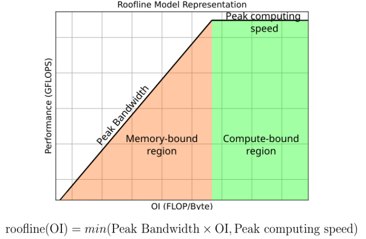

# Quiz

## Ch.02 Memory layout and cache blocking

### *Q.1 Qu'est ce que la localité spatiale ? Qu'est ce que la localité temporelle ?

**Réponse**

- La localité spatiale : si on accède à une adresse, il est probable qu'on accède ensuite à des adresses voisines ou proches.
- La localité temporelle : si une donnée vient d'être utilisée, il est probable qu'elle soit réutilisée bientôt.
- Le cache exploite la localité spatiale en transférant les données par cache lines, et la localité temporelle en conservant les données récemment utilisées, ce qui réduit le coût moyen des accès mémoire.

### *Q.2 Quelle est la difference entre le cache L1i et L1d ?

**Réponse** `L1i` est le cache d'instructions : il fournit au front-end les instructions du flot d'exécution. `L1d` est le cache de données : il stocke les données lues ou écrites par le programme.

### *Q.3 Expliquer qu'est ce que le TLB ?

**Réponse** Le TLB, pour Translation Lookaside Buffer, est un petit cache de traductions d'adresses virtuelles vers adresses physiques.

### Q.4 Qu'est-ce qu'une cache line ? Pourquoi l'accès contigu est-il plus efficace ?

**Réponse** Une cache line est l'unité matérielle de remplissage du cache.
Un accès contigu est plus efficace car plusieurs éléments utiles d'une même ligne sont consommés, ce qui réduit le gaspillage de bande passante, aide le prefetching et limite les misses ; un accès dispersé ou à grand stride n'utilise qu'une petite partie de chaque ligne.

### Q.5 Quelle est la différence entre `row-major` et `column-major` ? Pourquoi cela change-t-il la bonne façon de parcourir un tableau ?

**Réponse** `row-major` et `column-major` décrivent la façon dont un tableau est linéarisé en mémoire. En `row-major`, la dimension colonne est contiguë ; en `column-major`, c’est la dimension ligne.
La boucle interne suit en général cette dimension contiguë pour mieux préserver la localité spatiale, la bande passante et souvent la vectorisation.

### *Q.6 Qu'est ce qu'un tableau de structure (Structure of Arrays, SoA) ?

**Réponse** En SoA, chaque champ est stocké dans son propre tableau, par exemple `x[]`, `y[]`, `z[]`.

### *Q.7 Qu'est ce qu'une structure de tableau (Array of Structures, AoS) ?

**Réponse** En AoS, on stocke un tableau dont chaque élément est une structure complète, par exemple `particles[i]` contenant tous les champs d'une particule.

### *Q.8 Expliquez dans quelles cas il est plus judicieux d'utiliser l'une ou l'autre.

**Réponse** SoA est généralement meilleur quand les calculs parcourent un même champ sur beaucoup d'éléments, car les accès deviennent contigus et vectorisables. AoS est souvent préférable quand on manipule un objet complet à la fois, quand la lisibilité prime, ou quand plusieurs champs du même objet sont utilisés ensemble à chaque accès. Le bon choix dépend donc du motif d'accès dominant.

### Q.9 Pourquoi l'ordre des champs d'une structure peut-il changer sa taille mémoire ?

**Réponse** Chaque type a une contrainte d'alignement, donc le compilateur ajoute du padding pour placer chaque champ sur une adresse valide. L'ordre des champs change ainsi le padding interne, et parfois le padding final pour que les éléments d'un tableau de structures restent alignés. Il vaut mieux perdre quelques octets que provoquer des accès désalignés, souvent plus lents.

### Q.10 Qu'est-ce que le cache blocking ? Pourquoi améliore-t-il les performances ?

**Réponse** Le cache blocking consiste à réduire le working set pour qu’un petit bloc reste dans le cache pendant sa réutilisation.
On recharge alors moins souvent les mêmes données, on augmente leur réutilisation dans le cache et on réduit les accès mémoire inutiles.

## Ch.03 NUMA

### *Q.1 Qu'est ce qu'une architecture NUMA ? Expliquer qu'est ce que l'“effet NUMA” ?

**Réponse** Une architecture NUMA répartit physiquement la mémoire par nœuds, donc un cœur atteint plus vite sa mémoire locale qu'une mémoire distante.
L'effet NUMA est la perte de performance provoquée par des accès fréquents à des pages placées sur un autre nœud, car chaque accès traverse plus de liens et consomme de la bande passante distante.

### *Q.2 Expliquer ce qu'est la politique de “first touch”.

**Réponse** Le first touch signifie qu'une page physique n'est réellement allouée qu'au premier accès effectif, souvent à la première écriture. Elle est alors placée sur le nœud NUMA du thread qui la touche.

### *Q.3 Est ce que le first touch permet toujours de bien gérer les effets NUMA ? Expliquez la réponse.

**Réponse** Non. Il n'aide que si l'initialisation ressemble au schéma d'accès futur. Si un thread place toutes les pages puis que d'autres les utilisent, ces pages deviennent distantes pour la plupart d'entre eux.

### *Q.4 Qu'est ce que le false-sharing ou faux-partage ? Comment peut-on l'éviter ?

**Réponse** Le false sharing apparaît quand plusieurs threads écrivent des données différentes situées dans la même cache line. Le partage logique n'existe pas, mais la cohérence agit quand même au niveau de la ligne, qui invalide et migre entre cœurs.
On l'évite en séparant les écritures par cache line : padding, alignement, partitionnement des données et scheduling plus propre.

### Q.5 Qu'est-ce que la cache coherency ? Pourquoi peut-elle coûter cher ?

**Réponse** La cache coherency garantit que lorsqu'un cœur écrit une donnée partagée, les autres cœurs ne continuent pas à lire une copie périmée de cette donnée.
Son coût vient surtout des invalidations et des transferts de cache lines lors des écritures, ce qui ajoute messages, latence et migrations, surtout entre sockets.

### Q.6 Pourquoi l'accès à un cache distant sur le même socket, puis sur un autre socket, est-il plus lent ? Comment peut-on limiter ce problème ?

**Réponse** Un cache distant est plus lent car la requête traverse plus de niveaux et de liens ; sur un autre socket, elle franchit en plus l'interconnexion inter-socket. Le chemin plus long augmente la latence et réduit la bande passante utile.
On limite cela par l'affinité et par un placement cohérent des threads et des données.

### Q.7 Pourquoi une initialisation parallèle est-elle souvent meilleure qu'une initialisation séquentielle sur une machine NUMA ?

**Réponse** Une initialisation séquentielle place souvent trop de pages sur un seul nœud, car un seul thread les touche en premier. Une initialisation parallèle répartit au contraire le first touch entre les threads qui utiliseront les données, donc aligne mieux placement physique et calcul.

### Q.8 Quel est le lien entre data locality et NUMA locality ?

**Réponse** La data locality consiste à garder les données près du calcul. La NUMA locality est la même idée à l’échelle des nœuds mémoire : les données doivent être placées près des cœurs qui les utilisent.

### Q.9 Quelle est la différence entre true sharing et false sharing ?

**Réponse** Le true sharing correspond à un vrai partage de la même donnée entre threads ; le coût de cohérence est alors normal. Le false sharing produit presque le même coût matériel, mais sans vrai partage : seules des données distinctes cohabitent dans la même cache line.

### Q.10 Pourquoi NUMA affecte-t-il aussi la bande passante et les périphériques d'I/O ?

**Réponse** NUMA affecte aussi la bande passante, car les accès distants passent par des liens partagés qui peuvent saturer. Le même raisonnement vaut pour l'I/O attaché à un socket : GPU, NIC ou stockage sont plus efficaces lorsqu'ils sont utilisés depuis les cœurs proches.

## Ch.04 The Roofline model

### Q.1 Qu'est-ce que le modèle Roofline ?

**Réponse** Le modèle Roofline relie la performance d'un code à deux plafonds : un plafond mémoire fixé par la bande passante, et un plafond calcul fixé par le pic de FLOPs. Il sert à voir rapidement si un noyau est surtout limité par les transferts ou par le calcul.

According to its Operational Intensity (Ratio of operations per bytes moved), one program is either memory-bound or compute-bound.

### Q.2 Quelle est la différence entre une application memory-bound et compute-bound ?

**Réponse** Une application memory-bound attend surtout les données ; une application compute-bound bute surtout sur le plafond de FLOPs. La première s'améliore surtout par la localité et la réduction du trafic, la seconde par vectorisation, ILP et meilleure exploitation des unités de calcul.

## Ch.05 Tools

### *Q.1 Citez 4 outils d'analyse et d'optimisation des performances et expliquez leurs usages.

**Réponse** `perf + KDAB Hotspot` servent à lire les événements matériels et à localiser visuellement où le temps et les stalls partent ; `gprof` donne un profil au niveau des fonctions ; `MAQAO` analyse finement le code machine et les limites microarchitecturales ; `TAU` profile et trace les applications parallèles pour exposer calcul, communication et synchronisation.

## Ch.06 Compilers

### Q.1 Quel est le rôle du préprocesseur ?

**Réponse** Le préprocesseur réécrit le code avant compilation : il inclut les en-têtes, développe les macros et résout les compilations conditionnelles comme `#ifdef`. Le compilateur ne voit donc pas le fichier source original, mais le texte déjà transformé par cette étape.

### Q.2 Qu'est-ce que GIMPLE ? Pourquoi est-il utile ?

**Réponse** `GIMPLE` est une représentation intermédiaire simplifiée de GCC, proche du code à trois adresses.
En cassant les expressions complexes en opérations élémentaires et en rendant le flot plus explicite, elle facilite les passes d'optimisation comme la propagation, la vectorisation ou les optimisations de boucles.

### Q.3 Quel est le rôle du middle-end ?

**Réponse** Le middle-end réalise l'essentiel des optimisations indépendantes de l'architecture cible. Il travaille sur l'IR, transforme le programme pour réduire le travail inutile ou mieux exposer le parallélisme, puis transmet une version plus optimisable au back-end.

## Ch.07 ILP

### *Q.1 Qu'est ce que l'Instruction Level Parallelism (ILP) ? En quoi cela est important pour les performances d'un code ?

**Réponse** L'ILP correspond à la possibilité d'exécuter ou de faire avancer en parallèle plusieurs instructions indépendantes.
Il est notamment exploité grâce au pipeline, qui permet de faire coexister plusieurs instructions à différents stades d'exécution. Plus le code expose de telles instructions, moins les unités d'exécution restent inactives et plus le processeur peut exécuter plus d'instructions utiles par cycle.

## Ch.08 Vectorization

### *Q.1 Comment fonctionne la vectorisation ?

**Réponse** La vectorisation utilise des instructions SIMD pour appliquer la même opération à plusieurs éléments en une seule instruction. Elle augmente donc le nombre d'opérations utiles par instruction émise et améliore le débit surtout lorsque les accès sont réguliers et que les dépendances sont faibles ; un bon alignement aide souvent les performances, mais n'est pas toujours une condition nécessaire.

## Ch.09 MPI

### *Q.1 Qu'est ce que la bande passante (bandwidth) lors de l'envoi d'un message MPI ?

**Réponse** En MPI, la bande passante est le débit de données soutenu une fois le transfert lancé. Elle domine le coût des gros messages, car quand la taille augmente, c'est surtout la quantité d'octets par seconde que le réseau peut fournir qui fixe le temps total.

### *Q.2 Qu'est ce que la latence (latency) lors de l'envoi d'un message MPI ?

**Réponse** En MPI, la latence est le coût fixe pour initier un message avant que le débit soutenu ne compte vraiment. Elle domine surtout les petits messages, car le temps de démarrage y pèse plus lourd que le temps passé à transférer les données elles-mêmes.

### Q.3 Qu'est-ce que le domain decomposition ? Pourquoi est-il nécessaire ?

**Réponse** Le domain decomposition répartit simultanément les données et le calcul entre processus, souvent en donnant un sous-domaine de maillage à chacun.
Il est nécessaire parce que le coût MPI dépend directement de ce découpage : un mauvais partitionnement augmente frontières, communications et déséquilibres, donc détruit la scalabilité.

### Q.4 Quelle est la différence entre une décomposition verticale et une décomposition horizontale d'un stencil 2D ?

**Réponse** Dans une décomposition verticale, chaque processus reçoit une bande de colonnes ; avec un stockage `row-major`, les données de bord sont alors souvent moins contiguës, ce qui peut imposer des accès stridés ou du packing lors des échanges. Dans une décomposition horizontale, chaque processus reçoit un bloc de lignes ; avec ce même stockage, les frontières sont souvent plus contiguës et plus faciles à regrouper. Le coût réel dépend donc du layout mémoire et du schéma d'échange, pas seulement du mot “vertical” ou “horizontal”.

### *Q.5 Qu'appelle-t-on des mailles “fantômes” (ou ghost cells) ? Quelle est leur utilité ?

**Réponse** Les ghost cells, ou halo cells, sont des copies locales des données voisines stockées autour d'un sous-domaine.
Elles transforment un besoin de données distantes en lecture locale entre deux échanges de halo, ce qui évite de communiquer à chaque opération sur la frontière.

### Q.6 Qu'est-ce que l'asynchronous progression ?

**Réponse** L'asynchronous progression est la capacité de MPI à faire avancer un message pendant que l'application calcule. Son intérêt est le recouvrement calcul/communication, mais ce gain n'existe que si l'implémentation progresse réellement en arrière-plan.

### Q.7 Pourquoi une communication MPI non bloquante ne progresse-t-elle pas toujours toute seule ?

**Réponse** Une communication non bloquante n'assure pas automatiquement une progression complète en arrière-plan. Selon l'implémentation MPI, les messages peuvent ne progresser que lorsque le thread appelle à nouveau des fonctions MPI. D'autres implémentations utilisent un thread de progression, un cœur dédié, ou parfois une aide de la carte réseau. C'est pourquoi non bloquant ne veut pas toujours dire recouvrement effectif.

### *Q.8 Quelle est la différence entre `MPI_Barrier` et `MPI_Ibarrier` ?

**Réponse** `MPI_Barrier` synchronise de façon bloquante : le processus s'arrête jusqu'à ce que tous arrivent.
`MPI_Ibarrier` lance la même synchronisation mais rend la main immédiatement, ce qui permet de recouvrir l'attente avec du calcul ou d'autres communications avant `MPI_Test` ou `MPI_Wait`.

### *Q.9 Citez 2 topologies réseaux différentes. Expliquez leurs avantages et inconvénients.

**Réponse** Un anneau est simple et peu coûteux, mais son diamètre est plus grand et les messages traversent souvent plusieurs sauts. Un fat-tree réduit mieux la contention et soutient mieux la bande passante globale, mais au prix d'un réseau plus cher et plus complexe.

### *Q.10 Schématiser les échanges de messages entre 8 rangs MPI pour une implémentation efficace de `MPI_Gather`. Expliquer pourquoi un tel choix.

**Réponse** Une implémentation efficace peut par exemple utiliser un arbre binomial : étape 1, `1 -> 0`, `3 -> 2`, `5 -> 4`, `7 -> 6` ; étape 2, `2 -> 0`, `6 -> 4` ; étape 3, `4 -> 0`. L'idée est de réduire la profondeur à `log2(p)` et d'éviter que le rang racine reçoive tout simultanément, ce qui limite la contention et la surcharge au sommet.

## Ch.10 Placement

### Q.1 Pourquoi le placement est-il important ?

**Réponse** Le placement détermine quels cœurs, caches, nœuds NUMA et liens de communication un thread ou un processus utilisera réellement. Un mauvais placement casse la localité mémoire, augmente les accès distants et peut faire passer des communications sur des chemins plus coûteux.

### Q.2 Qu'est-ce que `OMP_PLACES` et `OMP_PROC_BIND` ?

**Réponse** `OMP_PLACES` décrit l'ensemble des ressources matérielles candidates pour les threads OpenMP, par exemple des cœurs ou des sockets. `OMP_PROC_BIND` dit ensuite si les threads doivent y rester attachés et selon quelle politique de répartition ; ensemble, ils contrôlent donc l'affinité réelle.

### Q.3 Quelle est la différence entre `close` et `spread` ?

**Réponse** `close` compacte les threads sur des places voisines pour favoriser le partage de caches et parfois la proximité mémoire. `spread` les écarte pour répartir la pression sur les ressources et occuper plus largement la machine ; le bon choix dépend donc du besoin dominant entre partage/localité et dispersion/équilibrage.

## Ch.11 Scalability

### Q.1 Qu'est-ce que la loi d'Amdahl ?

**Réponse** La loi d'Amdahl donne la borne haute du speedup quand une partie du programme reste séquentielle. Même avec un nombre infini de processeurs, cette fraction non parallélisable fixe un plafond incompressible sur le temps total.

### Q.2 Pourquoi la loi d'Amdahl limite-t-elle le speedup ?

**Réponse** Elle limite le speedup parce que le parallélisme n'accélère pas la fraction séquentielle. Quand on ajoute des processeurs, le temps parallèle baisse, mais le temps séquentiel reste presque constant et finit par dominer le total.

### *Q.3 Quelle est la différence entre scalabilité forte (strong scaling) et scalabilité faible (weak scaling) ?

**Réponse** La strong scaling mesure ce que l'on gagne sur un problème fixe quand on augmente les ressources.
La weak scaling mesure si le temps reste stable quand on augmente à la fois ressources et taille du problème pour garder une charge similaire par processeur.

### Q.4 Pourquoi un petit changement dans un schéma de communication peut-il changer fortement la scalabilité ?

**Réponse** Un petit changement peut modifier la profondeur des communications, la contention ou le degré de sérialisation entre processus. Comme ces coûts grossissent avec le nombre de rangs, un schéma à peine différent localement peut produire une scalabilité très différente globalement.

## Ch.12 Threads-Synchronisation

### *Q.1 Donner les différences (avantages, inconvénients) entre attente active et attente passive.

**Réponse** L'attente active garde le cœur occupé à tester en boucle une condition ; elle minimise la latence de réaction mais gaspille du temps CPU et de l'énergie.
L'attente passive cède le processeur jusqu'au réveil ; elle économise les ressources mais paie un surcoût de réveil et de replanification.

### Q.2 Quelle est la différence entre `#pragma omp critical` et `#pragma omp atomic` ?

**Réponse** `critical` sérialise une section arbitraire via un verrou implicite ; il est général mais ajoute plus de contention et de surcoût. `atomic` ne protège qu'une opération mémoire simple que le matériel peut souvent réaliser directement ; il est donc plus limité, mais généralement moins coûteux.
