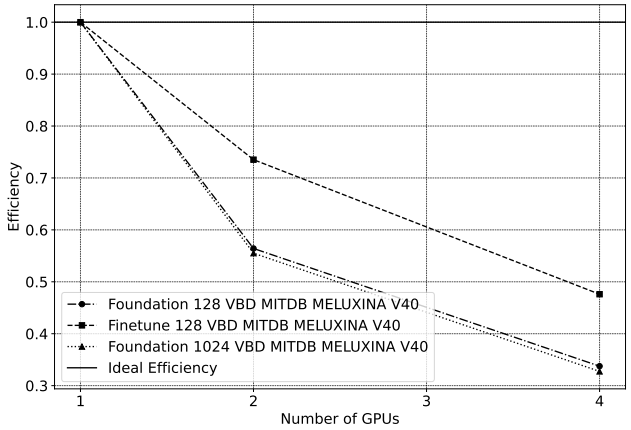
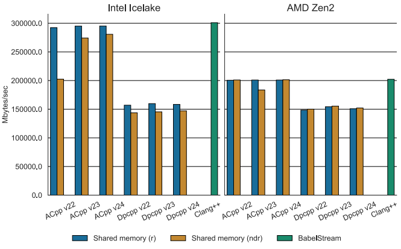
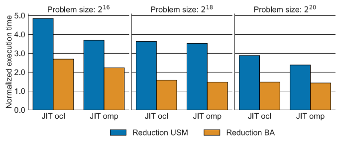
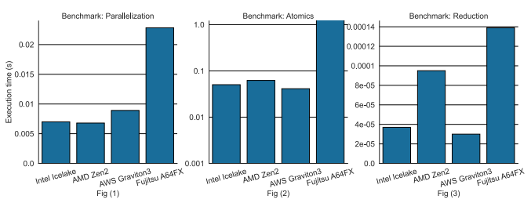
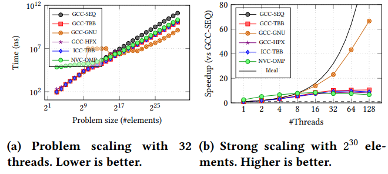
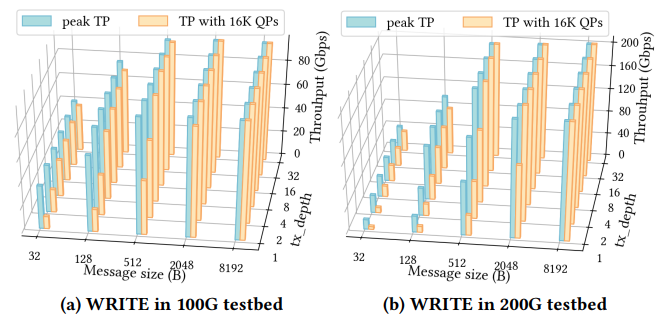
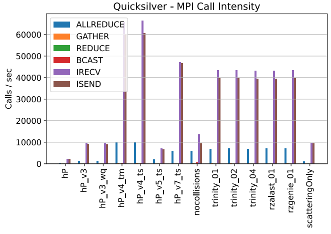
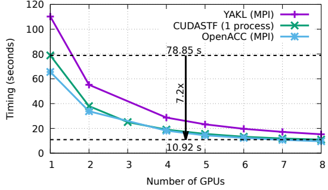
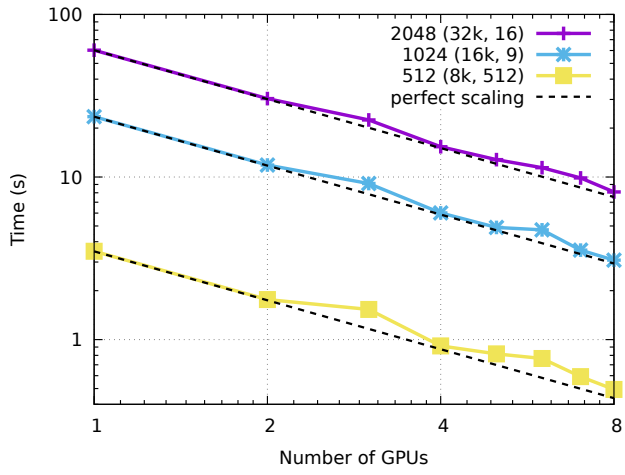
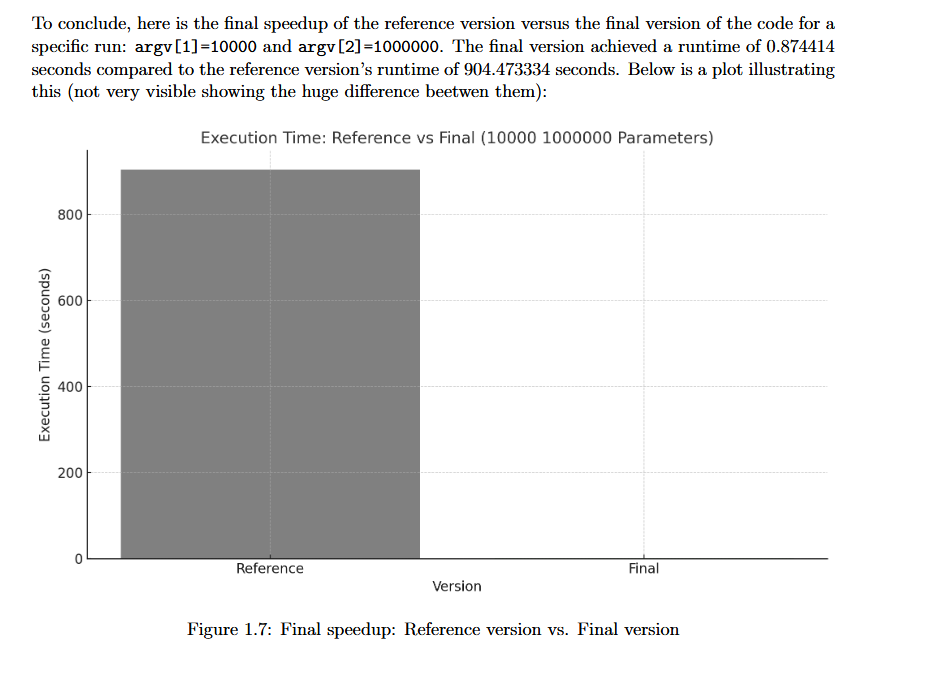

# Appendix 附录

## Methodology for measuring and visualizing performance metrics 性能指标测量与可视化方法

An overview of performance metrics used in HPC, and how to correctly visualize them. 本节概述 HPC 中常用的性能指标，以及如何正确地将其可视化。

Excellent resources from Torsten Hoefler (Gordon Bell Prize winner) on [Scientific Benchmarking of Parallel Computing Systems](https://htor.inf.ethz.ch/publications/index.php?pub=222): 以下是 Torsten Hoefler（戈登贝尔奖获得者）关于[并行计算系统的科学基准测试](https://htor.inf.ethz.ch/publications/index.php?pub=222)的优秀资源：

- [Paper](https://htor.inf.ethz.ch/publications/img/hoefler-scientific-benchmarking.pdf) - 论文
- [Slides](https://htor.inf.ethz.ch/publications/img/hoefler-scientific-benchmarking_slides.pdf) - 幻灯片
- [Recorded talk](https://www.youtube.com/watch?v=HwEpXIWAWTU) - 录制讲座

### Scalability 可扩展性

In the most general sense, **scalability** (or **scaling**) is defined as "_the ability to handle more work as the amount of computing resources grows_". For software, scalability is sometimes referred to as parallelization 在最一般的意义上，**scalability**（可扩展性，或 **scaling**）被定义为“_随着计算资源的增加，处理更多工作负载的能力_”。对于软件而言，可扩展性有时也被称为并行化
efficiency — the ratio between the actual speedup and the ideal speedup obtained when using a certain number of efficiency，即在使用一定数量处理器时，实际加速比与理想加速比之间的比值
processors. The speedup in parallel computing can be straightforwardly defined as:。在并行计算中，加速比可以直接定义为：

$$
Speedup = \frac{t_1}{t_N}
$$

Where $t_1$ is the computational time for running the software with one core (i.e. sequentially), and $t_N$ is the 其中，$t_1$ 是软件在单个核心上运行（即串行执行）所需的计算时间，而 $t_N$ 是
computational time running the same software with N cores or processors. Ideally, we want software to have a linear 使用同一软件在 N 个核心或处理器上运行的计算时间。理想情况下，我们希望软件具有线性
speedup that is equal to the number of processors (i.e. $Speedup = N$). Unfortunately, this is a very challenging goal 加速比，即等于处理器数量（即 $Speedup = N$）。然而，这对真实世界应用来说是一个非常具有挑战性的目标
for real world applications to attain (see [Amdhal's Law](https://en.wikipedia.org/wiki/Amdahl's_law)). 去实现（参见 [Amdhal's Law](https://en.wikipedia.org/wiki/Amdahl's_law)）。

Scalability testing measures the ability of an application to perform well or better with varying problem sizes and 可扩展性测试衡量的是应用程序在不同问题规模和
numbers of processors. It does not test the applications general funcionality or correctness. 处理器数量下维持良好或更佳性能的能力。它并不测试应用程序的一般功能性或正确性。

**Strong scaling** 强扩展

In case of strong scaling, the number of processors is **increased** while the problem size remains **constant**. This 在强扩展场景下，处理器数量会**增加**，而问题规模保持**不变**。这将
results in a **reduced** workload per processor as the amount of accessible parallelism increases. 导致每个处理器的工作负载**减少**，因为可利用的并行性增加了。

Strong scaling is mostly used for long-running CPU-bound applications to find a setup which results in a reasonable 强扩展主要用于运行时间较长、受 CPU 限制的应用，以找到一种能在合理
runtime with moderate resource costs. The individual workload must be kept high enough to keep all processors fully 资源成本下获得合适运行时间的配置。单个处理器上的工作负载必须足够高，以保持所有处理器都充分
occupied. The speedup achieved by increasing the number of processes usually decreases more or less continuously. 忙碌。随着进程数增加所获得的加速比通常会或多或少地持续下降。

Strong scaling speedup can be calculated as: 强扩展加速比可按如下方式计算：

$$
Speedup = \frac{t_1}{t_N}
$$

**Weak scaling** 弱扩展

In case of weak scaling, both the number of processors and the problem size are **increased**. This results in a 在弱扩展场景下，处理器数量和问题规模都会**增加**。这会导致
**constant** workload per processor. 每个处理器上的工作负载保持**恒定**。

Weak scaling is mostly used for large memory-bound applications where the required memory cannot be satisfied by a 弱扩展主要用于大型、受内存限制的应用，这类应用所需内存无法由单个
single node. They usually scale well to higher core counts as memory access strategies often focus on the nearest 节点满足。它们通常能够很好地扩展到更高的核心数，因为内存访问策略往往只关注最近的
neighboring nodes while ignoring those further away and therefore scale well themselves. The upscaling is usually 相邻节点而忽略更远的节点，因此其自身也较易扩展。扩展能力通常仅受
restricted only by the available resources or the maximum problem size. 可用资源或最大问题规模的限制。

Weak scaling efficiency can be calculated as: 弱扩展效率可按如下方式计算：

$$
Efficiency = \frac{t_1}{t_N}
$$

### Metrics 指标

Some metrics used in HPC: HPC 中使用的一些指标包括：

- Time - 时间
  - Wall-clock time - 墙钟时间
  - Clock cycles - 时钟周期
- Computer processing efficiency - 计算处理效率
  - IPC, latency, throughput - IPC、延迟、吞吐量
  - IPS, FLOPS - IPS、FLOPS
  - Arithmetic intensity - 算术强度
- Bandwidth - 带宽

Do not forget about measurement accuracy! Benchmarks you conduct to measure specific metrics should be run multiple 不要忘记测量精度！为了测量特定指标而进行的基准测试应当多次运行，
times and the samples results should be analyzed: 并对样本结果进行分析：

- Minimum and maximum - 最小值与最大值
- Mean/average - 均值/平均值
- Median - 中位数
- Deviation/error - 偏差/误差

### Performance data visualization 性能数据可视化

Some (non-exhaustive) advice to make good plots: 一些用于绘制优秀图表的建议（并不完整）：

- Always start your y-axis at zero. - y 轴应始终从 0 开始。
  > "if zero is not the start, the truth falls apart" > “如果零不是起点，真相就会走样”

- Report standard deviation/error: this makes it clear if your measurements are stable or not. - 报告标准差/误差：这样可以清楚表明你的测量结果是否稳定。
- Avoid log/log axes: they make the plot harder to read and obscure small values (only exception is strong scaling speedup). - 避免使用双对数坐标轴：这会让图表更难阅读，并掩盖较小的数值（唯一例外是强扩展加速比）。
- Know when to use log scale (particularly on the y-axis): if your data spans several orders of magnitude, it is easier to read and avoids compressing small data points at the bottom of the graph. - 要知道何时使用对数尺度（尤其是 y 轴）：如果你的数据跨越多个数量级，这样会更容易阅读，也能避免小数据点被压缩到图底部。
- Choose the most relevant unit for your axes. - 为坐标轴选择最合适的单位。
- Whenever possible, avoid expressing labels in powers of 2 as they make it harder to grasp the actual value. - 在可能的情况下，避免用 2 的幂来表示标签，因为这会让真实数值更难直观理解。
- Use consistent ranges of values on your axes, particularly when grouping subplots together. - 在坐标轴上使用一致的数值范围，尤其是在将多个子图放在一起时。
- Vary your line- and marker-style to visually differentiate data (makes your plot color-blind- and black&white- friendly too). - 改变线型和标记样式以在视觉上区分数据（这也能让图表对色盲用户以及黑白打印更友好）。
- When plotting strong/weak scaling performance, do not forget about the "ideal" line. - 在绘制强扩展/弱扩展性能图时，不要忘记加入“理想”曲线。

### What not to do 不该怎么做

Examples of bad plots (think why) 错误图表示例（想想为什么不好）

<figure markdown="span">
  
  <figcaption>Example #1 - Weak Scaling Efficiency 示例 #1 - 弱扩展效率</figcaption>
</figure>

<figure markdown="span">
  
  <figcaption>Example #2 - Parallel Normalized Runtime 示例 #2 - 并行归一化运行时间</figcaption>
</figure>

<figure markdown="span">
  
  <figcaption>Example #3 - Reduction Normalized Runtime 示例 #3 - 归约归一化运行时间</figcaption>
</figure>

<figure markdown="span">
  
  <figcaption>Example #4 - Execution Runtime 示例 #4 - 执行运行时间</figcaption>
</figure>

<figure markdown="span">
  
  <figcaption>Example #5 - Problem & Strong Scaling 示例 #5 - 问题规模与强扩展</figcaption>
</figure>

<figure markdown="span">
  
  <figcaption>Example #6 - Queue Pair Throughput 示例 #6 - 队列对吞吐量</figcaption>
</figure>

<figure markdown="span">
  
  <figcaption>Example #7 - MPI Call Intensity 示例 #7 - MPI 调用强度</figcaption>
</figure>

<figure markdown="span">
  
  <figcaption>Example #8 - Strong Scaling of mini-app 示例 #8 - 小型应用的强扩展</figcaption>
</figure>

<figure markdown="span">
  
  <figcaption>Example #9 - Strong Scaling of dot prod 示例 #9 - 点积程序的强扩展</figcaption>
</figure>

<figure markdown="span">
  
  <figcaption>Example #10 - Baseline vs. Final Runtime 示例 #10 - 基线运行时间与最终运行时间对比</figcaption>
</figure>
