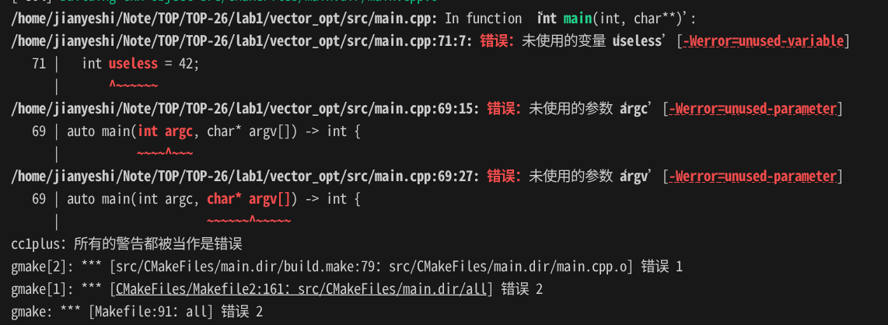
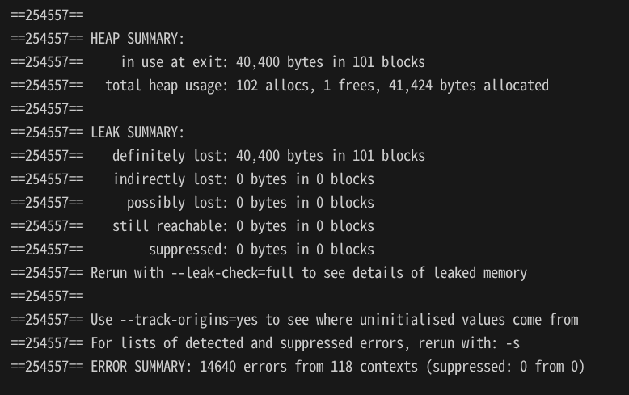
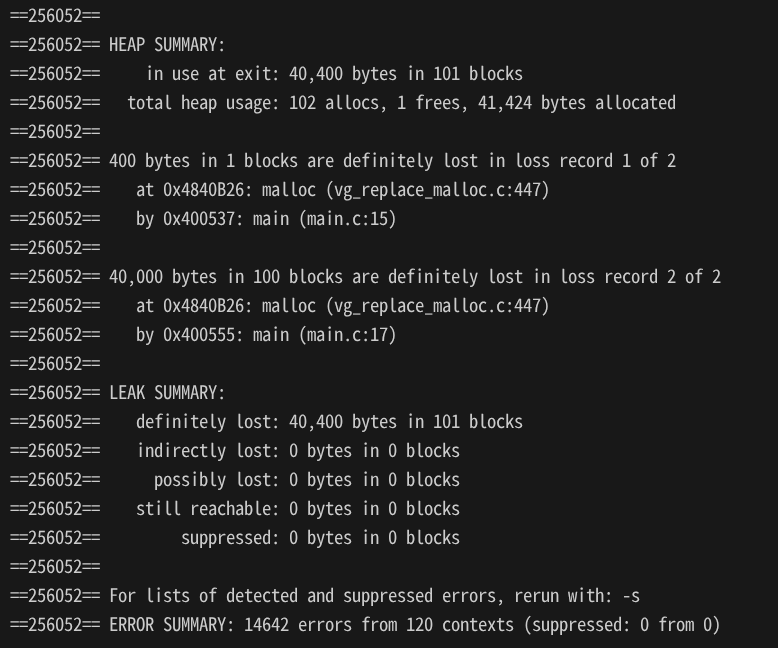
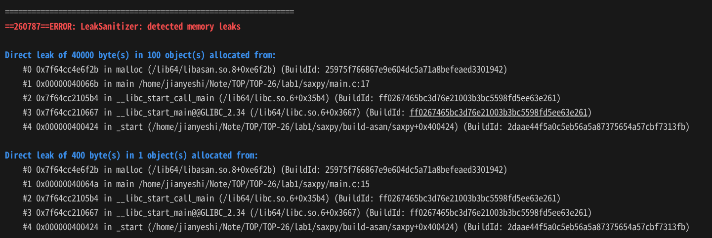

# Lab 1: HPC Toolchains & Performance profiling 实验1：HPC工具链与性能分析

A reminder on compilers, build systems, developement tools and profilers for HPC. 这是对 HPC 中编译器、构建系统、开发工具和性能分析器的回顾。

The material for this lab is available on the following [GitHub repo](https://github.com/dssgabriel/TOP-26/tree/main/lab1). 本实验材料可在以下 [GitHub 仓库](https://github.com/dssgabriel/TOP-26/tree/main/lab1)中找到。

## 1 CMake build system CMake 构建系统

1. Write a minimal `CMakeLists.txt` file for the `vector` code. 1. 为 `vector` 代码编写一个最小的 `CMakeLists.txt` 文件。

   文件在：[CMakeLists.txt](../../TOP-26/lab1/vector_opt/src/CMakeLists.txt)

2. Improve your build system by splitting the `CMakeLists.txt` into multiple files in the directory hierarchy. Use CMake best practices. 2. 通过将 `CMakeLists.txt` 按目录层级拆分为多个文件来改进你的构建系统，并采用 CMake 最佳实践。

   文件在：[CMakeLists.txt](../../TOP-26/lab1/vector_opt/CMakeLists.txt) 和 [src/CMakeLists.txt](../../TOP-26/lab1/vector_opt/src/CMakeLists.txt)

Relevant resources for this exercise: 本练习的相关资源如下：

- [Modern CMake guide](https://cliutils.gitlab.io/modern-cmake/README.html) - 现代 CMake 指南
- [CMake's `target_sources` command](https://cmake.org/cmake/help/v3.31/command/target_sources.html) - CMake 的 `target_sources` 命令
- [Examplar CMake](https://github.com/bemanproject/exemplar/blob/main/CMakeLists.txt) - CMake 示例
- [NYU's VIP CMake lab](https://nyu-processor-design.github.io/getting_started/onboarding/02_cmake.html) - 纽约大学 VIP CMake 实验

## 2 Compiler toolchains and flags 编译器工具链与编译选项

1. Using the GCC compiler, build `vector` into an executable without any optimization flags. 1. 使用 GCC 编译器在不加任何优化选项的情况下将 `vector` 构建为可执行文件。
What do you notice on the display of the values of vector `v3`? 你在向量 `v3` 的数值显示上注意到了什么？

   v3 中的所有元素都显示为 3，也就是每一项都满足 v3[i] = v1[i] + v2[i] = 1 + 2 = 3。因此从显示结果看，向量加法的结果是正确的。

2. Add the compilation flags `-Wall`, `-Wextra` and `-Werror`. 2. 添加编译选项 `-Wall`、`-Wextra` 和 `-Werror`。  
Fix all the warnings emitted by the compiler and recompile the program. 修复编译器给出的所有警告，并重新编译程序。

   

3. Run the corrected program and record the time displayed. 3. 运行修正后的程序并记录显示的时间。

   Elapsed time: 9199335251ns, average: 306ns

4. Compile different versions of the code using flags `-O1`, `-O2`, `-O3` and `-Ofast`. Run them each and record their execution time. 4. 使用 `-O1`、`-O2`、`-O3` 和 `-Ofast` 选项分别编译代码的不同版本，逐一运行并记录执行ns时间。  
What do you see? Compare the generated assembly. 你看到了什么？比较生成的汇编代码。

   这里的计算是双精度浮点计算，而 `-Ofast` 只影响浮点计算，`-Ofast` 选项的本质是放弃精确计算，不再遵守 IEEE 754 标准，因此计算结果可能不准确。有的时候（从版本18开始），编译时会有一个警告告诉你，OFast实际上只是O3，如果你真的想要OFast的常规行为，就需要额外启用 `-ffast-math`。OFast的性能不一定比O3更好，具体取决于代码和平台。

   ```bash
   # Compile avec O1
   cmake -B build-O1 -DCMAKE_CXX_FLAGS="-O1"
   cmake --build build-O1
   # Compile avec O2
   cmake -B build-O2 -DCMAKE_CXX_FLAGS="-O2"
   cmake --build build-O2
   # Compile avec O3
   cmake -B build-O3 -DCMAKE_CXX_FLAGS="-O3"
   cmake --build build-O3
   # Compile avec Ofast
   cmake -B build-Ofast -DCMAKE_CXX_FLAGS="-Ofast"
   cmake --build build-Ofast
   # Run the different versions
   ./build-O1/main | rg "Elapsed time"
   ./build-O2/main | rg "Elapsed time"
   ./build-O3/main | rg "Elapsed time"
   ./build-Ofast/main | rg "Elapsed time"
   ```

   ```txt
   Elapsed time: 467994540ns, average: 15ns
   Elapsed time: 477606670ns, average: 15ns
   Elapsed time: 251ns, average: 0ns
   Elapsed time: 190ns, average: 0ns
   ```

   ```bash
   objdump -d --demangle build-O1/main | sed -n '/<benchmark(long, long)>:/,/^$/p' > bench-O1.s
   objdump -d --demangle build-O2/main | sed -n '/<benchmark(long, long)>:/,/^$/p' > bench-O2.s
   objdump -d --demangle build-O3/main | sed -n '/<benchmark(long, long)>:/,/^$/p' > bench-O3.s
   objdump -d --demangle build-Ofast/main | sed -n '/<benchmark(long, long)>:/,/^$/p' > bench-Ofast.s
   ```

   产生四个汇编文件，分别对应四种优化级别的编译结果。
   O1 版本较短，但保留了“外层 repetitions 循环 + 内层向量元素循环”两层循环。
   O2 版本比 O1 更复杂一些，但本质上也仍保留了两层循环。
   O3 版本更长，在初始化数组时使用了更激进的写法，比如 movups，说明有更强的展开/向量化倾向；同时它还消除了大量冗余的重复计算。
   Ofast 版本与 O3 版本几乎一致，热点汇编结构没有本质差别，因此性能也非常接近。

5. Repeat with a different compiler (e.g. LLVM Clang, Intel ICX, etc.). 5. 使用不同的编译器重复上述过程（例如 LLVM Clang、Intel ICX 等）。  
What differences do you notice? 你注意到了哪些差异？

   ```bash
   # Compile with clang and O1
   cmake -S . -B build-clang-O1 -DCMAKE_CXX_COMPILER=clang++ -DCMAKE_CXX_FLAGS="-O1"
   cmake --build build-clang-O1
   # Compile with clang and O2
   cmake -S . -B build-clang-O2 -DCMAKE_CXX_COMPILER=clang++ -DCMAKE_CXX_FLAGS="-O2"
   cmake --build build-clang-O2
   # Compile with clang and O3
   cmake -S . -B build-clang-O3 -DCMAKE_CXX_COMPILER=clang++ -DCMAKE_CXX_FLAGS="-O3"
   cmake --build build-clang-O3
   # Compile with clang and Ofast
   cmake -S . -B build-clang-Ofast -DCMAKE_CXX_COMPILER=clang++ -DCMAKE_CXX_FLAGS="-O3 -ffast-math -Wno-nan-infinity-disabled"
   cmake --build build-clang-Ofast
   # Compile with icpx and O1
   cmake -S . -B build-icpx-O1 -DCMAKE_CXX_COMPILER=icpx -DCMAKE_CXX_FLAGS="-O1"
   cmake --build build-icpx-O1
   # Compile with icpx and O2
   cmake -S . -B build-icpx-O2 -DCMAKE_CXX_COMPILER=icpx -DCMAKE_CXX_FLAGS="-O2"
   cmake --build build-icpx-O2
   # Compile with icpx and O3
   cmake -S . -B build-icpx-O3 -DCMAKE_CXX_COMPILER=icpx -DCMAKE_CXX_FLAGS="-O3"
   cmake --build build-icpx-O3
   # Compile with icpx and Ofast
   cmake -S . -B build-icpx-Ofast -DCMAKE_CXX_COMPILER=icpx -DCMAKE_CXX_FLAGS="-O3 -ffast-math -Wno-nan-infinity-disabled"
   cmake --build build-icpx-Ofast
   # Run the different versions
   ./build-clang-O1/main | rg "Elapsed time"
   ./build-clang-O2/main | rg "Elapsed time"
   ./build-clang-O3/main | rg "Elapsed time"
   ./build-clang-Ofast/main | rg "Elapsed time"
   ./build-icpx-O1/main | rg "Elapsed time"
   ./build-icpx-O2/main | rg "Elapsed time"
   ./build-icpx-O3/main | rg "Elapsed time"
   ./build-icpx-Ofast/main | rg "Elapsed time"
   ```

   ```txt
   clang -O1:    Elapsed time: 888164182ns, average: 29ns
   clang -O2:    Elapsed time: 316981496ns, average: 10ns
   clang -O3:    Elapsed time: 314453768ns, average: 10ns
   clang -Ofast: Elapsed time: 318476365ns, average: 10ns

   icpx -O1:     Elapsed time: 528320016ns, average: 17ns
   icpx -O2:     Elapsed time: 273414778ns, average: 9ns
   icpx -O3:     Elapsed time: 256086626ns, average: 8ns
   icpx -Ofast:  Elapsed time: 264102876ns, average: 8ns
   ```

   Clang and icpx both improve significantly from O1 to O2/O3. In this test, icpx is faster than clang at the same optimization level, and Ofast does not bring a clear improvement over O3. Clang 和 icpx 从 O1 到 O2/O3 都有显著提升。在这个测试中，icpx 在同一优化级别下比 clang 更快，而 Ofast 相较于 O3 没有明显的性能提升。

## 3 Compilation passes 编译过程阶段

1. Compare the flags included with `-O2` on [GCC 11.x](https://gcc.gnu.org/onlinedocs/gcc-11.5.0/gcc/Optimize-Options.html) and on [GCC 12.x](https://gcc.gnu.org/onlinedocs/gcc-12.5.0/gcc/Optimize-Options.html). 1. 比较 [GCC 11.x](https://gcc.gnu.org/onlinedocs/gcc-11.5.0/gcc/Optimize-Options.html) 和 [GCC 12.x](https://gcc.gnu.org/onlinedocs/gcc-12.5.0/gcc/Optimize-Options.html) 中 `-O2` 所包含的选项。
Which flags differ? 哪些选项不同？

   This comparison can be done with the following commands:可以使用以下命令进行比较：

   ```bash
   gcc-11 -O2 -Q --help=optimizers > gcc11-O2.txt
   gcc-12 -O2 -Q --help=optimizers > gcc12-O2.txt
   diff -u gcc11-O2.txt gcc12-O2.txt
   ```

   The exact differences depend on the compiler version and the target platform, so they should be checked experimentally rather than guessed. 具体差异取决于编译器版本和目标平台，因此应当通过实验检查，而不是直接猜测。

   GCC documentation also states that the set of optimizations enabled at a given optimization level may vary depending on the target and compiler configuration. GCC 官方文档也指出，在同一个优化等级下，实际启用的优化选项集合可能会因目标平台和编译器配置不同而有所变化。

2. Compare the flags included with `-Ofast` on [GCC](https://gcc.gnu.org/onlinedocs/gcc-15.2.0/gcc/Optimize-Options.html) and on [LLVM Clang](https://manpages.debian.org/experimental/clang-22/clang-22.1.en.html). 2. 比较 [GCC](https://gcc.gnu.org/onlinedocs/gcc-15.2.0/gcc/Optimize-Options.html) 与 [LLVM Clang](https://manpages.debian.org/experimental/clang-22/clang-22.1.en.html) 中 `-Ofast` 所包含的选项。
Which flags differ? 哪些选项不同？

   This comparison can be done with the following commands: 可以使用以下命令进行比较：

   ```bash
   gcc -Ofast -Q --help=optimizers > gcc-Ofast.txt
   clang -O3 -ffast-math -### -x c++ /dev/null 2> clang-Ofast.txt
   ```

   For GCC, `-Ofast` enables all `-O3` optimizations and additionally enables more aggressive non-standard optimizations such as `-ffast-math`, `-fallow-store-data-races`, and disables `-fsemantic-interposition`. 对于 GCC，`-Ofast` 会启用全部 `-O3` 优化，并额外启用一些更激进、非严格标准兼容的优化，例如 `-ffast-math`、`-fallow-store-data-races`，同时关闭 `-fsemantic-interposition`。

   For recent Clang versions, `-Ofast` is deprecated and the compiler recommends using `-O3 -ffast-math` instead. Therefore, for LLVM Clang, the practical comparison is between GCC `-Ofast` and Clang `-O3 -ffast-math`. 对于较新的 Clang 版本，`-Ofast` 已被弃用，编译器会建议改用 `-O3 -ffast-math`。因此在 LLVM Clang 上，更实际的比较方式是将 GCC 的 `-Ofast` 与 Clang 的 `-O3 -ffast-math` 进行对照。

   Therefore, GCC and Clang do not expand `-Ofast` in exactly the same way. In both cases, the goal is similar: relax strict standards-compliant floating-point behavior in exchange for potentially better performance. 因此，GCC 和 Clang 对 `-Ofast` 的展开方式并不完全相同。不过两者的总体目标是一致的：都会在一定程度上放宽严格的标准兼容浮点语义，以换取潜在的性能提升。

3. Study the program in the `saxpy` directory, then compile it with the `-fdump-tree-all` flag. Run the `ls` command. 3. 阅读 `saxpy` 目录中的程序，然后使用 `-fdump-tree-all` 选项进行编译，并运行 `ls` 命令。
What do you see? 你看到了什么？

   The program can be built with a small `CMakeLists.txt` and the dump flag enabled with: 可以通过一个简洁的 `CMakeLists.txt` 来构建该程序，并通过以下命令启用 dump 选项：

   ```bash
   cd /home/jianyeshi/Note/TOP/TOP-26/lab1/saxpy
   cmake -B build-dump -DSAXPY_DUMP_TREE_ALL=ON
   cmake --build build-dump
   find build-dump -type f | rg '\.[0-9]+t\.'
   ```

   After compilation, many additional files appear, such as `main.c.c.006t.original`, `main.c.c.007t.gimple`, `main.c.c.016t.cfg`, and `main.c.c.270t.optimized`. 编译完成后，会出现许多额外文件，例如 `main.c.c.006t.original`、`main.c.c.007t.gimple`、`main.c.c.016t.cfg` 和 `main.c.c.270t.optimized`。

4. What does it correspond to? How many do you see? 4. 这些内容分别对应什么？你看到了多少个？

   These files correspond to the different GCC tree/IR compilation passes, from the original source representation to GIMPLE form, control-flow graph construction, SSA form, optimization passes, and final optimized tree dumps. 这些文件对应 GCC 编译过程中的不同 tree/IR 阶段，包括原始源码表示、GIMPLE 形式、控制流图构造、SSA 形式、各种优化阶段以及最终优化后的 tree dump。

   In the `-fdump-tree-all` build without extra optimization flags, I observed 29 tree dump files. 在仅启用 `-fdump-tree-all`、不额外开启优化选项的构建中，我观察到了 29 个 tree dump 文件。

5. Delete the files that have appeared, and recompile with the `-O1` flag. 5. 删除新出现的文件，然后使用 `-O1` 选项重新编译。  
What do you observe? Are any files missing from the previous compilation? 你观察到了什么？相比上一次编译，是否缺少了某些文件？

   Recompiling with `-O1` can be done with: 使用 `-O1` 重新编译可以通过以下命令完成：

   ```bash
   cmake -B build-dump-O1 -DSAXPY_DUMP_TREE_ALL=ON -DCMAKE_C_FLAGS="-O1"
   cmake --build build-dump-O1
   find build-dump-O1 -type f | rg '\.[0-9]+t\.'
   ```

   With `-O1`, I observed many more dump files: 114 in total. This is expected because enabling optimization activates many additional compiler passes, such as constant propagation, dead-code elimination, loop optimizations, and other middle-end analyses. 在 `-O1` 下，我观察到了更多的 dump 文件，总数为 114 个。这是正常现象，因为启用优化后，编译器会运行更多额外的 pass，例如常量传播、死代码消除、循环优化以及其他中端分析过程。

   Therefore, compared with the previous compilation, no important stages are really “missing”; instead, many more optimization-related dumps are added. 因此，与前一次编译相比，并不是某些重要阶段“缺失”了，而是新增了大量与优化相关的 dump 文件。

## 4 Code sanitizers 代码检查与消毒工具

Valgrind is an open-source programming tool for debugging, profiling and identifying memory leaks. (see [Wikipedia page](https://en.wikipedia.org/wiki/Valgrind)) Valgrind 是一个开源编程工具，可用于调试、性能分析以及发现内存泄漏。（参见 [Wikipedia page](https://en.wikipedia.org/wiki/Valgrind)）

AddressSanitizer (or `ASan`) is an open-source programming tool that detects memory corruption bugs such as buffer overflows or accesses to a dangling pointer (use-after-free). AddressSanitizer is based on compiler instrumentation and directly mapped shadow memory. AddressSanitizer is currently implemented in Clang (starting from version 3.1), GCC (starting from version 4.8), Xcode (starting from version 7.x) and MSVC (widely available starting from version 16.9). (see [Wikipedia page](https://en.wikipedia.org/wiki/Code_sanitizer)) AddressSanitizer（或 `ASan`）是一个开源编程工具，用于检测缓冲区溢出、悬空指针访问（释放后使用）等内存损坏错误。AddressSanitizer 基于编译器插桩和直接映射的影子内存实现。目前它已在 Clang（从 3.1 版开始）、GCC（从 4.8 版开始）、Xcode（从 7.x 版开始）以及 MSVC（从 16.9 版起广泛可用）中实现。（参见 [Wikipedia page](https://en.wikipedia.org/wiki/Code_sanitizer)）

1. Use Valgrind on the `saxpy` code. What do you see? 1. 在 `saxpy` 代码上使用 Valgrind。你看到了什么？

   ```bash
   valgrind ./build/saxpy
   valgrind --leak-check=full --track-origins=yes ./build/saxpy
   ```

   
   

   Valgrind reports two kinds of problems. First, the program uses uninitialized values, which later affect floating-point output in printf. This happens because the array x is repeatedly allocated inside the loop and only one element is initialized each time, while the rest of the array remains uninitialized. Second, Valgrind reports memory leaks because previously allocated blocks of x are overwritten and never freed, and neither x nor y is released before the program exits. Valgrind 显示该程序存在两类问题。第一类是使用了未初始化的值，这些未初始化值进一步影响了 printf 的浮点输出。原因在于数组 x 在循环中被重复分配，但每次只初始化了一个元素，其余元素保持未初始化状态。第二类是内存泄漏，因为前面分配给 x 的内存地址不断被覆盖而无法释放，并且程序结束前 x 和 y 都没有调用 free。
2. Use ASan on the `saxpy` code. What do you observe? Fix the problem(s). 2. 在 `saxpy` 代码上使用 ASan。你观察到了什么？修复其中的问题。

   ```bash
   cmake -B build-asan -DCMAKE_C_FLAGS="-g3 -O0 -fsanitize=address"
   cmake --build build-asan
   ./build-asan/saxpy

   cmake -B build-asan -DCMAKE_C_FLAGS="-g3 -O0 -fsanitize=address,undefined"
   cmake --build build-asan
   ./build-asan/saxpy
   ```

   
   ASan reports memory leaks. The first leak is 40000 bytes in 100 objects, which comes from allocating x inside the loop at main.c:17. Since the pointer is overwritten on every iteration, the previously allocated memory is lost. The second leak is 400 bytes in 1 object, which comes from y = malloc(...) at main.c:15, because y is never freed before the program exits. ASan 报告了内存泄漏。第一处泄漏是 40000 bytes in 100 objects，来源于 main.c:17 循环内部对 x 的重复分配。由于每次迭代都会覆盖前一次的指针，之前分配的内存全部丢失。第二处泄漏是 400 bytes in 1 object，来源于 main.c:15 对 y 的分配，因为程序结束前从未调用 free(y)。

3. What are `dhat`, `memcheck`, `cachegrind`, `callgrind`, `massif`? 3. `dhat`、`memcheck`、`cachegrind`、`callgrind`、`massif` 是什么？
   memcheck：Valgrind 最常用工具，查非法内存访问、泄漏、未初始化值
   cachegrind：分析缓存和指令访问
   callgrind：分析函数调用关系和热点
   massif：分析堆内存使用峰值
   dhat：分析堆分配行为和生命周期

4. What are `kcachegrind`, `massif-visualizer`? 4. `kcachegrind`、`massif-visualizer` 是什么？
   kcachegrind：可视化 callgrind 输出的工具，显示函数调用图和热点
   massif-visualizer：可视化 massif 输出的工具，显示堆内存使用随时间变化的图表

## 5 Debuggers 调试器

### 5.1 Sequential debugging 顺序程序调试

Study the program in `bugs`, then compile it with the `-g3` flag. Run the program using the GNU Debugger (GDB): 阅读 `bugs` 中的程序，然后使用 `-g3` 选项编译。接着使用 GNU 调试器（GDB）运行程序：

```sh
gdb <BIN_NAME>
```

GDB features interactive help. Start by browsing the help menu, typing `help` to get a list of commands. Then, `help` followed by a command to obtain information about it. GDB 提供交互式帮助。先浏览帮助菜单，输入 `help` 获取命令列表；然后输入 `help` 加某个命令来查看该命令的详细说明。

1. To locate the source of the first bug, type `run` (or `r`) under GDB. Quit (`quit`), correct the error and recompile the program. 1. 为了定位第一个 bug 的来源，在 GDB 中输入 `run`（或 `r`）。退出（`quit`）后，修正错误并重新编译程序。

2. Proceed in the same way to correct the next bug. Use the `backtrace` (or `bt`) command to display the call stack and obtain more information on the source of the error. 2. 以相同方式继续修复下一个 bug。使用 `backtrace`（或 `bt`）命令显示调用栈，以获得更多关于错误来源的信息。

3. Identify the next error after recompiling the program. What is the problem? Can it be corrected? 3. 重新编译程序后找出下一个错误。问题是什么？它能被修正吗？

4. We're now going to solve the last bug with other basic GDB functions. Start the debugger without using the `run` command for the moment. Set a breakpoint on the `launch_fibonacci()` function using `breakpoint launch_fibonacci` (or `b launch_fibonacci`). 4. 现在我们将使用其他基础 GDB 功能来解决最后一个 bug。暂时不要使用 `run` 命令启动程序运行。先在 `launch_fibonacci()` 函数上使用 `breakpoint launch_fibonacci`（或 `b launch_fibonacci`）设置断点。  
Now try to print the value of `fibo_values->max`. 现在尝试打印 `fibo_values->max` 的值。  
What do you see? Use `up` to position yourself before the function call, then `list` to display the lines of code around the breakpoint. Now enter the command `print fibo_values`. Correct the problem and recompile the program. 你看到了什么？使用 `up` 将位置移动到函数调用之前，然后用 `list` 显示断点附近的代码行。接着输入 `print fibo_values`。修正该问题并重新编译程序。

The sequence is incorrect. We should obtain the following numbers: 该数列不正确。我们应当得到以下数字：
$$
F_0 = 0, F_1 = 1, F_2 = 1, F_3 = 2, F_4 = 5, F_6 = 8, \ldots
$$
To pinpoint the source of the error, we will display the values in the sequence step by step, monitoring changes to the `fibo_values->result` variable. 为了精确定位错误来源，我们将逐步显示数列中的值，并监控 `fibo_values->result` 变量的变化。

### 5.2 Parallel debugging 并行程序调试

There are debuggers specifically designed for the needs of parallel programs. Examples include TotalView and Linaro DDT. Although these programs are very powerful, they are not free nor open-source. 有一些调试器是专门为并行程序设计的，例如 TotalView 和 Linaro DDT。尽管这些程序非常强大，但它们既不是免费的，也不是开源的。
Nevertheless, it is possible to use GDB to debug small-scale parallel programs. 尽管如此，仍然可以使用 GDB 来调试小规模并行程序。
For multi-threaded programs, simply use the `info threads` command in GDB. We can choose to view a particular thread with the command `thread <thread_number>`. 对于多线程程序，只需在 GDB 中使用 `info threads` 命令。我们还可以使用 `thread <thread_number>` 命令切换查看某个特定线程。

!!! tip

    For MPI programs, we can use the following trick: 对于 MPI 程序，我们可以使用以下技巧：
    
    ```sh
    mpirun -np <NPROC> <TERM_EMULATOR> -e gdb -args <MY_BIN> [ARGS...]
    ```

    This will open one terminal per MPI process. 这会为每个 MPI 进程打开一个终端。

1. Start from the original `mol-dyn` code and parallelize the program's most expensive function using OpenMP or Pthread. 1. 从原始的 `mol-dyn` 代码开始，使用 OpenMP 或 Pthread 并行化程序中开销最大的函数。

2. If necessary, use the above methods to debug your parallel code on `mol-dyn`. 2. 如有必要，使用上述方法调试你在 `mol-dyn` 上的并行代码。

## 6 Performance profiling with GNU `gprof`, Linux `perf` and `hotspot` 使用 GNU `gprof`、Linux `perf` 和 `hotspot` 进行性能分析

Gprof is a GNU Binary Utilities program for code profiling. Gprof 是 GNU Binary Utilities 中用于代码性能分析的程序。
When compiling and linking source code with GCC, simply add the `-pg` option, the program generates a `gmon.out` file containing the profiling information. 当使用 GCC 编译和链接源代码时，只需添加 `-pg` 选项，程序就会生成一个包含性能分析信息的 `gmon.out` 文件。
You can then use Gprof to read this file, specifying the options. 然后你可以指定相应选项，使用 Gprof 读取该文件。

Perf (sometimes called `perf_events` or `perf-tools`, originally Performance Counters for Linux, PCL) is a performance analysis tool for Linux, available in the Linux kernel since version 2.6.31 in 2009. Perf（有时也称为 `perf_events` 或 `perf-tools`，最初意为 Linux 性能计数器 Performance Counters for Linux，PCL）是 Linux 的性能分析工具，自 2009 年 Linux 内核 2.6.31 版本起可用。
The userspace controlling utility, named `perf`, is accessed from the command line and provides a number of subcommands; it is capable of statistical profiling of the entire system (both kernel and userspace code). 用户态控制工具名为 `perf`，通过命令行使用并提供多个子命令；它能够对整个系统进行统计性能分析，包括内核态和用户态代码。

Hotspot is a GUI for the Linux Perf profiler that replaces the `perf report` command (see [its GitHub page](https://github.com/KDAB/hotspot)). Hotspot 是 Linux Perf 性能分析器的图形界面，可替代 `perf report` 命令（参见 [its GitHub page](https://github.com/KDAB/hotspot)）。

The `mol-dyn` code supplied is a model of a molecular dynamics simulation in a gas (interaction between gas molecules). 提供的 `mol-dyn` 代码是一个气体分子动力学模拟模型（模拟气体分子之间的相互作用）。  
To compile, there are three preset sizes to choose from: 编译时可以选择以下三种预设规模：

| Preset 预设 | CMake command CMake 命令 | Number of particles 粒子数量 |
| --- | --- | --- |
| mini 小型 | `-DNPART=MINI` | 1372 |
| medium 中型 | `-DNPART=MEDIUM` | 4000 |
| maxi 大型 | `-DNPART=MAXI` | 13500 |

1. Use Gprof on the `mol-dyn` code. 1. 在 `mol-dyn` 代码上使用 Gprof。
   What is the most computationally-intensive function? 计算开销最大的函数是什么？

2. Use Perf and Hotspot on the code. 2. 在该代码上使用 Perf 和 Hotspot。
   What is the most computationally-intensive function? 计算开销最大的函数是什么？

3. What is a _hotspot_ in the context of performance profiling? 3. 在性能分析语境中，_hotspot_（热点）是什么意思？

## 7 STREAM benchmarks STREAM 基准测试

Given the code provided in the [lab 1 repository](https://github.com/dssgabriel/TOP-26/tree/main/lab1/stream), you are 根据 [lab 1 repository](https://github.com/dssgabriel/TOP-26/tree/main/lab1/stream) 中提供的代码，你需要
to measure the performance of a very basic OpenMP implementation of the [STREAM bandwidth benchmarks](https://cs.virginia.edu/stream/ref.html). 测量一个非常基础的 OpenMP 版本 [STREAM bandwidth benchmarks](https://cs.virginia.edu/stream/ref.html) 的性能。

### 7.1 Performance metrics 性能指标

1. Modify the `src/bin/main.cpp` file in order to actual measure something (e.g. execution time) and extract some 1. 修改 `src/bin/main.cpp` 文件，以实际测量某些内容（例如执行时间），并提取一些
   performance data about them. 关于这些内容的性能数据。
   You can use standard C or C++ clocks, CPU clock cycles, or any other unit of time that you think makes sense. 你可以使用标准 C 或 C++ 时钟、CPU 时钟周期，或任何你认为合理的时间单位。
   You can also swap out the minimal provided code and use a dedicated benchmarking library instead, e.g. [Google Benchmarks](https://github.com/google/benchmark), [nanobench](https://github.com/martinus/nanobench), or [Catch2](https://github.com/catchorg/Catch2). 你也可以替换掉当前提供的最简代码，改用专门的基准测试库，例如 [Google Benchmarks](https://github.com/google/benchmark)、[nanobench](https://github.com/martinus/nanobench) 或 [Catch2](https://github.com/catchorg/Catch2)。

2. Derive some meaningful metrics (e.g., memory bandwith) from your raw measurements. 2. 从原始测量结果中推导出一些有意义的指标（例如内存带宽）。

3. Plot the obtained data (e.g., using a Python script). 3. 对得到的数据进行绘图（例如使用 Python 脚本）。

### 7.2 Scalability 可扩展性

1. Measure the strong scaling speedup and weak scaling efficiency of the STREAM benchmarks. 1. 测量 STREAM 基准测试的强扩展加速比和弱扩展效率。
   Write a simple script to do it. 编写一个简单脚本来完成此事。

2. Plot the obtained data. 2. 对得到的数据进行绘图。

## 8 HPC package managers HPC 包管理器

- [Spack PM](https://spack.readthedocs.io/en/latest/index.html) - Spack 包管理器
- [GNU GUIX](https://guix.gnu.org/) - GNU GUIX
