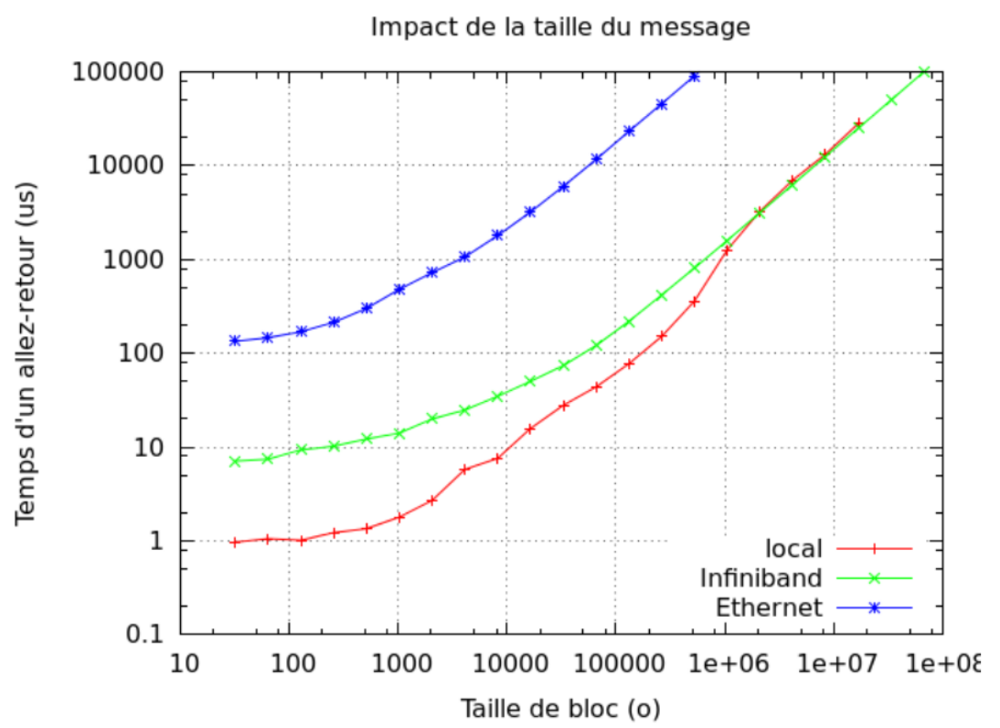

# Lab 4: Distributed-memory programming 实验4：分布式内存编程

## Generalities 一般概念

1. Give the definition of network latency. 1. 给出网络延迟的定义。

2. Give the definition of network bandwidth. 2. 给出网络带宽的定义。

3. Give their respective units. 3. 给出它们各自的单位。

4. Give the name and version of the MPI library you are using. Give the command used to retrieve this information. 4. 给出你正在使用的 MPI 库名称和版本，并写出获取该信息所使用的命令。

5. To make sure your installation works, you can use the hostname command, which returns the name of the current 5. 为了确认你的安装工作正常，你可以使用 `hostname` 命令，它会返回当前
   process’s host: 进程所在主机的名称：
   ```sh
   mpirun -np 2 hostname
   ```
   What happens when all processes are executed on the same host? 当所有进程都在同一台主机上执行时，会发生什么？


## Ping pong 乒乓测试

### Set up 设置

In this exercise, you will do performance measurements using the ping-pong benchmark to familiarize with MPI’s 在本练习中，你将使用 ping-pong 基准测试进行性能测量，以熟悉 MPI 的
characteristics communication times. 通信时间特性。
Start by writing a ping-pong between two MPI processes. Rank 0 will send a message, and rank 1 will receive it. Write 从两个 MPI 进程之间的 ping-pong 程序开始。Rank 0 发送消息，rank 1 接收消息。编写
your code so that you can set the message size as a command-line argument. 代码时要让消息大小可以通过命令行参数设置。

1. The code hereafter is a simple ping from rank 0 to rank 1 (no answer). We have voluntarily added a `sleep(2)` in 1. 下面的代码是一个从 rank 0 到 rank 1 的简单 ping（没有回应）。我们故意在
   the rank 1′s code. rank 1 的代码中加入了 `sleep(2)`。
   ```c
   if (rank == 0) {
     t0 = MPI_Wtime();
     MPI_Send(buffer, size, MPI_CHAR, 1, 0, MPI_COMM_WORLD);
     t1 = MPI_Wtime();
     printf("%lu\t%g\n", size, t1 - t0);
   } else if (rank == 1) {
     sleep(2);
     MPI_Recv(buffer, size, MPI_CHAR, 0, 0, MPI_COMM_WORLD, MPI_STATUS_IGNORE);
   }
   ```
   Using OpenMPI 2.0.1, we measured the execution time as a function of message size. We obtain 53.1654 ms for a size 使用 OpenMPI 2.0.1 时，我们测量了执行时间随消息大小变化的情况。对于大小
   of 4,000 Bytes, and 2.0006 s for a size of 4,096 Bytes. 为 4,000 Bytes 的消息，我们得到 53.1654 ms；而对于 4,096 Bytes，则得到 2.0006 s。
   How do you explain this difference? What did we actually measure? 你如何解释这一差异？我们实际测量到的是什么？

2. Find the message size for which this gap appears in your MPI implementation. This size might be different than the 2. 找出在你的 MPI 实现中出现这一突变的消息大小。这个大小可能与
   one we observed using OpenMPI 2.0.1 (4,096 B). Explain the reason why. 我们在 OpenMPI 2.0.1 中观察到的值（4,096 B）不同。请解释原因。

3. We decide to remove the call to sleep() . Does the measure make sense now? Why? 3. 我们决定去掉对 `sleep()` 的调用。现在这个测量是否有意义？为什么？

4. Propose an alternative to measure the actual sending time of a message (i.e. the time it took to actually receive it 4. 提出一种替代方法，用于测量消息的实际发送时间（即消息真正被目标进程接收所花费的时间）。
   on the target rank). Write the corresponding program. 编写相应的程序。
    It is strongly advised that you read the MPI documentation of the different modes of communications: Standard, 强烈建议你阅读 MPI 关于不同通信模式的文档：Standard（标准）、
    Buffered, Ready, Synchronous, etc. Buffered（缓冲）、Ready（就绪）、Synchronous（同步）等。

5. Write an actual MPI ping-pong (rank 1 answers back to rank 0). Explain why the measured times corresponds to a 5. 编写一个真正的 MPI ping-pong（rank 1 回复 rank 0）。解释为什么测得的时间对应于
   message exchange. 一次消息往返交换。

### First measures 初步测量

1. Do multiple measures with multiples of 32 Bytes for the message sizes. What do you see? 1. 以 32 Bytes 的倍数作为消息大小做多次测量。你看到了什么？

2. We propose adding a barrier before the message exchange phase. Explain what is the interest of this barrier with 2. 我们建议在消息交换阶段之前加入一个 barrier。解释这个 barrier 对于
   regards to the accuracy of the measurements. 提高测量准确性有什么作用。

3. Rerun the measures of question 11. Are the changes from the previous question sufficient? Why? 3. 重新运行第 11 题中的测量。前一个问题中的修改是否足够？为什么？

### Repetitions 重复测量

When taking a measurement, it is important to remember that our environment does not allow us to reproduce the exact 在进行测量时，重要的是要记住：我们的环境并不能保证每次运行都复现完全相同的
conditions between each run. Moreover, time measurement itself is fraught with uncertainty. To solve this problem, we 条件。此外，时间测量本身也充满不确定性。为了解决这个问题，我们
prefer to repeat measurements and calculate an average (mean, think about which one is the best) and a median. 更倾向于重复测量，并计算平均值（mean，想想哪种更合适）以及中位数。
Alternatively, we can repeat runs until, e.g., the 95% confidence interval is within 5% of our reported means. 或者，我们也可以重复运行，直到例如 95% 置信区间落在报告均值的 5% 以内。

1. Update the program to add repetitions. You should now print the average execution time. 1. 更新程序以支持重复测量。你现在应当输出平均执行时间。

### Impact of message size 消息大小的影响

<figure markdown="span">
  
  <figcaption>Fig. 1 - Communication time as a function of message size 图 1 - 通信时间随消息大小变化的关系</figcaption>
</figure>

Fig. 1 shows the evolution of ping-pong time according to message size between intra-node (local) and inter-node 图 1 展示了在节点内（本地）和节点间
(Ethernet and Infiniband) exchanges. Scales are logarithmic. （Ethernet 与 Infiniband）通信中，ping-pong 时间随消息大小变化的趋势。坐标轴使用对数尺度。

1. Explain why there is such a big gap between local and Infiniband for small sizes. 1. 解释为什么在小消息尺寸下，本地通信与 Infiniband 通信之间会有如此大的差距。
   Explain this gap shrinks progressively once the message size increases. 解释为什么随着消息大小增大，这种差距会逐渐缩小。

2. From the previous results, should we send distinct sets of data separately? Or should we try to group them together 2. 根据前面的结果，我们应当分别发送不同的数据集，还是应尽量将它们合并后一起发送？
   Is it true for all sizes? 这对所有消息大小都成立吗？


## Collectives and algorithms in Open MPI Open MPI 中的集合通信与算法

Using a recent version of Open MPI (5.x+), run the command `ompi_info -all`. 使用较新的 Open MPI（5.x 及以上）版本，运行命令 `ompi_info -all`。
This gives you multiple informations about your installation. 这会给出你的安装环境的多种信息。
We will use to know which algorithms are available in the `coll tuned` module of OpenMPI, where blocking collectives are implemented. 我们将借此了解 OpenMPI 的 `coll tuned` 模块中有哪些可用算法，因为阻塞式集合通信就是在该模块中实现的。

1. Find what are the usable algorithms for the `MPI_Bcast` routine. 1. 找出 `MPI_Bcast` 例程可用的算法有哪些。
   Compare their performance depending on the number of MPI processes and buffer size. 比较它们在不同 MPI 进程数和缓冲区大小下的性能。

2. Find what are the usable algorithms for the `MPI_Gather` routine. 2. 找出 `MPI_Gather` 例程可用的算法有哪些。
   Compare their performance depending on the number of MPI processes and buffer size. 比较它们在不同 MPI 进程数和缓冲区大小下的性能。

3. Find what are the usable algorithms for the `MPI_Reduce` routine. 3. 找出 `MPI_Reduce` 例程可用的算法有哪些。
   Compare their performance depending on the number of MPI processes and buffer size. 比较它们在不同 MPI 进程数和缓冲区大小下的性能。

4. Find what are the usable algorithms for the `MPI_Alltoall` routine. 4. 找出 `MPI_Alltoall` 例程可用的算法有哪些。
   Compare their performance depending on the number of MPI processes and buffer size. 比较它们在不同 MPI 进程数和缓冲区大小下的性能。

5. For each collective, why do we need multiple algorithms? 5. 对每一种集合通信来说，为什么我们需要多种算法？


## Experimental evaluation of scalability 可扩展性的实验评估

Let’s start with a very simple benchmark. 让我们从一个非常简单的基准测试开始。
Our MPI program will initially make no communication. 我们的 MPI 程序一开始不进行任何通信。
Have node 0 measure the program’s execution time. 让节点 0 测量程序的执行时间。
It will perform a simple sum of two vectors, in the following form: 它将执行两个向量的简单求和，形式如下：
$$
X_i^{t+1} = X_i^t + c
$$
with $X$ a vector of size $N$ and $c$ a real constant. 其中，$X$ 是大小为 $N$ 的向量，$c$ 是一个实数常量。

Clearly, such an equation can be distributed over several MPI processes without any communication, so we will simply 显然，这样的方程可以在多个 MPI 进程之间分配执行而无需通信，因此我们将仅仅
implement the sum method and execute it in a loop to obtain a suitable execution time for our measurement. 实现该求和方法，并在循环中执行它，以获得适合测量的执行时间。

1. Implement this benchmark like so: 1. 按如下方式实现这个基准测试：
  - Initialize the MPI context   - 初始化 MPI 上下文
  - Pass the vector size and the number of repetitions as parameters of the program   - 将向量大小和重复次数作为程序参数传入
  - Allocate and initialize memory for two vectors. Each node shall compute the sum on a vector of size $\frac{N}{nb_{tasks}$   - 为两个向量分配并初始化内存。每个节点应当在大小为 $\frac{N}{nb_{tasks}$ 的向量上计算求和
  - Make sure to measure the execution time as seen previously in this lab   - 确保按照本实验前面介绍的方法测量执行时间

2. What does strong scalability represent? 2. 强可扩展性表示什么？

3. What does weak scalability represent? 3. 弱可扩展性表示什么？

4. To introduce communications in our program, we want to consider a case inspired by finite elements method (FEM). 4. 为了在程序中引入通信，我们考虑一个受有限元方法（FEM）启发的案例。
   Our equation is now: 现在方程变为：
   $$
   X_i^{t+1} = \frac{X_{i-1}^𝑡 + 2 X_i^t + X_{i+1}^t}{4}
   $$
   Here, MPI slicing requires the addition of communications for border elements. Modify the application in this way 这里，MPI 切分要求为边界元素增加通信。按这种方式修改应用程序
   and evaluate scalability. 并评估其可扩展性。

5. Introduce a global synchronization in the repetitions loop and re-evalute the application’s scalability. What do you 5. 在重复循环中引入全局同步，并重新评估应用程序的可扩展性。你
   see? What remarks can you make about communications and the use of barriers in MPI applications? What should you do 观察到了什么？你能对 MPI 应用中的通信以及 barrier 的使用提出哪些看法？你应该做什么
   to avoid this problem? 来避免这个问题？
