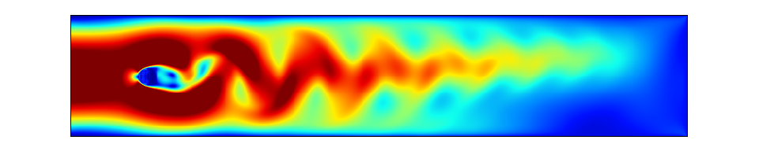
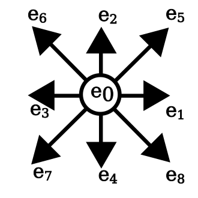
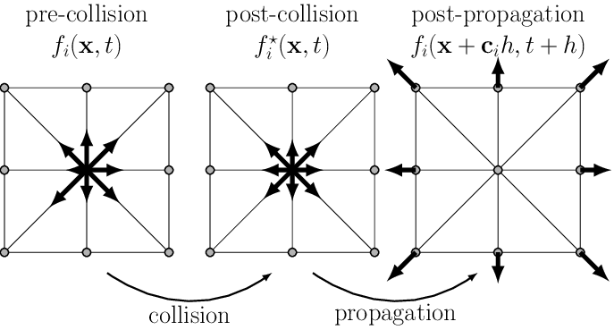
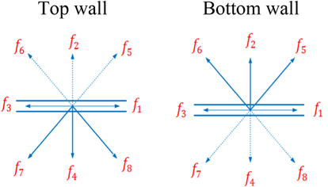
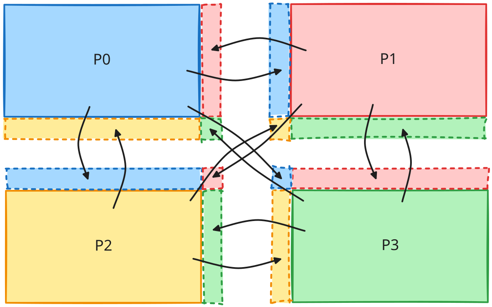

# Project

**Optimization of an hybrid parallel D2Q9 lattice Boltzmann solver for Kármán vortex street.**  
**Kármán 涡街混合并行 D2Q9 格子 Boltzmann 求解器优化。**

  

## Goals

You are tasked with optimizing a numerical simulation to make it as scalable as possible.  
你的任务是优化一个数值模拟程序，使其尽可能具备良好的可扩展性。

The provided code has been intentionally "de-optimized".  
提供的代码被刻意“去优化”了。  
It’s up to you to use every tool at your disposal to identify and eliminate the various bottlenecks in this program.  
你需要使用手头一切可用工具，识别并消除这个程序中的各种瓶颈。  
A performant hybrid MPI+OpenMP implementation is expected.  
预期你实现一个高性能的 MPI+OpenMP 混合并行版本。  
You are free to port the provided code to other programming models (e.g., Kokkos, RAJA, SYCL for shared-memory parallelism; or SHMEM for distributed communications).  
你也可以自由地将给定代码迁移到其他编程模型中，例如用于共享内存并行的 Kokkos、RAJA、SYCL，或用于分布式通信的 SHMEM。  
Ultimately, make the code as fast as possible, so long as it produces the same results as the baseline.  
最终目标是在保持结果与基线实现一致的前提下，让代码尽可能快。

This project is to be done in pairs.  
这个项目需要两人一组完成。


## Submission

### Report

You will submit a succinct and synthetic PDF report presenting your work (max. 10 pages, title page, TOC and appendix excluded; in French or English, at your convenience; preferably typeset in Typst or LaTeX).  
你需要提交一份简洁凝练的 PDF 报告来展示你的工作成果（正文最多 10 页，不含封面、目录和附录；法语或英语均可；推荐使用 Typst 或 LaTeX 排版）。

It should include any attempts (successful or otherwise) to identify performance bottlenecks, as well as the impact these fixes had on performance.  
报告应包含你为识别性能瓶颈所做的各种尝试（无论成功与否），以及这些修复对性能带来的影响。  
If a change does not yield the desired results, feel free to mention it and be critical of your work; this is just as valuable.  
如果某项改动没有达到预期效果，也请明确写出来，并对自己的工作进行批判性分析；这同样具有价值。

At each step of your optimization process, you should:  
在优化过程的每一个阶段，你都应当：

1. Use a tool to identify a bottleneck  
   使用一种工具识别一个瓶颈
2. Propose and implement an optimization to fix the issue  
   提出并实现一种优化来解决该问题
3. Assess the performance impact of the optimization  
   评估该优化对性能的影响

Rely on debugging and profiling tools as much as possible, and demonstrate performance improvements with figures (charts, plots, tables, etc.).  
尽可能依赖调试和性能分析工具，并用图表、曲线、表格等方式展示性能提升。  
Run scalability evaluations regularly to showcase the iterative improvements you have made.  
请定期进行可扩展性评测，以展示你在迭代优化过程中取得的进展。

!!! note

    The report should include a link to a properly-versioned Git repository with all your optimizations.  
    报告中应包含一个版本管理规范的 Git 仓库链接，其中保存你做出的全部优化。

!!! note

    The report should include a section presenting the system configuration used to benchmark the simulation:  
    报告中应包含一个章节，用于说明执行基准测试时所使用的系统配置：

    - Hardware specifications: CPU (architecture, core count, frequency, SIMD ISAs, etc.), DRAM (capacity, frequency, etc.), interconnect (if running on a multi-node system)  
      硬件配置：CPU（架构、核心数、频率、SIMD 指令集等）、DRAM（容量、频率等）、互连网络（如果运行在多节点系统上）
    - Software configuration: compilers (versions, flags, ...), operating system (kernel version, page size, ...), libraries, tools, etc.  
      软件配置：编译器（版本、编译选项等）、操作系统（内核版本、页大小等）、库、工具等。

**Deadline**

The deadline for submitting the report is set to the 2026-04-28 at 23:59 CEST.  
报告提交截止时间为 2026-04-28 23:59（CEST）。  
Send your report by email at [gabriel.dossantos@cea.fr](mailto:gabriel.dossantos@cea.fr) and [hugo.taboada@cea.fr](mailto:hugo.taboada@cea.fr).  
请将报告通过电子邮件发送至 [gabriel.dossantos@cea.fr](mailto:gabriel.dossantos@cea.fr) 和 [hugo.taboada@cea.fr](mailto:hugo.taboada@cea.fr)。

Any report submitted past the deadline will be dismissed and therefore receive a 0/20.  
任何逾期提交的报告都将被拒收，并记为 0/20。

### Oral presentation

You will also prepare a 20 min oral project defense (12 min presentation, 8 min questions) that will be held on the 2026-05-05 (date to be confirmed).  
你还需要准备一次 20 分钟的项目答辩（12 分钟展示，8 分钟问答），时间暂定为 2026-05-05。  
Your presentation should be an exhaustive summary of your report.  
你的展示应当是对报告内容的完整总结。

!!! danger

    **The oral defense is a high-stakes academic exercise.**  
    **口头答辩是一项高要求的学术考核。**

    HPCS M.Sc. students are expected to present a rigorously structured slide deck and deliver a thoroughly prepared defense before the jury.  
    HPCS 硕士生应提交结构严谨的幻灯片，并在评审面前进行充分准备的答辩。  
    This is not a formality, the course instructor and TA will critically assess both the depth of your technical understanding, and the clarity of your scientific communication.  
    这不是走过场，课程教师和助教会严格评估你对技术内容理解的深度，以及你进行科学表达的清晰度。  
    Superficial preparation is not acceptable at this level.  
    在这个层次上，表面化的准备是不可接受的。  
    You are expected to demonstrate mastery of the parallel optimization techniques, stategies, and performance analysis underlying your implementation.  
    你需要展示出对实现背后并行优化技术、策略和性能分析方法的扎实掌握。  
    Treat this defense with the seriousness it demands.  
    请以其应有的严肃态度对待这次答辩。


## Context

### Generalities

The provided code simulates a Kármán vortex street flow.  
给定代码模拟的是 Kármán 涡街流动。  
In fluid dynamics, a Kármán vortex street is a repeating pattern of swirling vortices, caused by a process known as vortex shedding, which is responsible for the unsteady separation of flow of a fluid around blunt bodies.  
在流体力学中，Kármán 涡街是由交替脱落的旋涡构成的重复性结构，它由所谓的“涡脱落”过程产生，并导致流体绕过钝体时发生非定常分离。  
This phenomenon can be observed in nature, for example when wind flows around islands or isolated mountain peaks.  
这一现象在自然界中可以观察到，例如风流经过岛屿或孤立山峰时。  
Historically, this has also been used in studies of airflow around aircraft or buildings.  
历史上，这一现象也被用于研究飞机或建筑物周围的气流。

In our case, we will consider a fluid flowing through a 2D tube in which a round obstacle is placed.  
在本项目中，我们考虑的是流体通过一个带有圆形障碍物的二维管道。  
This is essentially equivalent to simulating a wind tunnel.  
这本质上等价于模拟一个风洞。  
For the solver, we use the lattice Boltzmann method (LBM).  
求解器采用的是格子 Boltzmann 方法（LBM）。

References:  
参考资料：

- [General description](https://en.wikipedia.org/wiki/Lattice_Boltzmann_methods)  
  [总体介绍](https://en.wikipedia.org/wiki/Lattice_Boltzmann_methods)
- [Implementation examples](https://wiki.palabos.org)  
  [实现示例](https://wiki.palabos.org)

### D2Q9 LBM scheme

As explained in the aforementioned documents, LBM models the fluid by spatially discretizing it onto a Cartesian grid.  
如前述资料所述，LBM 通过将流体在空间上离散到笛卡尔网格上来进行建模。  
Within the grid cells, the fluid is broken down at the microscopic level into fluid particles that can move in 9 directions.  
在每个网格单元中，流体在微观层面被表示为可沿 9 个方向运动的流体粒子。  
This is known as the D2Q9 model (2 dimensions, 9 directions/speeds), see figure 1 below.  
这就是所谓的 D2Q9 模型（二维、9 个方向/速度），见下图 1。


  
  <figcaption>Figure 1: A cell of the 2D mesh and its 9 directions<br>图 1：二维网格中的一个单元及其 9 个方向</figcaption>


Each cell carries the following physical quantities:  
每个单元包含以下物理量：

- The microscopic densities of the fluid (probability) moving in the associated direction: $f_1$, $f_2$, $f_3$, $f_4$, $f_5$, $f_6$, $f_7$, $f_8$, $f_9$  
  沿各自方向运动的流体微观密度（概率）：$f_1$, $f_2$, $f_3$, $f_4$, $f_5$, $f_6$, $f_7$, $f_8$, $f_9$
- The macroscopic density at the considered position, obtained by summing the nine microscopic densities:  
  当前位置的宏观密度，由 9 个微观密度求和得到：

$$
\rho (\overrightarrow{x}, t) = \sum_{i=1}^{9} f_i (\overrightarrow{x}, t)
$$

- The macroscopic velocity of the fluid, constructed from a sum of the microscopic densities:  
  流体的宏观速度，由微观密度加权求和构造得到：

$$
v (\overrightarrow{x}, t) = \frac{1}{\rho} \sum_{i=1}^{9} c f_i (\overrightarrow{x}, t) \overrightarrow{e}_i
$$

When visualizing the simulation, we will particularly focus on the norm of the macroscopic velocity.  
在可视化模拟结果时，我们尤其关注宏观速度的模长。


## Simulation implementation

### High-level algorithm

At each time step of the simulation, we need to:  
在模拟的每一个时间步，我们都需要：

1. Apply the particular conditions (boundary condition, obstacle, etc.)  
   应用特殊条件（边界条件、障碍物等）
2. Compute the collisions on the fluid's particles at the microscopic level  
   在微观层面计算流体粒子的碰撞
3. Propagate (stream) the values on each direction  
   沿各方向传播（stream）相应数值

  
  <figcaption>Figure 2: Collision and streaming steps toward neighboring cells<br>图 2：朝向相邻单元的碰撞与传播步骤</figcaption>


### Microscopic collisions

For each fluid cell, at each time step, we need to update the collisions between fluid particles moving in different directions:  
对于每个流体单元，在每个时间步都需要更新不同方向运动粒子之间的碰撞：

1. Compute the macroscopic quantities: density ($\rho$) and velocity ($v$)  
   计算宏观量：密度（$\rho$）和速度（$v$）
2. Use the previous calculation and the $f_i$ values to evaluate the collisions between the 9 fluid particles located at the same position  
   利用上一步结果和 $f_i$ 数值，计算位于同一位置的 9 个流体粒子之间的碰撞
3. Compute the derivative of the Navier-Stokes equation (math details fall outside the scope of this course), given by the following formula:  
   计算 Navier-Stokes 方程导出的表达式（数学细节超出本课程范围），形式如下：

$$
f_i = f_i^{*} - \frac{1}{\tau} (f_i^{*} - f_{eq})
$$

   where:  
   其中：

   - $f_i$ is the new state  
     $f_i$ 是新的状态
   - $f_i^{*}$ is the unstable state obtained after step (1)  
     $f_i^{*}$ 是步骤（1）之后得到的非平衡状态
   - $f_{eq}$ is the equilibrium state toward which the fluid will tend, as given in step (1).  
     $f_{eq}$ 是流体将趋近的平衡态，由步骤（1）给出。  
     Note that the implementation strategy makes the equation dimensionless by using the Reynolds number; therefore, the velocity constant $c$ does not appear in it, as it is absorbed by this last term  
     注意，这里的实现策略通过引入 Reynolds 数将方程无量纲化，因此速度常数 $c$ 不再显式出现，而是被吸收到最后这一项中。  
   - $\frac{1}{\tau}$ represents the characteristic time it takes for the fluid to reach equilibrium.  
     $\frac{1}{\tau}$ 表示流体达到平衡所需的特征时间。  
     This value depends on the fluid's viscosity.  
     该值取决于流体的黏性。

The weights $w_i$ are used to compensate for the fact that the 9 vectors $\overrightarrow{e}_i$ (figure 1) do not all have the same norm.  
权重 $w_i$ 用于补偿 9 个向量 $\overrightarrow{e}_i$（图 1）模长并不相同这一事实。  
The values of these weights are given in (1).  
这些权重的取值在式（1）中给出。

### Left boundary conditions

The left boundary is the fluid's entry point; we therefore consider a steady-state condition with a flow velocity that follows a Poiseuille distribution (the solution for flow in a tube).  
左边界是流体入口，因此我们采用满足 Poiseuille 分布的稳态流速条件（即管道流动的解析解）。  
Roughly speaking, this function yields a velocity profile that is zero at the boundaries (due to wall friction) and maximum at the center.  
粗略来说，这一速度分布在边界处为零（由于壁面摩擦），在中心处达到最大值。

To maintain fluid equilibrium, this flow is introduced using the You/Le method.  
为了维持流体平衡，这一入口流动通过 You/Le 方法施加。  
Specifically, this involves obtaining flow conditions consistent with the constant velocity condition imposed externally and the current state of the fluid portion in contact with the boundary.  
具体而言，这意味着构造一种既满足外部施加的恒定速度条件、又与边界接触处当前流体状态一致的流动条件。

### Right boundary conditions

The same principle applies to You/Le, but instead of maintaining a velocity profile, the goal is to maintain a zero-density gradient.  
右边界同样采用 You/Le 原理，但目标不再是维持速度分布，而是维持零密度梯度。  
In other words, the condition is that the same amount of fluid must pass through the wall (i.e., exit the tube) as must arrive at the wall, while maintaining a non-zero pressure at the end.  
换句话说，该条件要求穿过该边界的流体量与到达边界的流体量相同，也就是流体顺利流出管道，同时末端压力保持非零。

### Top and bottom boundary conditions

These boundaries represent walls, so we apply a simple reflection, just as we would with a photon hitting a mirror or a particle hitting a plate.  
上下边界代表固体壁面，因此我们施加简单反射条件，就像光子撞到镜面或粒子撞到平板一样。  
Friction against the wall also causes the velocity to be zero along its surface.  
壁面摩擦也会导致沿壁面表面的速度为零。

<figure markdown="span">
  
  <figcaption>Figure 3: Top and bottom boundary conditions<br>图 3：上下边界条件</figcaption>
</figure>

### Obstacle conditions

The obstacle behaves like a wall; the same method is used as for the top and bottom boundaries.  
障碍物的处理方式与墙面相同，因此采用与上下边界相同的方法。

### Initial state

The initial condition is assumed to be a steady laminar flow, and thus follows a Poiseuille velocity profile throughout the fluid.  
初始条件假设为稳态层流，因此整个流体区域都满足 Poiseuille 速度分布。  
The density is set to a constant value of 1 for all nodes.  
所有网格节点的密度都设为常数 1。  
At time $t_0$, the obstacle is introduced.  
在时刻 $t_0$，障碍物被引入到流场中。  
The artifact observed during the first few time steps is related to this abrupt introduction.  
前几个时间步中观察到的伪影与这种突兀引入有关。

### Communication scheme

In MPI mode, the mesh is partitioned into subdomains so that the work is distributed across each node.  
在 MPI 模式下，网格会被划分为多个子域，从而将计算工作分配到各个节点上。  
In our case, at each time step, we need to obtain updates for the ghost cells bordering the local domain.  
在本项目中，每个时间步都需要更新本地子域边界上的 ghost cells。

<figure markdown="span">
  
  <figcaption>Figure 4: Halo exchange communication scheme for 4 MPI processes<br>图 4：4 个 MPI 进程的 halo exchange 通信方案</figcaption>
</figure>


## Code

The baseline code is available [here](https://github.com/dssgabriel/TOP-26/tree/main/project).  
基线代码可在 [这里](https://github.com/dssgabriel/TOP-26/tree/main/project) 获取。

### Requirements

**Simulation:**  
**模拟部分：**

- C++ compiler  
  C++ 编译器
- CMake 3.25+  
  CMake 3.25 及以上版本
- MPI implementation (conforming to MPI 3.0+ standard)  
  MPI 实现（符合 MPI 3.0 及以上标准）
- OpenMP (conforming to OpenMP 4.0+ specification)  
  OpenMP（符合 OpenMP 4.0 及以上规范）

**Validation and visualization:**  
**校验与可视化：**

- Python 3.10+  
  Python 3.10 及以上版本
- [uv](https://github.com/astral-sh/uv)  
  [uv](https://github.com/astral-sh/uv)
- Gnuplot  
  Gnuplot
- Compiled `top.display` binary  
  已编译好的 `top.display` 可执行文件

### Build & Run

**Simulation**  
**模拟程序**

Build:  
构建：
```bash
# Configure
cmake -B <BUILD_DIR>

# Compile
cmake --build <BUILD_DIR> -t top.lbm-exe
```

Run:  
运行：
```bash
# Execute with 512 MPI processes
mpirun -np 512 ./<BUILD_DIR>/top.lbm-exe <CONFIG_FILE>
```

**Display helper program**  
**显示辅助程序**

```bash
# Configure
cmake -B <BUILD_DIR>

# Compile
cmake --build <BUILD_DIR> -t top.display
```

### Configuration file

The simulation is configured using a simple `config.txt` text file in the following format:  
该模拟通过一个简单的 `config.txt` 文本文件进行配置，格式如下：
```bash
iterations           = 20000
width                = 800
height               = 160
obstacle_x           = 100.0
obstacle_y           = 80.0
obstacle_r           = 11.0
reynolds             = 100
inflow_max_velocity  = 0.18
output_filename      = results.raw
write_interval       = 100
```

The parameters are:  
参数说明如下：

| Parameter | Description |
| --- | --- |
| `iterations` | Number of time steps<br>时间步数量 |
| `width` | Total width of the mesh<br>网格总宽度 |
| `height` | Total height of the mesh<br>网格总高度 |
| `obstacle_x` | X-axis position of the obstacle<br>障碍物的 x 坐标位置 |
| `obstacle_y` | Y-axis position of the obstacle<br>障碍物的 y 坐标位置 |
| `obstacle_r` | Radius of the obstacle<br>障碍物半径 |
| `reynolds` | Ratio of inertial to viscous forces governing the laminar to turbulent transition regime of the flow<br>惯性力与黏性力之比，用于表征流动从层流向湍流过渡的状态 |
| `inflow_max_velocity` | Maximum inlet flow velocity<br>入口最大流速 |
| `output_filename` | Path of the output `.raw` file (no write if undefined)<br>输出 `.raw` 文件路径（若未定义则不写出） |
| `write_interval` | Number of time step between writes to the output file<br>两次输出写入之间的时间步数 |


### Validate & Visualize

An `lbm-viz` tool is provided to help you validate and visualize LBM simulation results as GIFs.  
提供了一个 `lbm-viz` 工具，帮助你校验并将 LBM 模拟结果可视化为 GIF。

**Local installation**  
**本地安装**

```bash
uv pip install -e .
```

**Usage**  
**用法**

Compare two files (verify checksums):  
比较两个文件（校验校验和）：
```bash
lbm-viz --check ref_results.raw <INPUT>.raw
```
_Run this regularly to validate that your changes don't affect the results of the simulation!_  
_请经常运行此检查，以确认你的修改没有改变模拟结果！_

Generate GIF from `.raw` file:  
从 `.raw` 文件生成 GIF：
```bash
lbm-viz --generate-gif <INPUT>.raw <OUTPUT>.gif
```

Extract frames as PNG:  
将帧提取为 PNG：
```bash
# Defaults to extracting the last frame
lbm-viz --png <INPUT>.raw <OUTPUT>.png

# Extract specific frame as PNG
lbm-viz --png <INPUT>.raw <OUTPUT>.png --frame 0
```

**Options**  
**选项**

| Option | Description | Default |
|--------|-------------|---------|
| `--generate-gif INPUT OUTPUT` | Generate GIF from .raw file<br>从 `.raw` 文件生成 GIF | - |
| `--png INPUT OUTPUT` | Extract frame as PNG<br>提取一帧为 PNG | - |
| `--check REFERENCE INPUT` | Compare INPUT against REFERENCE<br>将 INPUT 与 REFERENCE 比较 | - |
| `--frame N` | Frame index for PNG (0-indexed)<br>PNG 提取的帧编号（从 0 开始） | Last frame<br>最后一帧 |
| `-j, --workers N` | Number of parallel workers<br>并行工作线程数 | Physical cores - 1<br>物理核心数减 1 |
| `-d, --delay N` | GIF frame delay (centiseconds)<br>GIF 帧间延迟（百分之一秒） | 5 |
| `-s WIDTH HEIGHT` | Output dimensions for GIF<br>GIF 输出尺寸 | Auto (mesh × 1.8)<br>自动（网格尺寸 × 1.8） |
| `--cbr MIN MAX` | Colorbar range<br>颜色条范围 | 0.0 - 0.14 |
| `--display-bin-path` | Path to display binary<br>显示程序二进制路径 | `./build/top.display` |

**Development**  
**开发模式**

To run directly without installing locally:  
若不进行本地安装而直接运行：
```bash
uv run python -m lbm_viz --generate-gif results.raw test.gif
```
